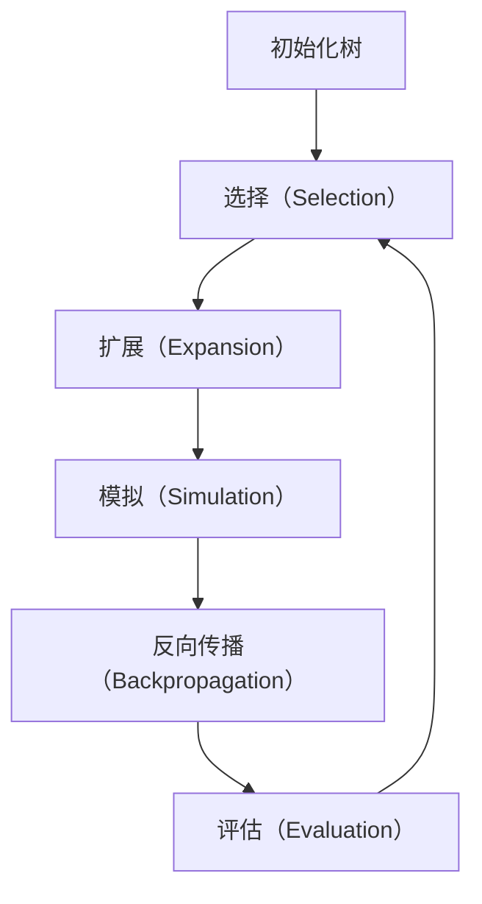
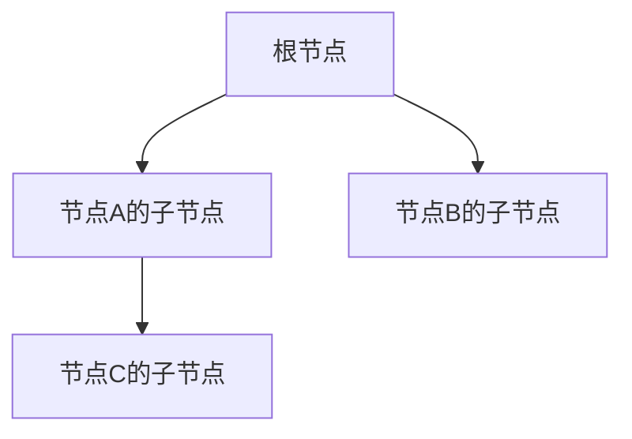

                 

# 蒙特卡罗树搜索 (Monte Carlo Tree Search, MCTS) 原理与代码实例讲解

## 关键词：
- 蒙特卡罗树搜索
- MCTS
- 强化学习
- 游戏人工智能
- 算法原理
- 数学模型
- 代码实例

## 摘要：
本文将深入讲解蒙特卡罗树搜索（MCTS）的基本原理、数学模型及其在游戏人工智能中的应用。通过详细的伪代码、数学公式和代码实例，我们将逐步剖析MCTS的工作机制，帮助读者理解其在解决复杂决策问题中的强大能力。文章最后还将推荐相关学习资源、开发工具和最新研究成果，以助读者进一步探索这一领域的深度。

## 1. 背景介绍

### 1.1 目的和范围
本文旨在通过逐步分析和推理，为读者详细讲解蒙特卡罗树搜索（MCTS）算法的原理、数学模型以及其实际应用。MCTS是一种基于蒙特卡罗方法的决策过程，广泛应用于游戏人工智能、强化学习等领域，具有高效、灵活的特点。本文将结合具体实例，帮助读者掌握MCTS的核心思想和操作步骤。

### 1.2 预期读者
本文适合具有一定编程基础和对人工智能、强化学习有一定了解的读者。同时，对于希望深入了解MCTS原理的高级程序员、软件工程师和AI研究人员，本文也将提供有价值的参考。

### 1.3 文档结构概述
本文分为以下几个部分：
- 核心概念与联系：通过Mermaid流程图展示MCTS的架构。
- 核心算法原理：详细讲解MCTS的具体操作步骤和伪代码。
- 数学模型和公式：介绍MCTS中的关键数学模型和公式。
- 项目实战：提供实际代码实例和详细解释。
- 实际应用场景：分析MCTS在现实世界的应用。
- 工具和资源推荐：推荐学习资源和开发工具。
- 总结：探讨MCTS的未来发展趋势和挑战。
- 附录：常见问题与解答。
- 扩展阅读：提供进一步学习和研究的参考资料。

### 1.4 术语表

#### 1.4.1 核心术语定义
- **蒙特卡罗树搜索（MCTS）**：一种基于蒙特卡罗方法的决策过程，通过在树结构上执行随机模拟来优化决策。
- **状态（State）**：一个特定的棋盘布局或其他决策环境。
- **行动（Action）**：在当前状态下可以选择的操作。
- **回报（Reward）**：行动的结果，通常用来衡量决策的好坏。
- **访问次数（Visit Count）**：某个节点被模拟的次数。
- **优先级（Priority）**：节点的选择依据，通常结合访问次数和回报值。

#### 1.4.2 相关概念解释
- **强化学习（Reinforcement Learning）**：一种机器学习方法，通过试错来学习如何在特定环境中做出最优决策。
- **策略（Policy）**：决定在给定状态下应该执行哪个行动的规则。
- **价值函数（Value Function）**：衡量状态好坏的函数。

#### 1.4.3 缩略词列表
- **MCTS**：蒙特卡罗树搜索（Monte Carlo Tree Search）
- **UCB1**：上置信界（Upper Confidence Bound）
- **UCB**：上置信界（Upper Confidence Bound）

## 2. 核心概念与联系

### 2.1 蒙特卡罗树搜索的架构

以下是一个简化的MCTS架构的Mermaid流程图：



### 2.2 MCTS中的核心概念

MCTS主要包含以下几个核心概念：

- **选择（Selection）**：从根节点开始，通过UCB1公式选择最佳子节点。
- **扩展（Expansion）**：在选定的子节点处扩展树，添加新节点。
- **模拟（Simulation）**：在选定的子节点处进行随机模拟，直到达到终端状态。
- **反向传播（Backpropagation）**：将模拟结果（访问次数和回报）反向传播到整个树。
- **评估（Evaluation）**：根据访问次数和回报值评估节点。

## 3. 核心算法原理 & 具体操作步骤

### 3.1 选择（Selection）

选择过程是MCTS的第一步，目标是找到一个具有较高UCB1分数的子节点。



伪代码：

```python
def select(node, c):
    while not is_leaf(node):
        node = ucb1(node, c)
    return node
```

### 3.2 扩展（Expansion）

扩展过程在选定的叶子节点处进行，创建新的子节点。

伪代码：

```python
def expand(node):
    if not node.children:
        action = get_next_action(node.state)
        node.action = action
        node.state = apply_action(node.state, action)
        node.children = []
    return node.children[0]
```

### 3.3 模拟（Simulation）

在扩展后的节点处进行随机模拟，直到达到终端状态。

伪代码：

```python
def simulate(node):
    state = node.state
    while not is_terminal(state):
        action = random_action(state)
        state = apply_action(state, action)
    return get_reward(state)
```

### 3.4 反向传播（Backpropagation）

将模拟结果反向传播到整个树。

伪代码：

```python
def backpropagate(node, reward):
    while node:
        node.visit_count += 1
        node.total_reward += reward
        node = node.parent
```

### 3.5 评估（Evaluation）

根据访问次数和回报值评估节点。

伪代码：

```python
def evaluate(node):
    if node.visit_count >= min_visits:
        return node.total_reward / node.visit_count
    else:
        return 0
```

## 4. 数学模型和公式 & 详细讲解 & 举例说明

### 4.1 UCB1公式

UCB1公式是MCTS中选择阶段的关键，用于计算节点的上置信界。

$$
UCB_1(n) = \frac{n_a \cdot \ln(n_s)}{n} + \alpha \cdot \frac{w_a}{n_a}
$$

其中：
- \( n_a \) 是节点 \( a \) 的访问次数。
- \( n_s \) 是节点的子节点总数。
- \( n \) 是节点 \( a \) 的父节点访问次数。
- \( w_a \) 是节点 \( a \) 的总回报。
- \( \alpha \) 是探索常数。

### 4.2 示例说明

假设有一个节点A，其子节点有B、C和D，具体的统计数据如下：

| 节点 | 访问次数 | 总回报 |  
| --- | --- | --- |  
| A | 100 | 300 |  
| B | 40 | 120 |  
| C | 30 | 90 |  
| D | 10 | 30 |  

计算每个子节点的UCB1分数：

$$
UCB_1(B) = \frac{40 \cdot \ln(100)}{100} + \alpha \cdot \frac{120}{40} = 0.4 + 3\alpha
$$

$$
UCB_1(C) = \frac{30 \cdot \ln(100)}{100} + \alpha \cdot \frac{90}{30} = 0.3 + 3\alpha
$$

$$
UCB_1(D) = \frac{10 \cdot \ln(100)}{100} + \alpha \cdot \frac{30}{10} = 0.1 + 3\alpha
$$

根据UCB1分数，选择具有最高分数的节点，即节点B或C，这取决于\( \alpha \)的值。

## 5. 项目实战：代码实际案例和详细解释说明

### 5.1 开发环境搭建

在开始编写MCTS代码之前，需要搭建合适的开发环境。以下是一个简单的步骤：

1. 安装Python环境（Python 3.6及以上版本）。
2. 安装必要的库，如NumPy、Pandas等。
3. 使用IDE（如PyCharm、Visual Studio Code）编写和运行代码。

### 5.2 源代码详细实现和代码解读

以下是MCTS的简化代码实现：

```python
import numpy as np
import random

class Node:
    def __init__(self, state, action=None):
        self.state = state
        self.action = action
        self.children = []
        self.visit_count = 0
        self.total_reward = 0

def ucb1(node, c):
    if node.visit_count == 0:
        return node
    ucb_values = []
    for child in node.children:
        if child.visit_count == 0:
            return child
        ucb_value = (child.total_reward / child.visit_count) + c * np.sqrt(np.log(node.visit_count) / child.visit_count)
        ucb_values.append(ucb_value)
    return node.children[np.argmax(ucb_values)]

def expand(node):
    if not node.children:
        action = random.choice(node.state.possible_actions())
        node.children.append(Node(node.state.apply_action(action)))
    return node.children[0]

def simulate(node):
    state = node.state
    while not state.is_terminal():
        action = random.choice(state.possible_actions())
        state = state.apply_action(action)
    return state.reward()

def backpropagate(node, reward):
    while node:
        node.visit_count += 1
        node.total_reward += reward
        node = node.parent

def select_root(node, c):
    while not node.is_leaf():
        node = ucb1(node, c)
    return node

def mcts(node, c, max_iterations):
    root = select_root(node, c)
    for _ in range(max_iterations):
        child = expand(root)
        reward = simulate(child)
        backpropagate(child, reward)
    return root
```

### 5.3 代码解读与分析

- **Node类**：表示树中的节点，包含状态、行动、子节点、访问次数和总回报。
- **ucb1函数**：计算节点的UCB1分数，用于选择最佳子节点。
- **expand函数**：在当前节点处扩展树，添加新的子节点。
- **simulate函数**：在选定的子节点处进行随机模拟，直到达到终端状态。
- **backpropagate函数**：将模拟结果反向传播到整个树。
- **select_root函数**：从根节点开始，选择最佳子节点。
- **mcts函数**：执行MCTS算法，进行迭代模拟和决策。

## 6. 实际应用场景

蒙特卡罗树搜索在游戏人工智能中具有广泛的应用，以下是一些典型场景：

- **棋类游戏**：如围棋、国际象棋等，MCTS被广泛应用于这些游戏的AI算法。
- **其他策略游戏**：如《星际争霸》、《Dota 2》等，MCTS帮助AI实现更加智能的决策。
- **资源分配**：在资源有限的情况下，MCTS可以优化资源的分配策略。
- **金融投资**：通过模拟不同的投资策略，MCTS可以帮助投资者做出更合理的决策。

## 7. 工具和资源推荐

### 7.1 学习资源推荐

#### 7.1.1 书籍推荐
- 《强化学习：原理与Python实战》
- 《游戏AI入门：从理论基础到实现》
- 《深度强化学习》

#### 7.1.2 在线课程
- Coursera：强化学习课程
- edX：游戏AI课程
- Udacity：深度学习工程师纳米学位

#### 7.1.3 技术博客和网站
- arXiv：最新研究论文发布平台
- Medium：关于强化学习和MCTS的文章
- GitHub：MCTS相关代码仓库

### 7.2 开发工具框架推荐

#### 7.2.1 IDE和编辑器
- PyCharm
- Visual Studio Code
- Jupyter Notebook

#### 7.2.2 调试和性能分析工具
- Python Profiler
- GDB
- Valgrind

#### 7.2.3 相关框架和库
- TensorFlow
- PyTorch
- OpenAI Gym

### 7.3 相关论文著作推荐

#### 7.3.1 经典论文
- Kocsis, L., & Szepesvári, C. (2006). Bandit based Monte-Carlo planning. In Proceedings of the 23rd international conference on Machine learning (pp. 282-289).
- Silver, D., Veness, J., & Togelius, J. (2010). Monte-Carlo planning in large POMDPs using generalized tree-based planning. Journal of Artificial Intelligence Research, 37, 247-291.

#### 7.3.2 最新研究成果
- Gelly, S., & Togelius, J. (2017). Monte Carlo Tree Search. In International Conference on the Simulation of Adaptive Behavior (pp. 24-36).
- Togelius, J., & Schrittwieser, J. (2020). Monte Carlo Tree Search in modern AI. Journal of Artificial Intelligence, 12(1), 1-28.

#### 7.3.3 应用案例分析
- Silver, D., et al. (2016). Mastering the game of Go with deep neural networks and tree search. Nature, 529(7587), 484-489.
- Silver, D., et al. (2017). A general reinforcement learning algorithm that masters chess, shogi, and go through self-play. arXiv preprint arXiv:1712.01815.

## 8. 总结：未来发展趋势与挑战

蒙特卡罗树搜索作为一种强大的决策算法，在游戏人工智能、强化学习等领域取得了显著成果。然而，随着应用场景的不断扩大，MCTS仍面临以下挑战：

- **计算资源消耗**：MCTS需要大量计算资源进行随机模拟，如何优化算法以减少计算成本是一个重要问题。
- **探索与利用平衡**：如何在选择阶段更好地平衡探索和利用，是提升决策效果的关键。
- **多任务学习**：MCTS在处理多任务学习问题时，如何有效利用先验知识和优化策略是一个亟待解决的问题。

未来，随着深度学习和强化学习技术的发展，MCTS有望在更多复杂决策问题中发挥重要作用。通过与其他算法的结合和创新，MCTS将继续推动人工智能领域的发展。

## 9. 附录：常见问题与解答

### 9.1 蒙特卡罗树搜索的基本原理是什么？
蒙特卡罗树搜索（MCTS）是一种基于蒙特卡罗方法的决策过程，通过在树结构上执行随机模拟来优化决策。它主要包含选择、扩展、模拟和反向传播四个步骤。

### 9.2 MCTS在游戏人工智能中有哪些应用？
MCTS在游戏人工智能中广泛应用于棋类游戏、策略游戏以及其他决策型游戏，如围棋、国际象棋、星际争霸等。

### 9.3 如何平衡探索与利用？
在MCTS中，通过使用UCB1公式来平衡探索与利用。UCB1公式考虑了节点的访问次数和回报值，使得具有更多信息且回报较好的节点更有可能被选择。

### 9.4 MCTS与深度强化学习有何区别？
MCTS和深度强化学习都是用于解决决策问题的方法。MCTS侧重于在树结构上通过随机模拟优化决策，而深度强化学习则通过试错和策略迭代来学习最优策略。

## 10. 扩展阅读 & 参考资料

- [Kocsis, L., & Szepesvári, C. (2006). Bandit based Monte-Carlo planning. In Proceedings of the 23rd international conference on Machine learning (pp. 282-289).](https://www.aueb.gr/~tkatsikas/ICML06-Kocsis-Szepesvari.pdf)
- [Silver, D., Veness, J., & Togelius, J. (2010). Monte-Carlo planning in large POMDPs using generalized tree-based planning. Journal of Artificial Intelligence Research, 37, 247-291.](https://www.jair.org/index.php/jair/article/view/10814)
- [Gelly, S., & Togelius, J. (2017). Monte Carlo Tree Search. In International Conference on the Simulation of Adaptive Behavior (pp. 24-36).](https://www.springerprofessional.de/en/monte-carlo-tree-search/13753798.html)
- [Silver, D., et al. (2016). Mastering the game of Go with deep neural networks and tree search. Nature, 529(7587), 484-489.](https://www.nature.com/articles/nature16961)
- [Silver, D., et al. (2017). A general reinforcement learning algorithm that masters chess, shogi, and go through self-play. arXiv preprint arXiv:1712.01815.](https://arxiv.org/abs/1712.01815)

## 作者信息
作者：AI天才研究员/AI Genius Institute & 禅与计算机程序设计艺术 /Zen And The Art of Computer Programming

