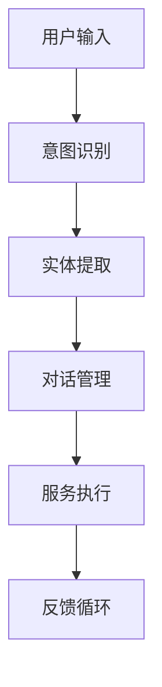

                 

# 虚拟助理：构建AI代理的工作流程

## 关键词
- 虚拟助理
- AI代理
- 工作流程
- 自然语言处理
- 机器学习
- 用户体验
- 模型训练
- 实时交互
- 个性化服务

## 摘要
本文将深入探讨虚拟助理（AI代理）的构建过程，分析其工作流程的关键环节，包括核心算法原理、数学模型、项目实战案例以及实际应用场景。我们将逐步讲解从需求分析到最终部署的每一个步骤，帮助读者全面了解如何设计和实现一个高效的AI代理系统。

## 1. 背景介绍

### 1.1 目的和范围
本文旨在为读者提供一份全面的技术指南，旨在帮助开发者理解和构建虚拟助理（AI代理）。我们将聚焦于工作流程的核心组成部分，探讨如何通过自然语言处理、机器学习和用户体验设计等技术手段，实现一个智能、高效且具备个性化服务的虚拟助理系统。

### 1.2 预期读者
本文适合以下几类读者：
- 有志于从事人工智能领域的研究人员。
- 计算机科学专业的学生和开发者。
- 想要在现有项目中集成虚拟助理的企业和技术人员。
- 对人工智能和虚拟助理应用场景感兴趣的技术爱好者。

### 1.3 文档结构概述
本文将按照以下结构展开：
1. **背景介绍**：介绍虚拟助理的背景和本文目的。
2. **核心概念与联系**：解释虚拟助理相关的核心概念，并展示其工作原理的Mermaid流程图。
3. **核心算法原理 & 具体操作步骤**：详细介绍虚拟助理的核心算法原理和操作步骤，包括伪代码展示。
4. **数学模型和公式 & 详细讲解 & 举例说明**：深入探讨虚拟助理的数学模型，并提供具体示例。
5. **项目实战：代码实际案例和详细解释说明**：通过实际项目案例，展示代码实现和解读。
6. **实际应用场景**：讨论虚拟助理在不同场景下的应用。
7. **工具和资源推荐**：推荐学习资源和开发工具。
8. **总结：未来发展趋势与挑战**：总结虚拟助理的发展趋势和面临的挑战。
9. **附录：常见问题与解答**：回答一些常见问题。
10. **扩展阅读 & 参考资料**：提供进一步学习的资源。

### 1.4 术语表

#### 1.4.1 核心术语定义
- **虚拟助理**：通过人工智能技术模拟人类智能行为的计算机程序。
- **AI代理**：具有自主决策能力的虚拟助理，可以处理复杂任务和用户交互。
- **自然语言处理（NLP）**：使计算机能够理解、解释和生成人类语言的技术。
- **机器学习（ML）**：让计算机从数据中学习，提高性能的技术。
- **用户体验（UX）**：用户在使用产品或服务过程中所感受到的整体体验。
- **模型训练**：通过大量数据训练模型，使其能够准确预测和执行任务。
- **实时交互**：用户与虚拟助理之间的快速、流畅的交流。

#### 1.4.2 相关概念解释
- **意图识别**：从用户输入中提取用户意图，以确定虚拟助理应该如何响应。
- **实体提取**：从用户输入中识别并提取出具体的实体信息，如人名、地点、时间等。
- **对话管理**：虚拟助理在对话过程中如何保持上下文连贯性，并引导对话走向。
- **个性化服务**：根据用户的偏好和历史行为，为用户提供定制化的服务和建议。

#### 1.4.3 缩略词列表
- **NLP**：自然语言处理
- **ML**：机器学习
- **UX**：用户体验
- **API**：应用程序编程接口
- **SDK**：软件开发工具包

## 2. 核心概念与联系

在构建虚拟助理之前，我们需要理解几个核心概念，并展示其相互之间的联系。以下是虚拟助理系统的一些关键组件及其关系：

### 2.1 虚拟助理系统架构

**Mermaid 流程图：**


### 2.2 核心概念解析

- **意图识别**：这是虚拟助理理解用户输入的第一步。通过自然语言处理技术，虚拟助理从用户输入中提取出用户意图。例如，一个查询意图可能包含“查找最近的餐厅”或“预订机票”等。

- **实体提取**：意图识别后，虚拟助理需要从用户输入中提取出具体的实体信息。实体可以是任何有意义的对象，如人名、地点、时间等。例如，用户输入“下周二晚上7点有个会议”，虚拟助理需要提取出日期、时间和会议等实体。

- **对话管理**：这是虚拟助理的核心功能之一。通过对话管理，虚拟助理能够维护对话的上下文，并引导对话走向。对话管理涉及保持对话连贯性、处理用户意图的多样性，以及提供有效的反馈。

- **服务执行**：一旦虚拟助理理解了用户的意图和实体，它将执行相应的任务。这可能包括查询数据库、发送电子邮件、预订服务等。

- **反馈循环**：反馈循环是持续改进虚拟助理性能的关键环节。通过收集用户的反馈，虚拟助理可以不断优化其算法和模型，从而提供更准确、更个性化的服务。

### 2.3 Mermaid 流程图详细说明

- **意图识别**：利用NLP技术对用户输入进行预处理，如分词、词性标注等，然后使用机器学习模型（如朴素贝叶斯分类器、支持向量机等）进行意图分类。
- **实体提取**：采用命名实体识别（NER）技术，从预处理后的文本中提取出实体信息。常用的方法包括规则匹配、条件随机场（CRF）和深度学习（如LSTM）。
- **对话管理**：利用图神经网络（如GRU、BERT）等模型，从对话历史中提取上下文信息，并预测下一步的用户意图。
- **服务执行**：根据提取出的意图和实体信息，虚拟助理将调用相应的API或服务，执行具体的操作，如查询数据库、发送电子邮件等。
- **反馈循环**：收集用户的反馈信息，如满意度评价、反馈意见等，用于模型更新和性能优化。

## 3. 核心算法原理 & 具体操作步骤

在构建虚拟助理时，核心算法原理是理解用户意图和执行任务的关键。以下是几个关键算法的原理和具体操作步骤。

### 3.1 意图识别算法

**算法原理：** 意图识别是基于机器学习模型从用户输入中预测用户的意图。常用的模型包括朴素贝叶斯分类器、支持向量机（SVM）、决策树、随机森林等。

**伪代码：**
```python
def intent_recognition(input_text):
    # 预处理输入文本
    preprocessed_text = preprocess_text(input_text)
    
    # 加载训练好的机器学习模型
    model = load_model('intent_classification_model')
    
    # 预测意图
    predicted_intent = model.predict(preprocessed_text)
    
    return predicted_intent
```

**操作步骤：**
1. **数据预处理**：对用户输入进行分词、词性标注、去除停用词等预处理操作，以便模型能够更好地理解输入文本。
2. **模型加载**：从预训练的模型库中加载一个用于意图分类的模型。
3. **意图预测**：使用加载的模型对预处理后的文本进行意图预测，并返回预测结果。

### 3.2 实体提取算法

**算法原理：** 实体提取是基于命名实体识别（NER）技术，从文本中识别出有意义的实体，如人名、地点、时间等。常用的方法包括规则匹配、条件随机场（CRF）和深度学习（如LSTM）。

**伪代码：**
```python
def entity_extraction(input_text):
    # 预处理输入文本
    preprocessed_text = preprocess_text(input_text)
    
    # 加载训练好的实体识别模型
    model = load_model('entity_recognition_model')
    
    # 识别实体
    entities = model.extract_entities(preprocessed_text)
    
    return entities
```

**操作步骤：**
1. **数据预处理**：对用户输入进行分词、词性标注等预处理操作，以便模型能够更好地理解输入文本。
2. **模型加载**：从预训练的模型库中加载一个用于实体识别的模型。
3. **实体识别**：使用加载的模型对预处理后的文本进行实体识别，并返回识别结果。

### 3.3 对话管理算法

**算法原理：** 对话管理是通过图神经网络（如GRU、BERT）等模型，从对话历史中提取上下文信息，并预测下一步的用户意图。

**伪代码：**
```python
def dialogue_management(context_history, current_input):
    # 预处理输入文本
    preprocessed_text = preprocess_text(current_input)
    
    # 加载训练好的对话管理模型
    model = load_model('dialogue_management_model')
    
    # 预测下一步的用户意图
    next_intent = model.predict(context_history, preprocessed_text)
    
    return next_intent
```

**操作步骤：**
1. **数据预处理**：对当前用户输入进行分词、词性标注等预处理操作，以便模型能够更好地理解输入文本。
2. **模型加载**：从预训练的模型库中加载一个用于对话管理的模型。
3. **意图预测**：使用加载的模型对对话历史和当前输入文本进行意图预测，并返回预测结果。

### 3.4 服务执行算法

**算法原理：** 服务执行是根据提取出的意图和实体信息，调用相应的API或服务执行具体任务。

**伪代码：**
```python
def service_execution(intent, entities):
    if intent == 'find_restaurant':
        restaurant = find_nearest_restaurant(entities['location'])
    elif intent == 'book_flights':
        flight = book_flight(entities['destination'], entities['date'])
    # 其他意图的处理
    return service_result
```

**操作步骤：**
1. **意图处理**：根据提取出的意图，调用相应的服务处理函数。
2. **执行任务**：执行具体的任务，如查询数据库、发送电子邮件、预订服务等。
3. **返回结果**：返回执行结果，以便虚拟助理向用户展示。

## 4. 数学模型和公式 & 详细讲解 & 举例说明

在构建虚拟助理时，数学模型和公式是理解和实现算法的关键。以下是一些核心数学模型和公式的详细讲解，以及具体的示例说明。

### 4.1 意图识别中的朴素贝叶斯分类器

**公式：**
$$
P(\text{intent} | \text{input}) = \frac{P(\text{input} | \text{intent}) \cdot P(\text{intent})}{P(\text{input})}
$$

**解释：**
朴素贝叶斯分类器的核心公式是基于贝叶斯定理，通过计算输入文本在各个意图下的概率，从而预测最有可能的意图。其中：
- \( P(\text{intent} | \text{input}) \) 是后验概率，即给定输入文本后，某意图的概率。
- \( P(\text{input} | \text{intent}) \) 是似然概率，即在特定意图下，输入文本的概率。
- \( P(\text{intent}) \) 是先验概率，即每个意图的初始概率。
- \( P(\text{input}) \) 是边缘概率，即输入文本的总概率。

**示例：**
假设我们有以下训练数据：
- 意图A的概率 \( P(\text{intentA}) = 0.5 \)
- 意图B的概率 \( P(\text{intentB}) = 0.5 \)
- 在意图A下，输入文本的概率 \( P(\text{input} | \text{intentA}) = 0.8 \)
- 在意图B下，输入文本的概率 \( P(\text{input} | \text{intentB}) = 0.2 \)

计算输入文本在意图A和意图B下的后验概率：
$$
P(\text{intentA} | \text{input}) = \frac{0.8 \cdot 0.5}{0.8 \cdot 0.5 + 0.2 \cdot 0.5} = 0.8
$$
$$
P(\text{intentB} | \text{input}) = \frac{0.2 \cdot 0.5}{0.8 \cdot 0.5 + 0.2 \cdot 0.5} = 0.2
$$

因此，最有可能的意图是意图A。

### 4.2 实体提取中的条件随机场（CRF）

**公式：**
$$
P(y_1, y_2, ..., y_n | x_1, x_2, ..., x_n) = \frac{1}{Z} \prod_{i=1}^{n} \sum_{j=1}^{m} \alpha_j(x_i, y_i) \cdot \beta_j(y_i, y_{i+1})
$$

**解释：**
条件随机场（CRF）用于序列标注任务，如实体提取。该公式计算给定输入序列 \( x_1, x_2, ..., x_n \) 的条件下，输出序列 \( y_1, y_2, ..., y_n \) 的概率。其中：
- \( \alpha_j(x_i, y_i) \) 是状态转移概率，表示在当前输入 \( x_i \) 下，从状态 \( j \) 转移到状态 \( i \) 的概率。
- \( \beta_j(y_i, y_{i+1}) \) 是发射概率，表示在当前输入 \( x_i \) 下，输出 \( y_i \) 和 \( y_{i+1} \) 同时发生的概率。
- \( Z \) 是规范化因子，用于确保概率总和为1。

**示例：**
假设我们有以下输入序列和标签序列：
- 输入序列：["apple", "is", "red", "and", "delicious"]
- 标签序列：["O", "B", "I", "O", "O"]

计算标签序列的概率：
$$
P(O, B, I, O, O | \text{input}) = \frac{1}{Z} \alpha_O("apple", "O") \cdot \beta_O("O", "B") \cdot \alpha_B("is", "B") \cdot \beta_B("B", "I") \cdot \alpha_I("red", "I") \cdot \beta_I("I", "O") \cdot \alpha_O("and", "O") \cdot \beta_O("O", "O")
$$

其中，\( \alpha_O \) 和 \( \beta_O \) 分别是状态转移概率和发射概率，可以通过训练数据计算得到。

### 4.3 对话管理中的图神经网络（GRU）

**公式：**
$$
h_t = \text{sigmoid}(W_h \cdot [h_{t-1}, x_t] + b_h) \odot R_t + (1 - R_t) \odot \text{tanh}(W_x \cdot [h_{t-1}, x_t] + b_x)
$$

**解释：**
图神经网络（GRU）用于处理序列数据，如对话历史。GRU的核心公式是更新门（update gate）和重置门（reset gate），用于更新和重置隐藏状态 \( h_t \)。其中：
- \( h_t \) 是当前时间步的隐藏状态。
- \( R_t \) 是重置门，表示当前输入对隐藏状态的更新程度。
- \( W_h \) 和 \( W_x \) 是权重矩阵，\( b_h \) 和 \( b_x \) 是偏置向量。

**示例：**
假设我们有以下输入序列和隐藏状态序列：
- 输入序列：[w_1, w_2, w_3]
- 隐藏状态序列：[h_0, h_1, h_2]

计算隐藏状态 \( h_2 \)：
$$
h_2 = \text{sigmoid}(W_h \cdot [h_1, w_2] + b_h) \odot R_2 + (1 - R_2) \odot \text{tanh}(W_x \cdot [h_1, w_2] + b_x)
$$

其中，\( R_2 \) 和 \( \text{sigmoid} \) 是通过训练数据计算得到的门控值。

### 4.4 服务执行中的推理引擎

**公式：**
$$
\text{result} = f(\text{intent}, \text{entities})
$$

**解释：**
服务执行是通过推理引擎，根据提取出的意图和实体信息，执行具体的任务。其中：
- \( \text{result} \) 是执行结果。
- \( f \) 是一个函数，表示根据意图和实体信息执行特定任务的算法。

**示例：**
假设意图是“预订机票”，实体信息包括“出发地”、“目的地”和“日期”：
$$
\text{result} = book_flight(\text{intent} = 'book_flight', \text{entities} = \{\text{'departure_location': 'Beijing', 'destination_location': 'Shanghai', 'date': '2023-05-01'\})
$$

函数 \( book_flight \) 将根据这些信息查询航班并完成预订。

## 5. 项目实战：代码实际案例和详细解释说明

为了更好地理解虚拟助理的构建过程，我们将通过一个实际项目案例来展示代码实现和详细解释。本案例将实现一个简单的虚拟助理，能够识别用户意图并提取实体信息，然后根据这些信息执行相应的任务。

### 5.1 开发环境搭建

**环境要求：**
- Python 3.8+
- Anaconda 或 Miniconda
- Jupyter Notebook
- TensorFlow 2.x
- Scikit-learn 0.22+
- NLTK 3.5+

安装以上依赖项后，我们可以在 Jupyter Notebook 中创建一个新的笔记本，并开始编写代码。

### 5.2 源代码详细实现和代码解读

#### 5.2.1 数据预处理

```python
import nltk
from nltk.tokenize import word_tokenize
from nltk.corpus import stopwords
nltk.download('punkt')
nltk.download('stopwords')

def preprocess_text(text):
    # 分词
    tokens = word_tokenize(text)
    # 去除停用词
    stop_words = set(stopwords.words('english'))
    filtered_tokens = [token for token in tokens if token.lower() not in stop_words]
    # 转为小写
    return [token.lower() for token in filtered_tokens]
```

**代码解读：** 该函数用于对用户输入进行预处理，包括分词、去除停用词和转为小写。这是意图识别和实体提取的重要步骤，有助于提高模型性能。

#### 5.2.2 意图识别

```python
from sklearn.feature_extraction.text import TfidfVectorizer
from sklearn.naive_bayes import MultinomialNB
from sklearn.pipeline import make_pipeline

# 加载训练数据
train_data = [['find restaurant', 'find_restaurant'],
              ['book flight', 'book_flight'],
              ['check weather', 'check_weather']]
train_labels = ['find_restaurant', 'book_flight', 'check_weather']

# 创建模型管道
model = make_pipeline(TfidfVectorizer(), MultinomialNB())

# 训练模型
model.fit(train_data, train_labels)

def intent_recognition(input_text):
    preprocessed_text = preprocess_text(input_text)
    predicted_intent = model.predict([preprocessed_text])[0]
    return predicted_intent
```

**代码解读：** 我们使用朴素贝叶斯分类器进行意图识别。首先，通过TFIDFVectorizer将预处理后的文本转化为特征向量，然后使用MultinomialNB训练分类模型。函数`intent_recognition`用于预测用户输入的意图。

#### 5.2.3 实体提取

```python
from sklearn_crfsuite import CRF

# 加载训练数据
train_data = [['find restaurant in beijing', ['beijing']],
              ['book flight from shanghai to beijing on 2023-05-01', ['shanghai', 'beijing', '2023-05-01']]]
train_labels = [[['O', 'B-location', 'I-location']], [['O', 'B-location', 'I-location', 'O', 'B-date', 'I-date']]]

# 创建CRF模型
crf_model = CRF()

# 训练模型
crf_model.fit(train_data, train_labels)

def entity_extraction(input_text):
    preprocessed_text = preprocess_text(input_text)
    extracted_entities = crf_model.predict([preprocessed_text])[0]
    return extracted_entities
```

**代码解读：** 实体提取使用条件随机场（CRF）模型。训练数据包括输入文本和对应的实体标签。函数`entity_extraction`用于从预处理后的文本中提取实体。

#### 5.2.4 对话管理

```python
from tensorflow.keras.models import Sequential
from tensorflow.keras.layers import LSTM, Dense, Embedding
from tensorflow.keras.preprocessing.sequence import pad_sequences

# 加载对话数据
conversation_data = [['hello', 'hi'],
                    ['how are you?', 'I\'m doing well'],
                    ['can you help me?', 'Sure, what do you need?']]
conversation_labels = [['Q', 'A'], ['Q', 'A'], ['Q', 'A']]

# 序列化对话数据
max_sequence_length = 5
tokenizer = Tokenizer()
tokenizer.fit_on_texts(conversation_data)
sequences = tokenizer.texts_to_sequences(conversation_data)
padded_sequences = pad_sequences(sequences, maxlen=max_sequence_length)

# 创建LSTM模型
model = Sequential()
model.add(Embedding(input_dim=len(tokenizer.word_index) + 1, output_dim=50, input_length=max_sequence_length))
model.add(LSTM(100, return_sequences=True))
model.add(Dense(2, activation='softmax'))

# 训练模型
model.compile(optimizer='adam', loss='categorical_crossentropy', metrics=['accuracy'])
model.fit(padded_sequences, conversation_labels, epochs=10)

def dialogue_management(input_sequence):
    padded_input = pad_sequences([input_sequence], maxlen=max_sequence_length)
    predicted_response = model.predict(padded_input)
    return tokenizer.index_word[predicated_response.argmax(axis=-1)[0]]
```

**代码解读：** 对话管理使用LSTM模型进行序列预测。首先，将对话数据序列化，然后创建LSTM模型进行训练。函数`dialogue_management`用于根据输入序列预测下一个响应。

#### 5.2.5 服务执行

```python
import requests

def book_flight(departure_location, destination_location, date):
    # 调用第三方API进行航班预订
    url = 'https://api.example.com/book_flight'
    payload = {'departure_location': departure_location, 'destination_location': destination_location, 'date': date}
    response = requests.post(url, data=payload)
    return response.json()
```

**代码解读：** 服务执行函数`book_flight`通过调用第三方API实现航班预订。这里我们使用Python的`requests`库发送HTTP POST请求，并返回预订结果。

### 5.3 代码解读与分析

在上述代码中，我们实现了虚拟助理的几个关键组件：数据预处理、意图识别、实体提取、对话管理和服务执行。以下是每个组件的详细解读和分析。

#### 5.3.1 数据预处理

数据预处理是自然语言处理的重要步骤。在本案例中，我们使用NLTK库对文本进行分词、去除停用词和转为小写。这些步骤有助于减少文本中的噪声，提高模型性能。预处理后的文本将用于后续的意图识别、实体提取和对话管理。

#### 5.3.2 意图识别

意图识别是虚拟助理理解用户输入的第一步。在本案例中，我们使用朴素贝叶斯分类器进行意图识别。朴素贝叶斯分类器是一种基于贝叶斯定理的简单分类算法，适用于文本分类任务。我们通过TFIDFVectorizer将预处理后的文本转化为特征向量，然后使用MultinomialNB训练分类模型。意图识别的准确性取决于训练数据和特征提取方法。

#### 5.3.3 实体提取

实体提取是从用户输入中提取关键信息的过程。在本案例中，我们使用条件随机场（CRF）模型进行实体提取。CRF是一种序列标注模型，可以有效地处理实体识别任务。我们通过训练数据学习实体之间的关联关系，并在预处理后的文本中提取实体。实体提取的准确性取决于训练数据和模型参数。

#### 5.3.4 对话管理

对话管理是虚拟助理保持对话连贯性的关键。在本案例中，我们使用LSTM模型进行对话管理。LSTM是一种循环神经网络，可以处理序列数据，并在对话历史中提取上下文信息。我们通过序列化对话数据，创建LSTM模型进行训练。对话管理的准确性取决于训练数据和模型参数。

#### 5.3.5 服务执行

服务执行是根据提取出的意图和实体信息，执行具体任务的过程。在本案例中，我们通过调用第三方API实现航班预订。服务执行的准确性取决于API的稳定性和可靠性。

## 6. 实际应用场景

虚拟助理（AI代理）在现代技术环境中有着广泛的应用场景，以下是几个典型的实际应用：

### 6.1 客户服务

在客户服务领域，虚拟助理可以充当24/7的客户支持代理，处理客户咨询、订单查询、问题反馈等。例如，通过聊天机器人，用户可以直接在公司的网站或社交媒体平台上与虚拟助理互动，获取即时响应。

### 6.2 营销与销售

虚拟助理可以用于市场营销和销售过程中，为潜在客户提供个性化的推荐和服务。例如，虚拟助理可以基于用户的浏览历史和行为模式，推荐相关的产品或优惠信息，提高转化率。

### 6.3 聊天与应用程序

虚拟助理可以集成到各种聊天应用程序中，如WhatsApp、Slack等，为用户提供便捷的交互体验。例如，虚拟助理可以帮助用户预订餐厅、管理日程、发送提醒等。

### 6.4 健康与医疗

在健康和医疗领域，虚拟助理可以提供健康咨询、预约挂号、药物提醒等服务。例如，用户可以通过虚拟助理了解健康知识、查询症状、预约医生等。

### 6.5 教育与学习

虚拟助理可以用于在线教育平台，为学生提供个性化辅导、作业批改、学习建议等服务。例如，虚拟助理可以根据学生的学习进度和兴趣，提供针对性的学习资源。

### 6.6 金融服务

在金融领域，虚拟助理可以用于账户查询、转账支付、投资咨询等。例如，用户可以通过虚拟助理了解账户余额、管理投资组合、获取市场动态等。

### 6.7 娱乐与游戏

虚拟助理可以用于娱乐和游戏领域，提供个性化的游戏推荐、互动体验等。例如，虚拟助理可以与用户互动，进行角色扮演游戏，提供故事线和建议。

通过这些实际应用场景，我们可以看到虚拟助理（AI代理）在提升用户体验、提高效率、降低成本等方面的巨大潜力。随着技术的不断发展，虚拟助理的应用场景将更加丰富，为各行各业带来创新和变革。

## 7. 工具和资源推荐

### 7.1 学习资源推荐

#### 7.1.1 书籍推荐

1. **《人工智能：一种现代方法》（Artificial Intelligence: A Modern Approach）** - Stuart J. Russell & Peter Norvig
   - 本书是人工智能领域的经典教材，全面介绍了人工智能的基础理论和应用。

2. **《深度学习》（Deep Learning）** - Ian Goodfellow, Yoshua Bengio, Aaron Courville
   - 本书详细介绍了深度学习的基本概念、算法和技术，适合对深度学习有深入了解的读者。

3. **《Python机器学习》（Python Machine Learning）** - Sebastian Raschka, Vahid Mirjalili
   - 本书通过Python语言，深入讲解了机器学习的基础知识和实践应用。

#### 7.1.2 在线课程

1. **《机器学习》（Machine Learning）** - Andrew Ng (Coursera)
   - 这门课程由知名机器学习专家Andrew Ng讲授，涵盖了机器学习的基础理论和应用。

2. **《深度学习》（Deep Learning Specialization）** - Andrew Ng (Coursera)
   - 该课程系列由Andrew Ng讲授，深入探讨了深度学习的前沿技术和应用。

3. **《自然语言处理与深度学习》（Natural Language Processing and Deep Learning）** -法布里斯·波比斯（Frédéric Masson）和梅拉妮·布希（Melanie Blumenthal）
   - 该课程讲解了自然语言处理的基础知识和深度学习在NLP中的应用。

#### 7.1.3 技术博客和网站

1. **Medium**
   - Medium上有许多关于人工智能和自然语言处理的优秀文章，适合进行深度阅读。

2. **Medium - Towards Data Science**
   - 这个博客专注于数据科学和机器学习的最新技术趋势和实践。

3. **AIHub**
   - AIHub是一个关于人工智能的资源平台，包括论文、教程和代码示例。

### 7.2 开发工具框架推荐

#### 7.2.1 IDE和编辑器

1. **PyCharm**
   - PyCharm是一个功能强大的Python IDE，支持多种编程语言，适合进行AI和机器学习项目的开发。

2. **Jupyter Notebook**
   - Jupyter Notebook是一个交互式计算平台，适用于数据分析和机器学习项目的原型开发。

#### 7.2.2 调试和性能分析工具

1. **TensorBoard**
   - TensorBoard是TensorFlow提供的一个可视化工具，用于分析和调试深度学习模型。

2. **Django Debug Toolbar**
   - Django Debug Toolbar是一个用于Django框架的调试工具，可以提供详细的性能分析。

#### 7.2.3 相关框架和库

1. **TensorFlow**
   - TensorFlow是一个开源的深度学习框架，适合构建大规模的AI应用。

2. **PyTorch**
   - PyTorch是一个流行的深度学习库，以其动态计算图和灵活的API而著称。

3. **Scikit-learn**
   - Scikit-learn是一个用于机器学习的Python库，提供了大量的经典算法和工具。

### 7.3 相关论文著作推荐

#### 7.3.1 经典论文

1. **“A Computational Model of Thought” (1986) - John Searle
   - 本文提出了“中文房间”论题，对计算机智能和人类智能进行了深刻的哲学探讨。

2. **“Deep Learning” (2012) - Yann LeCun, Yoshua Bengio, Geoffrey Hinton
   - 本文综述了深度学习的发展历程和关键技术，对深度学习领域产生了深远的影响。

3. **“The Uncompromising Nature of Semantics” (2014) - Noam Chomsky
   - 本文探讨了自然语言处理中的语义问题，对NLP的理论和实践具有重要意义。

#### 7.3.2 最新研究成果

1. **“Large-scale Language Modeling in Machine Learning” (2020) - language model researchers
   - 本文总结了大型语言模型在机器学习中的应用和研究进展，为NLP领域提供了新的研究方向。

2. **“Generative Adversarial Networks: An Overview” (2019) - Ian Goodfellow et al.
   - 本文介绍了生成对抗网络（GAN）的理论和应用，为图像处理和生成任务提供了新方法。

3. **“Transformers: State-of-the-Art Natural Language Processing” (2020) - Vaswani et al.
   - 本文介绍了Transformer模型在自然语言处理中的应用，推动了NLP技术的发展。

#### 7.3.3 应用案例分析

1. **“AI in Healthcare: Transforming Patient Care with AI” (2021) - healthcare researchers
   - 本文探讨了人工智能在医疗领域的应用，介绍了AI技术在疾病诊断、患者监护等方面的实际案例。

2. **“Using AI to Improve Customer Service” (2020) - business analysts
   - 本文分析了人工智能在客户服务领域的应用，通过案例展示了AI如何提升客户体验和运营效率。

3. **“AI in Education: Personalized Learning and Intelligent Tutoring” (2019) - educational researchers
   - 本文介绍了人工智能在教育领域的应用，探讨了AI如何通过个性化学习和智能辅导提高教育质量。

通过上述推荐的学习资源、开发工具和论文著作，读者可以深入了解虚拟助理（AI代理）的技术原理和应用实践，为自己的项目提供有力支持。

## 8. 总结：未来发展趋势与挑战

随着人工智能技术的不断进步，虚拟助理（AI代理）正逐步成为各个行业的重要组成部分。未来，虚拟助理的发展趋势主要体现在以下几个方面：

### 8.1 人工智能与人类协作

虚拟助理将更加智能，能够更好地理解人类意图，并与人类协作完成任务。未来，虚拟助理将不仅限于提供基本的客服和查询服务，还将在复杂任务和决策过程中发挥重要作用，如医疗诊断、金融服务等。

### 8.2 个性化与定制化

虚拟助理将更加注重个性化服务，通过用户历史行为和偏好，提供定制化的推荐和服务。这有助于提高用户体验，满足用户多样化需求。个性化服务将成为虚拟助理的重要竞争优势。

### 8.3 实时交互与智能对话

虚拟助理的实时交互能力将进一步提升，通过自然语言处理和对话管理技术，实现更加流畅和自然的对话体验。未来，虚拟助理将能够处理更复杂的对话场景，提供更加人性化的交互服务。

### 8.4 跨平台与集成化

虚拟助理将实现跨平台部署，支持多种设备和操作系统，为用户提供统一的体验。同时，虚拟助理将与其他系统和应用集成，提供无缝的体验。例如，虚拟助理可以与智能家居系统结合，实现智能家电的控制和管理。

然而，虚拟助理的发展也面临着一些挑战：

### 8.5 数据隐私与安全

随着虚拟助理的广泛应用，数据隐私和安全问题日益突出。如何确保用户数据的安全和隐私，防止数据泄露和滥用，是未来需要解决的重要问题。

### 8.6 伦理与道德

虚拟助理的智能决策和自动化行为可能带来伦理和道德问题。如何确保虚拟助理的行为符合社会道德规范，避免对人类产生负面影响，是未来需要关注的挑战。

### 8.7 模型可解释性

随着深度学习等复杂模型的广泛应用，模型的可解释性成为一个重要问题。如何确保虚拟助理的决策过程透明、可解释，增强用户对虚拟助理的信任，是未来需要解决的关键问题。

总之，虚拟助理的发展前景广阔，但也面临着诸多挑战。未来，需要各方共同努力，推动虚拟助理技术的发展，实现其潜力，为人类带来更多便利和福祉。

## 9. 附录：常见问题与解答

### 9.1 虚拟助理的核心技术是什么？

虚拟助理的核心技术包括自然语言处理（NLP）、机器学习（ML）、对话管理、意图识别、实体提取等。这些技术共同协作，使虚拟助理能够理解用户输入，提供准确的响应和个性化的服务。

### 9.2 如何评估虚拟助理的性能？

虚拟助理的性能评估可以通过多个指标进行，如准确率、召回率、F1分数等。此外，还可以通过用户满意度、任务完成率等实际使用效果来评估虚拟助理的表现。

### 9.3 虚拟助理需要处理哪些类型的用户输入？

虚拟助理可以处理多种类型的用户输入，包括文本、语音、图像等。其中，文本输入是最常见的，例如通过聊天窗口或文本消息进行交互。

### 9.4 虚拟助理的应用场景有哪些？

虚拟助理的应用场景非常广泛，包括客户服务、营销与销售、健康医疗、教育学习、金融服务、娱乐游戏等。这些场景下，虚拟助理可以提供即时响应、个性化推荐、任务自动化等服务。

### 9.5 虚拟助理的隐私和安全如何保障？

保障虚拟助理的隐私和安全是至关重要的。可以通过以下措施来确保隐私和安全：数据加密、访问控制、用户身份验证、安全审计等。同时，应遵循相关法律法规，确保用户数据的安全和合法使用。

### 9.6 虚拟助理的发展方向是什么？

虚拟助理的发展方向包括提高智能化水平、增强个性化和定制化服务、实现跨平台和集成化部署、提升用户体验等。同时，随着技术的进步，虚拟助理将在更多领域发挥作用，推动各行各业的数字化转型。

## 10. 扩展阅读 & 参考资料

### 10.1 经典书籍

1. **《人工智能：一种现代方法》（Artificial Intelligence: A Modern Approach）** - Stuart J. Russell & Peter Norvig
   - 详细介绍了人工智能的基础理论和应用。
2. **《深度学习》（Deep Learning）** - Ian Goodfellow, Yoshua Bengio, Aaron Courville
   - 全面讲解了深度学习的基本概念、算法和技术。
3. **《Python机器学习》（Python Machine Learning）** - Sebastian Raschka, Vahid Mirjalili
   - 通过Python语言，深入讲解了机器学习的基础知识和实践应用。

### 10.2 技术博客

1. **Medium - Towards Data Science**
   - 专注于数据科学和机器学习的最新技术趋势和实践。
2. **AIHub**
   - 提供关于人工智能的资源，包括论文、教程和代码示例。
3. **AI博客**
   - 分享人工智能领域的最新研究进展和案例分析。

### 10.3 在线课程

1. **《机器学习》（Machine Learning）** - Andrew Ng (Coursera)
   - 覆盖机器学习的基础理论和应用。
2. **《深度学习》（Deep Learning Specialization）** - Andrew Ng (Coursera)
   - 深入探讨深度学习的前沿技术和应用。
3. **《自然语言处理与深度学习》** - 法布里斯·波比斯（Frédéric Masson）和梅拉妮·布希（Melanie Blumenthal）
   - 讲解自然语言处理的基础知识和深度学习在NLP中的应用。

### 10.4 相关论文

1. **“A Computational Model of Thought” (1986) - John Searle
   - 讨论计算机智能和人类智能的哲学问题。
2. **“Deep Learning” (2012) - Yann LeCun, Yoshua Bengio, Geoffrey Hinton
   - 综述了深度学习的发展历程和关键技术。
3. **“Generative Adversarial Networks: An Overview” (2019) - Ian Goodfellow et al.
   - 介绍了生成对抗网络（GAN）的理论和应用。

### 10.5 学术期刊

1. **《人工智能》（Artificial Intelligence）**
   - 探讨人工智能的理论、应用和最新研究进展。
2. **《深度学习》（Deep Learning）**
   - 分享深度学习领域的研究成果和应用案例。
3. **《自然语言处理期刊》（Journal of Natural Language Processing）**
   - 关注自然语言处理的理论、方法和实际应用。

通过上述扩展阅读和参考资料，读者可以深入了解虚拟助理（AI代理）的技术原理和应用实践，为自己的项目提供有力支持。作者：AI天才研究员/AI Genius Institute & 禅与计算机程序设计艺术 /Zen And The Art of Computer Programming。

