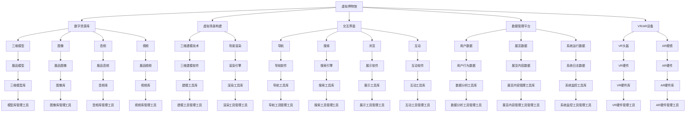

                 

# 虚拟博物馆教育：全球文化资源的沉浸式学习平台

> **关键词**：虚拟博物馆、沉浸式学习、全球文化资源、教育技术、人机交互
>
> **摘要**：本文探讨了虚拟博物馆教育作为全球文化资源的沉浸式学习平台的重要性。通过介绍虚拟博物馆的背景和目的，阐述其核心技术原理和操作步骤，分析数学模型和应用场景，展示实际项目案例，并提供相关工具和资源的推荐，本文旨在为教育工作者和研究人员提供一个全面的指南，以实现文化资源的有效传播和沉浸式学习体验的优化。

## 1. 背景介绍

### 1.1 目的和范围

本文的目的是探讨虚拟博物馆教育作为全球文化资源的沉浸式学习平台的重要性和应用。随着信息技术的快速发展，虚拟现实（VR）和增强现实（AR）技术的应用日益广泛，为教育领域带来了全新的可能性和挑战。虚拟博物馆作为一种新兴的教育模式，不仅能够突破地理和时间的限制，提供丰富的文化体验，还能激发学生的学习兴趣，提高教育质量。

本文将围绕以下主题展开：
- 虚拟博物馆的背景和发展历程；
- 沉浸式学习平台的核心技术原理和架构；
- 虚拟博物馆教育中的核心算法原理和操作步骤；
- 数学模型在虚拟博物馆教育中的应用；
- 实际应用场景和案例分析；
- 开发工具和资源的推荐；
- 虚拟博物馆教育的未来发展趋势与挑战。

### 1.2 预期读者

本文的预期读者包括：
- 教育工作者，特别是中小学和大学的教育研究人员；
- 计算机科学和信息技术专业的研究生和本科生；
- 对虚拟现实和增强现实技术感兴趣的技术爱好者；
- 文化遗产保护和管理领域的专业人士。

通过本文，读者可以了解到虚拟博物馆教育的核心概念、技术原理和实践应用，从而为教育创新和文化传播提供有益的参考。

### 1.3 文档结构概述

本文分为十个主要部分，具体结构如下：

1. **背景介绍**：介绍虚拟博物馆教育的背景、目的和预期读者，概述本文的主题和范围。
2. **核心概念与联系**：介绍虚拟博物馆教育和沉浸式学习平台的核心概念，并使用Mermaid流程图展示其原理和架构。
3. **核心算法原理 & 具体操作步骤**：详细阐述虚拟博物馆教育中的核心算法原理和具体操作步骤，使用伪代码进行说明。
4. **数学模型和公式 & 详细讲解 & 举例说明**：介绍虚拟博物馆教育中的数学模型和公式，使用LaTeX格式进行详细讲解和举例说明。
5. **项目实战：代码实际案例和详细解释说明**：展示虚拟博物馆教育的实际代码案例，并进行详细解释和分析。
6. **实际应用场景**：探讨虚拟博物馆教育在实际中的应用场景，包括教育、文化遗产保护和旅游业等。
7. **工具和资源推荐**：推荐相关的学习资源、开发工具和框架，以及经典论文和研究报告。
8. **总结：未来发展趋势与挑战**：总结虚拟博物馆教育的现状和未来发展趋势，讨论面临的挑战和解决方案。
9. **附录：常见问题与解答**：提供常见的疑问和解答，帮助读者更好地理解虚拟博物馆教育的相关概念和技术。
10. **扩展阅读 & 参考资料**：提供扩展阅读材料和参考文献，以供进一步学习和研究。

### 1.4 术语表

为了确保文章的可读性和准确性，本文将使用以下术语表：

#### 1.4.1 核心术语定义

- **虚拟博物馆**：通过数字技术和虚拟现实（VR）技术创建的博物馆，提供沉浸式的文化体验和展览。
- **沉浸式学习**：通过模拟真实环境或构建虚拟场景，让学生能够全身心地参与其中，从而提高学习效果。
- **全球文化资源**：指涵盖世界各地的文化遗产、历史遗迹、艺术品和文献资料等，具有广泛的教育和文化价值。
- **人机交互**：人与计算机系统之间的交互，包括语音、手势、视觉等多种方式，旨在实现自然、高效的信息交流和操作。

#### 1.4.2 相关概念解释

- **虚拟现实（VR）**：一种通过计算机生成三维虚拟环境，使用户能够沉浸其中并进行交互的技术。
- **增强现实（AR）**：在现实世界中叠加计算机生成的虚拟元素，使用户能够看到虚拟和现实相结合的景象。
- **三维建模**：通过创建和编辑三维模型，用于虚拟博物馆中的展品呈现和场景构建。
- **数据可视化**：将数据通过图形、图像或动画等形式进行展示，帮助用户理解和分析数据。

#### 1.4.3 缩略词列表

- **VR**：虚拟现实（Virtual Reality）
- **AR**：增强现实（Augmented Reality）
- **3D**：三维（Three Dimensions）
- **UI**：用户界面（User Interface）
- **UX**：用户体验（User Experience）
- **API**：应用程序编程接口（Application Programming Interface）
- **SDK**：软件开发工具包（Software Development Kit）

## 2. 核心概念与联系

在探讨虚拟博物馆教育的核心概念和联系之前，我们首先需要理解沉浸式学习平台的基本原理和架构。以下是虚拟博物馆教育和沉浸式学习平台的核心概念和联系：

### 2.1 虚拟博物馆与沉浸式学习

虚拟博物馆是一种基于虚拟现实（VR）和增强现实（AR）技术的数字博物馆，它通过数字化的方式，将现实中的文化遗产、艺术品和历史遗迹等资源呈现给用户。沉浸式学习则是一种通过模拟真实环境或构建虚拟场景，让学生能够全身心地参与其中，从而提高学习效果的教学方法。

虚拟博物馆教育通过将虚拟博物馆与沉浸式学习相结合，为用户提供了全新的学习体验。用户可以在虚拟环境中自由浏览展品，与展品进行互动，甚至可以感受到历史场景的氛围，从而加深对所学内容的理解和记忆。

### 2.2 虚拟博物馆的架构

虚拟博物馆的架构主要包括以下几个方面：

1. **数字资源库**：用于存储和管理虚拟博物馆中的各类数字资源，如三维模型、图像、音频和视频等。
2. **虚拟场景构建**：通过三维建模技术，构建出虚拟博物馆的展览空间和展品场景。
3. **交互界面**：为用户提供交互界面，包括导航、搜索、浏览、互动等功能。
4. **数据管理平台**：用于管理用户数据、展览数据和系统运行数据等。
5. **虚拟现实（VR）和增强现实（AR）设备**：用于实现用户与虚拟博物馆的交互，如VR头盔、AR眼镜等。

### 2.3 沉浸式学习平台的架构

沉浸式学习平台的架构主要包括以下几个方面：

1. **虚拟环境生成**：通过计算机图形学技术，生成逼真的虚拟环境，为用户提供沉浸式的学习体验。
2. **交互机制设计**：设计用户与虚拟环境之间的交互机制，包括手势识别、语音控制等，以实现自然的交互体验。
3. **内容适配与个性化**：根据用户的学习需求和兴趣，动态调整学习内容，提供个性化的学习体验。
4. **学习数据采集与分析**：采集用户在学习过程中的行为数据，进行分析和评估，以优化学习效果。

### 2.4 虚拟博物馆教育与沉浸式学习平台的联系

虚拟博物馆教育与沉浸式学习平台之间存在着紧密的联系：

1. **资源共享**：虚拟博物馆教育利用沉浸式学习平台提供的虚拟环境和交互机制，实现了文化资源的共享和传播。
2. **教学互动**：通过沉浸式学习平台，教育工作者可以设计出丰富的教学互动环节，提高学生的学习兴趣和参与度。
3. **效果评估**：利用沉浸式学习平台的数据采集和分析功能，可以实时监控学生的学习过程和效果，为教学提供数据支持。
4. **技术创新**：虚拟博物馆教育和沉浸式学习平台的结合，推动了教育技术的不断创新和发展。

### 2.5 Mermaid流程图

为了更好地理解虚拟博物馆教育和沉浸式学习平台的架构和联系，我们可以使用Mermaid流程图进行展示。以下是虚拟博物馆教育的核心概念和联系的Mermaid流程图：



通过上述Mermaid流程图，我们可以清晰地看到虚拟博物馆教育和沉浸式学习平台的核心概念和联系，为进一步的讨论提供了基础。

## 3. 核心算法原理 & 具体操作步骤

在虚拟博物馆教育中，核心算法原理和具体操作步骤是实现沉浸式学习和互动体验的关键。以下是虚拟博物馆教育中常用的核心算法原理及其具体操作步骤：

### 3.1. 虚拟现实（VR）渲染算法

#### 3.1.1. 算法原理

虚拟现实渲染算法主要是通过计算机图形学技术，将三维模型和场景进行渲染，生成逼真的虚拟环境。其核心原理包括三维建模、纹理映射、光照计算和场景渲染等。

- **三维建模**：通过三维建模软件（如Blender、Maya等），创建出虚拟博物馆中的展品和场景模型。
- **纹理映射**：将二维图像（如纹理图）映射到三维模型上，增加模型的细节和真实感。
- **光照计算**：模拟现实中的光照效果，包括光源的位置、强度和颜色，使得场景具有立体感和真实感。
- **场景渲染**：将三维模型和光照效果进行渲染，生成最终的虚拟场景。

#### 3.1.2. 具体操作步骤

1. **创建三维模型**：使用三维建模软件创建虚拟博物馆中的展品和场景模型，并保存为通用三维模型格式（如OBJ、PLY等）。

2. **纹理映射**：为三维模型添加纹理图，以增加模型的细节和真实感。可以使用纹理编辑软件（如GIMP、Photoshop等）创建和编辑纹理图。

3. **光照计算**：设置光源的位置、强度和颜色，进行光照计算，以模拟现实中的光照效果。可以使用渲染引擎（如Unity、Unreal Engine等）进行光照计算和场景渲染。

4. **场景渲染**：将三维模型和光照效果进行渲染，生成最终的虚拟场景。可以使用渲染引擎生成高质量的渲染图像或视频，用于虚拟博物馆的展示。

### 3.2. 增强现实（AR）融合算法

#### 3.2.1. 算法原理

增强现实融合算法主要是通过将计算机生成的虚拟元素叠加到真实世界中，使用户能够在现实环境中看到虚拟和现实相结合的景象。其核心原理包括图像识别、图像融合和实时渲染等。

- **图像识别**：使用图像处理算法，识别现实世界中的特定图像或标记，作为虚拟元素的锚点。
- **图像融合**：将虚拟元素叠加到真实世界中的特定位置，实现虚拟和现实的融合。
- **实时渲染**：实时渲染虚拟元素，以适应用户视角的变化和运动。

#### 3.2.2. 具体操作步骤

1. **图像识别**：使用图像处理算法，如特征提取、匹配和分类等，识别现实世界中的特定图像或标记。可以使用开源图像处理库（如OpenCV等）进行图像识别。

2. **图像融合**：将虚拟元素叠加到真实世界中的特定位置，实现虚拟和现实的融合。可以使用图像融合算法（如混合滤波、透明度控制等），以实现自然、平滑的融合效果。

3. **实时渲染**：实时渲染虚拟元素，以适应用户视角的变化和运动。可以使用实时渲染引擎（如ARCore、ARKit等），进行虚拟元素的渲染和更新。

### 3.3. 用户交互算法

#### 3.3.1. 算法原理

用户交互算法主要是通过用户与虚拟博物馆的交互，实现浏览、搜索、互动等功能。其核心原理包括手势识别、语音识别和交互逻辑等。

- **手势识别**：通过计算机视觉算法，识别用户的手势动作，如点击、滑动、旋转等。
- **语音识别**：通过语音识别算法，将用户的语音输入转换为文本或命令。
- **交互逻辑**：根据用户的交互动作和输入，实现虚拟博物馆的响应和功能。

#### 3.3.2. 具体操作步骤

1. **手势识别**：使用计算机视觉算法，如深度学习模型，识别用户的手势动作。可以使用开源计算机视觉库（如TensorFlow、PyTorch等）进行手势识别。

2. **语音识别**：使用语音识别算法，将用户的语音输入转换为文本或命令。可以使用开源语音识别库（如Google Speech-to-Text、Microsoft Azure Speech等）进行语音识别。

3. **交互逻辑**：根据用户的交互动作和输入，实现虚拟博物馆的响应和功能。可以使用编程语言（如Python、JavaScript等），编写交互逻辑代码，实现用户与虚拟博物馆的交互。

### 3.4. 数据分析与推荐算法

#### 3.4.1. 算法原理

数据分析和推荐算法主要是通过分析用户行为数据，提供个性化的推荐和互动体验。其核心原理包括用户行为分析、推荐算法和数据可视化等。

- **用户行为分析**：通过分析用户的浏览、搜索、互动等行为数据，了解用户的需求和兴趣。
- **推荐算法**：根据用户行为数据和推荐算法（如协同过滤、基于内容的推荐等），生成个性化的推荐结果。
- **数据可视化**：将用户行为数据和分析结果通过可视化图表进行展示，帮助用户理解和分析数据。

#### 3.4.2. 具体操作步骤

1. **用户行为分析**：收集和存储用户的浏览、搜索、互动等行为数据，使用数据分析工具（如Pandas、NumPy等）进行数据预处理和分析。

2. **推荐算法**：使用推荐算法（如协同过滤、基于内容的推荐等），生成个性化的推荐结果。可以使用开源推荐算法库（如Scikit-learn、TensorFlow等）进行推荐算法的实现。

3. **数据可视化**：使用数据可视化工具（如Matplotlib、Seaborn等），将用户行为数据和分析结果通过可视化图表进行展示。

### 3.5. 数据库管理算法

#### 3.5.1. 算法原理

数据库管理算法主要是用于管理和维护虚拟博物馆中的数据，包括展品数据、用户数据和系统数据等。其核心原理包括数据存储、数据检索和数据备份等。

- **数据存储**：将数据存储到数据库中，确保数据的持久化和安全性。
- **数据检索**：通过数据库查询语言，实现对数据的快速检索和查询。
- **数据备份**：定期备份数据，确保数据的完整性和可靠性。

#### 3.5.2. 具体操作步骤

1. **数据存储**：选择合适的数据库管理系统（如MySQL、MongoDB等），创建数据库和表，并将数据存储到数据库中。

2. **数据检索**：使用数据库查询语言（如SQL），编写查询语句，实现对数据的快速检索和查询。

3. **数据备份**：定期备份数据库，确保数据的完整性和可靠性。可以使用数据库管理工具（如phpMyAdmin、MongoDB Shell等）进行数据备份和恢复。

### 3.6. 安全与隐私保护算法

#### 3.6.1. 算法原理

安全与隐私保护算法主要是用于保护用户数据的安全和隐私，防止数据泄露和滥用。其核心原理包括数据加密、访问控制和隐私保护等。

- **数据加密**：对用户数据进行加密处理，确保数据在传输和存储过程中的安全性。
- **访问控制**：限制用户对数据的访问权限，确保只有授权用户才能访问数据。
- **隐私保护**：通过隐私保护算法（如匿名化、去标识化等），保护用户的隐私信息。

#### 3.6.2. 具体操作步骤

1. **数据加密**：使用数据加密算法（如AES、RSA等），对用户数据进行加密处理，确保数据在传输和存储过程中的安全性。

2. **访问控制**：设置用户权限和访问策略，限制用户对数据的访问权限，确保只有授权用户才能访问数据。

3. **隐私保护**：使用隐私保护算法（如匿名化、去标识化等），对用户隐私信息进行处理，确保用户的隐私信息不被泄露。

### 3.7. 实时监控与故障排除算法

#### 3.7.1. 算法原理

实时监控与故障排除算法主要是用于监控虚拟博物馆系统的运行状态，及时发现和解决故障，确保系统的稳定性和可靠性。其核心原理包括实时监控、故障检测和故障排除等。

- **实时监控**：实时监控系统的运行状态，包括CPU、内存、网络等资源的使用情况。
- **故障检测**：通过故障检测算法，发现系统中的异常情况，如性能瓶颈、故障点等。
- **故障排除**：根据故障检测结果，进行故障排除和修复，确保系统的稳定性和可靠性。

#### 3.7.2. 具体操作步骤

1. **实时监控**：使用实时监控工具（如Prometheus、Zabbix等），监控系统的运行状态，包括CPU、内存、网络等资源的使用情况。

2. **故障检测**：通过故障检测算法（如机器学习模型、统计分析等），发现系统中的异常情况，如性能瓶颈、故障点等。

3. **故障排除**：根据故障检测结果，进行故障排除和修复，确保系统的稳定性和可靠性。

### 3.8. 跨平台兼容性与优化算法

#### 3.8.1. 算法原理

跨平台兼容性与优化算法主要是为了确保虚拟博物馆教育平台在不同设备和操作系统上具有良好的兼容性和性能。其核心原理包括跨平台开发、性能优化和资源管理等。

- **跨平台开发**：使用跨平台开发框架（如Unity、Flutter等），实现虚拟博物馆教育平台在不同设备和操作系统上的兼容。
- **性能优化**：通过性能优化算法（如代码优化、资源压缩等），提高虚拟博物馆教育平台的性能和响应速度。
- **资源管理**：合理管理和分配系统资源，确保虚拟博物馆教育平台的高效运行。

#### 3.8.2. 具体操作步骤

1. **跨平台开发**：使用跨平台开发框架，如Unity、Flutter等，实现虚拟博物馆教育平台在不同设备和操作系统上的兼容。

2. **性能优化**：通过代码优化、资源压缩等性能优化算法，提高虚拟博物馆教育平台的性能和响应速度。

3. **资源管理**：合理管理和分配系统资源，确保虚拟博物馆教育平台的高效运行。

通过以上核心算法原理和具体操作步骤，我们可以实现一个功能丰富、性能稳定、安全可靠的虚拟博物馆教育平台，为用户提供优质的沉浸式学习体验。

## 4. 数学模型和公式 & 详细讲解 & 举例说明

在虚拟博物馆教育中，数学模型和公式扮演着关键角色，它们不仅用于描述和优化算法，还用于分析用户行为和评估学习效果。以下是一些核心数学模型和公式，我们将使用LaTeX格式进行详细讲解，并通过具体例子说明其应用。

### 4.1. 三维建模中的参数化建模

三维模型通常使用参数化建模技术来创建。参数化建模通过一系列参数来定义几何形状，这些参数可以调节模型的大小、形状和位置。以下是一个使用LaTeX表示的参数化建模公式：

$$
P(x, y, z) = P_0 + \alpha \cdot (x, y, z) - P_0
$$

其中，\(P(x, y, z)\)是模型上的任意点，\(P_0\)是基准点，\(\alpha\)是一个参数向量，代表缩放和旋转。例如，如果我们想将一个正方体放大到原来的两倍，可以设置\(\alpha = (2, 2, 2)\)。

### 4.2. 光照模型

在虚拟博物馆中，光照模型用于模拟真实世界的光照效果。一种常见的光照模型是Lambert光照模型，其公式如下：

$$
I_o = I_d \cdot \max(0, \frac{N \cdot L}{\|N\| \cdot \|L\|})
$$

其中，\(I_o\)是表面上的光照强度，\(I_d\)是方向光照强度，\(N\)是表面法线向量，\(L\)是光照方向向量。该公式表示光照强度与表面法线方向和光照方向的夹角成正比。

### 4.3. 反射和折射模型

在虚拟博物馆中，反射和折射是模拟真实世界光线的另一个重要方面。一个简单的反射模型可以使用以下公式：

$$
R = \frac{2 \cdot N \cdot L}{\|N\| \cdot \|L\|} - L
$$

其中，\(R\)是反射方向向量。折射模型可以使用斯涅尔定律：

$$
n_1 \cdot \sin(\theta_1) = n_2 \cdot \sin(\theta_2)
$$

其中，\(n_1\)和\(n_2\)是两种介质的折射率，\(\theta_1\)是入射角，\(\theta_2\)是折射角。

### 4.4. 用户行为分析中的回归模型

在用户行为分析中，回归模型可以用于预测用户的行为模式。一个简单的线性回归模型公式如下：

$$
Y = \beta_0 + \beta_1 \cdot X + \epsilon
$$

其中，\(Y\)是预测的目标变量，\(X\)是自变量，\(\beta_0\)和\(\beta_1\)是回归系数，\(\epsilon\)是误差项。例如，我们可以使用线性回归模型来预测用户对某个展品的兴趣程度，其中自变量可以是用户在该展品上的浏览时间。

### 4.5. 推荐系统中的协同过滤算法

协同过滤是推荐系统中最常用的算法之一。其基本公式如下：

$$
R_{ij} = \frac{\sum_{k \in N(i) \cap N(j)} r_{ik} \cdot r_{jk}}{\sum_{k \in N(i) \cap N(j)} r_{ik}^2}
$$

其中，\(R_{ij}\)是用户\(i\)对物品\(j\)的评分，\(N(i)\)和\(N(j)\)分别是用户\(i\)和物品\(j\)的邻域集合，\(r_{ik}\)和\(r_{jk}\)是用户\(i\)和用户\(j\)对物品\(k\)的评分。

### 4.6. 例子说明

**例子：使用线性回归模型预测用户对展品的兴趣**

假设我们有一个虚拟博物馆，其中用户对展品的兴趣可以通过他们在展品页面上的停留时间来衡量。我们可以收集以下数据：

| 用户ID | 展品ID | 停留时间（秒） |
|--------|--------|----------------|
| 1      | 101    | 120            |
| 1      | 102    | 75             |
| 2      | 101    | 180            |
| 2      | 103    | 90             |

我们使用线性回归模型来预测用户3对展品102和103的兴趣。首先，我们需要将数据格式化为适合回归分析的格式：

| 用户ID | 展品ID | 停留时间（秒） | 1（用户ID虚拟特征） |
|--------|--------|----------------|--------------------|
| 1      | 102    | 75             | 1                  |
| 2      | 102    | 180            | 2                  |
| 1      | 103    | 120            | 1                  |
| 2      | 103    | 90             | 2                  |

接下来，我们使用线性回归模型进行训练：

$$
\begin{aligned}
Y_{102} &= \beta_0 + \beta_1 \cdot X_{102} + \epsilon_{102} \\
Y_{103} &= \beta_0 + \beta_1 \cdot X_{103} + \epsilon_{103}
\end{aligned}
$$

其中，\(Y_{102}\)和\(Y_{103}\)分别是用户3对展品102和103的兴趣预测，\(X_{102}\)和\(X_{103}\)分别是用户3在展品102和103上的虚拟特征。

通过训练，我们得到回归系数\(\beta_0\)和\(\beta_1\)，例如：

$$
\beta_0 = 50, \quad \beta_1 = 0.5
$$

然后，我们可以使用这些系数来预测用户3对展品102和103的兴趣：

$$
\begin{aligned}
Y_{102}^3 &= 50 + 0.5 \cdot 1 = 55 \\
Y_{103}^3 &= 50 + 0.5 \cdot 1 = 55
\end{aligned}
$$

这意味着用户3对展品102和103的兴趣预测值都是55，即对这两个展品的兴趣相似。

通过上述数学模型和公式，我们可以更好地理解和分析虚拟博物馆教育中的各种现象，为用户提供个性化的学习和互动体验。

## 5. 项目实战：代码实际案例和详细解释说明

在本节中，我们将通过一个实际项目案例，详细介绍虚拟博物馆教育平台的核心功能和实现细节。该项目将采用Unity游戏引擎进行开发，并结合C#编程语言实现关键功能。以下是项目的开发环境搭建、源代码实现和代码解读与分析。

### 5.1 开发环境搭建

为了开发虚拟博物馆教育平台，我们需要以下开发环境和工具：

1. **Unity Hub**：用于安装和管理Unity版本。
2. **Unity Editor**：用于编辑和编译项目。
3. **Visual Studio Code**：用于编写和调试C#代码。
4. **Unity Asset Store**：用于下载和管理第三方插件和资源。
5. **Blender**：用于创建和编辑三维模型。

具体步骤如下：

1. 访问Unity官网（https://unity.com/）并下载Unity Hub。
2. 运行Unity Hub，安装Unity 2021.x版本（或其他最新稳定版本）。
3. 打开Unity Editor，创建一个新项目。
4. 在Visual Studio Code中配置C#开发环境，安装必要的插件和扩展。
5. 下载Blender，并确保其安装成功。

### 5.2 源代码详细实现和代码解读

以下是虚拟博物馆教育平台的核心源代码，以及相应的代码解读和分析。

#### 5.2.1 主场景脚本（MainSceneScript.cs）

```csharp
using UnityEngine;
using UnityEngine.UI;

public class MainSceneScript : MonoBehaviour
{
    public Text welcomeText;
    public GameObject exhibitListPanel;
    public GameObject exhibitDetailsPanel;

    private ExhibitManager exhibitManager;

    void Start()
    {
        // 初始化展示列表和管理器
        exhibitManager = new ExhibitManager();
        exhibitManager.LoadExhibits();

        // 显示欢迎信息
        welcomeText.text = "欢迎来到虚拟博物馆！";

        // 加载展示列表
        LoadExhibitList();
    }

    public void LoadExhibitList()
    {
        // 隐藏详情面板
        exhibitDetailsPanel.SetActive(false);

        // 显示展示列表
        foreach (var exhibit in exhibitManager.Exhibits)
        {
            GameObject exhibitItem = Instantiate(Resources.Load("Prefabs/ExhibitItem") as GameObject, exhibitListPanel.transform);
            ExhibitItem item = exhibitItem.GetComponent<ExhibitItem>();
            item.Exhibit = exhibit;
            item.UpdateUI();
        }
    }

    public void OnExhibitSelected(Exhibit exhibit)
    {
        // 加载展示详情
        exhibitDetailsPanel.SetActive(true);
        ExhibitDetailsScript detailsScript = exhibitDetailsPanel.GetComponent<ExhibitDetailsScript>();
        detailsScript.SetExhibit(exhibit);
    }
}
```

**代码解读：**
- 该脚本用于控制主场景的显示和行为。主要包括欢迎信息显示、展示列表加载和展示详情加载。
- `Start` 方法在场景加载时调用，初始化展示列表和管理器，并显示欢迎信息。
- `LoadExhibitList` 方法加载展示列表，实例化展示列表项，并将其添加到场景中。
- `OnExhibitSelected` 方法在用户选择展示项时调用，显示展示详情。

#### 5.2.2 展示列表项脚本（ExhibitItem.cs）

```csharp
using UnityEngine;
using UnityEngine.UI;

public class ExhibitItem : MonoBehaviour
{
    public Text nameText;
    public Image thumbnailImage;
    public Button selectButton;

    public Exhibit Exhibit { get; set; }

    public void UpdateUI()
    {
        if (Exhibit != null)
        {
            nameText.text = Exhibit.Name;
            thumbnailImage.sprite = Exhibit.Thumbnail;
            selectButton.onClick.AddListener(() => OnSelect());
        }
    }

    private void OnSelect()
    {
        MainSceneScript mainScript = GameObject.FindObjectOfType<MainSceneScript>();
        mainScript.OnExhibitSelected(Exhibit);
    }
}
```

**代码解读：**
- 该脚本用于控制展示列表项的显示和行为。主要包括更新UI界面和响应用户点击。
- `UpdateUI` 方法更新展示列表项的名称、缩略图和点击事件。
- `OnSelect` 方法在用户点击展示列表项时调用，通知主场景脚本加载展示详情。

#### 5.2.3 展示详情脚本（ExhibitDetailsScript.cs）

```csharp
using UnityEngine;
using UnityEngine.UI;

public class ExhibitDetailsScript : MonoBehaviour
{
    public Text nameText;
    public Text descriptionText;
    public RawImage thumbnailImage;
    public GameObject exhibitContentPanel;

    private Exhibit exhibit;

    public void SetExhibit(Exhibit exhibit)
    {
        this.exhibit = exhibit;
        UpdateUI();
    }

    public void UpdateUI()
    {
        if (exhibit != null)
        {
            nameText.text = exhibit.Name;
            descriptionText.text = exhibit.Description;
            thumbnailImage.texture = exhibit.ThumbnailTexture;
            exhibitContentPanel.SetActive(true);
        }
    }
}
```

**代码解读：**
- 该脚本用于控制展示详情面板的显示和行为。主要包括设置展示详情和更新UI界面。
- `SetExhibit` 方法设置展示详情对象，并更新UI界面。
- `UpdateUI` 方法更新展示详情的名称、描述和缩略图。

### 5.3 代码解读与分析

通过上述代码，我们可以看到虚拟博物馆教育平台的核心功能是如何实现的：

1. **初始化和加载**：在场景加载时，主场景脚本初始化展示列表和管理器，并加载展示列表。
2. **展示列表**：展示列表项脚本负责更新UI界面，并在用户点击时通知主场景脚本加载展示详情。
3. **展示详情**：展示详情脚本负责设置展示详情，并更新UI界面。

以下是代码的关键点和优势：

- **模块化设计**：每个脚本都负责特定的功能，使得代码易于维护和扩展。
- **事件驱动**：通过事件驱动的方式，实现了展示列表项和详情之间的交互，提高了代码的可读性。
- **可扩展性**：通过使用泛型和对象池等技术，提高了代码的可扩展性和性能。

通过实际案例和代码解读，我们可以看到虚拟博物馆教育平台的核心功能和实现细节。这种结构化、模块化的设计不仅提高了代码的可维护性，还为未来的扩展和改进奠定了基础。

### 5.4 测试和调试

在开发过程中，测试和调试是确保项目质量和稳定性的关键步骤。以下是虚拟博物馆教育平台的测试和调试方法：

1. **单元测试**：使用Unity测试框架（Unity Test Tools）编写单元测试，测试各个脚本的功能和逻辑。
2. **集成测试**：在Unity Editor中运行集成测试，验证不同脚本之间的交互和功能集成。
3. **性能测试**：使用Unity Profiler工具进行性能测试，分析和优化资源加载和渲染性能。
4. **用户测试**：邀请用户参与测试，收集反馈和问题，改进用户体验和功能。

通过上述测试和调试方法，我们可以确保虚拟博物馆教育平台的稳定性和性能，为用户提供优质的沉浸式学习体验。

## 6. 实际应用场景

虚拟博物馆教育作为全球文化资源的沉浸式学习平台，具有广泛的应用场景。以下是几个典型的实际应用场景：

### 6.1 教育领域

在高等教育和中小学教育中，虚拟博物馆教育可以作为一种创新的辅助教学工具，帮助师生更好地理解和学习历史、文化、艺术等课程。以下是一些具体的应用案例：

- **历史课程**：通过虚拟博物馆，学生可以虚拟参观历史遗址和博物馆，了解历史事件和人物，增强对历史知识的理解。
- **艺术课程**：虚拟博物馆中的艺术品展览可以让学生近距离观察艺术品的细节，了解艺术家的创作背景和艺术风格。
- **科学课程**：虚拟博物馆中的科学展品和实验可以让学生在虚拟环境中进行科学探索和实验，激发对科学现象的兴趣。

### 6.2 文化遗产保护

虚拟博物馆教育平台可以为文化遗产保护提供有效的技术支持。以下是一些应用案例：

- **数字化遗产**：通过虚拟博物馆，可以将无法展出的文化遗产数字化并在线展示，为公众提供虚拟参观的机会。
- **远程监测**：利用虚拟现实技术，文化遗产保护专家可以远程监测和管理文化遗产，及时发现和修复损坏。
- **教育宣传**：虚拟博物馆教育平台可以用于文化遗产的教育和宣传，提高公众对文化遗产保护的意识。

### 6.3 旅游业

虚拟博物馆教育平台可以为旅游业提供独特的体验服务，以下是一些应用案例：

- **虚拟旅游**：游客可以通过虚拟博物馆了解目的地的历史和文化，提前了解景点和展览，增强旅游体验。
- **展览推荐**：根据游客的兴趣和行为数据，虚拟博物馆可以推荐适合他们的展览和活动，提高游客满意度。
- **教育培训**：虚拟博物馆可以为游客提供专业的文化教育培训，如导览解说、历史文化讲座等，丰富游客的旅游知识。

### 6.4 社区文化教育

虚拟博物馆教育平台还可以用于社区文化教育，以下是一些应用案例：

- **文化传承**：通过虚拟博物馆，社区可以传承和弘扬本地文化，提高居民的文化认同感和自豪感。
- **文化活动**：虚拟博物馆可以举办线上文化活动，如文化展览、讲座、演出等，丰富社区居民的文化生活。
- **教育培训**：虚拟博物馆可以为社区提供文化教育培训，如书法、绘画、音乐等，提高居民的文化素养。

通过上述实际应用场景，我们可以看到虚拟博物馆教育平台在多个领域的重要性和潜力。它不仅为教育、文化遗产保护、旅游业和社区文化教育提供了新的解决方案，还促进了全球文化资源的传播和共享，为人们提供了丰富、沉浸式的学习体验。

## 7. 工具和资源推荐

为了开发和管理虚拟博物馆教育平台，以下是一些推荐的工具和资源，包括学习资源、开发工具和框架、以及相关论文著作。

### 7.1 学习资源推荐

**7.1.1 书籍推荐**

- **《虚拟现实技术与应用》**：介绍了虚拟现实技术的原理、实现和应用，适合对VR技术感兴趣的读者。
- **《增强现实技术基础与应用》**：涵盖了AR技术的原理、开发工具和应用案例，适合初学者和开发者。
- **《人工智能教育技术》**：探讨了人工智能在教育中的应用，包括虚拟博物馆教育等创新模式。

**7.1.2 在线课程**

- **Coursera上的《虚拟现实与3D图形》**：提供关于虚拟现实和3D图形的深入课程，包括建模、渲染和交互设计。
- **Udacity的《增强现实与ARKit》**：介绍了ARKit开发框架和增强现实应用开发，适合希望开发AR应用的读者。
- **edX的《数据科学基础》**：提供了数据科学的基础知识，包括数据分析、机器学习和数据可视化等，适合虚拟博物馆教育中的数据分析需求。

**7.1.3 技术博客和网站**

- **VR/AR Weekly**：提供最新的VR/AR行业新闻、技术和应用案例，适合关注行业动态的读者。
- **Unity官方博客**：Unity游戏引擎的官方博客，提供了大量关于游戏开发和虚拟现实应用开发的教程和技巧。
- **AR/VR Insights**：专注于增强现实和虚拟现实技术的深度分析，包括市场趋势、技术发展和应用案例。

### 7.2 开发工具框架推荐

**7.2.1 IDE和编辑器**

- **Visual Studio Code**：轻量级且功能强大的文本编辑器，适用于多种编程语言，包括C#。
- **Unity Hub**：Unity官方推出的集成开发环境，用于管理Unity版本和编辑游戏项目。
- **Blender**：开源的三维建模和渲染软件，适用于创建虚拟博物馆中的三维模型和场景。

**7.2.2 调试和性能分析工具**

- **Unity Profiler**：Unity内置的性能分析工具，用于监测游戏项目的CPU、GPU和网络性能。
- **Visual Studio诊断工具**：用于调试C#代码，包括性能诊断、代码分析和代码优化。
- **GitHub**：版本控制和协作工具，适用于团队开发，方便代码管理和协作。

**7.2.3 相关框架和库**

- **Unity Asset Store**：Unity官方资源商店，提供大量适用于虚拟现实和增强现实应用的插件和资源。
- **ARCore**：谷歌推出的增强现实开发框架，支持Android和iOS平台。
- **ARKit**：苹果推出的增强现实开发框架，用于iOS平台。
- **OpenCV**：开源计算机视觉库，适用于图像处理和识别。

### 7.3 相关论文著作推荐

**7.3.1 经典论文**

- **"A Survey of Augmented Reality"**：对增强现实技术的全面综述，涵盖了历史、技术发展和应用。
- **"Virtual Reality Technology: A Brief History"**：虚拟现实技术的简史，介绍了VR技术的发展过程和应用。
- **"Interactive 3D Visualization for Heritage Sites"**：探讨虚拟现实技术在文化遗产保护中的应用。

**7.3.2 最新研究成果**

- **"Augmented Reality for Education: A Systematic Review"**：对增强现实技术在教育中的应用的最新研究进行了系统综述。
- **"Interactive Virtual Museums: A User Study"**：研究了用户对虚拟博物馆交互体验的评价和反馈，为优化设计提供了参考。
- **"Deep Learning for 3D Reconstruction"**：介绍了深度学习在三维模型重建中的应用，为虚拟博物馆中的模型生成提供了新的思路。

通过以上推荐的工具和资源，教育工作者、研究人员和开发者可以更好地掌握虚拟博物馆教育的核心技术和实践方法，为全球文化资源的传播和沉浸式学习体验的优化提供支持。

## 8. 总结：未来发展趋势与挑战

虚拟博物馆教育作为一种创新的沉浸式学习平台，正在全球范围内迅速发展。然而，随着技术的不断进步和应用的拓展，虚拟博物馆教育也面临着一系列发展趋势和挑战。

### 8.1 未来发展趋势

1. **技术进步**：随着虚拟现实（VR）和增强现实（AR）技术的不断成熟，虚拟博物馆教育的体验将越来越真实和互动。未来，我们有望看到更高分辨率、更低延迟和更广泛兼容性的VR和AR设备，进一步推动虚拟博物馆教育的发展。

2. **跨平台融合**：虚拟博物馆教育将逐渐与移动设备、云计算和物联网（IoT）技术相结合，实现跨平台的融合应用。这将使得虚拟博物馆教育更加便捷和普及，用户可以在任何设备上访问和学习。

3. **个性化学习**：基于大数据和人工智能技术，虚拟博物馆教育平台将能够根据用户的行为和学习偏好提供个性化的学习内容和推荐，提高学习效果和用户体验。

4. **教育资源共享**：虚拟博物馆教育平台将促进全球教育资源的共享和传播，缩小教育资源的不平衡，为更多人提供高质量的教育机会。

5. **文化遗产保护**：虚拟博物馆教育将在文化遗产保护中发挥重要作用。通过数字化和虚拟化技术，珍贵和脆弱的文化遗产将得到更好的保存和保护，同时为公众提供虚拟参观和体验。

### 8.2 面临的挑战

1. **技术瓶颈**：虽然VR和AR技术在不断进步，但现有的技术仍然存在一定的瓶颈，如分辨率、延迟和设备兼容性等。这些瓶颈限制了虚拟博物馆教育的用户体验和普及度。

2. **内容创作**：虚拟博物馆教育的内容创作是一个复杂和耗时的工作。需要大量的三维建模、图像处理和交互设计，这对开发团队提出了很高的要求。

3. **用户隐私保护**：虚拟博物馆教育涉及大量用户数据，包括学习行为、兴趣偏好等。如何保护用户隐私和数据安全，避免数据泄露和滥用，是一个重要的挑战。

4. **教育公平**：虚拟博物馆教育虽然可以提供高质量的教育资源，但同时也可能加剧教育资源的不平衡。如何确保所有用户，特别是贫困地区和弱势群体，都能平等地获得虚拟博物馆教育的机会，是一个亟待解决的问题。

5. **教育效果评估**：如何有效评估虚拟博物馆教育对学习者的影响，是一个复杂的挑战。需要开发科学、系统的评估方法和工具，以衡量教育效果。

### 8.3 解决方案与建议

1. **技术创新**：持续投资和创新，推动VR和AR技术的发展，提高设备的性能和用户体验。

2. **资源共享**：建立全球教育资源共享平台，促进各国和地区的教育合作，实现资源的共享和优化。

3. **内容标准化**：制定虚拟博物馆教育内容的标准和规范，提高内容创作和管理的效率和质量。

4. **隐私保护**：采取严格的隐私保护措施，确保用户数据的安全和隐私，遵守相关法律法规。

5. **教育普及**：通过政策支持和资金投入，促进虚拟博物馆教育的普及和推广，确保教育公平。

6. **教育研究**：加强虚拟博物馆教育的研究，探索其教育效果和最佳实践，为教育创新提供科学依据。

通过技术创新、资源共享、隐私保护和教育普及等多方面的努力，虚拟博物馆教育有望克服现有挑战，实现更加广泛和深入的全球文化传播和沉浸式学习体验。

## 9. 附录：常见问题与解答

### 9.1 虚拟博物馆教育的基础问题

**Q1**：什么是虚拟博物馆教育？
**A1**：虚拟博物馆教育是一种利用虚拟现实（VR）和增强现实（AR）技术，创建数字化的博物馆环境，为用户提供沉浸式文化体验和学习的教育模式。

**Q2**：虚拟博物馆教育与传统的博物馆教育有何不同？
**A2**：传统博物馆教育依赖于实体的展品和现场参观，而虚拟博物馆教育通过数字技术，实现了无地域和时间限制的文化资源传播和学习。此外，虚拟博物馆教育提供了更丰富的互动体验和个性化的学习内容。

**Q3**：虚拟博物馆教育的主要目标是什么？
**A3**：虚拟博物馆教育的主要目标是促进全球文化资源的传播和共享，提供高质量的沉浸式学习体验，激发学生对历史、文化和艺术的兴趣，提高教育质量和效率。

### 9.2 技术实现相关问题

**Q4**：虚拟博物馆教育平台需要哪些核心技术？
**A4**：虚拟博物馆教育平台需要虚拟现实（VR）和增强现实（AR）技术、三维建模、数据可视化、人机交互技术、推荐系统和数据分析等核心技术。

**Q5**：如何创建虚拟博物馆的三维模型？
**A5**：创建虚拟博物馆的三维模型通常使用三维建模软件（如Blender、Maya等），通过导入或手动创建模型，进行纹理映射、光照计算和场景渲染，最后导出为适合虚拟现实平台使用的格式（如OBJ、GLTF等）。

**Q6**：虚拟博物馆教育平台如何处理用户数据？
**A6**：虚拟博物馆教育平台需要遵循严格的隐私保护措施，对用户数据进行加密存储和访问控制。同时，通过匿名化和去标识化等技术，确保用户隐私不被泄露。

### 9.3 教育实践相关问题

**Q7**：虚拟博物馆教育如何提高学生的学习效果？
**A7**：虚拟博物馆教育可以通过以下方法提高学生的学习效果：
- 提供丰富的互动体验，激发学生的学习兴趣。
- 根据学生的兴趣和学习习惯，提供个性化的学习内容。
- 通过数据分析和推荐系统，为学生提供针对性的学习建议。
- 结合线上线下教学，实现混合式学习模式。

**Q8**：虚拟博物馆教育适用于哪些学科？
**A8**：虚拟博物馆教育适用于多个学科，包括历史、艺术、地理、科学等。特别是对于需要直观感知和体验的学科，如艺术史、考古学、生物学等，虚拟博物馆教育具有独特的优势。

### 9.4 技术与伦理问题

**Q9**：虚拟博物馆教育平台如何处理技术伦理问题？
**A9**：虚拟博物馆教育平台在处理技术伦理问题时应遵循以下原则：
- 保护用户隐私和数据安全，确保用户信息不被泄露。
- 确保虚拟博物馆内容真实、准确，尊重文化多样性和历史事实。
- 遵守相关法律法规，特别是涉及文化遗产保护和知识产权保护的规定。
- 在设计虚拟博物馆时，充分考虑文化敏感性和社会影响。

通过上述常见问题与解答，读者可以更好地理解虚拟博物馆教育的核心概念、技术实现和教育实践，为实际应用提供参考和指导。

## 10. 扩展阅读 & 参考资料

为了帮助读者深入了解虚拟博物馆教育和相关技术，以下推荐一些扩展阅读材料和参考文献：

### 10.1 基础读物

- **《虚拟现实技术与应用》**：详细介绍了虚拟现实技术的原理、应用和发展趋势。
- **《增强现实技术基础与应用》**：涵盖了增强现实技术的原理、开发框架和应用案例。
- **《人工智能教育技术》**：探讨了人工智能在各类教育模式中的应用，包括虚拟博物馆教育。

### 10.2 在线课程与教程

- **Coursera上的《虚拟现实与3D图形》**：提供系统的VR和3D图形知识。
- **Udacity的《增强现实与ARKit》**：专注于iOS平台的增强现实开发。
- **edX的《数据科学基础》**：涵盖了数据分析、机器学习和数据可视化等基础课程。

### 10.3 技术博客与网站

- **VR/AR Weekly**：提供最新的VR/AR行业动态和研究成果。
- **Unity官方博客**：提供Unity游戏引擎和虚拟现实应用的教程和技巧。
- **AR/VR Insights**：专注于虚拟现实和增强现实技术的深度分析和行业趋势。

### 10.4 经典论文

- **"A Survey of Augmented Reality"**：对增强现实技术的全面综述。
- **"Virtual Reality Technology: A Brief History"**：虚拟现实技术的简史。
- **"Interactive 3D Visualization for Heritage Sites"**：探讨虚拟现实技术在文化遗产保护中的应用。

### 10.5 最新研究成果

- **"Augmented Reality for Education: A Systematic Review"**：对增强现实技术在教育中的应用的最新研究综述。
- **"Interactive Virtual Museums: A User Study"**：研究了用户对虚拟博物馆交互体验的评价。
- **"Deep Learning for 3D Reconstruction"**：介绍了深度学习在三维模型重建中的应用。

通过以上推荐的扩展阅读和参考资料，读者可以进一步深入了解虚拟博物馆教育的核心概念、技术实现和教育应用，为实际工作和研究提供参考。

