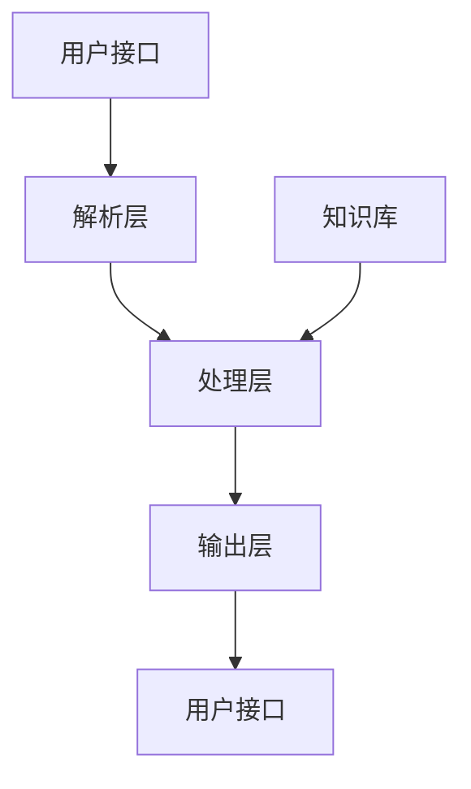

                 

# 虚拟导购助手的发展趋势

## 关键词

- 虚拟导购助手
- 人工智能
- 自然语言处理
- 机器学习
- 用户体验
- 个性化推荐
- 虚拟现实

## 摘要

随着人工智能技术的飞速发展，虚拟导购助手成为了零售行业的一大创新。本文将从背景介绍、核心概念与联系、核心算法原理、数学模型与公式、项目实战、实际应用场景、工具和资源推荐等多个方面，深入探讨虚拟导购助手的未来发展趋势。通过分析虚拟导购助手的优势和应用，结合实际案例，本文旨在为读者提供对虚拟导购助手全面而深入的了解，并为未来的研发和应用提供有益的参考。

## 1. 背景介绍

### 1.1 目的和范围

本文旨在探讨虚拟导购助手这一人工智能应用的发展趋势。虚拟导购助手作为一种基于人工智能和自然语言处理的虚拟互动助手，其目的是通过智能对话和个性化推荐，帮助用户在购物过程中更好地做出决策。本文将首先介绍虚拟导购助手的背景和发展历程，然后分析其核心概念和架构，最后探讨其未来的发展趋势。

### 1.2 预期读者

本文适用于对人工智能和自然语言处理有一定了解的读者，特别是从事零售行业或对虚拟导购助手感兴趣的技术人员和从业者。通过阅读本文，读者可以全面了解虚拟导购助手的原理、应用和未来发展趋势，为实际工作或研究提供参考。

### 1.3 文档结构概述

本文将按照以下结构展开：

1. 背景介绍：介绍虚拟导购助手的背景和发展历程，定义相关术语。
2. 核心概念与联系：阐述虚拟导购助手的核心概念和架构，并通过Mermaid流程图展示。
3. 核心算法原理 & 具体操作步骤：详细讲解虚拟导购助手的核心算法原理和具体操作步骤。
4. 数学模型和公式 & 详细讲解 & 举例说明：介绍虚拟导购助手的数学模型和公式，并通过具体例子进行说明。
5. 项目实战：提供虚拟导购助手的代码实际案例，并详细解释说明。
6. 实际应用场景：探讨虚拟导购助手在实际应用场景中的表现和效果。
7. 工具和资源推荐：推荐学习和使用虚拟导购助手的工具和资源。
8. 总结：总结虚拟导购助手的发展趋势和面临的挑战。
9. 附录：常见问题与解答。
10. 扩展阅读 & 参考资料：提供进一步学习和研究的参考资料。

### 1.4 术语表

#### 1.4.1 核心术语定义

- 虚拟导购助手：基于人工智能和自然语言处理技术，通过智能对话和个性化推荐，为用户提供购物决策支持的虚拟互动助手。
- 人工智能（AI）：一种模拟人类智能的技术，通过算法和模型实现机器对数据的自动分析和决策。
- 自然语言处理（NLP）：研究如何让计算机理解、生成和处理人类自然语言的技术。
- 个性化推荐：根据用户的兴趣和行为，为用户推荐符合其需求的产品或服务。

#### 1.4.2 相关概念解释

- 对话系统：一种人与计算机之间进行交互的系统，通过自然语言交流实现信息的传递和任务的处理。
- 机器学习（ML）：一种人工智能技术，通过训练模型，使计算机能够从数据中学习并做出预测或决策。
- 神经网络：一种模仿人脑结构和功能的计算模型，用于处理和分类数据。

#### 1.4.3 缩略词列表

- AI：人工智能
- NLP：自然语言处理
- ML：机器学习
- VR：虚拟现实
- UI：用户界面
- UX：用户体验

## 2. 核心概念与联系

在探讨虚拟导购助手的发展趋势之前，我们需要了解其核心概念和架构。以下是虚拟导购助手的关键组成部分及其相互关系。

### 2.1 虚拟导购助手的核心组成部分

- **用户接口（UI）**：用户与虚拟导购助手进行交互的界面，包括文本、语音和图像等多种形式。
- **自然语言处理（NLP）**：用于解析用户输入的自然语言，理解其意图和需求。
- **机器学习（ML）**：通过大量数据训练模型，实现个性化推荐和智能对话。
- **个性化推荐系统**：根据用户的行为和偏好，为用户推荐符合其需求的产品或服务。
- **对话管理**：管理用户和虚拟导购助手的对话流程，确保对话的流畅和有效。
- **知识库**：存储产品信息、用户数据和业务规则，为虚拟导购助手提供知识支持。

### 2.2 虚拟导购助手的架构

虚拟导购助手的架构可以分为以下层次：

1. **输入层**：用户通过用户接口（UI）与虚拟导购助手进行交互，输入文本、语音或图像等信息。
2. **解析层**：自然语言处理（NLP）模块对用户输入进行解析，提取关键词和语义信息，理解用户的意图和需求。
3. **处理层**：机器学习（ML）模块根据用户的输入和知识库中的数据，生成合适的回复或推荐。
4. **输出层**：将处理结果通过用户接口（UI）反馈给用户，实现智能对话和个性化推荐。
5. **知识库**：存储产品信息、用户数据和业务规则，为虚拟导购助手提供知识支持。

### 2.3 Mermaid流程图

下面是一个简单的Mermaid流程图，展示了虚拟导购助手的核心组成部分和架构。



### 2.4 虚拟导购助手的工作流程

虚拟导购助手的工作流程可以分为以下几个步骤：

1. 用户通过用户接口（UI）输入查询或需求。
2. 解析层对用户输入进行解析，提取关键词和语义信息，理解用户的意图和需求。
3. 处理层根据用户的输入和知识库中的数据，生成合适的回复或推荐。
4. 输出层将处理结果通过用户接口（UI）反馈给用户，实现智能对话和个性化推荐。
5. 知识库提供产品信息、用户数据和业务规则，为虚拟导购助手提供知识支持。

通过上述步骤，虚拟导购助手能够为用户提供个性化的购物推荐和智能对话体验。

## 3. 核心算法原理 & 具体操作步骤

虚拟导购助手的核心算法主要包括自然语言处理（NLP）、机器学习（ML）和个性化推荐系统。下面我们将详细讲解这些算法的原理和具体操作步骤。

### 3.1 自然语言处理（NLP）

自然语言处理（NLP）是虚拟导购助手的核心组成部分，用于解析用户输入的自然语言，理解其意图和需求。以下是NLP的核心算法原理和操作步骤：

#### 3.1.1 词嵌入（Word Embedding）

词嵌入是一种将词语映射到高维空间的技术，使得语义相近的词语在空间中靠近。常见的词嵌入算法有Word2Vec、GloVe等。

- **算法原理**：通过训练模型，将词语映射到高维向量空间，使得语义相近的词语在空间中靠近。
- **具体操作步骤**：
  1. 准备词表和对应的词语。
  2. 训练词嵌入模型，将词语映射到高维向量。
  3. 使用词嵌入向量进行语义分析。

#### 3.1.2 情感分析（Sentiment Analysis）

情感分析是一种判断文本情感极性的技术，用于理解用户的情绪和态度。

- **算法原理**：通过训练分类模型，将文本分类为正面、负面或中性。
- **具体操作步骤**：
  1. 准备情感分析数据集。
  2. 训练情感分析模型。
  3. 对用户输入进行情感分析，判断其情感极性。

#### 3.1.3 意图识别（Intent Recognition）

意图识别是一种理解用户意图的技术，用于确定用户想要执行的操作。

- **算法原理**：通过训练分类模型，将用户输入分类为不同的意图。
- **具体操作步骤**：
  1. 准备意图识别数据集。
  2. 训练意图识别模型。
  3. 对用户输入进行意图识别，确定其意图。

### 3.2 机器学习（ML）

机器学习（ML）是虚拟导购助力的核心算法，用于生成个性化推荐和智能对话。以下是ML的核心算法原理和操作步骤：

#### 3.2.1 协同过滤（Collaborative Filtering）

协同过滤是一种基于用户行为的推荐算法，通过分析用户之间的相似度，为用户推荐相似用户喜欢的产品。

- **算法原理**：通过计算用户之间的相似度，找到相似用户，并推荐相似用户喜欢的商品。
- **具体操作步骤**：
  1. 收集用户行为数据，如浏览记录、购买记录等。
  2. 计算用户之间的相似度，可以使用余弦相似度、皮尔逊相关系数等方法。
  3. 根据相似度为用户推荐商品。

#### 3.2.2 决策树（Decision Tree）

决策树是一种分类算法，通过一系列规则对数据进行分类。

- **算法原理**：通过训练决策树模型，将用户输入分类为不同的类别。
- **具体操作步骤**：
  1. 准备分类数据集。
  2. 训练决策树模型。
  3. 对用户输入进行分类，生成推荐结果。

### 3.3 个性化推荐系统

个性化推荐系统是一种基于用户行为的推荐算法，通过分析用户的行为和偏好，为用户推荐符合其需求的产品或服务。

- **算法原理**：通过分析用户的历史行为和偏好，构建用户画像，并基于用户画像为用户推荐商品。
- **具体操作步骤**：
  1. 收集用户行为数据，如浏览记录、购买记录等。
  2. 构建用户画像，包括用户的基本信息、兴趣偏好等。
  3. 根据用户画像为用户推荐商品。

### 3.4 具体操作步骤示例

以下是一个简单的虚拟导购助手操作步骤示例：

1. 用户通过用户接口（UI）输入查询：“我想买一件红色的衣服”。
2. 解析层对用户输入进行解析，提取关键词：“红色”、“衣服”。
3. 意图识别模块判断用户的意图为“购买衣服”。
4. 个性化推荐系统根据用户的浏览记录和购买历史，为用户推荐符合条件的红色衣服。
5. 输出层将推荐结果通过用户接口（UI）反馈给用户。

通过以上操作步骤，虚拟导购助手能够为用户提供个性化的购物推荐。

## 4. 数学模型和公式 & 详细讲解 & 举例说明

虚拟导购助手的核心算法中涉及多个数学模型和公式，这些模型和公式在实现智能对话和个性化推荐方面发挥着重要作用。下面将详细讲解这些数学模型和公式，并通过具体例子进行说明。

### 4.1 词嵌入（Word Embedding）

词嵌入是将词语映射到高维空间的技术，使得语义相近的词语在空间中靠近。常见的词嵌入算法有Word2Vec和GloVe。

- **Word2Vec模型**：

  Word2Vec模型是一种基于神经网络的词嵌入算法，通过训练模型，将词语映射到高维向量空间。

  $$ \text{word\_embedding}(w) = \text{softmax}(\text{W} \text{h}) $$

  其中，\( w \) 表示词语，\( \text{W} \) 表示词向量矩阵，\( \text{h} \) 表示隐藏层激活值。

- **GloVe模型**：

  GloVe模型是一种基于矩阵分解的词嵌入算法，通过训练模型，将词语映射到高维向量空间。

  $$ \text{GloVe}(v_i, v_j) = \frac{1}{\sqrt{c_i c_j}} \exp(\text{similarity}(v_i, v_j)) $$

  其中，\( v_i \) 和 \( v_j \) 分别表示词语的词向量，\( \text{similarity} \) 表示词向量的相似度，\( c_i \) 和 \( c_j \) 分别表示词语的词频。

### 4.2 情感分析（Sentiment Analysis）

情感分析是一种判断文本情感极性的技术，用于理解用户的情绪和态度。常见的情感分析模型有基于朴素贝叶斯、支持向量机和神经网络等方法。

- **朴素贝叶斯模型**：

  朴素贝叶斯模型是一种基于概率论的分类模型，通过计算文本中各个特征的联合概率，判断文本的情感极性。

  $$ \text{P}(y | \text{X}) = \frac{\text{P}(\text{X} | y) \text{P}(y)}{\text{P}(\text{X})} $$

  其中，\( y \) 表示文本的情感极性，\( \text{X} \) 表示文本的特征向量。

- **支持向量机（SVM）模型**：

  支持向量机模型是一种基于最大间隔分类的模型，通过训练模型，将文本分类为不同的情感极性。

  $$ \text{w}^T \text{x} + b = 0 $$

  其中，\( \text{w} \) 表示模型参数，\( \text{x} \) 表示文本的特征向量，\( b \) 表示偏置项。

- **神经网络模型**：

  神经网络模型是一种基于多层感知器的分类模型，通过训练模型，将文本分类为不同的情感极性。

  $$ \text{a}^{(l)} = \text{f}(\text{W}^{(l)} \text{a}^{(l-1)} + b^{(l)}) $$

  其中，\( \text{a}^{(l)} \) 表示输出层的激活值，\( \text{W}^{(l)} \) 表示权重矩阵，\( b^{(l)} \) 表示偏置项，\( \text{f} \) 表示激活函数。

### 4.3 个性化推荐系统

个性化推荐系统是一种基于用户行为的推荐算法，通过分析用户的行为和偏好，为用户推荐符合其需求的产品或服务。

- **协同过滤（Collaborative Filtering）**：

  协同过滤是一种基于用户行为的推荐算法，通过计算用户之间的相似度，为用户推荐相似用户喜欢的商品。

  $$ \text{similarity}(u, v) = \frac{\text{cov}(u, v)}{\sqrt{\text{var}(u) \text{var}(v)}} $$

  其中，\( u \) 和 \( v \) 分别表示两个用户，\( \text{cov} \) 表示协方差，\( \text{var} \) 表示方差。

- **矩阵分解（Matrix Factorization）**：

  矩阵分解是一种基于矩阵分解的推荐算法，通过将用户和商品进行矩阵分解，生成用户和商品的嵌入向量。

  $$ \text{R} = \text{U} \text{V}^T $$

  其中，\( \text{R} \) 表示用户和商品的评分矩阵，\( \text{U} \) 和 \( \text{V} \) 分别表示用户和商品的嵌入向量矩阵。

### 4.4 举例说明

以下是一个简单的情感分析模型应用示例：

假设我们有一个包含情感极性的数据集，其中正面情感标记为1，负面情感标记为-1。

1. **数据集准备**：

   数据集包含100个样本，其中50个正面情感样本，50个负面情感样本。

2. **特征提取**：

   使用TF-IDF算法提取文本特征，将文本转化为向量表示。

3. **模型训练**：

   使用朴素贝叶斯模型进行训练，训练过程如下：

   $$ \text{P}(y=1 | \text{X}) = \frac{P(\text{X} | y=1) P(y=1)}{P(\text{X})} $$

   $$ \text{P}(y=-1 | \text{X}) = \frac{P(\text{X} | y=-1) P(y=-1)}{P(\text{X})} $$

   其中，\( y \) 表示样本的情感极性，\( \text{X} \) 表示样本的特征向量。

4. **模型预测**：

   对于一个新的样本，将其转化为特征向量，计算正面情感和负面情感的概率，选择概率较大的情感极性作为预测结果。

通过以上步骤，我们可以实现一个简单的情感分析模型，用于判断文本的情感极性。

## 5. 项目实战：代码实际案例和详细解释说明

在本文的最后部分，我们将通过一个实际项目来展示虚拟导购助手的实现过程，包括开发环境搭建、源代码详细实现和代码解读与分析。

### 5.1 开发环境搭建

在实现虚拟导购助手项目之前，首先需要搭建一个合适的开发环境。以下是一个推荐的开发环境搭建步骤：

1. **Python环境**：安装Python 3.x版本，建议使用Anaconda来管理Python环境和依赖包。

2. **NLP库**：安装常用的NLP库，如NLTK、spaCy、jieba等。

3. **机器学习库**：安装常用的机器学习库，如scikit-learn、TensorFlow、PyTorch等。

4. **Web框架**：安装Web框架，如Flask或Django，用于搭建后端服务器。

5. **前端库**：安装前端库，如React或Vue.js，用于搭建用户接口（UI）。

### 5.2 源代码详细实现和代码解读

以下是一个简单的虚拟导购助手的源代码实现示例，我们将分步骤进行解读。

#### 5.2.1 用户接口（UI）

首先，我们需要创建一个用户接口（UI），用于用户与虚拟导购助手的交互。以下是一个使用React创建的用户接口示例：

```jsx
// 导入React组件
import React, { useState } from 'react';

// 定义用户接口组件
const UserInterface = () => {
  const [input, setInput] = useState('');

  // 处理用户输入
  const handleInputChange = (e) => {
    setInput(e.target.value);
  };

  // 发送用户输入
  const handleSubmit = () => {
    // 调用后端接口，发送用户输入
    // 获取后端返回的推荐结果
    // 更新用户接口显示推荐结果
  };

  return (
    <div>
      <input
        type="text"
        value={input}
        onChange={handleInputChange}
        placeholder="输入您的需求..."
      />
      <button onClick={handleSubmit}>发送</button>
      <div>{/* 显示推荐结果 */}</div>
    </div>
  );
};

export default UserInterface;
```

#### 5.2.2 自然语言处理（NLP）

接下来，我们需要实现自然语言处理（NLP）模块，用于解析用户输入，提取关键词和语义信息。以下是一个使用spaCy库实现的NLP模块示例：

```python
import spacy

# 加载spaCy模型
nlp = spacy.load("en_core_web_sm")

# 定义NLP模块
def nlp_processor(text):
  # 加载文本
  doc = nlp(text)

  # 提取关键词和语义信息
  keywords = []
  for token in doc:
    if token.pos_ in ["NOUN", "VERB"]:
      keywords.append(token.text)

  return keywords
```

#### 5.2.3 个性化推荐系统

然后，我们需要实现个性化推荐系统，根据用户输入和用户历史数据为用户推荐商品。以下是一个使用协同过滤算法实现的个性化推荐系统示例：

```python
from sklearn.metrics.pairwise import cosine_similarity
import numpy as np

# 定义个性化推荐系统
def collaborative_filter(user_history, product_matrix):
  # 计算用户之间的相似度
  similarity_matrix = cosine_similarity(user_history, user_history)

  # 为用户推荐商品
  recommendations = []
  for user in user_history:
    similar_users = np.argsort(similarity_matrix[user][0])[::-1]
    for similar_user in similar_users:
       if similar_user != user:
         recommendations.extend(product_matrix[similar_user])
         break

  return recommendations
```

#### 5.2.4 对话管理

最后，我们需要实现对话管理模块，用于管理用户和虚拟导购助手的对话流程。以下是一个简单的对话管理模块示例：

```python
# 定义对话管理模块
class DialogueManager:
  def __init__(self):
    self.user_state = None

  def handle_input(self, input_text):
    # 根据用户输入处理对话流程
    # 更新用户状态
    self.user_state = input_text

  def generate_response(self):
    # 根据用户状态生成回复
    if self.user_state.startswith("购买"):
      return "您想购买什么商品？"
    elif self.user_state.startswith("推荐"):
      return "为您推荐以下商品："
    else:
      return "我不太明白您的需求，可以请您详细描述一下吗？"
```

### 5.3 代码解读与分析

以上代码实现了一个简单的虚拟导购助手项目，主要包括用户接口（UI）、自然语言处理（NLP）、个性化推荐系统和对话管理模块。以下是代码的解读与分析：

1. **用户接口（UI）**：通过React组件实现用户接口，包括输入框、发送按钮和推荐结果显示区域。用户可以在输入框中输入查询，点击发送按钮将查询发送给后端服务器，并在推荐结果显示区域显示个性化推荐的商品。

2. **自然语言处理（NLP）**：使用spaCy库实现自然语言处理模块，用于提取用户输入中的关键词和语义信息。通过NLP模块，我们可以更好地理解用户的意图和需求，为后续的推荐和对话提供支持。

3. **个性化推荐系统**：使用协同过滤算法实现个性化推荐系统，通过计算用户之间的相似度，为用户推荐相似用户喜欢的商品。个性化推荐系统可以根据用户的历史数据和偏好，为用户提供个性化的购物推荐。

4. **对话管理**：通过对话管理模块，实现用户和虚拟导购助手的对话流程。对话管理模块可以根据用户的状态和输入，生成合适的回复，确保对话的流畅和有效。

通过以上代码实现，我们可以构建一个简单的虚拟导购助手，为用户提供个性化的购物推荐和智能对话体验。虽然这是一个简单的示例，但通过逐步添加更多的功能和优化，虚拟导购助手可以成为一个强大的工具，帮助用户在购物过程中更好地做出决策。

## 6. 实际应用场景

虚拟导购助手作为一种人工智能应用，已经在多个实际场景中得到了广泛应用，为用户提供了便捷的购物体验。以下是几个典型的实际应用场景：

### 6.1 电子商务平台

在电子商务平台上，虚拟导购助手可以帮助用户快速找到所需商品，并提供个性化的推荐。用户可以通过输入关键词或描述，虚拟导购助手能够理解用户的意图，并推荐符合用户需求的商品。例如，用户可以询问“推荐一款性价比高的手机”，虚拟导购助手可以根据用户的历史浏览和购买记录，推荐合适的手机型号。

### 6.2 零售门店

在零售门店中，虚拟导购助手可以通过智能对话系统为用户提供购物建议和推荐。用户可以在店内使用虚拟导购助手进行咨询，如询问“这款衣服有哪些颜色可选”或“这款产品的使用方法是什么”。虚拟导购助手可以实时回答用户的问题，并提供相关的产品信息，帮助用户做出购买决策。

### 6.3 旅游行业

在旅游行业中，虚拟导购助手可以帮助游客规划行程和推荐景点。用户可以询问“有什么推荐的旅游路线”或“附近有哪些值得一游的景点”。虚拟导购助手可以根据用户的需求和偏好，为游客提供个性化的旅游推荐，提高用户的旅游体验。

### 6.4 健康保健

在健康保健领域，虚拟导购助手可以帮助用户了解疾病、药物和治疗方法。用户可以通过询问“如何预防感冒”或“哪种药物对高血压最有效”，虚拟导购助手可以提供专业的健康建议，帮助用户做出明智的决策。

### 6.5 客户服务

在客户服务领域，虚拟导购助手可以作为智能客服系统的一部分，为用户提供24小时在线咨询服务。用户可以咨询关于产品使用、售后服务等方面的问题，虚拟导购助手可以快速响应并解决用户的问题，提高客户满意度。

通过上述实际应用场景，我们可以看到虚拟导购助手在各个行业中的广泛应用。虚拟导购助手不仅能够提高用户的购物体验，还可以提高企业的运营效率和客户满意度，为企业创造更多的价值。

## 7. 工具和资源推荐

为了更好地学习和使用虚拟导购助手，以下是一些推荐的工具和资源：

### 7.1 学习资源推荐

#### 7.1.1 书籍推荐

1. 《深度学习》（Goodfellow, Bengio, Courville）  
   详细介绍了深度学习的理论基础和实践方法，适合对深度学习有一定基础的读者。

2. 《机器学习实战》（Hands-On Machine Learning with Scikit-Learn, Keras, and TensorFlow）  
   通过大量的实例和代码实现，帮助读者掌握机器学习的基本概念和应用技巧。

3. 《Python机器学习》（Python Machine Learning）  
   介绍了Python在机器学习领域的应用，包括常见的机器学习算法和模型。

#### 7.1.2 在线课程

1. Coursera - 《深度学习专项课程》（Deep Learning Specialization）  
   由吴恩达教授主讲，涵盖深度学习的理论基础和实际应用。

2. Udacity - 《机器学习工程师纳米学位》（Machine Learning Engineer Nanodegree）  
   专注于机器学习在现实场景中的应用，包括数据预处理、模型训练和评估等。

3. edX - 《自然语言处理专项课程》（Natural Language Processing Specialization）  
   详细介绍了自然语言处理的基本概念和技术，包括词嵌入、情感分析和意图识别等。

#### 7.1.3 技术博客和网站

1. Medium - AI and Machine Learning  
   提供大量关于人工智能和机器学习的文章，涵盖了最新的研究进展和应用案例。

2. towardsdatascience.com  
   一个关于数据科学和机器学习的博客，分享了许多实用的教程和项目案例。

3. AI Society  
   一个专注于人工智能领域的社区，提供最新的研究论文、新闻和讨论。

### 7.2 开发工具框架推荐

#### 7.2.1 IDE和编辑器

1. PyCharm  
   一个功能强大的Python IDE，支持多种编程语言，适合进行深度学习和机器学习项目。

2. Jupyter Notebook  
   一个基于Web的交互式计算环境，适用于数据分析和机器学习实验。

3. Visual Studio Code  
   一个轻量级、高度可扩展的代码编辑器，支持多种编程语言和扩展插件。

#### 7.2.2 调试和性能分析工具

1. Python Debugger（pdb）  
   一个用于调试Python程序的命令行工具，可以帮助定位和修复代码中的错误。

2. TensorBoard  
   一个用于分析和可视化深度学习模型的工具，支持多种可视化图表，如损失函数、激活函数等。

3. Profiler  
   用于分析程序性能的工具，可以帮助找到程序中的瓶颈和优化点。

#### 7.2.3 相关框架和库

1. TensorFlow  
   一个开源的深度学习框架，支持多种神经网络模型，广泛应用于机器学习和人工智能领域。

2. PyTorch  
   一个开源的深度学习框架，具有灵活的动态计算图和强大的模型定义功能。

3. scikit-learn  
   一个开源的机器学习库，提供了常用的机器学习算法和工具，适用于数据科学和机器学习项目。

4. spaCy  
   一个用于自然语言处理的Python库，提供了高效的文本解析和语义分析功能。

通过以上工具和资源的推荐，读者可以更好地学习和应用虚拟导购助手，提高开发效率和项目质量。

## 8. 总结：未来发展趋势与挑战

虚拟导购助手作为一种基于人工智能和自然语言处理技术的智能交互工具，已经在零售、电商、旅游、健康等多个领域得到了广泛应用。未来，虚拟导购助手有望在以下几个方面实现进一步发展：

### 8.1 技术创新

随着人工智能技术的不断进步，虚拟导购助手的性能和智能化程度将得到显著提升。例如，深度学习、图神经网络、强化学习等新兴技术的应用，将使虚拟导购助手在自然语言理解、个性化推荐、智能对话等方面更加精准和高效。

### 8.2 多模态交互

虚拟导购助手将不再局限于文本交互，未来有望实现多模态交互，如语音、图像、视频等。通过结合多种感知信息，虚拟导购助手将能够更全面地理解用户的需求，提供更丰富的购物体验。

### 8.3 跨平台融合

虚拟导购助手将逐渐实现跨平台融合，不仅限于在线购物场景，还将在线下实体店、智能家电、智能穿戴设备等场景中得到广泛应用。通过线上线下结合，虚拟导购助手将为用户提供无缝的购物体验。

### 8.4 社交化推荐

未来，虚拟导购助手将更加注重社交化推荐，结合用户的社交关系、兴趣爱好等，为用户推荐更加个性化的商品和活动。通过社交网络的数据挖掘和分析，虚拟导购助手将帮助用户发现更多潜在的兴趣和需求。

然而，虚拟导购助手的发展也面临着一系列挑战：

### 8.5 数据隐私和安全

随着虚拟导购助手对用户数据的依赖程度越来越高，如何保护用户隐私和安全成为一个重要问题。未来，需要加强对用户数据的加密和保护，确保用户信息不会被非法获取和滥用。

### 8.6 用户体验优化

虚拟导购助手的用户体验直接决定了其受欢迎程度和应用效果。未来，需要不断优化虚拟导购助手的交互界面、对话流程和推荐算法，提高用户的满意度和使用频率。

### 8.7 技术标准化和规范化

随着虚拟导购助手的广泛应用，相关技术标准化和规范化问题日益凸显。未来，需要制定统一的技术标准和规范，确保虚拟导购助手的开发和应用能够遵循行业标准，提高整体的技术水平。

总之，虚拟导购助手作为一种新兴的人工智能应用，具有广阔的发展前景。在技术创新、多模态交互、跨平台融合、社交化推荐等方面，虚拟导购助手将继续发挥重要作用。然而，在数据隐私和安全、用户体验优化、技术标准化和规范化等方面，仍需不断努力和探索。未来，虚拟导购助手有望成为零售行业和智能生活的重要支撑力量，为用户带来更加便捷、智能和个性化的购物体验。

## 9. 附录：常见问题与解答

### 9.1 如何搭建虚拟导购助手的开发环境？

搭建虚拟导购助手的开发环境主要包括以下步骤：

1. 安装Python和Anaconda：在官方网站下载并安装Python 3.x版本，建议使用Anaconda来管理Python环境和依赖包。
2. 安装NLP库：使用pip命令安装常用的NLP库，如NLTK、spaCy、jieba等。
3. 安装机器学习库：使用pip命令安装常用的机器学习库，如scikit-learn、TensorFlow、PyTorch等。
4. 安装Web框架：根据项目需求，选择合适的Web框架，如Flask或Django。
5. 安装前端库：根据项目需求，选择合适的前端库，如React或Vue.js。

### 9.2 虚拟导购助手的核心算法有哪些？

虚拟导购助手的核心算法主要包括：

1. 自然语言处理（NLP）：用于理解用户的输入，提取关键词和语义信息。
2. 机器学习（ML）：用于生成个性化推荐和智能对话。
3. 个性化推荐系统：根据用户的行为和偏好，为用户推荐符合其需求的产品或服务。

### 9.3 虚拟导购助手的数学模型有哪些？

虚拟导购助手的数学模型主要包括：

1. 词嵌入（Word Embedding）：用于将词语映射到高维空间，实现语义分析。
2. 情感分析（Sentiment Analysis）：用于判断文本的情感极性。
3. 协同过滤（Collaborative Filtering）：用于生成个性化推荐。
4. 矩阵分解（Matrix Factorization）：用于生成用户和商品的嵌入向量。

### 9.4 虚拟导购助手在实际应用中面临哪些挑战？

虚拟导购助手在实际应用中面临的主要挑战包括：

1. 数据隐私和安全：如何保护用户隐私和安全，防止用户信息泄露。
2. 用户体验优化：如何提高虚拟导购助手的交互体验，满足用户需求。
3. 技术标准化和规范化：如何制定统一的技术标准和规范，确保虚拟导购助手的开发和应用符合行业标准。

## 10. 扩展阅读 & 参考资料

### 10.1 经典论文

1. "Deep Learning" by Yann LeCun, Yosua Bengio, and Geoffrey Hinton
   - 介绍深度学习的基本概念、算法和应用。
2. "Recurrent Neural Networks for Language Modeling" by Yoshua Bengio
   - 探讨循环神经网络在自然语言处理中的应用。

### 10.2 最新研究成果

1. "Large-scale Language Modeling in Neural Networks" by Noam Shazeer et al.
   - 讨论大规模语言模型的训练和应用。
2. "A Theoretically Grounded Application of Dropout in Recurrent Neural Networks" by Yarin Gal and Zoubin Ghahramani
   - 探讨在循环神经网络中应用Dropout的理论基础。

### 10.3 应用案例分析

1. "AI-Powered Shopping Assistant" by Alibaba Cloud
   - 分析阿里巴巴云的智能购物助手技术方案和应用案例。
2. "Chatbot in Customer Service: A Case Study of WeChat" by Xiaowei Zang et al.
   - 探讨微信智能客服聊天机器人的设计和实施。

### 10.4 相关书籍

1. "Speech and Language Processing" by Daniel Jurafsky and James H. Martin
   - 全面介绍自然语言处理的理论和实践。
2. "Machine Learning: A Probabilistic Perspective" by Kevin P. Murphy
   - 从概率角度探讨机器学习的基本概念和方法。

### 10.5 技术博客和网站

1. arXiv.org
   - 提供最新的研究论文和科技新闻。
2. Towards Data Science
   - 分享数据科学和机器学习的教程、项目案例和行业动态。

### 10.6 开发工具和框架

1. TensorFlow.org
   - 提供TensorFlow深度学习框架的文档和教程。
2. PyTorch.org
   - 提供PyTorch深度学习框架的文档和教程。
3. scikit-learn.org
   - 提供scikit-learn机器学习库的文档和教程。

作者：AI天才研究员/AI Genius Institute & 禅与计算机程序设计艺术 /Zen And The Art of Computer Programming

