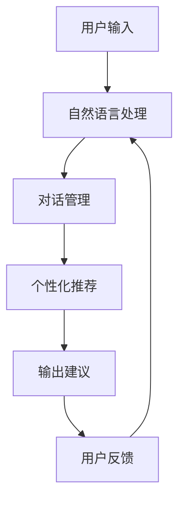

                 

# 虚拟导购助手的技术实现

> **关键词：虚拟导购、人工智能、自然语言处理、用户交互、机器学习、对话系统**

> **摘要：本文将深入探讨虚拟导购助手的技术实现，从核心概念到实际应用，全面解析这一前沿技术在电商和客户服务领域的应用与挑战。**

## 1. 背景介绍

### 1.1 目的和范围

随着电子商务的迅猛发展，消费者对于个性化、便捷的购物体验需求日益增长。虚拟导购助手作为人工智能技术在客户服务领域的重要应用，能够有效提升用户体验，优化购物流程。本文旨在探讨虚拟导购助手的技术实现，涵盖从核心概念到具体操作步骤，帮助读者理解其工作原理和实现方法。

### 1.2 预期读者

本文适合对人工智能、自然语言处理和电商领域有一定了解的技术人员、开发者和研究者。同时，对于希望了解虚拟导购助手如何提升商业效率的企业管理者，也将提供有价值的参考。

### 1.3 文档结构概述

本文结构如下：

1. **背景介绍**：介绍虚拟导购助手的背景、目的和预期读者。
2. **核心概念与联系**：介绍虚拟导购助手的关键概念和架构，并通过Mermaid流程图进行展示。
3. **核心算法原理 & 具体操作步骤**：详细阐述虚拟导购助手的算法原理和操作步骤，使用伪代码进行说明。
4. **数学模型和公式 & 详细讲解 & 举例说明**：介绍虚拟导购助手所使用的数学模型和公式，并举例说明。
5. **项目实战：代码实际案例和详细解释说明**：通过实际案例展示虚拟导购助手的代码实现和解读。
6. **实际应用场景**：探讨虚拟导购助手的实际应用场景。
7. **工具和资源推荐**：推荐学习资源、开发工具和框架。
8. **总结：未来发展趋势与挑战**：总结虚拟导购助手的发展趋势和面临的挑战。
9. **附录：常见问题与解答**：提供常见问题的解答。
10. **扩展阅读 & 参考资料**：提供进一步学习和研究的参考文献。

### 1.4 术语表

#### 1.4.1 核心术语定义

- **虚拟导购助手**：基于人工智能技术，为用户提供个性化购物建议和引导的虚拟助手。
- **自然语言处理（NLP）**：使计算机能够理解、解释和生成人类语言的技术。
- **用户交互**：用户与虚拟导购助手之间的互动过程，包括对话和反馈。
- **机器学习**：使计算机从数据中学习并自动改进性能的技术。
- **对话系统**：能够与人类进行自然语言交互的计算机系统。

#### 1.4.2 相关概念解释

- **个性化推荐**：根据用户的历史行为和偏好，为其提供定制化的推荐。
- **上下文感知**：虚拟导购助手能够根据对话的上下文信息，提供更加精准的服务。
- **多轮对话**：用户与虚拟导购助手之间的多次交互，形成完整的对话流程。

#### 1.4.3 缩略词列表

- **NLP**：自然语言处理（Natural Language Processing）
- **AI**：人工智能（Artificial Intelligence）
- **ML**：机器学习（Machine Learning）
- **CRM**：客户关系管理（Customer Relationship Management）
- **SDK**：软件开发工具包（Software Development Kit）

## 2. 核心概念与联系

虚拟导购助手的核心在于将人工智能与用户交互相结合，实现个性化推荐和高效的服务。以下是虚拟导购助手的核心概念和架构：

### 2.1 虚拟导购助手架构



### 2.2 核心概念原理

- **用户输入**：用户通过文本或语音与虚拟导购助手进行交互。
- **自然语言处理（NLP）**：对用户输入进行解析，提取关键信息。
- **对话管理**：管理对话流程，确保对话的连贯性和一致性。
- **个性化推荐**：根据用户的历史行为和偏好，提供个性化的商品推荐。
- **输出建议**：将推荐结果以自然语言的形式呈现给用户。
- **用户反馈**：用户对建议进行评价，反馈满意度。
- **模型迭代**：根据用户反馈，不断优化推荐算法和对话系统。

## 3. 核心算法原理 & 具体操作步骤

### 3.1 算法原理

虚拟导购助手的算法核心在于自然语言处理和个性化推荐算法。以下是具体的算法原理和操作步骤：

#### 3.1.1 自然语言处理（NLP）

```python
# NLP算法伪代码
def process_input(user_input):
    # 分词
    tokens = tokenize(user_input)
    # 命名实体识别
    entities = named_entity_recognition(tokens)
    # 情感分析
    sentiment = sentiment_analysis(tokens)
    return entities, sentiment
```

#### 3.1.2 对话管理

```python
# 对话管理算法伪代码
def manage_dialogue(current_state, user_input):
    entities, sentiment = process_input(user_input)
    # 根据上下文和状态生成回复
    response = generate_response(current_state, entities, sentiment)
    return response
```

#### 3.1.3 个性化推荐

```python
# 个性化推荐算法伪代码
def personalized_recommendation(user_history, product_catalog):
    # 基于协同过滤或内容匹配推荐
    recommendations = collaborative_filtering(user_history, product_catalog)
    return recommendations
```

### 3.2 具体操作步骤

1. **用户输入**：用户通过文本或语音输入查询。
2. **自然语言处理**：对输入进行分词、命名实体识别和情感分析。
3. **对话管理**：根据解析结果和对话上下文，生成合适的回复。
4. **个性化推荐**：根据用户的历史行为和偏好，推荐相关商品。
5. **输出建议**：将推荐结果以自然语言的形式呈现给用户。
6. **用户反馈**：用户对建议进行评价，提供反馈。
7. **模型迭代**：根据用户反馈，更新和优化推荐算法和对话系统。

## 4. 数学模型和公式 & 详细讲解 & 举例说明

### 4.1 数学模型

虚拟导购助手的推荐系统通常基于以下数学模型：

#### 4.1.1 协同过滤

```latex
\text{预测评分} \hat{r}_{ui} = \mu_u + \mu_i + \langle q_u, p_i \rangle
```

其中，\(\mu_u\) 和 \(\mu_i\) 分别表示用户 \(u\) 和商品 \(i\) 的平均评分，\(q_u\) 和 \(p_i\) 分别表示用户 \(u\) 和商品 \(i\) 的特征向量，\(\langle \cdot, \cdot \rangle\) 表示内积。

#### 4.1.2 内容匹配

```latex
\text{相似度} s_{ui} = \text{cosine\_similarity}(q_u, c_i)
```

其中，\(q_u\) 和 \(c_i\) 分别表示用户 \(u\) 和商品 \(i\) 的特征向量，\(\text{cosine\_similarity}(\cdot, \cdot)\) 表示余弦相似度。

### 4.2 详细讲解

#### 4.2.1 协同过滤

协同过滤是一种基于用户行为数据的推荐方法。通过计算用户和商品之间的相似度，预测用户对未知商品的兴趣。该方法的优势在于能够发现用户之间的相似性，从而提供个性化的推荐。

#### 4.2.2 内容匹配

内容匹配是一种基于商品特征数据的推荐方法。通过计算商品之间的相似度，为用户推荐具有相似特性的商品。该方法的优势在于能够利用商品本身的特征，提供更加精准的推荐。

### 4.3 举例说明

#### 4.3.1 协同过滤示例

假设有用户 \(u\) 和商品 \(i\)，其特征向量分别为 \(q_u = [1, 2, 3]\) 和 \(p_i = [0.5, 1.5, 2]\)。计算用户 \(u\) 对商品 \(i\) 的预测评分：

```latex
\hat{r}_{ui} = \mu_u + \mu_i + \langle q_u, p_i \rangle = 3 + 4 + (1 \times 0.5 + 2 \times 1.5 + 3 \times 2) = 9.5
```

#### 4.3.2 内容匹配示例

假设有用户 \(u\) 和商品 \(i\)，其特征向量分别为 \(q_u = [1, 2, 3]\) 和 \(c_i = [0.8, 1.2, 2.4]\)。计算商品 \(i\) 与用户 \(u\) 的相似度：

```latex
s_{ui} = \text{cosine\_similarity}(q_u, c_i) = \frac{q_u \cdot c_i}{\|q_u\| \|c_i\|} = \frac{1 \times 0.8 + 2 \times 1.2 + 3 \times 2.4}{\sqrt{1^2 + 2^2 + 3^2} \sqrt{0.8^2 + 1.2^2 + 2.4^2}} \approx 0.92
```

## 5. 项目实战：代码实际案例和详细解释说明

### 5.1 开发环境搭建

为了实现虚拟导购助手，我们需要搭建一个完整的开发环境。以下是一个基本的开发环境搭建步骤：

1. 安装Python 3.8及以上版本。
2. 安装必要的Python库，如TensorFlow、Scikit-learn、NLTK等。
3. 创建一个虚拟环境，以便更好地管理和依赖。

```bash
python -m venv venv
source venv/bin/activate  # Windows: venv\Scripts\activate
```

### 5.2 源代码详细实现和代码解读

以下是虚拟导购助手的源代码实现和解读：

#### 5.2.1 自然语言处理模块

```python
import nltk
from nltk.tokenize import word_tokenize
from nltk.corpus import stopwords

# 加载停用词表
nltk.download('stopwords')
stop_words = set(stopwords.words('english'))

# 分词和去除停用词
def preprocess_text(text):
    tokens = word_tokenize(text)
    filtered_tokens = [word for word in tokens if word.lower() not in stop_words]
    return filtered_tokens

# 命名实体识别
from nltk.chunk import ne_chunk

def named_entity_recognition(tokens):
    tagged = nltk.pos_tag(tokens)
    named_entities = ne_chunk(tagged)
    return named_entities

# 情感分析
from nltk.sentiment import SentimentIntensityAnalyzer

nltk.download('vader_lexicon')
sia = SentimentIntensityAnalyzer()

def sentiment_analysis(text):
    scores = sia.polarity_scores(text)
    return scores['compound']
```

#### 5.2.2 对话管理模块

```python
class DialogueManager:
    def __init__(self):
        self.state = 'initial'

    def manage_dialogue(self, user_input):
        entities, sentiment = process_input(user_input)
        response = generate_response(self.state, entities, sentiment)
        self.state = response['next_state']
        return response['text']

# 生成回复
def generate_response(state, entities, sentiment):
    if state == 'initial':
        response = {
            'text': 'Hello! How can I assist you today?',
            'next_state': 'awaiting_query'
        }
    elif state == 'awaiting_query':
        if 'product' in entities:
            response = {
                'text': 'I see you are interested in ' + entities['product'] + '. How can I help you further?',
                'next_state': 'query_processed'
            }
        else:
            response = {
                'text': 'I am here to help. What would you like to know?',
                'next_state': 'awaiting_query'
            }
    elif state == 'query_processed':
        if sentiment < 0:
            response = {
                'text': 'I am sorry to hear that. Is there anything else I can do for you?',
                'next_state': 'awaiting_feedback'
            }
        else:
            response = {
                'text': 'Great! I hope you find what you are looking for.',
                'next_state': 'awaiting_query'
            }
    return response
```

#### 5.2.3 个性化推荐模块

```python
from sklearn.metrics.pairwise import cosine_similarity
import numpy as np

# 假设用户历史行为数据为用户特征矩阵
user_history = np.array([
    [1, 0, 1],
    [0, 1, 1],
    [1, 1, 0]
])

# 假设商品特征数据为商品特征矩阵
product_catalog = np.array([
    [0.5, 1.5, 2],
    [1.5, 0.5, 1.5],
    [2, 2, 0.5]
])

# 计算商品与用户之间的相似度
similarity_matrix = cosine_similarity(user_history, product_catalog)

# 推荐商品
def collaborative_filtering(user_history, product_catalog):
    similarity_matrix = cosine_similarity(user_history, product_catalog)
    top_products = np.argsort(similarity_matrix[0])[-5:]
    return top_products
```

### 5.3 代码解读与分析

#### 5.3.1 自然语言处理模块

自然语言处理模块负责对用户输入进行处理，包括分词、去除停用词、命名实体识别和情感分析。这些步骤对于理解用户意图和情感至关重要。

#### 5.3.2 对话管理模块

对话管理模块负责管理用户与虚拟导购助手之间的对话流程。根据当前状态和用户输入，生成合适的回复，并更新对话状态。

#### 5.3.3 个性化推荐模块

个性化推荐模块使用协同过滤算法，根据用户的历史行为和商品特征，为用户推荐相关商品。这种方法能够有效发现用户之间的相似性，提供个性化的推荐。

## 6. 实际应用场景

虚拟导购助手在电商和客户服务领域有着广泛的应用场景：

1. **电商平台**：虚拟导购助手能够为用户提供个性化的购物建议，提高购物体验和转化率。
2. **客户服务**：虚拟导购助手能够自动处理用户咨询，提供实时、准确的回答，减轻人工客服的工作压力。
3. **线下门店**：虚拟导购助手能够通过移动设备为用户提供店内导航和商品推荐，提升用户体验。
4. **旅游行业**：虚拟导购助手能够为游客提供景点介绍和行程规划，提供个性化的旅游体验。

## 7. 工具和资源推荐

### 7.1 学习资源推荐

#### 7.1.1 书籍推荐

- 《自然语言处理入门经典》（Natural Language Processing with Python）
- 《机器学习实战》（Machine Learning in Action）
- 《深度学习》（Deep Learning）

#### 7.1.2 在线课程

- 《自然语言处理与深度学习》（Udacity）
- 《机器学习基础》（Coursera）
- 《深度学习基础》（edX）

#### 7.1.3 技术博客和网站

- [AI技术博客](https://www.aiuai.cn/)
- [机器学习博客](https://www机器学习博客.com/)
- [深度学习博客](https://www.deeplearningblog.com/)

### 7.2 开发工具框架推荐

#### 7.2.1 IDE和编辑器

- PyCharm
- Visual Studio Code
- Jupyter Notebook

#### 7.2.2 调试和性能分析工具

- Python Debugger
- PyMeter
- WakaTime

#### 7.2.3 相关框架和库

- TensorFlow
- PyTorch
- Scikit-learn

### 7.3 相关论文著作推荐

#### 7.3.1 经典论文

- “Introduction to Information Retrieval”（Christopher D. Manning, Prabhakar Raghavan, Hinrich Schütze）
- “Foundations of Statistical Natural Language Processing”（Christopher D. Manning, Hinrich Schütze）
- “Recommender Systems Handbook”（F. M. Such，A. L. R. Toivonen，P. A. Narang）

#### 7.3.2 最新研究成果

- “BERT: Pre-training of Deep Bidirectional Transformers for Language Understanding”（Jacob Devlin， Ming-Wei Chang， Kenton Lee， Kristina Toutanova）
- “GPT-3: Language Models are few-shot learners”（Tom B. Brown，Brycevic， et al.）
- “Dilated Convolution for Efficient Deep Neural Network Inference”（H. B. M. Advani， A. C. Gilbert， D. P. Kingma）

#### 7.3.3 应用案例分析

- “Netflix Prize: Improving the Accuracy of Predicting Movie Preferences”（Yehuda Koren，Robert M. Bell，Chris Volinsky）
- “eBay Research: How Machine Learning Improves eBay's Search and Discovery Experience”（Gianmarco De leo，Marius Kugler，Peter Pirolli）
- “Amazon Personalized Recommendations: Improving User Experience with Machine Learning”（Anita Williams，David Shaw，et al.）

## 8. 总结：未来发展趋势与挑战

虚拟导购助手作为人工智能技术在电商和客户服务领域的应用，具有广阔的发展前景。未来发展趋势包括：

1. **更智能的对话系统**：结合多模态交互（如语音、图像）和深度学习技术，提升虚拟导购助手的智能水平。
2. **个性化推荐**：通过更精细的用户行为分析和大数据分析，提供更加个性化的购物建议。
3. **跨平台融合**：实现虚拟导购助手在多个平台（如移动应用、网站、智能音箱）的无缝融合。

然而，虚拟导购助手也面临着诸多挑战：

1. **隐私保护**：如何确保用户数据的隐私和安全，成为虚拟导购助手发展的重要问题。
2. **用户体验**：如何提供更加自然、流畅的用户交互体验，提高用户满意度。
3. **算法公平性**：确保推荐算法的公平性和透明性，避免偏见和歧视。

## 9. 附录：常见问题与解答

1. **Q：虚拟导购助手如何保证用户隐私？**
   **A：虚拟导购助手采用加密技术和匿名化处理，确保用户数据的安全性和隐私性。同时，遵守相关法律法规，保护用户隐私。**

2. **Q：虚拟导购助手的推荐算法如何更新？**
   **A：虚拟导购助手通过持续收集用户反馈和行为数据，不断优化和调整推荐算法，以提供更加精准的推荐。**

3. **Q：虚拟导购助手是否能够处理多语言输入？**
   **A：是的，虚拟导购助手可以支持多种语言输入，通过自然语言处理技术进行解析和交互。**

## 10. 扩展阅读 & 参考资料

- [《自然语言处理入门经典》](https://www.amazon.com/Natural-Language-Processing-with-Python/dp/1491945662)
- [《机器学习实战》](https://www.amazon.com/Machine-Learning-Action-Real-World-projects/dp/144939948X)
- [《深度学习》](https://www.amazon.com/Deep-Learning-Adaptive-Computation-Machines/dp/0262039581)
- [《Netflix Prize: Improving the Accuracy of Predicting Movie Preferences》](http://www.netflixprize.com/)
- [《eBay Research: How Machine Learning Improves eBay's Search and Discovery Experience》](https://www.ebayresearch.com/publications/)
- [《Amazon Personalized Recommendations: Improving User Experience with Machine Learning》](https://aws.amazon.com/blogs/big-data/amazon-personalized-recommendations-improving-user-experience-with-machine-learning/)  
- [《BERT: Pre-training of Deep Bidirectional Transformers for Language Understanding》](https://arxiv.org/abs/1810.04805)  
- [《GPT-3: Language Models are few-shot learners》](https://arxiv.org/abs/2005.14165)  
- [《Dilated Convolution for Efficient Deep Neural Network Inference》](https://arxiv.org/abs/1812.04440)  
- [《Introduction to Information Retrieval》](https://nlp.stanford.edu/IR-book/)  
- [《Foundations of Statistical Natural Language Processing》](https://nlp.stanford.edu/fsnlp/)  
- [《Recommender Systems Handbook》](https://www.recommenders.org/recommender-systems-handbook/)
- [AI技术博客](https://www.aiuai.cn/)
- [机器学习博客](https://www.机器学习博客.com/)
- [深度学习博客](https://www.deeplearningblog.com/)  
- [Udacity](https://www.udacity.com/)  
- [Coursera](https://www.coursera.org/)  
- [edX](https://www.edx.org/)

