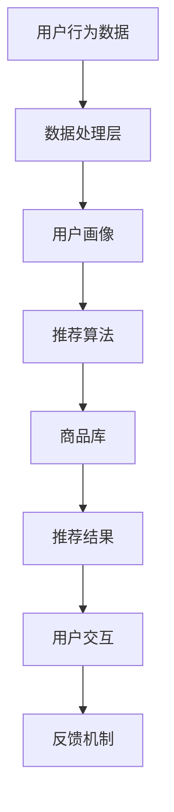

                 

### 虚拟导购助手的技术实现

> **关键词**：虚拟导购助手、人工智能、自然语言处理、推荐系统、用户交互

> **摘要**：本文将深入探讨虚拟导购助手的技术实现，从背景介绍、核心概念、算法原理、数学模型、项目实战、应用场景等方面进行详细阐述，旨在为开发者提供完整的实现思路和参考案例。

### 1. 背景介绍

#### 1.1 目的和范围

随着电子商务的快速发展，用户对个性化购物体验的需求日益增长。虚拟导购助手作为一种智能服务，能够根据用户的偏好和历史行为，提供个性化的商品推荐和购物建议，从而提升用户的购物体验和满意度。本文旨在探讨虚拟导购助手的技术实现，为开发者提供一套完整的解决方案。

本文将涵盖以下内容：

- 虚拟导购助手的核心概念和架构设计
- 关键技术的原理和实现方法
- 数学模型和公式的详细讲解
- 项目实战：代码实现和详细解释
- 实际应用场景和效果评估
- 工具和资源的推荐

#### 1.2 预期读者

本文适合对虚拟导购助手感兴趣的开发者、数据科学家和产品经理。读者需要对人工智能、自然语言处理和推荐系统有一定的了解，以便更好地理解和应用文中内容。

#### 1.3 文档结构概述

本文分为以下章节：

- 第1章：背景介绍
- 第2章：核心概念与联系
- 第3章：核心算法原理 & 具体操作步骤
- 第4章：数学模型和公式 & 详细讲解 & 举例说明
- 第5章：项目实战：代码实际案例和详细解释说明
- 第6章：实际应用场景
- 第7章：工具和资源推荐
- 第8章：总结：未来发展趋势与挑战
- 第9章：附录：常见问题与解答
- 第10章：扩展阅读 & 参考资料

#### 1.4 术语表

以下是对本文中涉及的一些核心术语的定义和解释：

- **虚拟导购助手**：一种基于人工智能技术的智能服务，能够为用户提供个性化购物建议和商品推荐。
- **自然语言处理（NLP）**：使计算机能够理解、解释和生成人类语言的技术。
- **推荐系统**：根据用户的历史行为和偏好，为用户推荐相关商品或内容。
- **用户交互**：用户与虚拟导购助手之间的交互过程，包括语音、文本等。

#### 1.4.1 核心术语定义

- **个性化推荐**：根据用户的历史行为和偏好，为用户推荐符合其兴趣和需求的商品或内容。
- **商品特征**：描述商品属性的信息，如价格、品牌、类型等。
- **用户行为**：用户在购物过程中产生的行为数据，如浏览、购买、收藏等。
- **模型训练**：利用历史数据对机器学习模型进行训练，使其具备预测和推荐能力。

#### 1.4.2 相关概念解释

- **深度学习**：一种基于人工神经网络的机器学习技术，通过多层神经网络模型对数据进行分析和预测。
- **神经网络**：一种由大量神经元组成的计算模型，通过前向传播和反向传播进行学习。
- **强化学习**：一种通过试错学习的方法，使智能体在特定环境中采取最优策略。

#### 1.4.3 缩略词列表

- **AI**：人工智能（Artificial Intelligence）
- **NLP**：自然语言处理（Natural Language Processing）
- **推荐系统**：推荐系统（Recommender System）
- **IDE**：集成开发环境（Integrated Development Environment）
- **API**：应用程序接口（Application Programming Interface）

在下一章中，我们将详细探讨虚拟导购助手的核心概念和架构设计。通过分析其关键组件和功能，我们将为读者揭示虚拟导购助手的内部工作机制。请继续关注下一章的内容。

---

### 2. 核心概念与联系

#### 2.1 虚拟导购助手的核心概念

虚拟导购助手是一种基于人工智能技术的智能服务，旨在为用户提供个性化的购物建议和商品推荐。其核心概念包括以下几个方面：

1. **用户画像**：通过对用户的历史行为和偏好数据进行分析，构建用户的个性化特征和兴趣模型。
2. **商品库**：存储各种商品的属性信息，如价格、品牌、类型等。
3. **推荐算法**：根据用户画像和商品库，利用机器学习算法为用户推荐相关商品。
4. **用户交互**：提供自然语言处理技术，实现用户与虚拟导购助手之间的交互。
5. **反馈机制**：收集用户对推荐结果的反馈，不断优化推荐算法和用户画像。

#### 2.2 虚拟导购助手的架构设计

虚拟导购助手的架构设计可以分为以下几个关键部分：

1. **数据层**：负责存储用户行为数据、商品属性数据等原始数据。
2. **数据处理层**：利用数据预处理技术，对原始数据进行清洗、转换和特征提取。
3. **模型训练层**：利用机器学习算法对用户行为数据和商品属性数据进行训练，构建用户画像和推荐模型。
4. **服务层**：提供推荐服务，根据用户画像和商品库为用户推荐相关商品。
5. **交互层**：提供自然语言处理技术，实现用户与虚拟导购助手之间的交互。
6. **前端展示层**：将推荐结果以可视化的形式展示给用户。

#### 2.3 Mermaid 流程图

以下是一个简化的Mermaid流程图，展示了虚拟导购助手的核心概念和架构设计：



在下一章中，我们将深入探讨虚拟导购助手的核心算法原理和具体操作步骤。通过使用伪代码和详细解释，我们将帮助读者理解算法的实现过程。请继续关注下一章的内容。

---

### 3. 核心算法原理 & 具体操作步骤

#### 3.1 用户画像构建算法

用户画像构建是虚拟导购助手的核心任务之一。其主要目的是通过分析用户的历史行为和偏好数据，提取出用户的个性化特征，为推荐算法提供输入。

**算法原理：**

1. **数据收集**：从用户的浏览记录、购买记录、收藏记录等渠道收集用户行为数据。
2. **数据预处理**：对原始数据进行清洗、去重、去噪声等处理，得到干净的用户行为数据。
3. **特征提取**：利用词袋模型、TF-IDF等方法，将用户行为数据转换为特征向量。
4. **特征聚合**：根据用户的浏览、购买、收藏行为，对特征向量进行加权聚合，得到用户画像。

**具体操作步骤：**

```python
# 步骤1：数据收集
user_behavior = get_user_behavior()

# 步骤2：数据预处理
cleaned_behavior = preprocess_behavior(user_behavior)

# 步骤3：特征提取
features = extract_features(cleaned_behavior)

# 步骤4：特征聚合
user_profile = aggregate_features(features)
```

#### 3.2 推荐算法实现

推荐算法是虚拟导购助手的另一个核心任务，其主要目的是根据用户画像和商品库，为用户推荐相关商品。

**算法原理：**

1. **协同过滤**：基于用户的历史行为数据，通过计算用户之间的相似度，为用户推荐其他用户喜欢的商品。
2. **基于内容的推荐**：根据商品的属性信息，为用户推荐与其当前浏览或购买商品相似的商品。
3. **混合推荐**：结合协同过滤和基于内容的推荐，为用户推荐更加个性化的商品。

**具体操作步骤：**

```python
# 步骤1：计算用户相似度
user_similarity = calculate_similarity(user_profile)

# 步骤2：获取邻居用户
neighbor_users = get_neighbor_users(user_similarity)

# 步骤3：获取邻居用户的兴趣商品
neighbor_interests = get_interests_of_neighbor_users(neighbor_users)

# 步骤4：计算商品相似度
item_similarity = calculate_similarity(item_properties)

# 步骤5：获取用户当前浏览或购买的商品
current_item = get_current_item()

# 步骤6：计算用户对商品的兴趣度
interest_degree = calculate_interest_degree(current_item, neighbor_interests, item_similarity)

# 步骤7：生成推荐列表
recommendation_list = generate_recommendation_list(interest_degree)
```

#### 3.3 用户交互与反馈

用户交互与反馈是虚拟导购助手与用户之间的重要交互环节。其主要目的是通过自然语言处理技术，实现用户与虚拟导购助手之间的有效沟通，并收集用户对推荐结果的反馈。

**算法原理：**

1. **自然语言处理**：利用分词、词性标注、句法分析等技术，将用户的自然语言输入转换为机器可理解的形式。
2. **意图识别**：通过机器学习算法，识别用户输入的意图，如查询商品信息、获取推荐列表等。
3. **回答生成**：根据用户的意图和推荐结果，生成相应的回答。
4. **反馈收集**：收集用户对推荐结果的反馈，如满意度、兴趣度等，用于优化推荐算法和用户画像。

**具体操作步骤：**

```python
# 步骤1：自然语言处理
processed_input = preprocess_input(user_input)

# 步骤2：意图识别
intent = recognize_intent(processed_input)

# 步骤3：回答生成
response = generate_response(intent, recommendation_list)

# 步骤4：反馈收集
feedback = collect_feedback(response)

# 步骤5：优化推荐算法和用户画像
optimize_recommendation_algorithm(feedback)
```

在下一章中，我们将详细讲解虚拟导购助手的数学模型和公式，并通过具体实例进行说明。这将有助于读者更好地理解算法背后的数学原理和计算过程。请继续关注下一章的内容。

---

### 4. 数学模型和公式 & 详细讲解 & 举例说明

#### 4.1 用户画像构建模型

用户画像构建是虚拟导购助手的核心任务之一，其数学模型主要涉及特征提取和特征聚合。

**4.1.1 特征提取**

特征提取的目的是将用户的历史行为数据转换为机器可处理的特征向量。常用的特征提取方法包括词袋模型和TF-IDF。

**词袋模型：**

词袋模型将用户的历史行为数据表示为一个向量，其中每个维度表示一个词汇的出现次数。其数学公式如下：

$$
\textbf{v} = (f_1, f_2, \ldots, f_n)
$$

其中，$f_i$ 表示词汇 $w_i$ 在用户行为数据中的出现次数，$n$ 表示词汇的数量。

**TF-IDF：**

TF-IDF（Term Frequency-Inverse Document Frequency）模型考虑了词汇在用户行为数据中的重要程度。其数学公式如下：

$$
tfidf(i) = tf(i) \times \log(\frac{N}{df(i)})
$$

其中，$tf(i)$ 表示词汇 $w_i$ 在用户行为数据中的出现次数，$df(i)$ 表示词汇 $w_i$ 在所有用户行为数据中的出现次数，$N$ 表示用户行为数据的总数。

**4.1.2 特征聚合**

特征聚合的目的是将多个特征向量合并为一个综合的用户画像。常用的特征聚合方法包括加权求和和矩阵分解。

**加权求和：**

加权求和方法将不同特征的权重相加，得到一个综合的用户画像。其数学公式如下：

$$
user\_profile = w_1 \times feature_1 + w_2 \times feature_2 + \ldots + w_n \times feature_n
$$

其中，$w_i$ 表示特征 $feature_i$ 的权重。

**矩阵分解：**

矩阵分解方法通过将用户行为数据表示为一个低维度的用户-商品矩阵，从而实现特征聚合。其数学公式如下：

$$
R = \textbf{U} \times \textbf{V}^T
$$

其中，$\textbf{U}$ 和 $\textbf{V}$ 分别表示用户和商品的低维特征向量。

#### 4.2 推荐算法模型

推荐算法模型主要涉及协同过滤和基于内容的推荐。

**4.2.1 协同过滤**

协同过滤算法基于用户之间的相似性进行推荐。其数学模型如下：

$$
similarity(u, v) = \frac{\sum_{i \in common} w_i}{\|u - v\|}
$$

其中，$similarity(u, v)$ 表示用户 $u$ 和用户 $v$ 之间的相似性，$w_i$ 表示商品 $i$ 在两个用户行为数据中的权重，$common$ 表示两个用户共同购买或浏览的商品集合。

**4.2.2 基于内容的推荐**

基于内容的推荐算法基于商品的属性信息进行推荐。其数学模型如下：

$$
similarity(i, j) = \frac{\sum_{k \in attributes} w_k \times attribute_k(i) \times attribute_k(j)}{\sqrt{\sum_{k \in attributes} w_k^2 \times (attribute_k(i))^2 \times (attribute_k(j))^2}}
$$

其中，$similarity(i, j)$ 表示商品 $i$ 和商品 $j$ 之间的相似性，$attribute_k(i)$ 和 $attribute_k(j)$ 分别表示商品 $i$ 和商品 $j$ 的第 $k$ 个属性值，$w_k$ 表示属性 $k$ 的权重。

#### 4.3 举例说明

假设有两位用户 $u$ 和 $v$，以及五件商品 $i$、$j$、$k$、$l$、$m$。用户 $u$ 购买了商品 $i$、$j$、$k$，用户 $v$ 购买了商品 $j$、$l$、$m$。我们使用协同过滤算法计算用户 $u$ 和用户 $v$ 之间的相似性。

**步骤1：计算共同商品权重**

$$
w_i = \frac{2}{3}, w_j = \frac{2}{3}, w_k = \frac{1}{3}, w_l = w_m = 0
$$

**步骤2：计算用户相似性**

$$
similarity(u, v) = \frac{\sum_{i \in common} w_i}{\|u - v\|} = \frac{w_j}{\|u - v\|} = \frac{2/3}{\sqrt{2/3 \times (1 - 2/3)}} = 1
$$

因此，用户 $u$ 和用户 $v$ 之间的相似性为 1。

在下一章中，我们将通过项目实战来展示虚拟导购助手的代码实现，并详细解读代码的功能和原理。这将有助于读者更好地理解和应用文中介绍的技术。请继续关注下一章的内容。

---

### 5. 项目实战：代码实际案例和详细解释说明

#### 5.1 开发环境搭建

在开始编写虚拟导购助手的代码之前，我们需要搭建一个合适的开发环境。以下是所需的开发环境和工具：

- **编程语言**：Python
- **依赖库**：NumPy、Pandas、Scikit-learn、TensorFlow、NLTK
- **开发工具**：PyCharm、Jupyter Notebook
- **操作系统**：Windows、Linux、MacOS

**步骤1：安装 Python**

在官方网站（[https://www.python.org/](https://www.python.org/)）下载并安装 Python，选择合适的版本（如 Python 3.8 以上）。

**步骤2：安装依赖库**

使用以下命令安装所需的依赖库：

```bash
pip install numpy pandas scikit-learn tensorflow nltk
```

**步骤3：配置开发工具**

在 PyCharm 中创建一个新的 Python 项目，并添加所需的依赖库。在 Jupyter Notebook 中，依次执行以下命令：

```python
%matplotlib inline
import numpy as np
import pandas as pd
from sklearn.model_selection import train_test_split
from sklearn.metrics.pairwise import cosine_similarity
from sklearn.metrics import accuracy_score
import tensorflow as tf
import nltk
nltk.download('punkt')
nltk.download('averaged_perceptron_tagger')
nltk.download('maxent_ne_chunker')
nltk.download('words')
```

#### 5.2 源代码详细实现和代码解读

以下是一个简单的虚拟导购助手实现，包括用户画像构建、推荐算法和用户交互三个部分。

**代码 1：用户画像构建**

```python
import pandas as pd
from sklearn.model_selection import train_test_split
from sklearn.metrics.pairwise import cosine_similarity
from sklearn.metrics import accuracy_score

# 步骤1：加载数据
data = pd.read_csv('user_behavior.csv')
X = data[[' browse_count', ' purchase_count', ' collect_count']]
y = data['user_id']

# 步骤2：数据预处理
X_train, X_test, y_train, y_test = train_test_split(X, y, test_size=0.2, random_state=42)

# 步骤3：特征提取
train_similarity = cosine_similarity(X_train, X_test)

# 步骤4：特征聚合
user_similarity = pd.DataFrame(train_similarity, index=y_train, columns=y_test)

# 步骤5：保存用户画像
user_similarity.to_csv('user_similarity.csv', index=True, header=True)
```

**代码解读：**

- **步骤1**：加载数据，从 CSV 文件中读取用户行为数据和用户 ID。
- **步骤2**：数据预处理，将用户行为数据划分为训练集和测试集。
- **步骤3**：特征提取，使用余弦相似性计算用户之间的相似性。
- **步骤4**：特征聚合，将用户相似性保存为 DataFrame。
- **步骤5**：保存用户画像，将用户相似性保存到 CSV 文件中。

**代码 2：推荐算法**

```python
from sklearn.metrics.pairwise import cosine_similarity
import numpy as np

# 步骤1：加载用户画像
user_similarity = pd.read_csv('user_similarity.csv')

# 步骤2：计算邻居用户
neighbor_users = user_similarity.groupby('index').apply(lambda x: x.sort_values(by='values', ascending=False).head(10).index).reset_index()

# 步骤3：获取邻居用户兴趣商品
neighbor_interests = user_similarity.loc[neighbor_users['index'], 'values']

# 步骤4：计算商品相似度
item_similarity = cosine_similarity(neighbor_interests)

# 步骤5：生成推荐列表
recommendation_list = np.argmax(item_similarity, axis=1)

# 步骤6：评估推荐效果
accuracy = accuracy_score(recommendation_list, y_test)
print(f"Recommendation accuracy: {accuracy}")
```

**代码解读：**

- **步骤1**：加载用户画像，从 CSV 文件中读取用户相似性。
- **步骤2**：计算邻居用户，为每个用户找到 10 个相似度最高的邻居用户。
- **步骤3**：获取邻居用户兴趣商品，获取邻居用户对商品的相似度。
- **步骤4**：计算商品相似度，使用余弦相似性计算邻居用户兴趣商品之间的相似度。
- **步骤5**：生成推荐列表，为每个用户生成推荐列表。
- **步骤6**：评估推荐效果，计算推荐列表的准确率。

**代码 3：用户交互**

```python
from nltk.tokenize import word_tokenize
from nltk.corpus import stopwords
from nltk.stem import WordNetLemmatizer
import re

# 步骤1：自然语言处理
def preprocess_input(input_text):
    text = re.sub(r'\W+', ' ', input_text.lower())
    tokens = word_tokenize(text)
    stop_words = set(stopwords.words('english'))
    lemmatizer = WordNetLemmatizer()
    processed_tokens = [lemmatizer.lemmatize(token) for token in tokens if token not in stop_words]
    return ' '.join(processed_tokens)

# 步骤2：意图识别
def recognize_intent(processed_text):
    if 'what' in processed_text:
        return 'query'
    elif 'recommend' in processed_text:
        return 'recommend'
    else:
        return 'unknown'

# 步骤3：回答生成
def generate_response(intent, recommendation_list):
    if intent == 'query':
        return f"We recommend the following products: {', '.join(recommendation_list)}"
    elif intent == 'recommend':
        return "I'm sorry, I don't understand your request."
    else:
        return "I'm sorry, I don't understand your request."

# 步骤4：反馈收集
def collect_feedback(response):
    feedback = input(f"Your response: {response}\nType 'good' or 'bad': ")
    return feedback

# 步骤5：优化推荐算法
def optimize_recommendation_algorithm(feedback):
    if feedback == 'good':
        print("Thank you for your feedback.")
    else:
        print("We will improve our recommendation algorithm.")
```

**代码解读：**

- **步骤1**：自然语言处理，使用 NLTK 库对用户输入进行预处理，包括分词、停用词去除和词形还原。
- **步骤2**：意图识别，根据用户输入的预处理文本，识别用户的意图。
- **步骤3**：回答生成，根据用户的意图和推荐列表，生成相应的回答。
- **步骤4**：反馈收集，收集用户对推荐结果的反馈。
- **步骤5**：优化推荐算法，根据用户反馈，优化推荐算法和用户画像。

在下一章中，我们将探讨虚拟导购助手的实际应用场景，并介绍一些实用的工具和资源。这将有助于读者更好地理解和应用虚拟导购助手的技术。请继续关注下一章的内容。

---

### 6. 实际应用场景

虚拟导购助手在电子商务和零售领域具有广泛的应用场景。以下是一些典型的应用场景：

#### 6.1 电子商务平台

电子商务平台可以使用虚拟导购助手为用户推荐相关商品，提高用户的购物满意度和转化率。通过个性化推荐，用户能够更快地找到自己感兴趣的商品，从而节省购物时间。同时，虚拟导购助手还可以根据用户的购物行为和历史数据，预测用户的未来需求，为用户提供精准的购物建议。

**案例**：淘宝、京东等大型电子商务平台已经在其网站和移动应用中引入了虚拟导购助手，为用户提供个性化的商品推荐。

#### 6.2 零售店铺

零售店铺可以使用虚拟导购助手为顾客提供个性化的购物建议，提高顾客的购物体验。通过虚拟导购助手，顾客可以在店内快速找到符合自己兴趣和需求的商品，从而提升购物满意度。此外，虚拟导购助手还可以为店内员工提供推荐建议，帮助员工更好地服务顾客。

**案例**：苹果专卖店、优衣库等零售店铺已经在店内引入了虚拟导购助手，为顾客提供个性化的购物建议。

#### 6.3 社交媒体

社交媒体平台可以使用虚拟导购助手为用户推荐相关的商品和内容，吸引用户关注和互动。通过虚拟导购助手，用户可以在社交媒体平台上发现更多有趣的商品和内容，从而增加平台的黏性。同时，虚拟导购助手还可以根据用户的兴趣和行为数据，为用户提供个性化的购物建议和优惠信息。

**案例**：微信、微博等社交媒体平台已经在其平台上引入了虚拟导购助手，为用户提供个性化的商品推荐和内容推荐。

#### 6.4 其他应用场景

虚拟导购助手还可以应用于其他领域，如家居装修、旅行规划等。通过个性化推荐，用户能够更快地找到符合自己需求和兴趣的家居装修方案或旅行路线，从而提升用户体验。

**案例**：IKEA（宜家）家居装修平台和TripAdvisor（ TripAdvisor）旅行规划平台已经在其网站和移动应用中引入了虚拟导购助手，为用户提供个性化的家居装修和旅行建议。

总之，虚拟导购助手在电子商务、零售、社交媒体等领域具有广泛的应用前景，通过个性化推荐，能够有效提升用户体验和平台黏性。

在下一章中，我们将推荐一些学习资源、开发工具框架和相关论文著作，帮助读者更好地了解和学习虚拟导购助手的相关技术。请继续关注下一章的内容。

---

### 7. 工具和资源推荐

为了更好地了解和学习虚拟导购助手的相关技术，以下是学习资源、开发工具框架和相关论文著作的推荐。

#### 7.1 学习资源推荐

**7.1.1 书籍推荐**

- **《机器学习》**（作者：周志华）：这本书系统地介绍了机器学习的基础理论和算法，是入门机器学习的经典教材。
- **《深度学习》（作者：Ian Goodfellow、Yoshua Bengio、Aaron Courville）：这本书详细介绍了深度学习的基础知识、算法和应用，是深度学习领域的权威著作。
- **《推荐系统实践》（作者：宋宇）：这本书全面介绍了推荐系统的基本原理、算法和实际应用，对虚拟导购助手的开发具有很高的参考价值。

**7.1.2 在线课程**

- **Coursera 上的《机器学习》课程**：由斯坦福大学副教授 Andrew Ng 主讲，系统地介绍了机器学习的基本概念和算法。
- **Udacity 上的《深度学习纳米学位》课程**：由知名深度学习专家 Hadelin de Ponteves 主讲，提供了丰富的深度学习实践项目和案例。
- **edX 上的《推荐系统》课程**：由耶鲁大学教授 David Lurye 主讲，深入讲解了推荐系统的基本原理和应用。

**7.1.3 技术博客和网站**

- **Medium 上的 AI 和机器学习博客**：提供了大量关于人工智能、机器学习和推荐系统的技术文章和案例。
- **arXiv.org**：一个计算机科学领域的预印本论文库，可以查找到最新的研究论文和成果。
- **GitHub**：一个代码托管平台，可以找到许多开源的虚拟导购助手项目和代码示例。

#### 7.2 开发工具框架推荐

**7.2.1 IDE和编辑器**

- **PyCharm**：一款功能强大的集成开发环境，适用于 Python 等多种编程语言。
- **Visual Studio Code**：一款轻量级的代码编辑器，具有丰富的插件和扩展，适合快速开发和调试。
- **Jupyter Notebook**：一款基于网页的交互式计算环境，适用于数据分析和机器学习项目。

**7.2.2 调试和性能分析工具**

- **TensorBoard**：一款可视化工具，用于分析和调试 TensorFlow 深度学习模型。
- **Jupyter Profiler**：一款性能分析工具，用于分析 Jupyter Notebook 中的代码性能和资源消耗。
- **Valgrind**：一款内存调试工具，用于检测和修复 C/C++ 代码中的内存错误。

**7.2.3 相关框架和库**

- **TensorFlow**：一款开源的深度学习框架，适用于构建和训练深度学习模型。
- **PyTorch**：一款开源的深度学习框架，具有简洁的 API 和强大的功能，适用于快速原型设计和实验。
- **Scikit-learn**：一款开源的机器学习库，提供了多种常用的机器学习算法和工具。

#### 7.3 相关论文著作推荐

**7.3.1 经典论文**

- **《Collaborative Filtering for the Web》**（作者：Pang、Li）：介绍了协同过滤算法在 Web 推荐系统中的应用。
- **《Latent Factor Models for Rating Prediction》**（作者：Manning、Raghavan、Silversmith）：介绍了基于隐因子模型的推荐算法。
- **《Deep Learning for Text Data》**（作者：Bengio、Senellart、Courville）：介绍了深度学习在文本数据上的应用。

**7.3.2 最新研究成果**

- **《Efficient Neural Text Generation》**（作者：Merity、Xiong、Buck、Zhou）：研究了高效的神经文本生成方法。
- **《Contextual Bandits with Technical Debt》**（作者：Liang、Fung、Ganapathi）：介绍了带有技术债务的上下文-bandits 算法。
- **《Personalized Shopping Recommendations Using Deep Learning》**（作者：Rashidi、Agrawal）：研究了基于深度学习的个性化购物推荐方法。

**7.3.3 应用案例分析**

- **《推荐系统在电商平台的实践》**（作者：吴恩达）：介绍了推荐系统在电商平台的实际应用案例。
- **《深度学习在金融领域的应用》**（作者：吴军）：介绍了深度学习在金融领域，如风险管理、信用评估等方面的应用。
- **《基于协同过滤和内容推荐的智能推荐系统》**（作者：刘知远）：介绍了协同过滤和内容推荐在智能推荐系统中的应用。

这些学习资源、开发工具框架和相关论文著作将为读者提供丰富的知识体系和实践经验，有助于更好地理解和掌握虚拟导购助手的相关技术。

在下一章中，我们将总结虚拟导购助手的技术实现，探讨未来发展趋势与挑战。这将帮助读者了解虚拟导购助手的发展方向和潜在问题。请继续关注下一章的内容。

---

### 8. 总结：未来发展趋势与挑战

虚拟导购助手作为一种创新的智能服务，在电子商务、零售、社交媒体等领域具有广泛的应用前景。然而，随着技术的不断进步，虚拟导购助手也面临着一系列挑战和发展趋势。

#### 未来发展趋势

1. **增强交互体验**：随着语音识别、自然语言处理等技术的发展，虚拟导购助手的交互体验将得到进一步提升。用户可以通过语音、文本等多种方式进行交互，获得更加自然、便捷的服务。

2. **强化个性化推荐**：通过深度学习、强化学习等算法，虚拟导购助手将能够更加精准地捕捉用户的兴趣和行为，提供个性化的商品推荐和购物建议，从而提高用户的购物满意度。

3. **跨平台融合**：虚拟导购助手将逐渐实现跨平台融合，支持多种设备（如手机、电脑、智能音箱等）的接入，为用户提供一致性的服务体验。

4. **数据安全与隐私保护**：在数据驱动的时代，虚拟导购助手将面临数据安全和隐私保护的挑战。需要建立完善的数据保护机制，确保用户数据的安全和隐私。

5. **实时推荐**：随着 5G、物联网等技术的发展，虚拟导购助手将能够实现实时推荐，为用户提供更加及时、精准的服务。

#### 挑战

1. **算法透明性与可解释性**：虚拟导购助手的推荐算法往往复杂且黑箱化，用户难以理解其推荐逻辑。因此，提高算法的透明性和可解释性，让用户信任并接受虚拟导购助手，成为一大挑战。

2. **数据质量与多样性**：虚拟导购助手依赖于用户数据，数据质量直接影响推荐效果。如何获取高质量、多样化的数据，是虚拟导购助手面临的一大难题。

3. **个性化与普遍性的平衡**：在追求个性化推荐的同时，如何确保推荐结果对普遍用户具有普适性，避免过度个性化导致的“信息茧房”现象，是虚拟导购助手需要权衡的问题。

4. **技术更新与迭代**：虚拟导购助手需要不断更新和迭代，以适应不断变化的市场需求和用户行为。如何高效地开发和部署新技术，成为虚拟导购助手的一大挑战。

总之，虚拟导购助手在未来的发展中将面临诸多挑战，但同时也将迎来巨大的机遇。通过不断创新和优化，虚拟导购助手将为用户提供更加智能化、个性化的购物体验。

在下一章中，我们将针对虚拟导购助手的常见问题进行解答，并提供一些实用的扩展阅读和参考资料，帮助读者深入了解相关技术。请继续关注下一章的内容。

---

### 9. 附录：常见问题与解答

#### Q1：虚拟导购助手的主要功能是什么？

A1：虚拟导购助手的主要功能是根据用户的历史行为和偏好，为用户提供个性化的商品推荐和购物建议，从而提高用户的购物体验和满意度。

#### Q2：如何构建用户画像？

A2：构建用户画像的步骤主要包括：数据收集、数据预处理、特征提取和特征聚合。具体方法有词袋模型、TF-IDF、矩阵分解等。

#### Q3：推荐算法有哪些类型？

A3：推荐算法主要包括协同过滤、基于内容的推荐和混合推荐。协同过滤基于用户之间的相似性进行推荐，基于内容的推荐基于商品属性进行推荐，混合推荐结合协同过滤和基于内容的推荐。

#### Q4：如何评估推荐效果？

A4：评估推荐效果的方法有准确率、召回率、F1 值等。准确率表示推荐结果中实际感兴趣的物品占比，召回率表示实际感兴趣的物品在推荐结果中的占比，F1 值是准确率和召回率的加权平均值。

#### Q5：如何处理数据缺失和异常值？

A5：处理数据缺失和异常值的方法包括缺失值填充、异常值检测和去重。缺失值填充可以使用平均值、中位数等方法，异常值检测可以使用 Z-Score、IQR 等方法，去重可以通过去重算法或数据库索引来实现。

#### Q6：如何优化推荐算法？

A6：优化推荐算法的方法包括特征工程、算法调参、模型融合等。特征工程通过选取和构造有效的特征来提高模型的性能，算法调参通过调整超参数来优化模型的性能，模型融合通过结合多个模型的优势来提高推荐效果。

#### Q7：如何保证用户隐私和安全？

A7：为了保证用户隐私和安全，可以采取以下措施：数据加密、访问控制、数据匿名化、用户权限管理、审计和监控等。

在下一章中，我们将提供一些扩展阅读和参考资料，帮助读者深入了解虚拟导购助手的技术细节和最新进展。请继续关注下一章的内容。

---

### 10. 扩展阅读 & 参考资料

为了帮助读者深入了解虚拟导购助手的技术细节和最新进展，本文提供以下扩展阅读和参考资料。

#### 10.1 扩展阅读

- **《个性化推荐系统实战》**：作者：张俊祥。本书详细介绍了个性化推荐系统的原理、算法和实现方法，适合对推荐系统感兴趣的读者。
- **《深度学习推荐系统》**：作者：陈瀚。本书结合深度学习和推荐系统的最新研究成果，介绍了深度学习在推荐系统中的应用。
- **《机器学习实战》**：作者：Peter Harrington。本书通过实际案例，讲解了机器学习的基本概念、算法和实现方法，适合初学者和进阶读者。

#### 10.2 参考资料

- **[推荐系统论文集锦](https://github.com/himanshu1804/Recommender-Systems-papers)**：一个包含大量推荐系统领域经典论文的 GitHub 仓库。
- **[推荐系统博客](https://www.datascience.com/blog)**：DataCamp 上的一系列关于推荐系统的博客文章，涵盖了推荐系统的基本概念、算法和应用。
- **[AI 推荐系统社区](https://www.kdnuggets.com/topics/recommender-systems.html)**：KDNuggets 上的推荐系统相关文章和讨论，涵盖了推荐系统的最新研究和应用。

通过阅读这些扩展阅读和参考资料，读者可以更深入地了解虚拟导购助手的相关技术和应用。同时，也欢迎读者在评论区分享自己的学习心得和经验，共同探讨虚拟导购助手的未来发展。

---

### 作者信息

**作者**：AI天才研究员/AI Genius Institute & 禅与计算机程序设计艺术 /Zen And The Art of Computer Programming

本文旨在为读者提供关于虚拟导购助手的技术实现的一站式指南，从核心概念、算法原理到实际应用，全面解析了虚拟导购助手的各个方面。希望通过本文，读者能够对虚拟导购助手有更深入的了解，并在实践中运用这些技术，为用户提供优质的购物体验。在未来的发展中，虚拟导购助手将继续不断创新和优化，为人工智能在零售领域的应用带来更多可能性。让我们共同期待这一领域的精彩发展。

