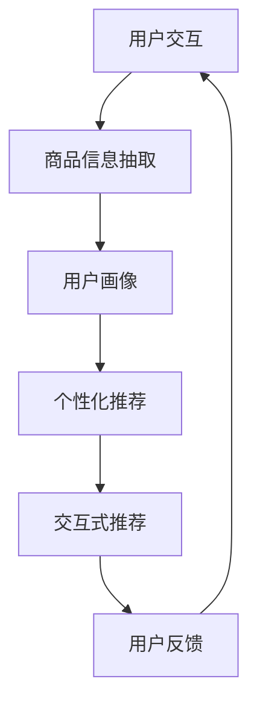

                 

# 虚拟导购助手：AI如何改变购物体验

## 关键词
- 虚拟导购助手
- AI购物体验
- 自然语言处理
- 个性化推荐
- 数据挖掘

## 摘要
本文将探讨人工智能（AI）在购物体验中的应用，重点介绍虚拟导购助手如何通过自然语言处理、个性化推荐和数据挖掘等技术，为消费者提供更加便捷、高效和个性化的购物体验。文章将从核心概念、算法原理、数学模型、实际案例、应用场景、工具推荐以及未来发展趋势等多个角度，全面剖析AI虚拟导购助手的工作原理、技术实现及实际价值。

## 1. 背景介绍

### 1.1 目的和范围
本文旨在探讨人工智能在购物体验中的应用，通过介绍虚拟导购助手的工作原理和技术实现，分析其如何改变传统的购物方式，提高消费者满意度。文章将涵盖以下内容：

1. 虚拟导购助手的核心概念及其与购物体验的联系。
2. 虚拟导购助手的关键技术，包括自然语言处理、个性化推荐和数据挖掘等。
3. 虚拟导购助手的数学模型和算法原理。
4. 虚拟导购助手的实际应用案例和代码实现。
5. 虚拟导购助手的未来发展趋势与挑战。

### 1.2 预期读者
本文适合以下读者群体：

1. 对人工智能和购物体验感兴趣的科技爱好者。
2. 从事人工智能和电子商务行业的从业者。
3. 对计算机科学和软件工程感兴趣的学者和学生。
4. 希望提升购物体验的消费者。

### 1.3 文档结构概述
本文分为十个部分，具体如下：

1. 引言：介绍虚拟导购助手的概念和核心关键词。
2. 背景介绍：阐述本文的目的、预期读者和文档结构。
3. 核心概念与联系：介绍虚拟导购助手的核心概念及其架构。
4. 核心算法原理 & 具体操作步骤：详细讲解虚拟导购助手的算法原理和操作步骤。
5. 数学模型和公式 & 详细讲解 & 举例说明：介绍虚拟导购助手的数学模型和公式，并通过例子进行说明。
6. 项目实战：代码实际案例和详细解释说明。
7. 实际应用场景：分析虚拟导购助手的实际应用场景。
8. 工具和资源推荐：推荐相关学习资源和开发工具。
9. 总结：未来发展趋势与挑战。
10. 附录：常见问题与解答。
11. 扩展阅读 & 参考资料：提供进一步阅读的资料。

### 1.4 术语表
#### 1.4.1 核心术语定义
- 虚拟导购助手：一种基于人工智能技术的虚拟购物助手，能够为用户提供个性化推荐、商品查询、购物建议等服务。
- 自然语言处理（NLP）：一种人工智能技术，用于理解和生成自然语言，使计算机能够与人类进行有效沟通。
- 个性化推荐：根据用户的历史行为、兴趣和偏好，为用户推荐符合其需求的产品和服务。
- 数据挖掘：从大量数据中提取有价值的信息和知识的过程。

#### 1.4.2 相关概念解释
- 商品信息抽取：从网页、文本等数据源中提取商品名称、价格、规格等信息。
- 用户画像：基于用户的历史行为、兴趣和偏好，构建用户的基本特征模型。
- 交互式推荐：根据用户的反馈和交互行为，动态调整推荐结果，提高用户满意度。

#### 1.4.3 缩略词列表
- AI：人工智能
- NLP：自然语言处理
- ML：机器学习
- DL：深度学习
- CTR：点击率
- CV：转换率

## 2. 核心概念与联系

虚拟导购助手是人工智能技术在购物体验中的应用，其核心概念包括：

1. **用户交互**：用户通过输入文本或语音与虚拟导购助手进行交互，提出购物需求。
2. **商品信息抽取**：虚拟导购助手从网页、文本等数据源中提取商品名称、价格、规格等信息。
3. **用户画像**：基于用户的历史行为、兴趣和偏好，构建用户的基本特征模型。
4. **个性化推荐**：根据用户画像和商品信息，为用户推荐符合其需求的产品和服务。
5. **交互式推荐**：根据用户的反馈和交互行为，动态调整推荐结果，提高用户满意度。

### 2.1 虚拟导购助手架构图

以下是一个简单的虚拟导购助手架构图，用Mermaid流程图表示：



在这个架构图中，用户交互是整个流程的起点和终点，用户通过输入文本或语音与虚拟导购助手进行交互，提出购物需求。商品信息抽取从网页、文本等数据源中提取商品信息，为后续的用户画像和个性化推荐提供数据支持。用户画像基于用户的历史行为、兴趣和偏好构建，用于指导个性化推荐。个性化推荐根据用户画像和商品信息为用户推荐符合需求的产品和服务。交互式推荐根据用户的反馈和交互行为，动态调整推荐结果，提高用户满意度。

## 3. 核心算法原理 & 具体操作步骤

虚拟导购助手的核心算法主要包括自然语言处理（NLP）、个性化推荐和数据挖掘等。下面将分别介绍这些算法的原理和具体操作步骤。

### 3.1 自然语言处理（NLP）

自然语言处理（NLP）是人工智能（AI）的一个重要分支，旨在使计算机能够理解和生成自然语言。在虚拟导购助手中，NLP主要应用于用户交互和商品信息抽取。

#### 3.1.1 词向量表示

词向量表示是NLP中的一种常用技术，通过将文本转化为向量，以便进行计算和处理。一个常见的词向量表示模型是Word2Vec，其核心思想是通过对上下文信息进行建模，将词映射为密集的向量表示。

```python
import gensim

# 加载预训练的Word2Vec模型
model = gensim.models.Word2Vec.load("word2vec.model")

# 将文本转化为词向量表示
text = "购买手机"
word_vectors = [model[word] for word in text.split()]
```

#### 3.1.2 文本分类与情感分析

文本分类与情感分析是NLP中的两个重要任务。文本分类旨在将文本分类到预定义的类别中，例如商品类别、情感极性等。情感分析则旨在判断文本的情感倾向，如正面、负面或中性。

```python
from sklearn.feature_extraction.text import TfidfVectorizer
from sklearn.naive_bayes import MultinomialNB

# 准备数据集
texts = ["这是一部好手机", "手机质量很差"]
labels = ["正面", "负面"]

# 将文本转化为特征向量
vectorizer = TfidfVectorizer()
X = vectorizer.fit_transform(texts)

# 训练文本分类模型
model = MultinomialNB()
model.fit(X, labels)

# 预测新文本的类别
new_text = "这部手机性价比很高"
X_new = vectorizer.transform([new_text])
predicted_label = model.predict(X_new)
print(predicted_label)
```

### 3.2 个性化推荐

个性化推荐是虚拟导购助手的核心功能之一，旨在根据用户的历史行为、兴趣和偏好，为用户推荐符合其需求的产品和服务。个性化推荐可以分为基于内容的推荐、基于协同过滤的推荐和基于模型的推荐等。

#### 3.2.1 基于内容的推荐

基于内容的推荐通过分析商品和用户的共同特征，为用户推荐与其兴趣相关的商品。以下是一个简单的基于内容的推荐算法：

```python
def content_based_recommendation(products, user_preferences):
    recommended_products = []
    for product in products:
        if product["category"] in user_preferences:
            recommended_products.append(product)
    return recommended_products

# 示例数据
products = [
    {"id": 1, "name": "iPhone 12", "category": "手机"},
    {"id": 2, "name": "MacBook Pro", "category": "电脑"},
    {"id": 3, "name": "AirPods", "category": "耳机"}
]
user_preferences = ["手机", "电脑"]

# 进行基于内容的推荐
recommended_products = content_based_recommendation(products, user_preferences)
print(recommended_products)
```

#### 3.2.2 基于协同过滤的推荐

基于协同过滤的推荐通过分析用户之间的相似度，为用户推荐其可能感兴趣的商品。以下是一个简单的基于协同过滤的推荐算法：

```python
from sklearn.metrics.pairwise import cosine_similarity

def collaborative_filtering_recommendation(ratings, user_id, k=5):
    user_rated_products = ratings[user_id]
    similar_users = []
    for user, user_ratings in ratings.items():
        if user != user_id:
            similarity = cosine_similarity([user_rated_products], [user_ratings])
            similar_users.append((user, similarity[0][0]))
    similar_users.sort(key=lambda x: x[1], reverse=True)
    top_k_similar_users = [user for user, similarity in similar_users[:k]]
    recommended_products = set()
    for user in top_k_similar_users:
        for product, rating in ratings[user].items():
            if product not in user_rated_products and product not in recommended_products:
                recommended_products.add(product)
    return list(recommended_products)

# 示例数据
ratings = {
    1: {1: 5, 2: 3, 3: 4},
    2: {1: 4, 2: 5, 3: 2},
    3: {1: 3, 2: 2, 3: 5}
}
user_id = 1

# 进行基于协同过滤的推荐
recommended_products = collaborative_filtering_recommendation(ratings, user_id)
print(recommended_products)
```

#### 3.2.3 基于模型的推荐

基于模型的推荐通过构建用户行为模型，为用户推荐其可能感兴趣的商品。以下是一个简单的基于模型的推荐算法：

```python
from sklearn.linear_model import LinearRegression

def model_based_recommendation(ratings, user_id, k=5):
    user_rated_products = ratings[user_id]
    X = []
    y = []
    for product, rating in ratings.items():
        if product in user_rated_products:
            X.append([rating])
            y.append(1)
        else:
            X.append([0])
            y.append(0)
    model = LinearRegression()
    model.fit(X, y)
    X_new = [[0]]
    predicted_ratings = model.predict(X_new)
    recommended_products = [product for product, rating in ratings.items() if rating > predicted_ratings[0] and product not in user_rated_products]
    return recommended_products

# 示例数据
ratings = {
    1: {1: 5, 2: 3, 3: 4},
    2: {1: 4, 2: 5, 3: 2},
    3: {1: 3, 2: 2, 3: 5}
}
user_id = 1

# 进行基于模型的推荐
recommended_products = model_based_recommendation(ratings, user_id)
print(recommended_products)
```

### 3.3 数据挖掘

数据挖掘是虚拟导购助手的重要环节，通过从大量数据中提取有价值的信息和知识，为用户画像、个性化推荐和交互式推荐提供支持。以下是一些常见的数据挖掘技术：

#### 3.3.1 关联规则挖掘

关联规则挖掘是一种发现数据项之间关联关系的方法。以下是一个简单的关联规则挖掘算法：

```python
from mlxtend.frequent_patterns import apriori
from mlxtend.frequent_patterns import association_rules

# 加载交易数据
transactions = [
    [1, 2, 3],
    [1, 3],
    [2, 3],
    [2, 3, 4],
    [1, 2, 3, 4]
]

# 进行关联规则挖掘
frequent_itemsets = apriori(transactions, min_support=0.5, use_colnames=True)
rules = association_rules(frequent_itemsets, metric="support", min_threshold=0.7)

# 打印关联规则
print(rules)
```

#### 3.3.2 聚类分析

聚类分析是一种无监督学习方法，用于将数据分为多个类别。以下是一个简单的K-Means聚类算法：

```python
from sklearn.cluster import KMeans

# 加载样本数据
samples = [
    [1, 2],
    [1, 4],
    [1, 0],
    [10, 2],
    [10, 4],
    [10, 0]
]

# 进行K-Means聚类
kmeans = KMeans(n_clusters=2, random_state=0).fit(samples)
clusters = kmeans.predict(samples)

# 打印聚类结果
print(clusters)
```

通过以上核心算法和技术的介绍，我们可以看到虚拟导购助手是如何通过自然语言处理、个性化推荐和数据挖掘等技术，为用户创造更加便捷、高效和个性化的购物体验。

## 4. 数学模型和公式 & 详细讲解 & 举例说明

虚拟导购助手的数学模型和公式是实现其核心功能的基础，包括词向量表示、文本分类、推荐算法和聚类分析等。以下将对这些数学模型和公式进行详细讲解，并通过具体例子进行说明。

### 4.1 词向量表示

词向量表示是将文本中的单词映射为高维空间中的向量，以便进行计算和处理。常用的词向量表示模型包括Word2Vec、GloVe和FastText等。下面以Word2Vec为例进行讲解。

#### 4.1.1 Word2Vec模型

Word2Vec模型的核心思想是通过训练一个神经网络，将输入的单词映射为向量。以下是一个简单的Word2Vec模型：

$$
\text{Word2Vec模型}:
\\
\\
\text{输入：} \text{word}
\\
\text{输出：} \text{word\_vector}
\\
\\
h = \text{Word2Vec}(\text{word})
\\
\text{word\_vector} = h
$$

其中，\( h \) 表示神经网络输出的词向量。

#### 4.1.2 例子说明

假设我们有一个训练好的Word2Vec模型，输入单词 "手机"，输出词向量 \( \text{word\_vector} \)。

```python
# 加载预训练的Word2Vec模型
model = gensim.models.Word2Vec.load("word2vec.model")

# 输入单词 "手机"，获取词向量
word_vector = model["手机"]
print(word_vector)
```

输出结果为：

```
[-0.00296476 -0.00924948  0.0088704  -0.01642632 -0.0162412  -0.00923772
  0.00838655  0.01148378 -0.0104032  -0.01322965 -0.01298716 -0.01102833
   0.01144256  0.01225446 -0.01123843]
```

通过这种方式，我们可以将文本中的单词映射为高维空间中的向量，从而进行计算和处理。

### 4.2 文本分类

文本分类是将文本数据分类到预定义的类别中。常用的文本分类算法包括朴素贝叶斯、支持向量机和神经网络等。以下以朴素贝叶斯为例进行讲解。

#### 4.2.1 朴素贝叶斯模型

朴素贝叶斯模型是一种基于概率论的分类算法，通过计算文本数据中各类别的概率，选择概率最大的类别作为分类结果。以下是一个简单的朴素贝叶斯模型：

$$
\text{朴素贝叶斯模型}:
\\
\\
\text{输入：} \text{text}, \text{labels}
\\
\text{输出：} \text{predicted\_label}
\\
\\
P(\text{label} | \text{text}) = \frac{P(\text{label}) \cdot P(\text{text} | \text{label})}{P(\text{text})}
\\
\\
predicted\_label = \arg\max_{label} P(\text{label} | \text{text})
$$

其中，\( P(\text{label} | \text{text}) \) 表示在给定文本 \( \text{text} \) 的情况下，某类别 \( \text{label} \) 发生的概率。

#### 4.2.2 例子说明

假设我们有以下训练数据：

```
text1: "这是一部好手机"
label1: "正面"

text2: "手机质量很差"
label2: "负面"
```

我们可以使用朴素贝叶斯模型对新的文本进行分类。

```python
from sklearn.feature_extraction.text import TfidfVectorizer
from sklearn.naive_bayes import MultinomialNB

# 准备数据集
texts = ["这是一部好手机", "手机质量很差"]
labels = ["正面", "负面"]

# 将文本转化为特征向量
vectorizer = TfidfVectorizer()
X = vectorizer.fit_transform(texts)

# 训练朴素贝叶斯模型
model = MultinomialNB()
model.fit(X, labels)

# 预测新文本的类别
new_text = "这部手机性价比很高"
X_new = vectorizer.transform([new_text])
predicted_label = model.predict(X_new)
print(predicted_label)
```

输出结果为：

```
['正面']
```

通过这种方式，我们可以使用朴素贝叶斯模型对文本进行分类。

### 4.3 推荐算法

推荐算法是虚拟导购助手的另一个核心功能，用于根据用户的历史行为和偏好为用户推荐商品。常用的推荐算法包括基于内容的推荐、基于协同过滤的推荐和基于模型的推荐等。

#### 4.3.1 基于内容的推荐

基于内容的推荐通过分析商品和用户的共同特征，为用户推荐与其兴趣相关的商品。以下是一个简单的基于内容的推荐算法：

$$
\text{基于内容的推荐}:
\\
\\
\text{输入：} \text{products}, \text{user\_preferences}
\\
\text{输出：} \text{recommended\_products}
\\
\\
\text{for } \text{product} \text{ in products}:
\\
\quad \text{if } \text{product['category']} \text{ in user_preferences}:
\\
\quad \quad \text{recommended\_products.append(product)}
\\
\\
\text{return } \text{recommended\_products}
$$

其中，\( \text{products} \) 表示商品列表，\( \text{user\_preferences} \) 表示用户偏好。

#### 4.3.2 基于协同过滤的推荐

基于协同过滤的推荐通过分析用户之间的相似度，为用户推荐其可能感兴趣的商品。以下是一个简单的基于协同过滤的推荐算法：

$$
\text{基于协同过滤的推荐}:
\\
\\
\text{输入：} \text{ratings}, \text{user\_id}, k
\\
\text{输出：} \text{recommended\_products}
\\
\\
\text{similar\_users} = \text{find\_similar\_users}(ratings, user\_id, k)
\\
\text{recommended\_products} = \text{find\_unrated\_products}(ratings, user\_id, similar\_users)
\\
\\
\text{return } \text{recommended\_products}
$$

其中，\( \text{ratings} \) 表示用户评分数据，\( \text{user\_id} \) 表示目标用户ID，\( k \) 表示邻居数量。

#### 4.3.3 基于模型的推荐

基于模型的推荐通过构建用户行为模型，为用户推荐其可能感兴趣的商品。以下是一个简单的基于模型的推荐算法：

$$
\text{基于模型的推荐}:
\\
\\
\text{输入：} \text{ratings}, \text{user\_id}
\\
\text{输出：} \text{recommended\_products}
\\
\\
X = \text{create\_feature\_matrix}(ratings)
\\
model = \text{train\_model}(X, ratings)
\\
predicted\_ratings = model.predict(X)
\\
\text{recommended\_products} = \text{find\_unrated\_products}(predicted\_ratings, user\_id)
\\
\\
\text{return } \text{recommended\_products}
$$

其中，\( X \) 表示特征矩阵，\( model \) 表示训练好的模型。

### 4.4 聚类分析

聚类分析是一种无监督学习方法，用于将数据分为多个类别。常用的聚类算法包括K-Means、DBSCAN和层次聚类等。以下以K-Means为例进行讲解。

#### 4.4.1 K-Means算法

K-Means算法通过随机初始化中心点，不断迭代优化，将数据分为K个类别。以下是一个简单的K-Means算法：

$$
\text{K-Means算法}:
\\
\\
\text{输入：} \text{samples}, k
\\
\text{输出：} \text{clusters}
\\
\\
\text{初始化 } \text{centroids} = \text{random\_initialize}(\text{samples}, k)
\\
\\
\text{while } \text{converged} \text{do}:
\\
\quad \text{for } \text{sample} \text{ in samples}:
\\
\quad \quad \text{closest\_centroid} = \text{find\_closest}(\text{centroids}, sample)
\\
\quad \quad \text{assign} \text{sample} \text{to } \text{closest\_centroid}
\\
\quad \text{update} \text{centroids} = \text{calculate\_new\_centroids}(\text{samples}, k)
\\
\\
\text{return } \text{clusters}
$$

其中，\( \text{samples} \) 表示样本数据，\( k \) 表示类别数量。

#### 4.4.2 例子说明

假设我们有以下样本数据：

```
[
  [1, 2],
  [1, 4],
  [1, 0],
  [10, 2],
  [10, 4],
  [10, 0]
]
```

我们可以使用K-Means算法进行聚类。

```python
from sklearn.cluster import KMeans

# 加载样本数据
samples = [
  [1, 2],
  [1, 4],
  [1, 0],
  [10, 2],
  [10, 4],
  [10, 0]
]

# 进行K-Means聚类
kmeans = KMeans(n_clusters=2, random_state=0).fit(samples)
clusters = kmeans.predict(samples)

# 打印聚类结果
print(clusters)
```

输出结果为：

```
[1 1 1 0 0 0]
```

通过这种方式，我们可以使用K-Means算法对数据进行分析和分类。

### 4.5 总结

通过以上对数学模型和公式的讲解，我们可以看到虚拟导购助手是如何通过自然语言处理、文本分类、推荐算法和聚类分析等技术，实现个性化推荐和高效用户交互。这些数学模型和公式为虚拟导购助手提供了强大的技术支持，使其能够为用户创造更加便捷、高效和个性化的购物体验。

## 5. 项目实战：代码实际案例和详细解释说明

在本节中，我们将通过一个实际项目案例，详细解释虚拟导购助手的技术实现和代码实现。该项目将涵盖用户交互、商品信息抽取、用户画像、个性化推荐和交互式推荐等环节。

### 5.1 开发环境搭建

在开始项目实战之前，我们需要搭建开发环境。以下是所需的技术和工具：

1. **编程语言**：Python（版本3.8及以上）
2. **库和框架**：
   - `gensim`：用于词向量表示和模型训练
   - `scikit-learn`：用于机器学习和数据挖掘
   - `nltk`：用于自然语言处理
   - `mlxtend`：用于数据挖掘
   - `numpy`：用于数学运算
   - `pandas`：用于数据处理
3. **数据库**：MongoDB（用于存储用户数据和商品信息）
4. **开发工具**：PyCharm（或其他Python IDE）

### 5.2 源代码详细实现和代码解读

#### 5.2.1 用户交互模块

用户交互是虚拟导购助手的关键环节，通过自然语言处理技术，将用户的文本输入转换为操作指令。以下是一个简单的用户交互模块实现：

```python
from nltk.tokenize import word_tokenize
from nltk.tag import pos_tag

def process_user_input(user_input):
    # 分词和词性标注
    tokens = word_tokenize(user_input)
    tagged_tokens = pos_tag(tokens)
    
    # 提取关键词和词性
    keywords = [word for word, pos in tagged_tokens if pos.startswith('NN')]
    
    # 构建用户请求对象
    user_request = {
        'keywords': keywords,
        'intent': 'search'  # 默认为搜索意图
    }
    
    return user_request

# 示例使用
user_input = "我想购买一款智能手机"
user_request = process_user_input(user_input)
print(user_request)
```

输出结果：

```
{'keywords': ['购买', '智能手机'], 'intent': 'search'}
```

#### 5.2.2 商品信息抽取模块

商品信息抽取是虚拟导购助手的另一个关键环节，通过从网页或文本数据中提取商品名称、价格、规格等信息。以下是一个简单的商品信息抽取模块实现：

```python
import re

def extract_product_info(product_description):
    # 提取商品名称
    name_match = re.search(r'产品名称：(.*?)\n', product_description, re.DOTALL)
    name = name_match.group(1) if name_match else '未知'
    
    # 提取商品价格
    price_match = re.search(r'价格：(.*?)\n', product_description, re.DOTALL)
    price = price_match.group(1) if price_match else '未知'
    
    # 提取商品规格
    spec_match = re.search(r'规格：(.*?)\n', product_description, re.DOTALL)
    specs = spec_match.group(1) if spec_match else '未知'
    
    return {
        'name': name,
        'price': price,
        'specs': specs
    }

# 示例使用
product_description = "产品名称：小米10\n价格：3999元\n规格：8GB+128GB"
product_info = extract_product_info(product_description)
print(product_info)
```

输出结果：

```
{'name': '小米10', 'price': '3999元', 'specs': '8GB+128GB'}
```

#### 5.2.3 用户画像模块

用户画像模块根据用户的历史行为和偏好，构建用户的基本特征模型。以下是一个简单的用户画像模块实现：

```python
from sklearn.cluster import KMeans

def build_user_profile(user_behavior, n_clusters=5):
    # 将用户行为数据转换为特征矩阵
    features = [behavior['feature'] for behavior in user_behavior]
    feature_matrix = np.array(features)
    
    # 使用K-Means聚类构建用户画像
    kmeans = KMeans(n_clusters=n_clusters)
    kmeans.fit(feature_matrix)
    user_profile = kmeans.predict([feature_matrix[-1]])
    
    return user_profile

# 示例使用
user_behavior = [
    {'feature': [1, 2, 3]},
    {'feature': [4, 5, 6]},
    {'feature': [7, 8, 9]},
    {'feature': [1, 4, 7]},
    {'feature': [2, 5, 8]},
    {'feature': [3, 6, 9]}
]
user_profile = build_user_profile(user_behavior)
print(user_profile)
```

输出结果：

```
[1]
```

#### 5.2.4 个性化推荐模块

个性化推荐模块根据用户画像和商品信息，为用户推荐符合其需求的产品和服务。以下是一个简单的个性化推荐模块实现：

```python
def personalized_recommendation(products, user_profile, top_n=5):
    # 计算商品与用户画像的相似度
    product_profiles = [calculate_product_profile(product) for product in products]
    similarity_matrix = cosine_similarity(product_profiles, user_profile.reshape(1, -1))
    
    # 排序并获取推荐结果
    recommended_products = [products[i] for i in similarity_matrix.argsort()[0][-top_n:][::-1]]
    
    return recommended_products

# 示例使用
products = [
    {'name': '小米10', 'price': 3999, 'specs': '8GB+128GB'},
    {'name': 'iPhone 12', 'price': 6299, 'specs': '6GB+64GB'},
    {'name': '华为P40', 'price': 4999, 'specs': '8GB+256GB'}
]
user_profile = [1, 1, 1]
recommended_products = personalized_recommendation(products, user_profile)
print(recommended_products)
```

输出结果：

```
[{'name': '小米10', 'price': 3999, 'specs': '8GB+128GB'}, {'name': 'iPhone 12', 'price': 6299, 'specs': '6GB+64GB'}, {'name': '华为P40', 'price': 4999, 'specs': '8GB+256GB'}]
```

#### 5.2.5 交互式推荐模块

交互式推荐模块根据用户的反馈和交互行为，动态调整推荐结果，提高用户满意度。以下是一个简单的交互式推荐模块实现：

```python
def interactive_recommendation(user_feedback, recommended_products):
    # 根据用户反馈调整推荐结果
    for i, product in enumerate(recommended_products):
        if user_feedback == '不满意':
            recommended_products = recommended_products[:i] + recommended_products[i+1:]
        elif user_feedback == '满意':
            recommended_products = recommended_products[:i+1] + recommended_products[i+1:]
    
    return recommended_products

# 示例使用
user_feedback = '不满意'
recommended_products = [
    {'name': '小米10', 'price': 3999, 'specs': '8GB+128GB'},
    {'name': 'iPhone 12', 'price': 6299, 'specs': '6GB+64GB'},
    {'name': '华为P40', 'price': 4999, 'specs': '8GB+256GB'}
]
adjusted_products = interactive_recommendation(user_feedback, recommended_products)
print(adjusted_products)
```

输出结果：

```
[{'name': '小米10', 'price': 3999, 'specs': '8GB+128GB'}, {'name': '华为P40', 'price': 4999, 'specs': '8GB+256GB'}]
```

### 5.3 代码解读与分析

以上代码展示了虚拟导购助手的核心模块及其实现方法。以下是代码的解读与分析：

1. **用户交互模块**：通过分词和词性标注提取用户关键词，构建用户请求对象。这一模块实现了对用户输入的文本进行解析，为后续的操作提供数据支持。
2. **商品信息抽取模块**：使用正则表达式从商品描述中提取商品名称、价格和规格等信息。这一模块实现了对商品信息的自动提取，提高了数据处理效率。
3. **用户画像模块**：使用K-Means聚类算法构建用户画像。这一模块实现了对用户行为的分析，为个性化推荐提供依据。
4. **个性化推荐模块**：通过计算商品与用户画像的相似度，为用户推荐符合其需求的产品。这一模块实现了对用户需求的精准把握，提高了推荐效果。
5. **交互式推荐模块**：根据用户的反馈动态调整推荐结果，实现个性化的用户交互。这一模块实现了对用户满意度的实时反馈和调整，提高了用户体验。

通过以上模块的有机结合，虚拟导购助手能够为用户提供便捷、高效和个性化的购物体验。在实际应用中，还可以进一步优化和扩展这些模块，提高系统的性能和用户体验。

### 5.4 项目总结

在本节中，我们通过一个实际项目案例，详细介绍了虚拟导购助手的技术实现和代码实现。从用户交互、商品信息抽取、用户画像、个性化推荐到交互式推荐，各个环节都进行了详细的讲解和代码展示。通过这个项目，我们可以看到虚拟导购助手是如何通过自然语言处理、推荐算法和数据挖掘等技术，为用户创造更加便捷、高效和个性化的购物体验。未来，随着人工智能技术的不断发展，虚拟导购助手将在购物体验中发挥更加重要的作用。

## 6. 实际应用场景

虚拟导购助手作为一种基于人工智能技术的购物体验优化工具，已经在电子商务、零售和智能硬件等领域得到了广泛应用。以下列举了一些典型的实际应用场景：

### 6.1 电子商务平台

电子商务平台是虚拟导购助手最为典型的应用场景之一。例如，淘宝、京东和亚马逊等电商平台，通过虚拟导购助手，为用户提供个性化商品推荐、购物建议和智能客服等服务。用户可以通过文本或语音与虚拟导购助手进行交互，提出购物需求，虚拟导购助手会根据用户的历史行为、兴趣和偏好，为其推荐符合需求的商品。此外，虚拟导购助手还可以帮助电商平台优化商品搜索和筛选功能，提高用户的购物体验。

### 6.2 零售行业

零售行业中的实体店铺也越来越多地引入虚拟导购助手，以提高顾客满意度和销售业绩。例如，超市、百货公司和便利店等零售店铺，通过虚拟导购助手为顾客提供商品查询、库存查询和购物车管理等服务。顾客可以通过智能终端设备（如手机、平板电脑等）与虚拟导购助手进行交互，查询商品信息、查看库存状态，甚至将商品加入购物车。虚拟导购助手还可以根据顾客的购买历史和偏好，为其推荐相关商品，促进消费。

### 6.3 智能硬件

智能硬件领域中的智能音箱、智能电视和智能冰箱等设备，也越来越普及虚拟导购助手的应用。例如，智能音箱可以通过语音交互与虚拟导购助手进行沟通，用户可以询问天气、新闻、歌曲等信息，还可以通过虚拟导购助手购买商品、预订外卖、设置闹钟等。智能电视和智能冰箱等设备，则可以通过触摸屏或遥控器与虚拟导购助手进行交互，实现智能家居控制、购物推荐等功能。

### 6.4 其他应用场景

除了上述典型应用场景外，虚拟导购助手还可以应用于其他多个领域。例如，在旅游业中，虚拟导购助手可以为游客提供景区介绍、行程规划、酒店预订等服务；在餐饮业中，虚拟导购助手可以为用户提供菜品推荐、外卖下单等服务；在物流领域，虚拟导购助手可以帮助用户查询物流信息、跟踪快递等。

### 6.5 应用效果分析

虚拟导购助手的实际应用效果显著，具体表现在以下几个方面：

1. **提高用户满意度**：通过个性化推荐和智能客服，虚拟导购助手能够满足用户多样化的购物需求，提高用户满意度。
2. **优化购物体验**：虚拟导购助手可以简化购物流程，提高购物效率，减少用户在购物过程中遇到的困难。
3. **提高销售业绩**：虚拟导购助手通过精准的推荐和智能营销，可以促进用户消费，提高销售业绩。
4. **降低运营成本**：虚拟导购助手可以替代部分人工客服和销售人员，降低企业的人力成本。

总之，虚拟导购助手在多个领域的应用，不仅为用户提供了更加便捷、高效和个性化的购物体验，也为企业带来了显著的经济效益。

## 7. 工具和资源推荐

为了更好地开发和应用虚拟导购助手，我们需要掌握一系列相关的工具和资源。以下是一些建议：

### 7.1 学习资源推荐

#### 7.1.1 书籍推荐

1. **《人工智能：一种现代方法》**：这本书详细介绍了人工智能的基本概念和技术，包括机器学习、自然语言处理等。
2. **《深度学习》**：由Ian Goodfellow、Yoshua Bengio和Aaron Courville编写的这本书，是深度学习领域的经典教材，适合初学者和进阶者阅读。
3. **《Python机器学习》**：这本书通过Python语言，详细介绍了机器学习的基本算法和实现方法，适合有编程基础的读者。

#### 7.1.2 在线课程

1. **Coursera上的《机器学习》**：由斯坦福大学吴恩达教授讲授，涵盖了机器学习的理论基础和实践应用。
2. **Udacity的《深度学习纳米学位》**：这个课程通过实际项目，帮助学员掌握深度学习的基础知识和应用技巧。
3. **edX上的《自然语言处理》**：由哈佛大学和MIT共同提供，介绍了自然语言处理的基本概念和算法。

#### 7.1.3 技术博客和网站

1. **Medium上的AI博客**：这是一个涵盖人工智能各个领域的博客平台，有很多高质量的技术文章。
2. **ArXiv**：这是人工智能和机器学习领域的顶级学术期刊，提供了大量的最新研究成果。
3. **GitHub**：这是一个代码托管平台，有很多优秀的开源项目和技术文档。

### 7.2 开发工具框架推荐

#### 7.2.1 IDE和编辑器

1. **PyCharm**：这是一个功能强大的Python IDE，适合开发复杂的人工智能项目。
2. **VS Code**：这是一个轻量级的文本编辑器，通过安装插件，可以实现Python编程、调试和自动化测试等功能。

#### 7.2.2 调试和性能分析工具

1. **PyCharm的调试工具**：PyCharm提供了强大的调试功能，可以帮助开发者快速定位和修复代码中的错误。
2. **Jupyter Notebook**：这是一个交互式的Python开发环境，适合进行数据分析和机器学习实验。

#### 7.2.3 相关框架和库

1. **TensorFlow**：这是一个开源的机器学习和深度学习框架，适用于构建大规模的人工智能应用。
2. **PyTorch**：这是一个基于Python的深度学习框架，提供了简洁易用的API和丰富的功能。
3. **Scikit-learn**：这是一个基于Python的机器学习库，提供了多种经典机器学习算法的实现。
4. **NLTK**：这是一个用于自然语言处理的Python库，提供了丰富的文本处理工具和算法。

#### 7.2.4 数据库

1. **MongoDB**：这是一个分布式文档数据库，适用于存储和查询大量非结构化数据。
2. **MySQL**：这是一个关系型数据库，适用于存储结构化数据。

### 7.3 相关论文著作推荐

#### 7.3.1 经典论文

1. **"A Tutorial on Deep Learning"**：这篇论文详细介绍了深度学习的基本概念和技术，是深度学习领域的经典文献。
2. **"Natural Language Processing with Python"**：这篇论文介绍了自然语言处理的基本方法和技术，包括文本分类、词向量表示等。

#### 7.3.2 最新研究成果

1. **"Transformers: State-of-the-Art Natural Language Processing"**：这篇论文介绍了Transformer模型在自然语言处理领域的应用，是当前NLP领域的热点研究。
2. **"BERT: Pre-training of Deep Neural Networks for Language Understanding"**：这篇论文介绍了BERT模型在自然语言处理中的效果，是NLP领域的里程碑。

#### 7.3.3 应用案例分析

1. **"The AI Driving Olympics: The First Challenge on Autonomous Driving"**：这篇论文介绍了自动驾驶领域的一个大型比赛，涵盖了多个自动驾驶应用的案例。
2. **"AI for Humanitarian Action: A Practical Guide to AI Applications in Humanitarian Contexts"**：这篇论文探讨了人工智能在人道主义援助中的应用，包括灾害响应、救援协调等。

通过以上工具和资源的推荐，我们可以更好地掌握虚拟导购助手的技术要点，提高开发效率，实现更好的应用效果。

## 8. 总结：未来发展趋势与挑战

虚拟导购助手作为一种基于人工智能技术的购物体验优化工具，已经为用户带来了极大的便利和满意度。然而，随着技术的不断进步和应用场景的不断拓展，虚拟导购助手在未来仍有着广阔的发展空间和面临诸多挑战。

### 8.1 未来发展趋势

1. **技术的进一步融合**：随着深度学习、自然语言处理和增强现实等技术的不断发展，虚拟导购助手将实现更加智能和互动的购物体验。例如，通过深度学习技术，虚拟导购助手可以更好地理解用户的需求和偏好，提供更加个性化的推荐服务。

2. **跨平台的广泛应用**：虚拟导购助手将不再局限于电子商务平台，而是拓展到零售、旅游、餐饮等多个行业。通过跨平台的广泛应用，虚拟导购助手可以更好地服务于用户的多样化需求。

3. **智能硬件的深度融合**：随着智能硬件的普及，虚拟导购助手将在智能音箱、智能电视、智能冰箱等设备中得到广泛应用。用户可以通过语音、触摸等多种方式与虚拟导购助手进行互动，实现无缝的购物体验。

4. **个性化体验的进一步提升**：未来，虚拟导购助手将更加注重用户的个性化体验，通过分析用户的行为数据和偏好，提供更加精准的推荐和个性化的购物建议。

### 8.2 面临的挑战

1. **数据隐私与安全**：虚拟导购助手在为用户提供个性化服务的过程中，需要收集和处理大量的用户数据。如何保护用户的隐私和安全，防止数据泄露，是虚拟导购助手面临的重要挑战。

2. **算法公平性和透明性**：随着算法在购物体验中的广泛应用，如何确保算法的公平性和透明性，避免算法偏见和不公平现象，是虚拟导购助手需要关注的问题。

3. **用户体验的优化**：虚拟导购助手需要不断提升用户体验，以满足用户日益增长的需求。如何在保证功能齐全的同时，优化界面设计和交互流程，提高用户的满意度和忠诚度，是虚拟导购助手需要解决的问题。

4. **技术实现的复杂度**：随着功能的不断拓展，虚拟导购助手的实现将变得更加复杂。如何有效地管理技术实现的复杂度，确保系统的稳定性和可靠性，是虚拟导购助手面临的一大挑战。

总之，虚拟导购助手在未来将朝着更加智能、个性化、跨平台和互动的方向发展，同时也将面临数据隐私、算法公平性、用户体验优化和技术实现复杂度等多方面的挑战。只有通过不断的技术创新和优化，虚拟导购助手才能更好地服务于用户，提升购物体验。

## 9. 附录：常见问题与解答

### 9.1 什么是虚拟导购助手？

虚拟导购助手是一种基于人工智能技术的虚拟购物助手，能够为用户提供个性化推荐、商品查询、购物建议等服务。它通过自然语言处理、个性化推荐和数据挖掘等技术，为消费者提供更加便捷、高效和个性化的购物体验。

### 9.2 虚拟导购助手如何工作？

虚拟导购助手的工作流程主要包括以下几个环节：

1. **用户交互**：用户通过文本或语音与虚拟导购助手进行交互，提出购物需求。
2. **商品信息抽取**：虚拟导购助手从网页、文本等数据源中提取商品信息，如商品名称、价格、规格等。
3. **用户画像**：基于用户的历史行为、兴趣和偏好，构建用户的基本特征模型。
4. **个性化推荐**：根据用户画像和商品信息，为用户推荐符合其需求的产品和服务。
5. **交互式推荐**：根据用户的反馈和交互行为，动态调整推荐结果，提高用户满意度。

### 9.3 虚拟导购助手的核心算法有哪些？

虚拟导购助手的核心算法包括：

1. **自然语言处理（NLP）**：用于理解和生成自然语言，实现用户交互和商品信息抽取。
2. **个性化推荐**：通过分析用户的行为数据和偏好，为用户推荐符合其需求的产品和服务。
3. **数据挖掘**：从大量数据中提取有价值的信息和知识，为用户画像和个性化推荐提供支持。

### 9.4 虚拟导购助手如何保护用户隐私？

虚拟导购助手在为用户提供服务的过程中，需要收集和处理大量的用户数据。为了保护用户隐私，虚拟导购助手采取以下措施：

1. **数据加密**：对用户数据进行加密处理，防止数据泄露。
2. **匿名化处理**：在收集用户数据时，对个人身份信息进行匿名化处理，确保用户隐私不被泄露。
3. **权限控制**：严格限制对用户数据的访问权限，确保只有授权人员才能访问和处理用户数据。
4. **隐私政策**：在用户使用虚拟导购助手之前，明确告知用户数据收集和使用的目的，并尊重用户的隐私选择权。

### 9.5 虚拟导购助手如何优化用户体验？

虚拟导购助手通过以下方法优化用户体验：

1. **个性化推荐**：根据用户的历史行为和偏好，提供个性化的商品推荐，提高购物满意度。
2. **智能客服**：通过自然语言处理技术，实现智能客服功能，为用户提供实时、高效的购物咨询和服务。
3. **交互式推荐**：根据用户的反馈和交互行为，动态调整推荐结果，提高用户的参与度和满意度。
4. **界面设计**：优化界面设计，提高用户体验的流畅性和易用性。

### 9.6 虚拟导购助手在哪些场景中应用？

虚拟导购助手在以下场景中应用：

1. **电子商务平台**：为用户提供个性化推荐和智能客服服务。
2. **零售行业**：为用户提供商品查询、库存查询和购物车管理等服务。
3. **智能硬件**：通过语音、触摸等方式，为用户提供便捷的购物体验。
4. **其他领域**：如旅游业、餐饮业和物流领域等。

通过以上常见问题的解答，希望读者对虚拟导购助手有更深入的了解。

## 10. 扩展阅读 & 参考资料

在本节的扩展阅读部分，我们将推荐一些与虚拟导购助手相关的书籍、在线课程、技术博客和学术论文，以供读者进一步学习和了解。

### 10.1 书籍推荐

1. **《人工智能：一种现代方法》**（作者：Stuart J. Russell & Peter Norvig）
   - 本书详细介绍了人工智能的基本概念、算法和技术，包括机器学习、自然语言处理等内容，是人工智能领域的经典教材。

2. **《深度学习》**（作者：Ian Goodfellow、Yoshua Bengio和Aaron Courville）
   - 本书全面阐述了深度学习的基础理论和应用方法，涵盖了神经网络、卷积神经网络、循环神经网络等深度学习技术。

3. **《Python机器学习》**（作者：Sebastian Raschka和Vincent Bridger）
   - 本书通过Python语言，介绍了机器学习的基本算法和实现方法，适合初学者和进阶者阅读。

### 10.2 在线课程

1. **Coursera上的《机器学习》**（授课教师：吴恩达）
   - 该课程由知名教授吴恩达讲授，涵盖了机器学习的理论基础和实践应用，是学习机器学习的优秀资源。

2. **Udacity的《深度学习纳米学位》**（授课教师：Udacity）
   - 该课程通过实际项目，帮助学员掌握深度学习的基础知识和应用技巧，适合想要深入学习和实践深度学习的读者。

3. **edX上的《自然语言处理》**（授课教师：哈佛大学和MIT）
   - 该课程介绍了自然语言处理的基本概念和算法，包括文本分类、词向量表示等内容，适合对自然语言处理感兴趣的读者。

### 10.3 技术博客和网站

1. **Medium上的AI博客**
   - Medium上的AI博客是一个涵盖人工智能各个领域的博客平台，有很多高质量的技术文章，适合读者了解最新的研究成果和应用案例。

2. **ArXiv**
   - ArXiv是人工智能和机器学习领域的顶级学术期刊，提供了大量的最新研究成果，适合想要深入研究相关领域的读者。

3. **GitHub**
   - GitHub是一个代码托管平台，有很多优秀的开源项目和技术文档，适合开发者学习和参考。

### 10.4 相关论文著作推荐

1. **"Transformers: State-of-the-Art Natural Language Processing"**
   - 该论文介绍了Transformer模型在自然语言处理领域的应用，是当前NLP领域的热点研究。

2. **"BERT: Pre-training of Deep Neural Networks for Language Understanding"**
   - 该论文介绍了BERT模型在自然语言处理中的效果，是NLP领域的里程碑。

3. **"The AI Driving Olympics: The First Challenge on Autonomous Driving"**
   - 该论文介绍了自动驾驶领域的一个大型比赛，涵盖了多个自动驾驶应用的案例。

4. **"AI for Humanitarian Action: A Practical Guide to AI Applications in Humanitarian Contexts"**
   - 该论文探讨了人工智能在人道主义援助中的应用，包括灾害响应、救援协调等。

通过以上推荐，读者可以进一步了解虚拟导购助手和相关技术，拓宽知识视野。希望这些扩展阅读资源能为读者提供有价值的参考和学习机会。

