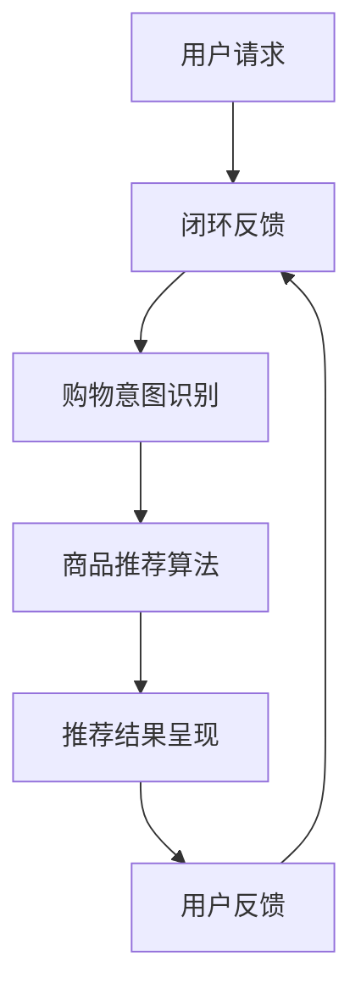

                 

# 虚拟导购助手：AI的功能

> 关键词：虚拟导购、人工智能、自然语言处理、用户交互、个性化推荐、购物体验优化

> 摘要：本文将深入探讨虚拟导购助手的定义、核心功能及其在购物体验优化中的应用。通过逐步分析其工作原理、核心算法、数学模型和实际应用案例，帮助读者理解虚拟导购助手的运作机制和未来发展趋势。

## 1. 背景介绍

### 1.1 目的和范围

本文旨在介绍虚拟导购助手（Virtual Shopping Assistant）的概念、功能及应用，旨在帮助读者了解这一新兴技术的本质和潜力。虚拟导购助手是一种基于人工智能（AI）的智能系统，通过自然语言处理（NLP）和机器学习算法，提供个性化的购物推荐和服务。本文将围绕以下几个主要方面展开：

1. 虚拟导购助手的定义和核心功能。
2. 虚拟导购助手的技术架构和核心算法原理。
3. 虚拟导购助手的数学模型和计算方法。
4. 虚拟导购助手的实际应用案例和项目实战。
5. 虚拟导购助手的未来发展趋势与挑战。

### 1.2 预期读者

本文适合对人工智能和电子商务领域感兴趣的读者，包括：

1. 人工智能研究者、开发者和工程师。
2. 电子商务平台开发者和运营团队。
3. 对智能购物体验有热情的企业家和创业者。
4. 计算机科学和电子商务专业的学生和学者。

### 1.3 文档结构概述

本文结构如下：

1. 引言：介绍虚拟导购助手的背景和目的。
2. 核心概念与联系：阐述虚拟导购助手的核心概念和流程图。
3. 核心算法原理 & 具体操作步骤：详细讲解虚拟导购助手的工作原理和算法。
4. 数学模型和公式 & 详细讲解 & 举例说明：介绍虚拟导购助手的数学模型和计算方法。
5. 项目实战：代码实际案例和详细解释说明。
6. 实际应用场景：讨论虚拟导购助手在电商领域的应用。
7. 工具和资源推荐：推荐学习资源、开发工具和框架。
8. 总结：虚拟导购助手的未来发展趋势与挑战。
9. 附录：常见问题与解答。
10. 扩展阅读 & 参考资料。

### 1.4 术语表

#### 1.4.1 核心术语定义

- 虚拟导购助手（Virtual Shopping Assistant）：基于人工智能技术的智能系统，提供个性化的购物推荐和服务。
- 自然语言处理（NLP）：使计算机能够理解、解释和生成人类语言的技术。
- 机器学习（ML）：一种人工智能的分支，通过数据和算法让计算机自动学习并改进性能。
- 个性化推荐（Personalized Recommendation）：基于用户行为和偏好，为用户提供个性化的商品推荐。

#### 1.4.2 相关概念解释

- 商品推荐系统（Product Recommendation System）：一种自动化的系统，根据用户的历史行为和偏好为用户推荐相关商品。
- 交互式对话系统（Interactive Dialog System）：能够与用户进行自然语言交互，理解并回应用户请求的系统。

#### 1.4.3 缩略词列表

- NLP：自然语言处理
- AI：人工智能
- ML：机器学习
- VRPA：虚拟导购助手
- E-commerce：电子商务
- UX：用户体验
- UI：用户界面

## 2. 核心概念与联系

在深入探讨虚拟导购助手之前，我们需要明确几个核心概念，并了解它们之间的相互关系。以下是一个简单的Mermaid流程图，展示了虚拟导购助手的关键组成部分和流程。

### 2.1 用户请求与自然语言理解

用户请求是虚拟导购助手的输入。用户可以通过文本消息、语音输入等方式与系统互动。自然语言理解（NLU）模块负责将用户的自然语言请求转化为结构化的数据。这一过程包括分词、词性标注、命名实体识别等步骤。

### 2.2 购物意图识别

购物意图识别模块基于用户请求的结构化数据，识别用户的购物意图。例如，用户请求可能是“推荐一些适合夏天穿的衣服”，系统需要识别出这是一个关于服装推荐的请求。

### 2.3 商品推荐算法

商品推荐算法是虚拟导购助手的核

