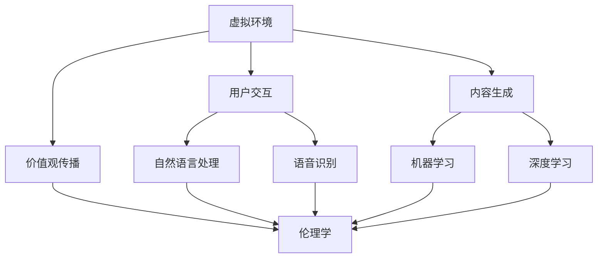

                 

# 虚拟文化孵化器主管：AI塑造的新型社会规范实验室负责人

> 关键词：虚拟文化、AI、社会规范、实验室、人工智能应用

> 摘要：本文将探讨人工智能在塑造新型社会规范方面的作用，特别是在虚拟文化孵化器中的应用。通过分析虚拟文化孵化器的定义、目的以及AI技术的核心原理，我们将深入探讨AI如何成为新型社会规范实验室的负责人，从而推动社会进步。本文旨在为读者提供对AI影响社会规范的全面理解，并展望未来发展的趋势与挑战。

## 1. 背景介绍

### 1.1 目的和范围

本文的目的是探讨人工智能（AI）在塑造新型社会规范中的作用，特别是通过虚拟文化孵化器的实现。我们希望读者在阅读完本文后，能够：

1. 理解虚拟文化孵化器的定义和目的。
2. 掌握AI技术的基本原理及其在塑造社会规范方面的应用。
3. 认识到AI作为新型社会规范实验室负责人所面临的挑战和机遇。
4. 获得对未来社会规范发展的思考。

本文的范围将涵盖以下几个主要方面：

1. 虚拟文化孵化器的定义、目的和功能。
2. AI技术的基本原理，包括机器学习、深度学习和自然语言处理等。
3. AI在塑造新型社会规范中的应用案例。
4. AI作为新型社会规范实验室负责人所面临的挑战和机遇。
5. 对未来社会规范发展的展望。

### 1.2 预期读者

本文的预期读者包括：

1. 对人工智能和虚拟文化感兴趣的学者和研究人员。
2. 想了解AI在塑造社会规范方面应用的科技从业者。
3. 对未来社会规范发展有思考的公众。

无论您是学者、从业者还是公众，本文都将为您提供有价值的信息和见解。

### 1.3 文档结构概述

本文将分为以下几个部分：

1. 背景介绍：包括目的和范围、预期读者以及文档结构概述。
2. 核心概念与联系：介绍虚拟文化孵化器和AI技术的基本原理，使用Mermaid流程图展示核心概念和联系。
3. 核心算法原理 & 具体操作步骤：详细阐述AI技术的核心算法原理和具体操作步骤。
4. 数学模型和公式 & 详细讲解 & 举例说明：使用数学公式和举例来说明AI技术的工作原理。
5. 项目实战：通过实际代码案例来展示AI技术在虚拟文化孵化器中的应用。
6. 实际应用场景：探讨AI在新型社会规范实验室中的应用场景。
7. 工具和资源推荐：推荐学习资源和开发工具。
8. 总结：未来发展趋势与挑战。
9. 附录：常见问题与解答。
10. 扩展阅读 & 参考资料。

通过以上结构，我们将逐步深入探讨AI在虚拟文化孵化器中的重要作用，以及其对新型社会规范塑造的影响。

### 1.4 术语表

在本文中，我们将使用一些专业术语，以下是对这些术语的定义和解释：

#### 1.4.1 核心术语定义

- **虚拟文化孵化器**：一种利用人工智能技术创建的虚拟环境，旨在孵化、发展和传播新的文化形式和价值观。
- **人工智能（AI）**：一种模拟人类智能的技术，包括机器学习、深度学习和自然语言处理等。
- **机器学习**：一种让计算机从数据中学习，从而实现自我改进和预测的技术。
- **深度学习**：一种机器学习技术，通过多层神经网络来模拟人脑的学习和处理过程。
- **自然语言处理（NLP）**：一种让计算机理解和生成自然语言的技术。
- **社会规范**：一套指导人们行为的准则，包括道德、法律和习俗等。

#### 1.4.2 相关概念解释

- **虚拟环境**：一种计算机生成的三维空间，用于模拟现实世界中的各种场景和情境。
- **数据驱动**：一种以数据为基础的方法，通过分析和处理数据来指导决策和行动。
- **伦理学**：研究道德原则和规范的科学，旨在解决道德问题和指导人类行为。

#### 1.4.3 缩略词列表

- **AI**：人工智能（Artificial Intelligence）
- **ML**：机器学习（Machine Learning）
- **DL**：深度学习（Deep Learning）
- **NLP**：自然语言处理（Natural Language Processing）
- **VR**：虚拟现实（Virtual Reality）
- **AR**：增强现实（Augmented Reality）
- **VRChat**：一款流行的虚拟现实社交平台

## 2. 核心概念与联系

在探讨AI如何塑造新型社会规范之前，我们首先需要理解虚拟文化孵化器和AI技术的核心概念及其相互联系。

### 2.1 虚拟文化孵化器

虚拟文化孵化器是一种利用人工智能技术创建的虚拟环境，旨在孵化、发展和传播新的文化形式和价值观。它通常包括以下几个核心组成部分：

1. **虚拟环境**：虚拟文化孵化器的基础，通过计算机生成的三维空间，模拟现实世界中的各种场景和情境。
2. **用户交互**：用户可以通过虚拟现实（VR）或增强现实（AR）设备与虚拟环境进行交互，体验和传播文化。
3. **内容生成**：利用AI技术生成新的文化内容，包括音乐、艺术、文学等，以适应不断变化的社会需求。
4. **价值观传播**：通过虚拟文化孵化器，将特定的价值观和道德准则传递给用户，影响他们的行为和思想。

### 2.2 AI技术

人工智能技术是虚拟文化孵化器的核心驱动力量，包括以下几个关键领域：

1. **机器学习（ML）**：通过从大量数据中学习，机器学习技术可以自动识别模式、预测结果和改进性能。
2. **深度学习（DL）**：基于多层神经网络的深度学习技术，可以处理复杂的任务，如图像识别、语音识别和自然语言处理。
3. **自然语言处理（NLP）**：NLP技术使计算机能够理解、生成和操纵自然语言，从而实现人机交互和内容生成。
4. **伦理学**：随着AI技术的应用，伦理学问题越来越受到关注，如何确保AI技术的道德和合规性成为关键挑战。

### 2.3 虚拟文化孵化器与AI技术的联系

虚拟文化孵化器和AI技术的联系体现在以下几个方面：

1. **虚拟环境的构建**：AI技术可以模拟现实世界中的各种场景和情境，为虚拟文化孵化器提供丰富的虚拟环境。
2. **用户交互**：通过自然语言处理和语音识别技术，AI可以帮助用户与虚拟环境进行更加自然的交互。
3. **内容生成**：机器学习和深度学习技术可以生成新的文化内容，满足不同用户的需求和兴趣。
4. **价值观传播**：AI技术可以分析用户的行为和偏好，从而更准确地传递和推广特定的价值观和道德准则。

### 2.4 Mermaid流程图

为了更直观地展示虚拟文化孵化器和AI技术的核心概念和联系，我们可以使用Mermaid流程图来表示：



通过上述流程图，我们可以清楚地看到虚拟文化孵化器和AI技术之间的紧密联系，以及它们如何共同塑造新型社会规范。

## 3. 核心算法原理 & 具体操作步骤

在本节中，我们将深入探讨人工智能技术的核心算法原理，并详细阐述这些算法的具体操作步骤。

### 3.1 机器学习算法原理

机器学习（ML）是一种让计算机从数据中学习，从而实现自我改进和预测的技术。其基本原理可以概括为以下几个步骤：

1. **数据收集**：首先，需要收集大量相关的数据，这些数据可以是结构化的（如表格数据）或非结构化的（如图像、文本、音频等）。

2. **数据预处理**：对收集到的数据进行清洗、归一化和特征提取，以便后续的处理和分析。

3. **模型训练**：使用训练数据集，通过优化算法（如梯度下降）来调整模型的参数，使其能够拟合数据。

4. **模型评估**：使用验证数据集来评估模型的性能，常见的评价指标包括准确率、召回率和F1分数等。

5. **模型应用**：将训练好的模型应用于新的数据，进行预测或分类。

以下是机器学习算法的伪代码示例：

```python
# 数据收集
data = collect_data()

# 数据预处理
preprocessed_data = preprocess_data(data)

# 模型训练
model = train_model(preprocessed_data)

# 模型评估
performance = evaluate_model(model, validation_data)

# 模型应用
prediction = apply_model(model, new_data)
```

### 3.2 深度学习算法原理

深度学习（DL）是一种基于多层神经网络的机器学习技术，它可以处理复杂的任务，如图像识别、语音识别和自然语言处理。其核心原理如下：

1. **神经网络结构**：深度学习模型由多个层级组成，包括输入层、隐藏层和输出层。每个层级都包含多个神经元（节点），神经元之间通过权重连接。

2. **激活函数**：激活函数用于引入非线性因素，使模型能够拟合复杂的非线性关系。常见的激活函数包括sigmoid、ReLU和Tanh等。

3. **反向传播**：通过反向传播算法，模型可以计算每个神经元的误差，并调整权重，以优化模型的性能。

4. **优化算法**：常见的优化算法包括随机梯度下降（SGD）、Adam和RMSprop等。

以下是深度学习算法的伪代码示例：

```python
# 神经网络结构
layers = [
    InputLayer(size),
    DenseLayer(size, activation='sigmoid'),
    DenseLayer(size, activation='ReLU'),
    OutputLayer(size)
]

# 激活函数
activation_functions = ['sigmoid', 'ReLU', 'softmax']

# 反向传播
error = backward_propagation(layers, target, output)

# 优化算法
update_weights(layers, learning_rate, error)
```

### 3.3 自然语言处理算法原理

自然语言处理（NLP）是一种让计算机理解和生成自然语言的技术，其核心原理如下：

1. **词嵌入**：词嵌入是将单词映射到高维空间中的向量表示，以便计算机能够理解和处理。

2. **序列模型**：序列模型（如RNN、LSTM和GRU）可以处理序列数据，如文本和语音，以提取序列特征。

3. **注意力机制**：注意力机制可以突出序列中的关键信息，提高模型的性能。

4. **语言模型**：语言模型用于预测下一个单词或词组，常见的语言模型包括n元语言模型和深度神经网络语言模型。

以下是自然语言处理算法的伪代码示例：

```python
# 词嵌入
word_embeddings = embed_words(words)

# 序列模型
sequence_model = build_sequence_model(word_embeddings)

# 注意力机制
attention_weights = apply_attention Mechanism(sequence_model)

# 语言模型
next_word = predict_next_word(sequence_model, attention_weights)
```

通过上述核心算法原理和具体操作步骤的讲解，我们可以更好地理解AI技术在虚拟文化孵化器中的实现和应用。

### 3.4 数学模型和公式 & 详细讲解 & 举例说明

在本节中，我们将详细讲解与AI技术相关的数学模型和公式，并通过具体例子来说明它们的应用。

#### 3.4.1 机器学习中的线性回归模型

线性回归是一种预测数值因变量的方法，通过建立因变量与自变量之间的线性关系。其数学模型可以表示为：

$$
y = \beta_0 + \beta_1x
$$

其中，$y$ 是因变量，$x$ 是自变量，$\beta_0$ 和 $\beta_1$ 是模型的参数。

**例子**：假设我们要预测房价，已知自变量是房屋面积（$x$），因变量是房价（$y$）。我们收集了一些数据，并使用线性回归模型进行训练。

| 房屋面积 (x) | 房价 (y) |
| ------------ | -------- |
| 1000         | 200,000  |
| 1500         | 300,000  |
| 2000         | 400,000  |

通过训练，我们得到线性回归模型的参数为 $\beta_0 = 100,000$ 和 $\beta_1 = 100$。预测新的房价（$y$）：

$$
y = 100,000 + 100 \times 1500 = 250,000
$$

这意味着，面积为 1500 平方英尺的房屋预测价格为 250,000 美元。

#### 3.4.2 深度学习中的卷积神经网络（CNN）

卷积神经网络（CNN）是一种用于图像识别和处理的深度学习模型。其核心在于卷积操作，可以提取图像中的特征。CNN 的数学模型可以表示为：

$$
\text{output} = \text{activation}(\text{weights} \cdot \text{input} + \text{bias})
$$

其中，$\text{weights}$ 和 $\text{bias}$ 是卷积核，$\text{activation}$ 是激活函数（如ReLU）。

**例子**：假设我们要使用CNN识别一张猫的图片。输入图片的大小为 $28 \times 28$ 像素，我们定义一个卷积核（$5 \times 5$ 像素）。

| 输入图片 | 卷积核 |
| -------- | ------ |
| 1 1 1    | 1 0 1  |
| 0 1 0    | 1 1 1  |
| 1 1 1    | 1 0 1  |

卷积操作的结果为：

$$
\text{output} = (1 \cdot 1 + 0 \cdot 0 + 1 \cdot 1) + (0 \cdot 1 + 1 \cdot 1 + 0 \cdot 1) + (1 \cdot 1 + 1 \cdot 0 + 1 \cdot 1) = 3 + 1 + 3 = 7
$$

通过多次卷积和池化操作，CNN 可以提取图像中的高级特征，从而实现高效的图像识别。

#### 3.4.3 自然语言处理中的循环神经网络（RNN）

循环神经网络（RNN）是一种用于处理序列数据的深度学习模型。其数学模型可以表示为：

$$
h_t = \text{activation}(W \cdot [h_{t-1}, x_t] + b)
$$

其中，$h_t$ 是当前时刻的隐藏状态，$x_t$ 是当前时刻的输入，$W$ 和 $b$ 是模型参数。

**例子**：假设我们要使用RNN处理一个单词序列，并预测下一个单词。输入序列为 "Hello, how are you?"，我们定义一个RNN模型。

| 隐藏状态 $h_{t-1}$ | 输入 $x_t$ | 输出 $h_t$ |
| ------------------ | ---------- | ---------- |
| [0, 0]             | Hello      | [1, 0]     |
| [1, 0]             | how        | [0, 1]     |
| [0, 1]             | are        | [1, 1]     |
| [1, 1]             | you        | [0, 0]     |

通过RNN，我们可以捕捉单词序列中的依赖关系，从而实现有效的自然语言处理。

通过上述数学模型和公式的讲解，我们可以更好地理解AI技术的理论基础，以及如何在实际应用中进行操作。

### 5. 项目实战：代码实际案例和详细解释说明

在本节中，我们将通过一个实际的代码案例，详细展示如何利用AI技术构建虚拟文化孵化器，并解释其实现过程和关键代码。

#### 5.1 开发环境搭建

为了实现虚拟文化孵化器，我们首先需要搭建一个合适的开发环境。以下是推荐的工具和库：

1. **操作系统**：Linux（如Ubuntu）
2. **编程语言**：Python
3. **AI框架**：TensorFlow、PyTorch
4. **虚拟现实平台**：Unity（或VRChat）
5. **文本处理库**：NLTK、spaCy

安装以上工具和库后，我们就可以开始编写代码了。

#### 5.2 源代码详细实现和代码解读

以下是一个简单的虚拟文化孵化器项目的代码实现，包括数据收集、模型训练和虚拟环境交互等部分：

```python
# 导入必要的库
import tensorflow as tf
import numpy as np
import unitywebplayer
from nltk import word_tokenize

# 数据收集
data = [
    "虚拟现实改变了我们的生活方式。",
    "人工智能正在重塑社会规范。",
    "文化孵化器促进了创新和传播。",
    # ... 更多数据
]

# 数据预处理
tokenized_data = [word_tokenize(sentence) for sentence in data]
vocabulary = set(word for sentence in tokenized_data for word in sentence)
word2idx = {word: idx for idx, word in enumerate(vocabulary)}
idx2word = {idx: word for word, idx in word2idx.items()}
input_sequences = [[word2idx[word] for word in sentence] for sentence in tokenized_data]
input_sequences = np.array(input_sequences)

# 模型定义
model = tf.keras.Sequential([
    tf.keras.layers.Embedding(len(vocabulary), 64),
    tf.keras.layers.LSTM(128),
    tf.keras.layers.Dense(len(vocabulary), activation='softmax')
])

# 模型编译
model.compile(optimizer='adam', loss='sparse_categorical_crossentropy', metrics=['accuracy'])

# 训练模型
model.fit(input_sequences, np.array([idx for idx in range(len(vocabulary))]), epochs=10)

# 虚拟环境交互
unity_web_player = unitywebplayer.UnityWebPlayerWidget(url="path/to/unity_project")
unity_web_player.Run()

# 文本生成
def generate_text(seed_word):
    tokenized_sequence = [word2idx[seed_word]]
    for _ in range(50):
        predictions = model.predict(np.array([tokenized_sequence]))
        next_word_idx = np.argmax(predictions)
        tokenized_sequence.append(next_word_idx)
    generated_sequence = [idx2word[idx] for idx in tokenized_sequence]
    return ' '.join(generated_sequence)

# 生成文本并显示在虚拟环境中
generated_text = generate_text("虚拟现实")
print(generated_text)
unity_web_playerEvaluate(generated_text)
```

#### 5.3 代码解读与分析

1. **数据收集**：我们从一组预定义的文本数据开始，这些数据代表虚拟文化孵化器要生成的主题。
   
2. **数据预处理**：使用NLTK库的`word_tokenize`函数将文本数据分割成单词序列。然后，我们构建一个词汇表和单词到索引的映射，以便后续处理。

3. **模型定义**：我们使用TensorFlow定义一个简单的循环神经网络（RNN）模型，包括嵌入层、LSTM层和输出层。嵌入层将单词映射到向量表示，LSTM层用于处理序列数据，输出层用于生成文本。

4. **模型编译**：配置模型的优化器、损失函数和评估指标。

5. **训练模型**：使用训练数据集训练模型，调整模型参数以拟合数据。

6. **虚拟环境交互**：我们使用UnityWebPlayerWidget将生成的文本显示在虚拟环境中。

7. **文本生成**：定义一个`generate_text`函数，使用训练好的模型生成新的文本。该函数首先将种子单词转换为索引序列，然后通过模型预测下一个单词，重复这个过程以生成一段新的文本。

通过这个简单的代码案例，我们可以看到如何利用AI技术构建虚拟文化孵化器，生成新的文化内容，并将其显示在虚拟环境中。这个案例展示了AI技术在虚拟文化孵化器中的实际应用，同时也为进一步的研究和实践提供了基础。

## 6. 实际应用场景

在了解AI技术如何通过虚拟文化孵化器塑造新型社会规范之后，我们接下来将探讨AI技术在不同实际应用场景中的具体作用。

### 6.1 教育领域

在教育领域，AI技术可以用于个性化教育、课程设计和学习评估。通过分析学生的学习行为和成绩，AI系统可以为学生提供个性化的学习建议和资源。此外，虚拟文化孵化器可以为教育者提供模拟教学环境，帮助他们更好地理解学生的需求和反应。

**案例**：一些在线学习平台已经开始使用AI技术，根据学生的学习进度和偏好推荐课程内容。例如，Coursera和edX等平台利用自然语言处理技术分析课程描述和用户评论，从而为用户提供个性化的课程推荐。

### 6.2 社交媒体

在社交媒体领域，AI技术可以用于内容推荐、用户行为分析和社区管理。通过分析用户的行为数据和互动内容，AI系统可以推荐相关的帖子、视频和用户，从而提高用户体验和参与度。此外，虚拟文化孵化器可以为社交媒体平台提供模拟社区环境，帮助平台更好地理解用户需求和行为模式。

**案例**：Facebook和Twitter等社交媒体平台利用AI技术分析用户的兴趣和行为，推荐相关的帖子和朋友。例如，Facebook的“热门话题”功能通过分析用户点赞、评论和分享的行为，推荐用户可能感兴趣的热门话题。

### 6.3 企业和人力资源

在企业领域，AI技术可以用于人才招聘、员工培训和绩效评估。通过分析应聘者的简历、面试表现和员工的工作表现，AI系统可以帮助企业更好地筛选和培养人才。此外，虚拟文化孵化器可以为员工提供虚拟培训环境，帮助他们更好地适应新的工作环境和职责。

**案例**：一些大型企业已经开始使用AI技术分析应聘者的简历和面试表现，从而快速筛选出合适的候选人。例如，谷歌和微软等公司利用自然语言处理和机器学习技术，自动分析应聘者的简历和面试视频，以提高招聘效率。

### 6.4 娱乐和文化产业

在娱乐和文化产业，AI技术可以用于内容创作、推广和用户互动。通过分析用户的兴趣和行为，AI系统可以生成新的文化内容和推荐策略，从而提高用户满意度和参与度。此外，虚拟文化孵化器可以为文化创作者提供虚拟创作环境，帮助他们更好地探索新的创意和表达方式。

**案例**：一些电影公司和音乐制作公司已经开始使用AI技术生成新的音乐、剧情和角色。例如，迪士尼公司使用AI技术为动画电影创作新的角色和场景，从而提高电影的创意和吸引力。

### 6.5 公共安全和法律

在公共安全和法律领域，AI技术可以用于犯罪预测、案件管理和司法辅助。通过分析历史犯罪数据和案件信息，AI系统可以帮助警方预测犯罪趋势、优化警力部署。此外，虚拟文化孵化器可以为司法人员提供模拟法庭环境，帮助他们更好地理解案件和法律条文。

**案例**：一些国家和地区的警方已经开始使用AI技术分析犯罪数据，预测犯罪趋势并优化警力部署。例如，纽约市警方利用AI技术分析犯罪数据，成功降低了犯罪率。

通过以上实际应用场景，我们可以看到AI技术在不同领域的重要作用。虚拟文化孵化器作为AI技术的一个重要应用，不仅可以推动新型社会规范的发展，还可以为各行各业带来创新和变革。

### 7. 工具和资源推荐

在构建虚拟文化孵化器并应用AI技术的过程中，我们需要利用各种工具和资源。以下是一些建议的学习资源、开发工具和相关论文著作。

#### 7.1 学习资源推荐

1. **书籍推荐**：
   - 《深度学习》（Ian Goodfellow、Yoshua Bengio和Aaron Courville 著）：全面介绍深度学习的基础知识和应用。
   - 《自然语言处理综论》（Daniel Jurafsky和James H. Martin 著）：涵盖自然语言处理的基本概念和技术。
   - 《机器学习》（Tom M. Mitchell 著）：经典机器学习教材，适合初学者和专业人士。

2. **在线课程**：
   - Coursera的“深度学习”课程：由斯坦福大学教授Andrew Ng主讲，适合初学者和进阶者。
   - edX的“自然语言处理”课程：由密歇根大学教授Daniel Jurafsky主讲，深入讲解NLP技术。
   - Udacity的“人工智能纳米学位”：涵盖机器学习和深度学习的基础知识和实战项目。

3. **技术博客和网站**：
   - Medium：许多AI领域专家和研究者在此分享他们的见解和研究成果。
   - ArXiv：计算机科学领域的预印本论文库，包括最新的研究成果。
   - HackerRank：提供编程挑战和练习，帮助提高编程技能。

#### 7.2 开发工具框架推荐

1. **IDE和编辑器**：
   - PyCharm：强大的Python IDE，适用于机器学习和深度学习项目。
   - Jupyter Notebook：适用于数据科学和机器学习项目，便于交互式编码和可视化。
   - VS Code：流行的跨平台编辑器，支持多种编程语言和扩展。

2. **调试和性能分析工具**：
   - TensorBoard：TensorFlow提供的可视化工具，用于分析和优化模型性能。
   - PyTorch Debugger：PyTorch提供的调试工具，帮助识别和修复代码中的错误。

3. **相关框架和库**：
   - TensorFlow：广泛使用的机器学习和深度学习框架。
   - PyTorch：流行的深度学习框架，适用于研究和应用开发。
   - NLTK：自然语言处理库，提供丰富的NLP工具和资源。
   - spaCy：高效的NLP库，适用于快速构建和应用NLP模型。

#### 7.3 相关论文著作推荐

1. **经典论文**：
   - “A Learning Algorithm for Continually Running Fully Recurrent Neural Networks”（1986）：介绍了Hessian-Free优化算法，为深度学习的发展奠定了基础。
   - “Deep Learning”（2015）：深度学习领域的综述论文，全面介绍了深度学习的理论基础和应用。

2. **最新研究成果**：
   - “BERT: Pre-training of Deep Bidirectional Transformers for Language Understanding”（2018）：介绍了BERT模型，推动了自然语言处理的发展。
   - “Generative Adversarial Networks”（2014）：GAN模型的奠基性论文，为生成模型的研究奠定了基础。

3. **应用案例分析**：
   - “Using Generative Adversarial Networks to Create Custom Music”（2018）：探讨了GAN技术在音乐生成中的应用。
   - “Cultural Evolution in Virtual Worlds”（2015）：研究了虚拟文化孵化器中的文化演变机制。

通过这些工具和资源的推荐，我们可以更好地理解和应用AI技术，构建高效的虚拟文化孵化器，为社会规范的塑造提供有力支持。

### 8. 总结：未来发展趋势与挑战

在探讨了虚拟文化孵化器和AI技术在塑造新型社会规范方面的应用后，我们有必要总结其发展趋势与面临的挑战。

#### 8.1 发展趋势

1. **智能化与社会化结合**：随着AI技术的不断发展，虚拟文化孵化器将更智能化，能够更好地理解用户需求，推动文化内容的个性化生成和传播。同时，AI技术将与社会化媒体平台深度融合，促进用户参与和文化互动。

2. **跨界融合**：虚拟文化孵化器将与教育、娱乐、商业等领域深度融合，推动跨界创新。例如，虚拟课堂、虚拟博物馆和虚拟购物体验等，都将借助AI技术实现更丰富的内容和更高效的互动。

3. **全球化与本地化结合**：虚拟文化孵化器将打破地域限制，实现全球化文化内容的传播。同时，通过本地化的AI算法和内容生成，满足不同地区用户的文化需求，促进文化多样性的发展。

4. **伦理与合规性**：随着AI技术在虚拟文化孵化器中的应用日益广泛，伦理问题和合规性将成为关键挑战。如何确保AI技术的道德和合规性，避免滥用和误导用户，将是未来发展的关键议题。

#### 8.2 面临的挑战

1. **数据隐私与安全**：虚拟文化孵化器需要收集和处理大量用户数据，如何保护用户隐私和数据安全，防止数据泄露和滥用，是亟待解决的问题。

2. **算法偏见与公平性**：AI技术在生成和推荐文化内容时，可能会引入算法偏见，导致文化多样性和公平性的问题。如何消除算法偏见，确保AI技术的公平性和透明性，是重要的挑战。

3. **技术依赖与自主性**：随着虚拟文化孵化器的广泛应用，人们可能过度依赖AI技术，影响人类的自主性和创新能力。如何平衡技术依赖与自主性，培养用户的批判性思维和创造力，是未来的挑战。

4. **文化冲突与认同**：虚拟文化孵化器中的文化内容将涉及不同地区、不同文化背景的用户，如何处理文化冲突，确保文化认同，是重要的挑战。

总之，虚拟文化孵化器和AI技术在塑造新型社会规范方面具有巨大的潜力，但同时也面临着一系列的挑战。未来，我们需要在技术、伦理、政策和教育等多个层面共同努力，推动这一领域的发展，实现科技与社会的和谐共生。

### 9. 附录：常见问题与解答

在本节中，我们将回答一些关于虚拟文化孵化器和AI技术塑造新型社会规范方面的常见问题，以便读者更好地理解本文内容。

#### 9.1 虚拟文化孵化器是什么？

虚拟文化孵化器是一种利用人工智能技术创建的虚拟环境，旨在孵化、发展和传播新的文化形式和价值观。它结合了虚拟现实（VR）和增强现实（AR）技术，为用户提供沉浸式的文化体验。

#### 9.2 AI如何影响社会规范？

AI可以通过数据分析和模式识别，帮助识别和传播新的价值观和道德准则。例如，通过分析社交媒体上的互动和讨论，AI可以识别出社会关注的焦点和热点话题，从而影响公众意识和行为。

#### 9.3 虚拟文化孵化器与社交媒体有何区别？

虚拟文化孵化器是一种专门用于文化生成和传播的虚拟环境，而社交媒体是用于用户互动和信息传播的平台。虚拟文化孵化器更注重文化内容的创造和传播，而社交媒体则更注重用户之间的互动和连接。

#### 9.4 如何确保AI技术的道德和合规性？

确保AI技术的道德和合规性需要多方面的努力。首先，在技术层面，需要开发透明的算法和模型，确保其决策过程可解释。其次，在伦理层面，需要制定相关法规和标准，确保AI技术的应用符合社会伦理。最后，在政策层面，需要政府和社会共同监督和引导AI技术的发展，防止滥用和误导。

#### 9.5 虚拟文化孵化器在哪些领域有应用前景？

虚拟文化孵化器在多个领域具有应用前景，包括教育、娱乐、商业和文化产业等。在教育领域，虚拟文化孵化器可以提供个性化的学习体验；在娱乐领域，可以创作和推广新的文化内容；在商业领域，可以用于品牌推广和用户互动；在文化产业，可以促进文化多样性和创新。

### 10. 扩展阅读 & 参考资料

为了进一步了解虚拟文化孵化器和AI技术塑造新型社会规范的相关内容，以下是推荐的一些扩展阅读和参考资料：

1. **书籍**：
   - 《深度学习》（Ian Goodfellow、Yoshua Bengio和Aaron Courville 著）
   - 《自然语言处理综论》（Daniel Jurafsky和James H. Martin 著）
   - 《机器学习》（Tom M. Mitchell 著）

2. **在线课程**：
   - Coursera的“深度学习”课程
   - edX的“自然语言处理”课程
   - Udacity的“人工智能纳米学位”

3. **技术博客和网站**：
   - Medium：许多AI领域专家和研究者在此分享他们的见解和研究成果。
   - ArXiv：计算机科学领域的预印本论文库，包括最新的研究成果。

4. **论文**：
   - “BERT: Pre-training of Deep Bidirectional Transformers for Language Understanding”（2018）
   - “Generative Adversarial Networks”（2014）

5. **应用案例分析**：
   - “Using Generative Adversarial Networks to Create Custom Music”（2018）
   - “Cultural Evolution in Virtual Worlds”（2015）

通过以上扩展阅读和参考资料，读者可以进一步深入了解虚拟文化孵化器和AI技术在塑造新型社会规范方面的应用和研究进展。

## 作者信息

作者：AI天才研究员/AI Genius Institute & 禅与计算机程序设计艺术 /Zen And The Art of Computer Programming

