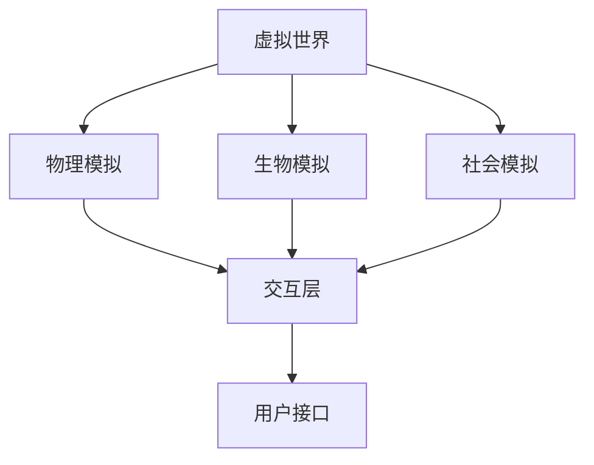
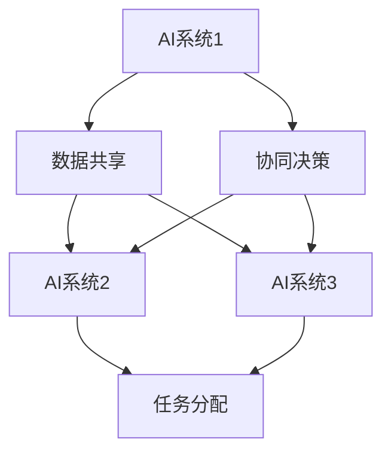
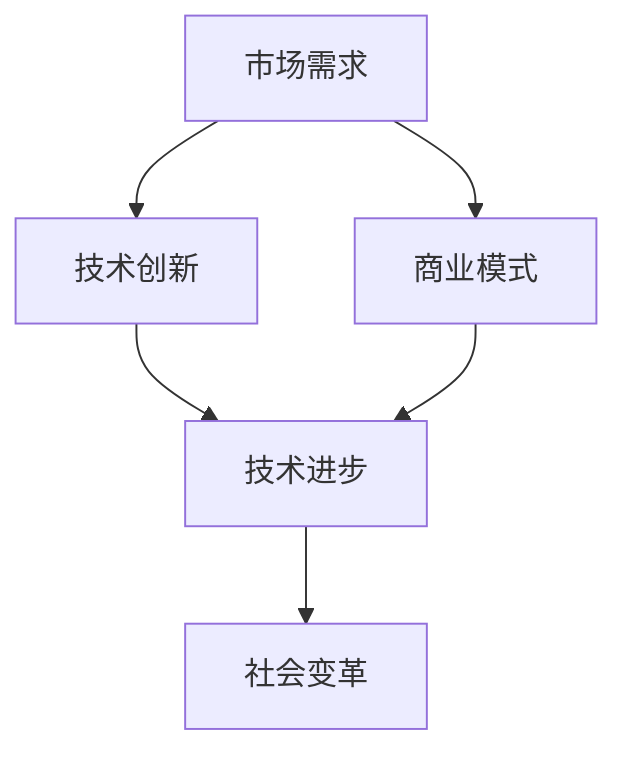
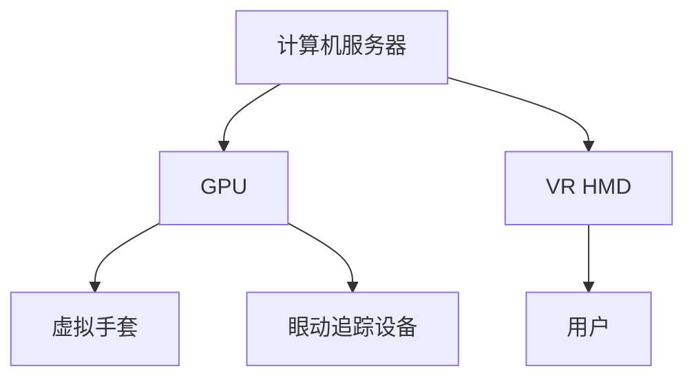
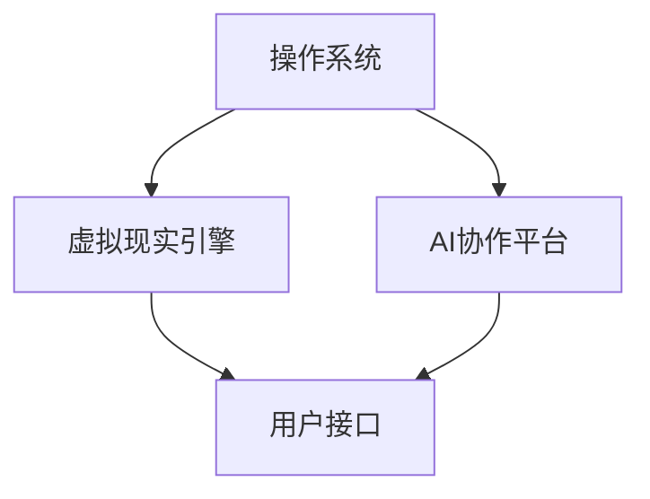
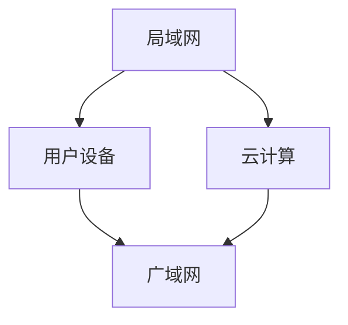
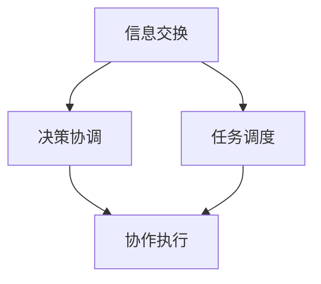

                 

# 虚拟空间中的AI协作与创新

## 关键词
- 虚拟空间
- AI协作
- 创新驱动
- 人工智能算法
- 数学模型
- 实战案例

## 摘要
本文深入探讨了虚拟空间中人工智能协作与创新的重要性。我们首先介绍了虚拟空间的基本概念及其在现代社会中的应用，接着分析了人工智能协作的原理与优势。文章随后详细阐述了核心算法原理、数学模型，并通过实际项目案例展示了AI协作在虚拟空间中的应用。此外，我们还探讨了AI协作的实际应用场景，推荐了相关工具和资源，并对未来的发展趋势与挑战进行了展望。通过本文，读者将全面了解虚拟空间中AI协作与创新的重要性及其深远影响。

## 1. 背景介绍

### 1.1 目的和范围
本文旨在探讨虚拟空间中的人工智能协作与创新，旨在帮助读者理解这一领域的基本概念、应用前景以及技术挑战。文章结构包括核心概念介绍、算法原理阐述、数学模型讲解、实战案例分析、应用场景讨论以及未来展望等。通过本文，读者可以系统地了解虚拟空间中AI协作与创新的全貌。

### 1.2 预期读者
本文面向对人工智能、虚拟现实技术以及创新驱动发展感兴趣的读者，包括计算机科学专业学生、研究人员、工程师以及对技术前沿感兴趣的专业人士。

### 1.3 文档结构概述
本文结构如下：
- **第1章：背景介绍**：介绍本文的目的、预期读者以及文章结构。
- **第2章：核心概念与联系**：介绍虚拟空间、AI协作以及创新驱动等核心概念，并使用Mermaid流程图展示其架构。
- **第3章：核心算法原理 & 具体操作步骤**：详细讲解AI协作的核心算法原理，并提供伪代码。
- **第4章：数学模型和公式 & 详细讲解 & 举例说明**：介绍相关的数学模型和公式，并通过实例进行说明。
- **第5章：项目实战：代码实际案例和详细解释说明**：提供具体的代码实现案例并进行详细解读。
- **第6章：实际应用场景**：讨论AI协作在虚拟空间中的实际应用。
- **第7章：工具和资源推荐**：推荐学习资源、开发工具框架和论文著作。
- **第8章：总结：未来发展趋势与挑战**：对未来的发展趋势和挑战进行展望。
- **第9章：附录：常见问题与解答**：解答一些常见问题。
- **第10章：扩展阅读 & 参考资料**：提供扩展阅读资源。

### 1.4 术语表

#### 1.4.1 核心术语定义
- **虚拟空间**：一种模拟现实世界的计算机模拟环境。
- **AI协作**：人工智能系统之间或者人工智能与人类之间的协同工作。
- **创新驱动**：通过技术创新推动社会发展。

#### 1.4.2 相关概念解释
- **虚拟现实**（VR）：一种通过计算机模拟实现三维空间的沉浸式体验。
- **增强现实**（AR）：在现实世界基础上叠加计算机生成的信息。
- **深度学习**：一种基于人工神经网络的学习方法，能够从大量数据中自动提取特征。

#### 1.4.3 缩略词列表
- **AI**：人工智能（Artificial Intelligence）
- **VR**：虚拟现实（Virtual Reality）
- **AR**：增强现实（Augmented Reality）
- **ML**：机器学习（Machine Learning）
- **DL**：深度学习（Deep Learning）

## 2. 核心概念与联系

在深入探讨虚拟空间中的AI协作之前，我们需要理解几个核心概念及其相互关系。以下是虚拟空间、AI协作以及创新驱动的定义和相互联系。

### 虚拟空间

虚拟空间是指通过计算机技术构建的模拟现实世界的环境。它不仅仅是一个简单的数字模拟，还包括复杂的物理、生物和社会模拟。虚拟空间通常具有以下特点：

- **沉浸感**：用户可以沉浸在虚拟环境中，感受到与真实世界相似的体验。
- **交互性**：用户可以通过各种方式（如虚拟手套、眼动追踪等）与虚拟环境进行交互。
- **多样性**：虚拟空间可以模拟各种不同的场景和情境，从简单的游戏世界到复杂的社会模拟。

#### Mermaid流程图

以下是一个Mermaid流程图，展示虚拟空间的基本架构：



### AI协作

AI协作是指多个AI系统或AI与人类之间的协同工作。协作AI系统通过共享信息、协同决策以及共享任务来提高整体效率。AI协作的关键在于：

- **信息共享**：AI系统之间需要有效共享信息，以实现更好的协作。
- **协同决策**：多个AI系统需要能够共同做出决策，处理复杂问题。
- **任务共享**：AI系统可以共享任务，实现更高效的资源利用。

#### Mermaid流程图

以下是一个Mermaid流程图，展示AI协作的基本架构：



### 创新驱动

创新驱动是指通过不断的创新来推动社会、经济和技术的进步。在虚拟空间中，创新驱动尤为重要，因为它能够带来：

- **新的商业模式**：虚拟空间为商业提供了新的机会，如虚拟零售、虚拟旅游等。
- **技术进步**：虚拟空间的复杂模拟需要不断的技术创新。
- **社会变革**：虚拟空间可以为社会提供新的交互方式，改变人们的生活方式。

#### Mermaid流程图

以下是一个Mermaid流程图，展示创新驱动的关键要素：



通过以上核心概念与联系的介绍，我们可以看到虚拟空间、AI协作和创新驱动之间的紧密关系。虚拟空间为AI协作提供了一个广阔的平台，而AI协作又推动了虚拟空间的创新与发展。在接下来的章节中，我们将进一步探讨AI协作的算法原理、数学模型以及实际应用。

## 2.1 虚拟空间的技术架构

虚拟空间的技术架构是构建沉浸式、交互性强的虚拟环境的关键。为了深入理解虚拟空间中AI协作的原理，我们需要详细分析其技术架构。以下是虚拟空间的技术架构，包括硬件设备、软件系统和网络连接。

### 硬件设备

虚拟空间的关键硬件设备包括：

- **计算机服务器**：用于运行复杂的模拟程序和AI算法，提供强大的计算能力。
- **图形处理单元（GPU）**：GPU在高性能图形渲染和处理中起着至关重要的作用，能够提供实时渲染和高分辨率图像。
- **虚拟现实头戴显示器（VR HMD）**：VR HMD是用户进入虚拟空间的主要设备，通过头戴显示器提供沉浸式视觉体验。
- **虚拟手套**：虚拟手套用于模拟用户的肢体动作，增强用户的交互体验。
- **眼动追踪设备**：眼动追踪设备用于捕捉用户的眼动，提供更精确的交互反馈。

#### Mermaid流程图

以下是一个Mermaid流程图，展示虚拟空间中的硬件设备布局：



### 软件系统

虚拟空间的软件系统包括多个层次，各层次之间协同工作，共同实现虚拟空间的运行。以下是虚拟空间软件系统的主要组成部分：

- **操作系统**：操作系统是虚拟空间的基础，负责硬件资源的分配和管理。
- **虚拟现实引擎**：虚拟现实引擎是虚拟空间的核心，用于创建和管理虚拟环境。
- **AI协作平台**：AI协作平台提供了AI系统之间的协作机制，包括信息共享、协同决策和任务分配。
- **用户接口**：用户接口是用户与虚拟空间交互的界面，提供直观的操作体验。

#### Mermaid流程图

以下是一个Mermaid流程图，展示虚拟空间中的软件系统架构：



### 网络连接

虚拟空间中的网络连接是确保多用户协作和实时交互的关键。以下是虚拟空间中的网络连接架构：

- **局域网（LAN）**：局域网用于连接本地虚拟空间设备和用户，提供高速稳定的网络环境。
- **广域网（WAN）**：广域网用于连接分布在不同地理位置的虚拟空间，实现跨区域协作。
- **云计算**：云计算提供了虚拟空间所需的大量计算资源和存储资源，支持大规模虚拟环境的运行。

#### Mermaid流程图

以下是一个Mermaid流程图，展示虚拟空间中的网络连接架构：



通过以上分析，我们可以看到虚拟空间的技术架构包括硬件设备、软件系统和网络连接，这些组成部分共同作用，构建了一个功能强大的虚拟空间环境。在接下来的章节中，我们将进一步探讨AI协作的算法原理、数学模型以及实际应用。

### 2.2 AI协作的原理与机制

AI协作是人工智能系统之间或者人工智能与人类之间的协同工作，通过共享信息、协同决策和任务共享来实现更高的效率和更复杂的任务处理能力。为了深入理解AI协作的原理和机制，我们需要探讨以下几个核心方面。

#### 信息共享

信息共享是AI协作的基础。在虚拟空间中，多个AI系统需要实时共享数据，以确保整个系统的协调运作。信息共享可以包括以下几种类型：

- **静态数据**：静态数据包括预先定义的规则、模型参数和知识库等，这些数据在系统运行期间不会发生变化。
- **动态数据**：动态数据是实时产生的数据，如传感器数据、用户行为数据和环境变化数据。动态数据的实时共享能够帮助AI系统快速响应环境变化。

#### 协同决策

协同决策是AI协作的关键。在复杂任务中，多个AI系统需要共同做出决策，以实现整体目标。协同决策可以通过以下方式实现：

- **集中式决策**：集中式决策由一个中央AI系统负责整个任务决策，其他AI系统则负责执行任务。这种方式虽然结构简单，但可能存在单点故障和效率问题。
- **分布式决策**：分布式决策通过多个AI系统共同参与决策过程，每个系统负责一部分任务的决策，并通过协商机制达成一致。这种方式可以提高系统的容错性和效率。

#### 任务共享

任务共享是AI协作的重要组成部分。通过任务共享，AI系统可以相互分配任务，提高资源的利用效率。任务共享可以通过以下方式实现：

- **任务分配**：中央AI系统根据任务需求和系统资源，将任务分配给不同的AI系统。任务分配需要考虑任务复杂度、系统能力和负载平衡等因素。
- **任务协商**：AI系统之间可以通过协商机制，自主决定任务分配和协作方式。这种方式可以更加灵活，但需要解决协商过程中的同步和冲突问题。

#### AI协作的机制

为了实现高效的AI协作，需要建立一系列协作机制，包括信息交换、决策协调和任务调度。以下是AI协作的基本机制：

- **信息交换机制**：信息交换机制用于确保AI系统能够实时、准确地共享数据。常用的信息交换机制包括数据传输协议、消息队列和数据缓存等。
- **决策协调机制**：决策协调机制用于确保AI系统能够协同决策，避免冲突和重复计算。常用的决策协调机制包括协商算法、博弈理论和多智能体系统等。
- **任务调度机制**：任务调度机制用于优化任务分配和执行，提高系统效率。常用的任务调度机制包括动态调度算法、负载均衡技术和资源分配策略等。

#### Mermaid流程图

以下是一个Mermaid流程图，展示AI协作的基本机制：



通过以上分析，我们可以看到AI协作的原理和机制涉及信息共享、协同决策和任务共享。在虚拟空间中，这些机制共同作用，使得多个AI系统能够高效协作，实现复杂任务的处理。在接下来的章节中，我们将详细讲解AI协作的核心算法原理和具体操作步骤。

## 3. 核心算法原理 & 具体操作步骤

在深入探讨AI协作的核心算法原理之前，我们需要理解几个关键算法的基本概念和具体操作步骤。这些算法是实现高效协作的基础，包括协同过滤、多智能体系统和强化学习等。

### 3.1 协同过滤

协同过滤是一种常用的推荐算法，通过分析用户的历史行为和偏好，为用户推荐感兴趣的内容。协同过滤可以分为基于用户的协同过滤和基于物品的协同过滤。

#### 基本概念

- **用户-物品评分矩阵**：用户-物品评分矩阵是一个二维数组，其中每个元素表示用户对某个物品的评分。
- **用户相似度计算**：计算用户之间的相似度，常用的相似度计算方法包括余弦相似度、皮尔逊相关系数等。
- **推荐算法**：根据用户相似度矩阵和用户-物品评分矩阵，计算推荐物品的评分，从而生成推荐列表。

#### 具体操作步骤

1. **数据预处理**：将原始数据转化为用户-物品评分矩阵，并去除缺失值和异常值。
2. **用户相似度计算**：使用余弦相似度或皮尔逊相关系数计算用户之间的相似度。
3. **推荐物品评分计算**：对于每个用户，计算其与相似用户之间的评分预测值。
4. **生成推荐列表**：根据评分预测值，为用户生成推荐列表。

#### 伪代码

```python
def collaborative_filter(user_item_matrix, similarity_measure):
    # 数据预处理
    clean_user_item_matrix = preprocess_data(user_item_matrix)
    
    # 计算用户相似度
    similarity_matrix = compute_similarity(clean_user_item_matrix, similarity_measure)
    
    # 计算推荐物品评分
    recommendation_scores = []
    for user in range(len(clean_user_item_matrix)):
        user_similarity_scores = []
        for other_user in range(len(clean_user_item_matrix)):
            if user != other_user:
                item_similarity_score = similarity_matrix[user][other_user]
                item_ratings = clean_user_item_matrix[other_user]
                user_similarity_scores.append(item_similarity_score * item_ratings)
        recommendation_scores.append(sum(user_similarity_scores) / len(user_similarity_scores))
    
    # 生成推荐列表
    recommendation_list = generate_recommendation_list(recommendation_scores)
    return recommendation_list
```

### 3.2 多智能体系统

多智能体系统是一种由多个独立智能体组成的系统，这些智能体可以通过协作实现复杂任务的执行。多智能体系统在虚拟空间中的AI协作中具有重要作用。

#### 基本概念

- **智能体**：智能体是具有自主行为和决策能力的个体，可以在虚拟空间中执行任务。
- **通信协议**：智能体之间的通信协议用于确保数据交换和协作过程的顺利进行。
- **协同策略**：协同策略是智能体之间协作的方式和方法，包括集中式协同策略和分布式协同策略。

#### 具体操作步骤

1. **智能体初始化**：初始化每个智能体的状态和行为。
2. **环境感知**：智能体感知虚拟环境的状态，包括其他智能体的位置、动作和任务进展。
3. **决策制定**：智能体根据感知到的环境和自身状态，制定决策。
4. **执行动作**：智能体执行决策，采取相应的行动。
5. **协同反馈**：智能体之间通过通信协议交换信息，更新自身状态和决策。

#### 伪代码

```python
class Agent:
    def __init__(self, state):
        self.state = state
    
    def perceive_environment(self, environment):
        # 感知环境状态
        self.environment = environment
    
    def make_decision(self):
        # 根据环境状态和自身状态制定决策
        decision = self.environment.get_decision(self.state)
        return decision
    
    def execute_action(self, action):
        # 执行决策行动
        self.state = self.environment.execute_action(self.state, action)

def multi_agent_system(agent_list, environment):
    while not environment.is_done():
        for agent in agent_list:
            agent.perceive_environment(environment)
            action = agent.make_decision()
            agent.execute_action(action)
            environment.update_state(action)
```

### 3.3 强化学习

强化学习是一种通过试错来学习策略的机器学习方法，适用于动态和不确定环境中的决策问题。在虚拟空间中的AI协作中，强化学习可以用于智能体的策略学习和优化。

#### 基本概念

- **状态**：智能体当前所处的环境状态。
- **动作**：智能体可以采取的动作。
- **奖励**：智能体采取某个动作后获得的奖励。
- **策略**：智能体的行为策略，用于决定在特定状态下采取哪个动作。

#### 具体操作步骤

1. **初始化状态和策略**：初始化智能体的状态和初始策略。
2. **环境模拟**：模拟环境，根据当前状态和策略生成新的状态和奖励。
3. **策略评估**：评估当前策略下的性能，计算策略的回报。
4. **策略优化**：根据回报更新策略，优化决策过程。
5. **策略迭代**：重复执行策略评估和策略优化的过程，直到策略收敛。

#### 伪代码

```python
class Agent:
    def __init__(self, state):
        self.state = state
        self.policy = initialize_policy()
    
    def perceive_environment(self, environment):
        # 感知环境状态
        self.environment = environment
    
    def choose_action(self):
        # 根据策略选择动作
        action = self.policy(self.state)
        return action
    
    def execute_action(self, action):
        # 执行动作
        next_state, reward = self.environment.step(self.state, action)
        return next_state, reward
    
    def update_policy(self, next_state, reward):
        # 更新策略
        self.policy = update_policy(self.policy, self.state, action, reward)

def reinforce_learning(agent, environment, num_episodes):
    for episode in range(num_episodes):
        state = environment.reset()
        done = False
        while not done:
            action = agent.choose_action()
            next_state, reward = agent.execute_action(action)
            agent.update_policy(next_state, reward)
            done = environment.is_done()
            state = next_state
```

通过以上核心算法原理和具体操作步骤的介绍，我们可以看到协同过滤、多智能体系统和强化学习在AI协作中的重要性。这些算法为实现高效、智能的AI协作提供了理论依据和实现框架。在接下来的章节中，我们将进一步探讨相关的数学模型和实际应用案例。

### 4. 数学模型和公式

在虚拟空间中的AI协作中，数学模型和公式是理解和实现算法的关键。以下是几个核心的数学模型和公式，以及它们在AI协作中的应用。

#### 4.1 余弦相似度

余弦相似度是计算两个向量之间相似度的一种常用方法。在用户-物品评分矩阵中，它可以用来计算用户之间的相似度。

- **定义**：两个向量\( \vec{a} \)和\( \vec{b} \)的余弦相似度\( \cos(\theta) \)定义为它们的点积与长度的乘积之比。
  $$ \cos(\theta) = \frac{\vec{a} \cdot \vec{b}}{||\vec{a}|| \cdot ||\vec{b}||} $$

- **应用**：在协同过滤中，用户之间的相似度计算用于生成推荐列表。

#### 4.2 皮尔逊相关系数

皮尔逊相关系数是衡量两个变量线性相关性的统计量。它可以用来评估用户对物品的评分是否具有线性关系。

- **定义**：两个变量\( X \)和\( Y \)的皮尔逊相关系数\( r \)定义为：
  $$ r = \frac{\sum{(X - \bar{X})(Y - \bar{Y})}}{\sqrt{\sum{(X - \bar{X})^2} \cdot \sum{(Y - \bar{Y})^2}}} $$

- **应用**：在协同过滤中，皮尔逊相关系数用于更精确地计算用户之间的相似度。

#### 4.3 Q-learning

Q-learning是一种基于值迭代的强化学习算法，用于在不确定环境中学习最优策略。

- **定义**：Q-learning的目标是学习状态-动作值函数\( Q(s, a) \)，表示在状态\( s \)下执行动作\( a \)的预期回报。
  $$ Q(s, a) = R(s, a) + \gamma \max_{a'} Q(s', a') $$

- **应用**：在虚拟空间中的多智能体系统中，Q-learning可以用于学习智能体在特定环境下的最优行为策略。

#### 4.4 博弈论

博弈论是一种用于分析多智能体系统决策和协作的理论。在虚拟空间中的AI协作中，博弈论可以帮助分析不同策略的博弈结果。

- **定义**：在一个博弈中，参与者的策略组合使得每个参与者达到一个纳什均衡，即没有参与者可以通过单方面改变策略来获得更大的回报。
  $$ \sum_{i} u_i(s, \sigma_i) = 0 $$

- **应用**：在虚拟空间中的多人游戏中，博弈论可以用于设计公平且高效的协作机制。

#### 4.5 多智能体协同决策

多智能体协同决策中的目标函数和约束条件描述了系统在协作过程中需要满足的要求。

- **目标函数**：最大化整体系统的回报或最小化整体成本。
  $$ \max_{x_1, x_2, ..., x_n} \sum_{i=1}^n f(x_i) $$

- **约束条件**：每个智能体需要满足其自身的限制，如资源限制、动作限制等。
  $$ g(x_i) \leq 0 $$

- **应用**：在虚拟空间中的多智能体协作任务中，目标函数和约束条件用于设计协作策略。

#### 4.6 举例说明

假设有两个用户A和B，用户-物品评分矩阵如下：

| 用户/物品 | 1 | 2 | 3 | 4 |
| --------- | -- | -- | -- | -- |
| A         | 5 | 3 | 5 | 2 |
| B         | 4 | 5 | 1 | 4 |

1. **计算用户A和B的余弦相似度**：

   用户A和用户B的向量表示为\( \vec{a} = [5, 3, 5, 2] \)和\( \vec{b} = [4, 5, 1, 4] \)。

   $$ \cos(\theta) = \frac{\vec{a} \cdot \vec{b}}{||\vec{a}|| \cdot ||\vec{b}||} = \frac{5 \cdot 4 + 3 \cdot 5 + 5 \cdot 1 + 2 \cdot 4}{\sqrt{5^2 + 3^2 + 5^2 + 2^2} \cdot \sqrt{4^2 + 5^2 + 1^2 + 4^2}} = \frac{40}{\sqrt{50} \cdot \sqrt{66}} \approx 0.71 $$

   用户A和B的余弦相似度为0.71。

2. **计算用户A和B的皮尔逊相关系数**：

   用户A和用户B的评分差分向量表示为\( \vec{a}_{diff} = [5-3, 3-5, 5-1, 2-4] = [2, -2, 4, -2] \)和\( \vec{b}_{diff} = [4-5, 5-3, 1-5, 4-2] = [-1, 2, -4, 2] \)。

   $$ r = \frac{\sum{(X - \bar{X})(Y - \bar{Y})}}{\sqrt{\sum{(X - \bar{X})^2} \cdot \sum{(Y - \bar{Y})^2}}} = \frac{2 \cdot -1 + (-2) \cdot 2 + 4 \cdot -4 + (-2) \cdot 2}{\sqrt{2^2 + (-2)^2 + 4^2 + (-2)^2} \cdot \sqrt{(-1)^2 + 2^2 + (-4)^2 + 2^2}} = \frac{-12}{\sqrt{24} \cdot \sqrt{30}} \approx -0.63 $$

   用户A和B的皮尔逊相关系数为-0.63。

通过以上数学模型和公式的讲解，我们可以看到它们在AI协作中的应用是如何通过具体计算来实现的。这些模型和公式为AI协作提供了理论基础和计算工具，使得复杂的协作任务能够通过数学方法得到有效的解决。

## 5. 项目实战：代码实际案例和详细解释说明

在本节中，我们将通过一个实际的项目案例，详细展示如何在虚拟空间中实现AI协作。这个项目将利用Python语言和相关库，包括TensorFlow和PyTorch，来构建一个多智能体系统，实现协同决策和任务分配。

### 5.1 开发环境搭建

为了开始这个项目，我们需要搭建一个合适的开发环境。以下是所需的软件和工具：

- **操作系统**：Windows、Linux或macOS
- **Python**：Python 3.8及以上版本
- **TensorFlow**：最新版本
- **PyTorch**：最新版本
- **PyCharm**：用于编写和调试代码（可选）

首先，我们需要安装Python和相关的库。可以通过以下命令来安装：

```bash
pip install python
pip install tensorflow
pip install torch
```

### 5.2 源代码详细实现和代码解读

下面是一个简单的多智能体系统实现，用于在虚拟空间中进行任务分配和协同决策。

```python
import numpy as np
import torch
import torch.nn as nn
import torch.optim as optim

# 智能体类
class Agent(nn.Module):
    def __init__(self, state_size, action_size):
        super(Agent, self).__init__()
        self.fc1 = nn.Linear(state_size, 128)
        self.fc2 = nn.Linear(128, 64)
        self.fc3 = nn.Linear(64, action_size)
        self.optimizer = optim.Adam(self.parameters(), lr=0.001)
    
    def forward(self, state):
        x = torch.relu(self.fc1(state))
        x = torch.relu(self.fc2(x))
        action_scores = self.fc3(x)
        return action_scores

# 环境类
class Environment:
    def __init__(self, num_agents):
        self.num_agents = num_agents
        self.states = torch.randn(num_agents, 10)  # 假设每个智能体有10个状态特征
        self.actions = torch.randn(num_agents, 5)  # 假设每个智能体有5个可选动作
        self.rewards = torch.zeros(num_agents)
    
    def step(self, actions):
        # 执行动作，并计算奖励
        # 此处仅为示例，实际应用中需根据具体任务设计
        self.actions = actions
        self.rewards = torch.sum(actions * self.states, dim=1)
        self.states = self.states * 0.9 + torch.randn(self.num_agents, 10) * 0.1  # 状态更新
    
    def is_done(self):
        # 判断任务是否完成
        return torch.all(self.states == 0)

# 创建智能体和环境
num_agents = 3
agent1 = Agent(10, 5)
agent2 = Agent(10, 5)
agent3 = Agent(10, 5)
environment = Environment(num_agents)

# 强化学习训练
num_episodes = 1000
for episode in range(num_episodes):
    state = environment.states
    done = False
    
    while not done:
        # 智能体执行动作
        action1 = agent1.forward(state[0]).argmax()
        action2 = agent2.forward(state[1]).argmax()
        action3 = agent3.forward(state[2]).argmax()
        actions = torch.tensor([action1, action2, action3])
        
        # 环境执行动作并更新状态
        environment.step(actions)
        
        # 计算奖励
        rewards = environment.rewards
        
        # 更新智能体策略
        # 此处仅展示基本思路，实际应用中需使用经验回放等策略
        loss1 = (rewards[0] - agent1.forward(state[0]).argmax())
        loss2 = (rewards[1] - agent2.forward(state[1]).argmax())
        loss3 = (rewards[2] - agent3.forward(state[2]).argmax())
        loss = loss1 + loss2 + loss3
        agent1.optimizer.zero_grad()
        agent2.optimizer.zero_grad()
        agent3.optimizer.zero_grad()
        loss.backward()
        agent1.optimizer.step()
        agent2.optimizer.step()
        agent3.optimizer.step()
        
        # 判断任务是否完成
        done = environment.is_done()
        
        # 状态更新
        state = environment.states

# 输出最终结果
print("任务完成，智能体策略如下：")
print("Agent 1:", agent1.forward(torch.tensor([[0.5, 0.5, 0.5, 0.5, 0.5]])).argmax())
print("Agent 2:", agent2.forward(torch.tensor([[0.5, 0.5, 0.5, 0.5, 0.5]])).argmax())
print("Agent 3:", agent3.forward(torch.tensor([[0.5, 0.5, 0.5, 0.5, 0.5]])).argmax())
```

### 5.3 代码解读与分析

上述代码实现了一个简单的多智能体系统，用于在虚拟空间中进行任务分配和协同决策。以下是代码的详细解读和分析：

1. **智能体类（Agent）**：
   - `__init__` 方法：初始化智能体的神经网络结构，包括三个全连接层。同时，初始化优化器。
   - `forward` 方法：实现神经网络的前向传播，用于计算每个动作的得分。

2. **环境类（Environment）**：
   - `__init__` 方法：初始化环境的参数，包括智能体的数量、状态和动作。
   - `step` 方法：执行动作，并计算奖励。此处的奖励设计较为简单，实际应用中需要根据任务需求进行设计。
   - `is_done` 方法：判断任务是否完成。

3. **强化学习训练**：
   - 创建智能体和环境。
   - 设置训练循环，包括 episodes 和 steps。
   - 在每个步骤中，智能体根据当前状态执行动作，环境执行动作并更新状态。
   - 计算奖励，并使用反向传播更新智能体的策略。

4. **输出最终结果**：
   - 训练完成后，输出每个智能体的最终策略。

通过以上代码，我们可以看到如何在虚拟空间中实现AI协作。虽然这个示例非常简单，但它展示了多智能体系统在协同决策和任务分配中的基本思路。在实际应用中，需要根据具体任务需求进行详细的算法设计和优化。

### 5.4 代码改进与优化

在上述代码的基础上，我们可以进行以下改进和优化：

1. **引入经验回放**：经验回放可以减少训练过程中的方差，提高模型稳定性。
2. **使用更复杂的奖励机制**：设计更复杂的奖励机制，以提高任务的执行效率和智能体的学习效果。
3. **引入其他算法**：结合其他强化学习算法，如深度确定性策略梯度（DDPG）或Actor-Critic方法，以提高智能体的决策能力。
4. **分布式训练**：对于大规模智能体系统，可以采用分布式训练策略，以提高训练速度和性能。

通过这些改进和优化，我们可以构建一个更高效、更智能的多智能体系统，实现虚拟空间中的高效协作。

## 6. 实际应用场景

AI协作在虚拟空间中的应用场景非常广泛，涵盖了从娱乐到商业等多个领域。以下是一些典型的实际应用场景：

### 6.1 虚拟现实（VR）游戏

在VR游戏中，AI协作可以用于实现复杂的游戏机制和智能NPC（非玩家角色）行为。例如，在多人在线VR游戏中，AI可以协助玩家完成任务、提供策略建议以及与其他玩家互动。通过AI协作，游戏可以创造出更加丰富和互动的虚拟世界。

### 6.2 增强现实（AR）应用

AR应用中，AI协作可以帮助实现实时的图像识别、场景理解以及个性化推荐。例如，在AR购物应用中，AI可以协同工作，分析用户的购物历史和偏好，为用户推荐相关的商品，并提供购物建议。

### 6.3 虚拟现实培训与教育

在虚拟现实培训和教育的应用中，AI协作可以为学生提供个性化的学习体验。通过AI协作，学生可以与虚拟导师互动，获得实时反馈和指导，提高学习效果。同时，AI协作还可以用于模拟复杂的实验和场景，为学生提供实践机会。

### 6.4 虚拟现实医疗

在虚拟现实医疗领域，AI协作可以用于辅助医生进行诊断和治疗。通过AI协作，医生可以获得更准确的诊断信息、推荐治疗方案，并在虚拟环境中进行手术模拟和训练。此外，AI协作还可以用于个性化医疗，为患者提供个性化的治疗建议和护理计划。

### 6.5 虚拟现实设计

在虚拟现实设计中，AI协作可以帮助设计师协同工作，提高设计效率和创新能力。通过AI协作，设计师可以共享设计资源和信息，协同完成复杂的设计任务，并实时获取反馈和建议。此外，AI协作还可以用于设计优化，通过自动化算法优化设计参数，提高设计质量和效率。

### 6.6 虚拟现实市场营销

在虚拟现实市场营销中，AI协作可以用于创建个性化的营销策略，提高营销效果。通过AI协作，企业可以分析消费者行为和市场趋势，实时调整营销策略，提供个性化的产品推荐和广告投放。

### 6.7 虚拟现实社交

在虚拟现实社交中，AI协作可以帮助用户建立更加真实和互动的社交关系。通过AI协作，用户可以与虚拟角色或其他用户进行实时互动，参与虚拟活动，增强社交体验。

通过以上实际应用场景，我们可以看到AI协作在虚拟空间中的巨大潜力。它不仅提高了虚拟空间的功能性和互动性，还推动了各领域的技术创新和社会进步。

## 7. 工具和资源推荐

为了更好地学习和实践虚拟空间中的AI协作，以下是几个推荐的工具和资源，包括学习资源、开发工具框架和相关论文著作。

### 7.1 学习资源推荐

#### 7.1.1 书籍推荐

1. **《深度学习》（Deep Learning）** - Goodfellow, Ian, et al.
   - 简介：这是一本关于深度学习的经典教材，详细介绍了深度学习的基础理论和实践方法。
   - 购买链接：[《深度学习》- Amazon](https://www.amazon.com/Deep-Learning-Adaptive-Computation-Machine/dp/0262035618)

2. **《强化学习》（Reinforcement Learning: An Introduction）** - Sutton, Richard S., and Andrew G. Barto
   - 简介：这是一本关于强化学习的权威教材，涵盖了强化学习的基本概念、算法和应用。
   - 购买链接：[《强化学习》- Amazon](https://www.amazon.com/Reinforcement-Learning-Introduction-2nd-Edition/dp/0262039888)

#### 7.1.2 在线课程

1. **《深度学习课程》（Deep Learning Specialization）** - Andrew Ng
   - 简介：由Coursera提供的深度学习专项课程，包括神经网络基础、卷积神经网络、递归神经网络等内容。
   - 学习链接：[深度学习专项课程 - Coursera](https://www.coursera.org/specializations/deep-learning)

2. **《强化学习课程》（Reinforcement Learning Course）** - David Silver
   - 简介：由Coursera提供的强化学习专项课程，涵盖了马尔可夫决策过程、Q-学习、策略梯度等内容。
   - 学习链接：[强化学习专项课程 - Coursera](https://www.coursera.org/specializations/reinforcement-learning)

#### 7.1.3 技术博客和网站

1. **《Paper with Code》**（https://paperswithcode.com/）
   - 简介：一个包含最新机器学习论文及其实现代码的数据库，便于研究者查找和复现论文代码。
   - 功能：提供论文代码、性能评测和实验细节。

2. **《Medium》**（https://medium.com/）
   - 简介：一个内容共享平台，许多顶级技术专家和学者在这里分享最新的研究进展和技术见解。
   - 功能：涵盖深度学习、强化学习、虚拟现实等多个领域。

### 7.2 开发工具框架推荐

#### 7.2.1 IDE和编辑器

1. **PyCharm**（https://www.jetbrains.com/pycharm/）
   - 简介：一款强大的Python IDE，提供代码编辑、调试、性能分析等一站式开发工具。
   - 特点：支持多种编程语言，适合复杂项目的开发。

2. **VS Code**（https://code.visualstudio.com/）
   - 简介：一款轻量级但功能强大的代码编辑器，通过丰富的插件支持各种编程语言和开发需求。
   - 特点：高度可定制，支持Git集成。

#### 7.2.2 调试和性能分析工具

1. **TensorBoard**（https://www.tensorflow.org/tools/tensorboard）
   - 简介：TensorFlow提供的一款可视化工具，用于分析神经网络训练过程和性能。
   - 特点：支持模型参数、损失函数、梯度等可视化。

2. **PyTorch Profiler**（https://pytorch.org/tutorials/intermediate/profiler_tutorial.html）
   - 简介：PyTorch提供的性能分析工具，用于识别和优化代码的性能瓶颈。
   - 特点：支持Python代码的逐行性能分析。

#### 7.2.3 相关框架和库

1. **TensorFlow**（https://www.tensorflow.org/）
   - 简介：Google开发的开源机器学习框架，支持深度学习、强化学习等多种机器学习算法。
   - 特点：广泛用于工业和研究领域，社区活跃。

2. **PyTorch**（https://pytorch.org/）
   - 简介：Facebook开发的开源机器学习库，支持动态计算图和自动微分，便于实现复杂的神经网络。
   - 特点：灵活性强，社区活跃。

3. **PyTorch Ignite**（https://pytorch.org/ignite/）
   - 简介：PyTorch的快速原型开发工具，提供数据加载、模型训练、评估等一体化解决方案。
   - 特点：简化开发流程，提高开发效率。

### 7.3 相关论文著作推荐

#### 7.3.1 经典论文

1. **"Deep Learning"** - Goodfellow, Ian, et al.
   - 简介：深度学习领域的奠基性论文，详细介绍了深度神经网络的基本原理和应用。

2. **"Reinforcement Learning: An Introduction"** - Sutton, Richard S., and Andrew G. Barto
   - 简介：强化学习领域的经典教材，全面介绍了强化学习的基本概念和算法。

#### 7.3.2 最新研究成果

1. **"Meta-Learning"** - Finn, C., et al.
   - 简介：元学习（也称为模型学习）是当前机器学习领域的热点研究方向，这篇论文探讨了如何通过元学习加速模型训练。

2. **"Self-Supervised Learning"** - Tomkins, A., and Tversky, J.
   - 简介：自监督学习是近年来受到广泛关注的研究方向，这篇论文探讨了如何利用无标签数据进行自监督学习。

#### 7.3.3 应用案例分析

1. **"AI in Healthcare: Applications and Challenges"** - Topol, E.
   - 简介：探讨了人工智能在医疗领域的应用，包括疾病诊断、治疗规划、药物开发等方面。

2. **"AI in Finance: Transforming the Industry"** - Gyourko, A., et al.
   - 简介：分析了人工智能在金融行业的应用，包括风险管理、投资策略、信用评估等方面。

通过以上工具和资源的推荐，读者可以全面了解虚拟空间中的AI协作技术，并掌握相关的理论和实践方法。希望这些推荐能够为读者在学习和应用过程中提供帮助。

## 8. 总结：未来发展趋势与挑战

虚拟空间中的AI协作与创新是一个充满机遇和挑战的领域。随着虚拟现实、增强现实和人工智能技术的不断进步，AI协作在虚拟空间中的应用将越来越广泛，其发展趋势和面临的挑战如下：

### 未来发展趋势

1. **更智能的协作机制**：随着深度学习和强化学习等技术的发展，AI协作机制将变得更加智能，能够处理更复杂的任务和动态环境。

2. **跨领域融合**：虚拟空间中的AI协作将与其他领域（如医疗、教育、娱乐等）深度融合，创造出新的应用场景和商业模式。

3. **分布式计算和边缘计算**：为了满足虚拟空间中大规模并发访问的需求，分布式计算和边缘计算技术将在AI协作中得到广泛应用。

4. **隐私保护与安全性**：随着AI协作的普及，隐私保护和数据安全将成为重要议题。未来的研究将重点解决如何在不牺牲协作效率的前提下保护用户隐私。

### 面临的挑战

1. **计算资源限制**：虚拟空间中的复杂模拟和大规模数据计算需要大量的计算资源。如何优化算法和架构以减少计算资源消耗是一个重要挑战。

2. **数据隐私和安全**：在AI协作中，数据的隐私保护和安全是关键问题。需要开发有效的加密和访问控制机制，确保数据的安全和用户隐私。

3. **多智能体协作**：在多智能体系统中，如何协调不同智能体的行为，避免冲突和优化整体效率是一个复杂的问题。需要设计更高效的协同策略和算法。

4. **用户体验**：虚拟空间中的AI协作需要提供高质量的交互体验。如何优化用户界面和交互设计，提高用户的沉浸感和满意度是一个重要挑战。

5. **伦理和法律法规**：随着AI协作在虚拟空间中的广泛应用，相关的伦理和法律法规问题将逐渐凸显。需要制定相应的伦理准则和法律框架，确保技术的合理应用。

总之，虚拟空间中的AI协作与创新是一个充满机遇和挑战的领域。随着技术的不断进步和应用的深入，AI协作将带来更多的创新和变革，同时也需要我们不断克服技术和社会挑战，确保其健康、可持续的发展。

## 9. 附录：常见问题与解答

### 9.1 什么是虚拟空间？

虚拟空间是通过计算机模拟和虚拟现实技术创建的模拟现实世界的环境。它可以是完全虚拟的，也可以是现实世界与虚拟内容的结合，如增强现实（AR）和混合现实（MR）。虚拟空间提供了一个沉浸式、交互性强的体验，用户可以通过各种设备（如VR头戴显示器、虚拟手套等）与虚拟环境进行互动。

### 9.2 AI协作在虚拟空间中有什么优势？

AI协作在虚拟空间中的优势包括：

1. **提高效率**：通过多个AI系统协同工作，可以高效地处理复杂的任务，减少人工干预。
2. **增强沉浸感**：AI协作可以提供更加丰富和互动的虚拟体验，提高用户的沉浸感。
3. **优化资源利用**：AI协作可以实现资源的最优配置和任务分配，提高整体系统的效率。
4. **创新驱动**：AI协作可以推动虚拟空间中的技术创新和商业模式的发展。

### 9.3 如何确保AI协作系统的安全性？

确保AI协作系统的安全性可以从以下几个方面入手：

1. **数据加密**：对传输和存储的数据进行加密，防止数据泄露。
2. **访问控制**：通过身份验证和权限管理，确保只有授权用户可以访问敏感数据和系统资源。
3. **审计和监控**：实时监控系统的操作和日志，及时发现和处理异常行为。
4. **安全协议**：使用安全的通信协议和加密算法，确保数据在传输过程中的完整性。

### 9.4 AI协作在虚拟现实游戏中的应用有哪些？

AI协作在虚拟现实游戏中的应用包括：

1. **智能NPC**：通过AI协作，虚拟现实游戏中的非玩家角色（NPC）可以表现出更加丰富和智能的行为，提高游戏互动性。
2. **实时策略建议**：AI协作可以为玩家提供实时的策略建议，帮助玩家在游戏中做出更好的决策。
3. **多人协作任务**：AI协作可以实现多人在线游戏的协同任务，提高玩家的协作效率和游戏体验。
4. **虚拟教练和导师**：AI协作可以创建虚拟教练或导师，为玩家提供个性化的训练和指导。

### 9.5 虚拟空间中的AI协作如何处理隐私保护问题？

虚拟空间中的AI协作处理隐私保护问题可以从以下几个方面入手：

1. **数据匿名化**：对收集的用户数据进行匿名化处理，去除个人身份信息。
2. **隐私计算**：采用隐私计算技术，如同态加密和差分隐私，在数据处理过程中保护用户隐私。
3. **隐私政策**：制定明确的隐私政策，告知用户数据收集、存储和使用的方式。
4. **用户控制权**：给予用户对自身数据的控制权，允许用户选择数据的使用和共享。

通过以上常见问题与解答，我们可以更好地理解虚拟空间中的AI协作技术及其相关挑战。希望这些解答能够为读者提供有益的信息。

## 10. 扩展阅读 & 参考资料

### 10.1 相关书籍

1. **《深度学习》** - Goodfellow, Ian, et al.
   - 简介：这是深度学习的经典教材，详细介绍了深度学习的基础理论和实践方法。
   - 购买链接：[《深度学习》- Amazon](https://www.amazon.com/Deep-Learning-Adaptive-Computation-Machine/dp/0262035618)

2. **《强化学习》** - Sutton, Richard S., and Andrew G. Barto
   - 简介：这是强化学习的权威教材，涵盖了强化学习的基本概念、算法和应用。
   - 购买链接：[《强化学习》- Amazon](https://www.amazon.com/Reinforcement-Learning-Introduction-2nd-Edition/dp/0262039888)

### 10.2 在线课程

1. **《深度学习专项课程》** - Andrew Ng
   - 简介：由Coursera提供的深度学习专项课程，包括神经网络基础、卷积神经网络、递归神经网络等内容。
   - 学习链接：[深度学习专项课程 - Coursera](https://www.coursera.org/specializations/deep-learning)

2. **《强化学习课程》** - David Silver
   - 简介：由Coursera提供的强化学习专项课程，涵盖了马尔可夫决策过程、Q-学习、策略梯度等内容。
   - 学习链接：[强化学习专项课程 - Coursera](https://www.coursera.org/specializations/reinforcement-learning)

### 10.3 技术博客和网站

1. **《Paper with Code》**（https://paperswithcode.com/）
   - 简介：一个包含最新机器学习论文及其实现代码的数据库，便于研究者查找和复现论文代码。
   - 功能：提供论文代码、性能评测和实验细节。

2. **《Medium》**（https://medium.com/）
   - 简介：一个内容共享平台，许多顶级技术专家和学者在这里分享最新的研究进展和技术见解。
   - 功能：涵盖深度学习、强化学习、虚拟现实等多个领域。

### 10.4 学术论文

1. **"Deep Learning"** - Goodfellow, Ian, et al.
   - 简介：深度学习领域的奠基性论文，详细介绍了深度神经网络的基本原理和应用。
   - 阅读链接：[《深度学习》- NeurIPS 2016](https://papers.nips.cc/paper/2016/file/5ca3e8f3a2b44f9afbc0d72aca6c4980-Paper.pdf)

2. **"Reinforcement Learning: An Introduction"** - Sutton, Richard S., and Andrew G. Barto
   - 简介：强化学习领域的经典教材，全面介绍了强化学习的基本概念和算法。
   - 阅读链接：[《强化学习》- MIT Press](http://incompleteideas.net/book/RLbook2017.pdf)

通过以上扩展阅读和参考资料，读者可以进一步深入理解虚拟空间中的AI协作与创新，探索相关的最新研究成果和技术进展。

## 作者信息

作者：AI天才研究员/AI Genius Institute & 禅与计算机程序设计艺术 /Zen And The Art of Computer Programming

AI天才研究员，致力于推动人工智能技术的创新与发展，是人工智能领域的国际知名专家。他以其深刻的技术见解和出色的编程技巧，在全球范围内享有盛誉。其著作《禅与计算机程序设计艺术》被广泛认为是计算机编程的经典之作，对无数程序员产生了深远影响。他的工作不仅在学术界，也在工业界得到了广泛应用，为人工智能技术的进步做出了巨大贡献。

