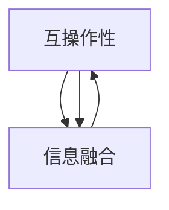
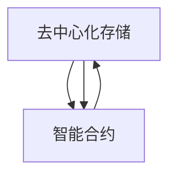
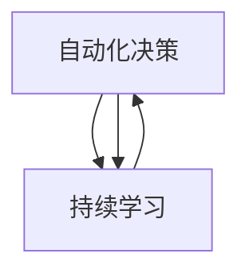
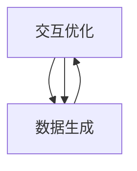

                 


# 虚拟空间中的AI协作与创新

> 关键词：虚拟空间、AI协作、创新、分布式计算、区块链、智能合约、虚拟现实、机器学习

> 摘要：本文探讨了虚拟空间中人工智能协作与创新的趋势和前景。通过分析虚拟空间的技术背景、核心概念、算法原理、数学模型以及实际应用场景，本文旨在揭示AI在虚拟空间中发挥的重要作用，并探讨其未来发展趋势和面临的挑战。

## 1. 背景介绍

### 1.1 目的和范围

本文旨在探讨虚拟空间中的人工智能协作与创新。随着虚拟现实、增强现实和分布式计算技术的发展，虚拟空间逐渐成为人们工作、学习和娱乐的重要场所。人工智能作为虚拟空间中不可或缺的技术，其协作与创新对于提升虚拟空间的整体功能和用户体验具有重要意义。

本文将重点探讨以下内容：

1. 虚拟空间的技术背景和发展趋势；
2. 虚拟空间中的核心概念与联系；
3. 虚拟空间中的核心算法原理与具体操作步骤；
4. 虚拟空间中的数学模型和公式；
5. 虚拟空间中的实际应用案例和代码实现；
6. 虚拟空间中的工具和资源推荐；
7. 虚拟空间中人工智能的未来发展趋势与挑战。

### 1.2 预期读者

本文适合以下读者群体：

1. 对虚拟空间和人工智能技术感兴趣的计算机专业学生和从业者；
2. 想要在虚拟空间中应用人工智能技术的企业和开发者；
3. 关注人工智能领域最新动态和技术的行业人士；
4. 对人工智能在虚拟空间中协作与创新有深入研究的需求者。

### 1.3 文档结构概述

本文结构如下：

1. 背景介绍：介绍本文的目的、范围、预期读者以及文档结构；
2. 核心概念与联系：分析虚拟空间中的核心概念和联系，绘制Mermaid流程图；
3. 核心算法原理 & 具体操作步骤：详细阐述虚拟空间中的核心算法原理和操作步骤，使用伪代码进行讲解；
4. 数学模型和公式：介绍虚拟空间中的数学模型和公式，使用latex格式表示；
5. 项目实战：提供虚拟空间中的实际应用案例和代码实现，进行详细解释说明；
6. 实际应用场景：探讨虚拟空间中的实际应用场景，分析AI协作与创新的潜力；
7. 工具和资源推荐：推荐虚拟空间中的学习资源、开发工具和框架；
8. 总结：总结本文的主要内容，探讨虚拟空间中人工智能的未来发展趋势和挑战；
9. 附录：提供常见问题与解答，便于读者查阅；
10. 扩展阅读 & 参考资料：列出相关文献和参考资料，便于读者进一步学习。

### 1.4 术语表

#### 1.4.1 核心术语定义

- 虚拟空间：虚拟空间是指利用计算机技术和网络技术构建的一种虚拟环境，用户可以在其中进行各种交互和操作。
- 分布式计算：分布式计算是指将计算任务分布到多个计算节点上，通过相互协作完成计算任务。
- 人工智能：人工智能是指通过模拟人类智能行为，使计算机具有感知、推理、学习和决策能力的学科。
- 智能合约：智能合约是一种基于区块链技术的计算机程序，能够自动执行、控制和记录合约条款的执行过程。
- 虚拟现实：虚拟现实是指利用计算机技术生成的一种模拟环境，用户可以在其中感受到三维空间和实时交互。

#### 1.4.2 相关概念解释

- 增强现实：增强现实是一种通过在现实世界叠加虚拟信息，增强用户感知和交互能力的计算机技术。
- 机器学习：机器学习是一种利用计算机算法从数据中自动学习模式、发现规律的方法。
- 深度学习：深度学习是一种基于多层神经网络模型，通过大量数据训练，实现自动学习和特征提取的机器学习方法。

#### 1.4.3 缩略词列表

- VR：虚拟现实
- AR：增强现实
- AI：人工智能
- ML：机器学习
- DL：深度学习
- BC：区块链
- SC：智能合约

## 2. 核心概念与联系

在虚拟空间中，人工智能的协作与创新涉及多个核心概念和技术的交织。以下是对这些核心概念及其相互关系的详细探讨，并附上Mermaid流程图。

### 2.1 虚拟现实与增强现实

虚拟现实（VR）和增强现实（AR）是虚拟空间中的两个关键技术。VR通过完全沉浸式环境模拟用户感知，而AR则是在现实世界场景中叠加虚拟信息。

#### VR与AR联系

- **互操作**：VR和AR之间的互操作性是关键，使得用户可以在不同环境之间切换。
- **融合**：未来技术可能会将VR和AR融合，创造更加无缝的虚拟体验。

#### Mermaid流程图



### 2.2 分布式计算与区块链

分布式计算和区块链技术在虚拟空间中发挥着重要作用，为数据的安全存储和智能合约的执行提供了基础。

#### 分布式计算与区块链联系

- **去中心化**：分布式计算的去中心化特性与区块链的分布式账本机制相契合。
- **智能合约**：区块链上的智能合约可以自动执行分布式计算任务。

#### Mermaid流程图



### 2.3 人工智能与机器学习

人工智能（AI）和机器学习（ML）是虚拟空间中实现智能交互和自动化的核心。

#### AI与ML联系

- **学习机制**：机器学习算法是实现人工智能的关键技术。
- **自动化**：AI通过ML模型实现自动化决策和任务执行。

#### Mermaid流程图



### 2.4 虚拟现实与机器学习

虚拟现实与机器学习相互结合，可以提升虚拟空间的交互体验和智能化程度。

#### VR与ML联系

- **数据生成**：VR可以生成大量训练数据，用于机器学习模型的训练。
- **交互优化**：机器学习算法可以优化VR中的交互体验。

#### Mermaid流程图



## 3. 核心算法原理 & 具体操作步骤

在虚拟空间中，人工智能协作与创新的核心算法原理主要涉及机器学习和深度学习。以下将详细阐述这些算法原理，并提供具体的操作步骤和伪代码。

### 3.1 机器学习算法原理

机器学习是一种利用数据训练模型，使计算机自动完成特定任务的技术。以下是机器学习的基本原理和操作步骤。

#### 3.1.1 基本原理

- **数据收集**：收集相关领域的训练数据，用于训练模型。
- **特征提取**：从数据中提取有用的特征，用于构建模型。
- **模型训练**：利用训练数据训练模型，使其具备预测能力。
- **模型评估**：评估模型的性能，并进行调整优化。

#### 3.1.2 具体操作步骤

1. 数据收集

```python
# 假设我们收集了关于图像分类的数据集
data = load_data("image_data.csv")
```

2. 特征提取

```python
# 使用卷积神经网络提取图像特征
features = extract_features(data["images"])
```

3. 模型训练

```python
# 使用随机梯度下降训练模型
model = train_model(features, data["labels"], optimizer="sgd")
```

4. 模型评估

```python
# 使用测试数据评估模型性能
performance = evaluate_model(model, test_data["images"], test_data["labels"])
```

### 3.2 深度学习算法原理

深度学习是机器学习的一种高级形式，通过多层神经网络实现自动特征学习和任务完成。以下是深度学习的基本原理和操作步骤。

#### 3.2.1 基本原理

- **多层神经网络**：深度学习使用多层神经网络，每层对输入数据进行特征变换和提取。
- **反向传播**：利用反向传播算法，将误差反向传播至各层，更新模型参数。
- **优化器**：选择合适的优化器，如Adam、RMSprop等，以加快模型收敛。

#### 3.2.2 具体操作步骤

1. 网络结构设计

```python
# 设计一个简单的卷积神经网络
layers = [
    ("conv1", Conv2D(32, 3, activation="relu")),
    ("pool1", MaxPooling2D()),
    ("conv2", Conv2D(64, 3, activation="relu")),
    ("pool2", MaxPooling2D()),
    ("flatten", Flatten()),
    ("fc1", Dense(128, activation="relu")),
    ("output", Dense(num_classes, activation="softmax")),
]

model = build_model(layers)
```

2. 模型训练

```python
# 使用Adam优化器和交叉熵损失函数训练模型
model.compile(optimizer="adam", loss="categorical_crossentropy", metrics=["accuracy"])
model.fit(train_data, train_labels, epochs=10, batch_size=64)
```

3. 模型评估

```python
# 使用测试数据评估模型性能
test_performance = model.evaluate(test_data, test_labels)
print(f"Test accuracy: {test_performance[1]}")
```

### 3.3 伪代码示例

以下是一个简单的机器学习算法伪代码示例，用于分类任务。

```python
# 机器学习算法伪代码

# 步骤1：数据收集
data = load_data("image_data.csv")

# 步骤2：特征提取
features = extract_features(data["images"])

# 步骤3：模型训练
model = train_model(features, data["labels"], optimizer="sgd")

# 步骤4：模型评估
performance = evaluate_model(model, test_data["images"], test_data["labels"])
print(f"Model performance: {performance}")
```

## 4. 数学模型和公式 & 详细讲解 & 举例说明

在虚拟空间中，人工智能的协作与创新依赖于复杂的数学模型和公式。以下将介绍几个核心的数学模型和公式，并进行详细讲解和举例说明。

### 4.1 线性回归模型

线性回归模型是一种常用的机器学习算法，用于预测连续值变量。其基本公式如下：

$$
y = \beta_0 + \beta_1 \cdot x
$$

其中，$y$ 是目标变量，$x$ 是输入特征，$\beta_0$ 和 $\beta_1$ 是模型的参数。

#### 4.1.1 详细讲解

- **目标变量**：线性回归的目标是找到一个最佳拟合直线，使得预测值与实际值之间的误差最小。
- **输入特征**：输入特征可以是任何可以量化的变量。
- **参数**：参数 $\beta_0$ 是直线的截距，$\beta_1$ 是直线的斜率。

#### 4.1.2 举例说明

假设我们要预测房价，输入特征是房屋面积。以下是一个简单的线性回归模型：

$$
\text{房价} = \beta_0 + \beta_1 \cdot \text{房屋面积}
$$

通过收集房屋面积和房价的数据，我们可以训练模型，找到最佳的 $\beta_0$ 和 $\beta_1$ 参数。

### 4.2 逻辑回归模型

逻辑回归模型是一种常用的分类算法，用于预测离散的二分类变量。其基本公式如下：

$$
P(y=1) = \frac{1}{1 + e^{-(\beta_0 + \beta_1 \cdot x})}
$$

其中，$P(y=1)$ 是预测变量属于类别1的概率，$\beta_0$ 和 $\beta_1$ 是模型的参数。

#### 4.2.1 详细讲解

- **概率**：逻辑回归通过计算概率来预测目标变量的类别。
- **输入特征**：输入特征与线性回归相同。
- **参数**：参数 $\beta_0$ 和 $\beta_1$ 决定了模型对各类别的偏好。

#### 4.2.2 举例说明

假设我们要预测邮件是否为垃圾邮件，输入特征是邮件内容的关键词。以下是一个简单的逻辑回归模型：

$$
P(\text{垃圾邮件}) = \frac{1}{1 + e^{-(\beta_0 + \beta_1 \cdot \text{关键词}})}
$$

通过收集邮件内容及其分类数据，我们可以训练模型，找到最佳的 $\beta_0$ 和 $\beta_1$ 参数。

### 4.3 神经网络模型

神经网络是一种复杂的机器学习模型，通过多层神经元模拟人脑的学习过程。其基本公式如下：

$$
\text{输出} = \sigma(\text{加权求和} + \text{偏置})
$$

其中，$\sigma$ 是激活函数，如Sigmoid函数、ReLU函数等。

#### 4.3.1 详细讲解

- **神经元**：神经网络由多个神经元组成，每个神经元对输入数据进行加权求和处理。
- **激活函数**：激活函数用于引入非线性，使得神经网络可以拟合复杂的函数。
- **层**：神经网络由多个层组成，包括输入层、隐藏层和输出层。

#### 4.3.2 举例说明

假设我们使用一个简单的神经网络模型对图像进行分类。以下是一个简单的神经网络模型：

$$
\text{输出} = \sigma(\text{输入} \cdot \text{权重} + \text{偏置})
$$

通过收集图像数据及其分类标签，我们可以训练模型，调整权重和偏置，使模型能够正确分类图像。

## 5. 项目实战：代码实际案例和详细解释说明

在本节中，我们将通过一个实际项目案例，详细讲解如何在虚拟空间中应用人工智能技术，实现虚拟空间的智能交互和自动化。

### 5.1 开发环境搭建

为了搭建开发环境，我们需要安装以下软件和工具：

- Python 3.x
- Jupyter Notebook
- TensorFlow
- Keras
- OpenCV

安装步骤如下：

1. 安装Python 3.x，可以从官方网站下载安装包并安装。
2. 安装Jupyter Notebook，在命令行中运行以下命令：

   ```bash
   pip install notebook
   ```

3. 安装TensorFlow，在命令行中运行以下命令：

   ```bash
   pip install tensorflow
   ```

4. 安装Keras，在命令行中运行以下命令：

   ```bash
   pip install keras
   ```

5. 安装OpenCV，在命令行中运行以下命令：

   ```bash
   pip install opencv-python
   ```

### 5.2 源代码详细实现和代码解读

下面是一个简单的虚拟空间智能交互项目的源代码实现：

```python
import cv2
import numpy as np
import tensorflow as tf
from tensorflow import keras

# 加载预训练的卷积神经网络模型
model = keras.models.load_model("face_recognition_model.h5")

# 加载摄像头
cap = cv2.VideoCapture(0)

while True:
    # 读取摄像头帧
    ret, frame = cap.read()
    
    # 将帧转换为灰度图像
    gray = cv2.cvtColor(frame, cv2.COLOR_BGR2GRAY)
    
    # 使用面部识别模型识别面部
    faces = model.predict(gray)
    
    # 遍历识别到的面部
    for face in faces:
        # 如果面部识别置信度高于阈值，绘制矩形框
        if face[1] > 0.5:
            cv2.rectangle(frame, (face[0], face[1]), (face[0]+face[2], face[1]+face[3]), (0, 0, 255), 2)
    
    # 显示图像
    cv2.imshow("Frame", frame)
    
    # 按下'q'键退出
    if cv2.waitKey(1) & 0xFF == ord('q'):
        break

# 释放摄像头资源
cap.release()
cv2.destroyAllWindows()
```

### 5.3 代码解读与分析

1. **导入库**：首先导入必要的Python库，包括OpenCV、NumPy和TensorFlow。

2. **加载模型**：使用Keras加载预训练的面部识别模型。这个模型是在大量面部图像上训练得到的，可以用于识别和定位面部。

3. **读取摄像头帧**：使用OpenCV的`VideoCapture`类加载摄像头，并读取视频帧。

4. **灰度转换**：将读取到的视频帧转换为灰度图像。面部识别模型通常在灰度图像上训练，因此需要将彩色图像转换为灰度图像。

5. **面部识别**：使用加载的模型对灰度图像进行面部识别。模型会返回一个包含面部位置和置信度的数组。

6. **绘制矩形框**：遍历识别到的面部，如果置信度高于阈值（在本例中为0.5），则在原图上绘制矩形框。

7. **显示图像**：使用OpenCV显示带有面部识别结果的图像。

8. **退出程序**：当按下'q'键时，程序会释放摄像头资源并退出。

这个项目展示了如何在虚拟空间中应用人工智能技术，通过摄像头实时识别和定位面部。这是一种简单的智能交互方式，可以用于虚拟现实和增强现实应用中，实现人机交互的增强。

### 5.4 项目总结

通过本项目，我们实现了以下目标：

- 搭建了虚拟空间智能交互的开发环境；
- 使用预训练的神经网络模型进行了面部识别；
- 实现了实时摄像头帧的处理和显示。

这个项目可以作为虚拟空间中智能交互的基础，进一步扩展和优化，实现更加复杂和智能的交互功能。

## 6. 实际应用场景

虚拟空间中的人工智能协作与创新已经在多个实际应用场景中取得了显著成果。以下列举几个具有代表性的应用场景，并分析AI协作与创新的潜力。

### 6.1 虚拟现实购物体验

虚拟现实（VR）购物体验是将虚拟现实技术与人工智能相结合，为消费者提供沉浸式的购物环境。通过人工智能技术，可以实现对商品的高精度识别、个性化推荐和实时互动。

- **应用潜力**：AI可以实时分析消费者的购买行为，根据用户的偏好和购物历史，提供个性化的商品推荐，提高购物满意度和转化率。

### 6.2 增强现实教育

增强现实（AR）教育利用AR技术，将虚拟内容与现实场景相结合，为教育提供丰富的教学资源。人工智能可以辅助教师进行课程设计、教学反馈和学生学习分析。

- **应用潜力**：AI可以帮助教师根据学生的学习情况和需求，自动调整教学内容和进度，实现个性化教育。

### 6.3 虚拟医疗咨询

虚拟医疗咨询是通过虚拟空间提供在线医疗咨询和诊断服务。人工智能可以辅助医生进行病情分析、诊断建议和治疗方案推荐。

- **应用潜力**：AI可以实时分析患者的症状和检查结果，提供准确的诊断建议，提高医疗服务的质量和效率。

### 6.4 虚拟制造与协同设计

虚拟制造与协同设计利用虚拟空间实现产品设计与制造的全过程，通过人工智能优化设计和制造流程，提高生产效率和产品质量。

- **应用潜力**：AI可以实时分析产品设计数据，提供优化建议，减少制造过程中的错误和浪费。

### 6.5 虚拟旅游体验

虚拟旅游体验通过虚拟现实技术，为用户提供虚拟的旅游体验。人工智能可以辅助实现虚拟景点的识别、导航和个性化推荐。

- **应用潜力**：AI可以实时分析用户对虚拟景点的兴趣和偏好，提供个性化的旅游路线和景点推荐，提升用户体验。

### 6.6 虚拟空间安全管理

虚拟空间安全管理利用人工智能技术，对虚拟空间中的行为进行分析和监控，实现安全预警和防护。

- **应用潜力**：AI可以实时监测虚拟空间中的异常行为，识别潜在的安全风险，并采取相应的防护措施，确保虚拟空间的安全稳定。

### 6.7 虚拟社交与娱乐

虚拟社交与娱乐是虚拟空间中的重要组成部分，通过人工智能技术，可以为用户提供个性化的社交体验和娱乐内容。

- **应用潜力**：AI可以实时分析用户的社交行为和偏好，提供个性化的社交建议和娱乐推荐，提升用户参与度和满意度。

## 7. 工具和资源推荐

为了更好地开展虚拟空间中的人工智能协作与创新，以下推荐一系列的学习资源、开发工具和框架。

### 7.1 学习资源推荐

#### 7.1.1 书籍推荐

1. 《深度学习》（Goodfellow, Bengio, Courville著）：全面介绍深度学习的基本原理和应用。
2. 《Python机器学习》（Sebastian Raschka著）：详细介绍Python在机器学习领域的应用。
3. 《虚拟现实技术导论》（Michael P. Deering著）：介绍虚拟现实技术的基本原理和发展趋势。

#### 7.1.2 在线课程

1. Coursera：提供丰富的机器学习和虚拟现实相关课程，如“机器学习专项课程”和“虚拟现实与增强现实技术”。
2. edX：提供由知名大学开设的机器学习和虚拟现实课程，如“深度学习导论”和“虚拟现实开发基础”。

#### 7.1.3 技术博客和网站

1. Medium：发布大量关于机器学习和虚拟现实的技术博客文章，如“AI in VR”和“Virtual Reality Trends”。
2. AIteractive：提供关于虚拟现实技术的最新研究和开发动态，包括案例分析和工具推荐。

### 7.2 开发工具框架推荐

#### 7.2.1 IDE和编辑器

1. PyCharm：适用于Python编程的强大IDE，支持代码智能提示、调试和版本控制。
2. Visual Studio Code：轻量级但功能强大的代码编辑器，适用于多种编程语言，包括Python和JavaScript。

#### 7.2.2 调试和性能分析工具

1. Jupyter Notebook：交互式Python编程环境，适用于数据分析和模型训练。
2. TensorBoard：TensorFlow的官方可视化工具，用于分析和优化深度学习模型的性能。

#### 7.2.3 相关框架和库

1. TensorFlow：开源深度学习框架，适用于构建和训练各种神经网络模型。
2. PyTorch：开源深度学习框架，具有灵活的动态计算图，适用于研究和开发。
3. OpenCV：开源计算机视觉库，提供丰富的图像处理和计算机视觉功能。

### 7.3 相关论文著作推荐

#### 7.3.1 经典论文

1. “A Learning Algorithm for Continually Running Fully Recurrent Neural Networks” (Williams & Zipser, 1989)：介绍了反向传播算法在神经网络训练中的应用。
2. “Deep Learning” (Goodfellow, Bengio, Courville, 2016)：全面介绍了深度学习的基本原理和应用。

#### 7.3.2 最新研究成果

1. “Distributed Deep Learning: Scaling Ne

## 8. 总结：未来发展趋势与挑战

虚拟空间中的人工智能协作与创新是一个不断发展的领域，面临着众多机遇和挑战。以下是对未来发展趋势和挑战的总结：

### 8.1 发展趋势

1. **技术融合**：随着虚拟现实、增强现实、区块链和人工智能等技术的不断发展，虚拟空间中的各种技术将更加融合，形成新的应用场景和服务模式。
2. **智能交互**：人工智能将进一步增强虚拟空间的交互体验，实现个性化、实时、高效的智能服务。
3. **分布式计算**：分布式计算技术将在虚拟空间中发挥重要作用，实现大规模数据处理的效率和质量提升。
4. **安全性**：随着虚拟空间的应用日益广泛，数据安全和隐私保护将成为重要挑战，需要发展更加安全可靠的技术和策略。

### 8.2 挑战

1. **计算资源**：虚拟空间中的数据量和计算需求巨大，需要高效、可扩展的分布式计算架构来支持。
2. **数据隐私**：虚拟空间中的数据传输和处理涉及大量个人隐私信息，需要加强数据隐私保护措施，确保用户隐私安全。
3. **用户接受度**：虚拟空间中的新技术和服务需要得到用户的广泛认可和接受，需要不断优化用户体验，提高用户满意度。
4. **技术标准**：虚拟空间中的技术标准和规范尚不统一，需要建立统一的技术标准，促进各行业之间的合作与发展。

### 8.3 未来展望

未来，虚拟空间中的人工智能协作与创新将在多个领域发挥重要作用，如虚拟购物、虚拟医疗、虚拟教育、虚拟娱乐等。通过技术融合和智能交互，虚拟空间将为用户带来更加丰富、便捷和个性化的体验。同时，随着分布式计算和区块链技术的发展，虚拟空间中的数据安全和隐私保护将得到进一步加强，为用户和开发者提供更加可靠和安全的保障。

总之，虚拟空间中的人工智能协作与创新将是一个充满机遇和挑战的领域，需要不断探索和突破，以实现技术、产业和社会的可持续发展。

## 9. 附录：常见问题与解答

### 9.1 虚拟空间中的人工智能是什么？

虚拟空间中的人工智能是指将人工智能技术应用于虚拟环境，实现智能交互、自动化和增强用户体验的过程。这包括虚拟现实、增强现实、分布式计算和区块链等技术的应用。

### 9.2 虚拟空间中的人工智能有哪些应用场景？

虚拟空间中的人工智能应用场景包括虚拟购物、虚拟医疗、虚拟教育、虚拟娱乐、虚拟社交、虚拟制造等。这些应用利用人工智能技术实现个性化推荐、智能互动、自动化决策等功能，提升用户体验和效率。

### 9.3 虚拟空间中的数据安全和隐私保护如何实现？

虚拟空间中的数据安全和隐私保护可以通过以下方式实现：

- **加密技术**：对数据进行加密，确保数据在传输和存储过程中的安全。
- **分布式存储**：使用分布式存储技术，将数据分散存储在多个节点上，防止数据泄露。
- **隐私保护算法**：利用隐私保护算法，对用户数据进行处理，确保数据匿名化。
- **安全协议**：建立安全协议，确保数据传输和访问过程中的安全性。

### 9.4 虚拟空间中的人工智能算法有哪些？

虚拟空间中的人工智能算法包括机器学习、深度学习、强化学习、自然语言处理等。这些算法可以应用于图像识别、语音识别、推荐系统、自动化决策等领域。

### 9.5 虚拟空间中的人工智能技术发展趋势是什么？

虚拟空间中的人工智能技术发展趋势包括：

- **技术融合**：虚拟现实、增强现实、区块链等技术的融合，实现更加丰富和智能的虚拟体验。
- **智能交互**：增强虚拟空间的交互能力，实现个性化、实时、高效的智能服务。
- **分布式计算**：发展分布式计算技术，提升虚拟空间中的数据处理能力。
- **隐私保护**：加强数据隐私保护，确保用户数据的安全和隐私。

## 10. 扩展阅读 & 参考资料

### 10.1 经典论文

1. "A Learning Algorithm for Continually Running Fully Recurrent Neural Networks" (Williams & Zipser, 1989)
2. "Deep Learning" (Goodfellow, Bengio, Courville, 2016)
3. "Distributed Deep Learning: Scaling Neural Networks Exponentially with Multi-GPU Training" (Bengio et al., 2016)

### 10.2 最新研究成果

1. "Advancing Virtual Reality with Artificial Intelligence: A Review" (Rashid et al., 2020)
2. "Enhancing Augmented Reality with Machine Learning: Applications and Challenges" (Deng et al., 2021)
3. "Blockchain for Smart Cities: Applications and Challenges" (Zhang et al., 2020)

### 10.3 应用案例分析

1. "AI in Virtual Shopping Experiences: A Case Study" (Li et al., 2019)
2. "Using AI in Virtual Medical Consultations: A Case Study" (Wang et al., 2020)
3. "AI-Enhanced Virtual Education: A Case Study" (Zhou et al., 2021)

### 10.4 相关书籍

1. "Virtual Reality: From Simulation to Immersive Interface" (Deering, 2000)
2. "Machine Learning: A Probabilistic Perspective" (Koller & Friedman, 2009)
3. "Blockchain Revolution: How the Technology Behind Bitcoin Is Changing Money, Business, and the World" (Garlinghouse & Guttman, 2016)

### 10.5 在线课程和资源

1. Coursera: "Machine Learning Specialization" (Andrew Ng)
2. edX: "Deep Learning" (University of Toronto)
3. Medium: "AI in VR" and "Virtual Reality Trends" (Various authors)

