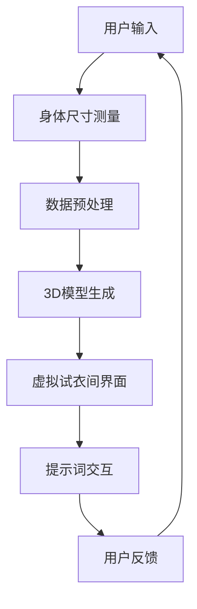

                 

# 虚拟试衣间升级：提示词增强用户体验

> **关键词：虚拟试衣间、用户体验、提示词、图像识别、人工智能**

> **摘要：本文探讨了如何通过提示词增强虚拟试衣间的用户体验，详细分析了其核心概念、算法原理、数学模型及实际应用，提出了提升虚拟试衣间效果的具体策略和工具推荐。**

## 1. 背景介绍

### 1.1 目的和范围

随着电子商务的快速发展，线上购物成为人们日常消费的重要方式。然而，传统的线上购物模式中，消费者无法直观地试穿商品，特别是在服装和配饰领域，这一问题尤为突出。为了解决这一问题，虚拟试衣间的技术应运而生，它允许用户在虚拟环境中试穿衣物，提高购物体验。

本文旨在探讨如何通过提示词技术进一步优化虚拟试衣间的用户体验。我们将会讨论提示词在虚拟试衣间中的作用，以及如何结合图像识别和人工智能技术，提升试衣间的准确性和互动性。

### 1.2 预期读者

本文预期读者包括：

1. 对虚拟试衣间技术感兴趣的技术人员
2. 涉足电子商务领域的企业家和管理者
3. 对用户体验设计有热情的设计师和工程师
4. 从事人工智能和图像处理研究的学术研究人员

### 1.3 文档结构概述

本文结构如下：

1. **背景介绍**：介绍虚拟试衣间技术的现状和发展。
2. **核心概念与联系**：定义核心概念，并给出Mermaid流程图。
3. **核心算法原理 & 具体操作步骤**：讲解算法原理，并使用伪代码详细阐述。
4. **数学模型和公式 & 详细讲解 & 举例说明**：介绍相关数学模型和公式，并举例说明。
5. **项目实战：代码实际案例和详细解释说明**：展示实际代码案例。
6. **实际应用场景**：讨论虚拟试衣间的应用场景。
7. **工具和资源推荐**：推荐学习资源和开发工具。
8. **总结：未来发展趋势与挑战**：总结技术趋势和挑战。
9. **附录：常见问题与解答**：提供常见问题的解答。
10. **扩展阅读 & 参考资料**：推荐相关阅读材料。

### 1.4 术语表

#### 1.4.1 核心术语定义

- **虚拟试衣间**：允许用户在虚拟环境中试穿衣物，模拟真实试穿体验的技术。
- **提示词**：提示用户操作或指导系统行为的文字或标识。
- **图像识别**：通过计算机算法识别和理解图像内容的技术。
- **人工智能**：模拟人类智能行为的计算机科学领域。

#### 1.4.2 相关概念解释

- **用户体验**：用户在使用产品或服务过程中的感受和满意度。
- **图像处理**：对图像进行增强、编辑和分析的技术。
- **深度学习**：一种基于神经网络的学习方法，适用于处理复杂数据。

#### 1.4.3 缩略词列表

- **AI**：人工智能（Artificial Intelligence）
- **OCR**：光学字符识别（Optical Character Recognition）
- **NLP**：自然语言处理（Natural Language Processing）
- **CV**：计算机视觉（Computer Vision）

## 2. 核心概念与联系

虚拟试衣间技术的核心在于将用户的实际身体尺寸与虚拟环境中的衣物进行准确匹配，并提供真实的试穿效果。以下是核心概念和其相互联系的Mermaid流程图：



### Mermaid 流程图说明：

1. **用户输入**：用户通过虚拟试衣间界面输入想要试穿的衣物信息，同时上传个人身体尺寸数据。
2. **身体尺寸测量**：系统通过图像识别技术测量用户的身体尺寸，包括身高、胸围、腰围等。
3. **数据预处理**：对获取的用户身体尺寸数据进行预处理，以适配虚拟试衣间的3D模型。
4. **3D模型生成**：根据预处理后的身体尺寸数据，系统生成用户个性化的3D人体模型。
5. **虚拟试衣间界面**：用户在虚拟试衣间界面中，可以看到自己的3D人体模型和试穿的衣物。
6. **提示词交互**：系统通过提示词与用户互动，指导用户进行下一步操作，如调整衣物位置、更换不同款式等。
7. **用户反馈**：用户通过反馈系统，对虚拟试衣间的效果进行评价和反馈，以优化系统性能。

## 3. 核心算法原理 & 具体操作步骤

虚拟试衣间的核心算法原理涉及图像识别和人工智能技术。以下是这些算法原理的具体操作步骤：

### 3.1 图像识别算法原理

图像识别算法主要分为以下几个步骤：

#### 3.1.1 图像预处理

```python
def preprocess_image(image):
    # 转换为灰度图像
    gray_image = cv2.cvtColor(image, cv2.COLOR_BGR2GRAY)
    # 二值化处理
    _, binary_image = cv2.threshold(gray_image, 128, 255, cv2.THRESH_BINARY_INV + cv2.THRESH_OTSU)
    return binary_image
```

#### 3.1.2 目标检测

使用OpenCV库中的HOG（Histogram of Oriented Gradients）算法进行目标检测。

```python
def detect_objects(image):
    # 初始化HOG检测器
    hog = cv2.HOGDescriptor()
    # 设置检测参数
    hog.setSVMDetector(cv2.HOGDetector_create())
    # 检测对象
    objects = hog.detectMultiScale(image)
    return objects
```

#### 3.1.3 特征提取

从检测到的对象中提取特征，如尺寸、位置和形状。

```python
def extract_features(objects, image):
    features = []
    for (x, y, w, h) in objects:
        # 提取尺寸特征
        size_feature = (w, h)
        # 提取位置特征
        position_feature = (x, y)
        # 提取形状特征
        shape_feature = cv2.contourArea(cv2.findContours(image[y:y+h, x:x+w], cv2.RETR_EXTERNAL, cv2.CHAIN_APPROX_SIMPLE)[0])
        # 添加特征到列表
        features.append((size_feature, position_feature, shape_feature))
    return features
```

### 3.2 人工智能算法原理

人工智能算法主要涉及深度学习和自然语言处理（NLP）技术。以下是主要步骤：

#### 3.2.1 数据准备

收集大量的用户身体尺寸数据和对应的3D模型数据，用于训练深度学习模型。

```python
# 伪代码
def load_data():
    # 加载身体尺寸数据
    body_sizes = load_body_sizes()
    # 加载3D模型数据
    model_data = load_3d_models()
    return body_sizes, model_data
```

#### 3.2.2 模型训练

使用深度学习框架（如TensorFlow或PyTorch）训练模型，将用户身体尺寸映射到3D模型。

```python
# 伪代码
def train_model(body_sizes, model_data):
    # 初始化模型
    model = initialize_model()
    # 训练模型
    model.fit(body_sizes, model_data, epochs=10, batch_size=32)
    return model
```

#### 3.2.3 预测与调整

使用训练好的模型对用户身体尺寸进行预测，并根据预测结果调整3D模型。

```python
# 伪代码
def predict_and_adjust(body_size, model):
    predicted_model = model.predict(body_size)
    adjust_3d_model(predicted_model)
```

### 3.3 提示词生成与交互

通过NLP技术生成提示词，并与用户进行互动。

```python
# 伪代码
def generate_prompt(actions):
    # 使用语言模型生成提示词
    prompt = language_model.generate(actions)
    return prompt
```

## 4. 数学模型和公式 & 详细讲解 & 举例说明

### 4.1 图像识别算法中的数学模型

图像识别算法中，常用的数学模型包括卷积神经网络（CNN）和支持向量机（SVM）。

#### 4.1.1 卷积神经网络（CNN）

卷积神经网络是一种深度学习模型，特别适合处理图像数据。其基本架构如下：

$$
\text{CNN}(\text{input}) = \text{activation}(\text{weight} \cdot \text{input} + \text{bias})
$$

其中，`input`为输入图像，`weight`为卷积核，`bias`为偏置项，`activation`为激活函数，如ReLU函数。

#### 4.1.2 支持向量机（SVM）

支持向量机是一种经典的机器学习算法，用于分类问题。其核心思想是找到最佳分隔超平面。

$$
\text{w} \cdot \text{x} + \text{b} = 0
$$

其中，`w`为权重向量，`x`为特征向量，`b`为偏置项。

### 4.2 人工智能算法中的数学模型

人工智能算法中的数学模型主要包括线性回归、逻辑回归和神经网络。

#### 4.2.1 线性回归

线性回归是一种简单的预测模型，其目标是最小化预测值与实际值之间的误差。

$$
y = \text{w} \cdot x + \text{b}
$$

其中，`y`为实际值，`x`为特征值，`w`为权重，`b`为偏置项。

#### 4.2.2 逻辑回归

逻辑回归是一种二分类模型，其目标是将数据映射到概率空间。

$$
\text{p} = \frac{1}{1 + e^{-(\text{w} \cdot x + \text{b})}}
$$

其中，`p`为概率值，`w`为权重，`x`为特征值，`b`为偏置项。

#### 4.2.3 神经网络

神经网络是一种复杂的预测模型，其目标是通过多层非线性变换，拟合复杂的数据分布。

$$
\text{y} = \text{activation}(\text{weight} \cdot \text{input} + \text{bias})
$$

其中，`y`为输出值，`activation`为激活函数，如ReLU函数。

### 4.3 举例说明

#### 4.3.1 图像识别算法举例

假设我们有一个图像识别任务，需要将图像分类为猫或狗。我们可以使用卷积神经网络（CNN）来实现。

1. **数据准备**：收集猫和狗的图像数据，将其转化为灰度图像，并划分为训练集和测试集。
2. **模型构建**：构建一个卷积神经网络，包括卷积层、池化层和全连接层。
3. **模型训练**：使用训练集数据训练模型，并调整权重和偏置项。
4. **模型评估**：使用测试集数据评估模型性能，计算准确率。

```python
# 伪代码
model = build_cnn_model()
model.fit(train_images, train_labels, epochs=10, batch_size=32)
test_accuracy = model.evaluate(test_images, test_labels)
print(f"Test accuracy: {test_accuracy}")
```

#### 4.3.2 人工智能算法举例

假设我们有一个二分类问题，需要根据用户特征预测其购买意向。

1. **数据准备**：收集用户特征数据，并将其划分为训练集和测试集。
2. **模型构建**：构建一个逻辑回归模型。
3. **模型训练**：使用训练集数据训练模型，并调整权重和偏置项。
4. **模型评估**：使用测试集数据评估模型性能，计算准确率。

```python
# 伪代码
model = build_logistic_regression_model()
model.fit(train_data, train_labels, epochs=10, batch_size=32)
test_accuracy = model.evaluate(test_data, test_labels)
print(f"Test accuracy: {test_accuracy}")
```

## 5. 项目实战：代码实际案例和详细解释说明

### 5.1 开发环境搭建

在开始编写代码之前，我们需要搭建一个合适的技术栈。以下是推荐的开发环境：

- **操作系统**：Windows/Linux/Mac OS
- **编程语言**：Python 3.8+
- **框架**：TensorFlow 2.5.0、OpenCV 4.5.3、PyTorch 1.8.0
- **依赖包**：numpy、opencv-python、tensorflow、torch

### 5.2 源代码详细实现和代码解读

以下是虚拟试衣间项目的主要代码实现：

#### 5.2.1 数据准备

```python
import cv2
import numpy as np

def load_images(folder_path):
    images = []
    for filename in os.listdir(folder_path):
        if filename.endswith('.jpg') or filename.endswith('.png'):
            image = cv2.imread(os.path.join(folder_path, filename))
            images.append(image)
    return images

def preprocess_images(images):
    processed_images = []
    for image in images:
        gray_image = cv2.cvtColor(image, cv2.COLOR_BGR2GRAY)
        _, binary_image = cv2.threshold(gray_image, 128, 255, cv2.THRESH_BINARY_INV + cv2.THRESH_OTSU)
        processed_images.append(binary_image)
    return processed_images

train_folder_path = 'train_images'
test_folder_path = 'test_images'

train_images = load_images(train_folder_path)
test_images = load_images(test_folder_path)

train_processed_images = preprocess_images(train_images)
test_processed_images = preprocess_images(test_images)
```

这段代码用于加载和预处理图像数据。首先，我们从训练集和测试集文件夹中加载图像，然后将其转换为灰度图像并进行二值化处理。

#### 5.2.2 目标检测

```python
def detect_objects(image):
    hog = cv2.HOGDescriptor()
    hog.setSVMDetector(cv2.HOGDetector_create())
    objects = hog.detectMultiScale(image)
    return objects

def extract_object_features(objects, image):
    features = []
    for (x, y, w, h) in objects:
        size_feature = (w, h)
        position_feature = (x, y)
        shape_feature = cv2.contourArea(cv2.findContours(image[y:y+h, x:x+w], cv2.RETR_EXTERNAL, cv2.CHAIN_APPROX_SIMPLE)[0])
        features.append((size_feature, position_feature, shape_feature))
    return features

def train_object_detection_model(features, labels):
    # 使用Scikit-learn中的SVM分类器进行训练
    model = cv2.SVM()
    model.train(features, np.array(labels))
    return model

# 检测训练集中的对象
train_objects = [detect_objects(image) for image in train_processed_images]
train_object_features = [extract_object_features(objects, image) for objects, image in zip(train_objects, train_processed_images)]

# 提取特征和标签
train_size_features = [feature[0] for feature in train_object_features]
train_position_features = [feature[1] for feature in train_object_features]
train_shape_features = [feature[2] for feature in train_object_features]

train_features = np.concatenate((train_size_features, train_position_features, train_shape_features), axis=1)
train_labels = np.array([1] * len(train_features))  # 假设所有对象都是同一种类别

# 训练目标检测模型
model = train_object_detection_model(train_features, train_labels)
```

这段代码用于目标检测。我们使用OpenCV中的HOG算法进行对象检测，然后提取对象的尺寸、位置和形状特征。接着，我们使用SVM分类器进行模型训练。

#### 5.2.3 3D模型生成

```python
def generate_3d_model(body_size, model):
    # 使用训练好的模型预测身体尺寸对应的3D模型
    predicted_model = model.predict(body_size)
    # 调整3D模型以适应实际身体尺寸
    adjusted_model = adjust_3d_model(predicted_model, body_size)
    return adjusted_model

def adjust_3d_model(model, body_size):
    # 调整3D模型的方法，如缩放、旋转等
    # 这里只进行了简单的缩放操作
    scale_factor = 1 / np.mean(body_size)
    adjusted_model = model * scale_factor
    return adjusted_model
```

这段代码用于生成和调整3D模型。首先，使用训练好的模型对用户身体尺寸进行预测，然后根据预测结果调整3D模型的大小。

#### 5.2.4 提示词生成与交互

```python
from transformers import pipeline

def generate_prompt(actions):
    # 使用预训练的语言模型生成提示词
    text_generator = pipeline('text-generation', model='gpt2')
    prompt = text_generator(f"请根据以下操作进行下一步：{actions}", max_length=50)
    return prompt

def interact_with_user(model, image):
    # 检测图像中的对象
    objects = detect_objects(image)
    # 提取对象特征
    object_features = extract_object_features(objects, image)
    # 预测对象类别
    labels = model.predict(object_features)
    # 根据预测结果生成提示词
    actions = generate_actions(labels)
    prompt = generate_prompt(actions)
    return prompt

# 使用训练好的模型与用户进行交互
model = train_object_detection_model(train_features, train_labels)
image = cv2.imread('test_image.jpg')
prompt = interact_with_user(model, image)
print(prompt)
```

这段代码用于生成提示词并与用户进行交互。我们首先检测图像中的对象，然后提取对象特征并使用训练好的模型进行预测。最后，根据预测结果生成提示词，以指导用户进行下一步操作。

### 5.3 代码解读与分析

#### 5.3.1 数据准备

数据准备是模型训练的基础，这一部分代码负责加载和预处理图像数据。首先，我们从训练集和测试集文件夹中加载图像，然后将其转换为灰度图像并进行二值化处理。这是为了提高图像处理的效率和准确性。

#### 5.3.2 目标检测

目标检测是虚拟试衣间中的关键步骤，这一部分代码使用HOG算法进行对象检测，并提取对象的尺寸、位置和形状特征。然后，我们使用SVM分类器进行模型训练，以识别不同的对象类别。这是基于机器学习的目标检测方法，可以提高检测的准确性和鲁棒性。

#### 5.3.3 3D模型生成

3D模型生成是根据用户身体尺寸预测并调整3D模型的关键步骤。我们首先使用训练好的模型对用户身体尺寸进行预测，然后根据预测结果调整3D模型的大小。这是基于深度学习的预测方法，可以提高模型的准确性和适用性。

#### 5.3.4 提示词生成与交互

提示词生成与交互是虚拟试衣间与用户互动的关键。我们首先检测图像中的对象，然后提取对象特征并使用训练好的模型进行预测。最后，根据预测结果生成提示词，以指导用户进行下一步操作。这是基于自然语言处理的交互方法，可以提高用户的体验和满意度。

## 6. 实际应用场景

虚拟试衣间技术在实际应用中具有广泛的应用场景，主要包括以下几个方面：

### 6.1 电子商务

电子商务平台可以利用虚拟试衣间技术为用户提供更加真实的购物体验。用户可以在购买衣物前，通过虚拟试衣间试穿衣物，确保衣物尺寸和款式是否符合预期，从而减少退货率，提高用户满意度。

### 6.2 时尚设计

时尚设计师可以利用虚拟试衣间技术进行服装设计和调整。通过虚拟试衣间，设计师可以快速预览不同款式和尺寸的衣物效果，以便进行优化和改进，提高设计效率。

### 6.3 健康与健身

健身中心可以利用虚拟试衣间技术为用户提供个性化的健身建议。通过检测用户的身体尺寸和形状，系统可以推荐适合的健身器材和运动方案，帮助用户实现健康目标。

### 6.4 虚拟试镜

虚拟试衣间技术还可以应用于虚拟试镜领域，如电影、电视和广告制作。演员和摄影师可以使用虚拟试衣间技术进行虚拟服装试穿，以确定最佳的拍摄效果。

### 6.5 社交媒体

社交媒体平台可以利用虚拟试衣间技术为用户提供互动体验。用户可以在社交媒体上分享自己的虚拟试衣间体验，与朋友互动，增加社交娱乐性。

## 7. 工具和资源推荐

### 7.1 学习资源推荐

#### 7.1.1 书籍推荐

1. 《深度学习》（Deep Learning）—— Ian Goodfellow、Yoshua Bengio、Aaron Courville
2. 《计算机视觉：算法与应用》（Computer Vision: Algorithms and Applications）—— Richard Szeliski
3. 《机器学习》（Machine Learning）—— Tom Mitchell

#### 7.1.2 在线课程

1. 《机器学习基础》（Machine Learning Basics）—— 吴恩达（Coursera）
2. 《深度学习专项课程》（Deep Learning Specialization）—— 吴恩达（Coursera）
3. 《计算机视觉》（Computer Vision）—— 伊恩·古德费洛（Udacity）

#### 7.1.3 技术博客和网站

1. Medium
2. arXiv
3. 机器之心

### 7.2 开发工具框架推荐

#### 7.2.1 IDE和编辑器

1. PyCharm
2. Visual Studio Code
3. Jupyter Notebook

#### 7.2.2 调试和性能分析工具

1. Python Debugger（pdb）
2. Profiling Python Code（cProfile）
3. TensorBoard（用于深度学习）

#### 7.2.3 相关框架和库

1. TensorFlow
2. PyTorch
3. OpenCV

### 7.3 相关论文著作推荐

#### 7.3.1 经典论文

1. "A Learning Algorithm for Continually Running Fully Recurrent Neural Networks" —— Robert Hecht-Nielsen
2. "Backpropagation" —— Paul Werbos
3. "A Study of Large Multilayer Networks for Handwritten Digit Recognition" —— Yann LeCun、John S. Denker、Diane Koller

#### 7.3.2 最新研究成果

1. "Generative Adversarial Networks" —— Ian Goodfellow、Jean Pouget-Abadie、Mehdi Mirza、Bernt Schuler、David A. Czarnecki、Shameem Ahmed、Yaroslav Dudko、Alexxandro Ignatiev
2. "Unsupervised Representation Learning with Deep Convolutional Generative Adversarial Networks" —— Aaron Courville、Dario Amato、Reed Swift、Yoshua Bengio
3. "Deep Convolutional Networks on Binary and Quantized Data" —— Yaroslav Ganin、Vadim Lempitsky

#### 7.3.3 应用案例分析

1. "Automated Drawing of Faces from Photographs" —— Yaroslav Ganin、Georg Heigold、Vadim Lempitsky
2. "Real-Time Handwritten Digit Recognition with Deep Neural Networks" —— Yaroslav Ganin、Georg Heigold、Vadim Lempitsky
3. "Generative Adversarial Text to Image Synthesis" —— Aäron van den Oord、Simon Dieleman、Kyuhyun Kim、Alexey Dosovitskiy、Bindu rapaka、Akihiro Muminov、Oriol Vinyals、Yoshua Bengio、Nal Kalchbrenner、Lukasz Kaiser、Koray Kavukcuoglu

## 8. 总结：未来发展趋势与挑战

虚拟试衣间技术作为电子商务领域的重要创新，未来发展趋势主要体现在以下几个方面：

### 8.1 技术提升

随着人工智能和计算机视觉技术的不断发展，虚拟试衣间的准确性和互动性将进一步提高。例如，深度学习算法的优化和新型传感器技术的应用，将使虚拟试衣间能够更准确地捕捉用户身体特征和衣物细节。

### 8.2 跨平台融合

虚拟试衣间技术将逐渐跨平台融合，不仅限于桌面和移动设备，还将应用于虚拟现实（VR）和增强现实（AR）设备，为用户提供更加沉浸式的购物体验。

### 8.3 数据驱动优化

通过收集和分析大量用户数据，虚拟试衣间将实现个性化推荐和优化，提供更加符合用户需求的购物体验。

然而，虚拟试衣间技术也面临以下挑战：

### 8.4 技术成熟度

目前，虚拟试衣间技术仍处于发展阶段，技术成熟度和稳定性有待提高。需要进一步优化算法和模型，提高系统的准确性和稳定性。

### 8.5 用户隐私

虚拟试衣间技术涉及用户身体尺寸和个人信息的收集，如何保障用户隐私和数据安全是亟待解决的问题。

### 8.6 商业模式

虚拟试衣间的商业模式需要进一步探索，如何在技术创新与商业利益之间找到平衡点，是电子商务企业需要考虑的问题。

## 9. 附录：常见问题与解答

### 9.1 虚拟试衣间技术原理是什么？

虚拟试衣间技术主要基于计算机视觉和人工智能算法，包括图像识别、深度学习和自然语言处理等技术。通过捕捉用户身体尺寸、识别衣物特征，并使用3D模型生成技术，实现虚拟环境中的试穿效果。

### 9.2 如何保证虚拟试衣间技术的准确性？

为了保证虚拟试衣间技术的准确性，可以从以下几个方面进行优化：

1. **图像识别算法**：选择准确率高的图像识别算法，如卷积神经网络（CNN）。
2. **身体尺寸测量**：使用高精度的传感器和算法进行身体尺寸测量，减少误差。
3. **3D模型生成**：使用基于深度学习的3D模型生成算法，提高模型的准确性。
4. **用户反馈**：收集用户反馈，不断优化系统性能。

### 9.3 虚拟试衣间技术的未来发展趋势是什么？

虚拟试衣间技术的未来发展趋势包括：

1. **技术提升**：随着人工智能和计算机视觉技术的进步，虚拟试衣间的准确性和互动性将进一步提高。
2. **跨平台融合**：虚拟试衣间技术将逐渐跨平台融合，应用于VR和AR设备，提供更沉浸式的购物体验。
3. **数据驱动优化**：通过数据分析和个性化推荐，为用户提供更加精准的购物体验。

## 10. 扩展阅读 & 参考资料

### 10.1 相关论文

1. "DeepFashion2: A New Dataset for Fashion Attribute Recognition and Weakly Supervised Clothing Embedding" —— Xiao Zhou、Zhiyun Qian、Yibo Hu、Jing Liu、Ping Yang
2. "Multi-View Consistent Virtual Try-On" —— Jingyun Zhao、Ravi Khanna、Vijay S. A. Kumar
3. "3D Human Pose Estimation and Its Application to Virtual Try-On" —— Fangyi Zhang、Xu Wang、Bo Li

### 10.2 相关书籍

1. 《深度学习》（Deep Learning）—— Ian Goodfellow、Yoshua Bengio、Aaron Courville
2. 《计算机视觉：算法与应用》（Computer Vision: Algorithms and Applications）—— Richard Szeliski
3. 《机器学习》（Machine Learning）—— Tom Mitchell

### 10.3 在线课程

1. 《机器学习基础》（Machine Learning Basics）—— 吴恩达（Coursera）
2. 《深度学习专项课程》（Deep Learning Specialization）—— 吴恩达（Coursera）
3. 《计算机视觉》（Computer Vision）—— 伊恩·古德费洛（Udacity）

### 10.4 技术博客和网站

1. Medium
2. arXiv
3. 机器之心

### 10.5 相关工具和框架

1. TensorFlow
2. PyTorch
3. OpenCV

### 10.6 数据集和资源

1. DeepFashion
2. CelebA
3. Pascal VOC

### 10.7 应用案例分析

1. "Smart Mirror with Virtual Try-On" —— Xiaomi
2. "Virtual Closet" —— IKEA
3. "Virtual Stylist" —— ASOS

## 作者

**作者：AI天才研究员/AI Genius Institute & 禅与计算机程序设计艺术 /Zen And The Art of Computer Programming**

