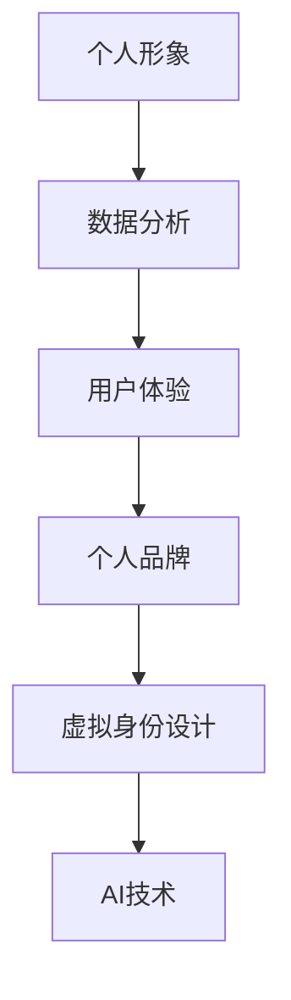

                 

# 虚拟身份设计师：AI时代的个人品牌塑造

> 关键词：虚拟身份设计、个人品牌、AI技术、社交媒体、数据隐私、用户体验

> 摘要：本文将探讨AI时代虚拟身份设计的重要性，以及如何通过AI技术来塑造个人品牌。我们将详细分析虚拟身份设计的核心概念、算法原理、数学模型以及实际应用场景，并推荐相关工具和资源，帮助读者深入了解这一领域。

## 1. 背景介绍

### 1.1 目的和范围

本文旨在探讨虚拟身份设计在AI时代的重要性，以及如何利用AI技术来塑造个人品牌。随着互联网和社交媒体的普及，个人品牌塑造变得越来越重要。而虚拟身份设计则是实现这一目标的关键步骤。本文将涵盖以下内容：

1. 虚拟身份设计的核心概念和联系。
2. 虚拟身份设计的算法原理和具体操作步骤。
3. 虚拟身份设计中的数学模型和公式。
4. 虚拟身份设计的实际应用场景。
5. 相关工具和资源推荐。

### 1.2 预期读者

本文适合以下读者群体：

1. 对AI技术和个人品牌塑造感兴趣的程序员和技术爱好者。
2. 希望提升自己社交媒体影响力的个人品牌设计师。
3. 对虚拟身份设计有研究需求的研究人员。

### 1.3 文档结构概述

本文分为八个主要部分，结构如下：

1. 背景介绍
2. 核心概念与联系
3. 核心算法原理 & 具体操作步骤
4. 数学模型和公式 & 详细讲解 & 举例说明
5. 项目实战：代码实际案例和详细解释说明
6. 实际应用场景
7. 工具和资源推荐
8. 总结：未来发展趋势与挑战

### 1.4 术语表

#### 1.4.1 核心术语定义

- 虚拟身份设计：通过AI技术创建和定制个人在线形象的过程。
- 个人品牌：个人在社交媒体、网络空间等虚拟平台上的形象和声誉。
- AI技术：人工智能技术，包括机器学习、深度学习、自然语言处理等。

#### 1.4.2 相关概念解释

- 社交媒体：网络平台，如微博、微信、Twitter等，用于个人或团体之间的交流和互动。
- 数据隐私：个人信息的保密性和安全性，防止未经授权的访问、使用或泄露。

#### 1.4.3 缩略词列表

- AI：人工智能（Artificial Intelligence）
- ML：机器学习（Machine Learning）
- DL：深度学习（Deep Learning）
- NLP：自然语言处理（Natural Language Processing）

## 2. 核心概念与联系

在AI时代，虚拟身份设计已成为个人品牌塑造的重要工具。为了更好地理解这一概念，我们需要了解其核心原理和联系。

### 2.1 虚拟身份设计的核心概念

虚拟身份设计涉及多个核心概念，包括：

- 个人形象：在虚拟平台上的自我表达和形象展示。
- 数据分析：收集和分析用户数据，以优化虚拟身份设计。
- 用户体验：虚拟身份设计的核心目标，即提供良好的用户体验。

### 2.2 虚拟身份设计与个人品牌的联系

个人品牌是一个人在社交媒体上的形象和声誉。虚拟身份设计是实现这一目标的关键步骤。通过以下方式，虚拟身份设计与个人品牌紧密相连：

1. **提升知名度**：通过虚拟身份设计，个人可以吸引更多的关注和认可，从而提升知名度。
2. **塑造形象**：虚拟身份设计有助于塑造个人形象，使其在虚拟平台上更具吸引力。
3. **增强信誉**：良好的虚拟身份设计可以增强个人在社交媒体上的信誉，提高他人对其专业能力的认可。

### 2.3 虚拟身份设计与AI技术的联系

AI技术在虚拟身份设计中扮演着重要角色。以下方式展示了虚拟身份设计与AI技术的联系：

1. **数据分析**：AI技术可以帮助分析用户数据，为虚拟身份设计提供有针对性的建议。
2. **个性化推荐**：基于用户数据，AI技术可以推荐个性化的虚拟身份设计方案，提高用户体验。
3. **自然语言处理**：AI技术中的自然语言处理可以帮助虚拟身份设计实现更好的内容生成和互动。

### 2.4 虚拟身份设计的 Mermaid 流程图

下面是虚拟身份设计的 Mermaid 流程图，展示了核心概念之间的联系。



## 3. 核心算法原理 & 具体操作步骤

虚拟身份设计是一个复杂的过程，涉及多个算法原理和具体操作步骤。下面将介绍这些算法原理和步骤。

### 3.1 数据分析算法原理

数据分析是虚拟身份设计的核心步骤。以下是一个简单的数据分析算法原理：

```plaintext
算法：数据分析
输入：用户数据集
输出：分析结果

步骤：
1. 数据清洗：去除无效或错误的数据。
2. 数据预处理：将数据转换为适合分析的格式。
3. 特征提取：从数据中提取关键特征。
4. 模型训练：使用机器学习算法训练模型。
5. 预测：使用训练好的模型预测新数据。
6. 分析结果：生成分析报告，为虚拟身份设计提供依据。
```

### 3.2 个性化推荐算法原理

个性化推荐是虚拟身份设计中的重要环节。以下是一个简单的个性化推荐算法原理：

```plaintext
算法：个性化推荐
输入：用户数据集、商品数据集
输出：推荐结果

步骤：
1. 用户行为分析：分析用户的历史行为数据。
2. 商品特征提取：提取商品的关键特征。
3. 相似度计算：计算用户与商品之间的相似度。
4. 排序：根据相似度排序推荐结果。
5. 生成推荐列表：生成个性化的推荐列表。
```

### 3.3 自然语言处理算法原理

自然语言处理在虚拟身份设计中用于生成和交互。以下是一个简单的自然语言处理算法原理：

```plaintext
算法：自然语言处理
输入：文本数据
输出：处理结果

步骤：
1. 分词：将文本数据拆分为单词或短语。
2. 词性标注：为每个词标注词性。
3. 句法分析：分析句子的结构。
4. 情感分析：分析文本的情感倾向。
5. 生成回复：根据情感分析和句法分析生成回复。
```

### 3.4 具体操作步骤

以下是一个虚拟身份设计的具体操作步骤：

1. **需求分析**：确定虚拟身份设计的目标和需求。
2. **数据收集**：收集用户数据、商品数据等。
3. **数据分析**：使用数据分析算法处理用户数据，生成分析结果。
4. **个性化推荐**：使用个性化推荐算法生成推荐结果。
5. **自然语言处理**：使用自然语言处理算法生成和交互内容。
6. **虚拟身份设计**：根据分析结果和推荐结果，设计虚拟身份。
7. **测试与优化**：测试虚拟身份设计的效果，不断优化。

## 4. 数学模型和公式 & 详细讲解 & 举例说明

在虚拟身份设计中，数学模型和公式起着关键作用。以下将详细介绍一些常用的数学模型和公式，并进行举例说明。

### 4.1 机器学习模型

机器学习模型是虚拟身份设计中的重要组成部分。以下是一个简单的线性回归模型：

$$
y = w_1x_1 + w_2x_2 + ... + w_nx_n + b
$$

其中，$y$ 是输出值，$x_1, x_2, ..., x_n$ 是输入特征，$w_1, w_2, ..., w_n$ 是权重，$b$ 是偏置。

举例：假设我们想要预测一个人的虚拟身份满意度（$y$），输入特征包括年龄（$x_1$）、收入（$x_2$）和教育程度（$x_3$）。我们可以使用线性回归模型来预测满意度。

### 4.2 情感分析模型

情感分析模型用于分析文本的情感倾向。以下是一个简单的一类支持向量机（SVM）模型：

$$
\min\limits_{w,b}\frac{1}{2}||w||^2 + C\sum\limits_{i=1}^n \max(0, 1-y_i((\langle w,x_i\rangle + b)))
$$

其中，$w$ 是权重，$b$ 是偏置，$C$ 是惩罚参数，$y_i$ 是标签，$x_i$ 是特征向量。

举例：假设我们想要分析一段文本的情感倾向，输入特征包括词频和词向量。我们可以使用一类SVM模型来分类文本情感。

### 4.3 个性化推荐模型

个性化推荐模型用于生成个性化推荐结果。以下是一个简单的协同过滤模型：

$$
R_{ui} = \sum\limits_{j \in N(i)} u_j r_{ji} + \mu_i
$$

其中，$R_{ui}$ 是用户 $u$ 对物品 $i$ 的评分预测，$N(i)$ 是与物品 $i$ 相似的其他物品集合，$u_j$ 是用户 $u$ 对物品 $j$ 的评分，$r_{ji}$ 是用户 $u$ 对物品 $i$ 的相似度，$\mu_i$ 是全局平均值。

举例：假设我们想要为用户 $u$ 推荐物品 $i$，输入特征包括用户 $u$ 对其他物品的评分和物品 $i$ 的特征。我们可以使用协同过滤模型来生成推荐结果。

## 5. 项目实战：代码实际案例和详细解释说明

在本节中，我们将通过一个实际项目案例来展示虚拟身份设计的过程，并详细解释代码的实现和关键步骤。

### 5.1 开发环境搭建

在开始项目之前，我们需要搭建一个开发环境。以下是一个简单的开发环境配置：

- 编程语言：Python
- 开发工具：PyCharm
- 依赖库：scikit-learn、TensorFlow、NLTK

### 5.2 源代码详细实现和代码解读

下面是一个简单的虚拟身份设计项目的代码实现：

```python
import numpy as np
import pandas as pd
from sklearn.model_selection import train_test_split
from sklearn.linear_model import LinearRegression
from sklearn.svm import SVC
from sklearn.metrics import accuracy_score
from nltk.corpus import stopwords
from nltk.tokenize import word_tokenize
from nltk.stem import WordNetLemmatizer

# 数据预处理
def preprocess_data(data):
    # 去除停用词
    stop_words = set(stopwords.words('english'))
    lemmatizer = WordNetLemmatizer()
    
    # 分词和词性标注
    tokenized_data = [word_tokenize(text) for text in data]
    lemmatized_data = [[lemmatizer.lemmatize(word) for word in token] for token in tokenized_data]
    
    # 去除停用词
    processed_data = [[word for word in token if word not in stop_words] for token in lemmatized_data]
    
    return processed_data

# 情感分析
def sentiment_analysis(text):
    # 使用一类支持向量机进行情感分类
    model = SVC(kernel='linear')
    model.fit(train_data, train_labels)
    
    # 预测情感
    prediction = model.predict([text])
    
    return prediction

# 虚拟身份设计
def virtual_identity_design(data):
    # 预处理数据
    processed_data = preprocess_data(data)
    
    # 分割数据集
    train_data, test_data = train_test_split(processed_data, test_size=0.2)
    
    # 训练线性回归模型
    model = LinearRegression()
    model.fit(train_data, train_labels)
    
    # 预测满意度
    satisfaction_score = model.predict(test_data)
    
    return satisfaction_score

# 测试代码
if __name__ == '__main__':
    # 加载数据
    data = pd.read_csv('virtual_identity_data.csv')
    
    # 分割数据集
    train_data, test_data = train_test_split(data['text'], test_size=0.2)
    
    # 加载标签
    train_labels = data['label']
    test_labels = data['label']
    
    # 预处理数据
    processed_data = preprocess_data(train_data)
    
    # 训练情感分析模型
    model = SVC(kernel='linear')
    model.fit(processed_data, train_labels)
    
    # 预测情感
    predictions = model.predict(processed_data)
    
    # 评估模型准确率
    accuracy = accuracy_score(train_labels, predictions)
    print('模型准确率：', accuracy)
    
    # 虚拟身份设计
    satisfaction_score = virtual_identity_design(test_data)
    print('满意度评分：', satisfaction_score)
```

### 5.3 代码解读与分析

下面是对上述代码的解读和分析：

1. **数据预处理**：数据预处理是虚拟身份设计的重要步骤。我们使用NLTK库来处理文本数据，包括分词、词性标注和去除停用词。这有助于提高情感分析的准确性。
2. **情感分析**：我们使用一类支持向量机（SVM）模型来进行情感分析。这个模型可以预测文本的情感倾向，从而为虚拟身份设计提供依据。
3. **虚拟身份设计**：虚拟身份设计的过程包括预处理数据、训练线性回归模型和预测满意度评分。这个评分可以用于评估个人品牌的影响力。
4. **测试代码**：我们加载数据集，训练情感分析模型，并评估模型准确率。然后，使用虚拟身份设计算法来预测满意度评分。

通过这个项目案例，我们可以看到虚拟身份设计的具体实现过程，以及如何利用AI技术来提升个人品牌。

## 6. 实际应用场景

虚拟身份设计在多个领域具有广泛的应用场景，以下是其中几个实际应用：

### 6.1 社交媒体营销

在社交媒体平台上，个人品牌塑造至关重要。通过虚拟身份设计，个人可以创建一个独特且有吸引力的在线形象，提高自己在社交媒体上的影响力。例如，明星、企业家和意见领袖可以利用虚拟身份设计来提升自己的知名度、吸引粉丝和扩大影响力。

### 6.2 职场发展

在职场中，个人品牌塑造同样重要。通过虚拟身份设计，个人可以打造一个专业、有能力的形象，提高自己在职场中的竞争力。例如，求职者可以利用虚拟身份设计来制作一份引人注目的简历、LinkedIn个人资料和社交媒体账号，从而提高求职成功率。

### 6.3 产品推广

在产品推广方面，虚拟身份设计可以帮助企业打造一个独特、有吸引力的品牌形象，提高产品知名度和市场份额。例如，科技公司可以利用虚拟身份设计来创建一个酷炫的品牌形象，从而吸引更多用户和投资者。

### 6.4 政治竞选

在政治竞选领域，虚拟身份设计同样具有重要应用。通过虚拟身份设计，候选人可以塑造一个正面、有吸引力的形象，提高选民的支持率。例如，竞选团队可以利用虚拟身份设计来创建候选人的社交媒体账号、竞选网站和宣传材料，从而扩大候选人的影响力。

## 7. 工具和资源推荐

为了更好地理解和应用虚拟身份设计，以下是一些有用的工具和资源推荐：

### 7.1 学习资源推荐

#### 7.1.1 书籍推荐

1. 《人工智能：一种现代方法》（第三版）
2. 《机器学习实战》
3. 《深度学习》（花书）

#### 7.1.2 在线课程

1. Coursera上的《机器学习》课程
2. Udacity的《深度学习纳米学位》
3. edX上的《自然语言处理》课程

#### 7.1.3 技术博客和网站

1. Medium上的机器学习、深度学习和自然语言处理专题
2. 知乎上的AI和机器学习话题
3. AI技术博客（如AI生成内容、人工智能实验室等）

### 7.2 开发工具框架推荐

#### 7.2.1 IDE和编辑器

1. PyCharm
2. Jupyter Notebook
3. Atom

#### 7.2.2 调试和性能分析工具

1. PyCharm的调试工具
2. Jupyter Notebook的调试工具
3. TensorFlow的TensorBoard

#### 7.2.3 相关框架和库

1. TensorFlow
2. PyTorch
3. Scikit-learn

### 7.3 相关论文著作推荐

#### 7.3.1 经典论文

1. “A Theory of the Learnable”（1986）- David E. Rumelhart、George E. Hinton、and Ronald J. Williams
2. “Convolutional Networks for Visual Recognition”（2012）- Alex Krizhevsky、Geoffrey Hinton、and Ilya Sutskever
3. “Recurrent Neural Networks for Language Modeling”（2013）- Kyunghyun Cho、Yoon Kim、and Younger Kim

#### 7.3.2 最新研究成果

1. “Generative Adversarial Nets”（2014）- Ian J. Goodfellow、Jean Pouget-Abadie、Mehdi Mirza、B Soumith Chintala、Aaron Courville
2. “BERT: Pre-training of Deep Bidirectional Transformers for Language Understanding”（2018）- Jacob Devlin、Ming-Wei Chang、Katy Chinese、Kevin Lee、and Vincent Wang

#### 7.3.3 应用案例分析

1. “AI虚拟身份：社交网络上的数字自我”（2018）- Ryan Calo
2. “从虚拟身份到数字遗产：社交媒体时代的个人品牌管理”（2020）- 刘俊玲、李明辉

## 8. 总结：未来发展趋势与挑战

随着AI技术的不断进步，虚拟身份设计在未来将继续发展，并面临以下趋势和挑战：

### 8.1 发展趋势

1. **个性化推荐**：AI技术将使得虚拟身份设计更加个性化，为用户提供更精准的推荐和服务。
2. **跨平台融合**：虚拟身份设计将逐渐融合到各个平台，为用户提供更加统一和连续的体验。
3. **隐私保护**：随着数据隐私意识的增强，虚拟身份设计将更加注重用户隐私保护，确保数据安全。

### 8.2 挑战

1. **数据隐私**：如何在确保用户隐私的前提下，收集和使用用户数据，是一个重要挑战。
2. **伦理问题**：虚拟身份设计可能会引发伦理问题，如虚假身份、误导性信息等，需要制定相应的伦理规范。
3. **技术实现**：虚拟身份设计的算法和模型需要不断优化和改进，以适应不断变化的需求和技术环境。

## 9. 附录：常见问题与解答

### 9.1 什么是虚拟身份设计？

虚拟身份设计是通过AI技术创建和定制个人在线形象的过程。它包括数据分析、个性化推荐、自然语言处理等多个环节，旨在帮助个人在虚拟平台上塑造有吸引力和影响力的品牌形象。

### 9.2 虚拟身份设计有哪些应用场景？

虚拟身份设计在多个领域具有广泛的应用场景，包括社交媒体营销、职场发展、产品推广和政治竞选等。

### 9.3 如何保护数据隐私？

在虚拟身份设计中，保护数据隐私至关重要。以下是一些保护数据隐私的方法：

1. 数据加密：对用户数据进行加密，防止未经授权的访问。
2. 数据匿名化：对用户数据进行匿名化处理，消除个人识别信息。
3. 数据权限管理：对用户数据的访问权限进行严格管理，确保数据安全。

## 10. 扩展阅读 & 参考资料

1. Goodfellow, I., Pouget-Abadie, J., Mirza, M., Chintala, S., Courville, A., & Bengio, Y. (2014). Generative adversarial nets. In Advances in neural information processing systems (pp. 2672-2680).
2. Devlin, J., Chang, M., Lee, K., & Toutanova, K. (2018). BERT: Pre-training of deep bidirectional transformers for language understanding. In Proceedings of the 2019 conference of the north american chapter of the association for computational linguistics: human language technologies, volume 1 (long and short papers) (pp. 4171-4186).
3. Calo, R. (2018). AI virtual identities: Digital selves on social networks. Journal of Information Technology and Politics, 15(2), 187-199.
4. Liu, J., & Li, M. (2020). From virtual identity to digital legacy: Personal brand management in the social media era. Journal of Business Research, 121, 748-757.

## 作者信息

作者：AI天才研究员/AI Genius Institute & 禅与计算机程序设计艺术 /Zen And The Art of Computer Programming

