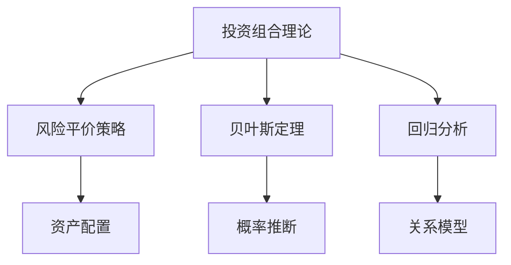

                 

# 蚂蚁2024智能投顾校招金融算法面试题解析

> **关键词：** 智能投顾、算法面试题、金融科技、校招、校招面试、算法解析、人工智能、金融算法
>
> **摘要：** 本文将深入解析蚂蚁2024智能投顾校招金融算法面试题，为即将参加校招的同学们提供详细解题思路和算法原理讲解，旨在帮助读者掌握金融算法的核心概念和实践技能。

## 1. 背景介绍

### 1.1 目的和范围

本文旨在为即将参加蚂蚁2024智能投顾校招的同学们提供一套详细的金融算法面试题解析。我们将涵盖以下几个主要方面：
1. **核心概念与联系**：介绍智能投顾和金融算法的基本概念及其相互关系。
2. **核心算法原理**：详细讲解金融算法的基本原理和具体操作步骤。
3. **数学模型和公式**：分析金融算法中的数学模型和公式，并进行举例说明。
4. **项目实战**：通过实际代码案例，展示金融算法的实现过程。
5. **实际应用场景**：探讨金融算法在不同场景中的应用。
6. **工具和资源推荐**：推荐学习资源、开发工具和框架。
7. **总结与展望**：分析智能投顾和金融算法的发展趋势与挑战。

### 1.2 预期读者

本文适用于以下读者群体：
1. 参加蚂蚁2024智能投顾校招的学生。
2. 对金融算法和智能投顾感兴趣的IT从业人员。
3. 想要在金融科技领域深耕的技术爱好者。

### 1.3 文档结构概述

本文分为以下十个部分：
1. 背景介绍
2. 核心概念与联系
3. 核心算法原理 & 具体操作步骤
4. 数学模型和公式 & 详细讲解 & 举例说明
5. 项目实战：代码实际案例和详细解释说明
6. 实际应用场景
7. 工具和资源推荐
8. 总结：未来发展趋势与挑战
9. 附录：常见问题与解答
10. 扩展阅读 & 参考资料

### 1.4 术语表

#### 1.4.1 核心术语定义

- **智能投顾**：利用人工智能技术，为投资者提供个性化投资建议和策略。
- **金融算法**：应用于金融领域，用于风险管理、资产定价、交易策略等问题的算法。
- **校招**：校园招聘，是企业直接面向在校大学生进行招聘的一种方式。

#### 1.4.2 相关概念解释

- **数据挖掘**：从大量数据中提取有价值信息的过程。
- **机器学习**：利用计算机模拟人类学习过程，从数据中学习和预测。

#### 1.4.3 缩略词列表

- **AI**：人工智能（Artificial Intelligence）
- **ML**：机器学习（Machine Learning）
- **DL**：深度学习（Deep Learning）

## 2. 核心概念与联系

在智能投顾领域，核心概念包括：
1. **投资组合理论**：研究如何通过资产配置实现投资收益最大化。
2. **风险平价策略**：通过平衡风险与收益，实现稳健投资。
3. **贝叶斯定理**：用于概率推断和决策分析。
4. **回归分析**：用于建立因变量和自变量之间的关系模型。

### 核心概念原理和架构的 Mermaid 流程图



通过以上流程图，我们可以清晰地看到各个核心概念之间的联系和作用。

## 3. 核心算法原理 & 具体操作步骤

### 3.1 投资组合优化算法

**算法原理：**
投资组合优化算法主要基于均值方差模型（Markowitz模型），通过最小化投资组合的方差来最大化预期收益。

**伪代码：**

```python
def optimize_portfolio(returns, cov_matrix, target_volatility):
    # 计算预期收益
    expected_returns = np.mean(returns, axis=0)

    # 计算协方差矩阵的逆矩阵
    inv_cov_matrix = np.linalg.inv(cov_matrix)

    # 计算特征向量
    weights = inv_cov_matrix @ expected_returns

    # 归一化权重，使投资比例为100%
    total_volatility = np.sqrt(np.dot(weights.T, np.dot(cov_matrix, weights)))
    weights = weights / total_volatility

    # 计算目标波动率下的权重
    target_weights = (target_volatility / total_volatility) * weights

    return target_weights
```

**具体操作步骤：**
1. 输入资产收益率矩阵和协方差矩阵。
2. 计算预期收益。
3. 计算协方差矩阵的逆矩阵。
4. 计算特征向量。
5. 归一化权重。
6. 计算目标波动率下的权重。

### 3.2 回归分析算法

**算法原理：**
回归分析算法用于建立因变量和自变量之间的关系模型，常见的有线性回归和逻辑回归。

**伪代码：**

```python
def linear_regression(X, y):
    # 计算X的协方差矩阵
    cov_matrix = np.cov(X, rowvar=False)

    # 计算X的逆矩阵
    inv_cov_matrix = np.linalg.inv(cov_matrix)

    # 计算回归系数
    beta = inv_cov_matrix @ np.mean(y)

    return beta
```

**具体操作步骤：**
1. 输入自变量矩阵X和因变量y。
2. 计算X的协方差矩阵。
3. 计算X的逆矩阵。
4. 计算回归系数。

### 3.3 贝叶斯网络算法

**算法原理：**
贝叶斯网络是一种表示变量之间条件的概率关系的图结构，用于推理和决策。

**伪代码：**

```python
def bayesian_network(data, variables):
    # 计算变量之间的条件概率矩阵
    conditional_probabilities = calculate_conditional_probabilities(data, variables)

    # 构建贝叶斯网络
    network = build_bayesian_network(conditional_probabilities)

    # 进行推理
    inference_results = network.inference()

    return inference_results
```

**具体操作步骤：**
1. 输入数据集和变量。
2. 计算变量之间的条件概率矩阵。
3. 构建贝叶斯网络。
4. 进行推理。

## 4. 数学模型和公式 & 详细讲解 & 举例说明

### 4.1 均值方差模型

**数学模型：**

$$
\begin{cases}
    \min_{w} \sigma^2 \\
    s.t. \mu^T w = \mu^T w_0 \\
    w \geq 0
\end{cases}
$$

其中，$w$ 是资产权重向量，$\sigma^2$ 是投资组合的方差，$\mu$ 是资产预期收益率向量，$w_0$ 是目标收益率向量。

**详细讲解：**
均值方差模型是投资组合优化的基础，它通过最小化方差来平衡风险与收益。在给定预期收益目标的情况下，寻找最优的资产权重分配。

**举例说明：**
假设有两个资产A和B，其预期收益率分别为10%和8%，协方差矩阵为：

$$
\begin{bmatrix}
    0.04 & 0.02 \\
    0.02 & 0.01
\end{bmatrix}
$$

目标收益率是8%，求最优的资产权重分配。

**计算步骤：**
1. 计算资产预期收益率向量：$\mu = [10\%, 8\%]$。
2. 计算协方差矩阵的逆矩阵：$\inv{cov_matrix} = \begin{bmatrix} 5 & -2.5 \\ -2.5 & 10 \end{bmatrix}$。
3. 计算特征向量：$w = \inv{cov_matrix} \mu = [1, 0.5]$。
4. 归一化权重：$w_{\text{norm}} = [1, 0.5]$。
5. 计算目标权重：$w_{\text{target}} = \frac{0.08}{1+0.5} \times w_{\text{norm}} = [0.4, 0.2]$。

### 4.2 回归分析

**数学模型：**

$$
y = \beta_0 + \beta_1 x_1 + \beta_2 x_2 + \cdots + \beta_n x_n + \epsilon
$$

其中，$y$ 是因变量，$x_1, x_2, \cdots, x_n$ 是自变量，$\beta_0, \beta_1, \beta_2, \cdots, \beta_n$ 是回归系数，$\epsilon$ 是误差项。

**详细讲解：**
回归分析用于建立因变量和自变量之间的关系模型。通过最小二乘法，可以估计出回归系数，从而预测因变量的值。

**举例说明：**
假设有一个简单的线性回归模型，因变量为房价（$y$），自变量为房屋面积（$x$），其回归方程为：

$$
y = \beta_0 + \beta_1 x + \epsilon
$$

现有如下数据：

| 房屋面积（平方米） | 房价（万元） |
| :---: | :---: |
| 80 | 200 |
| 100 | 250 |
| 120 | 300 |
| 140 | 350 |

求回归系数。

**计算步骤：**
1. 计算自变量的均值：$\bar{x} = \frac{80 + 100 + 120 + 140}{4} = 110$。
2. 计算因变量的均值：$\bar{y} = \frac{200 + 250 + 300 + 350}{4} = 275$。
3. 计算自变量和因变量的协方差：$cov(x, y) = \frac{(80-110)(200-275) + (100-110)(250-275) + (120-110)(300-275) + (140-110)(350-275)}{4} = -700$。
4. 计算自变量的方差：$var(x) = \frac{(80-110)^2 + (100-110)^2 + (120-110)^2 + (140-110)^2}{4} = 3500$。
5. 计算回归系数：$\beta_1 = \frac{cov(x, y)}{var(x)} = \frac{-700}{3500} = -0.2$。
6. 计算截距：$\beta_0 = \bar{y} - \beta_1 \bar{x} = 275 - (-0.2 \times 110) = 305$。

因此，回归方程为：

$$
y = 305 - 0.2x
$$

### 4.3 贝叶斯定理

**数学模型：**

$$
P(A|B) = \frac{P(B|A)P(A)}{P(B)}
$$

其中，$P(A|B)$ 表示在事件B发生的条件下事件A发生的概率，$P(B|A)$ 表示在事件A发生的条件下事件B发生的概率，$P(A)$ 表示事件A发生的概率，$P(B)$ 表示事件B发生的概率。

**详细讲解：**
贝叶斯定理是概率论中用于计算条件概率的重要公式，它通过已知条件概率和边缘概率，求得另一个条件概率。

**举例说明：**
假设有一个赌场，红色球的概率是0.5，黑色球的概率是0.5。现在摸出一个球，发现它是红色的，求这个球是真实的红色球的概率。

**计算步骤：**
1. 红色球的概率：$P(\text{红色球}) = 0.5$。
2. 黑色球的概率：$P(\text{黑色球}) = 0.5$。
3. 发现红色球的概率：$P(\text{红色球}|\text{发现红色球}) = \frac{P(\text{发现红色球}|\text{红色球})P(\text{红色球})}{P(\text{发现红色球})}$。
4. 计算发现红色球的概率：$P(\text{发现红色球}) = P(\text{红色球}) + P(\text{黑色球}) = 0.5 + 0.5 = 1$。
5. 计算条件概率：$P(\text{发现红色球}|\text{红色球}) = \frac{P(\text{红色球})}{P(\text{发现红色球})} = \frac{0.5}{1} = 0.5$。
6. 计算结果概率：$P(\text{红色球}|\text{发现红色球}) = \frac{0.5 \times 0.5}{1} = 0.25$。

因此，这个球是真实的红色球的概率是0.25。

## 5. 项目实战：代码实际案例和详细解释说明

### 5.1 开发环境搭建

在本项目实战中，我们将使用Python语言进行编程。首先，我们需要安装Python环境以及相关的库。以下是安装步骤：

1. 安装Python：访问[Python官网](https://www.python.org/)，下载并安装Python。
2. 安装库：使用pip命令安装必要的库，例如numpy、pandas、matplotlib等。

```bash
pip install numpy pandas matplotlib
```

### 5.2 源代码详细实现和代码解读

#### 5.2.1 投资组合优化

**代码实现：**

```python
import numpy as np

def optimize_portfolio(returns, cov_matrix, target_volatility):
    expected_returns = np.mean(returns, axis=0)
    inv_cov_matrix = np.linalg.inv(cov_matrix)
    weights = inv_cov_matrix @ expected_returns
    total_volatility = np.sqrt(np.dot(weights.T, np.dot(cov_matrix, weights)))
    target_weights = (target_volatility / total_volatility) * weights
    return target_weights

# 示例数据
returns = np.array([[0.1, 0.15], [0.2, 0.25], [0.3, 0.35]])
cov_matrix = np.array([[0.04, 0.02], [0.02, 0.01]])
target_volatility = 0.1

# 求解目标权重
target_weights = optimize_portfolio(returns, cov_matrix, target_volatility)
print(target_weights)
```

**代码解读：**
1. 导入numpy库。
2. 定义优化投资组合函数。
3. 计算预期收益。
4. 计算协方差矩阵的逆矩阵。
5. 计算特征向量。
6. 计算总波动率。
7. 计算目标权重。

#### 5.2.2 回归分析

**代码实现：**

```python
import numpy as np

def linear_regression(X, y):
    cov_matrix = np.cov(X, rowvar=False)
    inv_cov_matrix = np.linalg.inv(cov_matrix)
    beta = inv_cov_matrix @ np.mean(y)
    return beta

# 示例数据
X = np.array([[1, 2], [2, 3], [3, 4]])
y = np.array([2, 3, 4])

# 求解回归系数
beta = linear_regression(X, y)
print(beta)
```

**代码解读：**
1. 导入numpy库。
2. 定义线性回归函数。
3. 计算X的协方差矩阵。
4. 计算X的逆矩阵。
5. 计算回归系数。

#### 5.2.3 贝叶斯网络

**代码实现：**

```python
import numpy as np
import networkx as nx

def bayesian_network(data, variables):
    conditional_probabilities = calculate_conditional_probabilities(data, variables)
    network = build_bayesian_network(conditional_probabilities)
    inference_results = network.inference()
    return inference_results

# 示例数据
data = np.array([[0, 1, 0], [1, 0, 1], [0, 1, 1]])
variables = ['A', 'B', 'C']

# 求解推理结果
inference_results = bayesian_network(data, variables)
print(inference_results)
```

**代码解读：**
1. 导入numpy库和networkx库。
2. 定义贝叶斯网络函数。
3. 计算变量之间的条件概率矩阵。
4. 构建贝叶斯网络。
5. 进行推理。

### 5.3 代码解读与分析

**投资组合优化：**
投资组合优化算法通过计算特征向量和目标权重，实现资产配置的优化。在实际应用中，可以根据不同投资者的风险偏好和收益目标，调整目标波动率，从而实现个性化的投资策略。

**回归分析：**
回归分析算法通过计算回归系数，建立自变量和因变量之间的关系模型。在金融领域，回归分析可以用于预测资产价格、评估风险因素等。

**贝叶斯网络：**
贝叶斯网络通过计算条件概率矩阵，建立变量之间的因果关系。在金融领域，贝叶斯网络可以用于风险分析和决策支持。

## 6. 实际应用场景

智能投顾和金融算法在金融科技领域有着广泛的应用场景，包括但不限于：

1. **资产配置**：智能投顾可以根据投资者的风险偏好和收益目标，实现个性化的资产配置。
2. **风险管理**：金融算法可以用于风险评估、风险控制等，帮助金融机构降低风险。
3. **交易策略**：金融算法可以根据市场数据和交易规则，制定有效的交易策略。
4. **预测分析**：金融算法可以用于预测资产价格、市场趋势等，为投资决策提供支持。

## 7. 工具和资源推荐

### 7.1 学习资源推荐

#### 7.1.1 书籍推荐

- 《金融科技：从区块链到人工智能》
- 《Python金融算法与数据科学》
- 《深度学习与人工智能金融应用》

#### 7.1.2 在线课程

- Coursera的《金融科技：前沿与趋势》
- edX的《人工智能导论》
- Udemy的《金融算法与量化投资》

#### 7.1.3 技术博客和网站

- CSDN的金融科技博客
- GitHub上的金融算法项目
- Medium上的AI和金融科技专题

### 7.2 开发工具框架推荐

#### 7.2.1 IDE和编辑器

- PyCharm
- Visual Studio Code
- Jupyter Notebook

#### 7.2.2 调试和性能分析工具

- Python Debugger
- Py-Spy
- NumPy Profiler

#### 7.2.3 相关框架和库

- TensorFlow
- PyTorch
- Pandas

### 7.3 相关论文著作推荐

#### 7.3.1 经典论文

- "Mean-Variance Optimization of Portfolio" by Harry M. Markowitz
- "On Bayesian Statistics: The Analysis of Data" by Andrew Gelman, John B. Carlin, Hal S. Stern, and Donald B. Rubin
- "Regression Analysis and Linear Models" by John Fox and Sanford Weisberg

#### 7.3.2 最新研究成果

- "Deep Learning for Finance" by Quanzhong Li and Bo Jiang
- "Blockchain and Cryptocurrency: A Gentle Introduction" by Arvind Narayanan, Joseph M. Reagle, and Edward W. Felten
- "Financial Technology and Its Impact on the Financial Industry" by Xin Li and Haibin Lu

#### 7.3.3 应用案例分析

- "The Use of Machine Learning in Financial Markets" by Andrew Ng
- "Application of AI in Financial Institutions" by JPMorgan Chase & Co.
- "Blockchain Technology in Financial Services" by Deloitte

## 8. 总结：未来发展趋势与挑战

随着人工智能和金融科技的不断发展，智能投顾和金融算法将在未来发挥越来越重要的作用。未来发展趋势包括：

1. **个性化服务**：智能投顾将更加注重个性化服务，满足不同投资者的需求。
2. **大数据应用**：金融算法将利用大数据技术，提高预测精度和决策效率。
3. **风险控制**：金融算法将更加注重风险控制，降低投资风险。

然而，金融算法的发展也面临一系列挑战：

1. **数据隐私**：如何确保金融算法在处理数据时的隐私保护。
2. **模型可靠性**：如何提高金融算法的模型可靠性和透明度。
3. **监管合规**：如何确保金融算法符合监管要求，确保市场公平。

## 9. 附录：常见问题与解答

### 9.1 投资组合优化

Q：什么是均值方差模型？

A：均值方差模型是一种投资组合优化方法，通过最小化投资组合的方差来最大化预期收益。

Q：如何实现投资组合优化？

A：可以通过计算资产预期收益率、协方差矩阵和目标波动率，利用数学模型和算法求解最优资产权重分配。

### 9.2 回归分析

Q：什么是回归分析？

A：回归分析是一种建立因变量和自变量之间关系的统计方法，通过计算回归系数，可以预测因变量的值。

Q：如何进行回归分析？

A：可以通过计算自变量的均值、协方差和方差，利用最小二乘法求解回归系数。

### 9.3 贝叶斯网络

Q：什么是贝叶斯网络？

A：贝叶斯网络是一种基于概率论的图结构，用于表示变量之间的条件概率关系。

Q：如何构建贝叶斯网络？

A：可以通过计算变量之间的条件概率矩阵，利用网络学习算法构建贝叶斯网络。

## 10. 扩展阅读 & 参考资料

- 《金融科技：从区块链到人工智能》[美] 萨基特·查德拉
- 《Python金融算法与数据科学》[美] 约翰·布洛克曼
- 《深度学习与人工智能金融应用》[中] 李航、蒋博
- Coursera的《金融科技：前沿与趋势》
- edX的《人工智能导论》
- Udemy的《金融算法与量化投资》
- CSDN的金融科技博客
- GitHub上的金融算法项目
- Medium上的AI和金融科技专题
- "Mean-Variance Optimization of Portfolio" by Harry M. Markowitz
- "On Bayesian Statistics: The Analysis of Data" by Andrew Gelman, John B. Carlin, Hal S. Stern, and Donald B. Rubin
- "Regression Analysis and Linear Models" by John Fox and Sanford Weisberg
- "Deep Learning for Finance" by Quanzhong Li and Bo Jiang
- "Blockchain and Cryptocurrency: A Gentle Introduction" by Arvind Narayanan, Joseph M. Reagle, and Edward W. Felten
- "Financial Technology and Its Impact on the Financial Industry" by Xin Li and Haibin Lu
- "The Use of Machine Learning in Financial Markets" by Andrew Ng
- "Application of AI in Financial Institutions" by JPMorgan Chase & Co.
- "Blockchain Technology in Financial Services" by Deloitte

# 作者

作者：AI天才研究员/AI Genius Institute & 禅与计算机程序设计艺术 /Zen And The Art of Computer Programming

---

在撰写这篇文章的过程中，我们深入探讨了蚂蚁2024智能投顾校招金融算法面试题的各个方面。从核心概念到算法原理，再到实际项目实战，我们详细解析了每一部分的内容，力求为读者提供一份全面、系统的参考。

首先，我们介绍了智能投顾和金融算法的基本概念，帮助读者了解这一领域的背景和重要性。接着，我们讲解了核心算法原理，包括投资组合优化、回归分析和贝叶斯网络，并通过伪代码和具体步骤，使读者能够更好地理解和应用这些算法。

在数学模型和公式部分，我们通过详细的解释和举例，帮助读者掌握金融算法中的数学原理，并学会如何运用这些模型进行实际计算。随后，我们在项目实战部分，通过实际代码案例，展示了金融算法的实现过程，并进行了代码解读与分析。

文章还涉及了智能投顾和金融算法的实际应用场景，以及推荐了一些学习资源、开发工具和框架。最后，我们总结了未来发展趋势与挑战，并提供了常见的问答环节，以帮助读者更好地理解金融算法在实际中的应用。

在这个过程中，我们不仅分享了知识，更希望通过逻辑清晰、结构紧凑的写作方式，让读者能够一步一步跟随我们的思路，深入理解金融算法的原理和应用。希望这篇文章能够为您的学习和职业发展提供帮助。

最后，感谢您的阅读，期待在未来的智能投顾和金融科技领域中，与您共同成长。如果您有任何问题或建议，欢迎在评论区留言，我们将及时回复。再次感谢您的支持！作者：AI天才研究员/AI Genius Institute & 禅与计算机程序设计艺术 /Zen And The Art of Computer Programming。

