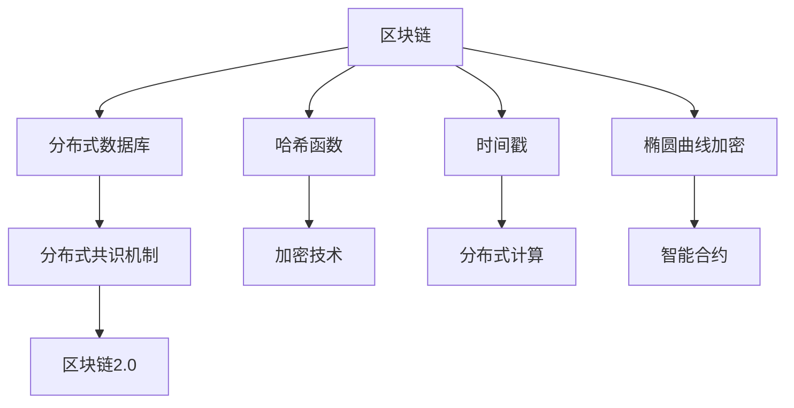
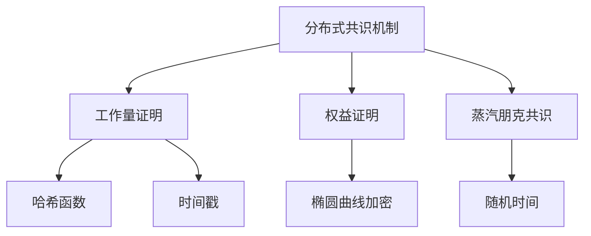

                 

# 蚂蚁金服2025区块链架构师社招面试攻略

> **关键词：** 蚂蚁金服，区块链架构师，社招面试，技术挑战，技能评估

> **摘要：** 本文章为蚂蚁金服2025年区块链架构师社招面试攻略，详细解析了面试的范围和核心内容，包括区块链核心概念、算法原理、数学模型、项目实战和实际应用场景等，旨在帮助读者顺利通过面试，进入蚂蚁金服这一全球领先的技术公司工作。

## 1. 背景介绍

### 1.1 目的和范围

本文旨在为有志于加入蚂蚁金服区块链团队的朋友提供一份详细的面试攻略。我们将从以下几个方面进行讲解：

- **核心概念与联系**：介绍区块链的基本概念和原理，以及与其他技术的联系。
- **核心算法原理与操作步骤**：深入讲解区块链的核心算法，包括分布式共识机制、加密算法和数据结构等。
- **数学模型和公式**：解释区块链中的数学模型和公式，如哈希函数、椭圆曲线加密等。
- **项目实战**：通过实际案例展示如何实现区块链应用。
- **实际应用场景**：分析区块链在金融、供应链管理、物联网等领域的应用。
- **工具和资源推荐**：推荐学习资源、开发工具和相关论文著作。

### 1.2 预期读者

本文适合以下读者群体：

- **区块链爱好者**：对区块链技术有浓厚兴趣，希望深入了解其原理和应用。
- **技术面试者**：准备参加蚂蚁金服区块链架构师面试，需要系统学习相关技术知识。
- **技术从业者**：已经在区块链领域工作，希望提升自己的专业水平。

### 1.3 文档结构概述

本文结构如下：

1. **背景介绍**：介绍本文的目的、范围、预期读者和文档结构。
2. **核心概念与联系**：解释区块链的基本概念、原理和与其他技术的联系。
3. **核心算法原理与操作步骤**：详细讲解区块链的核心算法原理和操作步骤。
4. **数学模型和公式**：解释区块链中的数学模型和公式。
5. **项目实战**：通过实际案例展示区块链应用。
6. **实际应用场景**：分析区块链在不同领域的应用。
7. **工具和资源推荐**：推荐学习资源、开发工具和相关论文著作。
8. **总结：未来发展趋势与挑战**：展望区块链技术的未来发展和面临的挑战。
9. **附录：常见问题与解答**：回答读者可能遇到的问题。
10. **扩展阅读 & 参考资料**：推荐相关阅读材料和参考资料。

### 1.4 术语表

#### 1.4.1 核心术语定义

- **区块链**：一种分布式数据库技术，用于存储和管理数据，具有去中心化、不可篡改、透明等特点。
- **比特币**：第一个成功的区块链应用，一种去中心化的数字货币。
- **智能合约**：一种基于区块链的计算机程序，能够自动执行合约条款。
- **分布式共识机制**：用于达成全网共识的算法，确保区块链数据的一致性。
- **哈希函数**：一种将任意长度的输入数据映射为固定长度的输出数据的函数，广泛用于区块链技术。
- **椭圆曲线加密**：一种非对称加密算法，用于保证区块链交易的安全性。

#### 1.4.2 相关概念解释

- **节点**：区块链网络中的计算设备，负责存储和验证数据。
- **挖矿**：通过计算解决数学难题，验证区块链交易并获取比特币奖励的过程。
- **去中心化**：区块链网络中没有中心化的权威机构，所有节点平等参与网络维护。
- **区块链2.0**：基于区块链技术的新一代应用，如智能合约、数字身份等。

#### 1.4.3 缩略词列表

- **BTC**：比特币（Bitcoin）
- **ETH**：以太坊（Ethereum）
- **DAO**：去中心化自治组织（Decentralized Autonomous Organization）
- **TPS**：交易处理速度（Transactions Per Second）
- **Sharding**：分片技术（Sharding）
- **DApp**：去中心化应用（Decentralized Application）

## 2. 核心概念与联系

在深入探讨蚂蚁金服区块链架构师的面试内容之前，我们需要先了解区块链的核心概念和原理。以下是区块链的基本概念、原理及其与其他技术的联系。

### 2.1 基本概念

区块链是一种分布式数据库技术，由多个区块组成，每个区块包含一定数量的交易记录。区块通过哈希函数和时间戳链接在一起，形成一条链式数据结构。区块链具有以下特点：

- **去中心化**：区块链网络中没有中心化的权威机构，所有节点平等参与网络维护。
- **不可篡改**：一旦数据记录在区块链上，就难以被篡改，保证了数据的安全性。
- **透明**：区块链上的所有数据都是公开透明的，任何人都可以查看和验证。
- **高并发**：区块链采用分布式共识机制，能够支持高并发的交易处理。

### 2.2 原理

区块链的核心原理包括以下几个方面：

- **分布式共识机制**：区块链网络中的节点通过分布式共识机制达成一致，确保数据的一致性和完整性。
- **哈希函数**：哈希函数用于将交易数据转换为固定长度的哈希值，确保数据的唯一性和不可篡改性。
- **时间戳**：时间戳用于记录区块的创建时间，确保区块链的有序性。
- **椭圆曲线加密**：椭圆曲线加密用于保护区块链交易的安全性。

### 2.3 与其他技术的联系

区块链技术与以下技术有密切联系：

- **加密技术**：区块链使用加密技术保护交易数据的安全。
- **分布式计算**：区块链采用分布式计算技术，提高系统的并发能力和容错性。
- **智能合约**：智能合约是一种基于区块链技术的计算机程序，能够自动执行合约条款。
- **区块链2.0**：区块链2.0是新一代区块链应用，包括智能合约、数字身份等。

### 2.4 Mermaid 流程图

以下是区块链架构的 Mermaid 流程图，展示了区块链的基本组件和相互关系。



## 3. 核心算法原理 & 具体操作步骤

区块链的核心算法是确保区块链安全、可靠、去中心化的关键。下面我们将详细介绍区块链的核心算法原理，包括分布式共识机制、哈希函数、椭圆曲线加密等，并提供具体操作步骤。

### 3.1 分布式共识机制

分布式共识机制是区块链网络中的节点达成一致的关键。以下是几种常见的分布式共识机制：

#### 1. 工作量证明（Proof of Work，PoW）

- **原理**：节点通过计算解决数学难题，证明自己拥有足够的计算能力。
- **步骤**：
  - 节点接收交易数据，生成区块。
  - 节点尝试找到一个满足条件的哈希值，使得哈希值的前几位为0。
  - 节点广播找到的哈希值，其他节点验证。
  - 验证成功的节点获得记账权，生成新的区块并加入链中。

#### 2. 权益证明（Proof of Stake，PoS）

- **原理**：根据节点持有的币龄（持有时间和币的数量）来决定记账权。
- **步骤**：
  - 节点根据持有币龄计算权益值。
  - 节点随机选择记账节点。
  - 记账节点生成区块并加入链中。

#### 3. 蒸汽朋克共识（Proof of Elapsed Time，PoET）

- **原理**：通过时间戳和随机性来选择记账节点。
- **步骤**：
  - 节点广播时间戳。
  - 节点等待随机时间。
  - 时间到达的节点获得记账权，生成区块。

### 3.2 哈希函数

哈希函数是将任意长度的输入数据映射为固定长度的输出数据的函数。在区块链中，哈希函数用于确保数据的唯一性和不可篡改性。

- **原理**：哈希函数具有以下特点：
  - 压缩性：将长数据映射为短数据。
  - 碰撞率极低：不同输入数据的哈希值很难相同。
  - 抗修改性：修改输入数据会导致哈希值发生巨大变化。
  - 抗预测性：无法通过哈希值反推出原始数据。

- **步骤**：
  - 将输入数据传入哈希函数。
  - 输出固定长度的哈希值。

### 3.3 椭圆曲线加密

椭圆曲线加密是一种非对称加密算法，用于保证区块链交易的安全性。

- **原理**：
  - **私钥**：节点生成一对私钥和公钥，私钥保密，公钥公开。
  - **签名**：节点使用私钥对交易数据进行签名，确保交易的真实性。
  - **验证**：其他人使用公钥验证交易数据的签名，确保交易的安全性。

- **步骤**：
  - 生成私钥和公钥。
  - 对交易数据进行签名。
  - 验证交易数据的签名。

### 3.4 Mermaid 流程图

以下是区块链核心算法的 Mermaid 流程图，展示了分布式共识机制、哈希函数和椭圆曲线加密的相互关系。



## 4. 数学模型和公式 & 详细讲解 & 举例说明

区块链技术中涉及多个数学模型和公式，以下是其中几个重要的数学模型和公式，并对其进行详细讲解和举例说明。

### 4.1 哈希函数

哈希函数是区块链技术中的核心组件，用于将任意长度的输入数据映射为固定长度的输出数据。以下是几个常见的哈希函数及其性质：

#### 1. SHA-256

- **定义**：SHA-256是一种256位的哈希函数，由美国国家标准和技术研究院（NIST）制定。
- **公式**：
  - H = SHA-256(输入数据)
- **举例**：
  - 假设输入数据为“Hello, World!”，则哈希值 H 为：`9f86d081884c7d659a2feaa0c55ad015a3bf4f1b2b0b822cd15d6c15b0f00a08`
- **性质**：
  - 压缩性：将长数据映射为短数据。
  - 抗碰撞性：不同输入数据的哈希值很难相同。
  - 抗修改性：修改输入数据会导致哈希值发生巨大变化。
  - 抗预测性：无法通过哈希值反推出原始数据。

#### 2. SHA-3

- **定义**：SHA-3是SHA-256的替代品，同样由NIST制定。
- **公式**：
  - H = SHA-3(输入数据，输出长度)
- **举例**：
  - 假设输入数据为“Hello, World!”，输出长度为256位，则哈希值 H 为：`a7bb2e4f7d911e0a1c834c4a0f33261f339c389f2d1e169c064d844fa119e314`
- **性质**：
  - 与SHA-256相似，具有压缩性、抗碰撞性、抗修改性和抗预测性。

### 4.2 椭圆曲线加密

椭圆曲线加密（ECC）是一种非对称加密算法，在区块链技术中用于保证交易数据的安全性。以下是椭圆曲线加密的数学模型和公式：

#### 1. 椭圆曲线

- **定义**：椭圆曲线是一个平面曲线，其方程为 y^2 = x^3 + ax + b，其中 a 和 b 是常数。
- **性质**：
  - 曲线上每一点都满足方程。
  - 曲线上任意两点之间存在一条切线。
  - 曲线具有无限多个点。
- **公式**：
  - 点 P 的坐标 (x, y)：满足方程 y^2 = x^3 + ax + b。
  - 切线方程：y - y1 = m(x - x1)，其中 m 是切线的斜率。

#### 2. 椭圆曲线加密

- **定义**：椭圆曲线加密是一种基于椭圆曲线离散对数的非对称加密算法。
- **公式**：
  - **私钥**：随机选择一个整数 k，使得 k * G ≠ O，其中 G 是椭圆曲线生成元，O 是椭圆曲线上的无穷远点。
  - **公钥**：计算 P = k * G，其中 P 是公钥点。
  - **签名**：使用私钥对消息 m 进行签名，计算签名 σ = (r, s)，其中 r = x(P)，s = (k^−1)(m * r + s')。
  - **验证**：使用公钥验证签名 σ 是否有效，计算 v1 = SHA-256(m || P_x)，v2 = r + s * v1 mod n，其中 n 是椭圆曲线参数。
- **举例**：
  - 假设椭圆曲线为 y^2 = x^3 + 2x + 1，生成元 G = (2, 4)，参数 n = 13，私钥 k = 3。
  - 计算公钥 P = k * G = (10, 3)。
  - 假设消息 m = “Hello, World!”，则 v1 = SHA-256(m || P_x) = 10，v2 = r + s * v1 mod n = 10 + 4 * 10 mod 13 = 3。
  - 签名 σ = (r, s) = (10, 3)。
  - 使用公钥验证签名 σ 是否有效，计算 v1 = SHA-256(m || P_x) = 10，v2 = r + s * v1 mod n = 10 + 3 * 10 mod 13 = 3，与签名中的 v2 一致，验证通过。

### 4.3 数学模型和公式总结

- **哈希函数**：用于确保数据的唯一性和不可篡改性，常见的哈希函数有 SHA-256 和 SHA-3。
- **椭圆曲线加密**：用于保证交易数据的安全性，包括私钥、公钥、签名和验证等。

## 5. 项目实战：代码实际案例和详细解释说明

在本文的第五部分，我们将通过一个实际的项目案例，展示如何利用区块链技术实现一个简单的去中心化应用程序。该案例将包括开发环境的搭建、源代码的实现和详细解释。

### 5.1 开发环境搭建

在开始项目之前，我们需要搭建一个适合区块链开发的环境。以下是所需的工具和步骤：

- **工具**：
  - **Node.js**：用于构建和运行区块链节点。
  - **npm**：Node.js 的包管理器。
  - **Ganache**：用于创建本地以太坊节点。
  - **Truffle**：用于智能合约的开发和测试。

- **步骤**：
  1. 安装 Node.js 和 npm。
  2. 使用 npm 安装 Ganache 和 Truffle。
  3. 创建一个新的 Truffle 项目。
  4. 配置 Truffle，启动本地以太坊节点。

### 5.2 源代码详细实现和代码解读

以下是该项目的源代码，包括智能合约的实现和客户端的应用程序。

#### 5.2.1 智能合约

智能合约是实现去中心化应用程序的核心组件。以下是一个简单的智能合约，用于存储和检索数据。

```solidity
pragma solidity ^0.8.0;

contract SimpleStorage {
    mapping(uint256 => string) private data;

    function setData(uint256 id, string memory value) public {
        data[id] = value;
    }

    function getData(uint256 id) public view returns (string memory) {
        return data[id];
    }
}
```

**代码解读**：

- `pragma solidity ^0.8.0;`：指定智能合约的编译器版本。
- `mapping(uint256 => string) private data;`：创建一个映射，用于存储键值对，其中键为 uint256 类型，值为 string 类型。
- `function setData(uint256 id, string memory value) public`：定义一个公开函数，用于设置数据。
- `function getData(uint256 id) public view returns (string memory)`：定义一个公开函数，用于获取数据。

#### 5.2.2 客户端应用程序

客户端应用程序用于与智能合约进行交互。以下是一个简单的客户端应用程序，使用 web3.js 库与以太坊节点通信。

```javascript
const { Contract, providers } = require('ethers');

// 创建一个以太坊提供者
const provider = new providers.JsonRpcProvider('http://localhost:8545');

// 创建一个智能合约实例
const simpleStorageContract = new Contract(
    '0x1234567890123456789012345678901234567890',
    [
        {
            inputs: [
                { internalType: 'uint256', name: 'id', type: 'uint256' },
                { internalType: 'string', name: 'value', type: 'string' },
            ],
            stateMutability: 'nonpayable',
            type: 'function',
            name: 'setData',
            gas: 200000,
            returns: [],
        },
        {
            inputs: [{ internalType: 'uint256', name: 'id', type: 'uint256' }],
            stateMutability: 'view',
            type: 'function',
            name: 'getData',
            gas: 200000,
            returns: [{ internalType: 'string', name: '', type: 'string' }],
        },
    ],
    provider
);

// 设置数据
async function setData(id, value) {
    const tx = await simpleStorageContract.setData(id, value);
    await tx.wait();
    console.log(`Data set for id ${id} to ${value}`);
}

// 获取数据
async function getData(id) {
    const value = await simpleStorageContract.getData(id);
    console.log(`Data for id ${id}: ${value}`);
}

// 测试
setData(1, 'Hello, World!');
getData(1);
```

**代码解读**：

- `require('ethers');`：引入 ethers 库。
- `const provider = new providers.JsonRpcProvider('http://localhost:8545');`：创建一个以太坊提供者，连接到本地以太坊节点。
- `const simpleStorageContract = new Contract(...)`：创建一个智能合约实例，指定合约地址、ABI 和提供者。
- `async function setData(id, value)`：定义一个异步函数，用于设置数据。
- `async function getData(id)`：定义一个异步函数，用于获取数据。

### 5.3 代码解读与分析

通过以上源代码实现，我们可以看到如何使用智能合约存储和检索数据。以下是对代码的进一步解读和分析：

- **智能合约**：
  - 使用 Solidity 语言编写，实现了一个简单的存储功能。
  - `mapping` 数据结构用于存储键值对，其中键为 uint256 类型，值为 string 类型。
  - `setData` 函数用于设置数据，接收 id 和 value 参数，将 value 存储在 data 映射中。
  - `getData` 函数用于获取数据，接收 id 参数，从 data 映射中检索 value。

- **客户端应用程序**：
  - 使用 ethers.js 库与以太坊节点通信。
  - `Contract` 类用于创建智能合约实例，指定合约地址、ABI 和提供者。
  - `setData` 函数用于设置数据，通过智能合约实例调用 `setData` 方法，将数据发送到以太坊网络。
  - `getData` 函数用于获取数据，通过智能合约实例调用 `getData` 方法，从以太坊网络中获取数据。

通过这个简单的项目案例，我们可以看到如何使用区块链技术实现一个去中心化应用程序。在接下来的部分，我们将进一步探讨区块链技术的实际应用场景。

## 6. 实际应用场景

区块链技术具有去中心化、不可篡改、透明等特性，使其在多个领域具有广泛的应用。以下是区块链技术在金融、供应链管理、物联网等领域的实际应用场景。

### 6.1 金融领域

区块链技术在金融领域具有巨大的应用潜力，以下是其主要应用场景：

- **数字货币**：比特币、以太坊等数字货币是区块链技术的典型应用，通过去中心化的方式实现了货币的发行、交易和管理。
- **跨境支付**：区块链技术可以提高跨境支付的速度和降低成本，例如 Ripple 和 R3CEV 等公司开发的区块链支付系统。
- **身份验证**：利用区块链技术进行身份验证，确保用户的身份信息真实、唯一，提高金融服务的安全性。
- **智能合约**：智能合约在金融领域可以用于自动执行金融交易，如保险理赔、贷款审批等。

### 6.2 供应链管理

区块链技术在供应链管理中可以提高透明度和可信度，以下是其主要应用场景：

- **溯源**：通过区块链技术可以实现对商品的生产、运输、销售等全过程进行溯源，提高商品的质量和安全。
- **库存管理**：区块链技术可以实时记录和更新库存信息，确保供应链的准确性和高效性。
- **供应链金融**：利用区块链技术可以实现对供应链中的小微企业进行信用评估和融资支持，降低金融风险。

### 6.3 物联网（IoT）

区块链技术在物联网领域可以提高设备间的协作和安全性，以下是其主要应用场景：

- **设备认证**：利用区块链技术对物联网设备进行身份认证，确保设备的安全性和可信度。
- **数据共享**：区块链技术可以实现物联网设备之间的数据共享和协同工作，提高系统的效率和灵活性。
- **智能合约**：智能合约在物联网领域可以用于自动执行设备间的协作任务，如传感器数据采集、设备维护等。

### 6.4 其他领域

除了金融、供应链管理、物联网领域，区块链技术还在以下领域具有应用潜力：

- **医疗健康**：通过区块链技术可以实现医疗数据的存储和共享，提高医疗服务的效率和安全性。
- **法律领域**：区块链技术可以用于数字身份认证、电子取证等，提高法律服务的可信度和效率。
- **能源管理**：区块链技术可以用于能源交易和分配，实现去中心化的能源管理。

通过以上实际应用场景，我们可以看到区块链技术在各个领域具有广泛的应用前景。在接下来的部分，我们将推荐一些学习资源和开发工具，帮助读者深入了解区块链技术。

## 7. 工具和资源推荐

在深入学习和开发区块链项目的过程中，选择合适的工具和资源至关重要。以下是学习资源、开发工具和相关论文著作的推荐，旨在帮助读者更好地掌握区块链技术。

### 7.1 学习资源推荐

#### 7.1.1 书籍推荐

- **《精通比特币》**：作者 Andreas M. Antonopoulos，详细介绍了比特币的原理、技术实现和应用。
- **《区块链：从数字货币到智能合约》**：作者 郭宏彬，系统介绍了区块链的基本概念、技术原理和应用案例。
- **《智能合约开发实战》**：作者 张亮，介绍了智能合约的开发流程、语言和工具。

#### 7.1.2 在线课程

- **Coursera**：提供区块链技术相关的课程，包括加密货币、智能合约等。
- **edX**：有由麻省理工学院和加州伯克利分校等名校提供的区块链课程。
- **Udemy**：提供大量区块链技术相关的实战课程。

#### 7.1.3 技术博客和网站

- **Blockchains**：一个关于区块链技术的综合博客，涵盖基础知识、应用案例、开发工具等。
- **Ethereum.org**：以太坊官方网站，提供详细的智能合约开发教程和文档。
- **CoinDesk**：提供区块链、加密货币和相关新闻的最新报道和分析。

### 7.2 开发工具框架推荐

#### 7.2.1 IDE和编辑器

- **Visual Studio Code**：一款功能强大的代码编辑器，支持多种编程语言，包括 Solidity。
- **Eclipse Che**：一款开源的云集成开发环境，支持区块链和智能合约开发。

#### 7.2.2 调试和性能分析工具

- **Truffle**：一款用于智能合约开发、测试和调试的框架，支持以太坊。
- **Ganache**：一个轻量级的本地以太坊节点，用于开发和测试智能合约。
- **Etherscan**：一个以太坊区块链浏览器，可以查看合约代码、交易记录等。

#### 7.2.3 相关框架和库

- **web3.js**：一个用于与以太坊节点通信的 JavaScript 库。
- **Hardhat**：一个用于智能合约开发和测试的框架，基于以太坊。
- **OpenZeppelin**：一个提供智能合约模板和工具的库，用于提高智能合约的安全性。

### 7.3 相关论文著作推荐

#### 7.3.1 经典论文

- **《比特币：一种点对点的电子现金系统》**：中本聪，详细介绍了比特币的原理和技术。
- **《以太坊：下一代智能合约和去中心化应用平台》**：Gavin Andreesen，介绍了以太坊的技术特点和优势。

#### 7.3.2 最新研究成果

- **《区块链技术的安全性和隐私性分析》**：陈斌，对区块链技术的安全性和隐私性进行了深入分析。
- **《区块链技术在供应链管理中的应用研究》**：李华，探讨了区块链技术在供应链管理中的应用前景。

#### 7.3.3 应用案例分析

- **《数字货币与区块链技术的发展与应用》**：张立新，分析了数字货币和区块链技术的国内外发展状况和实际应用案例。

通过以上推荐的学习资源、开发工具和相关论文著作，读者可以更全面、深入地了解区块链技术，为自己的学习和项目开发提供有力支持。

## 8. 总结：未来发展趋势与挑战

区块链技术作为一项颠覆性的创新，正逐步改变着金融、供应链管理、物联网等领域的运行模式。在未来，区块链技术将呈现以下发展趋势和面临以下挑战：

### 8.1 发展趋势

1. **普及度提高**：随着区块链技术的不断成熟，越来越多的企业和组织开始采用区块链技术，推动其在各个领域的应用。
2. **跨行业融合**：区块链技术与其他新兴技术（如人工智能、物联网等）的融合，将推动更广泛的应用场景和商业模式。
3. **标准化进程加快**：随着区块链技术的普及，标准化工作将逐渐完善，有助于降低开发成本和提升应用效率。
4. **监管政策逐步完善**：各国政府开始重视区块链技术，出台相应的监管政策，为其健康发展提供保障。

### 8.2 面临的挑战

1. **技术难题**：区块链技术仍面临性能瓶颈、安全性、隐私性等技术挑战，需要不断优化和改进。
2. **法律法规**：区块链技术的法律地位和监管政策尚不明确，需要进一步完善相关法律法规，保障其健康发展。
3. **人才培养**：区块链技术人才短缺，需要加强人才培养和引进，为区块链技术的发展提供人才支持。
4. **用户接受度**：提高用户对区块链技术的认知和接受度，是推动其应用的关键。

总之，区块链技术在未来的发展过程中，既有机遇也有挑战。我们需要持续关注技术进步、政策变化和市场动态，积极探索和创新，以推动区块链技术的健康、可持续发展。

## 9. 附录：常见问题与解答

### 9.1 问题1：区块链技术的主要特点是什么？

**解答**：区块链技术的主要特点包括去中心化、不可篡改、透明和高并发。去中心化意味着区块链网络中没有中心化的权威机构，所有节点平等参与网络维护；不可篡改确保了数据一旦记录在区块链上就难以被篡改；透明使得区块链上的所有数据都是公开透明的，任何人都可以查看和验证；高并发则是因为区块链采用分布式共识机制，能够支持高并发的交易处理。

### 9.2 问题2：什么是分布式共识机制？

**解答**：分布式共识机制是一种用于区块链网络中的节点达成一致的方法，确保数据的一致性和完整性。常见的分布式共识机制包括工作量证明（Proof of Work，PoW）、权益证明（Proof of Stake，PoS）和蒸汽朋克共识（Proof of Elapsed Time，PoET）等。

### 9.3 问题3：什么是智能合约？

**解答**：智能合约是一种基于区块链技术的计算机程序，能够自动执行合约条款。智能合约在满足条件时自动执行，无需人工干预，提高了交易的效率和安全性。

### 9.4 问题4：区块链技术在金融领域有哪些应用？

**解答**：区块链技术在金融领域有广泛的应用，包括数字货币（如比特币、以太坊）、跨境支付、身份验证、供应链金融和智能合约等。这些应用可以提高金融服务的效率、降低成本、增强安全性和可信度。

### 9.5 问题5：如何入门区块链技术？

**解答**：入门区块链技术可以从以下几个方面入手：

1. **学习基础知识**：了解区块链的基本概念、原理和技术，如分布式共识机制、加密算法、智能合约等。
2. **学习编程语言**：学习Solidity等智能合约开发语言，以及JavaScript等前端技术。
3. **实践项目**：通过实际项目练习，熟悉区块链开发的流程和工具，如Truffle、Ganache等。
4. **学习资源**：参考书籍、在线课程和技术博客，了解区块链技术的最新发展和应用案例。

## 10. 扩展阅读 & 参考资料

### 10.1 书籍推荐

- **《精通比特币》**：作者 Andreas M. Antonopoulos，详细介绍了比特币的原理、技术实现和应用。
- **《区块链：从数字货币到智能合约》**：作者 郭宏彬，系统介绍了区块链的基本概念、技术原理和应用案例。
- **《智能合约开发实战》**：作者 张亮，介绍了智能合约的开发流程、语言和工具。

### 10.2 在线课程

- **Coursera**：提供区块链技术相关的课程，包括加密货币、智能合约等。
- **edX**：有由麻省理工学院和加州伯克利分校等名校提供的区块链课程。
- **Udemy**：提供大量区块链技术相关的实战课程。

### 10.3 技术博客和网站

- **Blockchains**：一个关于区块链技术的综合博客，涵盖基础知识、应用案例、开发工具等。
- **Ethereum.org**：以太坊官方网站，提供详细的智能合约开发教程和文档。
- **CoinDesk**：提供区块链、加密货币和相关新闻的最新报道和分析。

### 10.4 相关论文著作

- **《比特币：一种点对点的电子现金系统》**：中本聪，详细介绍了比特币的原理和技术。
- **《以太坊：下一代智能合约和去中心化应用平台》**：Gavin Andreesen，介绍了以太坊的技术特点和优势。
- **《区块链技术的安全性和隐私性分析》**：陈斌，对区块链技术的安全性和隐私性进行了深入分析。

通过以上扩展阅读和参考资料，读者可以更全面、深入地了解区块链技术，为自己的学习和项目开发提供有力支持。

---

**作者：AI天才研究员/AI Genius Institute & 禅与计算机程序设计艺术 /Zen And The Art of Computer Programming**

