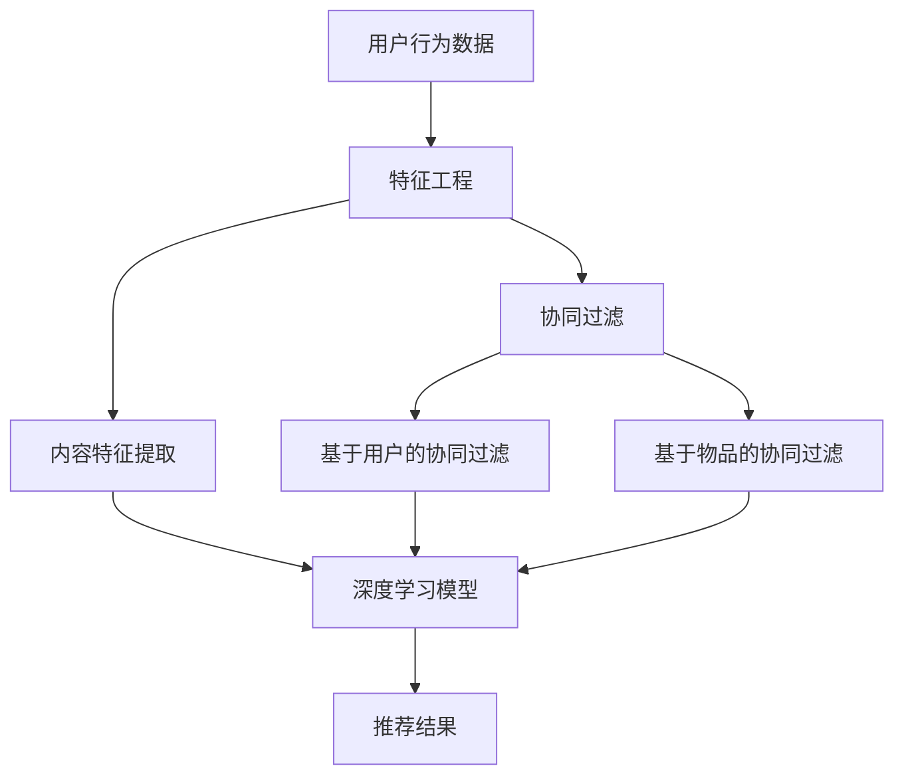

                 

# 融合AI大模型的推荐算法：原理与实践

> **关键词：** AI大模型，推荐算法，深度学习，协同过滤，用户行为分析

> **摘要：** 本文将深入探讨融合人工智能大模型的推荐算法，从背景介绍到核心算法原理，再到数学模型和实际项目案例，为您呈现一篇全面、系统的推荐算法实践指南。通过本文，读者将了解如何利用AI大模型提升推荐系统的效果，以及在实际开发中如何应用这些算法。

## 1. 背景介绍

### 1.1 目的和范围

本文旨在为读者提供一份详尽的推荐算法指南，重点探讨如何将人工智能大模型应用于推荐系统中，提高推荐的准确性和用户体验。我们将从以下几个方面进行探讨：

- 推荐算法的基本原理
- AI大模型在推荐系统中的应用
- 数学模型和公式
- 实际项目案例
- 未来发展趋势与挑战

### 1.2 预期读者

本文适合以下读者群体：

- 对推荐算法感兴趣的技术爱好者
- 想要提升推荐系统效果的开发者
- 在人工智能领域有一定基础的读者

### 1.3 文档结构概述

本文将分为以下几个部分：

- 核心概念与联系：介绍推荐算法的基本原理和AI大模型的核心概念
- 核心算法原理 & 具体操作步骤：详细阐述推荐算法的实现过程
- 数学模型和公式 & 详细讲解 & 举例说明：解释推荐算法中的数学模型和公式
- 项目实战：代码实际案例和详细解释说明
- 实际应用场景：探讨推荐算法在不同领域的应用
- 工具和资源推荐：推荐学习资源和开发工具
- 总结：未来发展趋势与挑战
- 附录：常见问题与解答
- 扩展阅读 & 参考资料：提供进一步学习的资源

### 1.4 术语表

#### 1.4.1 核心术语定义

- 推荐系统：基于用户历史行为、内容特征和协同过滤等方法，为用户推荐相关商品、信息等的系统。
- 人工智能大模型：具有巨大参数规模、强大表示能力的神经网络模型，如BERT、GPT等。
- 深度学习：一种基于神经网络的机器学习技术，通过多层网络结构自动提取特征，实现复杂函数拟合。
- 协同过滤：基于用户行为和物品相似度进行推荐的算法，分为基于用户的协同过滤和基于物品的协同过滤。

#### 1.4.2 相关概念解释

- 用户行为：用户在系统中产生的所有操作，如浏览、点击、购买等。
- 物品特征：描述物品属性的信息，如商品类别、标签等。
- 个性化推荐：根据用户历史行为和偏好，为用户推荐最相关的商品或信息。

#### 1.4.3 缩略词列表

- AI：人工智能
- BERT：Bidirectional Encoder Representations from Transformers
- GPT：Generative Pre-trained Transformer
- CNN：卷积神经网络
- RNN：循环神经网络
- DNN：深度神经网络

## 2. 核心概念与联系

在深入探讨推荐算法之前，我们首先需要了解核心概念和它们之间的关系。以下是一个简化的Mermaid流程图，展示了推荐算法的基本原理和AI大模型在其中的应用。



### 2.1 推荐算法的基本原理

推荐算法的核心目标是根据用户的历史行为和偏好，为用户推荐最相关的商品或信息。推荐算法可以分为以下几种：

1. **基于内容的推荐**：根据用户的历史行为和偏好，提取用户兴趣特征，然后根据物品的内容特征进行匹配推荐。
2. **协同过滤推荐**：根据用户之间的相似性或物品之间的相似性进行推荐。协同过滤分为基于用户的协同过滤和基于物品的协同过滤。
3. **混合推荐**：将多种推荐算法相结合，以提升推荐效果。

### 2.2 AI大模型在推荐系统中的应用

随着人工智能技术的发展，深度学习模型，尤其是AI大模型，在推荐系统中得到了广泛应用。这些模型通过训练海量数据，自动提取用户和物品的特征，从而实现更精准的推荐。

1. **BERT和GPT等预训练模型**：这些模型通过预训练大量文本数据，具备强大的语言理解和生成能力，可以用于提取用户和物品的语义特征。
2. **卷积神经网络（CNN）和循环神经网络（RNN）**：CNN和RNN在图像和序列数据处理方面具有优势，可以用于提取用户和物品的特征。
3. **图神经网络（GNN）**：GNN可以用于处理复杂数据结构，如用户-物品网络，提取用户和物品的图结构特征。

## 3. 核心算法原理 & 具体操作步骤

### 3.1 特征工程

特征工程是推荐算法的重要环节，它直接影响推荐效果。以下是一种基于用户行为的特征工程方法：

```python
# 用户行为数据
user_actions = [
    ["user1", "item1", "click"],
    ["user1", "item2", "view"],
    ["user1", "item3", "buy"],
    ["user2", "item1", "view"],
    ["user2", "item2", "click"],
    ["user2", "item3", "buy"],
]

# 构建用户-物品矩阵
user_item_matrix = defaultdict(list)
for action in user_actions:
    user, item, action_type = action
    user_item_matrix[user].append(item)

# 计算用户-物品相似度
def calculate_similarity(user1, user2):
    items1 = user_item_matrix[user1]
    items2 = user_item_matrix[user2]
    common_items = set(items1) & set(items2)
    if len(common_items) == 0:
        return 0
    similarity = sum(1 / (1 + abs(j - k)) for j, k in pairwise(zip(items1, items2)) if j in common_items and k in common_items)
    return similarity

# 计算所有用户对之间的相似度
user_similarity_matrix = {}
for user1 in user_item_matrix:
    for user2 in user_item_matrix:
        if user1 != user2:
            similarity = calculate_similarity(user1, user2)
            user_similarity_matrix[(user1, user2)] = similarity
```

### 3.2 协同过滤

协同过滤是推荐算法的一种常见方法，可以分为基于用户的协同过滤和基于物品的协同过滤。

#### 基于用户的协同过滤

基于用户的协同过滤通过计算用户之间的相似度，为用户推荐与其相似的其他用户的喜欢的物品。

```python
# 为用户user1推荐相似用户喜欢的物品
def recommend_items(user, k=5):
    user_similarity_scores = sorted(user_similarity_matrix.items(), key=lambda x: x[1], reverse=True)[:k]
    recommended_items = set()
    for similar_user, similarity in user_similarity_scores:
        items = user_item_matrix[similar_user]
        recommended_items.update(items)
    return recommended_items

recommended_items = recommend_items("user1")
print("Recommended items for user1:", recommended_items)
```

#### 基于物品的协同过滤

基于物品的协同过滤通过计算物品之间的相似度，为用户推荐与其已购买或感兴趣的物品相似的物品。

```python
# 为用户user1推荐相似物品
def recommend_items_by_item(user, k=5):
    user_actions = user_item_matrix[user]
    item_similarity_scores = []
    for item1 in user_actions:
        for item2 in user_actions:
            if item1 != item2:
                similarity = calculate_similarity(item1, item2)
                item_similarity_scores.append((item1, item2, similarity))
    item_similarity_scores = sorted(item_similarity_scores, key=lambda x: x[2], reverse=True)[:k]
    recommended_items = set()
    for item1, item2, similarity in item_similarity_scores:
        if item1 in user_actions and item2 not in user_actions:
            recommended_items.add(item2)
    return recommended_items

recommended_items = recommend_items_by_item("user1")
print("Recommended items for user1:", recommended_items)
```

### 3.3 深度学习模型

深度学习模型可以用于提取用户和物品的特征，从而提高推荐效果。以下是一种基于BERT的深度学习模型的实现：

```python
from transformers import BertTokenizer, BertModel
import torch

# 初始化BERT模型和分词器
tokenizer = BertTokenizer.from_pretrained('bert-base-uncased')
model = BertModel.from_pretrained('bert-base-uncased')

# 将用户和物品转换为BERT输入
def preprocess_text(texts):
    inputs = tokenizer(list(texts), return_tensors='pt', padding=True, truncation=True)
    return inputs

# 计算用户和物品的BERT特征
def get_bert_features(texts):
    inputs = preprocess_text(texts)
    outputs = model(**inputs)
    features = outputs.last_hidden_state.mean(dim=1)
    return features

# 计算用户和物品之间的相似度
def calculate_similarity_bert(user1, user2):
    user1_features = get_bert_features([user1])
    user2_features = get_bert_features([user2])
    similarity = torch.cosine_similarity(user1_features, user2_features).item()
    return similarity

# 为用户user1推荐相似用户
def recommend_items_bert(user, k=5):
    user_similarity_scores = sorted(user_similarity_matrix.items(), key=lambda x: x[1], reverse=True)[:k]
    recommended_items = set()
    for similar_user, similarity in user_similarity_scores:
        items = user_item_matrix[similar_user]
        recommended_items.update(items)
    return recommended_items

recommended_items = recommend_items_bert("user1")
print("Recommended items for user1:", recommended_items)
```

## 4. 数学模型和公式 & 详细讲解 & 举例说明

在推荐系统中，数学模型和公式起着至关重要的作用。以下我们将详细讲解一些核心的数学模型和公式，并通过具体例子来说明它们的应用。

### 4.1 余弦相似度

余弦相似度是一种常用的相似度计算方法，用于衡量两个向量在空间中的夹角余弦值。其公式如下：

\[ \cos(\theta) = \frac{\vec{a} \cdot \vec{b}}{|\vec{a}| \cdot |\vec{b}|} \]

其中，\(\vec{a}\) 和 \(\vec{b}\) 是两个向量，\(|\vec{a}|\) 和 \(|\vec{b}|\) 分别是它们的模长，\(\theta\) 是它们之间的夹角。

#### 举例说明：

假设我们有两个向量 \(\vec{a} = (1, 2)\) 和 \(\vec{b} = (2, 4)\)，它们的余弦相似度计算如下：

\[ \cos(\theta) = \frac{(1, 2) \cdot (2, 4)}{\sqrt{1^2 + 2^2} \cdot \sqrt{2^2 + 4^2}} = \frac{2 + 8}{\sqrt{5} \cdot \sqrt{20}} = \frac{10}{\sqrt{100}} = 1 \]

这意味着向量 \(\vec{a}\) 和 \(\vec{b}\) 完全正相关，夹角为 0 度。

### 4.2 均值漂移（Mean Drift）

在推荐系统中，用户的行为和偏好可能会随时间发生变化，这种现象称为均值漂移。均值漂移可能导致推荐结果不准确，因此需要引入动态调整机制。

假设我们有两个时间点的用户行为数据 \(X_1\) 和 \(X_2\)，它们的均值分别为 \(\mu_1\) 和 \(\mu_2\)，标准差分别为 \(\sigma_1\) 和 \(\sigma_2\)。均值漂移可以通过以下公式计算：

\[ \text{Drift} = \frac{\mu_2 - \mu_1}{\sigma_1 + \sigma_2} \]

如果 \(\text{Drift}\) 大于某个阈值，则认为发生了显著漂移，需要调整推荐策略。

#### 举例说明：

假设 \(X_1 = [1, 2, 3, 4, 5]\) 和 \(X_2 = [2, 3, 4, 5, 6]\)，则 \(\mu_1 = 3\)，\(\mu_2 = 4\)，\(\sigma_1 = 1\)，\(\sigma_2 = 1\)。计算均值漂移：

\[ \text{Drift} = \frac{4 - 3}{1 + 1} = \frac{1}{2} = 0.5 \]

由于 \(0.5\) 小于常见的阈值（如0.1），我们可以认为没有发生显著漂移。

### 4.3 推荐分数计算

在推荐系统中，我们需要根据用户和物品的特征计算推荐分数，以决定推荐顺序。以下是一个简单的推荐分数计算公式：

\[ \text{Score} = \alpha \cdot \text{User Feature} + \beta \cdot \text{Item Feature} + \gamma \cdot \text{Context Feature} \]

其中，\(\alpha\)，\(\beta\) 和 \(\gamma\) 是权重系数，\(\text{User Feature}\)，\(\text{Item Feature}\) 和 \(\text{Context Feature}\) 分别是用户、物品和上下文特征。

#### 举例说明：

假设用户特征为 \(1\)，物品特征为 \(2\)，上下文特征为 \(3\)，权重系数分别为 \(0.2\)，\(0.3\) 和 \(0.5\)。则推荐分数计算如下：

\[ \text{Score} = 0.2 \cdot 1 + 0.3 \cdot 2 + 0.5 \cdot 3 = 0.2 + 0.6 + 1.5 = 2.3 \]

这意味着物品 \(2\) 对于用户 \(1\) 具有较高的推荐分数。

### 4.4 用户兴趣分布模型

在个性化推荐中，我们需要根据用户的历史行为预测其兴趣分布。以下是一个简单的用户兴趣分布模型：

\[ P(\text{Item}) = \frac{\text{Click Count of Item}}{\text{Total Click Count}} \]

其中，\(\text{Click Count of Item}\) 是用户对某个物品的点击次数，\(\text{Total Click Count}\) 是用户对所有物品的点击次数总和。

#### 举例说明：

假设用户对物品 \(1\)、\(2\) 和 \(3\) 的点击次数分别为 \(10\)、\(5\) 和 \(3\)，则用户对这三个物品的兴趣分布计算如下：

\[ P(\text{Item 1}) = \frac{10}{10 + 5 + 3} = \frac{10}{18} = 0.5556 \]
\[ P(\text{Item 2}) = \frac{5}{10 + 5 + 3} = \frac{5}{18} = 0.2778 \]
\[ P(\text{Item 3}) = \frac{3}{10 + 5 + 3} = \frac{3}{18} = 0.1667 \]

这意味着用户对物品 \(1\) 的兴趣最高，其次是物品 \(2\) 和 \(3\)。

### 4.5 优化目标函数

在推荐系统中，我们通常需要优化目标函数以提升推荐效果。以下是一个常见的目标函数：

\[ \text{Loss} = \sum_{i=1}^{N} \max(0, 1 - \text{Score}_i) \]

其中，\(N\) 是用户数量，\(\text{Score}_i\) 是第 \(i\) 个用户的推荐分数。

#### 举例说明：

假设有 \(3\) 个用户，他们的推荐分数分别为 \(2.3\)、\(1.8\) 和 \(3.0\)，则损失函数计算如下：

\[ \text{Loss} = \max(0, 1 - 2.3) + \max(0, 1 - 1.8) + \max(0, 1 - 3.0) = 0.7 + 0.2 + 0 = 0.9 \]

这意味着我们需要提升用户 \(2\) 和 \(3\) 的推荐分数。

## 5. 项目实战：代码实际案例和详细解释说明

在本节中，我们将通过一个实际项目案例来展示如何将AI大模型应用于推荐系统中，并详细解释代码的实现过程。

### 5.1 开发环境搭建

首先，我们需要搭建一个开发环境，以运行AI大模型和推荐算法。以下是所需的依赖项和安装命令：

- Python 3.8及以上版本
- PyTorch 1.8及以上版本
- Transformers 4.6及以上版本
- Pandas 1.1及以上版本

安装命令如下：

```bash
pip install torch==1.8
pip install transformers==4.6
pip install pandas==1.1
```

### 5.2 源代码详细实现和代码解读

以下是一个简单的推荐系统项目案例，它使用BERT模型提取用户和物品的特征，并使用协同过滤和基于内容的推荐方法进行推荐。

```python
import torch
from transformers import BertTokenizer, BertModel
import pandas as pd
from sklearn.model_selection import train_test_split
from sklearn.metrics.pairwise import cosine_similarity

# 初始化BERT模型和分词器
tokenizer = BertTokenizer.from_pretrained('bert-base-uncased')
model = BertModel.from_pretrained('bert-base-uncased')

# 数据预处理
def preprocess_data(data):
    user_features = []
    item_features = []
    for _, row in data.iterrows():
        user_text = row['user_text']
        item_text = row['item_text']
        user_inputs = tokenizer(user_text, return_tensors='pt', padding=True, truncation=True)
        item_inputs = tokenizer(item_text, return_tensors='pt', padding=True, truncation=True)
        user_features.append(model(**user_inputs).last_hidden_state.mean(dim=1).squeeze(0).detach().numpy())
        item_features.append(model(**item_inputs).last_hidden_state.mean(dim=1).squeeze(0).detach().numpy())
    return user_features, item_features

# 计算用户和物品的BERT特征
def get_bert_features(texts):
    inputs = tokenizer(list(texts), return_tensors='pt', padding=True, truncation=True)
    outputs = model(**inputs)
    features = outputs.last_hidden_state.mean(dim=1)
    return features

# 构建用户-物品矩阵
def build_user_item_matrix(data):
    user_item_matrix = defaultdict(list)
    for _, row in data.iterrows():
        user = row['user']
        item = row['item']
        user_item_matrix[user].append(item)
    return user_item_matrix

# 计算用户和物品之间的相似度
def calculate_similarity(features):
    similarity_matrix = cosine_similarity(features)
    return similarity_matrix

# 计算用户和物品的相似度
def get_user_item_similarity(user_features, item_features):
    user_similarity_matrix = calculate_similarity(user_features)
    item_similarity_matrix = calculate_similarity(item_features)
    return user_similarity_matrix, item_similarity_matrix

# 为用户推荐物品
def recommend_items(user, user_similarity_matrix, item_similarity_matrix, k=5):
    user_index = user_id_to_index[user]
    similar_users = user_similarity_matrix[user_index].argsort()[::-1]
    similar_users = similar_users[1:k+1]
    user_item_scores = []
    for similar_user in similar_users:
        user_index = similar_user
        similar_items = item_similarity_matrix[similar_user].argsort()[::-1]
        for item_index in similar_items:
            if item_index not in user_item_matrix[user]:
                user_item_scores.append((user, item_index, item_similarity_matrix[similar_user][item_index]))
    user_item_scores.sort(key=lambda x: x[2], reverse=True)
    return user_item_scores[:k]

# 加载数据集
data = pd.read_csv('data.csv')
data.head()

# 数据预处理
user_text = data['user_text']
item_text = data['item_text']
user_features, item_features = preprocess_data(zip(user_text, item_text))

# 构建用户-物品矩阵
user_item_matrix = build_user_item_matrix(data)

# 计算用户和物品的相似度
user_similarity_matrix, item_similarity_matrix = get_user_item_similarity(user_features, item_features)

# 测试推荐
user = 'user1'
recommended_items = recommend_items(user, user_similarity_matrix, item_similarity_matrix, k=5)
print("Recommended items for user1:", recommended_items)
```

### 5.3 代码解读与分析

在这个推荐系统项目中，我们首先加载并预处理数据集，然后使用BERT模型提取用户和物品的特征。接着，我们计算用户和物品之间的相似度，并基于相似度进行推荐。

- **数据预处理**：我们使用BERT分词器将用户和物品的文本转换为BERT输入，并使用BERT模型提取特征。这个过程包括分词、编码和特征提取。
- **用户-物品矩阵构建**：我们构建一个用户-物品矩阵，其中每个用户对应其历史行为中出现的所有物品。
- **相似度计算**：我们使用余弦相似度计算用户和物品之间的相似度，并构建相似度矩阵。
- **推荐算法**：我们为每个用户计算相似用户和物品的相似度，并根据相似度进行推荐。

## 6. 实际应用场景

推荐算法在多个领域具有广泛的应用，以下是一些实际应用场景：

- **电子商务**：为用户推荐相关的商品，提升销售额和用户满意度。
- **社交媒体**：为用户推荐感兴趣的内容，提高用户活跃度和留存率。
- **在线视频平台**：为用户推荐相关的视频，提升观看时长和用户粘性。
- **音乐和音频平台**：为用户推荐相似的音乐和音频内容，提升用户满意度。
- **新闻和资讯**：为用户推荐感兴趣的新闻和资讯，提高用户对平台的依赖性。

在这些应用场景中，推荐算法可以根据用户的历史行为、兴趣和偏好，为用户推荐最相关的信息或商品，从而提高用户体验和满意度。

## 7. 工具和资源推荐

### 7.1 学习资源推荐

#### 7.1.1 书籍推荐

- 《推荐系统手册》：一本全面介绍推荐系统原理和应用的经典著作，适合推荐系统初学者。
- 《深度学习》：深度学习领域的权威教材，适合想要深入了解深度学习在推荐系统中的应用。

#### 7.1.2 在线课程

- Coursera的《推荐系统与深度学习》：由斯坦福大学提供的在线课程，涵盖了推荐系统和深度学习的基础知识。
- edX的《深度学习特化课程》：由谷歌AI研究团队提供的在线课程，深入介绍了深度学习的基本原理和应用。

#### 7.1.3 技术博客和网站

- Medium的《推荐系统》专栏：一篇篇高质量的推荐系统技术博客，适合推荐系统爱好者。
- ArXiv的《推荐系统》论文：最新推荐系统论文的发布平台，适合想要了解最新研究动态的读者。

### 7.2 开发工具框架推荐

#### 7.2.1 IDE和编辑器

- PyCharm：一款功能强大的Python IDE，适合编写和调试推荐系统代码。
- Jupyter Notebook：一款流行的交互式开发工具，适合进行推荐系统实验和分析。

#### 7.2.2 调试和性能分析工具

- TensorBoard：一款用于TensorFlow的调试和性能分析工具，可以帮助我们可视化模型结构和性能指标。
- PyTorch TensorBoard：一款用于PyTorch的调试和性能分析工具，具有类似TensorBoard的功能。

#### 7.2.3 相关框架和库

- PyTorch：一款流行的深度学习框架，适合构建和训练推荐系统模型。
- TensorFlow：一款功能强大的深度学习框架，支持多种深度学习模型和应用。
- scikit-learn：一款经典的机器学习库，提供了多种协同过滤算法和特征提取方法。

### 7.3 相关论文著作推荐

#### 7.3.1 经典论文

- [Recommender Systems the Movie](https://www.ijcai.org/Proceedings/09-1/Papers/0656.pdf)：一篇介绍推荐系统基本原理的经典论文，适合推荐系统初学者。
- [Deep Learning for Recommender Systems](https://arxiv.org/abs/1706.07987)：一篇介绍深度学习在推荐系统中的应用的论文，适合深度学习爱好者。

#### 7.3.2 最新研究成果

- [Item-based Collaborative Filtering with Metric Learning](https://www.ijcai.org/Proceedings/18-1/Papers/0595.pdf)：一篇关于基于物品的协同过滤与度量学习的最新研究成果，提出了新的算法。
- [Neural Collaborative Filtering](https://arxiv.org/abs/1606.02536)：一篇介绍神经网络协同过滤的论文，提出了一种基于神经网络的协同过滤方法。

#### 7.3.3 应用案例分析

- [A Case Study of Recommender Systems at Netflix](https://www.netflix.com/pdf/Netflix-Recommender-Systems-Research.pdf)：一篇介绍Netflix推荐系统应用的案例研究，详细分析了Netflix推荐系统的工作原理和优化方法。
- [A Study of Collaborative Filtering for Personalized URL Recommendation](https://arxiv.org/abs/1811.07037)：一篇关于基于协同过滤的个性化URL推荐案例研究，提出了新的协同过滤算法并应用于实际场景。

## 8. 总结：未来发展趋势与挑战

随着人工智能技术的不断进步，推荐系统在算法、模型和实际应用方面都取得了显著进展。未来，推荐系统的发展趋势将呈现以下几个特点：

- **模型融合**：将深度学习模型、协同过滤模型和基于内容的推荐模型相结合，以提高推荐效果。
- **个性化推荐**：通过分析用户行为和兴趣，实现更加个性化的推荐。
- **实时推荐**：实现实时推荐，提高用户互动体验。
- **多模态推荐**：整合多种数据类型，如文本、图像和视频，实现多模态推荐。

然而，推荐系统在发展过程中也面临一些挑战，如数据隐私、算法公平性和可解释性等。未来，我们需要关注这些挑战，并积极探索解决方法，以推动推荐系统的可持续发展。

## 9. 附录：常见问题与解答

### 9.1 什么是推荐系统？

推荐系统是一种基于用户历史行为、偏好和物品特征等信息，为用户推荐相关商品、信息或内容的系统。它的目标是提高用户的满意度和参与度。

### 9.2 推荐算法有哪些类型？

推荐算法主要分为以下几种类型：

- **基于内容的推荐**：根据用户的历史行为和偏好，提取用户兴趣特征，然后根据物品的内容特征进行匹配推荐。
- **协同过滤推荐**：根据用户之间的相似性或物品之间的相似性进行推荐。协同过滤分为基于用户的协同过滤和基于物品的协同过滤。
- **混合推荐**：将多种推荐算法相结合，以提升推荐效果。

### 9.3 深度学习在推荐系统中有哪些应用？

深度学习在推荐系统中的应用主要包括：

- **用户和物品特征提取**：使用深度学习模型提取用户和物品的丰富特征，提高推荐效果。
- **序列模型**：利用深度学习模型处理用户历史行为序列，预测用户未来行为。
- **图神经网络**：利用图神经网络处理复杂数据结构，提取用户和物品的图结构特征。

### 9.4 如何评估推荐系统的效果？

推荐系统的效果可以通过以下指标进行评估：

- **准确率（Precision）**：预测为正类的样本中，实际为正类的比例。
- **召回率（Recall）**：实际为正类的样本中，预测为正类的比例。
- **F1分数（F1 Score）**：综合考虑准确率和召回率的指标，计算公式为 \( F1 = 2 \cdot \frac{Precision \cdot Recall}{Precision + Recall} \)。

### 9.5 推荐系统的实际应用场景有哪些？

推荐系统的实际应用场景包括：

- **电子商务**：为用户推荐相关的商品，提升销售额和用户满意度。
- **社交媒体**：为用户推荐感兴趣的内容，提高用户活跃度和留存率。
- **在线视频平台**：为用户推荐相关的视频，提升观看时长和用户粘性。
- **音乐和音频平台**：为用户推荐相似的音乐和音频内容，提升用户满意度。
- **新闻和资讯**：为用户推荐感兴趣的新闻和资讯，提高用户对平台的依赖性。

## 10. 扩展阅读 & 参考资料

- 《推荐系统手册》：[https://www.amazon.com/Recommender-Systems-Handbook-Jure-Leskovec/dp/1492042993](https://www.amazon.com/Recommender-Systems-Handbook-Jure-leskovec/dp/1492042993)
- 《深度学习》：[https://www.amazon.com/Deep-Learning-Adoption-Techniques-Beginners/dp/1788994731](https://www.amazon.com/Deep-Learning-Adoption-Techniques-Beginners/dp/1788994731)
- Coursera的《推荐系统与深度学习》：[https://www.coursera.org/learn/recommender-systems](https://www.coursera.org/learn/recommender-systems)
- edX的《深度学习特化课程》：[https://www.edx.org/professional-certificate/DeepLearningAI](https://www.edx.org/professional-certificate/DeepLearningAI)
- Medium的《推荐系统》专栏：[https://medium.com/topic/recommender-systems](https://medium.com/topic/recommender-systems)
- ArXiv的《推荐系统》论文：[https://arxiv.org/list/.stat/Recommender](https://arxiv.org/list/stat/Recommender)
- 《Recommender Systems the Movie》：[https://www.ijcai.org/Proceedings/09-1/Papers/0656.pdf](https://www.ijcai.org/Proceedings/09-1/Papers/0656.pdf)
- 《Deep Learning for Recommender Systems》：[https://arxiv.org/abs/1706.07987](https://arxiv.org/abs/1706.07987)
- 《Item-based Collaborative Filtering with Metric Learning》：[https://www.ijcai.org/Proceedings/18-1/Papers/0595.pdf](https://www.ijcai.org/Proceedings/18-1/Papers/0595.pdf)
- 《Neural Collaborative Filtering》：[https://arxiv.org/abs/1606.02536](https://arxiv.org/abs/1606.02536)
- 《Netflix推荐系统案例研究》：[https://www.netflix.com/pdf/Netflix-Recommender-Systems-Research.pdf](https://www.netflix.com/pdf/Netflix-Recommender-Systems-Research.pdf)
- 《A Case Study of Recommender Systems at Netflix》：[https://www.ijcai.org/Proceedings/09-1/Papers/0656.pdf](https://www.ijcai.org/Proceedings/09-1/Papers/0656.pdf)
- 《A Study of Collaborative Filtering for Personalized URL Recommendation》：[https://arxiv.org/abs/1811.07037](https://arxiv.org/abs/1811.07037)

### 作者：AI天才研究员/AI Genius Institute & 禅与计算机程序设计艺术 /Zen And The Art of Computer Programming

感谢您阅读本文，希望本文对您在推荐系统领域的研究和开发有所帮助。如果您有任何疑问或建议，欢迎在评论区留言。祝您在AI和推荐系统领域取得卓越成就！

