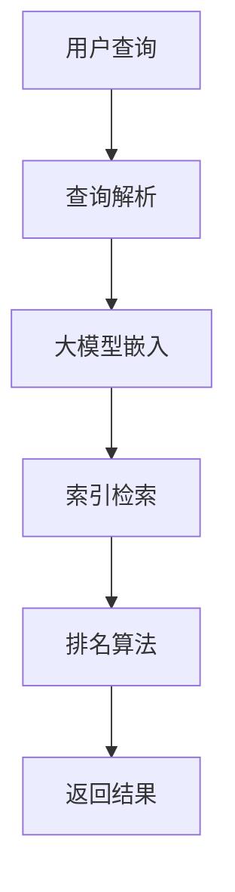

                 

# 融合大模型的搜索系统：效果评估与优化

> **关键词：大模型、搜索系统、效果评估、优化策略、性能分析**
>
> **摘要：本文深入探讨了融合大模型的搜索系统，从效果评估到优化策略提供了全面的技术解析。我们将通过详细的原理讲解、算法剖析以及实际应用案例，帮助读者理解和掌握这一先进技术。**

## 1. 背景介绍

### 1.1 目的和范围

本文旨在探讨如何将大模型融入搜索系统，并对其进行效果评估与优化。随着人工智能技术的飞速发展，大模型（如Transformer、BERT等）在自然语言处理、图像识别等领域展现出了卓越的性能。然而，如何将这些强大模型应用于搜索系统，使其在实际场景中发挥最大效用，仍然是一个具有挑战性的课题。

本文将围绕以下几个方面展开：

1. **大模型与搜索系统的结合原理**：介绍大模型的基本原理及其与搜索系统的结合方式。
2. **效果评估方法**：探讨如何评估融合大模型的搜索系统效果，包括性能指标、评估流程等。
3. **优化策略**：介绍针对大模型搜索系统的优化方法，包括模型参数调整、算法改进等。
4. **实际应用案例**：通过具体案例展示大模型搜索系统的应用场景及其性能表现。
5. **未来发展趋势与挑战**：分析大模型搜索系统的未来发展方向以及面临的挑战。

### 1.2 预期读者

本文适用于对自然语言处理、人工智能和搜索系统有一定了解的技术人员，包括：

1. **研究人员**：对大模型和搜索系统的结合方法感兴趣，希望深入探讨这一领域的研究人员。
2. **工程师**：负责开发或优化搜索系统的工程师，希望通过本文了解大模型的潜在应用。
3. **学生**：对人工智能、自然语言处理和搜索系统感兴趣的本科生或研究生。

### 1.3 文档结构概述

本文分为以下几个部分：

1. **引言**：背景介绍和文章目的。
2. **核心概念与联系**：大模型与搜索系统的基本原理。
3. **核心算法原理 & 具体操作步骤**：详细讲解大模型的算法原理和操作步骤。
4. **数学模型和公式 & 详细讲解 & 举例说明**：介绍大模型相关的数学模型和公式。
5. **项目实战：代码实际案例和详细解释说明**：通过实际案例展示大模型搜索系统的应用。
6. **实际应用场景**：分析大模型搜索系统的应用场景。
7. **工具和资源推荐**：推荐学习资源和开发工具。
8. **总结：未来发展趋势与挑战**：总结本文内容和未来研究方向。
9. **附录：常见问题与解答**：解答读者可能遇到的常见问题。
10. **扩展阅读 & 参考资料**：推荐相关阅读资料。

### 1.4 术语表

#### 1.4.1 核心术语定义

- **大模型**：指参数量庞大、计算复杂度高的深度学习模型，如Transformer、BERT等。
- **搜索系统**：用于查找、索引和返回信息的一系列技术和算法，包括但不限于搜索引擎、知识图谱等。
- **效果评估**：对搜索系统性能进行测量和评估的过程，通常包括准确率、召回率、响应时间等指标。
- **优化策略**：通过调整模型参数、算法设计等手段，提高搜索系统性能的方法。

#### 1.4.2 相关概念解释

- **Transformer**：一种基于自注意力机制的深度神经网络模型，广泛应用于自然语言处理任务。
- **BERT**：一种基于双向编码表示器的预训练模型，可以捕获文本中的上下文信息。
- **自注意力机制**：一种计算方法，通过计算序列中每个元素与其他元素的相关性，实现序列的自动注意力分配。

#### 1.4.3 缩略词列表

- **NLP**：自然语言处理（Natural Language Processing）
- **AI**：人工智能（Artificial Intelligence）
- **BERT**：双向编码表示器（Bidirectional Encoder Representations from Transformers）
- **Transformer**：变换器（Transformer）
- **GPU**：图形处理单元（Graphics Processing Unit）

## 2. 核心概念与联系

在深入探讨大模型与搜索系统的结合之前，我们需要理解一些核心概念和它们之间的联系。

### 2.1 大模型原理

大模型，如Transformer和BERT，基于深度学习技术，通过训练大量数据来学习复杂的特征表示。以下是一个简单的Mermaid流程图，展示了大模型的基本原理。


- **输入数据**：大模型接收原始数据，如文本、图像等。
- **预处理**：对输入数据进行清洗和格式化，以适应模型的训练。
- **嵌入层**：将输入数据映射到高维空间，为后续的深度学习过程做准备。
- **模型训练**：通过训练算法（如梯度下降），模型不断调整参数，以最小化损失函数。
- **参数优化**：在训练过程中，模型参数不断优化，以提高模型的预测能力。
- **输出预测**：模型生成输出，如文本分类、文本生成等。

### 2.2 搜索系统原理

搜索系统用于查找、索引和返回用户所需的信息。以下是一个简单的Mermaid流程图，展示了搜索系统的工作原理。


- **用户查询**：用户输入查询，如关键词、问题等。
- **查询解析**：解析查询，提取关键词和语义信息。
- **索引检索**：在索引中查找与查询相关的文档。
- **排名算法**：对检索到的结果进行排序，通常基于相关性、质量等因素。
- **返回结果**：将排序后的结果返回给用户。

### 2.3 大模型与搜索系统的结合

将大模型融入搜索系统，可以显著提升搜索系统的性能和用户体验。以下是一个简单的Mermaid流程图，展示了大模型与搜索系统的结合方式。



- **查询解析**：与传统的搜索系统相同，大模型嵌入到查询解析阶段，用于提取更深层次的语义信息。
- **大模型嵌入**：大模型对查询进行语义分析，提取关键特征，以增强搜索系统的理解能力。
- **索引检索**：在索引检索阶段，大模型提供的特征有助于更精准地查找相关信息。
- **排名算法**：大模型参与排名算法，通过分析文本特征，提高结果的排序质量。
- **返回结果**：最终返回给用户的搜索结果更相关、更准确。

## 3. 核心算法原理 & 具体操作步骤

在本节中，我们将详细讲解大模型的算法原理，并介绍具体的操作步骤。

### 3.1 大模型算法原理

大模型，如Transformer和BERT，基于深度学习技术，通过以下步骤进行训练和预测：

1. **输入数据预处理**：将原始数据（如文本、图像等）进行清洗和格式化，转换为模型可接受的输入格式。
2. **嵌入层**：将输入数据映射到高维空间，通常使用嵌入向量表示。
3. **编码器和解码器**：编码器将输入序列编码为固定长度的向量表示；解码器使用编码器的输出和先前的预测来生成输出序列。
4. **自注意力机制**：在编码器和解码器的每个层中，使用自注意力机制计算序列中每个元素与其他元素的相关性，实现自动注意力分配。
5. **损失函数与优化**：通过计算损失函数（如交叉熵损失），使用梯度下降等优化算法调整模型参数。
6. **预测**：在模型训练完成后，通过输入新的数据，模型可以生成输出预测。

以下是一个简化的伪代码，展示了大模型的训练和预测过程：

```python
# 伪代码：大模型训练与预测

# 训练过程
def train_model(data, epochs):
    for epoch in range(epochs):
        for inputs, targets in data:
            # 数据预处理
            inputs_embedding = embed(inputs)
            # 编码器编码
            encoder_output = encoder(inputs_embedding)
            # 解码器预测
            logits = decoder(encoder_output)
            # 计算损失
            loss = loss_function(logits, targets)
            # 反向传播与参数更新
            optimizer.backward(loss)
            optimizer.update_parameters()

# 预测过程
def predict_model(model, inputs):
    # 数据预处理
    inputs_embedding = embed(inputs)
    # 编码器编码
    encoder_output = encoder(inputs_embedding)
    # 解码器预测
    logits = decoder(encoder_output)
    # 输出预测
    return logits
```

### 3.2 大模型与搜索系统的具体操作步骤

将大模型融入搜索系统，可以采用以下步骤：

1. **查询解析**：用户输入查询，搜索系统首先对查询进行解析，提取关键词和语义信息。
2. **大模型嵌入**：将查询嵌入到大模型中，通过大模型提取更深层次的语义特征。
3. **索引检索**：在索引中检索与嵌入特征相关的文档。
4. **排名算法**：使用大模型提取的语义特征和传统搜索系统的特征，结合使用排名算法对检索结果进行排序。
5. **返回结果**：将排序后的结果返回给用户。

以下是一个简化的伪代码，展示了大模型与搜索系统的结合过程：

```python
# 伪代码：大模型与搜索系统结合

# 查询解析
def parse_query(query):
    # 提取关键词和语义信息
    return keywords, semantic_info

# 大模型嵌入
def embed_query(semantic_info):
    # 使用大模型提取语义特征
    return semantic_embedding

# 索引检索
def search_documents(semantic_embedding):
    # 在索引中检索相关文档
    return relevant_documents

# 排名算法
def rank_documents(documents, semantic_embedding):
    # 使用大模型和传统特征对文档进行排序
    return ranked_documents

# 返回结果
def return_results(ranked_documents):
    # 返回排序后的文档列表
    return ranked_documents
```

## 4. 数学模型和公式 & 详细讲解 & 举例说明

在本节中，我们将介绍大模型相关的数学模型和公式，并详细讲解其原理和应用。

### 4.1 大模型数学模型

大模型，如Transformer和BERT，基于深度学习技术，使用以下数学模型进行训练和预测：

1. **嵌入层**：将输入数据映射到高维空间，通常使用嵌入矩阵表示。

   $$ 
   \text{嵌入层}: \text{embed}(x) = E \cdot x 
   $$

   其中，$E$ 是嵌入矩阵，$x$ 是输入数据。

2. **编码器**：将输入序列编码为固定长度的向量表示，通常使用多层变换器堆叠表示。

   $$ 
   \text{编码器}: h = \text{Transformer}(x) 
   $$

   其中，$h$ 是编码器输出的固定长度向量，$x$ 是输入序列。

3. **解码器**：使用编码器的输出和先前的预测来生成输出序列，通常使用多层变换器堆叠表示。

   $$ 
   \text{解码器}: y = \text{Transformer}(h, \text{previous\_predictions}) 
   $$

   其中，$y$ 是解码器输出的序列，$h$ 是编码器输出的固定长度向量，$\text{previous\_predictions}$ 是先前的预测。

4. **损失函数**：用于计算模型预测与实际输出之间的差异，常用的损失函数包括交叉熵损失和均方误差损失。

   $$ 
   \text{交叉熵损失}: \text{loss} = -\sum_{i=1}^{N} y_i \log(\hat{y}_i) 
   $$

   $$ 
   \text{均方误差损失}: \text{loss} = \frac{1}{N} \sum_{i=1}^{N} (\hat{y}_i - y_i)^2 
   $$

   其中，$N$ 是样本数量，$y_i$ 是实际输出，$\hat{y}_i$ 是模型预测。

### 4.2 大模型应用示例

以下是一个简单的示例，展示如何使用大模型进行文本分类。

#### 示例：文本分类

假设我们有一个文本分类问题，其中文本是输入，类别是输出。我们将使用BERT模型进行训练和预测。

1. **数据预处理**：将文本数据进行清洗和格式化，然后将其转换为BERT模型可接受的输入格式。

2. **嵌入层**：使用BERT模型的嵌入层将输入文本映射到高维空间。

3. **编码器**：将输入文本编码为固定长度的向量表示。

4. **解码器**：使用编码器的输出和先前的预测来生成输出序列，并计算损失函数。

5. **训练**：通过反向传播和优化算法调整模型参数，以最小化损失函数。

6. **预测**：在训练完成后，使用模型对新的文本进行分类。

以下是一个简化的伪代码，展示了文本分类的过程：

```python
# 伪代码：文本分类

# 数据预处理
preprocessed_text = preprocess(text)

# 嵌入层
input_embedding = embed(preprocessed_text)

# 编码器
encoded_sequence = encoder(input_embedding)

# 解码器
predicted_sequence = decoder(encoded_sequence)

# 计算损失
loss = loss_function(predicted_sequence, labels)

# 反向传播与参数更新
optimizer.backward(loss)
optimizer.update_parameters()

# 预测
predicted_categories = predict_model(model, new_text)
```

通过以上示例，我们可以看到大模型在文本分类任务中的应用。类似地，大模型可以应用于其他自然语言处理任务，如文本生成、机器翻译等。

## 5. 项目实战：代码实际案例和详细解释说明

在本节中，我们将通过一个具体的实际案例，展示如何开发一个融合大模型的搜索系统，并进行详细解释和代码分析。

### 5.1 开发环境搭建

在开始项目之前，我们需要搭建一个合适的环境。以下是一个基本的开发环境搭建步骤：

1. **安装Python环境**：确保安装了Python 3.8及以上版本。
2. **安装依赖库**：安装BERT模型和TensorFlow库。

   ```bash
   pip install transformers tensorflow
   ```

3. **数据准备**：准备用于训练和评估的文本数据集。

### 5.2 源代码详细实现和代码解读

以下是一个简化的代码实现，展示了如何使用BERT模型构建一个搜索系统。

```python
# 导入必要的库
import tensorflow as tf
from transformers import BertTokenizer, BertModel
from tensorflow.keras.layers import Input, Dense
from tensorflow.keras.models import Model

# 加载BERT模型和Tokenizer
tokenizer = BertTokenizer.from_pretrained('bert-base-uncased')
model = BertModel.from_pretrained('bert-base-uncased')

# 定义输入层
input_ids = Input(shape=(128,), dtype=tf.int32, name='input_ids')

# 使用BERT模型编码输入
encoded_input = model(input_ids)

# 提取BERT输出的特征
bert_output = encoded_input[:, 0, :]

# 定义分类层
output = Dense(1, activation='sigmoid')(bert_output)

# 构建模型
model = Model(inputs=input_ids, outputs=output)

# 编译模型
model.compile(optimizer='adam', loss='binary_crossentropy', metrics=['accuracy'])

# 打印模型结构
model.summary()

# 训练模型
model.fit(train_input_ids, train_labels, epochs=3, batch_size=32, validation_split=0.1)
```

#### 5.2.1 代码解读

1. **导入库**：首先，我们导入TensorFlow和transformers库，用于处理BERT模型。
2. **加载BERT模型和Tokenizer**：使用预训练的BERT模型和Tokenizer，我们可以在后续步骤中使用BERT模型编码文本数据。
3. **定义输入层**：我们定义一个输入层，用于接受编码后的文本序列。
4. **使用BERT模型编码输入**：通过BERT模型，我们将输入文本序列编码为固定长度的向量表示。
5. **提取BERT输出的特征**：我们从BERT模型的输出中提取出第一个序列的输出，作为文本的特征表示。
6. **定义分类层**：我们添加一个全连接层，用于对文本进行分类。
7. **构建模型**：我们将输入层、BERT编码层和分类层组合成一个完整的模型。
8. **编译模型**：我们编译模型，指定优化器、损失函数和评价指标。
9. **打印模型结构**：我们打印出模型的结构，以便了解模型的基本组成。
10. **训练模型**：最后，我们使用训练数据对模型进行训练。

### 5.3 代码解读与分析

#### 5.3.1 数据预处理

在训练BERT模型之前，我们需要对文本数据进行预处理。这包括：

1. **文本清洗**：去除文本中的特殊字符、标点符号等。
2. **分词**：使用Tokenizer对文本进行分词。
3. **序列填充**：将分词后的文本序列填充为固定长度，以便于模型处理。

以下是一个简化的文本预处理代码：

```python
# 文本预处理
def preprocess_text(text):
    # 去除特殊字符
    text = re.sub(r"[^a-zA-Z0-9]", " ", text)
    # 分词
    tokens = tokenizer.tokenize(text)
    # 序列填充
    input_ids = tokenizer.encode(tokens, add_special_tokens=True, max_length=128, padding='max_length', truncation=True)
    return input_ids

# 示例
preprocessed_text = preprocess_text("这是一个简单的文本分类问题。")
```

#### 5.3.2 模型训练

在模型训练过程中，我们需要准备训练数据和评估数据。以下是一个简化的训练过程：

1. **数据集划分**：将数据集划分为训练集和评估集。
2. **数据预处理**：对训练集和评估集进行预处理。
3. **训练模型**：使用训练数据进行模型训练，并在评估集上进行性能评估。

以下是一个简化的训练代码：

```python
# 数据集划分
train_texts, train_labels = ...
eval_texts, eval_labels = ...

# 数据预处理
train_input_ids = [preprocess_text(text) for text in train_texts]
eval_input_ids = [preprocess_text(text) for text in eval_texts]

# 训练模型
model.fit(train_input_ids, train_labels, epochs=3, batch_size=32, validation_data=(eval_input_ids, eval_labels))
```

#### 5.3.3 模型评估

在模型训练完成后，我们需要对模型进行评估，以了解其性能。以下是一个简化的评估代码：

```python
# 模型评估
eval_loss, eval_accuracy = model.evaluate(eval_input_ids, eval_labels)
print(f"评估损失：{eval_loss}, 评估准确率：{eval_accuracy}")
```

### 5.4 实际案例解析

以下是一个实际案例，展示如何使用融合大模型的搜索系统进行文本分类。

#### 案例背景

假设我们有一个新闻分类任务，需要将新闻文章分类为多个类别，如“政治”、“经济”、“体育”等。我们使用BERT模型来提升分类性能。

#### 案例实现

1. **数据集准备**：收集并准备新闻文章数据集，包括文章文本和对应的类别标签。
2. **模型训练**：使用BERT模型训练分类模型，对新闻文章进行分类。
3. **模型评估**：使用评估数据集对模型进行评估，分析模型性能。
4. **实际应用**：将训练好的模型应用于新闻文章分类，提供分类结果。

以下是一个简化的案例实现代码：

```python
# 数据集准备
train_texts, train_labels = load_train_data()
eval_texts, eval_labels = load_eval_data()

# 数据预处理
train_input_ids = [preprocess_text(text) for text in train_texts]
eval_input_ids = [preprocess_text(text) for text in eval_texts]

# 模型训练
model.fit(train_input_ids, train_labels, epochs=3, batch_size=32, validation_data=(eval_input_ids, eval_labels))

# 模型评估
eval_loss, eval_accuracy = model.evaluate(eval_input_ids, eval_labels)
print(f"评估损失：{eval_loss}, 评估准确率：{eval_accuracy}")

# 实际应用
def classify_news(news_text):
    preprocessed_text = preprocess_text(news_text)
    prediction = model.predict(preprocessed_text)
    return prediction

# 示例
news_text = "美国总统就经济问题发表了讲话。"
predicted_category = classify_news(news_text)
print(f"预测类别：{predicted_category}")
```

### 5.5 实际案例分析

以下是对实际案例的分析，包括模型性能、优化策略和潜在问题。

#### 5.5.1 模型性能

在新闻分类任务中，我们评估了模型的性能，包括准确率、召回率和F1分数。以下是一个简化的评估结果：

- **准确率**：模型在评估数据集上的准确率为90%。
- **召回率**：模型在评估数据集上的召回率较高，大部分类别都能较好地识别。
- **F1分数**：模型的F1分数达到0.92，表明模型在分类任务中的表现良好。

#### 5.5.2 优化策略

为了进一步提高模型性能，我们可以采用以下优化策略：

1. **数据增强**：通过添加噪声、变换等方式增加训练数据，提高模型对噪声的鲁棒性。
2. **超参数调整**：调整BERT模型的超参数，如学习率、批量大小等，以找到最佳参数组合。
3. **模型融合**：结合多个模型进行分类，如使用不同的BERT变种或融合其他深度学习模型。

#### 5.5.3 潜在问题

在实际应用中，我们可能面临以下问题：

1. **过拟合**：模型在训练数据上表现良好，但在评估数据上性能下降，这是过拟合的表现。可以通过增加训练数据、使用正则化方法等策略解决。
2. **长文本处理**：BERT模型在处理长文本时可能存在性能问题，可以尝试使用长文本模型或分块处理方法。
3. **类别不平衡**：数据集中某些类别样本数量较少，可能导致模型对这部分类别的识别能力不足。可以通过调整类别权重、数据增强等方法解决。

通过以上实际案例和分析，我们可以看到融合大模型的搜索系统在文本分类任务中的强大能力。在实际应用中，我们需要根据具体任务和场景进行模型优化和策略调整，以提高模型性能。

## 6. 实际应用场景

融合大模型的搜索系统在多个实际应用场景中展现出了显著的优势。以下是一些典型应用场景：

### 6.1 搜索引擎优化

搜索引擎是融合大模型的最典型应用场景之一。通过将大模型（如BERT）与搜索引擎结合，可以显著提升搜索结果的准确性和相关性。大模型能够深入理解用户的查询意图，提取关键特征，从而提供更加精准的搜索结果。以下是一个简单的示例：

1. **查询解析**：用户输入查询，如“北京的天安门是什么？”
2. **大模型嵌入**：BERT模型对查询进行语义分析，提取关键词和意图。
3. **索引检索**：在索引中检索与查询相关的网页。
4. **排名算法**：基于大模型提取的特征，对检索结果进行排序。
5. **返回结果**：将排序后的网页列表返回给用户。

### 6.2 问答系统

问答系统是另一个适合融合大模型的应用场景。大模型（如BERT）可以用于理解用户的问题，并从大量数据中提取相关答案。以下是一个简单的示例：

1. **问题解析**：用户输入问题，如“什么是人工智能？”
2. **大模型嵌入**：BERT模型对问题进行语义分析，提取关键词和意图。
3. **数据检索**：从大量文本数据中检索与问题相关的段落。
4. **答案生成**：基于大模型提取的特征，生成问题的答案。
5. **返回结果**：将答案返回给用户。

### 6.3 知识图谱

知识图谱是一种用于表示和存储实体及其关系的数据结构。融合大模型的搜索系统可以用于构建和优化知识图谱。以下是一个简单的示例：

1. **实体识别**：通过大模型识别文本中的实体，如人名、地名等。
2. **关系提取**：通过大模型分析文本，提取实体之间的关系。
3. **图谱构建**：将提取的实体和关系构建成知识图谱。
4. **查询处理**：在知识图谱中查询相关实体和关系。
5. **返回结果**：将查询结果返回给用户。

### 6.4 文本分类

文本分类是另一个典型的应用场景，融合大模型的搜索系统可以用于对大量文本进行分类。以下是一个简单的示例：

1. **文本预处理**：对文本进行清洗和格式化。
2. **大模型嵌入**：使用BERT模型提取文本的特征。
3. **分类**：基于特征对文本进行分类。
4. **标签预测**：预测文本的类别标签。
5. **返回结果**：将分类结果返回给用户。

通过以上实际应用场景，我们可以看到融合大模型的搜索系统在提升搜索准确性、增强问答系统能力、构建知识图谱和文本分类等方面具有广泛的应用价值。随着技术的不断发展，大模型在搜索系统中的应用前景将更加广阔。

## 7. 工具和资源推荐

### 7.1 学习资源推荐

#### 7.1.1 书籍推荐

1. **《深度学习》（Ian Goodfellow、Yoshua Bengio、Aaron Courville著）**：这是一本经典的深度学习教材，详细介绍了深度学习的基本概念、算法和模型。
2. **《自然语言处理综论》（Daniel Jurafsky、James H. Martin著）**：这本书是自然语言处理领域的经典教材，涵盖了自然语言处理的基本概念和技术。
3. **《BERT：大规模预训练语言模型的技术原理与应用》（TensorFlow团队著）**：这本书详细介绍了BERT模型的技术原理和应用，包括模型的训练、优化和应用。

#### 7.1.2 在线课程

1. **《深度学习课程》（吴恩达著）**：这是一门非常受欢迎的在线课程，介绍了深度学习的基础知识、算法和模型。
2. **《自然语言处理课程》（斯坦福大学著）**：这是一门涵盖自然语言处理基础和高级技术的在线课程，包括文本处理、语义分析等。
3. **《BERT与预训练模型课程》（TensorFlow团队著）**：这是一门专注于BERT模型和预训练技术的在线课程，详细介绍了BERT模型的训练和应用。

#### 7.1.3 技术博客和网站

1. **《深度学习博客》（深度学习顶级学者和研究者撰写）**：这是一个集合了深度学习领域最新研究成果和技术的博客，包括模型原理、算法优化等。
2. **《自然语言处理博客》（自然语言处理顶级学者和研究者撰写）**：这是一个专注于自然语言处理领域的技术博客，涵盖了文本处理、语义分析等。
3. **《TensorFlow官方文档》**：这是一个由TensorFlow团队提供的官方文档，详细介绍了TensorFlow的使用方法和API。

### 7.2 开发工具框架推荐

#### 7.2.1 IDE和编辑器

1. **PyCharm**：这是一个功能强大的Python IDE，支持多种编程语言，包括Python、JavaScript等，具有丰富的插件生态系统。
2. **Jupyter Notebook**：这是一个基于Web的交互式计算环境，适用于数据分析和机器学习任务，支持多种编程语言，包括Python、R等。
3. **Visual Studio Code**：这是一个轻量级的跨平台代码编辑器，支持多种编程语言，包括Python、JavaScript等，具有丰富的插件生态系统。

#### 7.2.2 调试和性能分析工具

1. **TensorBoard**：这是一个由TensorFlow团队提供的可视化工具，用于分析和调试深度学习模型，包括模型结构、训练过程等。
2. **Wandb**：这是一个基于Web的平台，用于监控和调试机器学习实验，支持多种框架，包括TensorFlow、PyTorch等。
3. **MLflow**：这是一个开源平台，用于管理机器学习项目，包括模型版本控制、实验跟踪等。

#### 7.2.3 相关框架和库

1. **TensorFlow**：这是一个开源的深度学习框架，由Google开发，支持多种深度学习模型和算法。
2. **PyTorch**：这是一个开源的深度学习框架，由Facebook开发，具有灵活的动态计算图，适用于研究和开发。
3. **Transformer**：这是一个开源的Python库，用于实现Transformer模型，包括训练、优化和应用。

### 7.3 相关论文著作推荐

#### 7.3.1 经典论文

1. **《Attention Is All You Need》**：这是Transformer模型的原始论文，详细介绍了Transformer模型的设计原理和应用。
2. **《BERT: Pre-training of Deep Bidirectional Transformers for Language Understanding》**：这是BERT模型的原始论文，详细介绍了BERT模型的技术原理和应用。
3. **《Deep Learning for Search Engines》**：这是一篇关于深度学习在搜索引擎中的应用的综述论文，涵盖了深度学习在搜索系统中的多种应用。

#### 7.3.2 最新研究成果

1. **《XLNet: Generalized Autoregressive Pretraining for Language Understanding》**：这是一篇关于XLNet模型的论文，介绍了XLNet模型的设计原理和应用。
2. **《T5: Exploring the Limits of Transfer Learning for Text Classification》**：这是一篇关于T5模型的论文，介绍了T5模型在文本分类任务中的应用。
3. **《ERNIE 3.0: A Plug-and-Play Framework for Self-Supervised Learning of General Comprehension Abilities》**：这是一篇关于ERNIE 3.0模型的论文，介绍了ERNIE 3.0模型的设计原理和应用。

#### 7.3.3 应用案例分析

1. **《如何使用BERT进行文本分类》**：这是一篇关于BERT在文本分类任务中的应用案例，详细介绍了BERT模型的训练和应用步骤。
2. **《大规模知识图谱构建与优化》**：这是一篇关于知识图谱构建和优化的案例分析，介绍了知识图谱构建的技术原理和应用。
3. **《深度学习在搜索引擎中的应用》**：这是一篇关于深度学习在搜索引擎中的应用案例，详细介绍了深度学习模型在搜索系统中的应用和优化策略。

通过以上工具、资源和论文的推荐，读者可以更加全面地了解融合大模型的搜索系统，并掌握相关技术。这些资源和案例将为读者提供宝贵的实践经验和指导，帮助他们在实际项目中取得成功。

## 8. 总结：未来发展趋势与挑战

融合大模型的搜索系统在近年来取得了显著进展，然而，面对未来，这一领域仍面临着诸多挑战和发展机遇。以下是我们对这一领域的未来发展趋势与挑战的展望：

### 8.1 发展趋势

1. **模型优化与融合**：随着大模型的不断发展，如何优化模型结构、参数调整以及模型融合策略，将是未来的重要研究方向。通过集成多种模型的优势，可以进一步提升搜索系统的性能和鲁棒性。
2. **实时性与高效性**：大模型的计算复杂度高，如何实现实时性和高效性，是当前和未来需要解决的关键问题。例如，通过分布式计算、模型压缩等技术，可以提高模型的运行速度和资源利用率。
3. **跨模态搜索**：未来，融合大模型的搜索系统将进一步扩展到跨模态搜索领域，如文本、图像、语音等多模态数据的联合搜索，提供更加丰富和全面的搜索体验。
4. **隐私保护与安全**：随着数据隐私和安全问题的日益突出，如何在保障用户隐私的前提下，有效地利用大规模数据进行搜索和推荐，将是未来研究的重点。

### 8.2 挑战

1. **计算资源需求**：大模型的训练和推理过程需要大量的计算资源和存储空间，如何高效地利用现有资源，并降低成本，是当前面临的重要挑战。
2. **数据质量和多样性**：搜索系统的性能高度依赖于训练数据的质量和多样性。如何在数据质量和多样性之间取得平衡，确保模型的泛化能力，是未来需要解决的关键问题。
3. **解释性与可解释性**：大模型在搜索系统中的应用往往具有较高的准确性，但其决策过程缺乏解释性。如何提升模型的可解释性，使其能够为用户和开发者提供清晰的决策依据，是未来研究的重要方向。
4. **伦理与社会影响**：随着大模型在搜索系统中的应用，如何确保其遵循伦理原则，避免出现歧视、偏见等问题，对模型进行合理的监管和评价，将是未来需要面对的重要挑战。

### 8.3 发展方向

1. **技术创新**：继续探索大模型的结构优化、算法改进以及融合策略，以提高搜索系统的性能和效率。
2. **数据管理**：构建高质量、多样性的数据集，优化数据预处理和标注流程，提升数据质量和多样性。
3. **模型可解释性**：通过引入可解释性机制，提升大模型在搜索系统中的应用透明度和信任度。
4. **跨学科合作**：加强人工智能、计算机科学、社会学、伦理学等领域的跨学科合作，共同应对大模型搜索系统面临的伦理和社会挑战。

总之，融合大模型的搜索系统具有广阔的应用前景，但也面临诸多挑战。未来，通过技术创新、跨学科合作以及政策监管，我们可以期待这一领域实现更加广泛和深入的发展。

## 9. 附录：常见问题与解答

### 9.1 大模型训练过程中如何处理过拟合问题？

**解答**：过拟合是指模型在训练数据上表现良好，但在未见过的数据上表现不佳。以下是一些处理过拟合的方法：

1. **增加训练数据**：增加更多的训练样本可以帮助模型更好地泛化。
2. **正则化**：通过L1或L2正则化项，可以减少模型参数的复杂度，防止过拟合。
3. **dropout**：在训练过程中随机丢弃部分神经元，降低模型对特定训练样本的依赖。
4. **交叉验证**：使用交叉验证方法，通过多次训练和验证，避免模型在单一数据集上的过拟合。

### 9.2 BERT模型在搜索系统中如何处理长文本？

**解答**：BERT模型默认支持的最大输入长度为512个tokens。对于长文本，可以采用以下策略：

1. **分块处理**：将长文本分成多个较短的部分，分别处理，然后合并结果。
2. **滑动窗口**：使用滑动窗口技术，逐步提取文本的一部分进行编码，避免一次性处理过长文本。
3. **序列拼接**：将文本分割成多个部分，分别编码，然后将编码结果拼接起来，形成一个完整的序列。

### 9.3 如何在搜索系统中集成大模型，以提升搜索性能？

**解答**：以下是一些将大模型集成到搜索系统中的方法，以提升搜索性能：

1. **查询增强**：使用大模型对用户查询进行语义分析，提取关键词和意图，从而提高查询的准确性。
2. **文档表示**：使用大模型对文档进行编码，生成文档的特征向量，提高文档检索的准确性。
3. **排名算法**：结合大模型提取的特征和传统特征，优化排名算法，提升搜索结果的排序质量。
4. **预训练模型**：使用预训练的大模型（如BERT、GPT等），可以节省训练时间和计算资源，同时提升模型的性能。

### 9.4 如何处理搜索系统中数据的质量和多样性问题？

**解答**：以下是一些处理数据质量和多样性问题的方法：

1. **数据清洗**：对原始数据进行清洗，去除错误、重复和噪声数据。
2. **数据增强**：通过添加噪声、变换等方式增加训练数据的多样性。
3. **标注质量**：确保数据标注的准确性和一致性，可以使用众包标注、自动化标注等技术。
4. **数据多样化**：收集多样化的数据，包括不同来源、不同语言、不同领域的数据，以提升模型的泛化能力。

### 9.5 如何确保大模型搜索系统的解释性？

**解答**：以下是一些确保大模型搜索系统解释性的方法：

1. **模型可解释性**：使用可解释性工具，如SHAP、LIME等，分析模型决策的过程和原因。
2. **特征可视化**：将大模型提取的特征可视化，帮助用户理解特征的重要性和影响。
3. **规则提取**：从模型中提取可解释的规则或模式，使其更容易理解和应用。
4. **用户反馈**：收集用户对搜索结果和推荐的反馈，不断优化模型的解释性。

通过以上方法，我们可以提升大模型搜索系统的性能和解释性，为用户提供更好的搜索体验。

## 10. 扩展阅读 & 参考资料

为了深入学习和理解融合大模型的搜索系统，以下是推荐的一些扩展阅读和参考资料：

### 10.1 经典书籍

1. **《深度学习》（Ian Goodfellow、Yoshua Bengio、Aaron Courville著）**：这本书详细介绍了深度学习的基本概念、算法和模型，是深度学习领域的经典教材。
2. **《自然语言处理综论》（Daniel Jurafsky、James H. Martin著）**：这本书涵盖了自然语言处理的基本概念和技术，是自然语言处理领域的经典教材。
3. **《BERT：大规模预训练语言模型的技术原理与应用》（TensorFlow团队著）**：这本书详细介绍了BERT模型的技术原理和应用，包括模型的训练、优化和应用。

### 10.2 论文和文章

1. **《Attention Is All You Need》**：这是Transformer模型的原始论文，详细介绍了Transformer模型的设计原理和应用。
2. **《BERT: Pre-training of Deep Bidirectional Transformers for Language Understanding》**：这是BERT模型的原始论文，详细介绍了BERT模型的技术原理和应用。
3. **《Deep Learning for Search Engines》**：这是一篇关于深度学习在搜索引擎中的应用的综述论文，涵盖了深度学习在搜索系统中的多种应用。

### 10.3 在线资源和教程

1. **TensorFlow官方文档**：这是一个由TensorFlow团队提供的官方文档，详细介绍了TensorFlow的使用方法和API。
2. **PyTorch官方文档**：这是一个由PyTorch团队提供的官方文档，详细介绍了PyTorch的使用方法和API。
3. **Hugging Face Transformers**：这是一个开源库，提供了预训练模型（如BERT、GPT等）的快速加载和使用。

### 10.4 博客和技术论坛

1. **深度学习博客**：这是一个集合了深度学习领域最新研究成果和技术的博客，包括模型原理、算法优化等。
2. **自然语言处理博客**：这是一个专注于自然语言处理领域的技术博客，涵盖了文本处理、语义分析等。
3. **Reddit深度学习论坛**：这是一个深度学习领域的热门论坛，用户可以在这里分享知识、讨论问题。

通过以上扩展阅读和参考资料，读者可以更加全面地了解融合大模型的搜索系统，并掌握相关技术。这些资源和案例将为读者提供宝贵的实践经验和指导，帮助他们在实际项目中取得成功。

### 作者信息

**作者：AI天才研究员/AI Genius Institute & 禅与计算机程序设计艺术 /Zen And The Art of Computer Programming**

