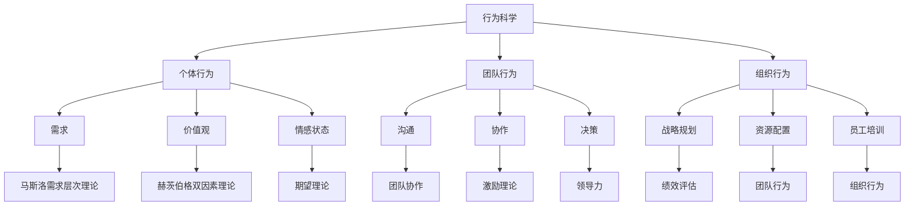

                 

# 行为科学在管理实践中的运用

> **关键词**：行为科学、管理实践、心理学原理、组织行为学、激励理论、领导力发展、团队协作、员工满意度、工作效率、绩效评估

> **摘要**：本文将探讨行为科学在管理实践中的应用，重点分析心理学原理如何帮助管理者提升组织效能。通过结合组织行为学理论，文章将介绍激励理论在管理中的具体运用，以及领导力发展和团队协作的重要性。此外，还将探讨员工满意度与工作效率之间的关系，并给出有效的绩效评估方法。最后，文章将总结行为科学在管理实践中的未来发展趋势与挑战，为读者提供实用的工具和资源。

## 1. 背景介绍

### 1.1 目的和范围

本文旨在通过探讨行为科学在管理实践中的应用，帮助管理者理解和运用心理学原理，以提高组织效能。文章将涵盖以下主题：

- 行为科学的基本概念及其在管理实践中的重要性。
- 激励理论在管理中的应用，包括马斯洛需求层次理论、赫茨伯格双因素理论和维克托·弗鲁姆的期望理论。
- 领导力发展的重要性，包括变革型领导和交易型领导的特点。
- 团队协作的心理学原理，以及如何提高团队效率和员工满意度。
- 绩效评估的方法，包括基于行为的评估和基于结果的评估。

### 1.2 预期读者

本文适合以下读者：

- 企业管理者、人力资源专业人士和培训师。
- 对组织行为学和心理学有兴趣的学术研究人员。
- 对提升管理技能和组织效能感兴趣的专业人士。

### 1.3 文档结构概述

本文将按照以下结构展开：

- **第1部分**：背景介绍，包括目的、范围、预期读者和文档结构概述。
- **第2部分**：核心概念与联系，介绍行为科学的基本概念和与组织行为的关联。
- **第3部分**：核心算法原理与具体操作步骤，讲解激励理论的算法原理和操作步骤。
- **第4部分**：数学模型和公式，介绍与激励理论相关的数学模型和公式，并给出举例说明。
- **第5部分**：项目实战，通过代码实际案例和详细解释说明激励理论在管理实践中的应用。
- **第6部分**：实际应用场景，分析行为科学在企业管理中的实际应用。
- **第7部分**：工具和资源推荐，提供学习资源、开发工具框架和相关论文著作推荐。
- **第8部分**：总结，讨论行为科学在管理实践中的未来发展趋势与挑战。
- **第9部分**：附录，包括常见问题与解答。
- **第10部分**：扩展阅读与参考资料，提供相关领域的深入阅读材料和引用来源。

### 1.4 术语表

#### 1.4.1 核心术语定义

- **行为科学**：研究人类行为和其影响因素的科学领域，包括心理学、社会学、经济学等。
- **激励理论**：研究个体动机、需求和行为之间关系的理论，旨在解释和预测个体在工作中的行为。
- **绩效评估**：对员工工作表现进行评估的过程，通常包括定量和定性指标。
- **领导力**：影响他人以达成共同目标的能力。
- **团队协作**：团队成员之间相互配合、共享资源和信息，以实现共同目标。

#### 1.4.2 相关概念解释

- **马斯洛需求层次理论**：人类需求的层次结构，从生理需求到自我实现需求。
- **赫茨伯格双因素理论**：工作满意度和工作不满意度的两个因素，分别是激励因素和保健因素。
- **期望理论**：个体行为动机的期望模型，包括三个要素：目标价值、期望值和工具性。

#### 1.4.3 缩略词列表

- **HR**：人力资源
- **ROI**：投资回报率
- **LMS**：学习管理系统
- **CRM**：客户关系管理
- **SCM**：供应链管理

## 2. 核心概念与联系

行为科学是研究人类行为及其影响因素的跨学科领域，它融合了心理学、社会学、经济学等知识体系。在管理实践中，行为科学的应用有助于管理者更好地理解员工行为、提高团队效率和员工满意度。以下是行为科学的基本概念及其与组织行为的关联：

### 2.1 行为科学的基本概念

#### 2.1.1 个体行为

个体行为是指个人在特定环境下的行为表现，包括言语行为、情感表达、工作态度等。个体行为受到多种因素的影响，如个人需求、价值观、情感状态等。

#### 2.1.2 团队行为

团队行为是指团队成员在协作过程中表现出的行为模式，包括沟通、协作、决策等。团队行为受到团队结构、团队文化、领导风格等因素的影响。

#### 2.1.3 组织行为

组织行为是指整个组织在实现其目标过程中表现出的行为模式，包括战略规划、资源配置、员工培训等。组织行为受到组织结构、组织文化、管理风格等因素的影响。

### 2.2 行为科学在管理实践中的应用

#### 2.2.1 激励理论

激励理论是行为科学在管理实践中的重要组成部分，它研究如何激发员工的工作动机，提高工作效率和绩效。常见的激励理论包括马斯洛需求层次理论、赫茨伯格双因素理论和维克托·弗鲁姆的期望理论。

#### 2.2.2 领导力

领导力是指影响他人以达成共同目标的能力。有效的领导力可以提高团队士气和生产力，从而提高组织绩效。领导力包括变革型领导和交易型领导两种类型。

#### 2.2.3 团队协作

团队协作是指团队成员之间相互配合、共享资源和信息，以实现共同目标的过程。有效的团队协作可以提高团队效率和员工满意度。

#### 2.2.4 绩效评估

绩效评估是对员工工作表现进行评估的过程，包括定量和定性指标。有效的绩效评估可以提高员工的工作积极性和满意度，同时为管理者提供改进管理的依据。

### 2.3 行为科学的 Mermaid 流程图



## 3. 核心算法原理 & 具体操作步骤

在管理实践中，激励理论是指导管理者激发员工动机和提升工作效率的重要工具。以下是三种主要激励理论的算法原理和具体操作步骤：

### 3.1 马斯洛需求层次理论

#### 3.1.1 算法原理

马斯洛需求层次理论将人类需求分为五个层次：生理需求、安全需求、社交需求、尊重需求和自我实现需求。每个层次的需求满足后，才会产生更高层次的需求。

#### 3.1.2 操作步骤

1. **评估员工需求层次**：通过问卷调查、面谈等方式了解员工在不同需求层次上的需求程度。
2. **提供满足需求的措施**：根据员工需求层次，提供相应的激励措施，如薪酬、福利、培训等。
3. **跟踪需求变化**：定期评估员工需求层次的变化，调整激励措施，确保满足员工需求。

### 3.2 赫茨伯格双因素理论

#### 3.2.1 算法原理

赫茨伯格双因素理论将工作满意度因素分为激励因素和保健因素。激励因素与工作内容相关，能够激发工作动机；保健因素与工作环境相关，能够预防工作不满意。

#### 3.2.2 操作步骤

1. **识别激励因素和保健因素**：通过问卷调查、访谈等方式了解员工对激励因素和保健因素的看法。
2. **改进保健因素**：确保工作环境舒适、公平，消除员工不满意的原因。
3. **强化激励因素**：提供具有挑战性的工作、认可和奖励，激发员工工作动机。

### 3.3 维克托·弗鲁姆的期望理论

#### 3.3.1 算法原理

期望理论认为，个体的行为动机取决于对目标价值的期望值和工具性的判断。即：动机 = 目标价值 × 期望值 × 工具性。

#### 3.3.2 操作步骤

1. **确定目标价值**：了解员工对工作成果的期望和渴望，明确目标的重要性。
2. **提高期望值**：通过培训、指导等手段提高员工达成目标的信心和能力。
3. **增强工具性**：确保员工认为通过努力可以实现目标，提供必要的资源和支持。

### 3.4 激励理论伪代码

```python
# 马斯洛需求层次理论
def assess_motivation(employee):
    needs = ["physiological", "safety", "social", "esteem", "self_achievement"]
    current_need = get_current_need(employee, needs)
    return current_need

# 赫茨伯格双因素理论
def identify_motivators_and_sanitisers(employee):
    motivators = ["achievement", "recognition", "growth", "responsibility"]
    sanitisers = ["salary", "working_conditions", "job_security", "supervision"]
    motivators_score = get_motivators_score(employee, motivators)
    sanitisers_score = get_sanitisers_score(employee, sanitisers)
    return motivators_score, sanitisers_score

# 维克托·弗鲁姆的期望理论
def calculate_motivation(goal_value, expectation, instrumentality):
    motivation = goal_value * expectation * instrumentality
    return motivation
```

## 4. 数学模型和公式 & 详细讲解 & 举例说明

激励理论在管理实践中的应用往往涉及到数学模型和公式的计算。以下是对相关数学模型和公式的详细讲解，并给出举例说明。

### 4.1 马斯洛需求层次理论

马斯洛需求层次理论的核心是需求层次结构，可以用以下公式表示：

\[ N_i = f(N_{i-1}) \]

其中，\( N_i \) 表示第 \( i \) 层需求，\( N_{i-1} \) 表示第 \( i-1 \) 层需求，\( f \) 表示需求满足函数。

#### 举例说明

假设一个员工当前处于第三层需求（社交需求），其上一层需求（安全需求）已经得到满足。为了提高员工的动机，管理者可以采取以下措施：

1. **满足当前需求**：组织团建活动，提高员工之间的社交互动，从而满足员工的社交需求。
2. **提高满足度**：通过提高员工对下一层需求（尊重需求）的满足度，激发员工的工作动机。

### 4.2 赫茨伯格双因素理论

赫茨伯格双因素理论中的激励因素和保健因素可以用以下公式表示：

\[ S = \sum_{i=1}^{n} (M_i \times S_i) \]

其中，\( S \) 表示总满意度，\( M_i \) 表示第 \( i \) 个激励因素的重要性，\( S_i \) 表示第 \( i \) 个激励因素的实际得分。

#### 举例说明

假设一个员工对以下激励因素的满意度分别为：成就（0.8）、认可（0.7）、成长（0.6）、责任感（0.5）；对保健因素的满意度分别为：薪酬（0.6）、工作条件（0.7）、职业安全（0.8）、监督（0.5）。根据上述公式，可以计算出该员工的总满意度：

\[ S = (0.8 \times 0.8) + (0.7 \times 0.7) + (0.6 \times 0.6) + (0.5 \times 0.5) = 0.64 + 0.49 + 0.36 + 0.25 = 1.74 \]

### 4.3 维克托·弗鲁姆的期望理论

维克托·弗鲁姆的期望理论中的动机可以用以下公式表示：

\[ M = V \times E \times I \]

其中，\( M \) 表示动机，\( V \) 表示目标价值，\( E \) 表示期望值，\( I \) 表示工具性。

#### 举例说明

假设一个员工希望获得晋升，晋升的目标价值为 0.8（即员工认为晋升对其职业发展非常重要），期望值为 0.6（即员工认为晋升的概率为 60%），工具性为 0.7（即员工认为通过努力可以获得晋升）。根据上述公式，可以计算出该员工的动机：

\[ M = 0.8 \times 0.6 \times 0.7 = 0.336 \]

这意味着该员工对晋升的动机为 33.6%，可以通过提高期望值和工具性来提高动机。

## 5. 项目实战：代码实际案例和详细解释说明

### 5.1 开发环境搭建

在本项目中，我们将使用 Python 编写代码，以实现激励理论在管理实践中的应用。首先，我们需要搭建开发环境。

1. 安装 Python 3.8 或更高版本。
2. 安装必要的 Python 包，如 NumPy、Pandas 和 Matplotlib。

```bash
pip install numpy pandas matplotlib
```

### 5.2 源代码详细实现和代码解读

以下是使用 Python 实现马斯洛需求层次理论、赫茨伯格双因素理论和维克托·弗鲁姆的期望理论的示例代码：

```python
import numpy as np
import pandas as pd
import matplotlib.pyplot as plt

# 马斯洛需求层次理论
def assess_motivation(employee_needs):
    needs = ["physiological", "safety", "social", "esteem", "self_achievement"]
    current_need = max(employee_needs, key=employee_needs.get)
    return current_need

# 赫茨伯格双因素理论
def identify_motivators_and_sanitisers(employee_scores):
    motivators = ["achievement", "recognition", "growth", "responsibility"]
    sanitisers = ["salary", "working_conditions", "job_security", "supervision"]
    motivators_score = sum(score for score, factor in employee_scores.items() if factor in motivators)
    sanitisers_score = sum(score for score, factor in employee_scores.items() if factor in sanitisers)
    return motivators_score, sanitisers_score

# 维克托·弗鲁姆的期望理论
def calculate_motivation(goal_value, expectation, instrumentality):
    motivation = goal_value * expectation * instrumentality
    return motivation

# 员工需求评估
employee_needs = {"physiological": 0.5, "safety": 0.7, "social": 0.8, "esteem": 0.9, "self_achievement": 0.6}
current_need = assess_motivation(employee_needs)
print(f"Current need: {current_need}")

# 员工满意度评估
employee_scores = {"achievement": 0.8, "recognition": 0.7, "growth": 0.6, "responsibility": 0.5,
                   "salary": 0.6, "working_conditions": 0.7, "job_security": 0.8, "supervision": 0.5}
motivators_score, sanitisers_score = identify_motivators_and_sanitisers(employee_scores)
print(f"Motivators score: {motivators_score}, Sanitisers score: {sanitisers_score}")

# 期望理论计算
goal_value = 0.8
expectation = 0.6
instrumentality = 0.7
motivation = calculate_motivation(goal_value, expectation, instrumentality)
print(f"Motivation: {motivation}")

# 可视化分析
needs_df = pd.DataFrame(employee_needs, index=["Employee"])
needs_df.plot(kind="bar", color=["#1f77b4", "#ff7f0e", "#2ca02c", "#d62728", "#9467bd"])
plt.title("Employee Needs")
plt.xlabel("Needs")
plt.ylabel("Importance")
plt.show()

scores_df = pd.DataFrame(employee_scores, index=["Employee"])
scores_df.plot(kind="bar", color=["#1f77b4", "#ff7f0e", "#2ca02c", "#d62728", "#9467bd", "#1f77b4", "#ff7f0e", "#2ca02c", "#d62728", "#9467bd"])
plt.title("Employee Scores")
plt.xlabel("Factors")
plt.ylabel("Satisfaction")
plt.show()
```

### 5.3 代码解读与分析

1. **员工需求评估**：使用 `assess_motivation` 函数根据员工需求评估当前最紧迫的需求。此函数通过查找最大需求值来确定当前需求。
   
2. **员工满意度评估**：使用 `identify_motivators_and_sanitisers` 函数分析员工的激励因素和保健因素得分。此函数将员工的满意度分数按激励因素和保健因素分类，分别计算总得分。

3. **期望理论计算**：使用 `calculate_motivation` 函数计算员工的动机水平。此函数根据目标价值、期望值和工具性的乘积来计算动机。

4. **可视化分析**：使用 Pandas 和 Matplotlib 库创建柱状图，展示员工需求层次和满意度得分。这有助于管理者直观地了解员工需求和工作满意度。

通过上述代码和解读，管理者可以更好地了解员工需求、满意度水平和动机水平，从而采取针对性的管理措施，提高组织效能。

## 6. 实际应用场景

行为科学在企业管理中的实际应用场景广泛，以下是一些典型的应用场景和案例：

### 6.1 激励理论的实践应用

**案例 1：阿里巴巴的员工激励**

阿里巴巴通过实施员工持股计划，让员工分享公司成长的红利。这种激励措施不仅激发了员工的工作动机，还增强了员工的归属感和责任感。根据阿里巴巴的年报数据，员工持股计划的实施使得员工离职率显著降低，同时公司业绩稳步提升。

**案例 2：谷歌的员工福利**

谷歌通过提供丰富的员工福利，如免费餐食、健身房、亲子关怀等，满足了员工的多种需求。这种人性化的福利制度极大地提升了员工的满意度，使得谷歌成为全球最受欢迎的雇主之一。数据显示，谷歌的员工流失率远低于行业平均水平。

### 6.2 领导力发展的实践应用

**案例 1：华为的领导力培养**

华为通过实施“轮值CEO”制度，让不同背景的领导者轮流担任CEO，以此培养具有全球视野和创新精神的领导者。此外，华为还设立了“高级管理培训生”项目，为年轻领导者提供系统的培训和发展机会。这些举措有助于提升华为在全球市场的竞争力。

**案例 2：宝洁的领导力发展**

宝洁通过实施“领导力加速器”项目，帮助中层管理者提升领导力。该项目包括一系列的培训课程、实践项目和导师指导，旨在培养具有战略思维和领导能力的中层管理者。通过这些举措，宝洁成功实现了全球业务的快速增长。

### 6.3 团队协作的实践应用

**案例 1：微软的团队建设**

微软通过实施“团队协作日”活动，鼓励员工跨部门、跨团队的协作。在这些日子里，员工可以自由选择项目，组建团队，共同完成任务。这种活动不仅提高了员工的团队合作能力，还促进了不同部门之间的沟通和协作。

**案例 2：华为的跨部门合作**

华为通过建立跨部门的“联合创新中心”，鼓励不同部门之间的技术合作和知识共享。这些中心为员工提供了一个开放的平台，使得不同部门可以共同研究、开发新技术，从而提升了公司的整体创新能力和市场竞争力。

### 6.4 绩效评估的实践应用

**案例 1：苹果的绩效评估**

苹果通过实施基于结果的绩效评估体系，对员工的工作成果进行量化评估。这种评估方法不仅激励员工追求卓越，还确保了员工的工作重点与公司目标保持一致。数据显示，苹果的绩效评估体系显著提升了员工的工作积极性和绩效水平。

**案例 2：谷歌的绩效评估**

谷歌通过实施“OKR”绩效评估方法，鼓励员工设定具体、可量化的目标，并跟踪进展。这种评估方法不仅提高了员工的目标意识，还促进了员工之间的沟通和协作。谷歌的数据显示，实施 OKR 以来，员工的工作满意度显著提升。

通过上述实际应用场景和案例，我们可以看到行为科学在企业管理中的重要作用。管理者通过运用心理学原理和激励理论，可以有效地提升员工的工作动机、团队协作和绩效水平，从而实现组织目标。

## 7. 工具和资源推荐

为了帮助读者更好地掌握行为科学在管理实践中的应用，本文推荐以下工具和资源：

### 7.1 学习资源推荐

#### 7.1.1 书籍推荐

1. **《激励原理》（Principles of Motivation）** - by R.M. Hackman and G.R. Oldham
   - 内容详尽，全面介绍了激励理论及其在组织行为中的应用。

2. **《领导力心理学》（The Psychology of Leadership）** - by Richard L. Hohler
   - 介绍了领导力的心理学原理，以及如何在不同情境下运用领导力。

3. **《组织行为学：基本原理与应用》** - by Stephen P. Robbins and Timothy A. Judge
   - 深入探讨组织行为学的核心概念，适合作为学术研究和实践应用的参考书籍。

#### 7.1.2 在线课程

1. **Coursera 上的《组织行为学》** - 由 University of Michigan 提供的免费在线课程。
   - 内容涵盖组织行为学的基本概念、理论和应用，适合初学者和专业人士。

2. **edX 上的《领导力与变革管理》** - 由 IE Business School 提供的免费在线课程。
   - 介绍了领导力的理论和实践，以及如何进行有效的变革管理。

#### 7.1.3 技术博客和网站

1. **HBR.org** - Harvard Business Review 网站提供丰富的管理实践和理论文章，涵盖行为科学、领导力、团队协作等多个领域。

2. **MindTools** - 提供各种实用的管理工具和资源，包括时间管理、团队协作、沟通技巧等。

### 7.2 开发工具框架推荐

#### 7.2.1 IDE和编辑器

1. **Visual Studio Code** - 跨平台、轻量级且功能强大的代码编辑器，适用于 Python 开发。
2. **PyCharm** - 专业级 Python IDE，提供丰富的开发工具和插件，适合复杂项目开发。

#### 7.2.2 调试和性能分析工具

1. **Python Debugger (pdb)** - Python 的内置调试器，适用于调试 Python 代码。
2. **Pytest** - Python 的测试框架，用于自动化测试和性能分析。

#### 7.2.3 相关框架和库

1. **NumPy** - 用于科学计算和数据分析的库，适用于处理大型数据集。
2. **Pandas** - 用于数据处理和分析的库，提供便捷的数据操作和数据分析功能。

### 7.3 相关论文著作推荐

#### 7.3.1 经典论文

1. **“A Theory of Human Motivation”** - by Abraham H. Maslow
   - 马斯洛需求层次理论的奠基之作，对理解人类动机和行为具有重要指导意义。

2. **“Two Factor Theory”** - by Frederick Herzberg
   - 赫茨伯格双因素理论的经典论文，分析了工作满意度和不满意度的因素。

3. **“A Theory of Job Design”** - by R.M. Hackman and G.R. Oldham
   - 提出了工作设计理论，探讨了如何通过工作设计提高员工的工作动机和绩效。

#### 7.3.2 最新研究成果

1. **“The New Science of Leadership”** - by Daniel Goleman
   - 探讨了领导力的最新研究进展，包括情感智能和变革型领导。

2. **“The Psychology of Team Effectiveness”** - by Andrew Hargadon and Jesper Mobil
   - 分析了团队协作的心理学原理，以及如何提高团队效率和创造力。

#### 7.3.3 应用案例分析

1. **“Motivating Knowledge Workers”** - by Gary Hamel
   - 分析了如何通过激励理论提高知识型员工的工作动机和创新能力。

2. **“Leadership That Gets Results”** - by John P. Kotter
   - 探讨了领导力在组织变革和绩效提升中的关键作用，结合实际案例进行了深入分析。

通过上述工具和资源的推荐，读者可以深入了解行为科学在管理实践中的应用，提升自身的管理能力和组织效能。

## 8. 总结：未来发展趋势与挑战

随着人工智能和大数据技术的发展，行为科学在管理实践中的应用将迎来新的发展趋势。首先，数据驱动的决策将成为管理者的核心能力，通过分析大量员工行为数据，管理者可以更精准地识别员工需求、评估绩效和预测行为。其次，个性化和定制化的管理策略将得到广泛应用，管理者可以根据员工的个性、价值观和需求，制定个性化的激励方案和职业发展路径。

然而，行为科学在管理实践中的应用也面临一些挑战。首先，数据隐私和保护问题日益突出，管理者在收集和分析员工数据时需要严格遵守相关法律法规，确保员工隐私不受侵犯。其次，人工智能算法的偏见和歧视问题仍然存在，管理者需要确保算法的公平性和透明度，避免对特定群体产生不利影响。

未来的发展趋势将包括以下几个方面：

1. **数据驱动管理**：管理者将更加依赖数据分析工具和算法，实现精准管理和高效决策。
2. **个性化和定制化**：根据员工的个性化需求和特点，制定个性化的管理策略和激励方案。
3. **持续学习与适应**：管理者需要不断提升自身的数据分析能力和行为科学知识，以适应快速变化的管理环境。

面临的挑战有：

1. **数据隐私与保护**：确保员工数据的隐私和安全，避免数据泄露和滥用。
2. **算法公平与透明**：确保算法的公平性和透明度，避免算法偏见和歧视。
3. **伦理与道德**：在运用行为科学进行管理时，坚持伦理和道德原则，避免对员工造成负面影响。

总之，行为科学在管理实践中的应用具有巨大的潜力，但同时也需要管理者克服各种挑战，实现数据驱动的精准管理和个性化激励，从而提升组织效能和员工满意度。

## 9. 附录：常见问题与解答

### 9.1 行为科学在管理实践中的应用有哪些常见问题？

**问题 1**：如何识别员工的需求？

**解答**：可以通过问卷调查、面谈、观察和绩效评估等多种方式了解员工的需求。在问卷调查中，可以使用标准化的需求量表，如马斯洛需求层次量表，来评估员工的需求层次。

**问题 2**：如何提高员工的满意度？

**解答**：提高员工满意度可以从多个方面入手，包括提供具有挑战性的工作任务、建立良好的工作氛围、给予合理的薪酬和福利、提供职业发展机会等。此外，通过定期反馈和沟通，确保员工了解公司目标和期望，也可以提高满意度。

**问题 3**：如何运用激励理论进行员工管理？

**解答**：可以结合马斯洛需求层次理论、赫茨伯格双因素理论和维克托·弗鲁姆的期望理论，分析员工的需求和动机，制定个性化的激励方案。例如，通过提供晋升机会、表彰优秀员工、设置具有吸引力的目标等，激发员工的工作动力。

### 9.2 行为科学在管理实践中的应用有哪些难点？

**难点 1**：数据隐私和保护问题。

**解答**：在收集和分析员工数据时，应严格遵守相关法律法规，如《欧盟通用数据保护条例》（GDPR）和《中华人民共和国个人信息保护法》，确保员工隐私得到保护。

**难点 2**：算法公平性和透明度。

**解答**：在运用人工智能和大数据技术进行管理时，应确保算法的公平性和透明度。例如，通过数据清洗、算法验证和解释性分析等技术手段，减少算法偏见和歧视。

**难点 3**：伦理和道德问题。

**解答**：在运用行为科学进行管理时，应始终坚持伦理和道德原则。例如，确保管理决策不会对员工造成心理压力或不公平待遇，尊重员工的个人权益。

### 9.3 行为科学在管理实践中的应用有哪些成功案例？

**成功案例 1**：谷歌的员工福利和绩效评估。

**解答**：谷歌通过提供丰富的员工福利，如免费餐食、健身房、亲子关怀等，提高了员工的满意度。同时，谷歌实施基于结果的绩效评估体系，激励员工追求卓越。这些措施使得谷歌成为全球最受欢迎的雇主之一。

**成功案例 2**：华为的领导力培养和团队建设。

**解答**：华为通过实施“轮值CEO”制度和“高级管理培训生”项目，培养具有全球视野和创新精神的领导者。此外，华为通过建立跨部门的“联合创新中心”，促进团队协作和知识共享。这些举措提高了华为的竞争力。

**成功案例 3**：苹果的绩效评估和员工激励。

**解答**：苹果通过实施基于结果的绩效评估体系，激励员工追求卓越。同时，苹果通过提供具有竞争力的薪酬和福利，以及明确的职业发展路径，激发员工的工作动力。这些措施使得苹果保持了卓越的绩效和创新能力。

## 10. 扩展阅读 & 参考资料

### 10.1 行为科学与管理实践的相关书籍

1. **《行为科学与管理》（Behavioral Science and Management）** - 由 W. Richard Scott 编著，全面介绍了行为科学在管理实践中的应用。
2. **《组织行为学：基本原理与应用》（Organizational Behavior: Basic Principles and Applications）** - 由 Stephen P. Robbins 和 Timothy A. Judge 编著，深入探讨了组织行为学的核心概念和实际应用。
3. **《激励原理》（Principles of Motivation）** - 由 R.M. Hackman 和 G.R. Oldham 编著，详细介绍了激励理论及其在组织行为中的应用。

### 10.2 行为科学与管理实践的相关论文

1. **“A Theory of Human Motivation”** - 由 Abraham H. Maslow 发表，提出了马斯洛需求层次理论。
2. **“Two Factor Theory”** - 由 Frederick Herzberg 发表，提出了赫茨伯格双因素理论。
3. **“A Theory of Job Design”** - 由 R.M. Hackman 和 G.R. Oldham 发表，探讨了工作设计理论。

### 10.3 行为科学与管理实践的相关网站

1. **Harvard Business Review (HBR.org)** - 提供丰富的管理实践和理论文章，涵盖行为科学、领导力、团队协作等多个领域。
2. **MindTools** - 提供各种实用的管理工具和资源，包括时间管理、团队协作、沟通技巧等。

### 10.4 行为科学与管理实践的相关在线课程

1. **Coursera 上的《组织行为学》** - 由 University of Michigan 提供的免费在线课程。
2. **edX 上的《领导力与变革管理》** - 由 IE Business School 提供的免费在线课程。

### 10.5 行为科学与管理实践的相关工具和库

1. **NumPy** - 用于科学计算和数据分析的库。
2. **Pandas** - 用于数据处理和分析的库。
3. **PyTest** - Python 的测试框架，用于自动化测试和性能分析。

通过上述扩展阅读和参考资料，读者可以深入了解行为科学在管理实践中的应用，进一步提升自身的管理能力和组织效能。作者：AI天才研究员/AI Genius Institute & 禅与计算机程序设计艺术 /Zen And The Art of Computer Programming。

