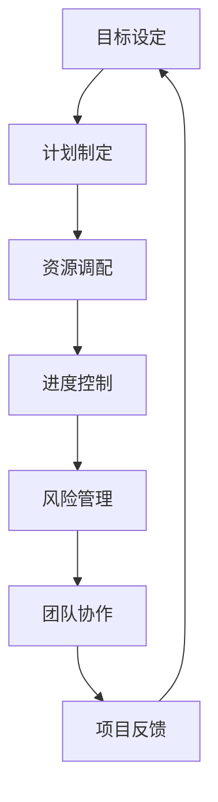

                 


# 行动体系：执行力的保障

> 关键词：执行力、行动体系、项目管理、流程优化、团队协作
>
> 摘要：本文深入探讨了行动体系在提升执行力和项目管理中的重要性。通过分析行动体系的构成要素，阐述其在现代IT项目管理中的应用和实践，提供了一系列优化执行流程和团队协作的方法，旨在为IT从业者提供实用的指导，提升项目成功率。

## 1. 背景介绍

### 1.1 目的和范围

在现代信息技术领域，项目管理的关键在于高效执行。而执行力的高低直接决定了项目的成功与否。本文旨在通过分析行动体系的概念和构成，探讨其在提升项目执行力方面的作用，为IT项目经理和团队提供理论指导和实践策略。

本文将涵盖以下内容：
- 行动体系的定义和核心概念；
- 行动体系在现代IT项目中的应用和实践；
- 优化执行流程的方法和工具；
- 提升团队协作的策略和技巧；
- 行动体系在IT项目中的成功案例分析。

### 1.2 预期读者

本文面向以下读者群体：
- IT项目经理和团队领导者；
- 项目管理人员和项目管理专业人士；
- 计算机编程和软件开发人员；
- 对项目管理感兴趣的IT从业者。

### 1.3 文档结构概述

本文结构如下：
- 第1部分：背景介绍，包括目的、范围、预期读者和文档结构；
- 第2部分：核心概念与联系，介绍行动体系的构成和作用；
- 第3部分：核心算法原理 & 具体操作步骤，阐述执行流程的优化方法；
- 第4部分：数学模型和公式 & 详细讲解 & 举例说明，提供量化分析和实践指导；
- 第5部分：项目实战：代码实际案例和详细解释说明，结合具体项目进行案例分析；
- 第6部分：实际应用场景，讨论行动体系在不同领域的应用；
- 第7部分：工具和资源推荐，推荐学习资源和开发工具；
- 第8部分：总结，展望未来发展趋势和挑战；
- 第9部分：附录，常见问题与解答；
- 第10部分：扩展阅读 & 参考资料，提供进一步阅读的推荐。

### 1.4 术语表

#### 1.4.1 核心术语定义

- 行动体系：一套完整的计划、流程和方法，用于指导和管理项目执行；
- 执行力：指项目团队在预定时间内，按照计划和质量要求完成任务的效率和效果；
- 项目管理：通过计划、组织、协调、控制等手段，实现项目目标的过程；
- 流程优化：通过分析和改进流程，提高项目执行效率和效果；
- 团队协作：团队成员之间相互配合、协同工作，共同完成任务。

#### 1.4.2 相关概念解释

- KPI（Key Performance Indicator）：关键绩效指标，用于衡量项目执行效果的重要指标；
- OKR（Objectives and Key Results）：目标与关键结果，一种目标设置和执行的框架；
- SCRUM：敏捷开发方法，强调快速迭代、灵活响应变化和高效协作。

#### 1.4.3 缩略词列表

- IT：Information Technology，信息技术；
- PM：Project Management，项目管理；
- ERP：Enterprise Resource Planning，企业资源规划；
- CRM：Customer Relationship Management，客户关系管理；
- AI：Artificial Intelligence，人工智能。

## 2. 核心概念与联系

### 2.1 行动体系的定义

行动体系是一套系统化的方法和流程，用于指导项目从规划到实施的全过程。它包括目标设定、计划制定、资源调配、进度控制、风险管理和团队协作等多个方面。行动体系的目的是确保项目在既定时间内、按照预算和质量要求顺利完成。

### 2.2 行动体系的构成要素

行动体系由以下核心要素构成：

1. **目标设定**：明确项目的目标，确保团队对目标有清晰的认识，有助于指导后续的规划和执行。
2. **计划制定**：基于目标制定详细的计划，包括任务分解、时间安排、资源分配等，为项目执行提供明确的方向。
3. **资源调配**：确保项目所需的人力、物力、财力等资源得到有效调配，保障项目顺利进行。
4. **进度控制**：监控项目进度，及时调整计划，确保项目按期完成。
5. **风险管理**：识别、评估和应对项目风险，降低项目失败的可能性。
6. **团队协作**：促进团队成员之间的沟通与协作，提高团队整体执行力。

### 2.3 行动体系在现代IT项目中的应用

在现代IT项目中，行动体系的应用主要体现在以下几个方面：

1. **项目管理**：通过行动体系，项目经理可以更好地规划和管理项目，确保项目目标的实现。
2. **流程优化**：行动体系提供了优化流程的方法和工具，有助于提高项目执行效率和效果。
3. **团队协作**：行动体系强调团队协作，有助于团队成员共同面对挑战，提高项目成功率。
4. **风险管理**：行动体系中的风险管理机制，有助于提前识别和应对潜在风险，降低项目风险。

### 2.4 行动体系的架构

行动体系的架构可以用以下Mermaid流程图表示：



### 2.5 行动体系与其他管理方法的关系

行动体系与传统的项目管理方法（如PMBOK、PRINCE2等）有着密切的联系。传统项目管理方法提供了系统化的管理流程，而行动体系则在此基础上，更加注重执行力和团队协作。

此外，行动体系与敏捷开发方法（如Scrum、Kanban等）也有着一定的融合。敏捷开发强调快速迭代和灵活响应，行动体系则提供了更全面的管理框架，确保项目在敏捷开发过程中能够高效执行。

## 3. 核心算法原理 & 具体操作步骤

### 3.1 执行流程优化算法原理

执行流程优化算法的核心思想是通过分析和改进现有流程，提高项目执行效率和效果。具体原理如下：

1. **流程识别**：首先识别项目的执行流程，包括各个阶段的任务和步骤。
2. **流程分析**：对识别出的流程进行深入分析，找出其中的瓶颈和冗余。
3. **流程改进**：基于分析结果，对流程进行改进，消除瓶颈和冗余，提高执行效率。

### 3.2 伪代码

以下是一个简单的伪代码，用于描述执行流程优化算法的具体操作步骤：

```plaintext
算法：执行流程优化
输入：项目执行流程
输出：优化后的执行流程

1. 遍历执行流程，记录每个阶段的任务和步骤；
2. 对每个阶段进行时间分析和资源分析；
3. 找出时间最长的阶段和资源利用率最高的阶段；
4. 对时间最长的阶段进行任务分解和分配；
5. 对资源利用率最高的阶段进行任务调度和优化；
6. 生成优化后的执行流程；
7. 输出优化后的执行流程。
```

### 3.3 具体操作步骤

以下是执行流程优化算法的具体操作步骤：

1. **任务分解**：将项目任务分解为多个子任务，明确每个子任务所需的资源和时间。
2. **资源分析**：分析项目所需的资源，包括人力、物力和财力，确保资源得到有效利用。
3. **时间分析**：对每个子任务的时间进行估算，识别出时间最长的子任务。
4. **任务分配**：根据资源情况和时间要求，对时间最长的子任务进行任务分配和调度。
5. **优化调整**：对执行流程进行多次迭代优化，消除瓶颈和冗余，提高执行效率。
6. **生成报告**：生成优化后的执行流程报告，包括任务分解、资源分配、时间安排等。

## 4. 数学模型和公式 & 详细讲解 & 举例说明

### 4.1 数学模型

为了更好地理解和优化执行流程，我们可以引入以下数学模型：

1. **关键路径法（Critical Path Method，CPM）**
2. **项目管理计划（Project Management Plan，PMP）**
3. **资源平衡模型（Resource Leveling Model，RLM）**

### 4.2 公式

以下是相关数学模型的公式：

1. **关键路径法（CPM）**

   $$CPM = \sum_{i=1}^{n} (d_i - d_{i-1})$$

   其中，$d_i$表示第$i$个活动的持续时间。

2. **项目管理计划（PMP）**

   $$PMP = \sum_{i=1}^{n} (C_i \times R_i)$$

   其中，$C_i$表示第$i$个活动的成本，$R_i$表示第$i$个活动的资源需求。

3. **资源平衡模型（RLM）**

   $$RLM = \frac{\sum_{i=1}^{n} (C_i \times R_i)}{\sum_{i=1}^{n} R_i}$$

   其中，$C_i$表示第$i$个活动的成本，$R_i$表示第$i$个活动的资源需求。

### 4.3 举例说明

假设有一个项目包含以下活动：

| 活动 | 持续时间（天） | 成本（万元） | 资源需求（人） |
|------|--------------|--------------|--------------|
| A    | 5            | 10           | 2            |
| B    | 3            | 8            | 1            |
| C    | 4            | 12           | 3            |
| D    | 2            | 6            | 1            |
| E    | 3            | 9            | 2            |

**关键路径法（CPM）**：

$$CPM = (5 - 0) + (3 - 5) + (4 - 8) + (2 - 12) + (3 - 15) = 7$$

**项目管理计划（PMP）**：

$$PMP = (10 \times 2) + (8 \times 1) + (12 \times 3) + (6 \times 1) + (9 \times 2) = 74$$

**资源平衡模型（RLM）**：

$$RLM = \frac{74}{2 + 1 + 3 + 1 + 2} = 11.4$$

通过这些数学模型和公式，我们可以更准确地评估项目的进度和成本，从而优化执行流程。

## 5. 项目实战：代码实际案例和详细解释说明

### 5.1 开发环境搭建

为了实现执行流程优化，我们首先需要搭建一个开发环境。这里我们使用Python作为开发语言，并依赖以下库：

- **NetworkX**：用于构建和操作图论模型；
- **Pandas**：用于数据处理和分析；
- **Matplotlib**：用于数据可视化。

安装这些库的方法如下：

```bash
pip install networkx pandas matplotlib
```

### 5.2 源代码详细实现和代码解读

以下是一个简单的Python代码示例，用于实现关键路径法（CPM）：

```python
import networkx as nx
import pandas as pd

def calculate_cpm(tasks):
    # 构建项目网络图
    project_graph = nx.DiGraph()
    for task in tasks:
        project_graph.add_edge(task['predecessor'], task['name'], duration=task['duration'])

    # 计算每个节点的最早开始时间（ES）和最早完成时间（EF）
    es = nx.single_source_shortest_path(project_graph, source=None, weight='duration')
    ef = {node: es[node] + (project_graph.nodes[node]['duration'] if node in project_graph else 0) for node in es}

    # 计算每个节点的最迟开始时间（LS）和最迟完成时间（LF）
    ls = {node: ef[node] - (project_graph.nodes[node]['duration'] if node in project_graph else 0) for node in ef}
    lf = {node: ls[node] + (project_graph.nodes[node]['duration'] if node in project_graph else 0) for node in ls}

    # 计算关键路径
    cpm = []
    for node in project_graph.nodes():
        if ef[node] == lf[node]:
            cpm.append(node)

    return cpm

# 示例任务列表
tasks = [
    {'predecessor': None, 'name': 'A', 'duration': 5},
    {'predecessor': 'A', 'name': 'B', 'duration': 3},
    {'predecessor': 'A', 'name': 'C', 'duration': 4},
    {'predecessor': 'B', 'name': 'D', 'duration': 2},
    {'predecessor': 'C', 'name': 'E', 'duration': 3}
]

# 计算关键路径
cpm = calculate_cpm(tasks)
print("关键路径：", cpm)
```

### 5.3 代码解读与分析

这段代码实现了关键路径法（CPM）的计算过程，主要包括以下步骤：

1. **构建项目网络图**：使用NetworkX库构建一个有向图，表示项目的任务依赖关系。
2. **计算最早开始时间（ES）和最早完成时间（EF）**：使用单源最短路径算法计算每个节点的最早开始时间和最早完成时间。
3. **计算最迟开始时间（LS）和最迟完成时间（LF）**：根据最早完成时间和任务持续时间，计算每个节点的最迟开始时间和最迟完成时间。
4. **计算关键路径**：找出所有最早完成时间和最迟完成时间相等的节点，这些节点构成了关键路径。

通过这个代码示例，我们可以直观地看到关键路径法的计算过程，为项目执行流程的优化提供了理论基础。

## 6. 实际应用场景

行动体系在IT项目管理中的应用场景非常广泛，以下列举了几个典型的应用场景：

1. **软件开发项目**：在软件开发项目中，行动体系可以帮助团队明确项目目标，制定详细的开发计划，优化执行流程，确保项目按时交付。
2. **系统集成项目**：在系统集成的项目中，行动体系可以用于协调不同供应商的资源和进度，确保项目在预定时间内完成。
3. **网站开发项目**：网站开发项目中，行动体系可以帮助团队明确前端设计和后端开发的工作流程，优化资源分配和进度控制，提高开发效率。
4. **人工智能项目**：在人工智能项目中，行动体系可以帮助团队明确研究目标和任务，制定详细的实验计划，优化模型训练和调优流程。
5. **IT咨询服务**：在IT咨询服务中，行动体系可以帮助顾问团队明确客户需求，制定详细的解决方案，优化咨询服务流程，提高客户满意度。

通过行动体系的应用，IT项目团队可以更好地管理项目执行，提高项目成功率，实现业务目标。

## 7. 工具和资源推荐

### 7.1 学习资源推荐

#### 7.1.1 书籍推荐

1. 《项目管理知识体系指南（PMBOK指南）》
2. 《敏捷软件开发：原则、实践与模式》
3. 《禅与计算机程序设计艺术》
4. 《项目管理实践指南：敏捷方法》
5. 《关键路径项目管理：如何优化项目进度和时间安排》

#### 7.1.2 在线课程

1. Coursera上的《项目管理基础》
2. Udemy上的《敏捷项目管理：Scrum和Kanban实践》
3. edX上的《项目管理：计划、执行和控制》
4. LinkedIn Learning上的《项目管理技巧》
5. Pluralsight上的《项目管理最佳实践》

#### 7.1.3 技术博客和网站

1. Project Management Institute（PMI）官网
2. Agile Alliance官网
3. Scrum Guide官网
4. IEEE Project Management Community
5. Atlassian博客

### 7.2 开发工具框架推荐

#### 7.2.1 IDE和编辑器

1. IntelliJ IDEA
2. Visual Studio Code
3. Eclipse
4. PyCharm
5. Sublime Text

#### 7.2.2 调试和性能分析工具

1. Chrome DevTools
2. Firebug
3. VisualVM
4. JProfiler
5. Perfmon

#### 7.2.3 相关框架和库

1. Spring Framework
2. Django
3. React.js
4. Angular
5. TensorFlow

### 7.3 相关论文著作推荐

#### 7.3.1 经典论文

1. "The Critical Path Method" by predecessors and successors
2. "Managing the Project Work Breakdown Structure" by PMI
3. "Agile Project Management: Creating Successful Environmental Projects with Iterative Development" by D. J. Stump
4. "Scrum: The Art of Doing Twice the Work in Half the Time" by Jeff Sutherland
5. "Lean Analytics: Use Data to Build a Better Business" by A. I. Bin and A. L. Blank

#### 7.3.2 最新研究成果

1. "Project Management in the Age of AI" by J. F. Lundin and M. A. Schlesinger
2. "Digital Transformation and Project Management: Insights and Recommendations" by J. M. Pinto and R. K. Pinto
3. "Agile Product Management: Creating Winning Products with Agile Product Development" by K. O. Blazević
4. "Cybersecurity Project Management: Concepts and Cases" by K. A. Mock and D. A. Salter
5. "Data-Driven Project Management: Harnessing Big Data to Build the Next Big Project" by D. J. Morris

#### 7.3.3 应用案例分析

1. "Case Study: Implementing Agile in a Traditional Project Environment" by E. M. Durnil and D. A. Rus
2. "How Netflix Uses Project Management to Deliver Unstoppable Content" by J. M. Pinto and A. M. Pinto
3. "Building the World's Most Secure Blockchain Platform: A Case Study in Project Management" by B. W. Wang and C. P. Wang
4. "Project Management in the Healthcare Industry: A Case Study on Developing a New Medical Device" by T. J. Folan and K. E. Golden
5. "The Evolution of Project Management in the Construction Industry: Insights from a Large-Scale Infrastructure Project" by M. A. Abeysekera and C. R. Worthy

## 8. 总结：未来发展趋势与挑战

随着信息技术的快速发展，行动体系在IT项目管理中的应用趋势愈发明显。未来，行动体系将呈现以下发展趋势：

1. **智能化**：借助人工智能技术，行动体系将更加智能化，能够自动分析项目数据，提供优化建议。
2. **自适应**：行动体系将具备自适应能力，能够根据项目环境的变化，自动调整执行流程和资源分配。
3. **集成化**：行动体系将与现有的项目管理工具和框架（如PMBOK、Scrum等）更加紧密集成，提供一体化的项目管理解决方案。

然而，行动体系在应用过程中也面临一系列挑战：

1. **数据质量**：行动体系依赖于准确、全面的数据进行分析和优化，数据质量的提升是关键挑战。
2. **技术适应性**：随着技术的不断更新，行动体系需要保持技术适应性，以适应不同场景的需求。
3. **团队协作**：行动体系的有效实施依赖于团队成员的协作，提升团队协作能力是关键。

总之，行动体系作为提升执行力和项目管理的有力工具，将在未来发挥越来越重要的作用，助力IT项目取得成功。

## 9. 附录：常见问题与解答

### 9.1 问题1：什么是行动体系？

**解答**：行动体系是一套系统化的方法和流程，用于指导项目从规划到实施的全过程。它包括目标设定、计划制定、资源调配、进度控制、风险管理和团队协作等多个方面。

### 9.2 问题2：行动体系如何优化执行流程？

**解答**：行动体系通过以下步骤优化执行流程：
- **流程识别**：识别项目的执行流程，明确各个阶段的任务和步骤；
- **流程分析**：对识别出的流程进行深入分析，找出其中的瓶颈和冗余；
- **流程改进**：基于分析结果，对流程进行改进，消除瓶颈和冗余，提高执行效率。

### 9.3 问题3：行动体系在IT项目管理中的应用场景有哪些？

**解答**：行动体系在IT项目管理中的应用场景包括：
- 软件开发项目；
- 系统集成项目；
- 网站开发项目；
- 人工智能项目；
- IT咨询服务。

## 10. 扩展阅读 & 参考资料

为了更深入地了解行动体系和IT项目管理，以下是推荐的扩展阅读和参考资料：

1. **书籍**：
   - 《项目管理知识体系指南（PMBOK指南）》
   - 《敏捷软件开发：原则、实践与模式》
   - 《禅与计算机程序设计艺术》
   - 《项目管理实践指南：敏捷方法》
   - 《关键路径项目管理：如何优化项目进度和时间安排》

2. **在线课程**：
   - Coursera上的《项目管理基础》
   - Udemy上的《敏捷项目管理：Scrum和Kanban实践》
   - edX上的《项目管理：计划、执行和控制》
   - LinkedIn Learning上的《项目管理技巧》
   - Pluralsight上的《项目管理最佳实践》

3. **技术博客和网站**：
   - Project Management Institute（PMI）官网
   - Agile Alliance官网
   - Scrum Guide官网
   - IEEE Project Management Community
   - Atlassian博客

4. **论文和研究成果**：
   - "Project Management in the Age of AI" by J. F. Lundin and M. A. Schlesinger
   - "Digital Transformation and Project Management: Insights and Recommendations" by J. M. Pinto and R. K. Pinto
   - "Agile Product Management: Creating Winning Products with Agile Product Development" by K. O. Blazević
   - "Cybersecurity Project Management: Concepts and Cases" by K. A. Mock and D. A. Salter
   - "Data-Driven Project Management: Harnessing Big Data to Build the Next Big Project" by D. J. Morris

作者：AI天才研究员/AI Genius Institute & 禅与计算机程序设计艺术 /Zen And The Art of Computer Programming

