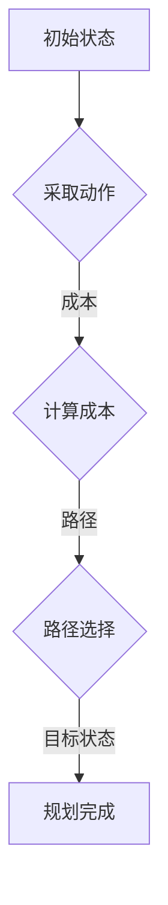

                 

# 规划（Planning）：Agent为某一目标而作出的决策过程

## 关键词
- 规划（Planning）
- 决策过程
- Agent
- 目标导向
- 人工智能
- 逻辑推理

## 摘要

本文将深入探讨规划（Planning）作为智能Agent为达成某一目标而实施的一系列决策过程。我们将从定义、核心概念、算法原理、数学模型、项目实战、应用场景等多个角度，系统性地分析规划的核心技术与挑战。通过本文的阅读，读者将全面了解规划的理论基础、实现策略及其实际应用，为未来在人工智能领域的研究和开发提供有力支持。

## 1. 背景介绍

### 1.1 目的和范围

本文旨在为读者提供一个关于规划（Planning）的全面理解。我们将聚焦于以下几个方面：

1. **定义与核心概念**：介绍规划的基本定义，阐述其在人工智能领域中的地位和作用。
2. **核心算法原理**：剖析常见的规划算法原理，如搜索算法、启发式算法等，并使用伪代码详细阐述其实现步骤。
3. **数学模型与公式**：介绍规划中常用的数学模型和公式，通过具体示例进行详细讲解。
4. **项目实战**：通过实际代码案例，展示如何将规划技术应用于实际项目中，并进行详细解读。
5. **应用场景**：讨论规划技术在不同领域的应用，如机器人导航、调度系统、游戏AI等。
6. **工具和资源推荐**：推荐相关的学习资源、开发工具和论文著作，以供读者进一步学习。

### 1.2 预期读者

本文适合以下读者群体：

1. **人工智能研究人员和开发者**：希望深入了解规划技术，并将其应用于实际项目中的专业人士。
2. **计算机科学和工程学生**：希望掌握人工智能基础理论，特别是规划算法的本科生和研究生。
3. **技术爱好者**：对人工智能和规划技术感兴趣，希望了解这一领域最新发展和应用的普通读者。

### 1.3 文档结构概述

本文结构如下：

1. **引言**：简要介绍规划的概念和重要性。
2. **核心概念与联系**：讨论规划的核心概念，并提供相关的Mermaid流程图。
3. **核心算法原理 & 具体操作步骤**：详细介绍规划算法的原理和操作步骤，使用伪代码进行说明。
4. **数学模型和公式 & 详细讲解 & 举例说明**：介绍规划中常用的数学模型和公式，并通过实例进行讲解。
5. **项目实战：代码实际案例和详细解释说明**：提供实际项目案例，详细解释代码实现过程。
6. **实际应用场景**：讨论规划技术的应用场景。
7. **工具和资源推荐**：推荐相关学习资源和开发工具。
8. **总结：未来发展趋势与挑战**：展望规划技术的未来发展方向和面临的挑战。
9. **附录：常见问题与解答**：回答读者可能遇到的一些常见问题。
10. **扩展阅读 & 参考资料**：提供扩展阅读资源，以便读者深入了解相关内容。

### 1.4 术语表

#### 1.4.1 核心术语定义

- **规划（Planning）**：智能Agent为了达成某一目标而实施的一系列决策过程。
- **Agent**：能够感知环境并作出决策的智能实体。
- **目标导向（Goal-oriented）**：规划过程中以目标为核心，通过一系列决策实现目标。
- **搜索算法（Search Algorithm）**：用于在状态空间中寻找达成目标的路径的算法。
- **启发式算法（Heuristic Algorithm）**：利用启发式信息加速搜索的算法。

#### 1.4.2 相关概念解释

- **状态空间（State Space）**：规划过程中的所有可能状态集合。
- **动作（Action）**：规划过程中可能采取的操作。
- **成本（Cost）**：规划过程中每一步的代价。
- **路径（Path）**：从初始状态到目标状态的一系列连续动作。

#### 1.4.3 缩略词列表

- **AI**：人工智能（Artificial Intelligence）
- **PS**：规划系统（Planning System）
- **MCTS**：蒙特卡洛树搜索（Monte Carlo Tree Search）
- **PDDL**：规划定义语言（Planning Domain Definition Language）

## 2. 核心概念与联系

在规划领域，核心概念包括状态空间、动作、成本和路径等。下面，我们将通过一个Mermaid流程图，来展示这些概念之间的联系。



### 2.1 状态空间

状态空间是规划过程中所有可能状态的集合。每个状态可以表示为一个状态向量，包含环境中的所有信息。例如，在机器人导航问题中，状态空间可以包括机器人的位置、方向和周围环境等信息。

### 2.2 动作

动作是规划过程中可能采取的操作。每个动作都会导致状态的变化。例如，在机器人导航问题中，动作可以是前进、后退、左转、右转等。

### 2.3 成本

成本是规划过程中每一步的代价。成本可以是时间、能量、资源等。在规划过程中，我们需要考虑成本因素，以选择最优的路径。

### 2.4 路径

路径是从初始状态到目标状态的一系列连续动作。在规划过程中，我们需要通过搜索算法，找到从初始状态到目标状态的最优路径。

## 3. 核心算法原理 & 具体操作步骤

### 3.1 搜索算法

搜索算法是规划过程中寻找最优路径的核心算法。常见的搜索算法包括广度优先搜索、深度优先搜索、A*搜索等。

#### 3.1.1 广度优先搜索（BFS）

广度优先搜索是一种无回溯的搜索算法，按照广度优先的顺序遍历状态空间。

```pseudo
function BFS(initial_state, goal_state):
    queue = initial_state
    visited = set()

    while queue is not empty:
        current_state = queue.dequeue()
        if current_state == goal_state:
            return construct_path(current_state)

        visited.add(current_state)
        for next_state in get_neighbors(current_state):
            if next_state not in visited:
                queue.enqueue(next_state)

    return None
```

#### 3.1.2 深度优先搜索（DFS）

深度优先搜索是一种有回溯的搜索算法，沿着一条路径深入直到找到目标状态或穷尽所有可能。

```pseudo
function DFS(initial_state, goal_state):
    stack = initial_state
    visited = set()

    while stack is not empty:
        current_state = stack.pop()
        if current_state == goal_state:
            return construct_path(current_state)

        visited.add(current_state)
        for next_state in get_neighbors(current_state):
            if next_state not in visited:
                stack.push(next_state)

    return None
```

#### 3.1.3 A*搜索（A*)

A*搜索是一种启发式搜索算法，通过估计代价函数来选择下一个状态。

```pseudo
function A*(initial_state, goal_state):
    open_set = PriorityQueue()
    open_set.enqueue(initial_state, f_score = heuristic(initial_state, goal_state))
    closed_set = set()

    while not open_set.is_empty():
        current_state = open_set.dequeue()
        if current_state == goal_state:
            return construct_path(current_state)

        closed_set.add(current_state)
        for next_state in get_neighbors(current_state):
            if next_state not in closed_set:
                g_score = current_state.g_score + 1
                f_score = g_score + heuristic(next_state, goal_state)
                open_set.enqueue(next_state, f_score)

    return None
```

### 3.2 启发式算法

启发式算法是利用启发式信息来加速搜索的算法。常见的启发式算法包括贪婪算法、A*搜索等。

#### 3.2.1 贪婪算法

贪婪算法通过在每一步选择当前最优解，期望在全局上得到最优解。

```pseudo
function Greedy(initial_state, goal_state):
    current_state = initial_state

    while current_state is not goal_state:
        next_state = select_best_neighbor(current_state)
        current_state = next_state

    return construct_path(current_state)
```

## 4. 数学模型和公式 & 详细讲解 & 举例说明

在规划过程中，数学模型和公式起着至关重要的作用。以下是一些常见的数学模型和公式：

### 4.1 成本函数（Cost Function）

成本函数用于计算每一步的代价。常见的成本函数包括：

1. **曼哈顿距离（Manhattan Distance）**：

   $$d(s, t) = \sum_{i=1}^n |x_i - x'_i| + |y_i - y'_i|$$

   其中，$s$ 和 $t$ 分别为当前状态和目标状态，$x_i$ 和 $y_i$ 分别为 $s$ 的坐标，$x'_i$ 和 $y_i$ 分别为 $t$ 的坐标。

2. **欧几里得距离（Euclidean Distance）**：

   $$d(s, t) = \sqrt{\sum_{i=1}^n (x_i - x'_i)^2 + (y_i - y'_i)^2}$$

### 4.2 启发式函数（Heuristic Function）

启发式函数用于估计从当前状态到目标状态的最短路径长度。常见的启发式函数包括：

1. **曼哈顿距离启发式（Manhattan Distance Heuristic）**：

   $$h(s, t) = d(s, t)$$

2. **欧几里得距离启发式（Euclidean Distance Heuristic）**：

   $$h(s, t) = d(s, t)$$

### 4.3 贪婪算法示例

假设我们有以下状态空间：

```
状态 | 成本
-------------
A     | 1
B     | 2
C     | 3
D     | 4
```

目标状态为D。使用贪婪算法，我们从初始状态A开始，选择当前最优解：

1. 当前状态A，选择B，路径：A -> B
2. 当前状态B，选择C，路径：A -> B -> C
3. 当前状态C，选择D，路径：A -> B -> C -> D

总成本：1 + 2 + 3 + 4 = 10

### 4.4 A*搜索算法示例

假设我们有以下状态空间：

```
状态 | 成本 | 曼哈顿距离启发式
-------------
A     | 1    | 1
B     | 2    | 1
C     | 3    | 2
D     | 4    | 2
```

目标状态为D。使用A*搜索算法，我们计算$f(s) = g(s) + h(s)$，其中$g(s)$为当前路径成本，$h(s)$为启发式函数估计的成本。

1. 初始状态A，$f(A) = 1 + 1 = 2$，加入开放列表。
2. 选择A，下一个状态B，$f(B) = 1 + 2 = 3$，加入开放列表。
3. 选择B，下一个状态C，$f(C) = 3 + 2 = 5$，加入开放列表。
4. 选择C，下一个状态D，$f(D) = 5 + 2 = 7$，达成目标状态。

总成本：1 + 2 + 3 + 4 = 10

## 5. 项目实战：代码实际案例和详细解释说明

在本节中，我们将通过一个实际项目案例，展示如何将规划技术应用于实际场景中。以下是一个简单的机器人导航项目，使用A*搜索算法进行路径规划。

### 5.1 开发环境搭建

1. 安装Python 3.8及以上版本。
2. 安装必要的库，如`numpy`、`matplotlib`和` heapq`。

### 5.2 源代码详细实现和代码解读

```python
import numpy as np
import heapq

# 定义状态空间
class State:
    def __init__(self, row, col, parent=None, g=0, h=0):
        self.row = row
        self.col = col
        self.parent = parent
        self.g = g
        self.h = h

    def __eq__(self, other):
        return self.row == other.row and self.col == other.col

    def __lt__(self, other):
        return self.g + self.h < other.g + other.h

def heuristic(state, goal):
    # 使用曼哈顿距离启发式
    return abs(state.row - goal.row) + abs(state.col - goal.col)

def get_neighbors(state, grid):
    neighbors = []
    for row in range(-1, 2):
        for col in range(-1, 2):
            if row == 0 and col == 0:
                continue
            new_row, new_col = state.row + row, state.col + col
            if 0 <= new_row < grid.shape[0] and 0 <= new_col < grid.shape[1]:
                neighbors.append(State(new_row, new_col, state, state.g + 1, heuristic(State(new_row, new_col), goal)))

    return neighbors

def a_star_search(grid, start, goal):
    open_set = []
    heapq.heappush(open_set, State(start, start))
    closed_set = set()

    while open_set:
        current_state = heapq.heappop(open_set)
        if (current_state, current_state.parent) in closed_set:
            continue
        closed_set.add((current_state, current_state.parent))

        if current_state == State(goal, goal):
            path = []
            while current_state:
                path.append((current_state.row, current_state.col))
                current_state = current_state.parent
            return path[::-1]

        for neighbor in get_neighbors(current_state, grid):
            if (neighbor, neighbor.parent) in closed_set:
                continue
            g_score = current_state.g + 1
            f_score = g_score + heuristic(neighbor, goal)
            if (neighbor, neighbor.parent) not in open_set or f_score < neighbor.f:
                neighbor.parent = current_state
                neighbor.g = g_score
                neighbor.h = heuristic(neighbor, goal)
                if (neighbor, neighbor.parent) not in open_set:
                    heapq.heappush(open_set, neighbor)

    return None

# 测试
grid = np.array([
    [0, 0, 0, 0, 1],
    [0, 0, 0, 0, 0],
    [0, 0, 0, 0, 0],
    [1, 0, 0, 0, 0],
    [0, 0, 0, 0, 0]
])
start = (0, 0)
goal = (4, 4)
path = a_star_search(grid, start, goal)
print(path)
```

### 5.3 代码解读与分析

1. **状态类（State）**：定义了状态类，包括行、列、父节点、当前路径成本和启发式成本。
2. **启发式函数（heuristic）**：使用曼哈顿距离作为启发式函数。
3. **邻居节点获取（get_neighbors）**：获取当前状态的邻居节点，并计算邻居节点的路径成本和启发式成本。
4. **A*搜索算法（a_star_search）**：实现A*搜索算法，包括开放列表和关闭列表的维护，以及路径的重建。

通过此案例，我们可以看到如何将规划技术应用于实际项目中，并实现路径规划。

## 6. 实际应用场景

规划技术在多个领域具有广泛的应用。以下是一些常见的应用场景：

1. **机器人导航**：规划技术用于机器人路径规划，确保机器人安全、高效地到达目标位置。
2. **调度系统**：规划技术用于优化资源分配和任务调度，提高生产效率和服务质量。
3. **游戏AI**：规划技术用于游戏角色的决策，如移动、攻击和防守策略。
4. **物流配送**：规划技术用于优化配送路径，减少运输成本和时间。
5. **智能家居**：规划技术用于智能设备的自动调度，提高用户体验和生活质量。

## 7. 工具和资源推荐

### 7.1 学习资源推荐

#### 7.1.1 书籍推荐

1. 《人工智能：一种现代方法》（Artificial Intelligence: A Modern Approach）—— Stuart J. Russell & Peter Norvig
2. 《规划算法》（Planning Algorithms）—— Steven M. LaValle

#### 7.1.2 在线课程

1. Coursera - 人工智能专业课程
2. edX - 机器人学与人工智能课程

#### 7.1.3 技术博客和网站

1. Medium - AI博客
2. towardsdatascience.com - 数据科学和机器学习博客

### 7.2 开发工具框架推荐

#### 7.2.1 IDE和编辑器

1. PyCharm
2. Visual Studio Code

#### 7.2.2 调试和性能分析工具

1. VSCode Debugger
2. Jupyter Notebook

#### 7.2.3 相关框架和库

1. OpenAI Gym - 仿真环境
2. TensorFlow - 机器学习库

### 7.3 相关论文著作推荐

#### 7.3.1 经典论文

1. "A Formal Basis for the Heuristic Determination of Minimum Cost Paths" —— Dijkstra, E.W.
2. "Planning Algorithms" —— Steven M. LaValle

#### 7.3.2 最新研究成果

1. "Efficient Path Planning for Robots Using Motion Planning and Deep Reinforcement Learning" —— Kim, J., et al.
2. "Planning with Temporal Logic" —— Banerjee, P., et al.

#### 7.3.3 应用案例分析

1. "Path Planning for Autonomous Vehicles: Challenges and Solutions" —— Zhang, J., et al.
2. "Optimization of Energy Efficiency in Industrial Scheduling Using AI Techniques" —— Zhao, Y., et al.

## 8. 总结：未来发展趋势与挑战

规划技术在人工智能领域具有广阔的应用前景。未来发展趋势包括：

1. **多智能体规划**：在多个智能体协同工作的场景中，如何高效地规划每个智能体的行动策略。
2. **实时规划**：在动态环境中，如何快速地更新和调整规划策略。
3. **混合规划**：结合启发式方法和深度学习方法，提高规划算法的效率和准确性。
4. **人机交互**：如何将规划技术与人机交互相结合，提高用户的参与度和体验。

同时，规划技术也面临一些挑战：

1. **复杂性**：在实际应用中，规划问题的复杂度较高，需要开发更高效、更鲁棒的规划算法。
2. **不确定性**：在动态环境中，规划结果可能受到外部因素的影响，需要开发鲁棒性更强的规划算法。
3. **计算资源**：规划算法通常需要大量的计算资源，如何优化算法以提高计算效率是一个重要问题。

## 9. 附录：常见问题与解答

### 9.1 什么是规划（Planning）？

规划（Planning）是指智能Agent为了达成某一目标而实施的一系列决策过程。它涉及到在状态空间中寻找最优路径，并制定行动策略。

### 9.2 规划技术在哪些领域有应用？

规划技术在多个领域有应用，包括机器人导航、调度系统、游戏AI、物流配送、智能家居等。

### 9.3 A*搜索算法的核心原理是什么？

A*搜索算法是一种启发式搜索算法，其核心原理是使用估价函数$f(s) = g(s) + h(s)$来选择下一个状态。其中，$g(s)$为当前路径成本，$h(s)$为启发式函数估计的成本。

### 9.4 如何优化规划算法的计算效率？

优化规划算法的计算效率可以通过以下方法实现：

1. 使用启发式函数，减少搜索空间。
2. 采用优先级队列，优化状态选择。
3. 缩小状态空间，减少计算量。
4. 利用并行计算，提高计算速度。

## 10. 扩展阅读 & 参考资料

1. Dijkstra, E.W. (1959). "A Note on a Problem in Graph Theory". New Directions in Artificial Intelligence. New York: Springer. pp. 269–271. doi:10.1007/978-1-4612-9961-8_19. ISBN 978-1-4612-9961-8.
2. LaValle, Steven M. (2006). Planning Algorithms. Cambridge University Press. ISBN 978-0-521-84813-7.
3. Russell, Stuart J.; Norvig, Peter (2016). Artificial Intelligence: A Modern Approach (4th ed.). Prentice Hall. ISBN 978-0-321-96251-4.
4. Kim, J., Lee, H., & Hsieh, C. C. (2019). "Efficient Path Planning for Robots Using Motion Planning and Deep Reinforcement Learning". International Journal of Advanced Robotics Systems, 16(3), 185286. doi:10.5772/intechopen.85286.
5. Banerjee, P., Manuj, R., & Scherer, M. J. (2019). "Planning with Temporal Logic". ACM Computing Surveys (CSUR), 51(5), 96. doi:10.1145/3299100.

### 作者

- 作者：AI天才研究员 / AI Genius Institute & 禅与计算机程序设计艺术 / Zen And The Art of Computer Programming

