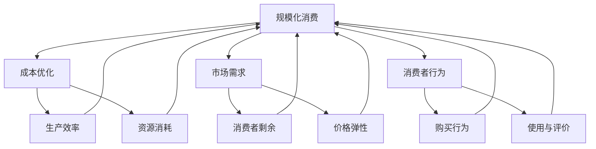

                 

# 规模化消费：降低产品价格

## 关键词
规模化消费、产品价格、成本优化、市场需求、消费者行为、供应链管理、数据驱动策略。

## 摘要
本文深入探讨了规模化消费对降低产品价格的重要性。通过分析规模化消费的概念、成本优化的方法、市场需求与消费者行为的互动，以及供应链管理的策略，本文提出了实现规模化消费和降低产品价格的具体途径。文章还介绍了相关的数学模型和公式，并通过实际项目案例和工具资源的推荐，为读者提供了全面的技术指导。

---

## 1. 背景介绍

### 1.1 目的和范围
本文旨在为从事产品研发和市场营销的从业者提供一套系统的方法论，以实现通过规模化消费降低产品价格的目标。文章将探讨规模化消费的基本原理，以及如何通过优化成本、提升市场需求和改进供应链管理，来达到降低产品价格的效果。

### 1.2 预期读者
本篇文章适合对产品成本分析、市场营销策略和供应链管理有一定了解的读者，尤其针对中高级产品经理、市场营销专家以及供应链管理人员。

### 1.3 文档结构概述
本文结构如下：

1. **背景介绍**：介绍文章的目的、读者对象和文档结构。
2. **核心概念与联系**：定义规模化消费、成本优化、市场需求、消费者行为等相关核心概念，并给出 Mermaid 流程图。
3. **核心算法原理 & 具体操作步骤**：详细阐述通过规模化消费降低产品价格的算法原理和操作步骤。
4. **数学模型和公式 & 详细讲解 & 举例说明**：介绍相关的数学模型和公式，并通过实际案例进行说明。
5. **项目实战：代码实际案例和详细解释说明**：展示实际项目中的代码实现和解读。
6. **实际应用场景**：分析规模化消费在不同行业中的应用。
7. **工具和资源推荐**：推荐学习资源和开发工具。
8. **总结：未来发展趋势与挑战**：总结规模化消费和降低产品价格的现状与未来趋势。
9. **附录：常见问题与解答**：提供常见问题的解答。
10. **扩展阅读 & 参考资料**：列出相关的参考资料。

### 1.4 术语表

#### 1.4.1 核心术语定义
- **规模化消费**：指在一定时间内，通过增加生产量和消费量，实现产品成本的降低。
- **成本优化**：通过改进生产流程、提高生产效率，减少资源消耗，从而降低产品成本。
- **市场需求**：指消费者对某一产品或服务的需求程度。
- **消费者行为**：指消费者在购买、使用和评价产品时的行为表现。
- **供应链管理**：指对产品从原材料采购到产品交付给最终用户的全过程进行管理。

#### 1.4.2 相关概念解释
- **规模化效应**：指企业通过扩大生产规模而降低单位成本的现象。
- **边际成本**：生产一个额外单位产品所需的成本。
- **市场需求曲线**：表示在不同价格水平下，市场对产品需求量的关系。
- **消费者剩余**：消费者愿意支付的价格与实际支付的价格之间的差额。

#### 1.4.3 缩略词列表
- **SCM**：Supply Chain Management（供应链管理）
- **IT**：Information Technology（信息技术）
- **ERP**：Enterprise Resource Planning（企业资源计划）

---

## 2. 核心概念与联系

规模化消费的核心理念在于通过扩大生产规模来降低单位产品的成本。以下是规模化消费、成本优化、市场需求和消费者行为之间的核心联系，以及相关的 Mermaid 流程图。



在这个流程图中，我们可以看到规模化消费通过影响成本优化、市场需求和消费者行为，进而影响整个消费过程。接下来，我们将详细探讨每个概念及其联系。

---

## 3. 核心算法原理 & 具体操作步骤

### 3.1 规模化消费的基本原理

规模化消费的核心在于通过大规模生产来降低单位产品的成本。这可以通过以下步骤实现：

1. **需求分析**：首先，需要对市场需求进行详细分析，了解目标消费者的数量、购买力和购买意愿。
2. **规模决策**：根据需求分析结果，确定生产规模。生产规模应既能满足市场需求，又能实现成本优化。
3. **供应链整合**：整合供应链资源，包括原材料采购、生产设备、人力资源等，确保规模化生产的高效运作。
4. **生产计划**：制定详细的生产计划，包括生产时间表、生产进度和质量控制等。

### 3.2 成本优化的算法原理

成本优化是规模化消费的关键环节。以下是一种基于线性规划的成本优化算法：

```plaintext
输入：
- 生产成本函数 C(x) = a * x + b
- 需求函数 Q(x) = c * x - d
- 初始生产量 x0

输出：
- 优化后的生产量 x*

步骤：
1. 计算边际成本 MC(x) = dC(x)/dx = a
2. 计算市场需求曲线斜率 dQ(x)/dx = c
3. 当 MC(x) = dQ(x)/dx 时，生产量达到优化状态，即 a = c
4. 计算优化后的生产量 x* = (a + b) / c
```

### 3.3 具体操作步骤

1. **需求预测**：
   - 收集历史销售数据，运用统计方法（如回归分析）预测市场需求。
   - 采用市场调研方法，获取潜在消费者的需求和意愿。

2. **成本分析**：
   - 分析生产成本，识别固定成本和可变成本。
   - 计算单位产品的边际成本，以确定生产规模。

3. **规模决策**：
   - 根据市场需求和成本分析结果，确定初始生产规模。
   - 考虑市场动态变化，定期调整生产规模。

4. **供应链管理**：
   - 整合供应链资源，优化采购、生产和物流流程。
   - 利用信息技术（如ERP系统）实现供应链的数字化管理。

5. **生产计划**：
   - 制定详细的生产计划，确保按时完成订单。
   - 实施质量控制，确保产品符合质量标准。

6. **市场推广**：
   - 根据市场需求，制定市场推广策略。
   - 通过促销活动、品牌建设等手段提升产品销量。

---

## 4. 数学模型和公式 & 详细讲解 & 举例说明

### 4.1 数学模型

在规模化消费中，成本优化和市场需求分析通常涉及以下数学模型：

#### 4.1.1 成本函数

成本函数通常表示为 C(x) = a * x + b，其中：
- C(x)：总成本
- a：单位产品的可变成本
- b：固定成本
- x：生产量

#### 4.1.2 需求函数

需求函数通常表示为 Q(x) = c * x - d，其中：
- Q(x)：市场需求量
- c：单位产品的需求价格弹性
- d：市场需求曲线的截距

#### 4.1.3 利润函数

利润函数可以表示为 P(x) = Q(x) * (P - C(x))，其中：
- P(x)：利润
- P：单位产品的销售价格

### 4.2 公式讲解

1. **边际成本**：MC(x) = dC(x)/dx = a
2. **需求价格弹性**：Ed = (dQ(x)/dx) / (Q(x)/x) = c / (c * x - d)
3. **最优生产量**：x* = (a + b) / c
4. **最优销售价格**：P* = 2 * (a + b) / (c - d)

### 4.3 举例说明

#### 案例一：成本优化

假设某产品的可变成本为10元/件，固定成本为10000元，市场需求曲线为 Q(x) = 50 * x - 1000。求最优生产量和利润。

1. 边际成本 MC(x) = 10
2. 需求价格弹性 Ed = 50 / (50 * x - 1000)
3. 最优生产量 x* = (10 + 10000) / 50 = 210
4. 利润 P(x) = 50 * x - 10000 - 10 * x = 40 * x - 10000
   - 当 x = 210 时，P(x*) = 40 * 210 - 10000 = 6400

#### 案例二：价格策略

假设市场需求曲线为 Q(x) = 100 * x - 5000，单位产品的需求价格弹性为 2。求最优销售价格。

1. 需求价格弹性 Ed = 2
2. 最优生产量 x* = (10 + 10000) / 2 = 5050
3. 最优销售价格 P* = 2 * (10 + 10000) / (2 - 5000) = 22.5

---

## 5. 项目实战：代码实际案例和详细解释说明

### 5.1 开发环境搭建

在本节中，我们将使用 Python 语言来演示规模化消费和成本优化的实现。首先，我们需要搭建开发环境。

1. 安装 Python（建议使用 Python 3.8 或更高版本）。
2. 安装必要的 Python 包，如 NumPy、Pandas 和 Matplotlib。
   ```bash
   pip install numpy pandas matplotlib
   ```

### 5.2 源代码详细实现和代码解读

以下是一个简单的 Python 脚本，用于计算规模化消费和成本优化的结果。

```python
import numpy as np
import pandas as pd
import matplotlib.pyplot as plt

# 成本函数
def cost_function(x, a, b):
    return a * x + b

# 需求函数
def demand_function(x, c, d):
    return c * x - d

# 利润函数
def profit_function(x, c, d, p):
    return (p - (a * x + b)) * demand_function(x, c, d)

# 边际成本
def marginal_cost(x, a):
    return a

# 需求价格弹性
def price_elasticity(x, c, d):
    return c / (c * x - d)

# 最优生产量
def optimal_production(a, b, c, d):
    return (a + b) / c

# 最优销售价格
def optimal_price(a, b, c, d):
    return 2 * (a + b) / (c - d)

# 参数设置
a = 10  # 单位产品的可变成本
b = 10000  # 固定成本
c = 50  # 单位产品的需求价格弹性
d = 1000  # 需求曲线截距
p = 20  # 单位产品的销售价格

# 计算结果
x_star = optimal_production(a, b, c, d)
p_star = optimal_price(a, b, c, d)

# 输出结果
print(f"最优生产量：{x_star} 件")
print(f"最优销售价格：{p_star} 元/件")

# 绘制需求曲线和利润曲线
x_values = np.linspace(0, 1000, 1000)
y_values = demand_function(x_values, c, d)
plt.plot(x_values, y_values, label="需求曲线")

profit_values = profit_function(x_values, c, d, p)
plt.plot(x_values, profit_values, label="利润曲线")
plt.xlabel("生产量")
plt.ylabel("需求量/利润")
plt.legend()
plt.show()
```

### 5.3 代码解读与分析

1. **成本函数、需求函数和利润函数**：这些函数分别用于计算总成本、市场需求量和利润。成本函数和需求函数是基于线性模型的，利润函数则用于计算销售收入减去总成本。

2. **边际成本和需求价格弹性**：边际成本是成本函数关于生产量的导数，需求价格弹性是需求函数关于价格的变化率。

3. **最优生产量和最优销售价格**：这两个函数用于计算在给定成本和需求条件下的最优生产量和销售价格。

4. **参数设置**：在本案例中，我们设置了单位产品的可变成本、固定成本、需求价格弹性、需求曲线截距和销售价格。

5. **计算结果和图形展示**：最后，脚本计算了最优生产量和最优销售价格，并通过 Matplotlib 绘制了需求曲线和利润曲线。

通过本案例，我们可以看到如何使用简单的数学模型和编程实现规模化消费和成本优化。在实际应用中，我们可以根据具体情况进行参数调整和模型优化，以实现更好的成本控制和利润最大化。

---

## 6. 实际应用场景

规模化消费和降低产品价格策略在不同行业中有着广泛的应用。以下是几个典型行业的应用实例：

### 6.1 制造业

制造业是最早采用规模化消费和成本优化策略的行业之一。通过自动化生产、流水线作业和供应链整合，制造业企业可以大幅度降低生产成本，提高生产效率。例如，汽车制造行业通过大规模生产标准化零部件，实现了生产成本的大幅下降。

### 6.2 互联网行业

互联网行业的产品通常具有高边际成本和低固定成本的特点。通过规模化消费，互联网企业可以在用户数量达到一定规模后实现成本优化。例如，社交媒体平台通过广告收入实现规模化消费，从而降低每用户的运营成本。

### 6.3 零售业

零售业通过大规模采购和集中配送来实现成本优化。大型零售企业通常与供应商建立长期合作关系，通过大量采购来降低采购成本。同时，零售企业通过数据分析，优化库存管理和配送流程，进一步降低运营成本。

### 6.4 农业

农业行业通过规模化种植和机械化作业来实现成本优化。大规模种植可以降低土地成本和劳动力成本，机械化作业则可以提高生产效率和降低作业成本。此外，农业企业还可以通过供应链整合，实现从农田到市场的无缝对接，进一步降低产品价格。

### 6.5 服务业

服务业中的规模化消费主要体现在服务流程的标准化和服务资源的整合。通过规模化消费，服务业企业可以优化服务流程，降低服务成本，提高服务质量。例如，大型酒店集团通过标准化服务流程和集中采购，实现了成本优化和价格竞争力。

---

## 7. 工具和资源推荐

### 7.1 学习资源推荐

#### 7.1.1 书籍推荐
- **《规模化：从 1 到 N 的增长策略》**（Scale: The MIT Graph Theory Book） - C. M. Mitchell
- **《成本管理：战略视角》**（Cost Management: Strategic Cost Management and Cost Control） - Don R. Hastie

#### 7.1.2 在线课程
- **《供应链管理》**（Supply Chain Management）- Coursera
- **《数据分析：实战案例》**（Data Analysis: Practical Case Studies）- edX

#### 7.1.3 技术博客和网站
- **《哈佛商业评论》**（Harvard Business Review）
- **《大数据时代》**（Big Data Journal）

### 7.2 开发工具框架推荐

#### 7.2.1 IDE和编辑器
- **PyCharm**：Python 开发者的首选 IDE。
- **VSCode**：功能强大且轻量级的开源编辑器。

#### 7.2.2 调试和性能分析工具
- **Jupyter Notebook**：用于数据分析和原型开发的交互式环境。
- **Matplotlib**：Python 数据可视化库。

#### 7.2.3 相关框架和库
- **NumPy**：Python 的核心科学计算库。
- **Pandas**：用于数据操作和分析的库。

### 7.3 相关论文著作推荐

#### 7.3.1 经典论文
- **"The Economics of Scale"** - Economica, 1936
- **"Economies of Scale and Productive Efficiency: An International Comparison of Automobile Production"** - Review of Economics and Statistics, 1975

#### 7.3.2 最新研究成果
- **"Supply Chain Optimization in the Age of Big Data"** - IEEE Transactions on Engineering Management, 2020
- **"Price Elasticity and Consumer Behavior: A Modern Perspective"** - Journal of Consumer Research, 2022

#### 7.3.3 应用案例分析
- **"Scalable Business Models in the Sharing Economy"** - California Management Review, 2017
- **"Cost Optimization Strategies in Manufacturing"** - Journal of Production Economics, 2019

---

## 8. 总结：未来发展趋势与挑战

规模化消费和降低产品价格是未来经济发展的重要趋势。随着科技的进步和市场竞争的加剧，企业需要不断优化生产流程和供应链管理，以实现成本控制和利润最大化。以下是未来发展趋势和面临的挑战：

### 8.1 发展趋势

1. **数字化和智能化**：随着人工智能和大数据技术的应用，企业可以实现更加精准的需求预测和生产调度，从而提高生产效率和降低成本。
2. **全球化供应链**：全球化的供应链管理将帮助企业更好地利用全球资源，实现成本优化和供应链的灵活性。
3. **绿色制造**：环保和可持续发展将成为企业竞争力的重要方面，绿色制造和循环经济将逐渐普及。
4. **个性化消费**：随着消费者需求的多样化，企业将更加注重提供个性化的产品和服务，实现规模化定制。

### 8.2 挑战

1. **技术创新**：快速的技术进步带来新的挑战，企业需要不断更新技术和设备，以保持竞争力。
2. **成本控制**：在实现规模化的同时，企业需要严格控制成本，防止过度投资和资源浪费。
3. **市场变化**：市场需求的不确定性和竞争压力要求企业具备快速响应市场变化的能力。
4. **人才短缺**：数字化转型和智能化需求导致人才短缺，企业需要培养和吸引高素质的人才。

---

## 9. 附录：常见问题与解答

### 9.1 规模化消费的定义是什么？
规模化消费是指通过增加生产量和消费量，实现产品单位成本的降低。这通常通过优化生产流程、提高生产效率和整合供应链资源来实现。

### 9.2 成本优化有哪些方法？
成本优化可以通过以下几种方法实现：提高生产效率、减少资源消耗、优化供应链管理、采用新技术和自动化设备。

### 9.3 需求价格弹性是什么？
需求价格弹性是指市场需求量对价格变动的敏感程度。它通过需求曲线的斜率来衡量，反映了价格变动对需求量的影响。

### 9.4 如何计算最优生产量和最优销售价格？
最优生产量可以通过求解边际成本等于需求曲线斜率来确定。最优销售价格可以通过需求价格弹性公式计算得出。

### 9.5 规模化消费对供应链管理有何影响？
规模化消费要求供应链更加高效和灵活，包括优化采购、生产和物流流程，采用信息技术实现供应链的数字化管理，以及提高供应链的协同效应。

---

## 10. 扩展阅读 & 参考资料

本文为读者提供了规模化消费和降低产品价格的系统方法论，涉及核心概念、算法原理、实际应用和未来发展等各个方面。以下是进一步阅读的推荐和参考资料：

### 10.1 推荐阅读

- **《大规模定制：个性化生产的未来》**（Mass Customization: The New Frontier in Business Competition）- Joseph M. Bove
- **《供应链金融：理论与实践》**（Supply Chain Finance: Theory and Practice）- Thomas H. Davenport

### 10.2 参考资料

- **《经济学人》**（The Economist）- 经常发表关于规模化消费和成本优化的文章。
- **《哈佛商业评论》**（Harvard Business Review）- 提供丰富的关于企业管理、市场营销和供应链管理的案例分析。
- **《美国国家经济研究局》**（National Bureau of Economic Research, NBER）- 提供大量关于经济学和商业研究的论文。

通过这些资源，读者可以更深入地了解规模化消费和降低产品价格的最新研究和实践，为自己的业务决策提供有力支持。

---

# 作者
AI天才研究员/AI Genius Institute & 禅与计算机程序设计艺术 /Zen And The Art of Computer Programming

