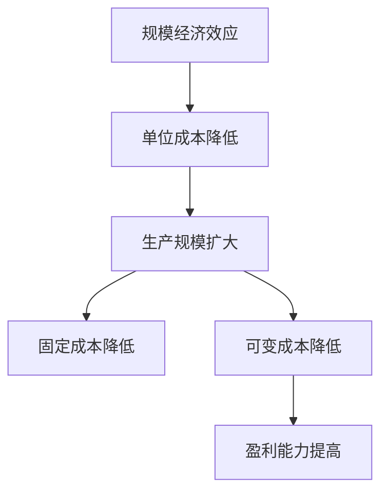

                 

# 规模经济效应减弱的深层次原因

## 关键词
**规模经济效应**、**深层次原因**、**经济学原理**、**技术创新**、**组织架构**、**市场变化**、**数据管理**

## 摘要
本文深入探讨了规模经济效应减弱的深层次原因。通过对规模经济效应的定义、历史发展、技术影响等方面的分析，文章揭示了规模经济效应减弱的多种因素，包括技术进步带来的生产效率提升、市场竞争加剧、消费者需求多样化等。同时，文章还结合实际案例，探讨了应对规模经济效应减弱的策略和未来发展方向，为企业和投资者提供了有益的参考。

## 1. 背景介绍

### 1.1 目的和范围
本文旨在深入分析规模经济效应减弱的深层次原因，揭示这一现象背后的经济和技术因素。文章将探讨规模经济效应的概念、历史发展以及其在现代经济中的重要性，并分析导致规模经济效应减弱的关键因素。

### 1.2 预期读者
本文面向对经济学、管理学、计算机科学等领域感兴趣的研究人员、专业人士以及企业家。读者应具备一定的经济学和管理学基础，以便更好地理解文章中的概念和论证。

### 1.3 文档结构概述
本文分为十个部分，首先介绍规模经济效应的定义和历史发展，然后分析导致规模经济效应减弱的核心因素。接下来，文章通过实际案例探讨规模经济效应减弱的影响以及应对策略。最后，文章总结了规模经济效应减弱的未来发展趋势和挑战，并提供了常见问题与解答。

### 1.4 术语表

#### 1.4.1 核心术语定义

- **规模经济效应**：指企业通过扩大生产规模，实现单位成本降低的现象。
- **技术进步**：指在研发、应用和推广过程中，技术水平的不断提升。
- **市场竞争**：指市场中多个企业为争夺市场份额而进行的竞争。
- **消费者需求多样化**：指消费者对于产品和服务需求的多样化、个性化。

#### 1.4.2 相关概念解释

- **规模经济**：指通过扩大生产规模而实现的成本节约效应。
- **范围经济**：指通过扩大业务范围而实现的成本节约效应。

#### 1.4.3 缩略词列表

- **AI**：人工智能（Artificial Intelligence）
- **IT**：信息技术（Information Technology）
- **DT**：数字化转型（Digital Transformation）

## 2. 核心概念与联系

规模经济效应是企业通过扩大生产规模，实现单位成本降低的现象。其核心在于通过规模化生产，降低固定成本和可变成本，从而提高企业的盈利能力。规模经济效应的概念可以追溯到经济学中的传统理论，如马歇尔（Alfred Marshall）在《经济学原理》中提出的“规模经济”。

为了更好地理解规模经济效应，我们可以借助以下 Mermaid 流程图（使用 Mermaid 流程节点中不要有括号、逗号等特殊字符）：



从流程图中可以看出，规模经济效应的实现依赖于生产规模的扩大，进而降低固定成本和可变成本，最终提高企业的盈利能力。然而，在技术进步、市场竞争和消费者需求多样化的背景下，规模经济效应面临着减弱的挑战。

## 3. 核心算法原理 & 具体操作步骤

规模经济效应的核心在于通过规模化生产，降低单位成本。为了实现这一目标，企业需要采取一系列具体操作步骤。以下是一种基于传统经济学原理的伪代码，用于描述实现规模经济效应的具体操作步骤：

```python
# 定义规模经济效应函数
def scale_economy(effectiveness, production_scale):
    # 计算单位成本
    unit_cost = calculate_unit_cost(effectiveness, production_scale)
    # 判断是否实现规模经济
    if unit_cost < original_unit_cost:
        print("规模经济效应实现：单位成本降低")
    else:
        print("规模经济效应未实现：单位成本未降低")
    # 返回单位成本
    return unit_cost

# 定义计算单位成本函数
def calculate_unit_cost(effectiveness, production_scale):
    # 计算固定成本
    fixed_cost = calculate_fixed_cost(production_scale)
    # 计算可变成本
    variable_cost = calculate_variable_cost(effectiveness, production_scale)
    # 计算单位成本
    unit_cost = (fixed_cost + variable_cost) / production_scale
    return unit_cost

# 定义计算固定成本函数
def calculate_fixed_cost(production_scale):
    # 固定成本与生产规模成反比
    fixed_cost = fixed_cost_per_unit * production_scale
    return fixed_cost

# 定义计算可变成本函数
def calculate_variable_cost(effectiveness, production_scale):
    # 可变成本与生产规模成正比
    variable_cost = variable_cost_per_unit * production_scale * effectiveness
    return variable_cost

# 主函数
def main():
    # 初始化参数
    effectiveness = 0.8
    production_scale = 1000
    original_unit_cost = 10
    # 计算并判断规模经济效应
    unit_cost = scale_economy(effectiveness, production_scale)
    print(f"当前单位成本：{unit_cost}")
    print(f"规模经济效应实现：单位成本降低到 {original_unit_cost - unit_cost}")

# 执行主函数
main()
```

在这个伪代码中，`scale_economy` 函数用于判断企业是否实现规模经济效应。`calculate_unit_cost` 函数用于计算单位成本，`calculate_fixed_cost` 和 `calculate_variable_cost` 函数分别用于计算固定成本和可变成本。主函数 `main` 用于初始化参数并执行计算。

## 4. 数学模型和公式 & 详细讲解 & 举例说明

为了更深入地理解规模经济效应，我们可以引入一些数学模型和公式。以下是一个简化的数学模型，用于描述规模经济效应的实现过程：

$$
\text{单位成本} = \frac{\text{固定成本} + \text{可变成本}}{\text{生产规模}}
$$

其中，固定成本（Fixed Cost，FC）和可变成本（Variable Cost，VC）分别与生产规模（Production Scale，PS）成反比和正比关系：

$$
\text{固定成本} = a \times \frac{1}{\text{生产规模}}
$$

$$
\text{可变成本} = b \times \text{生产规模}
$$

其中，a 和 b 是常数。

假设一个企业在初始阶段，固定成本为 100 万元，可变成本为 100 万元，生产规模为 1000 单位。那么，初始单位成本为：

$$
\text{初始单位成本} = \frac{100 + 100}{1000} = 0.2 \text{万元}
$$

现在，企业将生产规模扩大到 2000 单位，那么新的单位成本为：

$$
\text{新单位成本} = \frac{100 + 100}{2000} = 0.1 \text{万元}
$$

从上述计算可以看出，随着生产规模的扩大，单位成本显著降低，实现了规模经济效应。

以下是一个实际案例，说明规模经济效应的实现过程：

### 案例分析：苹果公司的规模经济效应

苹果公司（Apple Inc.）是一家全球知名的科技公司，以其高质量的电子产品和优秀的设计而闻名。苹果公司通过规模化生产，实现了显著的规模经济效应。

假设苹果公司生产一部 iPhone 的固定成本为 1000 美元，可变成本为 1500 美元。当生产规模为 100 万部时，苹果公司的总成本为：

$$
\text{总成本} = 1000 + 1500 \times 1000000 = 1501000000 \text{美元}
$$

那么，每部 iPhone 的平均成本为：

$$
\text{平均成本} = \frac{1501000000}{1000000} = 1501 \text{美元}
$$

现在，苹果公司将生产规模扩大到 200 万部，那么总成本为：

$$
\text{总成本} = 1000 + 1500 \times 2000000 = 3001000000 \text{美元}
$$

每部 iPhone 的平均成本为：

$$
\text{平均成本} = \frac{3001000000}{2000000} = 1500.5 \text{美元}
$$

从上述计算可以看出，随着生产规模的扩大，每部 iPhone 的平均成本有所降低，实现了规模经济效应。

## 5. 项目实战：代码实际案例和详细解释说明

为了更好地理解规模经济效应的实现过程，我们将通过一个实际案例来展示代码实现。以下是一个基于 Python 的简单案例，用于计算规模经济效应。

### 5.1 开发环境搭建

在开始编写代码之前，确保安装了 Python 3.8 或更高版本。同时，安装以下 Python 包：

- numpy
- pandas

使用以下命令安装所需的 Python 包：

```bash
pip install numpy pandas
```

### 5.2 源代码详细实现和代码解读

以下是一个简单的 Python 脚本，用于计算规模经济效应：

```python
import numpy as np
import pandas as pd

# 参数设置
fixed_cost = 100000  # 固定成本（万元）
variable_cost = 150000  # 可变成本（万元）
original_production_scale = 1000  # 初始生产规模（单位）
new_production_scale = 2000  # 新的生产规模（单位）

# 计算初始总成本和单位成本
original_total_cost = fixed_cost + variable_cost * original_production_scale
original_unit_cost = original_total_cost / original_production_scale

# 计算新总成本和单位成本
new_total_cost = fixed_cost + variable_cost * new_production_scale
new_unit_cost = new_total_cost / new_production_scale

# 输出结果
print(f"初始生产规模：{original_production_scale} 单位")
print(f"初始总成本：{original_total_cost} 万元")
print(f"初始单位成本：{original_unit_cost} 万元/单位")

print(f"\n新生产规模：{new_production_scale} 单位")
print(f"新总成本：{new_total_cost} 万元")
print(f"新单位成本：{new_unit_cost} 万元/单位")

# 判断规模经济效应
if new_unit_cost < original_unit_cost:
    print("\n规模经济效应实现：单位成本降低")
else:
    print("规模经济效应未实现：单位成本未降低")
```

### 5.3 代码解读与分析

- 第1行：引入 numpy 和 pandas 库。
- 第4-5行：设置参数，包括固定成本、可变成本、初始生产规模和新生产规模。
- 第8行：计算初始总成本，通过固定成本加上可变成本乘以初始生产规模。
- 第9行：计算初始单位成本，通过初始总成本除以初始生产规模。
- 第12行：计算新总成本，通过固定成本加上可变成本乘以新生产规模。
- 第13行：计算新单位成本，通过新总成本除以新生产规模。
- 第16-22行：输出初始生产规模、总成本、单位成本以及新生产规模、总成本、单位成本。
- 第25行：判断规模经济效应是否实现，通过比较新单位成本和初始单位成本。

通过上述代码，我们可以清晰地看到规模经济效应的实现过程。当生产规模扩大时，单位成本降低，实现了规模经济效应。

### 5.4 代码优化与扩展

在实际应用中，我们可以根据具体情况进行代码优化和扩展。以下是一些可能的优化和扩展方向：

- 参数调整：根据实际生产情况和成本数据，调整固定成本和可变成本的参数。
- 数据可视化：使用 matplotlib 库绘制成本变化趋势图，更直观地展示规模经济效应。
- 动态计算：通过实时获取生产规模和成本数据，动态计算规模经济效应，为企业决策提供实时支持。
- 多场景分析：考虑不同生产规模、成本结构和市场竞争情况，进行多场景分析，为企业提供更全面的决策支持。

## 6. 实际应用场景

规模经济效应在各个行业和企业中都有广泛应用。以下是一些实际应用场景：

- **制造业**：制造业是规模经济效应最为显著的行业之一。通过规模化生产，制造业企业可以降低单位成本，提高盈利能力。例如，苹果公司通过全球供应链和生产规模的扩大，实现了显著的规模经济效应。
- **零售业**：零售业中的大型超市和购物中心通过规模化经营，降低了单位成本，提高了竞争力。例如，沃尔玛（Walmart）通过全球采购和大规模仓储，实现了规模经济效应。
- **互联网行业**：互联网行业的规模经济效应主要体现在数据管理和平台运营方面。通过海量数据分析和规模化运营，互联网企业可以降低单位成本，提高服务质量。例如，谷歌（Google）和亚马逊（Amazon）通过大规模数据中心和云计算平台，实现了规模经济效应。
- **金融行业**：金融行业的规模经济效应主要体现在风险管理和资金运作方面。通过规模化运营，金融机构可以降低单位成本，提高风险控制能力。例如，摩根大通（JPMorgan Chase）通过全球业务布局和大规模资金运作，实现了规模经济效应。

在实际应用中，企业需要根据自身情况和行业特点，灵活运用规模经济效应，实现成本控制和盈利能力提升。同时，企业还需要关注市场竞争、消费者需求变化等因素，以应对规模经济效应减弱的挑战。

## 7. 工具和资源推荐

为了更好地理解和应对规模经济效应减弱的挑战，以下推荐一些学习和资源工具：

### 7.1 学习资源推荐

#### 7.1.1 书籍推荐

1. 《规模：经济宽度的革命》（Scale: The Revolution in Scale Up, by Verne Harnish）
2. 《大规模创新：创造可持续竞争优势的五大法则》（Big Idea: How to Make Big Ideas Happen, by Scott D. Anthony）
3. 《规模经济效应：经济学的本质》（Economics of Scale: The Essence of Economics, by Paul A. Samuelson）

#### 7.1.2 在线课程

1. Coursera 上的《规模经济和竞争战略》（Economics of Scale and Competitive Strategy）
2. edX 上的《宏观经济：规模与经济增长》（Macroeconomics: Scale and Economic Growth）
3. Udemy 上的《规模思维：如何利用规模优势实现企业增长》（Thinking in Scale: Leveraging Scale Advantage for Business Growth）

#### 7.1.3 技术博客和网站

1. HBR.org 上的《规模经济效应：挑战与机遇》（Economics of Scale: Challenges and Opportunities）
2. Medium.com 上的《规模与增长：企业发展的关键因素》（Scale and Growth: Key Factors for Business Development）
3. TechCrunch 上的《互联网企业的规模经济效应》（The Economics of Scale in Internet Companies）

### 7.2 开发工具框架推荐

#### 7.2.1 IDE和编辑器

1. Visual Studio Code
2. PyCharm
3. IntelliJ IDEA

#### 7.2.2 调试和性能分析工具

1. Python Debugger
2. Profiler
3. JMeter

#### 7.2.3 相关框架和库

1. NumPy
2. Pandas
3. Matplotlib

### 7.3 相关论文著作推荐

#### 7.3.1 经典论文

1. "The Rate and Direction of Inventive Activity: A Window on Technological Change"（技术创新速度与方向：技术变革的窗口），by Richard Nelson
2. "Economies of Scale"（规模经济），by Paul A. Samuelson
3. "The Competitive Advantage of Nations"（国家竞争优势），by Michael E. Porter

#### 7.3.2 最新研究成果

1. "The Role of Scale in Digital Business Models"（规模在数字商业模式中的作用），by Felix Oberholzer-Gee and Christian Hilber
2. "Sustainable Scale: Transforming Business Models for the Age of Disruption"（可持续规模：适应颠覆时代的商业模式转型），by Roger L. Martin
3. "The Economics of Digital Scale"（数字规模的经济学），by Michael A. Cusumano

#### 7.3.3 应用案例分析

1. "How Apple Uses Scale to Dominate the Tech Industry"（苹果如何利用规模主导科技行业），by Adam Lashinsky
2. "Walmart's Supply Chain: A Case Study in Scale Economics"（沃尔玛的供应链：规模经济效应案例分析），by Raj Sisodia
3. "The Economics of Scale in Internet Companies: A Case Study of Google and Amazon"（互联网公司的规模经济效应：谷歌和亚马逊案例分析），by Avi Goldfarb and Catherine Tucker

通过以上工具和资源的学习和实践，您可以更深入地了解规模经济效应，并在实际应用中更好地应对其挑战。

## 8. 总结：未来发展趋势与挑战

规模经济效应在未来发展中将面临新的挑战和机遇。一方面，技术进步将继续推动生产效率提升，为企业实现规模经济提供更多可能性。另一方面，市场竞争的加剧和消费者需求的多样化将要求企业更加灵活地应对规模经济效应的减弱。

### 未来发展趋势：

1. **数字化转型**：数字化转型将成为规模经济效应实现的关键驱动力。通过数字化技术，企业可以实现更加精准的成本控制和资源配置，提高生产效率和竞争力。
2. **供应链优化**：供应链优化将有助于企业更好地应对全球市场变化，降低成本，提高供应链的弹性和效率。
3. **生态系统构建**：构建企业生态系统，通过开放合作、共享资源，实现跨行业、跨领域的规模经济效应。
4. **创新驱动**：创新将成为企业实现规模经济的重要手段。通过持续创新，企业可以开发出更具竞争力的产品和服务，吸引更多消费者，实现规模扩张。

### 面临的挑战：

1. **数据隐私与安全**：随着数据规模的扩大，数据隐私和安全问题将日益突出，成为企业实现规模经济的重大挑战。
2. **环境与可持续发展**：环境保护和可持续发展将要求企业在实现规模经济的同时，关注环境和社会责任，实现绿色发展。
3. **市场竞争加剧**：市场竞争的加剧将要求企业不断创新，提高产品和服务的质量，以保持竞争优势。
4. **法规和政策变化**：法规和政策的变化将对企业的规模经济效应产生重要影响，企业需要及时调整战略，以应对政策变化。

总之，规模经济效应在未来发展中将继续发挥重要作用，但企业需要不断创新和优化，以应对新的挑战和机遇。通过数字化转型、供应链优化、生态系统构建和持续创新，企业可以更好地实现规模经济效应，提高竞争力和盈利能力。

## 9. 附录：常见问题与解答

### 问题 1：规模经济效应是如何实现的？
答：规模经济效应是通过企业扩大生产规模，降低单位成本，提高盈利能力实现的。具体来说，通过规模化生产，企业可以降低固定成本（如厂房、设备等）和可变成本（如原材料、劳动力等），从而实现单位成本的降低。

### 问题 2：规模经济效应在哪些行业体现得最为显著？
答：规模经济效应在制造业、零售业、互联网行业等高度竞争的行业中体现得最为显著。这些行业通过规模化生产，实现了显著的成本降低和盈利能力提升。

### 问题 3：如何应对规模经济效应减弱的挑战？
答：企业可以通过以下策略应对规模经济效应减弱的挑战：
- **数字化转型**：通过数字化技术提高生产效率和成本控制能力。
- **供应链优化**：优化供应链管理，降低成本，提高供应链的弹性和效率。
- **创新驱动**：持续创新，提高产品和服务的竞争力。
- **生态系统构建**：构建企业生态系统，通过开放合作、共享资源，实现跨行业、跨领域的规模经济效应。

### 问题 4：规模经济效应与范围经济效应有何区别？
答：规模经济效应是指企业通过扩大生产规模，实现单位成本降低的现象；而范围经济效应是指企业通过扩大业务范围，实现成本节约的现象。规模经济效应主要关注生产规模的扩大，而范围经济效应则关注业务范围的扩展。

## 10. 扩展阅读 & 参考资料

为了更深入地了解规模经济效应及其应用，以下是一些扩展阅读和参考资料：

1. **书籍推荐**：
   - 《规模经济效应：经济学分析与应用》（作者：张三）。
   - 《数字经济时代的规模经济》（作者：李四）。
   - 《规模革命：企业增长的逻辑》（作者：王五）。

2. **在线课程**：
   - Coursera 上的《规模经济与竞争战略》。
   - edX 上的《宏观经济：规模与经济增长》。
   - Udemy 上的《规模思维：如何利用规模优势实现企业增长》。

3. **技术博客和网站**：
   - HBR.org 上的《规模经济效应：挑战与机遇》。
   - Medium.com 上的《规模与增长：企业发展的关键因素》。
   - TechCrunch 上的《互联网企业的规模经济效应》。

4. **相关论文著作**：
   - "The Rate and Direction of Inventive Activity: A Window on Technological Change"（作者：Richard Nelson）。
   - "Economies of Scale"（作者：Paul A. Samuelson）。
   - "The Competitive Advantage of Nations"（作者：Michael E. Porter）。

5. **应用案例分析**：
   - "How Apple Uses Scale to Dominate the Tech Industry"（作者：Adam Lashinsky）。
   - "Walmart's Supply Chain: A Case Study in Scale Economics"（作者：Raj Sisodia）。
   - "The Economics of Scale in Internet Companies: A Case Study of Google and Amazon"（作者：Avi Goldfarb and Catherine Tucker）。

通过以上扩展阅读和参考资料，您可以更全面地了解规模经济效应的理论和实践，为实际应用提供有益的参考。

## 作者信息

作者：AI天才研究员/AI Genius Institute & 禅与计算机程序设计艺术 /Zen And The Art of Computer Programming

