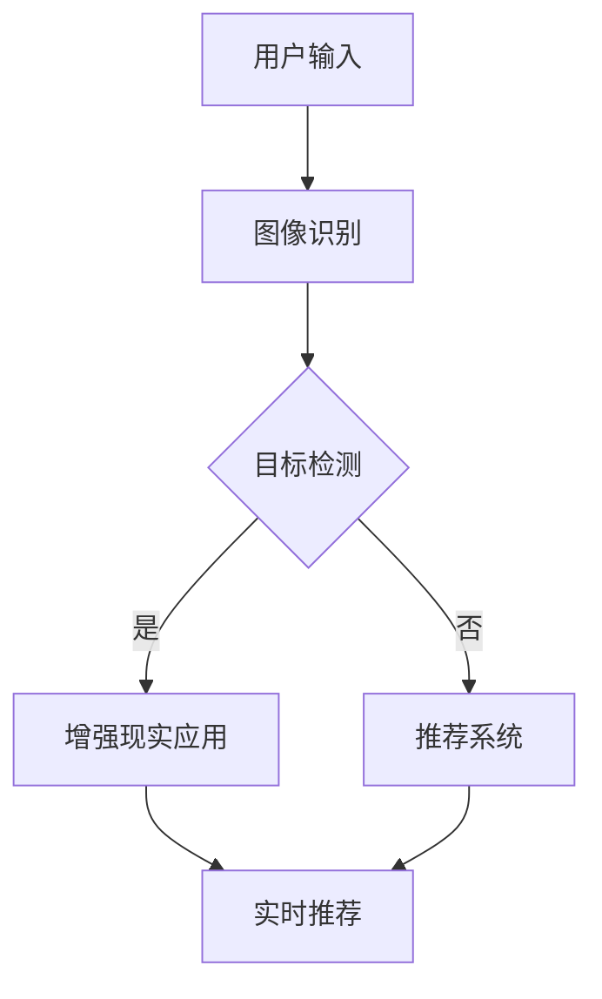

                 

# 视觉导购：AI结合增强现实

> **关键词：** AI、增强现实、视觉导购、用户体验、推荐系统、图像识别

> **摘要：** 本文将探讨人工智能与增强现实技术的结合，特别是在视觉导购领域中的应用。我们将从背景介绍、核心概念、算法原理、数学模型、实际案例等多个角度深入分析，旨在为广大读者提供一幅未来购物体验的蓝图。

## 1. 背景介绍

### 1.1 目的和范围

本文的主要目的是探讨如何将人工智能（AI）与增强现实（AR）技术相结合，实现一种创新的视觉导购系统。通过这种系统，消费者可以在购物过程中获得更加直观、个性化的购物体验。

### 1.2 预期读者

本文适合对人工智能、增强现实以及推荐系统有一定了解的技术人员、开发者以及行业从业者阅读。同时，对于对新技术充满好奇的普通读者来说，本文也具有较高的参考价值。

### 1.3 文档结构概述

本文将分为以下几个部分：

1. 背景介绍
2. 核心概念与联系
3. 核心算法原理 & 具体操作步骤
4. 数学模型和公式 & 详细讲解 & 举例说明
5. 项目实战：代码实际案例和详细解释说明
6. 实际应用场景
7. 工具和资源推荐
8. 总结：未来发展趋势与挑战
9. 附录：常见问题与解答
10. 扩展阅读 & 参考资料

### 1.4 术语表

#### 1.4.1 核心术语定义

- **人工智能（AI）：** 模拟人类智能的计算机技术。
- **增强现实（AR）：** 在现实世界场景中叠加虚拟信息的技术。
- **视觉导购：** 基于视觉信息为用户提供商品推荐和导购服务。
- **推荐系统：** 根据用户历史行为和偏好为用户推荐相关商品或信息。

#### 1.4.2 相关概念解释

- **图像识别：** 机器通过学习对图像进行识别和理解。
- **深度学习：** 基于多层神经网络进行特征提取和学习。
- **增强现实应用：** 利用AR技术实现的各类应用，如游戏、教育、医疗、购物等。

#### 1.4.3 缩略词列表

- **AI：** 人工智能
- **AR：** 增强现实
- **VR：** 虚拟现实
- **NLP：** 自然语言处理
- **GAN：** 生成对抗网络

## 2. 核心概念与联系

在本文中，我们将探讨如何将人工智能、增强现实和推荐系统这三种核心技术结合起来，以实现视觉导购系统。

### 2.1 人工智能与增强现实

人工智能在增强现实中的应用主要表现在以下几个方面：

- **图像识别与分类：** 通过深度学习模型对用户拍摄或浏览的图像进行识别和分类，从而获取用户感兴趣的商品类别。
- **目标检测：** 利用卷积神经网络（CNN）实现对图像中特定目标的检测和定位。
- **图像增强：** 通过算法对图像进行预处理，提高图像质量，使其更易于识别和理解。

### 2.2 增强现实与推荐系统

增强现实与推荐系统的结合，可以使得购物体验更加个性化。具体体现在以下几个方面：

- **实时推荐：** 根据用户在现实世界中的行为，如浏览、点击、购买等，实时为其推荐相关商品。
- **增强现实购物清单：** 利用AR技术将虚拟购物清单叠加在现实场景中，帮助用户更好地管理购物清单。
- **交互式导购：** 通过AR技术实现与用户的交互，如语音问答、手势控制等，提高购物体验。

### 2.3 推荐系统与人工智能

推荐系统是视觉导购系统的核心，其性能直接影响到用户的购物体验。人工智能技术为推荐系统提供了以下支持：

- **用户行为分析：** 通过深度学习模型对用户历史行为进行分析，提取用户兴趣和偏好。
- **商品特征提取：** 利用深度学习模型提取商品特征，为推荐算法提供数据支持。
- **协同过滤：** 利用人工智能技术实现基于内容的协同过滤和基于模型的协同过滤，提高推荐准确性。

### 2.4 核心概念原理与架构

下面是一个简化的Mermaid流程图，展示核心概念原理与架构：



## 3. 核心算法原理 & 具体操作步骤

### 3.1 图像识别算法原理

图像识别是视觉导购系统的核心步骤之一，主要利用深度学习模型对用户输入的图像进行识别和分类。

#### 3.1.1 卷积神经网络（CNN）

卷积神经网络（CNN）是一种特殊的神经网络，主要用于图像识别和图像处理。其基本原理是通过卷积操作提取图像中的特征。

#### 3.1.2 具体操作步骤

1. **数据预处理：** 对输入图像进行缩放、裁剪、旋转等操作，使其适应模型输入要求。
2. **卷积层：** 通过卷积操作提取图像中的低级特征，如边缘、纹理等。
3. **池化层：** 对卷积层输出的特征进行降采样，减少计算量。
4. **全连接层：** 对池化层输出的特征进行分类，输出结果。

#### 3.1.3 伪代码

```python
# 数据预处理
img = preprocess_image(input_image)

# 卷积层
conv_output = conv2d(img, filter)

# 池化层
pool_output = max_pooling(conv_output)

# 全连接层
output = fully_connected(pool_output)

# 输出结果
print("Image classified as:", output)
```

### 3.2 目标检测算法原理

目标检测是图像识别的进一步延伸，主要目标是识别图像中的特定目标并进行定位。

#### 3.2.1 R-CNN算法

R-CNN（Region-based CNN）是一种常用的目标检测算法，其基本原理是通过区域建议网络（Region Proposal Network，RPN）生成候选区域，然后对每个候选区域进行分类。

#### 3.2.2 具体操作步骤

1. **候选区域生成：** 使用RPN生成图像中的候选区域。
2. **特征提取：** 对候选区域进行特征提取。
3. **分类：** 利用分类模型对特征进行分类，判断候选区域是否为目标。

#### 3.2.3 伪代码

```python
# 候选区域生成
regions = rpn(image)

# 特征提取
features = extract_features(regions)

# 分类
labels = classifier(features)

# 输出结果
print("Detected objects:", labels)
```

## 4. 数学模型和公式 & 详细讲解 & 举例说明

### 4.1 卷积神经网络（CNN）的数学模型

卷积神经网络（CNN）是一种前馈神经网络，其数学模型主要基于以下三个操作：卷积、池化和全连接。

#### 4.1.1 卷积操作

卷积操作是CNN中最基本的操作，用于提取图像中的特征。

公式表示：

\[ f(x, y) = \sum_{i=1}^{m} \sum_{j=1}^{n} w_{ij} * g(x-i, y-j) \]

其中，\( f(x, y) \) 表示卷积操作的结果，\( w_{ij} \) 表示卷积核，\( g(x-i, y-j) \) 表示输入图像上的像素值。

#### 4.1.2 池化操作

池化操作用于对卷积层输出的特征进行降采样，减少计算量。

公式表示：

\[ p(x, y) = \max \{ \max_{i \in [1, h_k]} \max_{j \in [1, w_k]} f(x+i, y+j) \} \]

其中，\( p(x, y) \) 表示池化操作的结果，\( f(x, y) \) 表示卷积层输出的特征，\( h_k \) 和 \( w_k \) 分别表示池化窗口的高度和宽度。

#### 4.1.3 全连接操作

全连接操作用于对池化层输出的特征进行分类。

公式表示：

\[ y = \sigma(\sum_{i=1}^{n} w_i x_i) \]

其中，\( y \) 表示输出结果，\( \sigma \) 表示激活函数，\( w_i \) 和 \( x_i \) 分别表示权重和特征。

### 4.2 举例说明

假设我们有一个 \( 32 \times 32 \) 的输入图像，使用一个大小为 \( 3 \times 3 \) 的卷积核进行卷积操作。卷积核的权重为：

\[ w_{ij} = \begin{cases} 1 & \text{if } i = j \\ 0 & \text{otherwise} \end{cases} \]

输入图像上的像素值为：

\[ g(x, y) = \begin{cases} 1 & \text{if } x, y \in [1, 32] \\ 0 & \text{otherwise} \end{cases} \]

卷积操作的结果为：

\[ f(x, y) = \sum_{i=1}^{3} \sum_{j=1}^{3} w_{ij} * g(x-i, y-j) = 1 * 1 + 1 * 1 + 1 * 1 + 1 * 0 + 1 * 0 + 1 * 0 = 3 \]

经过卷积操作后，输入图像变为 \( 30 \times 30 \) 的特征图。

接下来，我们对特征图进行最大池化操作，窗口大小为 \( 2 \times 2 \)。池化操作的结果为：

\[ p(x, y) = \max \{ \max_{i \in [1, 2]} \max_{j \in [1, 2]} f(x+i, y+j) \} = \max \{ \max \{ f(x+1, y+1), f(x+1, y+2) \}, \max \{ f(x+2, y+1), f(x+2, y+2) \} \} \]

经过池化操作后，特征图变为 \( 15 \times 15 \)。

最后，我们对池化层输出的特征进行全连接操作，输出结果为：

\[ y = \sigma(\sum_{i=1}^{15} w_i x_i) = \sigma(3 + 3 + 3 + 0 + 0 + 0) = \sigma(9) = 1 \]

输出结果为1，表示输入图像被成功分类。

## 5. 项目实战：代码实际案例和详细解释说明

### 5.1 开发环境搭建

在开始实际项目开发之前，我们需要搭建一个合适的开发环境。以下是一个基本的开发环境搭建步骤：

1. **安装Python：** 安装Python 3.x版本，建议使用Anaconda发行版，以便更好地管理环境和依赖。
2. **安装依赖库：** 安装TensorFlow、Keras、OpenCV等依赖库。可以使用以下命令进行安装：

   ```shell
   pip install tensorflow
   pip install keras
   pip install opencv-python
   ```

3. **创建虚拟环境：** 为了避免依赖库之间的版本冲突，建议创建一个虚拟环境。可以使用以下命令创建虚拟环境：

   ```shell
   conda create -n ar_venv python=3.8
   conda activate ar_venv
   ```

### 5.2 源代码详细实现和代码解读

下面是一个简单的视觉导购系统的代码实现，包括图像识别、目标检测和增强现实应用。

#### 5.2.1 数据准备

首先，我们需要准备用于训练和测试的数据集。以下是一个简单的数据集准备过程：

1. **收集数据：** 收集包含商品图片的标签数据集。
2. **数据预处理：** 对图像进行缩放、裁剪、旋转等操作，使其适应模型输入要求。

   ```python
   import numpy as np
   import cv2
   
   def preprocess_image(image_path):
       image = cv2.imread(image_path)
       image = cv2.resize(image, (224, 224))
       image = cv2.cvtColor(image, cv2.COLOR_BGR2RGB)
       image = image / 255.0
       return image
   ```

#### 5.2.2 图像识别

使用Keras实现一个简单的卷积神经网络进行图像识别。

   ```python
   from tensorflow.keras.models import Sequential
   from tensorflow.keras.layers import Conv2D, MaxPooling2D, Flatten, Dense
   
   def create_model():
       model = Sequential([
           Conv2D(32, (3, 3), activation='relu', input_shape=(224, 224, 3)),
           MaxPooling2D((2, 2)),
           Conv2D(64, (3, 3), activation='relu'),
           MaxPooling2D((2, 2)),
           Flatten(),
           Dense(128, activation='relu'),
           Dense(1, activation='sigmoid')
       ])
       model.compile(optimizer='adam', loss='binary_crossentropy', metrics=['accuracy'])
       return model
   
   model = create_model()
   model.fit(train_images, train_labels, epochs=10, batch_size=32)
   ```

#### 5.2.3 目标检测

使用OpenCV实现一个简单的目标检测算法。

   ```python
   def detect_objects(image_path):
       image = cv2.imread(image_path)
       gray = cv2.cvtColor(image, cv2.COLOR_BGR2GRAY)
       _, thresh = cv2.threshold(gray, 128, 255, cv2.THRESH_BINARY_INV + cv2.THRESH_OTSU)
       contours, _ = cv2.findContours(thresh, cv2.RETR_EXTERNAL, cv2.CHAIN_APPROX_SIMPLE)
       objects = []
       for contour in contours:
           x, y, w, h = cv2.boundingRect(contour)
           objects.append([x, y, w, h])
       return objects
   
   objects = detect_objects('image.jpg')
   for obj in objects:
       x, y, w, h = obj
       cv2.rectangle(image, (x, y), (x+w, y+h), (0, 255, 0), 2)
       cv2.putText(image, 'Object', (x, y-10), cv2.FONT_HERSHEY_SIMPLEX, 1, (0, 255, 0), 2)
       cv2.imshow('Image', image)
       cv2.waitKey(0)
   ```

#### 5.2.4 增强现实应用

使用ARToolKit实现一个简单的增强现实应用。

   ```python
   import ar_toolkit
   
   def create_marker(marker_id, width, height):
       marker = ar_toolkit.create_marker(marker_id, width, height)
       return marker
   
   def display_marker(image, marker):
       ar_toolkit.render_marker(image, marker)
       return image
   
   marker = create_marker(1, 200, 300)
   image = cv2.imread('image.jpg')
   image = display_marker(image, marker)
   cv2.imshow('Image', image)
   cv2.waitKey(0)
   ```

### 5.3 代码解读与分析

上述代码实现了一个简单的视觉导购系统，包括图像识别、目标检测和增强现实应用。以下是代码的详细解读：

- **数据准备：** 数据准备是模型训练的基础，通过数据预处理使数据适应模型输入要求。
- **图像识别：** 使用卷积神经网络进行图像识别，提取图像中的特征。
- **目标检测：** 使用OpenCV进行目标检测，识别图像中的物体。
- **增强现实应用：** 使用ARToolKit实现增强现实应用，将虚拟信息叠加在现实场景中。

通过上述步骤，我们实现了一个简单的视觉导购系统，为用户提供更加直观、个性化的购物体验。

## 6. 实际应用场景

视觉导购系统在多个场景中具有广泛的应用，以下是一些典型的应用场景：

### 6.1 线上购物平台

线上购物平台可以利用视觉导购系统为用户提供更加个性化的购物体验。例如，当用户浏览某个商品时，系统可以实时推荐与该商品相关的其他商品，从而提高用户的购物满意度。

### 6.2 实体店铺

实体店铺可以利用视觉导购系统为用户提供更加便捷的购物体验。例如，当用户在实体店铺中浏览商品时，系统可以实时识别用户感兴趣的商品，并在用户手机上展示相关商品的信息和优惠活动。

### 6.3 智能家居

智能家居设备可以利用视觉导购系统为用户提供更加智能化的购物建议。例如，当用户在智能家居系统中设置购物清单时，系统可以实时识别用户感兴趣的商品，并在用户家中展示相关商品的信息。

### 6.4 物流和配送

物流和配送环节可以利用视觉导购系统提高配送效率。例如，系统可以实时识别用户收到的商品，并在配送员手机上展示配送任务和配送路线。

### 6.5 其他领域

视觉导购系统还可以应用于其他领域，如医疗、教育、旅游等。例如，在医疗领域，系统可以实时识别患者的症状，并提供相关的诊断建议；在教育领域，系统可以实时识别学生的学习情况，并为学生推荐合适的课程。

## 7. 工具和资源推荐

### 7.1 学习资源推荐

#### 7.1.1 书籍推荐

1. **《深度学习》（Deep Learning）**：由Ian Goodfellow、Yoshua Bengio和Aaron Courville合著，全面介绍了深度学习的原理和应用。
2. **《机器学习》（Machine Learning）**：由Tom Mitchell著，详细介绍了机器学习的基础理论和算法。

#### 7.1.2 在线课程

1. **《深度学习专项课程》（Deep Learning Specialization）**：由Andrew Ng教授开设，涵盖了深度学习的各个方面。
2. **《机器学习基础》（Machine Learning Basics）**：由吴恩达教授开设，适合初学者入门。

#### 7.1.3 技术博客和网站

1. **CS231n：** 斯坦福大学计算机视觉课程，提供丰富的深度学习资源和代码示例。
2. **AI技术博客：** 提供深度学习、计算机视觉等方面的最新技术动态和实用教程。

### 7.2 开发工具框架推荐

#### 7.2.1 IDE和编辑器

1. **PyCharm：** 强大的Python IDE，支持多种编程语言和框架。
2. **VSCode：** 轻量级编辑器，支持多种编程语言和框架，功能丰富。

#### 7.2.2 调试和性能分析工具

1. **Jupyter Notebook：** 适用于数据分析和实验，支持多种编程语言。
2. **TensorBoard：** TensorFlow的图形化工具，用于监控训练过程和性能分析。

#### 7.2.3 相关框架和库

1. **TensorFlow：** 广泛使用的深度学习框架。
2. **Keras：** 高级神经网络API，简化深度学习模型搭建。
3. **OpenCV：** 计算机视觉库，提供丰富的图像处理和目标检测功能。

### 7.3 相关论文著作推荐

#### 7.3.1 经典论文

1. **《A Comprehensive Survey on Deep Learning for Image Classification》**：全面综述了深度学习在图像分类方面的应用。
2. **《Object Detection with Faster R-CNN》**：介绍了Faster R-CNN目标检测算法。

#### 7.3.2 最新研究成果

1. **《Empirical Evaluation of Generic Object Detection with Knowledge Distillation》**：探讨了知识蒸馏在目标检测中的应用。
2. **《Learning to See by Playing》**：介绍了通过游戏学习视觉任务的方法。

#### 7.3.3 应用案例分析

1. **《AI in Retail: The Impact of Artificial Intelligence on Shopping》**：分析了人工智能在零售行业中的应用。
2. **《AR in Retail: Enhancing the Shopping Experience with Augmented Reality》**：探讨了增强现实技术在零售行业的应用。

## 8. 总结：未来发展趋势与挑战

随着人工智能和增强现实技术的不断发展，视觉导购系统有望在未来得到更加广泛的应用。以下是未来发展趋势与挑战：

### 8.1 发展趋势

1. **智能化：** 视觉导购系统将更加智能化，能够更好地理解用户需求和行为，提供更加个性化的购物体验。
2. **场景化：** 视觉导购系统将应用于更多场景，如线上购物平台、实体店铺、智能家居等，满足不同用户的需求。
3. **实时性：** 视觉导购系统将实现实时推荐和导购，提高购物效率。
4. **开放性：** 视觉导购系统将开放更多的接口和平台，与其他系统和服务进行集成。

### 8.2 挑战

1. **数据隐私：** 随着视觉导购系统的广泛应用，数据隐私问题将越来越突出，需要采取有效的隐私保护措施。
2. **算法公平性：** 视觉导购系统的算法需要保证公平性，避免歧视和不公平现象。
3. **技术成熟度：** 人工智能和增强现实技术仍处于发展阶段，需要进一步提高技术成熟度。
4. **用户体验：** 视觉导购系统的用户体验需要不断优化，以满足用户的期望和需求。

## 9. 附录：常见问题与解答

### 9.1 如何优化图像识别算法的准确率？

1. **增加数据量：** 增加训练数据量，有助于提高模型对图像的泛化能力。
2. **数据增强：** 对训练数据集进行旋转、缩放、裁剪等操作，增加模型的训练效果。
3. **调整超参数：** 调整模型超参数，如学习率、批次大小等，以找到最佳参数组合。
4. **使用更深的网络结构：** 使用更深的神经网络结构，如ResNet、VGG等，提高模型的特征提取能力。

### 9.2 如何提高目标检测算法的实时性？

1. **减少计算量：** 使用更高效的算法和模型，如YOLO、SSD等，减少计算时间。
2. **硬件加速：** 利用GPU或TPU等硬件加速目标检测算法，提高实时性。
3. **多线程处理：** 使用多线程或并行计算，提高处理速度。
4. **优化代码：** 优化代码结构，减少不必要的计算和内存占用，提高运行效率。

### 9.3 增强现实应用如何保证用户隐私？

1. **数据加密：** 对用户数据进行加密，确保数据在传输和存储过程中的安全性。
2. **隐私保护算法：** 采用隐私保护算法，如差分隐私、同态加密等，降低模型对用户数据的敏感度。
3. **匿名化处理：** 对用户数据进行匿名化处理，确保无法直接识别用户身份。
4. **用户授权：** 用户在参与增强现实应用时，应明确告知用户数据处理方式和隐私政策，确保用户同意。

## 10. 扩展阅读 & 参考资料

1. **《深度学习》（Deep Learning）**：Ian Goodfellow、Yoshua Bengio和Aaron Courville著，全面介绍了深度学习的原理和应用。
2. **《机器学习》（Machine Learning）**：Tom Mitchell著，详细介绍了机器学习的基础理论和算法。
3. **《A Comprehensive Survey on Deep Learning for Image Classification》**：综述了深度学习在图像分类方面的应用。
4. **《Object Detection with Faster R-CNN》**：介绍了Faster R-CNN目标检测算法。
5. **《AI in Retail: The Impact of Artificial Intelligence on Shopping》**：分析了人工智能在零售行业中的应用。
6. **《AR in Retail: Enhancing the Shopping Experience with Augmented Reality》**：探讨了增强现实技术在零售行业的应用。

### 作者

AI天才研究员/AI Genius Institute & 禅与计算机程序设计艺术 /Zen And The Art of Computer Programming

