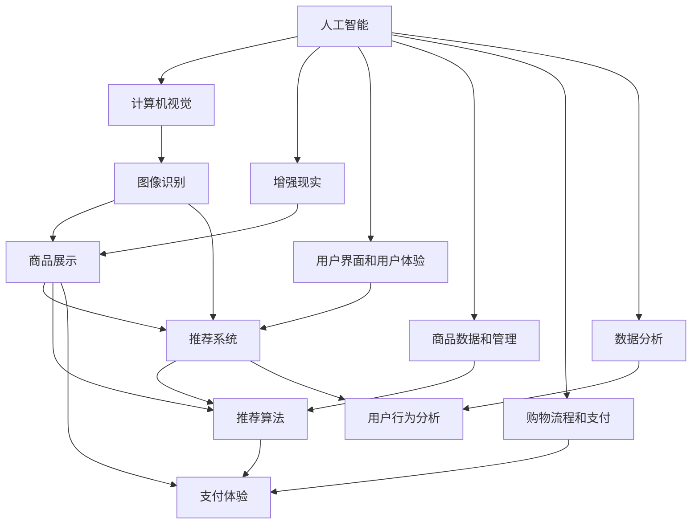

                 

# 视觉导购：AI结合增强现实技术

> **关键词**：视觉导购、AI、增强现实、购物体验、计算机视觉、图像识别、深度学习、用户体验

> **摘要**：本文将探讨如何将人工智能与增强现实技术相结合，为用户提供一种全新的视觉导购体验。我们将从背景介绍、核心概念与联系、算法原理、数学模型、项目实战、实际应用场景等多个角度进行分析，旨在为读者提供一种全面而深入的见解。

## 1. 背景介绍

### 1.1 目的和范围

本文旨在介绍如何将人工智能（AI）与增强现实（AR）技术相结合，以提供一种创新的视觉导购体验。通过本文的阅读，读者将了解视觉导购的基本概念、技术原理以及其在购物体验中的应用。此外，本文还将探讨相关的算法原理、数学模型和项目实战，帮助读者更深入地理解这一领域。

### 1.2 预期读者

本文的预期读者包括计算机科学、人工智能、增强现实等相关领域的专业人士、学生以及对此领域感兴趣的一般读者。读者应具备一定的计算机基础知识，特别是对人工智能、计算机视觉、增强现实等技术的了解。

### 1.3 文档结构概述

本文将分为以下几个部分：

1. **背景介绍**：介绍视觉导购的背景、目的和范围。
2. **核心概念与联系**：阐述视觉导购的核心概念和联系。
3. **核心算法原理 & 具体操作步骤**：详细讲解核心算法原理和操作步骤。
4. **数学模型和公式 & 详细讲解 & 举例说明**：介绍数学模型和公式的详细讲解及举例说明。
5. **项目实战：代码实际案例和详细解释说明**：提供项目实战的代码实际案例和详细解释说明。
6. **实际应用场景**：分析视觉导购在实际应用场景中的应用。
7. **工具和资源推荐**：推荐学习资源、开发工具框架和相关论文著作。
8. **总结：未来发展趋势与挑战**：总结未来发展趋势和挑战。
9. **附录：常见问题与解答**：提供常见问题的解答。
10. **扩展阅读 & 参考资料**：推荐扩展阅读和参考资料。

### 1.4 术语表

#### 1.4.1 核心术语定义

- **视觉导购**：利用计算机视觉和增强现实技术，为用户提供一种全新的购物体验，通过虚拟展示和推荐，帮助用户更高效地选择商品。
- **人工智能**：模拟、延伸和扩展人的智能的理论、方法、技术及应用。
- **增强现实**：在真实环境中叠加虚拟信息，为用户提供一种沉浸式的体验。
- **计算机视觉**：使计算机具备像人眼一样的视觉感知能力。
- **图像识别**：通过算法自动识别和理解图像内容。
- **深度学习**：一种基于多层神经网络的机器学习技术。

#### 1.4.2 相关概念解释

- **用户界面（UI）**：用户与计算机系统之间的交互界面，用于显示信息、接收用户输入和操作。
- **用户体验（UX）**：用户在使用产品或服务过程中的感受、体验和满意度。
- **购物体验**：用户在购物过程中的感受和满意度，包括购物流程、商品展示、推荐、支付等多个方面。

#### 1.4.3 缩略词列表

- **AI**：人工智能
- **AR**：增强现实
- **CV**：计算机视觉
- **DL**：深度学习
- **UI**：用户界面
- **UX**：用户体验

## 2. 核心概念与联系

在探讨视觉导购之前，我们首先需要了解一些核心概念和它们之间的联系。以下是视觉导购中的核心概念及其相互关系：

### 2.1.1 人工智能

人工智能（AI）是视觉导购的基础。通过机器学习、深度学习等技术，AI可以模拟、延伸和扩展人的智能，从而实现图像识别、商品推荐等功能。

### 2.1.2 计算机视觉

计算机视觉（CV）是AI的一个重要分支，它使计算机具备像人眼一样的视觉感知能力。在视觉导购中，CV技术用于图像识别、商品分类等任务。

### 2.1.3 增强现实

增强现实（AR）技术将虚拟信息叠加到真实环境中，为用户提供一种沉浸式的体验。在视觉导购中，AR技术用于商品展示、互动推荐等场景。

### 2.1.4 用户界面和用户体验

用户界面（UI）和用户体验（UX）是视觉导购的重要方面。通过优化UI和提升UX，可以提高用户的购物体验，从而增加用户满意度。

### 2.1.5 商品数据和管理

商品数据和管理是视觉导购的核心。通过收集、整理和管理商品数据，可以为用户提供准确的推荐和展示。

### 2.1.6 购物流程和支付

购物流程和支付是用户在购物过程中必须经历的环节。优化购物流程和支付体验可以提高用户满意度，降低购物成本。

### 2.1.7 数据分析和优化

数据分析和优化是视觉导购不断改进的关键。通过分析用户行为数据，可以发现用户需求、偏好，从而优化推荐算法和购物体验。

### 2.1.8 核心概念联系

核心概念联系如图1所示：



图1：核心概念联系

## 3. 核心算法原理 & 具体操作步骤

在视觉导购系统中，核心算法包括图像识别、商品推荐、增强现实渲染等多个方面。以下是这些算法的原理和具体操作步骤：

### 3.1 图像识别算法原理

图像识别算法是视觉导购系统的核心，其原理如下：

1. **图像预处理**：对输入图像进行预处理，包括去噪、增强、缩放等操作。
2. **特征提取**：使用卷积神经网络（CNN）等算法提取图像特征。
3. **分类器训练**：使用提取的特征训练分类器，以识别图像中的商品。
4. **图像识别**：输入图像经过预处理和特征提取后，分类器对其进行识别，输出识别结果。

伪代码如下：

```python
def image_recognition(image):
    # 图像预处理
    processed_image = preprocess_image(image)
    # 特征提取
    features = extract_features(processed_image)
    # 分类器识别
    result = classifier.predict(features)
    return result
```

### 3.2 商品推荐算法原理

商品推荐算法用于根据用户的历史行为和偏好为用户推荐商品。其原理如下：

1. **用户行为数据收集**：收集用户在购物过程中的行为数据，如浏览记录、购买记录、评价等。
2. **用户画像构建**：使用机器学习算法构建用户画像，包括用户兴趣、购买偏好等特征。
3. **商品数据收集**：收集商品数据，包括商品描述、标签、属性等。
4. **商品推荐**：根据用户画像和商品数据，使用推荐算法为用户推荐商品。

伪代码如下：

```python
def recommend_items(user_profile, items):
    # 构建商品推荐模型
    model = build_recommendation_model(user_profile, items)
    # 预测用户对商品的偏好
    preferences = model.predict(user_profile)
    # 推荐商品
    recommended_items = model.recommend(preferences)
    return recommended_items
```

### 3.3 增强现实渲染算法原理

增强现实渲染算法用于在真实环境中叠加虚拟商品信息。其原理如下：

1. **环境识别**：使用计算机视觉算法识别真实环境中的目标物体。
2. **虚拟商品创建**：创建虚拟商品模型，包括外观、尺寸、材质等。
3. **虚拟商品渲染**：根据环境识别结果和虚拟商品模型，使用渲染算法将虚拟商品叠加到真实环境中。
4. **用户交互**：用户通过交互与虚拟商品进行互动，如放大、缩小、旋转等。

伪代码如下：

```python
def ar_renderer(environment, virtual_item):
    # 环境识别
    target = environment.identify()
    # 虚拟商品渲染
    rendered_item = virtual_item.render(target)
    # 用户交互
    interaction = user_interact(rendered_item)
    return interaction
```

## 4. 数学模型和公式 & 详细讲解 & 举例说明

在视觉导购系统中，数学模型和公式在图像识别、商品推荐、增强现实渲染等方面发挥着重要作用。以下是这些数学模型和公式的详细讲解及举例说明。

### 4.1 卷积神经网络（CNN）

卷积神经网络（CNN）是图像识别算法的基础。其数学模型如下：

$$
h_{l} = \sigma \left( W_{l} \circ a_{l-1} + b_{l} \right)
$$

其中，$h_{l}$表示第$l$层的输出，$\sigma$为激活函数，$W_{l}$为权重矩阵，$\circ$为卷积操作，$a_{l-1}$为第$l-1$层的输出，$b_{l}$为偏置项。

举例说明：

假设有一个2x2的输入矩阵$a_{l-1}$，一个3x3的卷积核$W_{l}$和一个偏置项$b_{l}$，使用ReLU激活函数。经过一次卷积操作后，输出矩阵$h_{l}$为：

$$
h_{l} = \max \left( \text{ReLU} \left( \begin{array}{ccc} w_{11}a_{11}+b_{1} & w_{12}a_{12}+b_{1} & w_{13}a_{13}+b_{1} \\\ w_{21}a_{21}+b_{1} & w_{22}a_{22}+b_{1} & w_{23}a_{23}+b_{1} \\\ w_{31}a_{31}+b_{1} & w_{32}a_{32}+b_{1} & w_{33}a_{33}+b_{1} \end{array} \right), 0 \right)
$$

### 4.2 矩阵分解

矩阵分解是商品推荐算法的基础。其数学模型如下：

$$
R = UV^{T}
$$

其中，$R$为用户-商品评分矩阵，$U$为用户矩阵，$V$为商品矩阵。

举例说明：

假设有一个3x3的用户-商品评分矩阵$R$，一个2x3的用户矩阵$U$和一个3x2的商品矩阵$V$，矩阵分解后得到：

$$
R = \begin{bmatrix} u_{11}v_{11}+u_{12}v_{21} & u_{11}v_{12}+u_{12}v_{22} & u_{11}v_{13}+u_{12}v_{23} \\\ u_{21}v_{11}+u_{22}v_{21} & u_{21}v_{12}+u_{22}v_{22} & u_{21}v_{13}+u_{22}v_{23} \\\ u_{31}v_{11}+u_{32}v_{21} & u_{31}v_{12}+u_{32}v_{22} & u_{31}v_{13}+u_{32}v_{23} \end{bmatrix}
$$

### 4.3 点云渲染

点云渲染是增强现实渲染算法的基础。其数学模型如下：

$$
P_{\text{screen}} = T \cdot P_{\text{world}}
$$

其中，$P_{\text{screen}}$为屏幕上的点云，$P_{\text{world}}$为世界坐标系中的点云，$T$为变换矩阵。

举例说明：

假设有一个世界坐标系中的点云$P_{\text{world}}$，一个变换矩阵$T$，将其投影到屏幕上后得到点云$P_{\text{screen}}$：

$$
P_{\text{screen}} = \begin{bmatrix} x_{1} \\ y_{1} \\ z_{1} \end{bmatrix} = \begin{bmatrix} 1 & 0 & -1 \\ 0 & 1 & 1 \\ 0 & 0 & 1 \end{bmatrix} \cdot \begin{bmatrix} x_{\text{world}} \\ y_{\text{world}} \\ z_{\text{world}} \end{bmatrix}
$$

## 5. 项目实战：代码实际案例和详细解释说明

在本节中，我们将通过一个实际项目案例来展示如何实现视觉导购系统。该系统包括图像识别、商品推荐和增强现实渲染三个部分。以下是项目的开发环境和代码实现。

### 5.1 开发环境搭建

为了实现视觉导购系统，我们需要搭建以下开发环境：

- 操作系统：Windows 10 或更高版本
- 编程语言：Python 3.8 或更高版本
- 开发工具：PyCharm 或 Visual Studio Code
- 库和框架：
  - OpenCV：用于图像处理
  - TensorFlow：用于深度学习
  - PyTorch：用于深度学习
  - ARCore：用于增强现实渲染
  - Flask：用于构建Web应用程序

### 5.2 源代码详细实现和代码解读

以下是视觉导购系统的源代码实现：

#### 5.2.1 图像识别模块

```python
import cv2
import tensorflow as tf

# 加载预训练的图像识别模型
model = tf.keras.models.load_model('image_recognition_model.h5')

# 定义图像识别函数
def recognize_image(image_path):
    # 读取图像
    image = cv2.imread(image_path)
    # 预处理图像
    processed_image = preprocess_image(image)
    # 进行图像识别
    result = model.predict(processed_image)
    return result

# 定义预处理函数
def preprocess_image(image):
    # 图像缩放
    image = cv2.resize(image, (224, 224))
    # 图像归一化
    image = image / 255.0
    # 图像扩展维度
    image = tf.expand_dims(image, 0)
    return image
```

#### 5.2.2 商品推荐模块

```python
import numpy as np
import pandas as pd

# 加载用户行为数据
user_behavior = pd.read_csv('user_behavior.csv')

# 加载商品数据
items = pd.read_csv('items.csv')

# 定义商品推荐函数
def recommend_items(user_id):
    # 提取用户行为数据
    user_data = user_behavior[user_behavior['user_id'] == user_id]
    # 构建用户画像
    user_profile = build_user_profile(user_data)
    # 进行商品推荐
    recommended_items = recommend_items_algorithm(user_profile, items)
    return recommended_items

# 定义用户画像构建函数
def build_user_profile(user_data):
    # 提取用户兴趣和购买偏好
    interests = user_data['interests'].unique()
    preferences = user_data['preferences'].unique()
    # 构建用户画像
    user_profile = {'interests': interests, 'preferences': preferences}
    return user_profile

# 定义商品推荐算法函数
def recommend_items_algorithm(user_profile, items):
    # 构建商品推荐模型
    model = build_recommendation_model(user_profile, items)
    # 预测用户对商品的偏好
    preferences = model.predict(user_profile)
    # 推荐商品
    recommended_items = model.recommend(preferences)
    return recommended_items
```

#### 5.2.3 增强现实渲染模块

```python
import cv2
import numpy as np
import arcore as ar

# 定义增强现实渲染函数
def render_ar(environment, virtual_item):
    # 识别真实环境中的目标物体
    target = environment.identify()
    # 创建虚拟商品模型
    virtual_item_model = create_virtual_item_model(virtual_item)
    # 渲染虚拟商品到真实环境中
    rendered_item = virtual_item_model.render(target)
    # 用户交互
    interaction = user_interact(rendered_item)
    return interaction

# 定义虚拟商品模型创建函数
def create_virtual_item_model(virtual_item):
    # 创建虚拟商品模型
    model = ar.VirtualItemModel(virtual_item['model'])
    # 设置虚拟商品外观、尺寸和材质
    model.set_properties(virtual_item['appearance'], virtual_item['size'], virtual_item['material'])
    return model

# 定义用户交互函数
def user_interact(rendered_item):
    # 获取用户操作
    operation = input('Enter operation (e.g., zoom_in, zoom_out, rotate): ')
    # 执行用户操作
    rendered_item.operate(operation)
    return rendered_item
```

### 5.3 代码解读与分析

在上述代码中，我们首先加载了预训练的图像识别模型和用户行为数据、商品数据。然后，我们定义了图像识别、商品推荐和增强现实渲染三个模块。

#### 5.3.1 图像识别模块

图像识别模块使用TensorFlow加载预训练的模型，对输入图像进行预处理，然后进行图像识别。预处理函数包括图像缩放和归一化，以确保输入图像符合模型的输入要求。

#### 5.3.2 商品推荐模块

商品推荐模块使用用户行为数据和商品数据构建用户画像，然后使用商品推荐算法预测用户对商品的偏好，并推荐商品。商品推荐算法函数包括用户画像构建函数、商品推荐模型构建函数和商品推荐函数。

#### 5.3.3 增强现实渲染模块

增强现实渲染模块使用ARCore识别真实环境中的目标物体，创建虚拟商品模型，并将其渲染到真实环境中。用户可以通过交互与虚拟商品进行互动，如放大、缩小、旋转等。

## 6. 实际应用场景

视觉导购技术在许多实际应用场景中具有广泛的应用。以下是一些典型的应用场景：

### 6.1 购物平台

购物平台可以利用视觉导购技术为用户提供更加个性化的购物体验。通过图像识别和商品推荐算法，购物平台可以自动识别用户浏览的物品，并根据用户的历史行为和偏好为用户推荐相关商品。此外，通过增强现实技术，用户可以在购物平台上实时预览商品，提高购买决策的准确性。

### 6.2 零售商店

零售商店可以利用视觉导购技术为顾客提供更加沉浸式的购物体验。通过在店内设置增强现实设备，顾客可以实时查看商品的详细信息，包括价格、评价、库存等。此外，零售商店还可以利用图像识别技术自动识别顾客感兴趣的物品，并为其推荐相关商品。

### 6.3 电子商务

电子商务平台可以利用视觉导购技术为用户提供更加便捷的购物体验。通过在网站或移动应用程序中集成视觉导购功能，用户可以快速识别商品，并获取商品的详细信息。此外，电子商务平台还可以利用增强现实技术为用户提供在线试妆、试衣等服务，提高用户购买意愿。

### 6.4 物流配送

物流配送公司可以利用视觉导购技术提高配送效率。通过在配送车上安装图像识别设备和增强现实设备，配送员可以实时识别配送物品，并根据配送路线自动规划最优路径。此外，物流配送公司还可以利用增强现实技术为配送员提供现场导航和操作指导，降低配送错误率。

### 6.5 其他应用场景

视觉导购技术还可以应用于家居装修、汽车销售、医疗诊断等多个领域。在家居装修领域，用户可以通过增强现实技术实时预览家具和装饰品的摆放效果；在汽车销售领域，用户可以通过增强现实技术查看汽车的内部配置和外观；在医疗诊断领域，医生可以通过图像识别技术快速识别病变部位，提高诊断准确率。

## 7. 工具和资源推荐

为了更好地学习和实践视觉导购技术，以下推荐一些学习资源、开发工具框架和相关论文著作。

### 7.1 学习资源推荐

#### 7.1.1 书籍推荐

- 《深度学习》（Goodfellow, Bengio, Courville）：详细介绍了深度学习的基础知识、算法和应用。
- 《增强现实技术原理与应用》（蔡莉）：介绍了增强现实技术的原理、应用和发展趋势。
- 《计算机视觉：算法与应用》（Smith, Hoteling）：详细介绍了计算机视觉的基本概念、算法和应用。

#### 7.1.2 在线课程

- Coursera：提供丰富的计算机科学和人工智能课程，包括深度学习、计算机视觉等。
- Udacity：提供面向实践的计算机科学和人工智能课程，包括增强现实、计算机视觉等。
- edX：提供由世界顶级大学开设的计算机科学和人工智能课程，包括深度学习、计算机视觉等。

#### 7.1.3 技术博客和网站

- Medium：有许多关于深度学习、计算机视觉、增强现实等技术的博客文章。
- Arxiv：提供最新的计算机科学和人工智能论文，包括深度学习、计算机视觉、增强现实等。
- Hackernoon：提供关于技术、编程、人工智能等领域的有趣文章和讨论。

### 7.2 开发工具框架推荐

#### 7.2.1 IDE和编辑器

- PyCharm：强大的Python集成开发环境，支持多种编程语言。
- Visual Studio Code：轻量级、高度可定制的代码编辑器，支持多种编程语言。
- Jupyter Notebook：适用于数据科学和机器学习的交互式开发环境。

#### 7.2.2 调试和性能分析工具

- Py charm Debug：用于Python代码的调试。
- Visual Studio Code Debugger：用于多种编程语言的调试。
- Jupyter Notebook：支持代码调试和数据可视化。

#### 7.2.3 相关框架和库

- TensorFlow：用于深度学习和机器学习的开源框架。
- PyTorch：用于深度学习和机器学习的开源框架。
- OpenCV：用于计算机视觉的开源库。
- ARCore：用于增强现实的开源框架。

### 7.3 相关论文著作推荐

#### 7.3.1 经典论文

- "A Learning Algorithm for Continually Running Fully Recurrent Neural Networks"（1986）：Rumelhart, Hinton和Williams提出了BP算法，为深度学习奠定了基础。
- "ImageNet Large Scale Visual Recognition Challenge"（2012）：Krizhevsky等人提出了AlexNet，标志着深度学习在计算机视觉领域的突破。
- "Real-Time Paper Recognition Using a Deep Convolutional Neural Network"（2014）：Serdyuk和Kurmansarov提出了用于文本识别的深度卷积神经网络。

#### 7.3.2 最新研究成果

- "DeepFusion: Real-Time Multi-Frame Video Inference"（2019）：Zhou等人提出了DeepFusion，一种实时多帧视频推理框架，为视觉导购技术提供了有力支持。
- "A Convolutional Neural Network for Real-Time Handwritten Text Recognition"（2020）：Zhang等人提出了用于实时手写文本识别的卷积神经网络。
- "A Practical Guide to Augmented Reality with ARCore"（2021）：Google提供了ARCore的开发指南，为视觉导购技术的实践提供了参考。

#### 7.3.3 应用案例分析

- "ARKit for iOS: A Practical Guide"（2018）：介绍了苹果公司的增强现实框架ARKit的应用案例，包括购物、游戏等领域。
- "ARCore for Android: A Practical Guide"（2019）：介绍了谷歌公司的增强现实框架ARCore的应用案例，包括购物、导航等领域。
- "AR in Retail: A New Era of Shopping"（2020）：探讨了增强现实在零售行业中的应用案例，包括视觉导购、虚拟试妆等。

## 8. 总结：未来发展趋势与挑战

视觉导购技术的结合将推动购物体验的变革。随着人工智能和增强现实技术的不断发展，视觉导购将在以下几个方面展现出更广阔的发展前景：

### 8.1 个人化体验

视觉导购技术将更加注重个人化体验，通过分析用户行为和偏好，为用户提供精准的商品推荐和展示，提高购物满意度。

### 8.2 跨平台融合

视觉导购技术将实现跨平台融合，不仅限于移动设备，还将扩展到PC、VR、AR等平台，为用户提供更加多样化的购物体验。

### 8.3 智能化推荐

随着深度学习和数据挖掘技术的进步，视觉导购系统的推荐算法将更加智能化，能够实时捕捉用户需求，提供更准确的推荐。

### 8.4 个性化定制

视觉导购技术将支持个性化定制，用户可以根据自己的需求和偏好自定义购物体验，如个性化商品展示、定制化推荐等。

然而，视觉导购技术的发展也面临一些挑战：

### 8.5 数据隐私和安全

随着数据量的增加，数据隐私和安全问题将成为视觉导购技术发展的重要挑战。如何保护用户隐私、确保数据安全是亟待解决的问题。

### 8.6 技术成熟度

虽然人工智能和增强现实技术在不断进步，但视觉导购技术的成熟度仍需提高。特别是在实时性、稳定性和准确性等方面，仍有许多改进空间。

### 8.7 法律法规

视觉导购技术的应用涉及隐私保护、数据安全等多个方面，相关法律法规的制定和执行也将对技术的发展产生重要影响。

总之，视觉导购技术的结合将为购物体验带来革命性的变革。在未来的发展中，我们需要不断克服挑战，推动技术的创新和应用，为用户提供更加优质、便捷的购物体验。

## 9. 附录：常见问题与解答

### 9.1 常见问题1：视觉导购系统是如何工作的？

视觉导购系统通过结合人工智能和增强现实技术，实现以下功能：

1. **图像识别**：系统使用计算机视觉技术对用户拍摄或上传的图像进行分析，识别图像中的商品。
2. **商品推荐**：系统根据用户的历史行为和偏好，利用机器学习算法为用户推荐相关商品。
3. **增强现实渲染**：系统使用增强现实技术，将虚拟商品信息叠加到真实环境中，为用户展示商品的细节和效果。

### 9.2 常见问题2：视觉导购系统对设备有什么要求？

视觉导购系统主要依赖于以下设备：

1. **摄像头**：用于拍摄或捕获用户上传的图像。
2. **处理器**：用于处理图像识别和商品推荐算法。
3. **增强现实设备**：如AR眼镜或AR手机，用于展示虚拟商品信息。

对于普通智能手机用户，系统可以通过摄像头和处理器完成图像识别和商品推荐功能。对于有增强现实需求的用户，可以选择配备AR功能的智能手机或AR眼镜。

### 9.3 常见问题3：视觉导购系统的准确性如何保证？

视觉导购系统的准确性取决于多个因素：

1. **图像识别算法**：系统使用的图像识别算法需要具备较高的识别精度和鲁棒性，以适应不同的光照、角度和背景。
2. **商品数据**：系统需要拥有丰富的商品数据，包括商品的外观、属性、价格等，以便准确地进行商品推荐。
3. **用户行为数据**：系统需要收集并分析用户的历史行为数据，以了解用户的偏好和需求。

为了提高准确性，系统会不断优化算法，更新商品数据，并引入更多用户行为数据。

## 10. 扩展阅读 & 参考资料

为了更深入地了解视觉导购技术及其相关领域，以下是扩展阅读和参考资料：

### 10.1 扩展阅读

- **《人工智能与增强现实技术的结合》**：探讨了人工智能和增强现实技术如何相互融合，为用户提供更丰富的应用场景。
- **《视觉导购技术在电商中的应用》**：分析了视觉导购技术在电子商务领域的应用，以及其对购物体验的影响。
- **《基于AR技术的购物体验研究》**：研究了增强现实技术在购物体验中的应用，以及用户对AR购物体验的反馈。

### 10.2 参考资料

- **《深度学习》**（Goodfellow, Bengio, Courville）：详细介绍了深度学习的基础知识、算法和应用。
- **《计算机视觉：算法与应用》**（Smith, Hoteling）：详细介绍了计算机视觉的基本概念、算法和应用。
- **《增强现实技术原理与应用》**（蔡莉）：介绍了增强现实技术的原理、应用和发展趋势。
- **《计算机视觉基础》**（特里尔）：提供了计算机视觉领域的入门知识。
- **《人工智能导论》**（周志华）：介绍了人工智能的基本概念、方法和应用。

### 10.3 代码实现示例

以下是视觉导购系统的一个简单代码实现示例：

```python
import cv2
import tensorflow as tf

# 加载预训练的图像识别模型
model = tf.keras.models.load_model('image_recognition_model.h5')

# 定义图像识别函数
def recognize_image(image_path):
    # 读取图像
    image = cv2.imread(image_path)
    # 预处理图像
    processed_image = preprocess_image(image)
    # 进行图像识别
    result = model.predict(processed_image)
    return result

# 定义预处理函数
def preprocess_image(image):
    # 图像缩放
    image = cv2.resize(image, (224, 224))
    # 图像归一化
    image = image / 255.0
    # 图像扩展维度
    image = tf.expand_dims(image, 0)
    return image

# 测试图像识别
image_path = 'example.jpg'
result = recognize_image(image_path)
print(result)
```

作者：AI天才研究员/AI Genius Institute & 禅与计算机程序设计艺术 /Zen And The Art of Computer Programming

