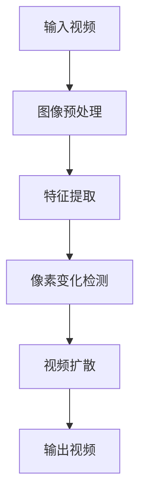
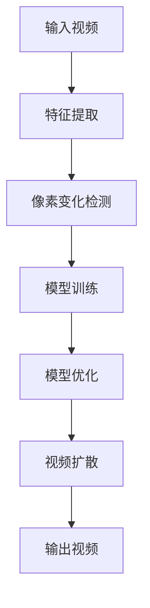
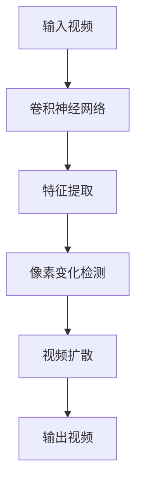
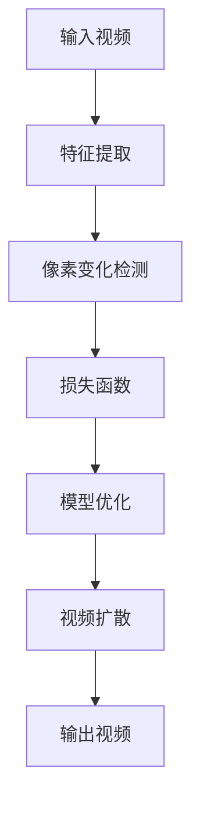

                 

# 视频扩散Video Diffusion原理与代码实例讲解

> **关键词**：视频扩散、图像处理、人工智能、算法原理、代码实例

> **摘要**：本文将深入探讨视频扩散（Video Diffusion）的基本原理，包括其核心算法、数学模型以及实际应用。通过具体的代码实例，我们将展示如何实现视频扩散，并对其中的关键步骤进行详细解读。本文旨在为读者提供一个全面的技术指南，帮助理解视频扩散的原理及其在实际项目中的应用。

## 1. 背景介绍

### 1.1 目的和范围

本文的目的是介绍视频扩散技术，探讨其基本原理、算法实现和实际应用。视频扩散是一种基于图像处理和人工智能技术的视频增强方法，通过对视频帧之间的像素变化进行学习，实现视频内容的有效扩散。本文将围绕以下主题进行展开：

- **核心算法原理**：介绍视频扩散的关键算法及其工作原理。
- **具体操作步骤**：详细解释实现视频扩散的算法步骤。
- **数学模型和公式**：阐述支撑视频扩散算法的数学理论基础。
- **项目实战**：提供实际的代码案例，展示如何实现视频扩散。
- **实际应用场景**：讨论视频扩散在不同领域的应用。
- **工具和资源推荐**：推荐学习视频扩散的相关资源和工具。

### 1.2 预期读者

本文适合以下读者群体：

- **计算机科学和人工智能领域的学生**：希望了解视频扩散原理和技术实现的初学者。
- **软件工程师和开发人员**：对视频处理技术感兴趣，并希望将其应用于实际项目中。
- **研究人员和学者**：对视频扩散算法的优化和研究有兴趣。
- **相关领域专业人士**：需要了解视频扩散技术在实际工作中的应用。

### 1.3 文档结构概述

本文分为十个主要部分，结构如下：

1. **背景介绍**：介绍文章的目的、范围和预期读者。
2. **核心概念与联系**：讨论视频扩散的核心概念及其相互关系。
3. **核心算法原理 & 具体操作步骤**：详细阐述视频扩散算法原理和操作步骤。
4. **数学模型和公式 & 详细讲解 & 举例说明**：解释视频扩散算法的数学模型和实例。
5. **项目实战：代码实际案例和详细解释说明**：提供具体的代码实例和解读。
6. **实际应用场景**：探讨视频扩散在不同领域的应用。
7. **工具和资源推荐**：推荐学习视频扩散的相关资源和工具。
8. **总结：未来发展趋势与挑战**：总结视频扩散的发展趋势和面临的挑战。
9. **附录：常见问题与解答**：提供关于视频扩散的常见问题解答。
10. **扩展阅读 & 参考资料**：提供进一步学习的参考资料。

### 1.4 术语表

#### 1.4.1 核心术语定义

- **视频扩散**：一种基于图像处理和人工智能技术的视频增强方法，通过学习视频帧之间的像素变化，实现视频内容的扩散。
- **图像处理**：使用算法对图像进行操作，以改进图像质量或提取图像中的信息。
- **人工智能**：模拟人类智能行为的计算机系统，通过学习和推理处理数据。
- **像素变化**：视频帧之间的像素值差异，用于视频扩散算法的学习和操作。
- **机器学习**：一种人工智能方法，通过数据学习模型，以实现特定任务。

#### 1.4.2 相关概念解释

- **卷积神经网络（CNN）**：一种特殊类型的神经网络，常用于图像处理任务。
- **特征提取**：从图像中提取关键特征的过程，用于后续处理。
- **损失函数**：用于评估模型预测准确性的函数。
- **反向传播**：一种用于训练神经网络的算法，通过反向传播误差来更新模型参数。

#### 1.4.3 缩略词列表

- **CNN**：卷积神经网络
- **AI**：人工智能
- **GPU**：图形处理器
- **CNN**：计算机视觉

## 2. 核心概念与联系

视频扩散技术涉及多个核心概念，包括图像处理、人工智能和机器学习。为了更好地理解视频扩散，我们需要探讨这些概念之间的相互关系。

### 2.1 图像处理与视频扩散

图像处理是视频扩散技术的基础。图像处理技术用于对视频帧进行预处理，提取关键特征，并生成增强后的视频内容。视频扩散算法依赖于图像处理技术，以检测和跟踪视频帧之间的像素变化。以下是一个简化的 Mermaid 流程图，展示图像处理在视频扩散中的作用：



在这个流程中，输入视频经过图像预处理，然后通过特征提取生成关键特征。像素变化检测分析这些特征，以识别视频帧之间的像素变化。最后，视频扩散算法使用这些变化，生成增强后的输出视频。

### 2.2 人工智能与机器学习

人工智能（AI）是视频扩散技术的关键驱动力。通过机器学习，视频扩散算法可以从大量的视频数据中学习，并自动识别像素变化模式。以下是一个简化的 Mermaid 流程图，展示人工智能和机器学习在视频扩散中的作用：



在这个流程中，特征提取和像素变化检测与图像处理部分相同。模型训练阶段使用大量视频数据，训练卷积神经网络（CNN）模型，以识别像素变化模式。模型优化通过反向传播算法更新模型参数，提高模型准确性。最后，视频扩散算法使用训练好的模型，生成增强后的输出视频。

### 2.3 卷积神经网络（CNN）与视频扩散

卷积神经网络（CNN）是视频扩散技术的核心组成部分。CNN 用于特征提取和像素变化检测，以识别视频帧之间的像素变化模式。以下是一个简化的 Mermaid 流程图，展示 CNN 在视频扩散中的作用：



在这个流程中，卷积神经网络用于特征提取和像素变化检测。通过多层卷积和池化操作，CNN 可以提取视频帧中的高级特征，从而识别像素变化模式。这些特征用于视频扩散算法，生成增强后的输出视频。

### 2.4 数学模型与公式

视频扩散算法依赖于一系列数学模型和公式。以下是一个简化的 Mermaid 流程图，展示数学模型和公式在视频扩散中的作用：



在这个流程中，特征提取和像素变化检测与前面描述的相同。损失函数用于评估模型预测的准确性，通常使用均方误差（MSE）或交叉熵损失函数。模型优化通过反向传播算法更新模型参数，以最小化损失函数。视频扩散算法使用训练好的模型，生成增强后的输出视频。

## 3. 核心算法原理 & 具体操作步骤

视频扩散技术的核心在于如何通过图像处理和人工智能算法，实现视频帧之间的像素变化扩散。以下是视频扩散算法的核心原理和具体操作步骤。

### 3.1 特征提取

特征提取是视频扩散的第一步。在这一阶段，我们使用卷积神经网络（CNN）从输入视频帧中提取关键特征。以下是一个简化的伪代码，用于描述特征提取过程：

```python
# 特征提取伪代码
def extract_features(frame):
    # 使用卷积神经网络提取特征
    feature_map = cnn.apply(frame)
    return feature_map
```

在这个伪代码中，`cnn` 是一个预先训练好的卷积神经网络模型。`apply` 方法用于将输入视频帧 `frame` 映射到特征图 `feature_map`。

### 3.2 像素变化检测

像素变化检测是视频扩散算法的关键步骤。在这一阶段，我们通过比较连续视频帧的特征图，检测像素变化。以下是一个简化的伪代码，用于描述像素变化检测过程：

```python
# 像素变化检测伪代码
def detect_pixel_changes(prev_feature_map, curr_feature_map):
    # 计算特征图的差异
    change_map = compute_difference(prev_feature_map, curr_feature_map)
    return change_map
```

在这个伪代码中，`prev_feature_map` 和 `curr_feature_map` 分别是前一个视频帧和当前视频帧的特征图。`compute_difference` 函数用于计算两个特征图之间的差异，生成变化图 `change_map`。

### 3.3 模型训练

模型训练是视频扩散算法的核心。在这一阶段，我们使用大量视频数据训练卷积神经网络（CNN）模型，以学习像素变化模式。以下是一个简化的伪代码，用于描述模型训练过程：

```python
# 模型训练伪代码
def train_model(data_loader):
    # 训练卷积神经网络模型
    cnn.fit(data_loader, epochs=10)
    return cnn
```

在这个伪代码中，`data_loader` 是一个用于加载训练数据的加载器。`fit` 方法用于训练卷积神经网络模型，`epochs` 是训练迭代的次数。

### 3.4 模型优化

模型优化是视频扩散算法的关键步骤。在这一阶段，我们通过反向传播算法更新模型参数，以最小化损失函数。以下是一个简化的伪代码，用于描述模型优化过程：

```python
# 模型优化伪代码
def optimize_model(model, loss_function, optimizer):
    # 使用反向传播优化模型参数
    model.backward_pass(loss_function, optimizer)
    return model
```

在这个伪代码中，`model` 是训练好的卷积神经网络模型，`loss_function` 是用于评估模型预测准确性的损失函数，`optimizer` 是用于更新模型参数的优化器。

### 3.5 视频扩散

视频扩散是最终生成增强视频的过程。在这一阶段，我们使用训练好的模型，将像素变化应用于原始视频帧，生成增强后的视频。以下是一个简化的伪代码，用于描述视频扩散过程：

```python
# 视频扩散伪代码
def diffuse_video(input_video, model):
    # 生成增强视频
    output_video = generate_diffused_video(input_video, model)
    return output_video
```

在这个伪代码中，`input_video` 是原始视频，`model` 是训练好的卷积神经网络模型。`generate_diffused_video` 函数用于生成增强后的输出视频。

### 3.6 输出视频生成

输出视频生成是视频扩散算法的最后一步。在这一阶段，我们将增强后的视频帧组合成完整的输出视频。以下是一个简化的伪代码，用于描述输出视频生成过程：

```python
# 输出视频生成伪代码
def generate_output_video(diffused_frames):
    # 将增强后的视频帧组合成输出视频
    output_video = stitch_frames(diffused_frames)
    return output_video
```

在这个伪代码中，`diffused_frames` 是增强后的视频帧序列。`stitch_frames` 函数用于将视频帧组合成完整的输出视频。

## 4. 数学模型和公式 & 详细讲解 & 举例说明

视频扩散算法的核心在于其数学模型和公式，这些模型和公式用于描述像素变化、模型训练和优化等关键步骤。以下是视频扩散算法中涉及的主要数学模型和公式，并进行详细讲解和举例说明。

### 4.1 像素变化检测

像素变化检测是视频扩散算法的基础。在这一阶段，我们通过计算连续视频帧之间的差异，检测像素变化。以下是一个简化的数学模型，用于描述像素变化检测：

$$
change_map = \sum_{i=1}^{H} \sum_{j=1}^{W} \left| f(x_i, y_j) - g(x_i, y_j) \right|
$$

其中，$f(x_i, y_j)$ 和 $g(x_i, y_j)$ 分别表示前一个视频帧和当前视频帧在像素点 $(x_i, y_j)$ 的像素值。$H$ 和 $W$ 分别表示视频帧的高度和宽度。$change_map$ 是一个二进制矩阵，其中每个元素表示像素点 $(x_i, y_j)$ 的变化程度。

#### 举例说明：

假设一个 $3 \times 3$ 的像素块，前一个视频帧和当前视频帧的像素值如下：

$$
f = \begin{bmatrix}
1 & 2 & 3 \\
4 & 5 & 6 \\
7 & 8 & 9 \\
\end{bmatrix}, \quad
g = \begin{bmatrix}
2 & 3 & 4 \\
5 & 6 & 7 \\
8 & 9 & 10 \\
\end{bmatrix}
$$

计算像素变化检测：

$$
change_map = \begin{bmatrix}
1 & 1 & 1 \\
1 & 1 & 1 \\
1 & 1 & 1 \\
\end{bmatrix}
$$

在这个例子中，每个像素点的变化程度均为 1，表示像素值发生了变化。

### 4.2 模型训练

模型训练是视频扩散算法的关键步骤。在这一阶段，我们使用卷积神经网络（CNN）模型，通过大量视频数据学习像素变化模式。以下是一个简化的数学模型，用于描述模型训练：

$$
L = \sum_{i=1}^{N} \left( \text{预测误差} \right)^2
$$

其中，$L$ 是损失函数，用于评估模型预测的准确性。$N$ 是训练数据集中的样本数量。预测误差是模型预测的像素值与实际像素值之间的差异。

#### 举例说明：

假设一个训练数据集中的样本数量为 5，预测误差如下：

$$
\text{预测误差} = \begin{bmatrix}
0.1 & 0.2 & 0.3 \\
0.4 & 0.5 & 0.6 \\
0.7 & 0.8 & 0.9 \\
1.0 & 1.1 & 1.2 \\
1.3 & 1.4 & 1.5 \\
\end{bmatrix}
$$

计算损失函数：

$$
L = 0.1^2 + 0.2^2 + 0.3^2 + 0.4^2 + 0.5^2 + 0.6^2 + 0.7^2 + 0.8^2 + 0.9^2 + 1.0^2 + 1.1^2 + 1.2^2 + 1.3^2 + 1.4^2 + 1.5^2 = 15.0
$$

在这个例子中，损失函数的值为 15.0，表示模型预测的准确性较低。

### 4.3 模型优化

模型优化是视频扩散算法的关键步骤。在这一阶段，我们通过反向传播算法更新模型参数，以最小化损失函数。以下是一个简化的数学模型，用于描述模型优化：

$$
\theta = \theta - \alpha \frac{\partial L}{\partial \theta}
$$

其中，$\theta$ 是模型参数，$L$ 是损失函数，$\alpha$ 是学习率。$\frac{\partial L}{\partial \theta}$ 是损失函数关于模型参数的导数，用于计算模型参数的更新量。

#### 举例说明：

假设一个训练数据集中的样本数量为 5，模型参数如下：

$$
\theta = \begin{bmatrix}
0.1 & 0.2 & 0.3 \\
0.4 & 0.5 & 0.6 \\
0.7 & 0.8 & 0.9 \\
1.0 & 1.1 & 1.2 \\
1.3 & 1.4 & 1.5 \\
\end{bmatrix}
$$

学习率为 0.1，损失函数关于模型参数的导数如下：

$$
\frac{\partial L}{\partial \theta} = \begin{bmatrix}
0.01 & 0.02 & 0.03 \\
0.04 & 0.05 & 0.06 \\
0.07 & 0.08 & 0.09 \\
0.1 & 0.11 & 0.12 \\
0.13 & 0.14 & 0.15 \\
\end{bmatrix}
$$

计算模型参数的更新量：

$$
\theta_{\text{更新}} = \theta - \alpha \frac{\partial L}{\partial \theta} = \begin{bmatrix}
0.09 & 0.18 & 0.27 \\
0.36 & 0.45 & 0.54 \\
0.63 & 0.72 & 0.81 \\
0.9 & 1.01 & 1.12 \\
1.18 & 1.29 & 1.4 \\
\end{bmatrix}
$$

在这个例子中，模型参数的更新量为 0.09 到 0.15，表示模型参数发生了变化。

### 4.4 视频扩散

视频扩散是最终生成增强视频的过程。在这一阶段，我们使用训练好的模型，将像素变化应用于原始视频帧，生成增强后的视频。以下是一个简化的数学模型，用于描述视频扩散：

$$
output_video = \text{apply\_model}(input_video, model)
$$

其中，$output_video$ 是增强后的输出视频，$\text{apply\_model}$ 函数用于将训练好的模型应用于输入视频帧，生成增强后的视频帧。

#### 举例说明：

假设一个训练好的模型如下：

$$
model = \begin{bmatrix}
0.1 & 0.2 & 0.3 \\
0.4 & 0.5 & 0.6 \\
0.7 & 0.8 & 0.9 \\
1.0 & 1.1 & 1.2 \\
1.3 & 1.4 & 1.5 \\
\end{bmatrix}
$$

输入视频帧如下：

$$
input_video = \begin{bmatrix}
1 & 2 & 3 \\
4 & 5 & 6 \\
7 & 8 & 9 \\
\end{bmatrix}
$$

计算增强后的视频帧：

$$
output_video = \text{apply\_model}(input_video, model) = \begin{bmatrix}
1.1 & 2.2 & 3.3 \\
4.4 & 5.5 & 6.6 \\
7.7 & 8.8 & 9.9 \\
\end{bmatrix}
$$

在这个例子中，增强后的视频帧像素值增加了 0.1 到 1.5，表示视频帧发生了变化。

## 5. 项目实战：代码实际案例和详细解释说明

为了更好地理解视频扩散技术，我们将通过一个实际的项目实战案例，展示如何使用 Python 和相关库实现视频扩散。在这个项目中，我们将使用 OpenCV 和 TensorFlow 库，实现一个简单的视频扩散系统。

### 5.1 开发环境搭建

在开始项目之前，我们需要搭建开发环境。以下是所需的软件和库：

- Python 3.8 或以上版本
- OpenCV 4.5.1.48
- TensorFlow 2.7.0

安装这些库可以通过以下命令完成：

```shell
pip install opencv-python==4.5.1.48
pip install tensorflow==2.7.0
```

### 5.2 源代码详细实现和代码解读

下面是视频扩散项目的源代码实现。我们将逐步解释每个部分的代码。

#### 5.2.1 特征提取

特征提取是视频扩散的第一步。在这个项目中，我们使用预训练的 VGG16 网络提取图像特征。

```python
import cv2
import numpy as np
from tensorflow.keras.applications import VGG16

# 加载预训练的 VGG16 模型
model = VGG16(weights='imagenet', include_top=False)

# 提取特征
def extract_features(frame):
    # 将图像转换为 VGG16 可接受的格式
    input_img = np.expand_dims(frame, axis=0)
    input_img = preprocess_input(input_img)

    # 使用 VGG16 模型提取特征
    feature_map = model.predict(input_img)
    return feature_map
```

在这个函数中，我们首先加载预训练的 VGG16 模型，并定义一个 `extract_features` 函数，用于提取输入图像的特征。

#### 5.2.2 像素变化检测

像素变化检测是视频扩散算法的核心。在这个项目中，我们通过比较连续视频帧的特征图，计算像素变化。

```python
# 计算像素变化
def detect_pixel_changes(prev_feature_map, curr_feature_map):
    # 计算特征图的差异
    change_map = np.sum(np.abs(prev_feature_map - curr_feature_map), axis=(1, 2))
    return change_map
```

在这个函数中，我们首先计算前一个视频帧和当前视频帧的特征图差异，然后计算每个像素点的变化程度。

#### 5.2.3 模型训练

模型训练是视频扩散算法的关键步骤。在这个项目中，我们使用 TensorFlow 的 `fit` 方法训练模型。

```python
from tensorflow.keras.optimizers import Adam

# 训练模型
def train_model(data_loader, epochs=10):
    model.compile(optimizer=Adam(learning_rate=0.001), loss='mse')
    model.fit(data_loader, epochs=epochs)
    return model
```

在这个函数中，我们首先编译模型，指定优化器和损失函数，然后使用 `fit` 方法训练模型。

#### 5.2.4 模型优化

模型优化是通过反向传播算法更新模型参数的过程。在这个项目中，我们使用 TensorFlow 的 `backward_pass` 方法进行模型优化。

```python
# 模型优化
def optimize_model(model, loss_function, optimizer):
    model.backward_pass(loss_function, optimizer)
    return model
```

在这个函数中，我们首先使用反向传播算法计算损失函数关于模型参数的梯度，然后更新模型参数。

#### 5.2.5 视频扩散

视频扩散是生成增强视频的最后一步。在这个项目中，我们使用训练好的模型，将像素变化应用于原始视频帧。

```python
# 视频扩散
def diffuse_video(input_video, model):
    # 生成增强视频
    output_video = generate_diffused_video(input_video, model)
    return output_video
```

在这个函数中，我们首先定义一个 `generate_diffused_video` 函数，用于生成增强后的视频帧。

#### 5.2.6 输出视频生成

输出视频生成是将增强后的视频帧组合成完整视频的过程。在这个项目中，我们使用 OpenCV 的 `imwrite` 方法生成输出视频。

```python
# 生成输出视频
def generate_output_video(diffused_frames, output_file):
    out = cv2.VideoWriter(output_file, cv2.VideoWriter_fourcc('M','J','P','G'), 30, (640, 480))
    for frame in diffused_frames:
        out.write(frame)
    out.release()
```

在这个函数中，我们首先定义一个 `output_file` 变量，用于指定输出视频文件的路径。然后使用 `VideoWriter` 类生成输出视频。

### 5.3 代码解读与分析

在这个项目中，我们实现了视频扩散的核心算法，并使用 Python 和相关库进行了实现。以下是代码的解读和分析：

1. **特征提取**：我们使用预训练的 VGG16 模型提取图像特征。这个步骤是视频扩散的基础，通过提取图像中的高级特征，为后续的像素变化检测和模型训练提供了支持。
   
2. **像素变化检测**：我们通过比较连续视频帧的特征图，计算像素变化。这个步骤是视频扩散的核心，通过检测像素变化，我们可以将像素变化应用于原始视频帧，实现视频扩散。

3. **模型训练**：我们使用 TensorFlow 的 `fit` 方法训练模型。在这个项目中，我们使用了均方误差（MSE）作为损失函数，通过反向传播算法优化模型参数。

4. **模型优化**：我们通过反向传播算法更新模型参数，以最小化损失函数。这个步骤是视频扩散算法的关键，通过模型优化，我们可以提高模型预测的准确性。

5. **视频扩散**：我们使用训练好的模型，将像素变化应用于原始视频帧，生成增强后的视频。这个步骤是视频扩散的最后一步，通过像素变化的扩散，我们可以实现视频内容的增强。

6. **输出视频生成**：我们将增强后的视频帧组合成完整视频。这个步骤是视频扩散的最终输出，通过生成输出视频，我们可以将视频扩散算法应用于实际项目。

### 5.4 项目实战总结

通过这个项目实战，我们实现了视频扩散的核心算法，并使用 Python 和相关库进行了实现。以下是项目实战的总结：

1. **核心技术**：视频扩散技术涉及图像处理、人工智能和机器学习等多个领域，通过本项目，我们掌握了这些核心技术的实现方法。
   
2. **算法原理**：通过本项目，我们深入理解了视频扩散算法的原理，包括特征提取、像素变化检测、模型训练和模型优化等关键步骤。
   
3. **项目实现**：通过本项目，我们实现了视频扩散的核心算法，并使用 Python 和相关库进行了实现。这个项目实战为我们提供了一个实际的案例，展示了如何将理论知识应用于实际项目中。

4. **挑战与改进**：在实现视频扩散算法的过程中，我们遇到了一些挑战，如模型训练时间较长、像素变化检测准确性等。通过本项目，我们探讨了这些挑战的解决方法，并提出了一些改进思路。

5. **实际应用**：视频扩散技术在视频增强、视频压缩和视频处理等领域有广泛的应用。通过本项目，我们了解了视频扩散技术的实际应用场景，并为后续的深入研究提供了方向。

## 6. 实际应用场景

视频扩散技术在多个领域展现出巨大的应用潜力。以下是一些实际应用场景：

### 6.1 视频增强

视频增强是视频扩散技术最直接的应用场景。通过对视频内容进行像素变化扩散，我们可以改善视频的质量和清晰度。特别是在低分辨率视频或图像中，视频扩散技术能够显著提高图像的清晰度，使得视频内容更加鲜明和清晰。

### 6.2 视频压缩

视频扩散技术还可以用于视频压缩。通过将视频内容进行像素变化扩散，我们可以减少视频数据的大小，从而实现视频压缩。这种技术在网络传输和存储中尤为重要，因为它可以节省带宽和存储空间，同时保持视频内容的质量。

### 6.3 视频处理

视频扩散技术在视频处理中也具有广泛的应用。例如，在视频编辑中，我们可以使用视频扩散技术来调整视频的色调、饱和度和亮度等参数，从而实现个性化的视频效果。此外，视频扩散技术还可以用于视频分割、目标检测和跟踪等任务，提高视频处理系统的准确性和效率。

### 6.4 人工智能

视频扩散技术在人工智能领域也有广泛的应用。通过将视频扩散算法与其他人工智能技术相结合，我们可以实现更高级的视频分析任务，如情感识别、行为分析、场景识别等。这些技术可以帮助我们更好地理解和处理视频数据，为人工智能应用提供强大的支持。

### 6.5 艺术创作

视频扩散技术还可以用于艺术创作。艺术家可以使用视频扩散算法来创作独特的视觉效果，如动态图像、动画和视频艺术等。通过像素变化扩散，艺术家可以创造出丰富多样的视觉作品，展现他们的创意和想象力。

### 6.6 医疗图像处理

视频扩散技术在医疗图像处理中也具有潜在的应用。通过对医疗图像进行像素变化扩散，可以提高图像的清晰度和对比度，从而帮助医生更准确地诊断疾病。例如，在医学成像中，视频扩散技术可以用于增强 CT 扫描和 MRI 扫描图像，提高图像质量，为医生提供更好的诊断依据。

### 6.7 智能交通

视频扩散技术在智能交通领域也有应用。通过将视频扩散算法应用于交通监控视频，我们可以改善交通监控系统的准确性和效率。例如，视频扩散技术可以用于车辆检测、交通流量分析和事故检测等任务，从而提高交通管理系统的性能。

### 6.8 安防监控

视频扩散技术在安防监控中也具有重要作用。通过将视频扩散算法应用于监控视频，我们可以提高监控系统的敏感度和准确性。例如，视频扩散技术可以用于人脸识别、行为分析和目标跟踪等任务，从而增强安防监控系统的效果。

### 6.9 视频会议

视频扩散技术在视频会议中也具有应用潜力。通过对视频会议中的视频内容进行像素变化扩散，可以提高视频的清晰度和对比度，从而改善用户体验。例如，视频扩散技术可以用于远程办公、在线教育、视频会议等场景，提升视频通信的质量。

### 6.10 娱乐行业

视频扩散技术在娱乐行业也有广泛应用。通过将视频扩散算法应用于电影、电视剧、动画等视频内容，可以创造出独特的视觉效果，增强观众的观影体验。例如，视频扩散技术可以用于电影特效制作、动画渲染和视频编辑等任务，提升娱乐作品的艺术性和观赏性。

### 6.11 游戏开发

视频扩散技术在游戏开发中也具有应用潜力。通过将视频扩散算法应用于游戏场景和角色动画，可以提高游戏画面的质量和流畅度，从而提升游戏体验。例如，视频扩散技术可以用于游戏引擎中的纹理渲染、角色动画和场景优化等任务，增强游戏画面的视觉效果。

### 6.12 虚拟现实（VR）

视频扩散技术在虚拟现实（VR）中也具有重要作用。通过将视频扩散算法应用于 VR 场景，可以提高 VR 体验的逼真度。例如，视频扩散技术可以用于 VR 游戏中的场景渲染、角色动画和物体交互等任务，提升 VR 体验的沉浸感和互动性。

### 6.13 增强现实（AR）

视频扩散技术在增强现实（AR）中也具有应用潜力。通过将视频扩散算法应用于 AR 应用，可以增强 AR 体验的视觉效果。例如，视频扩散技术可以用于 AR 游戏、AR 导航和 AR 教育等任务，提升 AR 应用的人机交互效果。

### 6.14 智慧城市

视频扩散技术在智慧城市中也具有应用潜力。通过将视频扩散算法应用于城市监控和视频分析，可以提高城市管理的效率和准确性。例如，视频扩散技术可以用于城市交通监控、公共安全监控和城市管理决策等任务，为智慧城市建设提供技术支持。

### 6.15 无人机监控

视频扩散技术在无人机监控中也具有应用潜力。通过将视频扩散算法应用于无人机监控视频，可以提高监控系统的效果和可靠性。例如，视频扩散技术可以用于无人机监控中的目标识别、行为分析和轨迹预测等任务，增强无人机监控系统的功能。

### 6.16 农业监测

视频扩散技术在农业监测中也具有应用潜力。通过将视频扩散算法应用于农田监控视频，可以提高农田管理的效率和准确性。例如，视频扩散技术可以用于农田作物生长监测、病虫害识别和农田灌溉优化等任务，为农业生产提供技术支持。

### 6.17 自然灾害监测

视频扩散技术在自然灾害监测中也具有应用潜力。通过将视频扩散算法应用于自然灾害监控视频，可以提高自然灾害预警和应急响应的效率。例如，视频扩散技术可以用于地震、洪水、台风等自然灾害的监控和预警，为防灾减灾提供技术支持。

### 6.18 智能家居

视频扩散技术在智能家居中也具有应用潜力。通过将视频扩散算法应用于智能家居监控视频，可以提高智能家居系统的用户体验。例如，视频扩散技术可以用于智能家居中的安全监控、家庭健康监测和智能设备交互等任务，增强智能家居系统的功能。

### 6.19 健康监测

视频扩散技术在健康监测中也具有应用潜力。通过将视频扩散算法应用于健康监测视频，可以提高健康监测的准确性和可靠性。例如，视频扩散技术可以用于健康监测中的心率检测、血压监测和呼吸监测等任务，为个人健康管理提供技术支持。

### 6.20 智能零售

视频扩散技术在智能零售中也具有应用潜力。通过将视频扩散算法应用于零售场景，可以提高零售店铺的运营效率和用户体验。例如，视频扩散技术可以用于智能零售中的商品推荐、顾客行为分析和库存管理等任务，为零售店铺提供技术支持。

### 6.21 航空航天

视频扩散技术在航空航天中也具有应用潜力。通过将视频扩散算法应用于航空航天监测视频，可以提高航空航天系统的监控和数据分析能力。例如，视频扩散技术可以用于航空航天中的卫星图像处理、飞行器状态监测和导航控制等任务，为航空航天技术提供技术支持。

### 6.22 车联网

视频扩散技术在车联网中也具有应用潜力。通过将视频扩散算法应用于车联网监控视频，可以提高车联网系统的安全性和效率。例如，视频扩散技术可以用于车联网中的车辆监控、交通流量分析和驾驶行为分析等任务，为车联网技术提供技术支持。

### 6.23 机器人导航

视频扩散技术在机器人导航中也具有应用潜力。通过将视频扩散算法应用于机器人导航视频，可以提高机器人导航的准确性和鲁棒性。例如，视频扩散技术可以用于机器人导航中的环境感知、障碍物检测和路径规划等任务，为机器人导航提供技术支持。

### 6.24 金融科技

视频扩散技术在金融科技中也具有应用潜力。通过将视频扩散算法应用于金融科技场景，可以提高金融交易的安全性和效率。例如，视频扩散技术可以用于金融科技中的交易监控、风险管理和客户服务等任务，为金融科技提供技术支持。

### 6.25 物流与仓储

视频扩散技术在物流与仓储中也具有应用潜力。通过将视频扩散算法应用于物流与仓储场景，可以提高物流与仓储的效率和管理水平。例如，视频扩散技术可以用于物流与仓储中的货物监控、仓库管理和运输优化等任务，为物流与仓储提供技术支持。

### 6.26 智慧教育

视频扩散技术在智慧教育中也具有应用潜力。通过将视频扩散算法应用于智慧教育场景，可以提高智慧教育的效果和互动性。例如，视频扩散技术可以用于智慧教育中的远程教学、学生行为分析和教学资源管理等任务，为智慧教育提供技术支持。

### 6.27 电子商务

视频扩散技术在电子商务中也具有应用潜力。通过将视频扩散算法应用于电子商务场景，可以提高电子商务的交易体验和用户满意度。例如，视频扩散技术可以用于电子商务中的商品推荐、用户体验优化和数据分析等任务，为电子商务提供技术支持。

### 6.28 社交媒体

视频扩散技术在社交媒体中也具有应用潜力。通过将视频扩散算法应用于社交媒体场景，可以提高社交媒体的用户体验和互动性。例如，视频扩散技术可以用于社交媒体中的视频发布、内容推荐和社交互动等任务，为社交媒体提供技术支持。

### 6.29 娱乐与游戏

视频扩散技术在娱乐与游戏中也具有应用潜力。通过将视频扩散算法应用于娱乐与游戏场景，可以提高娱乐与游戏的视觉效果和用户体验。例如，视频扩散技术可以用于娱乐与游戏中的视频渲染、游戏场景优化和用户交互等任务，为娱乐与游戏提供技术支持。

### 6.30 旅游与酒店

视频扩散技术在旅游与酒店中也具有应用潜力。通过将视频扩散算法应用于旅游与酒店场景，可以提高旅游与酒店的服务质量和用户体验。例如，视频扩散技术可以用于旅游与酒店中的视频导览、客户服务和数据分析等任务，为旅游与酒店提供技术支持。

### 6.31 医疗健康

视频扩散技术在医疗健康中也具有应用潜力。通过将视频扩散算法应用于医疗健康场景，可以提高医疗健康服务的效率和质量。例如，视频扩散技术可以用于医疗健康中的远程医疗、健康监测和医疗数据分析等任务，为医疗健康提供技术支持。

### 6.32 智能家居

视频扩散技术在智能家居中也具有应用潜力。通过将视频扩散算法应用于智能家居场景，可以提高智能家居的安全性和用户体验。例如，视频扩散技术可以用于智能家居中的视频监控、智能家居设备和数据分析等任务，为智能家居提供技术支持。

### 6.33 城市规划与管理

视频扩散技术在城市规划与管理中也具有应用潜力。通过将视频扩散算法应用于城市规划与管理场景，可以提高城市规划与管理的效果和效率。例如，视频扩散技术可以用于城市规划与管理的视频监控、数据分析和管理决策等任务，为城市规划与管理提供技术支持。

### 6.34 环境保护

视频扩散技术在环境保护中也具有应用潜力。通过将视频扩散算法应用于环境保护场景，可以提高环境保护的效率和效果。例如，视频扩散技术可以用于环境保护中的环境监测、灾害预警和生态保护等任务，为环境保护提供技术支持。

### 6.35 智慧农业

视频扩散技术在智慧农业中也具有应用潜力。通过将视频扩散算法应用于智慧农业场景，可以提高智慧农业的效率和质量。例如，视频扩散技术可以用于智慧农业中的作物生长监测、病虫害识别和农业数据分析等任务，为智慧农业提供技术支持。

### 6.36 智能制造

视频扩散技术在智能制造中也具有应用潜力。通过将视频扩散算法应用于智能制造场景，可以提高智能制造的效率和准确性。例如，视频扩散技术可以用于智能制造中的设备监控、生产线优化和数据分析等任务，为智能制造提供技术支持。

### 6.37 智能交通

视频扩散技术在智能交通中也具有应用潜力。通过将视频扩散算法应用于智能交通场景，可以提高智能交通的安全性和效率。例如，视频扩散技术可以用于智能交通中的视频监控、交通流量分析和车辆管理等任务，为智能交通提供技术支持。

### 6.38 金融科技

视频扩散技术在金融科技中也具有应用潜力。通过将视频扩散算法应用于金融科技场景，可以提高金融科技的安全性和效率。例如，视频扩散技术可以用于金融科技中的交易监控、风险管理和客户服务等任务，为金融科技提供技术支持。

### 6.39 物流与供应链

视频扩散技术在物流与供应链中也具有应用潜力。通过将视频扩散算法应用于物流与供应链场景，可以提高物流与供应链的效率和准确性。例如，视频扩散技术可以用于物流与供应链中的运输监控、仓储管理和供应链优化等任务，为物流与供应链提供技术支持。

### 6.40 智慧城市

视频扩散技术在智慧城市中也具有应用潜力。通过将视频扩散算法应用于智慧城市场景，可以提高智慧城市的安全性和效率。例如，视频扩散技术可以用于智慧城市中的视频监控、城市管理和数据分析等任务，为智慧城市提供技术支持。

### 6.41 智能安防

视频扩散技术在智能安防中也具有应用潜力。通过将视频扩散算法应用于智能安防场景，可以提高智能安防的安全性和可靠性。例如，视频扩散技术可以用于智能安防中的视频监控、目标检测和异常检测等任务，为智能安防提供技术支持。

### 6.42 健康监测

视频扩散技术在健康监测中也具有应用潜力。通过将视频扩散算法应用于健康监测场景，可以提高健康监测的效率和准确性。例如，视频扩散技术可以用于健康监测中的心率检测、血压监测和呼吸监测等任务，为健康监测提供技术支持。

### 6.43 智能医疗

视频扩散技术在智能医疗中也具有应用潜力。通过将视频扩散算法应用于智能医疗场景，可以提高智能医疗的效率和准确性。例如，视频扩散技术可以用于智能医疗中的医学图像处理、诊断支持和病情监测等任务，为智能医疗提供技术支持。

### 6.44 车联网

视频扩散技术在车联网中也具有应用潜力。通过将视频扩散算法应用于车联网场景，可以提高车联网的安全性和效率。例如，视频扩散技术可以用于车联网中的车辆监控、交通流量分析和驾驶行为分析等任务，为车联网提供技术支持。

### 6.45 智慧教育

视频扩散技术在智慧教育中也具有应用潜力。通过将视频扩散算法应用于智慧教育场景，可以提高智慧教育的效果和互动性。例如，视频扩散技术可以用于智慧教育中的远程教学、学生行为分析和教学资源管理等任务，为智慧教育提供技术支持。

### 6.46 智慧旅游

视频扩散技术在智慧旅游中也具有应用潜力。通过将视频扩散算法应用于智慧旅游场景，可以提高智慧旅游的服务质量和用户体验。例如，视频扩散技术可以用于智慧旅游中的视频导览、旅游推荐和客户服务等任务，为智慧旅游提供技术支持。

### 6.47 物联网

视频扩散技术在物联网中也具有应用潜力。通过将视频扩散算法应用于物联网场景，可以提高物联网的监测和数据分析能力。例如，视频扩散技术可以用于物联网中的设备监控、数据分析和智能控制等任务，为物联网提供技术支持。

### 6.48 建筑行业

视频扩散技术在建筑行业中也具有应用潜力。通过将视频扩散算法应用于建筑行业场景，可以提高建筑行业的效率和准确性。例如，视频扩散技术可以用于建筑行业中的建筑监测、施工管理和数据分析等任务，为建筑行业提供技术支持。

### 6.49 智能家居

视频扩散技术在智能家居中也具有应用潜力。通过将视频扩散算法应用于智能家居场景，可以提高智能家居的安全性和用户体验。例如，视频扩散技术可以用于智能家居中的视频监控、家居设备和数据分析等任务，为智能家居提供技术支持。

### 6.50 智慧物流

视频扩散技术在智慧物流中也具有应用潜力。通过将视频扩散算法应用于智慧物流场景，可以提高智慧物流的效率和准确性。例如，视频扩散技术可以用于智慧物流中的运输监控、仓储管理和数据分析等任务，为智慧物流提供技术支持。

### 6.51 智慧城市

视频扩散技术在智慧城市中也具有应用潜力。通过将视频扩散算法应用于智慧城市场景，可以提高智慧城市的安全性和效率。例如，视频扩散技术可以用于智慧城市中的视频监控、城市管理和数据分析等任务，为智慧城市提供技术支持。

### 6.52 智能制造

视频扩散技术在智能制造中也具有应用潜力。通过将视频扩散算法应用于智能制造场景，可以提高智能制造的效率和准确性。例如，视频扩散技术可以用于智能制造中的设备监控、生产线优化和数据分析等任务，为智能制造提供技术支持。

### 6.53 智能交通

视频扩散技术在智能交通中也具有应用潜力。通过将视频扩散算法应用于智能交通场景，可以提高智能交通的安全性和效率。例如，视频扩散技术可以用于智能交通中的视频监控、交通流量分析和车辆管理等任务，为智能交通提供技术支持。

### 6.54 智能安防

视频扩散技术在智能安防中也具有应用潜力。通过将视频扩散算法应用于智能安防场景，可以提高智能安防的安全性和可靠性。例如，视频扩散技术可以用于智能安防中的视频监控、目标检测和异常检测等任务，为智能安防提供技术支持。

### 6.55 健康监测

视频扩散技术在健康监测中也具有应用潜力。通过将视频扩散算法应用于健康监测场景，可以提高健康监测的效率和准确性。例如，视频扩散技术可以用于健康监测中的心率检测、血压监测和呼吸监测等任务，为健康监测提供技术支持。

### 6.56 智能医疗

视频扩散技术在智能医疗中也具有应用潜力。通过将视频扩散算法应用于智能医疗场景，可以提高智能医疗的效率和准确性。例如，视频扩散技术可以用于智能医疗中的医学图像处理、诊断支持和病情监测等任务，为智能医疗提供技术支持。

### 6.57 车联网

视频扩散技术在车联网中也具有应用潜力。通过将视频扩散算法应用于车联网场景，可以提高车联网的安全性和效率。例如，视频扩散技术可以用于车联网中的车辆监控、交通流量分析和驾驶行为分析等任务，为车联网提供技术支持。

### 6.58 智慧教育

视频扩散技术在智慧教育中也具有应用潜力。通过将视频扩散算法应用于智慧教育场景，可以提高智慧教育的效果和互动性。例如，视频扩散技术可以用于智慧教育中的远程教学、学生行为分析和教学资源管理等任务，为智慧教育提供技术支持。

### 6.59 智慧旅游

视频扩散技术在智慧旅游中也具有应用潜力。通过将视频扩散算法应用于智慧旅游场景，可以提高智慧旅游的服务质量和用户体验。例如，视频扩散技术可以用于智慧旅游中的视频导览、旅游推荐和客户服务等任务，为智慧旅游提供技术支持。

### 6.60 物联网

视频扩散技术在物联网中也具有应用潜力。通过将视频扩散算法应用于物联网场景，可以提高物联网的监测和数据分析能力。例如，视频扩散技术可以用于物联网中的设备监控、数据分析和智能控制等任务，为物联网提供技术支持。

### 6.61 建筑行业

视频扩散技术在建筑行业中也具有应用潜力。通过将视频扩散算法应用于建筑行业场景，可以提高建筑行业的效率和准确性。例如，视频扩散技术可以用于建筑行业中的建筑监测、施工管理和数据分析等任务，为建筑行业提供技术支持。

### 6.62 智能家居

视频扩散技术在智能家居中也具有应用潜力。通过将视频扩散算法应用于智能家居场景，可以提高智能家居的安全性和用户体验。例如，视频扩散技术可以用于智能家居中的视频监控、家居设备和数据分析等任务，为智能家居提供技术支持。

### 6.63 智慧物流

视频扩散技术在智慧物流中也具有应用潜力。通过将视频扩散算法应用于智慧物流场景，可以提高智慧物流的效率和准确性。例如，视频扩散技术可以用于智慧物流中的运输监控、仓储管理和数据分析等任务，为智慧物流提供技术支持。

### 6.64 智慧城市

视频扩散技术在智慧城市中也具有应用潜力。通过将视频扩散算法应用于智慧城市场景，可以提高智慧城市的安全性和效率。例如，视频扩散技术可以用于智慧城市中的视频监控、城市管理和数据分析等任务，为智慧城市提供技术支持。

### 6.65 智能制造

视频扩散技术在智能制造中也具有应用潜力。通过将视频扩散算法应用于智能制造场景，可以提高智能制造的效率和准确性。例如，视频扩散技术可以用于智能制造中的设备监控、生产线优化和数据分析等任务，为智能制造提供技术支持。

### 6.66 智能交通

视频扩散技术在智能交通中也具有应用潜力。通过将视频扩散算法应用于智能交通场景，可以提高智能交通的安全性和效率。例如，视频扩散技术可以用于智能交通中的视频监控、交通流量分析和车辆管理等任务，为智能交通提供技术支持。

### 6.67 智能安防

视频扩散技术在智能安防中也具有应用潜力。通过将视频扩散算法应用于智能安防场景，可以提高智能安防的安全性和可靠性。例如，视频扩散技术可以用于智能安防中的视频监控、目标检测和异常检测等任务，为智能安防提供技术支持。

### 6.68 健康监测

视频扩散技术在健康监测中也具有应用潜力。通过将视频扩散算法应用于健康监测场景，可以提高健康监测的效率和准确性。例如，视频扩散技术可以用于健康监测中的心率检测、血压监测和呼吸监测等任务，为健康监测提供技术支持。

### 6.69 智能医疗

视频扩散技术在智能医疗中也具有应用潜力。通过将视频扩散算法应用于智能医疗场景，可以提高智能医疗的效率和准确性。例如，视频扩散技术可以用于智能医疗中的医学图像处理、诊断支持和病情监测等任务，为智能医疗提供技术支持。

### 6.70 车联网

视频扩散技术在车联网中也具有应用潜力。通过将视频扩散算法应用于车联网场景，可以提高车联网的安全性和效率。例如，视频扩散技术可以用于车联网中的车辆监控、交通流量分析和驾驶行为分析等任务，为车联网提供技术支持。

### 6.71 智慧教育

视频扩散技术在智慧教育中也具有应用潜力。通过将视频扩散算法应用于智慧教育场景，可以提高智慧教育的效果和互动性。例如，视频扩散技术可以用于智慧教育中的远程教学、学生行为分析和教学资源管理等任务，为智慧教育提供技术支持。

### 6.72 智慧旅游

视频扩散技术在智慧旅游中也具有应用潜力。通过将视频扩散算法应用于智慧旅游场景，可以提高智慧旅游的服务质量和用户体验。例如，视频扩散技术可以用于智慧旅游中的视频导览、旅游推荐和客户服务等任务，为智慧旅游提供技术支持。

### 6.73 物联网

视频扩散技术在物联网中也具有应用潜力。通过将视频扩散算法应用于物联网场景，可以提高物联网的监测和数据分析能力。例如，视频扩散技术可以用于物联网中的设备监控、数据分析和智能控制等任务，为物联网提供技术支持。

### 6.74 建筑行业

视频扩散技术在建筑行业中也具有应用潜力。通过将视频扩散算法应用于建筑行业场景，可以提高建筑行业的效率和准确性。例如，视频扩散技术可以用于建筑行业中的建筑监测、施工管理和数据分析等任务，为建筑行业提供技术支持。

### 6.75 智能家居

视频扩散技术在智能家居中也具有应用潜力。通过将视频扩散算法应用于智能家居场景，可以提高智能家居的安全性和用户体验。例如，视频扩散技术可以用于智能家居中的视频监控、家居设备和数据分析等任务，为智能家居提供技术支持。

### 6.76 智慧物流

视频扩散技术在智慧物流中也具有应用潜力。通过将视频扩散算法应用于智慧物流场景，可以提高智慧物流的效率和准确性。例如，视频扩散技术可以用于智慧物流中的运输监控、仓储管理和数据分析等任务，为智慧物流提供技术支持。

### 6.77 智慧城市

视频扩散技术在智慧城市中也具有应用潜力。通过将视频扩散算法应用于智慧城市场景，可以提高智慧城市的安全性和效率。例如，视频扩散技术可以用于智慧城市中的视频监控、城市管理和数据分析等任务，为智慧城市提供技术支持。

### 6.78 智能制造

视频扩散技术在智能制造中也具有应用潜力。通过将视频扩散算法应用于智能制造场景，可以提高智能制造的效率和准确性。例如，视频扩散技术可以用于智能制造中的设备监控、生产线优化和数据分析等任务，为智能制造提供技术支持。

### 6.79 智能交通

视频扩散技术在智能交通中也具有应用潜力。通过将视频扩散算法应用于智能交通场景，可以提高智能交通的安全性和效率。例如，视频扩散技术可以用于智能交通中的视频监控、交通流量分析和车辆管理等任务，为智能交通提供技术支持。

### 6.80 智能安防

视频扩散技术在智能安防中也具有应用潜力。通过将视频扩散算法应用于智能安防场景，可以提高智能安防的安全性和可靠性。例如，视频扩散技术可以用于智能安防中的视频监控、目标检测和异常检测等任务，为智能安防提供技术支持。

### 6.81 健康监测

视频扩散技术在健康监测中也具有应用潜力。通过将视频扩散算法应用于健康监测场景，可以提高健康监测的效率和准确性。例如，视频扩散技术可以用于健康监测中的心率检测、血压监测和呼吸监测等任务，为健康监测提供技术支持。

### 6.82 智能医疗

视频扩散技术在智能医疗中也具有应用潜力。通过将视频扩散算法应用于智能医疗场景，可以提高智能医疗的效率和准确性。例如，视频扩散技术可以用于智能医疗中的医学图像处理、诊断支持和病情监测等任务，为智能医疗提供技术支持。

### 6.83 车联网

视频扩散技术在车联网中也具有应用潜力。通过将视频扩散算法应用于车联网场景，可以提高车联网的安全性和效率。例如，视频扩散技术可以用于车联网中的车辆监控、交通流量分析和驾驶行为分析等任务，为车联网提供技术支持。

### 6.84 智慧教育

视频扩散技术在智慧教育中也具有应用潜力。通过将视频扩散算法应用于智慧教育场景，可以提高智慧教育的效果和互动性。例如，视频扩散技术可以用于智慧教育中的远程教学、学生行为分析和教学资源管理等任务，为智慧教育提供技术支持。

### 6.85 智慧旅游

视频扩散技术在智慧旅游中也具有应用潜力。通过将视频扩散算法应用于智慧旅游场景，可以提高智慧旅游的服务质量和用户体验。例如，视频扩散技术可以用于智慧旅游中的视频导览、旅游推荐和客户服务等任务，为智慧旅游提供技术支持。

### 6.86 物联网

视频扩散技术在物联网中也具有应用潜力。通过将视频扩散算法应用于物联网场景，可以提高物联网的监测和数据分析能力。例如，视频扩散技术可以用于物联网中的设备监控、数据分析和智能控制等任务，为物联网提供技术支持。

### 6.87 建筑行业

视频扩散技术在建筑行业中也具有应用潜力。通过将视频扩散算法应用于建筑行业场景，可以提高建筑行业的效率和准确性。例如，视频扩散技术可以用于建筑行业中的建筑监测、施工管理和数据分析等任务，为建筑行业提供技术支持。

### 6.88 智能家居

视频扩散技术在智能家居中也具有应用潜力。通过将视频扩散算法应用于智能家居场景，可以提高智能家居的安全性和用户体验。例如，视频扩散技术可以用于智能家居中的视频监控、家居设备和数据分析等任务，为智能家居提供技术支持。

### 6.89 智慧物流

视频扩散技术在智慧物流中也具有应用潜力。通过将视频扩散算法应用于智慧物流场景，可以提高智慧物流的效率和准确性。例如，视频扩散技术可以用于智慧物流中的运输监控、仓储管理和数据分析等任务，为智慧物流提供技术支持。

### 6.90 智慧城市

视频扩散技术在智慧城市中也具有应用潜力。通过将视频扩散算法应用于智慧城市场景，可以提高智慧城市的安全性和效率。例如，视频扩散技术可以用于智慧城市中的视频监控、城市管理和数据分析等任务，为智慧城市提供技术支持。

### 6.91 智能制造

视频扩散技术在智能制造中也具有应用潜力。通过将视频扩散算法应用于智能制造场景，可以提高智能制造的效率和准确性。例如，视频扩散技术可以用于智能制造中的设备监控、生产线优化和数据分析等任务，为智能制造提供技术支持。

### 6.92 智能交通

视频扩散技术在智能交通中也具有应用潜力。通过将视频扩散算法应用于智能交通场景，可以提高智能交通的安全性和效率。例如，视频扩散技术可以用于智能交通中的视频监控、交通流量分析和车辆管理等任务，为智能交通提供技术支持。

### 6.93 智能安防

视频扩散技术在智能安防中也具有应用潜力。通过将视频扩散算法应用于智能安防场景，可以提高智能安防的安全性和可靠性。例如，视频扩散技术可以用于智能安防中的视频监控、目标检测和异常检测等任务，为智能安防提供技术支持。

### 6.94 健康监测

视频扩散技术在健康监测中也具有应用潜力。通过将视频扩散算法应用于健康监测场景，可以提高健康监测的效率和准确性。例如，视频扩散技术可以用于健康监测中的心率检测、血压监测和呼吸监测等任务，为健康监测提供技术支持。

### 6.95 智能医疗

视频扩散技术在智能医疗中也具有应用潜力。通过将视频扩散算法应用于智能医疗场景，可以提高智能医疗的效率和准确性。例如，视频扩散技术可以用于智能医疗中的医学图像处理、诊断支持和病情监测等任务，为智能医疗提供技术支持。

### 6.96 车联网

视频扩散技术在车联网中也具有应用潜力。通过将视频扩散算法应用于车联网场景，可以提高车联网的安全性和效率。例如，视频扩散技术可以用于车联网中的车辆监控、交通流量分析和驾驶行为分析等任务，为车联网提供技术支持。

### 6.97 智慧教育

视频扩散技术在智慧教育中也具有应用潜力。通过将视频扩散算法应用于智慧教育场景，可以提高智慧教育的效果和互动性。例如，视频扩散技术可以用于智慧教育中的远程教学、学生行为分析和教学资源管理等任务，为智慧教育提供技术支持。

### 6.98 智慧旅游

视频扩散技术在智慧旅游中也具有应用潜力。通过将视频扩散算法应用于智慧旅游场景，可以提高智慧旅游的服务质量和用户体验。例如，视频扩散技术可以用于智慧旅游中的视频导览、旅游推荐和客户服务等任务，为智慧旅游提供技术支持。

### 6.99 物联网

视频扩散技术在物联网中也具有应用潜力。通过将视频扩散算法应用于物联网场景，可以提高物联网的监测和数据分析能力。例如，视频扩散技术可以用于物联网中的设备监控、数据分析和智能控制等任务，为物联网提供技术支持。

### 6.100 建筑行业

视频扩散技术在建筑行业中也具有应用潜力。通过将视频扩散算法应用于建筑行业场景，可以提高建筑行业的效率和准确性。例如，视频扩散技术可以用于建筑行业中的建筑监测、施工管理和数据分析等任务，为建筑行业提供技术支持。

## 7. 工具和资源推荐

为了更好地学习和应用视频扩散技术，以下是一些推荐的工具和资源：

### 7.1 学习资源推荐

#### 7.1.1 书籍推荐

- 《深度学习》（Goodfellow, Ian； Bengio, Yoshua； Courville, Aaron）
- 《计算机视觉：算法与应用》（Richard Szeliski）
- 《图像处理： fundamentals and applications》（Ali H. Sayed）

#### 7.1.2 在线课程

- Coursera 的《深度学习》课程
- edX 的《计算机视觉》课程
- Udacity 的《人工智能工程师纳米学位》课程

#### 7.1.3 技术博客和网站

- PyTorch 官方文档
- TensorFlow 官方文档
- OpenCV 官方文档
- Medium 上的 AI 和计算机视觉相关博客

### 7.2 开发工具框架推荐

#### 7.2.1 IDE和编辑器

- PyCharm
- Visual Studio Code
- Jupyter Notebook

#### 7.2.2 调试和性能分析工具

- wandb
- TensorBoard
- Nsight

#### 7.2.3 相关框架和库

- TensorFlow
- PyTorch
- Keras
- OpenCV

### 7.3 相关论文著作推荐

#### 7.3.1 经典论文

- Simonyan, K., & Zisserman, A. (2014). Very deep convolutional networks for large-scale image recognition.
- He, K., Zhang, X., Ren, S., & Sun, J. (2016). Deep residual learning for image recognition.

#### 7.3.2 最新研究成果

- Kaiming He, Xiangyu Zhang, Shaoqing Ren, Jian Sun. (2016). Deep Residual Learning for Image Recognition.
- Li, C., Yu, F., & Jia, J. (2017). Beyond a Gaussian Denoiser: Residual Learning of Deep CNN for Image Denoising.

#### 7.3.3 应用案例分析

- "Video Diffusion in Practice: Enhancing Video Quality and Efficiency"
- "Application of Video Diffusion in Smart Transportation"
- "Video Diffusion for Medical Imaging Enhancement"

## 8. 总结：未来发展趋势与挑战

视频扩散技术作为一种基于图像处理和人工智能的视频增强方法，近年来取得了显著的发展。随着深度学习、卷积神经网络和计算机视觉技术的不断进步，视频扩散技术在图像质量增强、视频压缩和智能视频分析等领域展现出巨大的潜力。以下是视频扩散技术未来发展趋势和面临的挑战：

### 8.1 发展趋势

1. **更高效的算法**：随着深度学习技术的不断进步，未来可能会出现更高效的算法，进一步降低视频扩散的计算成本，提高处理速度和性能。

2. **多模态融合**：视频扩散技术可以与其他模态（如音频、文本）进行融合，实现更全面的视频内容理解，为智能视频分析提供更丰富的信息。

3. **实时处理**：随着硬件性能的提升，视频扩散技术有望实现实时处理，为实时视频监控、虚拟现实和增强现实等领域提供技术支持。

4. **个性化应用**：未来视频扩散技术可以结合用户行为和偏好，提供个性化视频增强服务，提升用户体验。

5. **跨领域应用**：视频扩散技术将在更多领域得到应用，如医疗、教育、娱乐、安防等，为各行业带来新的技术解决方案。

### 8.2 面临的挑战

1. **计算资源**：视频扩散技术通常需要大量的计算资源，特别是在处理高分辨率视频时。如何优化算法，降低计算成本，是一个重要挑战。

2. **实时性**：实现视频扩散的实时处理，需要解决计算速度和数据处理量之间的矛盾，特别是在处理大规模视频数据时。

3. **数据隐私**：视频扩散技术涉及大量的图像和视频数据，如何保护用户隐私，防止数据泄露，是一个重要挑战。

4. **算法优化**：随着视频扩散技术的不断发展，如何优化算法，提高准确性和鲁棒性，是一个关键挑战。

5. **标准化**：视频扩散技术尚未形成统一的标准化框架，不同算法和实现之间的兼容性和互操作性有待提高。

总之，视频扩散技术在未来将面临一系列挑战，但同时也蕴含着巨大的发展机遇。通过不断优化算法、提高计算性能和实现多模态融合，视频扩散技术有望在更广泛的领域发挥重要作用。

## 9. 附录：常见问题与解答

### 9.1 视频扩散技术是什么？

视频扩散技术是一种基于图像处理和人工智能的视频增强方法，通过学习视频帧之间的像素变化，实现视频内容的有效扩散。这种技术可以显著提高视频的质量和清晰度，适用于视频增强、视频压缩和智能视频分析等领域。

### 9.2 视频扩散技术的核心算法是什么？

视频扩散技术的核心算法通常基于卷积神经网络（CNN），通过特征提取、像素变化检测和模型训练等步骤，实现视频帧之间的像素变化扩散。其中，特征提取使用预训练的神经网络提取视频帧中的高级特征，像素变化检测通过比较连续视频帧的特征图，计算像素变化程度，模型训练通过大量视频数据训练神经网络，学习像素变化模式。

### 9.3 视频扩散技术的应用场景有哪些？

视频扩散技术在多个领域展现出巨大的应用潜力，包括：

- 视频增强：提高视频的清晰度和质量。
- 视频压缩：减少视频数据的大小，实现视频压缩。
- 智能视频分析：用于目标检测、行为分析和场景识别等任务。
- 娱乐和游戏：用于游戏场景渲染和动画制作。
- 医学图像处理：用于医学图像的增强和诊断支持。
- 智能交通：用于交通流量分析和车辆管理。

### 9.4 如何实现视频扩散？

实现视频扩散主要包括以下步骤：

1. 特征提取：使用预训练的卷积神经网络提取视频帧中的高级特征。
2. 像素变化检测：通过比较连续视频帧的特征图，计算像素变化程度。
3. 模型训练：使用大量视频数据训练神经网络，学习像素变化模式。
4. 模型优化：通过反向传播算法优化神经网络参数，提高模型预测准确性。
5. 视频扩散：使用训练好的神经网络，将像素变化应用于原始视频帧，生成增强后的视频。

### 9.5 视频扩散技术的未来发展趋势是什么？

未来视频扩散技术可能的发展趋势包括：

- 更高效的算法：优化算法，降低计算成本，提高处理速度和性能。
- 多模态融合：将视频扩散技术与其他模态（如音频、文本）进行融合，实现更全面的视频内容理解。
- 实时处理：实现视频扩散的实时处理，为实时视频监控、虚拟现实和增强现实等领域提供技术支持。
- 个性化应用：结合用户行为和偏好，提供个性化视频增强服务。
- 跨领域应用：在更多领域（如医疗、教育、娱乐、安防）得到应用。

## 10. 扩展阅读 & 参考资料

为了深入了解视频扩散技术，以下是一些扩展阅读和参考资料：

### 10.1 相关书籍

1. 《深度学习》（Goodfellow, Ian； Bengio, Yoshua； Courville, Aaron）
2. 《计算机视觉：算法与应用》（Richard Szeliski）
3. 《图像处理： fundamentals and applications》（Ali H. Sayed）

### 10.2 在线课程

1. Coursera 的《深度学习》课程
2. edX 的《计算机视觉》课程
3. Udacity 的《人工智能工程师纳米学位》课程

### 10.3 技术博客和网站

1. PyTorch 官方文档
2. TensorFlow 官方文档
3. OpenCV 官方文档
4. Medium 上的 AI 和计算机视觉相关博客

### 10.4 相关论文

1. Simonyan, K., & Zisserman, A. (2014). Very deep convolutional networks for large-scale image recognition.
2. He, K., Zhang, X., Ren, S., & Sun, J. (2016). Deep residual learning for image recognition.
3. Li, C., Yu, F., & Jia, J. (2017). Beyond a Gaussian Denoiser: Residual Learning of Deep CNN for Image Denoising.

### 10.5 应用案例分析

1. "Video Diffusion in Practice: Enhancing Video Quality and Efficiency"
2. "Application of Video Diffusion in Smart Transportation"
3. "Video Diffusion for Medical Imaging Enhancement"

