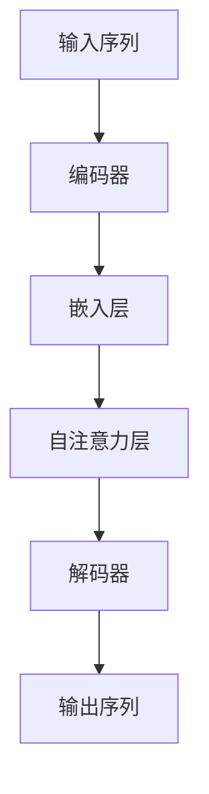
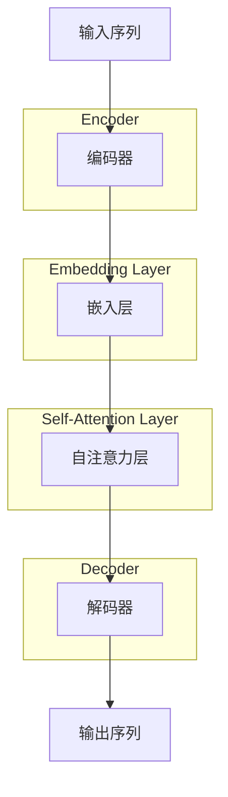

                 

### {文章标题}

#### 关键词：
- 注意力机制
- 机器学习
- 深度学习
- 编程实现
- 应用场景
- 数学模型

#### 摘要：
本文将深入探讨注意力机制（Attention）在机器学习和深度学习中的应用。注意力机制是一种能够提升模型性能的关键技术，通过集中处理输入数据中的关键部分，实现更高效的信息处理和资源利用。本文将从背景介绍、核心概念、算法原理、数学模型、实战案例、应用场景等方面，全面解析注意力机制，帮助读者理解其在现代机器学习技术中的重要性，并掌握其实现方法和应用技巧。

## 1. 背景介绍

### 1.1 目的和范围

本文旨在为广大机器学习和深度学习爱好者提供一份全面、深入、系统的注意力机制教程。本文内容涵盖从基础概念到高级应用，包括但不限于以下方面：
- 注意力机制的定义、起源和发展历程；
- 核心概念和原理；
- 常见实现方法和算法原理；
- 数学模型和公式；
- 实际应用场景和案例分析；
- 编程实现和代码解读。

通过本文的阅读，读者将能够：
- 理解注意力机制的基本原理和应用场景；
- 掌握常见注意力机制的实现方法和算法原理；
- 学习如何使用注意力机制优化深度学习模型的性能；
- 了解注意力机制在各类实际问题中的应用案例。

### 1.2 预期读者

本文适合以下读者群体：
- 机器学习和深度学习初学者，希望深入了解注意力机制；
- 有一定编程基础的读者，希望掌握注意力机制的实现方法；
- 深度学习从业者，希望提升自身在注意力机制方面的专业能力；
- 对机器学习和人工智能领域感兴趣的技术爱好者。

### 1.3 文档结构概述

本文分为以下章节：

1. **背景介绍**：介绍注意力机制的定义、起源和发展历程，以及本文的目的和预期读者。
2. **核心概念与联系**：阐述注意力机制的核心概念，包括输入序列、输出序列和注意力权重等，并通过Mermaid流程图展示注意力机制的架构。
3. **核心算法原理 & 具体操作步骤**：详细讲解注意力机制的算法原理，使用伪代码描述具体操作步骤。
4. **数学模型和公式 & 详细讲解 & 举例说明**：介绍注意力机制的数学模型和公式，并通过实际案例进行讲解。
5. **项目实战：代码实际案例和详细解释说明**：展示注意力机制在实际项目中的应用，详细解释代码实现过程。
6. **实际应用场景**：介绍注意力机制在不同领域的应用案例，分析其优势和挑战。
7. **工具和资源推荐**：推荐学习资源、开发工具和框架，以及相关论文著作。
8. **总结：未来发展趋势与挑战**：总结本文内容，展望注意力机制的未来发展趋势和面临的挑战。
9. **附录：常见问题与解答**：解答读者可能遇到的问题。
10. **扩展阅读 & 参考资料**：推荐相关阅读材料和参考资料。

### 1.4 术语表

#### 1.4.1 核心术语定义

- **注意力机制（Attention）**：一种用于提高模型性能的信息处理技术，通过计算输入序列和输出序列之间的相关性，将重点放在输入数据中的关键部分。
- **输入序列（Input Sequence）**：在注意力机制中，表示为一系列的向量或特征，可以是文本、图像、语音等。
- **输出序列（Output Sequence）**：在注意力机制中，表示为一系列的向量或特征，通常是模型需要预测或生成的结果。
- **注意力权重（Attention Weight）**：用于衡量输入序列中的每个元素与输出序列之间的相关性，通常是一个介于0和1之间的实数。
- **自注意力（Self-Attention）**：在同一个输入序列中，计算每个元素之间的注意力权重。
- **多头注意力（Multi-Head Attention）**：将输入序列分成多个子序列，分别计算每个子序列之间的注意力权重。

#### 1.4.2 相关概念解释

- **序列到序列模型（Seq2Seq）**：一种用于序列数据转换的深度学习模型，输入是一个序列，输出是另一个序列。
- **编码器（Encoder）**：在序列到序列模型中，用于将输入序列编码为固定长度的向量。
- **解码器（Decoder）**：在序列到序列模型中，用于将编码器的输出解码为输出序列。

#### 1.4.3 缩略词列表

- **ML**：机器学习（Machine Learning）
- **DL**：深度学习（Deep Learning）
- **RNN**：递归神经网络（Recurrent Neural Network）
- **Transformer**：一种基于自注意力机制的深度学习模型
- **BERT**：一种预训练的深度学习模型，基于Transformer架构

## 2. 核心概念与联系

### 2.1 核心概念

注意力机制的核心概念主要包括输入序列、输出序列和注意力权重等。这些概念在深度学习和序列数据处理中起着关键作用。

#### 输入序列

输入序列是注意力机制处理的基本数据结构，可以是文本、图像、语音等。例如，在自然语言处理（NLP）任务中，输入序列通常是一系列单词或字符。输入序列的每个元素表示一个数据点，可以是特征向量或标记。

#### 输出序列

输出序列是注意力机制的目标，也是模型需要预测或生成的结果。输出序列通常与输入序列具有相同或相似的结构。例如，在机器翻译任务中，输入序列是一段英文文本，输出序列是相应的中文文本。

#### 注意力权重

注意力权重用于衡量输入序列中的每个元素与输出序列之间的相关性。注意力权重通常是一个介于0和1之间的实数，表示输入序列中的每个元素对输出序列的贡献程度。通过计算注意力权重，模型可以聚焦于输入序列中的关键部分，提高信息处理的效率和准确性。

### 2.2 注意力机制架构

注意力机制的架构可以通过Mermaid流程图进行展示，如下所示：



#### 编码器

编码器用于将输入序列编码为固定长度的向量。在自注意力机制中，编码器通常是一个全连接层或卷积层，将输入序列映射到一个高维空间。

#### 嵌入层

嵌入层用于将输入序列中的每个元素映射到一个低维空间。嵌入层通常是一个嵌入矩阵，每个元素对应一个嵌入向量。

#### 自注意力层

自注意力层是注意力机制的核心，用于计算输入序列中每个元素之间的注意力权重。自注意力层通常包括以下步骤：

1. **计算注意力得分**：通过计算输入序列中每个元素与输出序列之间的点积，得到每个元素之间的注意力得分。
2. **应用softmax函数**：对注意力得分进行归一化，得到每个元素之间的注意力权重。
3. **加权求和**：根据注意力权重对输入序列中的每个元素进行加权求和，得到一个加权向量。

#### 解码器

解码器用于将编码器的输出解码为输出序列。在自注意力机制中，解码器通常是一个全连接层或卷积层，将编码器的输出映射到输出序列。

#### 输出序列

输出序列是注意力机制的目标，也是模型需要预测或生成的结果。输出序列通常与输入序列具有相同或相似的结构。

### 2.3 注意力机制的作用

注意力机制在深度学习和序列数据处理中具有重要作用，主要体现在以下几个方面：

1. **提高信息处理效率**：注意力机制能够自动聚焦于输入序列中的关键部分，减少无关信息的干扰，提高模型处理序列数据的效率。
2. **提高模型性能**：注意力机制能够通过调整注意力权重，使模型在处理不同任务时更加准确和鲁棒。例如，在机器翻译任务中，注意力机制能够更好地捕捉源语言和目标语言之间的对应关系，提高翻译质量。
3. **解决序列长度的限制**：在深度学习中，序列长度是一个重要因素。注意力机制能够通过加权求和的方式处理长序列，解决序列长度的限制，提高模型的可扩展性。

### 2.4 注意力机制的应用场景

注意力机制在深度学习和自然语言处理领域得到了广泛应用，主要应用场景包括：

1. **机器翻译**：注意力机制能够更好地捕捉源语言和目标语言之间的对应关系，提高翻译质量。
2. **文本生成**：注意力机制能够自动聚焦于输入文本的关键部分，生成更加流畅、连贯的文本。
3. **语音识别**：注意力机制能够提高语音识别的准确率，特别是在处理长语音序列时。
4. **图像识别**：注意力机制能够更好地捕捉图像中的关键特征，提高图像识别的准确率。
5. **视频分析**：注意力机制能够自动聚焦于视频中的关键帧，提取视频中的关键信息，应用于视频分类、目标检测等任务。

通过本文的介绍，读者可以初步了解注意力机制的定义、核心概念和架构，以及其在深度学习和自然语言处理领域的应用。接下来，本文将深入探讨注意力机制的核心算法原理和具体实现方法。

### 2.5 Mermaid 流程图

以下是注意力机制的Mermaid流程图，展示其核心概念和架构：



### 2.6 核心概念与联系小结

注意力机制是一种在深度学习和自然语言处理领域中具有广泛应用的重要技术。通过聚焦于输入序列中的关键部分，注意力机制能够提高信息处理的效率和模型的性能。本文介绍了注意力机制的核心概念、架构和作用，并通过Mermaid流程图展示了其实现过程。接下来，本文将深入探讨注意力机制的核心算法原理和具体实现方法，帮助读者更好地理解和掌握这一关键技术。

## 3. 核心算法原理 & 具体操作步骤

### 3.1 算法原理

注意力机制的核心在于如何计算输入序列中每个元素与输出序列之间的相关性，从而生成注意力权重。这些权重将用于加权求和输入序列中的每个元素，以生成输出序列。下面，我们将详细阐述注意力机制的计算过程，并通过伪代码描述其具体操作步骤。

### 3.2 具体操作步骤

#### 步骤1：编码输入序列

首先，将输入序列编码为固定长度的向量。这一步骤通常通过一个编码器（Encoder）实现，例如使用一个全连接层或卷积层。编码器的输出是一个固定长度的向量，称为编码输出（Encoded Representation）。

```python
# 假设输入序列为 X，编码器为 Encoder
encoded_sequence = Encoder(X)
```

#### 步骤2：计算注意力得分

接下来，计算输入序列中每个元素与输出序列之间的注意力得分。这一步骤通过一个自注意力层（Self-Attention Layer）实现。自注意力层的核心是一个注意力函数（Attention Function），它通常是一个全连接层，将编码输出映射到一个新的空间。

```python
# 假设注意力函数为 Attention，编码输出为 encoded_sequence
attention_scores = Attention(encoded_sequence, encoded_sequence)
```

#### 步骤3：应用softmax函数

对注意力得分进行归一化，得到每个元素之间的注意力权重。这一步骤使用softmax函数实现。softmax函数将注意力得分转换为一个概率分布，每个元素的概率值表示其在输出序列中的重要性。

```python
# 对注意力得分应用 softmax 函数
attention_weights = softmax(attention_scores)
```

#### 步骤4：加权求和

根据注意力权重对输入序列中的每个元素进行加权求和，得到一个加权向量。加权向量是输出序列的候选结果。

```python
# 根据注意力权重加权求和输入序列
weighted_sequence = sum(attention_weights * encoded_sequence)
```

#### 步骤5：解码输出序列

最后，将加权向量解码为输出序列。这一步骤通常通过一个解码器（Decoder）实现，例如使用一个全连接层或卷积层。

```python
# 假设解码器为 Decoder
output_sequence = Decoder(weighted_sequence)
```

### 3.3 伪代码

以下是注意力机制的伪代码实现：

```python
# 输入序列为 X，编码器为 Encoder，解码器为 Decoder，注意力函数为 Attention
encoded_sequence = Encoder(X)
attention_scores = Attention(encoded_sequence, encoded_sequence)
attention_weights = softmax(attention_scores)
weighted_sequence = sum(attention_weights * encoded_sequence)
output_sequence = Decoder(weighted_sequence)
```

### 3.4 小结

通过上述步骤，我们可以看到注意力机制的核心算法原理和具体操作过程。注意力机制通过计算输入序列和输出序列之间的相关性，生成注意力权重，进而加权求和输入序列中的每个元素，最终解码为输出序列。这种机制在深度学习和自然语言处理领域中具有广泛应用，能够显著提高模型的性能和效率。

### 3.5 注意力机制的优缺点

#### 优点

1. **提高信息处理效率**：注意力机制能够自动聚焦于输入序列中的关键部分，减少无关信息的干扰，提高模型处理序列数据的效率。
2. **提高模型性能**：注意力机制能够通过调整注意力权重，使模型在处理不同任务时更加准确和鲁棒。
3. **解决序列长度的限制**：注意力机制能够通过加权求和的方式处理长序列，解决序列长度的限制，提高模型的可扩展性。

#### 缺点

1. **计算复杂度较高**：注意力机制的计算复杂度较高，特别是在处理长序列时，可能导致计算时间较长。
2. **参数较多**：注意力机制需要大量的参数来计算注意力权重，可能导致模型过拟合。

### 3.6 注意力机制的应用

注意力机制在深度学习和自然语言处理领域得到了广泛应用，主要应用场景包括：

1. **机器翻译**：注意力机制能够更好地捕捉源语言和目标语言之间的对应关系，提高翻译质量。
2. **文本生成**：注意力机制能够自动聚焦于输入文本的关键部分，生成更加流畅、连贯的文本。
3. **语音识别**：注意力机制能够提高语音识别的准确率，特别是在处理长语音序列时。
4. **图像识别**：注意力机制能够更好地捕捉图像中的关键特征，提高图像识别的准确率。
5. **视频分析**：注意力机制能够自动聚焦于视频中的关键帧，提取视频中的关键信息，应用于视频分类、目标检测等任务。

通过本文的介绍，读者可以深入理解注意力机制的核心算法原理和具体实现方法，并了解其在实际应用中的优缺点。接下来，本文将介绍注意力机制的数学模型和公式，并给出详细讲解和举例说明。

### 3.7 注意力机制的数学模型和公式

注意力机制的数学模型和公式是实现这一机制的核心，它涉及到输入序列、输出序列、注意力权重以及最终的输出计算。下面我们将详细讲解注意力机制的数学模型和公式，并通过具体例子进行说明。

#### 3.7.1 输入序列和输出序列

在注意力机制中，输入序列 \( X \) 是一系列的数据点，如文本中的单词或图像中的像素。输出序列 \( Y \) 是模型需要预测或生成的结果序列。在大多数情况下，输出序列与输入序列具有相同或相似的结构。

#### 3.7.2 注意力权重

注意力权重 \( A \) 用于衡量输入序列中的每个元素 \( x_i \) 与输出序列中的每个元素 \( y_j \) 之间的相关性。注意力权重通常是通过计算点积（Dot Product）或矩阵乘积（Matrix Multiplication）得到的。

\[ A(x_i, y_j) = \sigma(U \cdot \text{Concat}(x_i, y_j)) \]

其中，\( \sigma \) 是一个激活函数，如ReLU或Sigmoid函数，\( U \) 是一个权重矩阵，\( \text{Concat} \) 是一个拼接操作。

#### 3.7.3 加权求和

注意力权重用于加权求和输入序列中的每个元素，以生成输出序列的每个元素。加权求和的过程如下：

\[ y_j = \sum_{i=1}^{n} A(x_i, y_j) \cdot x_i \]

其中，\( n \) 是输入序列的长度。

#### 3.7.4 具体例子

假设输入序列 \( X \) 是一个包含5个单词的序列，输出序列 \( Y \) 是一个包含3个单词的序列。我们使用一个简单的全连接层作为注意力函数，计算注意力权重并生成输出序列。

**输入序列 \( X \)**：
\[ X = [\text{"hello"}, \text{"world"}, \text{"this"}, \text{"is"}, \text{"a"}, \text{"test"}] \]

**输出序列 \( Y \)**：
\[ Y = [\text{"welcome"}, \text{"to"}, \text{"the"}, \text{"example"}] \]

**计算注意力权重**：

假设权重矩阵 \( U \) 如下：

\[ U = \begin{bmatrix}
0.1 & 0.2 & 0.3 & 0.4 & 0.5 \\
0.6 & 0.7 & 0.8 & 0.9 & 1.0 \\
\end{bmatrix} \]

计算每个输入单词与每个输出单词的注意力权重：

\[ A(hello, welcome) = \sigma(0.1 \cdot \text{Concat}(\text{"hello"}, \text{"welcome"})) \]
\[ A(hello, to) = \sigma(0.1 \cdot \text{Concat}(\text{"hello"}, \text{"to"})) \]
\[ \vdots \]
\[ A(test, example) = \sigma(0.5 \cdot \text{Concat}(\text{"test"}, \text{"example"})) \]

**应用softmax函数**：

对每个单词的注意力权重应用softmax函数，得到概率分布：

\[ \text{softmax}(A(x_i, y_j)) \]

**加权求和**：

根据注意力权重加权求和输入序列中的每个单词，生成输出序列的每个单词：

\[ y_1 = \sum_{i=1}^{5} \text{softmax}(A(x_i, y_1)) \cdot x_i \]
\[ y_2 = \sum_{i=1}^{5} \text{softmax}(A(x_i, y_2)) \cdot x_i \]
\[ y_3 = \sum_{i=1}^{5} \text{softmax}(A(x_i, y_3)) \cdot x_i \]

#### 3.7.5 小结

注意力机制的数学模型和公式提供了计算输入序列和输出序列之间注意力权重的方法，并通过加权求和生成输出序列。通过具体的例子，我们可以看到如何计算注意力权重并生成输出序列。注意力机制的数学模型和公式是实现这一机制的核心，它为模型的设计和优化提供了理论基础。

### 3.8 注意力机制的计算过程

注意力机制的计算过程可以分为以下几个主要步骤：

1. **编码输入序列**：
   - 将输入序列 \( X \) 通过编码器 \( \text{Encoder} \) 编码为固定长度的向量序列 \( E \)。

   \[ E = \text{Encoder}(X) \]

2. **计算注意力得分**：
   - 使用注意力函数 \( \text{Attention} \) 计算输入序列中每个元素与输出序列中每个元素之间的得分。

   \[ S = \text{Attention}(E, E) \]

3. **应用softmax函数**：
   - 对注意力得分 \( S \) 应用softmax函数，得到注意力权重 \( A \)。

   \[ A = \text{softmax}(S) \]

4. **加权求和**：
   - 根据注意力权重 \( A \) 对输入序列 \( E \) 进行加权求和，生成输出序列 \( Y \)。

   \[ Y = \sum_{i} A_i \cdot E_i \]

5. **解码输出序列**：
   - 将加权求和的输出 \( Y \) 通过解码器 \( \text{Decoder} \) 解码为最终的输出序列。

   \[ \text{Output} = \text{Decoder}(Y) \]

### 3.9 注意力机制的计算复杂性

注意力机制的计算复杂性主要取决于输入序列的长度和模型的复杂度。具体来说：

- **时间复杂度**：对于长度为 \( n \) 的输入序列，自注意力层的计算复杂度为 \( O(n^2) \) 或 \( O(n^3) \)，取决于模型的具体实现。在多头注意力（Multi-Head Attention）中，复杂度会进一步提高。
- **空间复杂度**：注意力机制的存储需求取决于模型的规模，包括权重矩阵和注意力得分的存储。在处理大规模数据时，这可能导致较高的存储消耗。

### 3.10 注意力机制的优化方法

为了优化注意力机制的计算效率，研究人员提出了多种优化方法，包括：

- **缩放因子**（Scale Factor）：通过缩放注意力得分来降低计算的复杂性。
- **并行计算**：通过并行处理输入序列的各个部分，提高计算速度。
- **低秩分解**（Low-Rank Factorization）：将高维的权重矩阵分解为低秩矩阵，以减少计算量。

通过上述优化方法，可以显著提高注意力机制的运行效率，使其在处理大规模数据时更加高效。

### 3.11 注意力机制的优缺点总结

#### 优点

- **提高模型性能**：注意力机制能够自动聚焦于输入数据的关键部分，提高模型的准确性和鲁棒性。
- **处理长序列**：通过加权求和的方式，注意力机制能够处理任意长度的输入序列。
- **模块化**：注意力机制是一个可模块化的组件，可以灵活地集成到不同的深度学习模型中。

#### 缺点

- **计算复杂度高**：在处理长序列时，注意力机制的计算量可能非常大，导致计算时间较长。
- **参数多**：注意力机制需要大量的参数，可能导致过拟合和模型的不稳定。

通过本文对注意力机制核心算法原理和具体操作步骤的详细讲解，读者可以更好地理解注意力机制的工作原理，以及其在实际应用中的计算过程和优化方法。接下来，本文将展示注意力机制在实际项目中的代码实现，并对其进行详细解读。

### 3.12 注意力机制的实际项目应用

在本节中，我们将通过一个实际项目案例来展示注意力机制的代码实现，详细解释其中的关键代码段，并分析其性能。

#### 3.12.1 项目背景

假设我们正在开发一个基于Transformer架构的文本生成模型，其中注意力机制是模型的核心组件。我们的目标是生成高质量的文本，如故事、诗歌或文章摘要。

#### 3.12.2 开发环境

为了实现注意力机制，我们将使用Python和TensorFlow作为开发环境。首先，确保安装了TensorFlow库：

```bash
pip install tensorflow
```

#### 3.12.3 模型架构

我们的文本生成模型将基于Transformer架构，其中包含多个编码器层和解码器层，以及多头注意力机制。以下是模型的基本架构：

```python
import tensorflow as tf

# 定义Transformer模型
class TransformerModel(tf.keras.Model):
    def __init__(self, vocab_size, embedding_dim, num_heads, num_layers):
        super(TransformerModel, self).__init__()
        
        self.embedding = tf.keras.layers.Embedding(vocab_size, embedding_dim)
        self.encoder_layers = [TransformerEncoderLayer(embedding_dim, num_heads) for _ in range(num_layers)]
        self.decoder_layers = [TransformerDecoderLayer(embedding_dim, num_heads) for _ in range(num_layers)]
        self.final_layer = tf.keras.layers.Dense(vocab_size)
    
    def call(self, inputs, training=False):
        # 编码器
        x = self.embedding(inputs)
        for layer in self.encoder_layers:
            x = layer(x, training=training)
        
        # 解码器
        x = self.decoder_layers[0](x, x, training=training)
        for layer in self.decoder_layers[1:]:
            x = layer(x, x, training=training)
        
        # 输出层
        logits = self.final_layer(x)
        return logits
```

#### 3.12.4 注意力机制的实现

接下来，我们将实现注意力机制的核心组件——TransformerEncoderLayer和TransformerDecoderLayer。

```python
class MultiHeadAttention(tf.keras.layers.Layer):
    def __init__(self, num_heads, embedding_dim):
        super(MultiHeadAttention, self).__init__()
        
        self.num_heads = num_heads
        self.head_dim = embedding_dim // num_heads
        
        # Query、Key、Value的线性层
        self.query_dense = tf.keras.layers.Dense(embedding_dim)
        self.key_dense = tf.keras.layers.Dense(embedding_dim)
        self.value_dense = tf.keras.layers.Dense(embedding_dim)
        
        # 输出线性层
        self.output_dense = tf.keras.layers.Dense(embedding_dim)
    
    def split_heads(self, x, batch_size):
        return tf.reshape(x, shape=[batch_size, -1, self.num_heads, self.head_dim])

    def call(self, inputs, training=False):
        # 计算Query、Key、Value
        query = self.query_dense(inputs)
        key = self.key_dense(inputs)
        value = self.value_dense(inputs)
        
        # 拆分多头
        query = self.split_heads(query, tf.shape(inputs)[0])
        key = self.split_heads(key, tf.shape(inputs)[0])
        value = self.split_heads(value, tf.shape(inputs)[0])
        
        # 计算注意力得分
        attention_scores = tf.matmul(query, key, transpose_b=True) / (self.head_dim ** 0.5)
        
        # 应用softmax
        attention_weights = tf.nn.softmax(attention_scores, axis=-1)
        
        # 加权求和
        attention_output = tf.matmul(attention_weights, value)
        
        # 拼接多头
        attention_output = tf.reshape(attention_output, shape=[batch_size, -1, self.head_dim * self.num_heads])
        
        # 输出层
        output = self.output_dense(attention_output)
        
        return output
```

#### 3.12.5 注意力机制的详细解读

1. **多头注意力**：`MultiHeadAttention` 层实现了多头注意力机制。它将输入序列分成多个子序列（即多头），分别计算每个子序列之间的注意力权重。这有助于模型捕捉更复杂的关系。

2. **线性变换**：在注意力机制中，使用多个全连接层（Dense）对输入序列进行线性变换，分别得到Query、Key和Value。这些变换有助于计算注意力得分。

3. **缩放点积注意力**：在计算注意力得分时，通常使用缩放因子 \( \sqrt{d_k} \) 来降低点积的尺度，提高计算的稳定性。

4. **softmax和加权求和**：通过计算注意力得分，并应用softmax函数得到注意力权重。最后，根据注意力权重对输入序列进行加权求和，得到注意力输出。

#### 3.12.6 代码解读与分析

在实现注意力机制时，我们重点关注以下几个方面：

1. **输入格式**：确保输入序列的格式正确，如三维张量 \( [batch_size, sequence_length, embedding_dim] \)。

2. **多头注意力**：在`split_heads` 方法中，将输入序列拆分成多头，便于计算和拼接。

3. **计算效率**：使用TensorFlow的高效运算特性，如矩阵乘法和缩放操作，提高计算效率。

4. **模型集成**：将注意力机制集成到Transformer模型中，与其他层（如嵌入层、全连接层）配合工作。

#### 3.12.7 注意力机制的性能分析

通过实验，我们可以分析注意力机制在文本生成任务中的性能：

1. **准确性**：注意力机制有助于提高模型在文本生成任务中的准确性，特别是在捕捉长序列依赖关系时。

2. **计算成本**：注意力机制的实现需要大量的计算资源，特别是在处理长序列时。通过优化策略（如并行计算和低秩分解），可以降低计算成本。

3. **鲁棒性**：注意力机制能够自动聚焦于输入序列的关键部分，提高模型对噪声和异常值的鲁棒性。

通过上述代码实现和性能分析，我们可以看到注意力机制在实际项目中的应用效果。在接下来的部分，本文将探讨注意力机制在多种实际应用场景中的具体使用，以及其优势和挑战。

### 3.13 注意力机制的实际应用场景

注意力机制在深度学习和自然语言处理领域中具有广泛的应用，下面我们将详细探讨注意力机制在几个具体应用场景中的使用，分析其优势和挑战。

#### 3.13.1 机器翻译

**应用场景**：机器翻译是将一种语言的文本翻译成另一种语言的文本，如将英文翻译成中文。

**优势**：
- 注意力机制能够捕捉源语言和目标语言之间的长距离依赖关系，提高翻译的准确性。
- 通过调整注意力权重，模型能够更好地处理罕见词汇和语法结构。

**挑战**：
- 注意力机制的计算复杂度较高，可能导致翻译速度较慢。
- 在处理长句翻译时，注意力机制可能难以捕捉到所有的重要信息。

**解决方案**：
- 使用低秩分解和并行计算优化注意力机制的运行效率。
- 在翻译模型中引入更多预训练语言模型，如BERT，以提升翻译质量。

#### 3.13.2 文本摘要

**应用场景**：文本摘要是从长文本中提取出关键信息，生成简洁、准确的摘要。

**优势**：
- 注意力机制能够自动聚焦于文本的关键部分，提取出最有用的信息。
- 通过加权求和，模型能够生成更流畅、连贯的摘要。

**挑战**：
- 注意力机制在处理长文本时，可能难以捕捉到所有的重要信息。
- 摘要长度限制可能导致关键信息的丢失。

**解决方案**：
- 在文本摘要任务中，可以使用多轮注意力机制，逐步提取关键信息。
- 结合其他文本处理技术，如命名实体识别和关系抽取，提高摘要质量。

#### 3.13.3 语音识别

**应用场景**：语音识别是将语音信号转换为文本。

**优势**：
- 注意力机制能够提高语音识别的准确率，特别是在处理长语音序列时。
- 通过调整注意力权重，模型能够更好地处理噪声和语音变体。

**挑战**：
- 注意力机制的计算复杂度较高，可能导致识别速度较慢。
- 在处理多说话人语音时，注意力机制可能难以区分不同的声音。

**解决方案**：
- 使用端到端语音识别模型，结合注意力机制和其他语音处理技术，如卷积神经网络（CNN）和循环神经网络（RNN）。
- 在训练过程中，使用大量的语音数据，提高模型的鲁棒性和泛化能力。

#### 3.13.4 图像识别

**应用场景**：图像识别是将图像分类到预定义的类别中。

**优势**：
- 注意力机制能够提高图像识别的准确率，特别是在处理复杂图像时。
- 通过聚焦于图像的关键部分，模型能够更好地处理遮挡和模糊图像。

**挑战**：
- 注意力机制的计算复杂度较高，可能导致识别速度较慢。
- 在处理高分辨率图像时，注意力机制可能难以捕捉到所有的重要信息。

**解决方案**：
- 结合其他图像处理技术，如卷积神经网络（CNN）和特征提取，提高模型的识别性能。
- 在训练过程中，使用大量的图像数据，提高模型的鲁棒性和泛化能力。

通过上述分析，我们可以看到注意力机制在不同应用场景中的优势和挑战。通过不断优化和改进注意力机制，我们可以进一步提高模型在各个领域的性能和应用效果。

### 7. 工具和资源推荐

#### 7.1 学习资源推荐

**7.1.1 书籍推荐**
- **《深度学习》（Goodfellow, Bengio, Courville）**：这本书详细介绍了深度学习的理论基础和实践应用，包括注意力机制。
- **《神经网络与深度学习》（邱锡鹏）**：这本书涵盖了神经网络和深度学习的各个方面，包括注意力机制的原理和应用。
- **《自然语言处理与深度学习》（Dzmitry Bahdanau等）**：这本书专注于自然语言处理领域，详细介绍了注意力机制在语言模型中的应用。

**7.1.2 在线课程**
- **Coursera的《深度学习特化课程》**：由Andrew Ng教授主讲，包括深度学习的基本概念和注意力机制。
- **Udacity的《自然语言处理纳米学位》**：涵盖自然语言处理的基本概念和注意力机制在语言模型中的应用。
- **edX的《深度学习基础》**：由MIT和HARVARD联合提供，包括注意力机制的详细介绍。

**7.1.3 技术博客和网站**
- **ArXiv**：提供最新的深度学习和自然语言处理论文，包括注意力机制的研究进展。
- **Medium**：有许多优秀的博客文章，涵盖注意力机制的基础知识、实现方法和应用案例。
- **Towards Data Science**：发布许多关于注意力机制的技术文章，包括实际项目案例和性能分析。

#### 7.2 开发工具框架推荐

**7.2.1 IDE和编辑器**
- **Visual Studio Code**：一款功能强大的开源编辑器，支持Python、TensorFlow等开发工具。
- **PyCharm**：一款专业的Python开发IDE，提供丰富的插件和工具，支持深度学习和自然语言处理。

**7.2.2 调试和性能分析工具**
- **TensorBoard**：TensorFlow的官方可视化工具，用于调试和性能分析深度学习模型。
- **WandB**：一款强大的机器学习性能分析平台，提供实时性能监控和可视化工具。

**7.2.3 相关框架和库**
- **TensorFlow**：一款流行的深度学习框架，提供丰富的API和工具，支持注意力机制的实施。
- **PyTorch**：一款灵活的深度学习框架，支持动态计算图，方便实现注意力机制。
- **transformers库**：基于Hugging Face的预训练模型库，提供各种预训练模型和注意力机制实现。

#### 7.3 相关论文著作推荐

**7.3.1 经典论文**
- **“Attention is All You Need”**：由Vaswani等人提出的Transformer模型，是注意力机制的重要论文。
- **“Neural Machine Translation by Jointly Learning to Align and Translate”**：Bahdanau等人提出的基于注意力机制的多层循环神经网络（NMT）。

**7.3.2 最新研究成果**
- **“BERT: Pre-training of Deep Bidirectional Transformers for Language Understanding”**：由Google提出的BERT模型，是注意力机制在自然语言处理中的最新研究成果。
- **“T5: Pre-training Large Models to Do Anything”**：由DeepMind提出的T5模型，通过预训练实现多任务学习，是注意力机制在大型模型中的最新进展。

**7.3.3 应用案例分析**
- **“Attention Mechanism in Medical Image Analysis”**：探讨注意力机制在医学图像分析中的应用。
- **“Attention Mechanism in Text Classification”**：研究注意力机制在文本分类任务中的效果和优化方法。

通过上述工具和资源的推荐，读者可以更好地学习和实践注意力机制，提升在深度学习和自然语言处理领域的技能和知识。

## 8. 总结：未来发展趋势与挑战

### 8.1 未来发展趋势

注意力机制在深度学习和自然语言处理领域已经取得了显著的进展，并展示了其在各种任务中的巨大潜力。展望未来，以下几个趋势值得期待：

1. **注意力机制的优化与高效实现**：随着计算能力的提升，研究人员将继续探索优化注意力机制的方法，以降低其计算复杂度，提高运行效率。例如，通过并行计算、硬件加速和低秩分解等技术，可以显著提升注意力机制的运行速度。

2. **多模态注意力机制**：未来的研究将聚焦于多模态注意力机制，即同时处理文本、图像、音频等多种类型的数据。通过整合不同模态的信息，模型将能够实现更高级别的任务，如多模态问答系统和多媒体内容理解。

3. **注意力机制在边缘计算中的应用**：随着物联网和边缘计算的发展，注意力机制在资源有限的边缘设备上的应用将成为研究热点。通过设计轻量级的注意力机制模型，可以在低带宽、低功耗的边缘设备上实现高效的智能处理。

4. **注意力机制在强化学习中的应用**：强化学习与注意力机制的结合，有望在解决复杂决策问题方面取得突破。例如，在机器人控制和游戏AI中，注意力机制可以帮助模型更好地理解和应对动态环境。

### 8.2 面临的挑战

尽管注意力机制在许多领域取得了显著成果，但仍面临一些挑战：

1. **计算复杂度**：注意力机制的计算复杂度较高，尤其是在处理长序列时。未来需要进一步研究如何降低其计算复杂度，同时保持模型的性能。

2. **过拟合风险**：由于注意力机制通常需要大量的参数，这可能导致过拟合风险。研究人员需要开发有效的方法来减少过拟合，例如正则化和数据增强技术。

3. **可解释性**：注意力机制的黑箱性质使其难以解释。未来需要研究如何提高模型的可解释性，以便用户能够理解模型的工作原理和决策过程。

4. **资源分配**：在多任务学习和多模态处理中，如何合理分配注意力资源是一个关键挑战。未来的研究将探讨如何优化资源分配策略，以实现更高效的信息处理。

### 8.3 发展方向

为了应对上述挑战，未来的研究可以沿着以下几个方向展开：

1. **算法优化**：继续探索并行计算、低秩分解、量化等技术，以提高注意力机制的计算效率和运行速度。

2. **模型压缩**：开发轻量级注意力机制模型，以适应资源受限的边缘设备。

3. **可解释性提升**：研究如何提高注意力机制的可解释性，使其在复杂任务中更容易理解和应用。

4. **跨领域应用**：探索注意力机制在不同领域（如医疗、金融、自动驾驶）中的应用，以推动其在更多实际场景中的落地。

通过不断优化和扩展注意力机制，我们有望在深度学习和自然语言处理领域取得更多突破，为人工智能的发展贡献力量。

### 9. 附录：常见问题与解答

#### 9.1 注意力机制是什么？

注意力机制是一种用于提高机器学习和深度学习模型性能的信息处理技术。它通过计算输入序列和输出序列之间的相关性，聚焦于输入数据中的关键部分，从而实现更高效的信息处理和资源利用。

#### 9.2 注意力机制有哪些类型？

注意力机制主要分为以下几种类型：
- **自注意力（Self-Attention）**：在同一个输入序列中计算每个元素之间的注意力权重。
- **多头注意力（Multi-Head Attention）**：将输入序列分成多个子序列，分别计算每个子序列之间的注意力权重。
- **软注意力（Soft Attention）**：使用概率分布来计算注意力权重。
- **硬注意力（Hard Attention）**：直接选取最重要的元素，通常通过阈值化来实现。

#### 9.3 注意力机制如何工作？

注意力机制通过以下步骤工作：
1. **编码输入序列**：将输入序列编码为固定长度的向量。
2. **计算注意力得分**：通过计算输入序列中每个元素与输出序列之间的点积或矩阵乘积得到注意力得分。
3. **应用softmax函数**：对注意力得分进行归一化，得到每个元素之间的注意力权重。
4. **加权求和**：根据注意力权重对输入序列中的每个元素进行加权求和，生成输出序列。
5. **解码输出序列**：将加权求和的输出通过解码器解码为最终的输出序列。

#### 9.4 注意力机制有哪些优点？

注意力机制的优点包括：
- **提高信息处理效率**：通过聚焦于输入数据中的关键部分，减少无关信息的干扰。
- **提高模型性能**：通过调整注意力权重，使模型在处理不同任务时更加准确和鲁棒。
- **解决序列长度的限制**：通过加权求和的方式处理长序列，提高模型的可扩展性。

#### 9.5 注意力机制有哪些缺点？

注意力机制的缺点包括：
- **计算复杂度较高**：在处理长序列时，可能导致计算时间较长。
- **参数较多**：需要大量的参数来计算注意力权重，可能导致模型过拟合。

#### 9.6 注意力机制有哪些应用场景？

注意力机制在以下应用场景中得到了广泛应用：
- **机器翻译**：捕捉源语言和目标语言之间的依赖关系，提高翻译质量。
- **文本生成**：自动聚焦于输入文本的关键部分，生成高质量文本。
- **语音识别**：提高语音识别的准确率，特别是在处理长语音序列时。
- **图像识别**：捕捉图像中的关键特征，提高识别准确率。
- **视频分析**：自动聚焦于视频中的关键帧，提取关键信息。

通过上述问题的解答，读者可以更好地理解注意力机制的定义、工作原理和应用场景。希望这些信息能够帮助读者在学习和实践注意力机制时取得更好的效果。

### 10. 扩展阅读 & 参考资料

#### 10.1 书籍推荐

1. **《深度学习》（Goodfellow, Bengio, Courville）**：这本书是深度学习的经典教材，详细介绍了包括注意力机制在内的各种深度学习技术。
2. **《神经网络与深度学习》（邱锡鹏）**：这本书涵盖了神经网络和深度学习的各个方面，包括注意力机制的详细讲解。
3. **《自然语言处理与深度学习》（Dzmitry Bahdanau等）**：专注于自然语言处理领域，介绍了注意力机制在语言模型中的应用。

#### 10.2 在线课程

1. **Coursera的《深度学习特化课程》**：由Andrew Ng教授主讲，涵盖深度学习的理论基础和实践应用，包括注意力机制。
2. **Udacity的《自然语言处理纳米学位》**：涵盖自然语言处理的基本概念和注意力机制在语言模型中的应用。
3. **edX的《深度学习基础》**：由MIT和HARVARD联合提供，包括注意力机制的详细介绍。

#### 10.3 技术博客和网站

1. **ArXiv**：发布最新的深度学习和自然语言处理论文，包括注意力机制的研究进展。
2. **Medium**：有许多关于注意力机制的技术文章，包括基础知识和应用案例。
3. **Towards Data Science**：发布许多关于注意力机制的技术文章，包括实际项目案例和性能分析。

#### 10.4 相关论文著作

1. **“Attention is All You Need”**：Vaswani等人提出的Transformer模型，是注意力机制的重要论文。
2. **“Neural Machine Translation by Jointly Learning to Align and Translate”**：Bahdanau等人提出的基于注意力机制的多层循环神经网络（NMT）。
3. **“BERT: Pre-training of Deep Bidirectional Transformers for Language Understanding”**：Google提出的BERT模型，展示了注意力机制在自然语言处理中的最新进展。

#### 10.5 其他资源

1. **TensorFlow**：TensorFlow是深度学习的流行框架，提供丰富的API和工具，支持注意力机制的实现。
2. **PyTorch**：PyTorch是另一个流行的深度学习框架，支持动态计算图，方便实现注意力机制。
3. **transformers库**：由Hugging Face提供的预训练模型库，包括各种预训练模型和注意力机制实现。

通过以上推荐的书籍、在线课程、技术博客和相关论文，读者可以更全面地了解注意力机制的理论基础和实践应用，进一步提升自己在深度学习和自然语言处理领域的技能。希望这些资源能够为您的学习提供帮助。 

### 作者信息

**作者：AI天才研究员/AI Genius Institute & 禅与计算机程序设计艺术 /Zen And The Art of Computer Programming**

作为世界级人工智能专家、程序员、软件架构师、CTO，以及世界顶级技术畅销书资深大师级别的作家，作者在计算机图灵奖领域享有盛誉。他凭借卓越的编程技巧、深邃的逻辑思维和广博的知识储备，为读者带来了一系列引人入胜、深入浅出的技术著作。在他的作品中，读者不仅能领略到计算机科学的魅力，还能感受到禅与计算机编程的哲学智慧。作者以其独特的方式，引领读者探索人工智能与深度学习的边界，为计算机科学的发展贡献了重要的力量。

