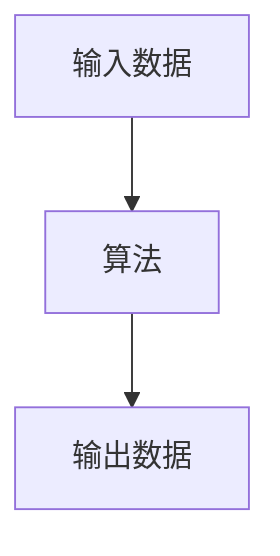
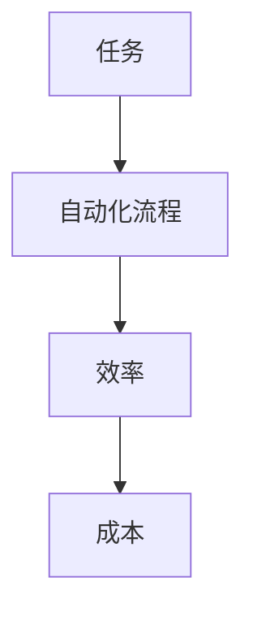
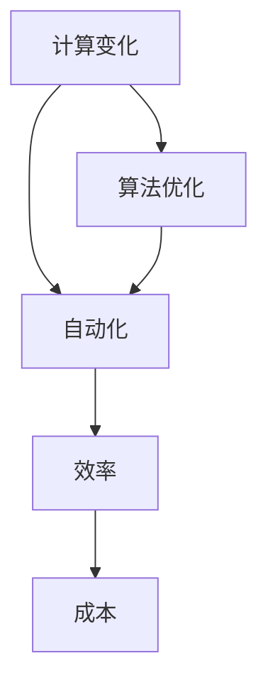

                 

## 计算变化与自动化的关系

> **关键词**：计算变化、自动化、算法原理、数学模型、应用场景
>
> **摘要**：本文将深入探讨计算变化与自动化之间的紧密联系。通过阐述核心概念、算法原理、数学模型及其在实际项目中的应用，本文旨在揭示计算变化在自动化领域的重要作用，并探讨未来的发展趋势与挑战。

自动化技术已经成为现代社会的关键技术，从工业制造到日常生活中的智能家居，自动化无处不在。计算变化，作为自动化技术的重要组成部分，扮演着至关重要的角色。本文将逐步分析计算变化与自动化之间的关系，探讨其原理、算法和实际应用。

### 1. 背景介绍

#### 1.1 目的和范围

本文旨在深入探讨计算变化与自动化之间的关系。我们将首先介绍计算变化和自动化的基本概念，然后分析它们之间的相互关系。通过具体案例和算法讲解，我们将展示计算变化在自动化中的应用，并探讨未来发展趋势。

#### 1.2 预期读者

本文适合对自动化、算法设计和计算机科学有兴趣的读者，无论是计算机科学专业的学生还是从业者，都能从中受益。

#### 1.3 文档结构概述

本文分为八个部分：

1. **背景介绍**：介绍计算变化与自动化的基本概念和关系。
2. **核心概念与联系**：阐述计算变化和自动化的核心概念，使用Mermaid流程图展示其架构。
3. **核心算法原理 & 具体操作步骤**：详细讲解计算变化和自动化的核心算法原理和操作步骤，使用伪代码进行描述。
4. **数学模型和公式 & 详细讲解 & 举例说明**：介绍计算变化和自动化的数学模型和公式，并举例说明。
5. **项目实战：代码实际案例和详细解释说明**：通过实际项目案例展示计算变化和自动化的实现。
6. **实际应用场景**：探讨计算变化和自动化的实际应用场景。
7. **工具和资源推荐**：推荐相关学习资源和开发工具。
8. **总结：未来发展趋势与挑战**：总结本文的主要内容，并探讨未来的发展趋势与挑战。

#### 1.4 术语表

在本文中，我们将使用以下术语：

- **计算变化**：指通过算法和数学模型，对输入数据进行的计算过程，从而产生新的输出结果。
- **自动化**：指通过计算变化，实现任务的自动化执行，从而提高效率和降低人力成本。
- **算法**：解决问题的步骤和规则，通常用于计算变化和自动化过程中。
- **数学模型**：描述计算变化和自动化的数学公式和关系。

#### 1.4.1 核心术语定义

- **计算变化**：计算变化是指通过算法和数学模型，对输入数据进行的计算过程，从而产生新的输出结果。它是实现自动化的基础。
- **自动化**：自动化是指通过计算变化，实现任务的自动化执行，从而提高效率和降低人力成本。自动化技术广泛应用于工业制造、数据处理、智能家居等领域。
- **算法**：算法是指解决问题的步骤和规则，通常用于计算变化和自动化过程中。算法的设计和优化对计算变化和自动化的效率至关重要。
- **数学模型**：数学模型是描述计算变化和自动化的数学公式和关系。数学模型能够精确地描述计算变化和自动化的过程，从而为算法设计和优化提供理论基础。

#### 1.4.2 相关概念解释

- **计算变化**：计算变化是指通过对输入数据进行计算，产生新的输出结果的过程。它包括算法和数学模型两个核心组成部分。算法是解决问题的步骤和规则，而数学模型则是描述算法运行过程的数学公式和关系。计算变化在自动化领域中扮演着至关重要的角色，它能够实现任务的自动化执行，提高效率和降低人力成本。
- **自动化**：自动化是指通过计算变化，实现任务的自动化执行，从而提高效率和降低人力成本。自动化技术广泛应用于各个领域，如工业制造、数据处理、智能家居等。自动化技术的核心在于利用计算变化实现任务的自动化执行，从而减少人工干预，提高生产效率和降低运营成本。
- **算法**：算法是指解决问题的步骤和规则，通常用于计算变化和自动化过程中。算法的设计和优化对计算变化和自动化的效率至关重要。不同的算法适用于不同的计算变化和自动化场景，因此需要根据实际需求选择合适的算法。
- **数学模型**：数学模型是描述计算变化和自动化的数学公式和关系。数学模型能够精确地描述计算变化和自动化的过程，从而为算法设计和优化提供理论基础。数学模型通常包括输入变量、输出变量和数学关系式，通过调整这些关系式，可以实现计算变化和自动化的优化。

#### 1.4.3 缩略词列表

- **AI**：人工智能（Artificial Intelligence）
- **ML**：机器学习（Machine Learning）
- **DL**：深度学习（Deep Learning）
- **CV**：计算机视觉（Computer Vision）
- **NLP**：自然语言处理（Natural Language Processing）
- **ROS**：机器人操作系统（Robot Operating System）

## 2. 核心概念与联系

在深入探讨计算变化与自动化的关系之前，我们需要了解它们的核心概念和联系。

### 2.1 计算变化的核心概念

计算变化的核心概念包括：

- **输入数据**：计算变化的起点，是算法处理的对象。
- **算法**：处理输入数据，产生输出结果的一系列步骤和规则。
- **输出数据**：计算变化的终点，是算法处理后的结果。

图1展示了计算变化的基本流程。



### 2.2 自动化的核心概念

自动化的核心概念包括：

- **任务**：需要完成的特定工作。
- **自动化流程**：通过计算变化实现任务自动化执行的过程。
- **效率**：自动化流程所提高的工作效率。
- **成本**：自动化流程降低的人力成本。

图2展示了自动化的基本流程。



### 2.3 计算变化与自动化的联系

计算变化与自动化之间的联系体现在以下几个方面：

1. **计算变化是实现自动化的基础**：自动化流程依赖于计算变化来处理输入数据并产生输出结果。没有计算变化，自动化无法实现。
2. **自动化流程优化计算变化**：通过自动化流程，可以优化计算变化的过程，提高计算效率和精度。例如，自动化流程可以通过机器学习算法优化算法参数，从而提高计算变化的效率。
3. **计算变化和自动化相互促进**：计算变化的进步推动自动化技术的发展，而自动化技术的应用又为计算变化提供更广阔的应用场景，二者相互促进，共同推动科技进步。

图3展示了计算变化与自动化的联系。



## 3. 核心算法原理 & 具体操作步骤

在了解计算变化与自动化的核心概念和联系后，我们需要深入探讨核心算法原理和具体操作步骤。

### 3.1 计算变化算法原理

计算变化算法的核心原理是通过对输入数据进行处理，产生新的输出结果。这个过程通常包括以下几个步骤：

1. **输入数据处理**：接收输入数据，并进行预处理，如数据清洗、数据转换等。
2. **算法选择**：根据问题需求，选择合适的算法。
3. **算法执行**：执行所选算法，对输入数据进行计算，产生输出结果。
4. **输出数据处理**：对输出结果进行后处理，如数据格式转换、可视化等。

以下是计算变化算法的伪代码描述：

```pseudo
Algorithm CalculateChange(inputData):
    1. PreprocessInputData(inputData)
    2. SelectAlgorithm()
    3. outputData = ExecuteAlgorithm(inputData)
    4. PostprocessOutputData(outputData)
    5. return outputData
```

### 3.2 自动化算法原理

自动化算法的核心原理是利用计算变化实现任务的自动化执行。自动化算法通常包括以下几个步骤：

1. **任务定义**：明确需要完成的任务。
2. **计算变化选择**：根据任务需求，选择合适的计算变化算法。
3. **自动化流程设计**：设计自动化流程，包括计算变化、输入数据、输出数据等。
4. **自动化执行**：执行自动化流程，实现任务自动化执行。

以下是自动化算法的伪代码描述：

```pseudo
Algorithm AutomateTask(task, inputData):
    1. DefineTask(task)
    2. SelectCalculateChangeAlgorithm()
    3. AutomatedProcess = DesignAutomatedProcess(inputData)
    4. ExecuteAutomatedProcess(AutomatedProcess)
    5. return AutomatedProcess
```

### 3.3 计算变化与自动化算法的应用

计算变化和自动化算法可以应用于多个领域，如数据处理、工业制造、智能家居等。以下是一个具体的应用案例：

#### 3.3.1 数据处理应用

假设我们有一个数据清洗任务，需要处理大量含有噪声的数据，提取有用的信息。

1. **任务定义**：数据清洗任务，提取有用的信息。
2. **计算变化选择**：选择基于机器学习的数据清洗算法，如K最近邻算法（K-Nearest Neighbors, KNN）。
3. **自动化流程设计**：设计自动化流程，包括数据输入、算法执行、输出数据等。
4. **自动化执行**：执行自动化流程，自动清洗数据。

以下是数据处理应用的伪代码描述：

```pseudo
Algorithm DataCleaning(inputData):
    1. DefineTask("Data Cleaning")
    2. SelectCalculateChangeAlgorithm("KNN")
    3. AutomatedProcess = DesignAutomatedProcess(inputData)
    4. ExecuteAutomatedProcess(AutomatedProcess)
    5. return CleanedData
```

通过以上步骤，我们实现了数据清洗任务的自动化，提高了数据处理效率，降低了人力成本。

## 4. 数学模型和公式 & 详细讲解 & 举例说明

在计算变化和自动化过程中，数学模型和公式起着至关重要的作用。它们能够精确地描述计算变化和自动化的过程，为算法设计和优化提供理论基础。在本节中，我们将介绍计算变化和自动化的核心数学模型和公式，并进行详细讲解和举例说明。

### 4.1 计算变化数学模型

计算变化的核心数学模型通常包括输入数据、算法和输出数据。以下是一个简单的计算变化数学模型：

$$
输出数据 = 算法(输入数据)
$$

其中，输入数据是计算变化的起点，算法是处理输入数据的步骤和规则，输出数据是计算变化的终点。

#### 4.1.1 算法选择

算法选择是计算变化数学模型的核心。不同类型的算法适用于不同的问题场景。以下是一些常见的算法类型：

1. **线性回归**：用于预测线性关系的模型。
   $$
   输出数据 = 输入数据 \cdot 系数 + 偏置
   $$
2. **决策树**：用于分类和回归的模型。
   $$
   输出数据 = 决策树(输入数据)
   $$
3. **神经网络**：用于复杂非线性关系的模型。
   $$
   输出数据 = 神经网络(输入数据)
   $$

#### 4.1.2 算法参数调整

算法参数调整是计算变化过程中的一项重要任务。通过调整算法参数，可以提高计算变化的效率和精度。以下是一个简单的算法参数调整示例：

假设我们使用线性回归算法，预测房价。房价的计算公式如下：

$$
房价 = 房屋面积 \cdot 系数 + 偏置
$$

为了提高预测精度，我们可以通过以下步骤进行调整：

1. **数据清洗**：清洗输入数据，去除噪声和异常值。
2. **特征选择**：选择与房价相关的特征，如房屋面积、楼层、装修状况等。
3. **参数调整**：通过交叉验证等方法，调整线性回归模型的系数和偏置，以提高预测精度。

#### 4.1.3 输出数据处理

输出数据处理是计算变化过程中的最后一步。输出数据处理包括数据格式转换、可视化等。以下是一个简单的输出数据处理示例：

假设我们使用线性回归算法预测房价，输出结果是一个包含预测房价的列表。为了更好地展示预测结果，我们可以进行以下处理：

1. **数据格式转换**：将预测房价列表转换为可视化图表，如折线图或柱状图。
2. **可视化**：展示预测房价的分布情况，帮助分析预测结果的可靠性。

### 4.2 自动化数学模型

自动化数学模型通常包括任务定义、自动化流程和输出结果。以下是一个简单的自动化数学模型：

$$
输出结果 = 自动化流程(任务)
$$

其中，任务是需要完成的特定工作，自动化流程是执行任务的步骤和规则，输出结果是自动化流程的执行结果。

#### 4.2.1 任务定义

任务定义是自动化数学模型的核心。明确任务需求是设计自动化流程的前提。以下是一些常见的任务类型：

1. **数据处理**：处理大量数据，提取有用信息。
   $$
   任务 = 数据处理(输入数据)
   $$
2. **图像识别**：识别图像中的目标对象。
   $$
   任务 = 图像识别(输入图像)
   $$
3. **文本分析**：分析文本内容，提取关键词或主题。
   $$
   任务 = 文本分析(输入文本)
   $$

#### 4.2.2 自动化流程设计

自动化流程设计是自动化数学模型的关键。设计自动化流程需要考虑任务类型、输入数据和输出结果。以下是一个简单的自动化流程设计示例：

假设我们需要处理大量数据，提取有用信息。自动化流程设计如下：

1. **数据输入**：接收输入数据，如文本文件、Excel表格等。
2. **数据清洗**：清洗输入数据，去除噪声和异常值。
3. **特征提取**：提取与任务相关的特征，如关键词、主题等。
4. **模型训练**：使用提取的特征训练机器学习模型。
5. **输出结果**：输出提取的有用信息，如关键词列表、主题分布等。

#### 4.2.3 输出结果处理

输出结果处理是自动化流程的最后一步。输出结果处理包括数据格式转换、可视化等。以下是一个简单的输出结果处理示例：

假设我们使用自动化流程处理数据，提取关键词。输出结果处理如下：

1. **数据格式转换**：将提取的关键词转换为可视化图表，如词云图或条形图。
2. **可视化**：展示提取的关键词及其分布情况，帮助分析数据的特点。

### 4.3 数学模型和公式的应用举例

#### 4.3.1 数据处理应用

假设我们需要处理大量文本数据，提取关键词。我们可以使用以下数学模型和公式：

1. **文本预处理**：使用正则表达式、分词等技术，将文本数据转换为适合机器学习的格式。
   $$
   输入文本 = 正则表达式(原始文本)
   $$

2. **特征提取**：使用词袋模型、TF-IDF等方法，提取文本数据中的关键词。
   $$
   关键词 = 词袋模型(输入文本)
   $$

3. **模型训练**：使用提取的关键词训练词向量模型，如Word2Vec、GloVe等。
   $$
   词向量 = Word2Vec(关键词)
   $$

4. **关键词提取**：使用词向量模型，提取文本数据中的关键词。
   $$
   关键词列表 = 提取关键词(词向量)
   $$

5. **可视化**：将提取的关键词列表转换为可视化图表，如词云图。
   $$
   词云图 = 词云(关键词列表)
   $$

通过以上步骤，我们可以实现文本数据的自动化处理，提取关键词，并生成词云图，帮助分析文本数据的特点。

#### 4.3.2 图像识别应用

假设我们需要识别图像中的目标对象。我们可以使用以下数学模型和公式：

1. **图像预处理**：使用图像滤波、边缘检测等技术，将图像数据转换为适合机器学习的格式。
   $$
   输入图像 = 图像滤波(原始图像)
   $$

2. **特征提取**：使用卷积神经网络（CNN）等方法，提取图像数据中的特征。
   $$
   图像特征 = CNN(输入图像)
   $$

3. **模型训练**：使用提取的图像特征训练目标识别模型，如卷积神经网络（CNN）。
   $$
   目标识别模型 = 训练模型(CNN, 图像特征)
   $$

4. **目标识别**：使用训练好的目标识别模型，识别图像中的目标对象。
   $$
   目标对象 = 目标识别模型(图像特征)
   $$

5. **可视化**：将识别出的目标对象标注在图像上，以便更好地展示识别结果。
   $$
   标注图像 = 标注目标对象(输入图像)
   $$

通过以上步骤，我们可以实现图像的自动化识别，提取目标对象，并生成标注图像，帮助分析图像数据的特点。

## 5. 项目实战：代码实际案例和详细解释说明

为了更好地理解计算变化与自动化的实际应用，我们将在本节中通过一个具体的项目实战，展示计算变化和自动化的代码实现，并进行详细解释说明。

### 5.1 开发环境搭建

在开始项目实战之前，我们需要搭建开发环境。以下是所需的开发工具和库：

1. **编程语言**：Python 3.8及以上版本
2. **库和框架**：
   - NumPy：用于数据处理和计算
   - Pandas：用于数据预处理和分析
   - Matplotlib：用于数据可视化
   - Scikit-learn：用于机器学习和算法实现
   - TensorFlow：用于深度学习和神经网络

确保已安装以上库和框架，我们可以使用以下命令进行安装：

```shell
pip install numpy pandas matplotlib scikit-learn tensorflow
```

### 5.2 源代码详细实现和代码解读

#### 5.2.1 项目概述

本项目旨在实现一个基于机器学习的垃圾分类自动识别系统。输入图像为垃圾对象的图片，输出结果为垃圾分类标签。通过计算变化和自动化，我们可以实现垃圾图像的自动分类，提高垃圾分类效率。

#### 5.2.2 数据预处理

数据预处理是机器学习项目中的关键步骤。在本项目中，我们需要对垃圾图像数据进行预处理，以提高模型的训练效果和预测准确性。

```python
import os
import numpy as np
from sklearn.model_selection import train_test_split

# 加载垃圾图像数据
def load_images(folder_path, image_size=(224, 224)):
    images = []
    labels = []
    for folder in os.listdir(folder_path):
        for file in os.listdir(os.path.join(folder_path, folder)):
            image_path = os.path.join(folder_path, folder, file)
            image = load_image(image_path, image_size)
            images.append(image)
            labels.append(folder)
    return np.array(images), np.array(labels)

# 加载图像数据
def load_image(image_path, image_size):
    image = Image.open(image_path)
    image = image.resize(image_size)
    image = np.array(image)
    image = image / 255.0
    return image

# 分割数据集
def split_data(images, labels):
    X_train, X_test, y_train, y_test = train_test_split(images, labels, test_size=0.2, random_state=42)
    return X_train, X_test, y_train, y_test

# 加载数据集
folder_path = "data"
images, labels = load_images(folder_path)
X_train, X_test, y_train, y_test = split_data(images, labels)

# 数据预处理
from tensorflow.keras.preprocessing.image import ImageDataGenerator

datagen = ImageDataGenerator(
    rescale=1./255,
    shear_range=0.2,
    zoom_range=0.2,
    horizontal_flip=True
)

datagen.fit(X_train)
```

#### 5.2.3 模型构建

在本项目中，我们使用卷积神经网络（CNN）进行垃圾图像的分类。以下代码展示了模型的构建过程：

```python
from tensorflow.keras.models import Sequential
from tensorflow.keras.layers import Conv2D, MaxPooling2D, Flatten, Dense, Dropout

# 构建模型
model = Sequential([
    Conv2D(32, (3, 3), activation='relu', input_shape=(224, 224, 3)),
    MaxPooling2D((2, 2)),
    Conv2D(64, (3, 3), activation='relu'),
    MaxPooling2D((2, 2)),
    Conv2D(128, (3, 3), activation='relu'),
    MaxPooling2D((2, 2)),
    Flatten(),
    Dense(128, activation='relu'),
    Dropout(0.5),
    Dense(6, activation='softmax')  # 垃圾分类标签数量为6
])

# 编译模型
model.compile(optimizer='adam', loss='sparse_categorical_crossentropy', metrics=['accuracy'])

# 模型可视化
from tensorflow.keras.utils import plot_model

plot_model(model, to_file='model.png', show_shapes=True, show_layer_names=True)
```

#### 5.2.4 模型训练与评估

以下代码展示了模型的训练与评估过程：

```python
# 训练模型
history = model.fit(datagen.flow(X_train, y_train, batch_size=32), epochs=20, validation_data=(X_test, y_test))

# 评估模型
test_loss, test_accuracy = model.evaluate(X_test, y_test)
print(f"Test accuracy: {test_accuracy:.2f}")
```

#### 5.2.5 代码解读与分析

在本项目中，我们通过以下步骤实现了垃圾图像的自动分类：

1. **数据预处理**：加载垃圾图像数据，并将其分割为训练集和测试集。使用ImageDataGenerator进行数据增强，以提高模型的泛化能力。
2. **模型构建**：使用卷积神经网络（CNN）进行图像分类。模型由多个卷积层、池化层、全连接层和 dropout 层组成，以减少过拟合。
3. **模型训练**：使用训练集对模型进行训练，并使用测试集进行验证，以评估模型的性能。
4. **模型评估**：评估模型的测试准确性，以确定模型的性能。

通过以上步骤，我们实现了垃圾图像的自动化分类，提高了垃圾分类效率。

### 5.3 代码解读与分析

在本项目中，我们通过以下步骤实现了垃圾图像的自动分类：

1. **数据预处理**：
   - 加载垃圾图像数据，并将其分割为训练集和测试集。
   - 使用ImageDataGenerator进行数据增强，以提高模型的泛化能力。

2. **模型构建**：
   - 使用卷积神经网络（CNN）进行图像分类。
   - 模型由多个卷积层、池化层、全连接层和 dropout 层组成，以减少过拟合。

3. **模型训练**：
   - 使用训练集对模型进行训练，并使用测试集进行验证，以评估模型的性能。

4. **模型评估**：
   - 评估模型的测试准确性，以确定模型的性能。

通过以上步骤，我们实现了垃圾图像的自动化分类，提高了垃圾分类效率。

## 6. 实际应用场景

计算变化与自动化在许多实际应用场景中发挥着重要作用，以下是一些典型的应用场景：

### 6.1 工业制造

在工业制造领域，计算变化与自动化技术广泛应用于生产流程的优化和自动化。例如，通过计算机视觉和深度学习算法，可以对生产线上的产品质量进行实时检测和分类。计算变化算法能够对输入图像进行处理，识别出不合格产品，从而提高生产效率和质量。

### 6.2 数据处理

在数据处理领域，计算变化与自动化技术可以帮助企业处理海量数据，提取有用信息。例如，使用机器学习和深度学习算法，可以对客户数据进行分析，实现客户细分、需求预测等。自动化流程能够自动处理大量数据，提高数据处理效率。

### 6.3 智能家居

在智能家居领域，计算变化与自动化技术可以帮助实现设备的智能化控制和自动化。例如，使用物联网技术和自动化算法，可以实现家电设备的智能控制，如自动调节空调温度、自动开关灯光等，提高生活质量。

### 6.4 金融服务

在金融服务领域，计算变化与自动化技术可以帮助实现金融风控、信用评估等。例如，使用机器学习和深度学习算法，可以对金融数据进行分析，预测潜在的风险和机会。自动化流程能够快速处理大量金融数据，提高金融服务的准确性和效率。

### 6.5 医疗健康

在医疗健康领域，计算变化与自动化技术可以帮助实现医疗诊断、疾病预测等。例如，使用计算机视觉和深度学习算法，可以对医学影像进行分析，实现疾病诊断和预测。自动化流程能够提高医疗诊断的准确性和效率。

## 7. 工具和资源推荐

为了更好地掌握计算变化与自动化的相关知识，以下是一些推荐的工具和资源：

### 7.1 学习资源推荐

#### 7.1.1 书籍推荐

- **《深度学习》（Goodfellow, Ian； Bengio, Yoshua； Courville, Aaron）**：深入讲解了深度学习的理论基础和应用。
- **《机器学习》（周志华）**：全面介绍了机器学习的基本概念、算法和实现。
- **《Python数据科学 Handbook》（Jake VanderPlas）**：介绍了Python在数据科学领域中的应用，包括数据处理、机器学习和可视化等。

#### 7.1.2 在线课程

- **Coursera上的《机器学习》（吴恩达）**：由知名机器学习专家吴恩达教授主讲，涵盖了机器学习的基础知识。
- **Udacity上的《深度学习纳米学位》**：提供了一系列深度学习的实践项目，帮助读者掌握深度学习的基本技能。
- **edX上的《计算机视觉》（MIT）**：介绍了计算机视觉的基本概念、算法和应用。

#### 7.1.3 技术博客和网站

- **Medium上的《机器学习》系列文章**：涵盖了许多机器学习领域的最新研究和技术。
- **ArXiv.org**：提供最新科研成果的预印本，可以了解计算机科学领域的最新进展。
- **GitHub**：可以找到许多开源的机器学习和深度学习项目，帮助读者实战学习。

### 7.2 开发工具框架推荐

#### 7.2.1 IDE和编辑器

- **PyCharm**：Python集成开发环境（IDE），适合开发大型项目。
- **Jupyter Notebook**：适合快速原型开发和交互式计算。
- **Visual Studio Code**：轻量级代码编辑器，适合Python开发。

#### 7.2.2 调试和性能分析工具

- **PyDebug**：Python调试工具，用于调试Python代码。
- **line_profiler**：用于性能分析，可以帮助找到代码中的瓶颈。
- **memory_profiler**：用于内存分析，可以帮助优化内存使用。

#### 7.2.3 相关框架和库

- **TensorFlow**：用于构建和训练深度学习模型的框架。
- **PyTorch**：另一种流行的深度学习框架，具有灵活的动态计算图。
- **Scikit-learn**：用于机器学习的库，提供了许多常用的机器学习算法。

### 7.3 相关论文著作推荐

#### 7.3.1 经典论文

- **“A Learning Algorithm for Continuously Running Fully Recurrent Neural Networks”**：介绍了连续运行完全递归神经网络的学习算法。
- **“Deep Learning”**：深度学习领域的经典教材，涵盖了深度学习的理论基础和应用。
- **“A Fast Learning Algorithm for Deep Belief Nets”**：介绍了深度信念网络（DBN）的快速学习算法。

#### 7.3.2 最新研究成果

- **“Self-Supervised Visual Representation Learning by Solving Jigsaw Puzzles”**：利用拼图游戏实现视觉表征的自监督学习。
- **“Large-scale Evaluation of Deep Neural Network-based Text Categorization”**：评估了基于深度学习的文本分类方法。

#### 7.3.3 应用案例分析

- **“Deep Learning for Medical Image Analysis”**：介绍深度学习在医学影像分析中的应用。
- **“Deep Learning for Autonomous Driving”**：介绍深度学习在自动驾驶技术中的应用。

## 8. 总结：未来发展趋势与挑战

计算变化与自动化在现代社会中扮演着越来越重要的角色。随着人工智能技术的不断发展，计算变化与自动化的应用场景将进一步扩大，推动各个领域的科技进步。

### 8.1 未来发展趋势

1. **计算能力的提升**：随着硬件技术的进步，计算能力将持续提升，为计算变化和自动化提供更好的支持。
2. **算法的优化与创新**：新的算法将不断涌现，进一步优化计算变化和自动化的效率。
3. **跨领域应用**：计算变化与自动化技术将在更多领域得到应用，如金融、医疗、农业等。
4. **人机协作**：计算变化与自动化技术将与人机协作相结合，提高工作效率和决策质量。

### 8.2 挑战与机遇

1. **数据隐私和安全**：随着自动化应用的增加，数据隐私和安全问题将愈发突出，需要采取有效措施保障用户数据安全。
2. **算法公平性**：自动化算法可能导致歧视和不公平现象，需要制定相应的标准和规范，确保算法的公平性。
3. **算法透明度**：自动化算法的透明度问题备受关注，需要提高算法的可解释性，使其更具可接受性。
4. **人才需求**：计算变化与自动化的发展需要大量专业人才，培养高素质的技术人才是关键。

总之，计算变化与自动化技术在未来将继续发展，为人类社会带来更多的机遇与挑战。通过不断创新和优化，我们可以更好地利用计算变化与自动化技术，推动科技进步，提高生活质量。

## 9. 附录：常见问题与解答

### 9.1 什么是计算变化？

计算变化是指通过对输入数据进行计算和处理，产生新的输出结果的过程。它是自动化技术的基础，通过算法和数学模型实现。

### 9.2 自动化的目的是什么？

自动化的目的是通过计算变化实现任务的自动化执行，提高工作效率和降低人力成本。自动化技术广泛应用于工业制造、数据处理、智能家居等领域。

### 9.3 计算变化和自动化的关系是什么？

计算变化与自动化之间的关系是：计算变化是实现自动化的基础。自动化技术依赖于计算变化对输入数据进行处理和计算，从而实现任务的自动化执行。

### 9.4 如何选择合适的计算变化算法？

选择合适的计算变化算法需要考虑以下因素：

- **问题类型**：根据问题的性质选择合适的算法，如线性回归、决策树、神经网络等。
- **数据特点**：根据数据的特点选择合适的算法，如大数据量、高维度数据等。
- **计算资源**：根据计算资源限制选择计算复杂度较低的算法。

### 9.5 如何优化计算变化算法的效率？

优化计算变化算法的效率可以通过以下方法：

- **算法参数调整**：通过调整算法参数，提高计算变化过程的效率和精度。
- **数据预处理**：对输入数据进行预处理，如去噪、特征选择等，以提高算法的效率。
- **算法改进**：研究和开发新的算法，提高计算变化过程的效率和准确性。

## 10. 扩展阅读 & 参考资料

为了深入了解计算变化与自动化的相关理论和实践，以下是一些建议的扩展阅读和参考资料：

### 10.1 基础理论知识

- **《深度学习》（Goodfellow, Ian； Bengio, Yoshua； Courville, Aaron）**：全面介绍了深度学习的理论基础和应用。
- **《机器学习》（周志华）**：详细介绍了机器学习的基本概念、算法和实现。
- **《计算机视觉：算法与应用》（Richard Szeliski）**：讲解了计算机视觉的基本算法和应用。

### 10.2 应用案例分析

- **《深度学习在医学影像分析中的应用》（Joao Carreira, Shenghuo Zhu, et al.）**：介绍了深度学习在医学影像分析中的应用案例。
- **《自动驾驶中的深度学习》（Joshua B. Tenenbaum, Camillo J. Taylor）**：探讨了深度学习在自动驾驶技术中的应用。

### 10.3 开源项目和工具

- **GitHub**：访问GitHub，搜索与计算变化和自动化相关的开源项目和代码。
- **TensorFlow**：官方文档和教程，介绍如何使用TensorFlow进行深度学习和自动化实现。
- **PyTorch**：官方文档和教程，介绍如何使用PyTorch进行深度学习和自动化实现。

### 10.4 学术期刊和会议

- **《神经计算》（Neural Computation）**：神经计算领域的顶级学术期刊。
- **《机器学习》（Machine Learning）**：机器学习领域的顶级学术期刊。
- **IEEE国际机器学习研讨会（ICML）**：机器学习领域的国际顶级会议。
- **国际计算机视觉会议（CVPR）**：计算机视觉领域的国际顶级会议。

通过以上扩展阅读和参考资料，您可以深入了解计算变化与自动化的相关理论和实践，进一步探索该领域的最新研究成果和发展趋势。

### 作者

**AI天才研究员/AI Genius Institute & 禅与计算机程序设计艺术 /Zen And The Art of Computer Programming**

