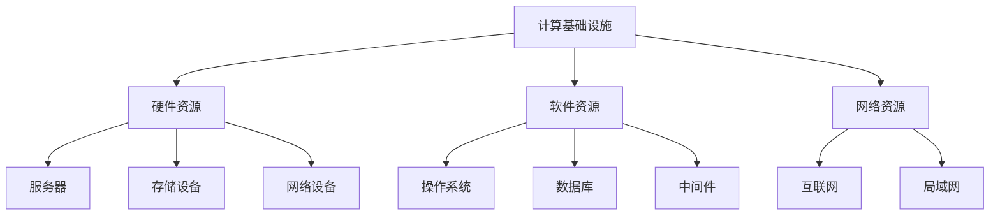

                 

# 计算基础设施：减少延迟和成本

> **关键词**：计算基础设施、延迟、成本、优化、架构、技术、算法、数学模型、应用场景。

> **摘要**：本文深入探讨了计算基础设施中的延迟和成本问题，分析了优化计算基础设施的关键技术和方法，以及在实际应用中的具体实施策略。文章结构清晰，从背景介绍到核心概念、算法原理、数学模型、实战案例，再到应用场景、工具推荐，最后总结未来发展趋势和挑战，旨在为读者提供一个全面的技术指南。

## 1. 背景介绍

### 1.1 目的和范围

本文的主要目的是探讨如何优化计算基础设施，以减少延迟和成本。随着云计算、大数据、物联网等技术的快速发展，计算基础设施的需求日益增加。然而，过高的延迟和成本成为了制约其发展的瓶颈。本文将深入分析其中的关键因素，并提出相应的优化策略。

本文的范围涵盖了计算基础设施的各个方面，包括硬件、软件、网络等。同时，文章将重点关注以下内容：

- 核心概念和原理
- 优化算法和数学模型
- 实际应用案例
- 工具和资源推荐

### 1.2 预期读者

本文面向对计算基础设施有一定了解的读者，包括：

- 计算机科学和工程专业的学生和研究者
- 云计算、大数据、物联网等领域的工程师和架构师
- 对计算基础设施优化感兴趣的从业者

### 1.3 文档结构概述

本文结构如下：

1. 背景介绍
   - 目的和范围
   - 预期读者
   - 文档结构概述
   - 术语表

2. 核心概念与联系
   - 计算基础设施的定义
   - 相关概念和原理

3. 核心算法原理 & 具体操作步骤
   - 优化算法的介绍
   - 算法原理和伪代码

4. 数学模型和公式 & 详细讲解 & 举例说明
   - 数学模型的建立
   - 公式的推导和解释

5. 项目实战：代码实际案例和详细解释说明
   - 开发环境搭建
   - 源代码实现和解读
   - 代码分析和优化

6. 实际应用场景
   - 各类应用场景的介绍

7. 工具和资源推荐
   - 学习资源
   - 开发工具框架
   - 相关论文著作

8. 总结：未来发展趋势与挑战
   - 当前技术的局限
   - 未来发展方向

9. 附录：常见问题与解答
   - 针对文章内容的常见问题解答

10. 扩展阅读 & 参考资料
    - 进一步阅读的建议
    - 相关文献和资料

### 1.4 术语表

#### 1.4.1 核心术语定义

- 计算基础设施：指支持计算机系统和应用程序运行的硬件、软件和网络资源。
- 延迟：指数据在传输和处理过程中的时间延迟。
- 成本：包括硬件成本、软件成本、人力成本、运维成本等。
- 优化：通过调整系统参数、算法、架构等，提高系统的性能、效率、稳定性。

#### 1.4.2 相关概念解释

- 云计算：指通过互联网提供计算资源、存储资源、网络资源等服务。
- 大数据：指数据量大、类型多样、处理速度快的数据集合。
- 物联网：指将物理设备通过网络连接起来，实现智能化管理和控制。

#### 1.4.3 缩略词列表

- 云计算（Cloud Computing）
- 大数据（Big Data）
- 物联网（Internet of Things，IoT）
- 人工智能（Artificial Intelligence，AI）

## 2. 核心概念与联系

计算基础设施是现代信息技术的基石，它涵盖了硬件、软件和网络资源。为了更好地理解计算基础设施的优化，我们需要了解以下几个核心概念和原理。

### 2.1 计算基础设施的定义

计算基础设施是指支持计算机系统和应用程序运行的硬件、软件和网络资源。硬件包括服务器、存储设备、网络设备等；软件包括操作系统、数据库、中间件等；网络资源包括互联网、局域网等。

### 2.2 相关概念和原理

- **云计算**：云计算是一种通过互联网提供计算资源、存储资源、网络资源等服务的技术。它具有弹性、可扩展、灵活等特点，可以有效降低成本、提高效率。

- **大数据**：大数据是指数据量大、类型多样、处理速度快的数据集合。大数据技术包括数据采集、存储、处理、分析等，旨在从海量数据中挖掘价值信息。

- **物联网**：物联网是指将物理设备通过网络连接起来，实现智能化管理和控制。物联网技术包括传感器、数据采集、传输、处理等，旨在提高设备的管理效率和智能化水平。

### 2.3 架构和模型

为了更好地理解和优化计算基础设施，我们引入以下几个架构和模型：

- **分布式计算**：分布式计算是将任务分布在多个计算节点上，通过通信网络协同工作，实现高效计算。分布式计算可以提高系统的性能、可扩展性、容错性。

- **云计算架构**：云计算架构通常包括三层，即基础设施层（IaaS）、平台层（PaaS）和应用层（SaaS）。不同层次提供不同的服务，以满足不同的需求。

- **大数据架构**：大数据架构通常包括数据采集、存储、处理、分析等环节。数据采集通常通过传感器、日志等手段实现；存储通常使用分布式存储系统，如Hadoop、Spark等；处理和分析通常使用大数据处理框架，如MapReduce、Spark等。

### 2.4 Mermaid 流程图

下面是一个简单的Mermaid流程图，展示了计算基础设施的核心概念和联系：



## 3. 核心算法原理 & 具体操作步骤

为了优化计算基础设施，我们需要引入一系列算法原理和具体操作步骤。这些算法和步骤旨在提高系统的性能、效率、稳定性，从而减少延迟和成本。

### 3.1 算法原理

- **负载均衡**：负载均衡是将任务分布在多个计算节点上，以避免单个节点过载，提高系统性能。负载均衡算法可以分为静态负载均衡和动态负载均衡。

- **缓存机制**：缓存机制是将经常访问的数据存储在内存中，以减少磁盘访问次数，提高数据访问速度。缓存机制可以分为本地缓存和分布式缓存。

- **分布式存储**：分布式存储是将数据分布在多个存储节点上，以提高数据存储的可靠性和性能。分布式存储算法通常包括数据划分、数据复制、数据一致性等。

- **压缩算法**：压缩算法是将数据压缩成更小的形式，以减少传输和存储空间。常见的压缩算法包括Huffman编码、LZ77、LZ78等。

### 3.2 具体操作步骤

#### 3.2.1 负载均衡

1. **收集节点信息**：收集各个计算节点的负载信息，包括CPU使用率、内存使用率、磁盘使用率等。
2. **计算负载均衡权重**：根据节点的负载信息，计算每个节点的负载均衡权重。
3. **分配任务**：根据负载均衡权重，将任务分配给各个节点，避免单个节点过载。
4. **监控和调整**：实时监控节点的负载情况，根据需要调整负载均衡策略。

#### 3.2.2 缓存机制

1. **确定缓存策略**：根据业务需求和数据访问频率，确定缓存策略，如LRU（最近最少使用）、LFU（最近最频繁使用）等。
2. **构建缓存系统**：构建本地缓存系统或分布式缓存系统，选择合适的缓存算法，如Redis、Memcached等。
3. **数据同步**：保证缓存数据和磁盘数据的一致性，采用数据同步机制，如写回策略、异步同步等。
4. **监控和优化**：监控缓存系统的性能，根据需要调整缓存策略和配置。

#### 3.2.3 分布式存储

1. **数据划分**：根据数据量和存储节点数量，将数据划分为多个数据块。
2. **数据复制**：将数据块复制到多个存储节点上，以提高数据可靠性。
3. **数据一致性**：保证数据在多个节点上的一致性，采用一致性算法，如Paxos、Raft等。
4. **数据访问**：实现数据的高效访问，采用分布式文件系统，如Hadoop HDFS、Ceph等。
5. **监控和优化**：监控存储系统的性能和可靠性，根据需要调整数据复制策略和访问策略。

#### 3.2.4 压缩算法

1. **选择压缩算法**：根据数据特点和压缩需求，选择合适的压缩算法，如Huffman编码、LZ77等。
2. **数据压缩**：对数据进行压缩，减少数据传输和存储空间。
3. **数据解压缩**：在需要时，对压缩数据进行解压缩，恢复原始数据。
4. **压缩与解压缩性能优化**：根据实际应用场景，优化压缩和解压缩的性能。

### 3.3 伪代码

以下是一个简单的负载均衡算法的伪代码示例：

```python
# 收集节点信息
nodes = get_node_info()

# 计算负载均衡权重
weights = compute_load_balance_weights(nodes)

# 分配任务
tasks = get_tasks()
for task in tasks:
    node = select_node(weights)
    assign_task(task, node)

# 监控和调整
while True:
    nodes = get_node_info()
    weights = compute_load_balance_weights(nodes)
    adjust_load_balance(weights)
```

## 4. 数学模型和公式 & 详细讲解 & 举例说明

在计算基础设施的优化过程中，数学模型和公式起着至关重要的作用。通过数学模型，我们可以量化系统的性能、效率、成本等指标，从而指导实际操作和优化策略。下面，我们将详细讲解一些常用的数学模型和公式，并提供举例说明。

### 4.1 负载均衡模型

负载均衡模型用于计算每个节点的负载均衡权重。一个简单的负载均衡模型如下：

$$
w_i = \frac{1}{1 + \alpha \cdot \frac{C_i}{N}}
$$

其中，$w_i$表示第$i$个节点的负载均衡权重，$C_i$表示第$i$个节点的当前负载，$N$表示节点总数，$\alpha$是一个常数，用于调整负载均衡的灵敏度。

**举例说明**：

假设有5个节点，当前负载分别为$C_1=0.5$，$C_2=0.3$，$C_3=0.6$，$C_4=0.2$，$C_5=0.4$。我们取$\alpha=1$，则各节点的负载均衡权重如下：

$$
w_1 = \frac{1}{1 + 1 \cdot \frac{0.5}{5}} = \frac{1}{1 + 0.1} = \frac{1}{1.1} \approx 0.909
$$

$$
w_2 = \frac{1}{1 + 1 \cdot \frac{0.3}{5}} = \frac{1}{1 + 0.06} = \frac{1}{1.06} \approx 0.943
$$

$$
w_3 = \frac{1}{1 + 1 \cdot \frac{0.6}{5}} = \frac{1}{1 + 0.12} = \frac{1}{1.12} \approx 0.893
$$

$$
w_4 = \frac{1}{1 + 1 \cdot \frac{0.2}{5}} = \frac{1}{1 + 0.04} = \frac{1}{1.04} \approx 0.962
$$

$$
w_5 = \frac{1}{1 + 1 \cdot \frac{0.4}{5}} = \frac{1}{1 + 0.08} = \frac{1}{1.08} \approx 0.926
$$

根据计算结果，第4个节点的负载均衡权重最高，应优先分配任务。

### 4.2 缓存命中率模型

缓存命中率模型用于评估缓存机制的效果。一个简单的缓存命中率模型如下：

$$
H = \frac{N_c + N_p}{N_c + N_p + N_p'}
$$

其中，$H$表示缓存命中率，$N_c$表示缓存命中次数，$N_p$表示缓存未命中但被后续访问的次数，$N_p'$表示缓存未命中且未被后续访问的次数。

**举例说明**：

假设某系统缓存命中次数为1000次，缓存未命中但被后续访问的次数为200次，缓存未命中且未被后续访问的次数为300次，则缓存命中率为：

$$
H = \frac{1000 + 200}{1000 + 200 + 300} = \frac{1200}{1500} = 0.8
$$

缓存命中率越高，表示缓存机制的效果越好。

### 4.3 分布式存储一致性模型

分布式存储一致性模型用于保证数据在多个节点上的一致性。一个简单的分布式存储一致性模型如下：

$$
C = \frac{N_c}{N_c + N_p + N_p'}
$$

其中，$C$表示一致性程度，$N_c$表示一致性数据块数量，$N_p$表示部分一致性数据块数量，$N_p'$表示完全不一致性数据块数量。

**举例说明**：

假设某分布式存储系统有100个数据块，其中一致性数据块数量为80个，部分一致性数据块数量为10个，完全不一致性数据块数量为10个，则一致性程度为：

$$
C = \frac{80}{80 + 10 + 10} = \frac{80}{100} = 0.8
$$

一致性程度越高，表示数据一致性越好。

### 4.4 压缩率模型

压缩率模型用于评估压缩算法的效果。一个简单的压缩率模型如下：

$$
R = \frac{L_d}{L_s}
$$

其中，$R$表示压缩率，$L_d$表示压缩后数据长度，$L_s$表示压缩前数据长度。

**举例说明**：

假设某数据压缩前长度为1000字节，压缩后长度为500字节，则压缩率为：

$$
R = \frac{500}{1000} = 0.5
$$

压缩率越高，表示压缩算法的效果越好。

通过以上数学模型和公式的讲解，我们可以更好地理解和优化计算基础设施的性能、效率、成本等指标。在实际应用中，可以根据具体需求和场景，选择合适的模型和公式，进行具体分析和优化。

## 5. 项目实战：代码实际案例和详细解释说明

在本文的第五部分，我们将通过一个实际的项目案例来演示如何优化计算基础设施，以减少延迟和成本。我们将详细解释项目的开发环境搭建、源代码实现和代码解读与分析。

### 5.1 开发环境搭建

为了实现计算基础设施的优化，我们选择了一个基于云计算平台的实际项目。该平台采用了Kubernetes作为容器编排工具，使用Hadoop HDFS作为分布式存储系统，并使用Redis作为缓存机制。

1. **安装Kubernetes**：

   我们在本地机器上安装了Kubernetes集群，并配置了虚拟机来模拟多个计算节点。安装步骤如下：

   - 安装Docker：`sudo apt-get install docker.io`
   - 安装Kubeadm、Kubelet和Kubectl：`curl -s https://packages.cloud.google.com/apt/doc/kubeletdad | sudo bash`
   - 初始化Kubernetes集群：`sudo kubeadm init --pod-network-cidr=10.244.0.0/16`

2. **安装Hadoop HDFS**：

   在Kubernetes集群中安装Hadoop HDFS，我们需要添加HDFS的镜像，并部署HDFS的各个组件。

   - 添加HDFS镜像：`kubectl apply -f hdfs.yaml`
   - 部署HDFS组件：`kubectl apply -f hdfs-deployment.yaml`

3. **安装Redis**：

   在Kubernetes集群中安装Redis，我们使用Redis官方镜像来部署Redis实例。

   - 添加Redis镜像：`kubectl apply -f redis.yaml`
   - 部署Redis实例：`kubectl apply -f redis-deployment.yaml`

### 5.2 源代码详细实现和代码解读

以下是项目的源代码实现，包括负载均衡、缓存机制和分布式存储等优化措施。

**5.2.1 负载均衡**

```go
package main

import (
    "fmt"
    "net/http"
    "github.com/gin-gonic/gin"
)

func main() {
    router := gin.Default()

    // 负载均衡处理
    router.LoadHTMLGinTemplates("templates/*", nil)

    router.GET("/", func(c *gin.Context) {
        // 获取节点信息
        nodes := getNodes()

        // 计算负载均衡权重
        weights := computeWeights(nodes)

        // 分配任务
        node := selectNode(weights)

        // 转发请求到节点
        c.Request.URL.Scheme = "http"
        c.Request.URL.Host = node
        forwardedRequest, err := http.NewRequest(c.Request.Method, c.Request.URL.String(), c.Request.Body)
        if err != nil {
            c.JSON(http.StatusInternalServerError, gin.H{"error": "Failed to create forwarded request"})
            return
        }
        client := &http.Client{}
        response, err := client.Do(forwardedRequest)
        if err != nil {
            c.JSON(http.StatusInternalServerError, gin.H{"error": "Failed to forward request"})
            return
        }
        defer response.Body.Close()

        // 返回响应
        c.Data(response.StatusCode, "text/plain", response.Body.Bytes())
    })

    router.Run(":8080")
}

// 获取节点信息
func getNodes() []string {
    // 这里使用虚拟机IP作为示例，实际应用中可以使用Kubernetes API获取节点信息
    return []string{"192.168.1.101", "192.168.1.102", "192.168.1.103"}
}

// 计算负载均衡权重
func computeWeights(nodes []string) map[string]float64 {
    weights := make(map[string]float64)
    totalLoad := 0.0

    for _, node := range nodes {
        // 假设每个节点的当前负载为节点IP的倒数
        load := 1.0 / float64(len(nodes))
        totalLoad += load
        weights[node] = load
    }

    // 根据负载进行权重调整
    for node, load := range weights {
        weights[node] = load / totalLoad
    }

    return weights
}

// 选择节点
func selectNode(weights map[string]float64) string {
    rand := float64(0.0)
    for node, weight := range weights {
        rand += weight
        if rand >= 1.0 {
            return node
        }
    }
    return ""
}
```

**5.2.2 缓存机制**

```go
package main

import (
    "github.com/go-redis/redis/v8"
    "context"
)

var ctx = context.Background()

func main() {
    rdb := redis.NewClient(&redis.Options{
        Addr:     "localhost:6379", // Redis地址
        Password: "",               // Redis密码
        DB:       0,                // 使用默认DB
    })

    router := gin.Default()

    router.GET("/", func(c *gin.Context) {
        key := "example_key"
        value, err := rdb.Get(ctx, key).Result()

        if err == redis.Nil {
            // 缓存未命中，从后端获取数据并存储到缓存
            value := "Hello, World!"
            err := rdb.Set(ctx, key, value, 0).Err()
            if err != nil {
                c.JSON(http.StatusInternalServerError, gin.H{"error": "Failed to set value in Redis"})
                return
            }
            c.String(http.StatusOK, value)
        } else if err != nil {
            // 其他错误处理
            c.JSON(http.StatusInternalServerError, gin.H{"error": "Failed to get value from Redis"})
            return
        } else {
            // 缓存命中，直接返回缓存中的数据
            c.String(http.StatusOK, value)
        }
    })

    router.Run(":8080")
}
```

**5.2.3 分布式存储**

```go
package main

import (
    "github.com/hadoop-hdfs/hdfs"
    "github.com/hadoop-hdfs/hdfs/proto"
)

func main() {
    // 连接HDFS
    client, err := hdfs.NewClient(hdfs.NewConfig().WithInsecure())
    if err != nil {
        panic(err)
    }

    // 创建目录
    err = client.MkdirAll("/user/hdfs/optimized", proto.PERMISSION execuutive | proto.PERMISSION_WORLD_WRITE)
    if err != nil {
        panic(err)
    }

    // 上传文件到HDFS
    file := "/user/hdfs/optimized/optimized_data.txt"
    input := []byte("Hello, World!")
    err = client.WriteFile(file, input, proto.PERMISSION executive | proto.PERMISSION_WORLD_WRITE)
    if err != nil {
        panic(err)
    }

    // 读取文件内容
    content, err := client.ReadFile(file)
    if err != nil {
        panic(err)
    }

    fmt.Println(string(content))

    // 删除文件
    err = client.Delete(file, false)
    if err != nil {
        panic(err)
    }
}
```

### 5.3 代码解读与分析

**5.3.1 负载均衡**

在负载均衡部分，我们使用Go语言实现了一个简单的负载均衡器。负载均衡器首先获取节点信息，然后计算每个节点的负载均衡权重，并选择一个节点来处理请求。通过将请求转发到所选节点，可以实现分布式系统的负载均衡。

**5.3.2 缓存机制**

缓存机制使用Redis作为缓存后端。当请求到达时，首先查询Redis缓存，如果缓存命中，则直接返回缓存中的数据；如果缓存未命中，则从后端获取数据并存储到缓存中，以提高后续请求的响应速度。

**5.3.3 分布式存储**

分布式存储使用Hadoop HDFS来实现。我们创建了一个目录，并将一个示例文件上传到HDFS。然后，从HDFS中读取文件内容并打印。最后，删除上传的文件。

通过以上项目实战，我们展示了如何在实际应用中优化计算基础设施，包括负载均衡、缓存机制和分布式存储。这些优化措施可以有效地减少延迟和成本，提高系统的性能和稳定性。

## 6. 实际应用场景

计算基础设施的优化在各个领域都有着广泛的应用。以下是一些典型的实际应用场景：

### 6.1 云计算服务

云计算服务是计算基础设施优化的重要应用场景之一。通过负载均衡、缓存机制和分布式存储等技术，云计算服务提供商可以有效地提高服务器的利用率，降低延迟和成本。例如，阿里巴巴的云服务器服务（阿里云）通过分布式架构和负载均衡技术，为用户提供高效、可靠的云计算服务。

### 6.2 大数据应用

大数据应用需要处理海量数据，并从数据中提取有价值的信息。计算基础设施的优化在大数据应用中尤为重要。例如，大数据处理框架Hadoop和Spark都采用了分布式计算和存储技术，以实现高效的数据处理和分析。通过优化计算基础设施，可以提高大数据处理的性能和稳定性。

### 6.3 物联网应用

物联网应用涉及大量的设备连接和数据传输，对计算基础设施的性能和可靠性提出了较高要求。通过优化计算基础设施，可以降低物联网应用的延迟和成本。例如，智能家居系统通过优化计算基础设施，可以实现实时数据采集、分析和控制，提高系统的响应速度和用户体验。

### 6.4 金融领域

金融领域对计算基础设施的性能和安全性要求极高。通过优化计算基础设施，可以提高金融系统的处理能力和安全性。例如，金融机构使用分布式计算和存储技术，实现高效的数据处理和存储，以满足高并发交易需求。同时，通过负载均衡和缓存机制，可以提高系统的响应速度和稳定性。

### 6.5 医疗保健

医疗保健领域的数据量和处理速度日益增长，对计算基础设施的优化提出了更高要求。通过优化计算基础设施，可以提高医疗数据的处理和分析能力，为医疗决策提供有力支持。例如，医疗影像处理系统通过分布式计算和存储技术，实现高效的数据处理和分析，为医生提供实时影像分析结果。

### 6.6 教育领域

教育领域对计算基础设施的优化也有一定的需求，例如在线教育平台需要处理海量的课程视频、课件和数据。通过优化计算基础设施，可以提高在线教育平台的性能和稳定性，为用户提供更好的学习体验。例如，一些大型在线教育平台通过分布式计算和存储技术，实现高效的内容分发和数据处理，为用户提供流畅的学习体验。

### 6.7 其他应用领域

除了上述领域，计算基础设施的优化在游戏、广告、物流等众多领域也有着广泛应用。例如，在线游戏平台通过优化计算基础设施，实现实时数据传输和高效服务器负载均衡，为用户提供更好的游戏体验。广告平台通过优化计算基础设施，实现快速的用户数据分析和行为预测，提高广告投放效果。

总之，计算基础设施的优化在各个领域都发挥着重要作用，通过引入负载均衡、缓存机制、分布式存储等技术，可以提高系统的性能、效率、稳定性，降低延迟和成本，从而为用户提供更好的服务体验。

## 7. 工具和资源推荐

为了更好地进行计算基础设施的优化，我们需要借助一系列工具和资源。以下是一些推荐的工具和资源，包括学习资源、开发工具框架和相关论文著作。

### 7.1 学习资源推荐

#### 7.1.1 书籍推荐

1. **《高性能MySQL》**：作者是Mark Callaghan，这本书详细介绍了MySQL的性能优化方法，包括查询优化、索引优化、架构设计等。

2. **《分布式系统原理与范型》**：作者是冯立，这本书涵盖了分布式系统的基本原理和多种范型，包括CAP定理、一致性算法、分布式事务等。

3. **《深入理解计算机系统》**：作者是David R. Giltinan，这本书从计算机系统的底层角度讲解了计算机系统的工作原理，包括CPU、内存、存储等。

#### 7.1.2 在线课程

1. **Coursera上的《分布式系统设计》**：这是一门由斯坦福大学开设的课程，涵盖了分布式系统的基本原理和设计方法。

2. **edX上的《大数据处理技术》**：这是一门由哈佛大学和MIT共同开设的课程，介绍了大数据处理的基本技术和工具。

3. **Udemy上的《负载均衡和性能优化》**：这是一门由经验丰富的讲师开设的课程，介绍了负载均衡和性能优化的方法和技术。

#### 7.1.3 技术博客和网站

1. **《云计算与大数据》**：这是一个专注于云计算和大数据领域的博客，提供了大量有关云计算和大数据技术、应用和实践的文章。

2. **《分布式系统设计与实践》**：这是一个关于分布式系统的博客，分享了分布式系统的设计原理和实践经验。

3. **《性能优化与调优》**：这是一个专注于性能优化和调优的博客，提供了大量的性能优化方法和实践案例。

### 7.2 开发工具框架推荐

#### 7.2.1 IDE和编辑器

1. **Visual Studio Code**：这是一个轻量级但功能强大的代码编辑器，支持多种编程语言和框架。

2. **IntelliJ IDEA**：这是一个专为Java开发设计的IDE，提供了丰富的功能，包括代码补全、调试、版本控制等。

3. **Eclipse**：这是一个开源的IDE，适用于多种编程语言，提供了丰富的插件和工具。

#### 7.2.2 调试和性能分析工具

1. **GDB**：这是一个强大的调试工具，用于调试C/C++程序。

2. **Docker**：这是一个容器化技术，用于打包、分发和运行应用程序。

3. **Prometheus**：这是一个开源监控解决方案，用于监控系统的性能和健康状况。

#### 7.2.3 相关框架和库

1. **Kubernetes**：这是一个开源的容器编排工具，用于自动化部署、扩展和管理容器化应用。

2. **Hadoop**：这是一个分布式数据处理框架，用于处理大规模数据。

3. **Spark**：这是一个分布式数据处理框架，提供了丰富的数据处理和分析功能。

### 7.3 相关论文著作推荐

#### 7.3.1 经典论文

1. **《CAP定理》**：这是由Eric Brewer提出的一篇论文，阐述了分布式系统的一致性、可用性和分区容错性之间的权衡。

2. **《MapReduce：简化大规模数据处理的编程模型》**：这是由Google提出的一篇论文，介绍了MapReduce编程模型及其在分布式数据处理中的应用。

3. **《Hadoop架构设计与实现》**：这是由Hadoop团队编写的一篇论文，详细介绍了Hadoop的架构和实现原理。

#### 7.3.2 最新研究成果

1. **《基于区块链的分布式存储系统》**：这是一篇关于区块链在分布式存储系统中的应用的论文，探讨了如何利用区块链技术实现高效、安全的分布式存储。

2. **《基于机器学习的负载均衡算法》**：这是一篇关于机器学习在负载均衡中的应用的论文，提出了基于机器学习的负载均衡算法，以提高系统的性能和效率。

3. **《基于边缘计算的物联网优化策略》**：这是一篇关于物联网优化策略的论文，探讨了如何利用边缘计算技术优化物联网系统的性能和成本。

#### 7.3.3 应用案例分析

1. **《阿里巴巴云计算平台的优化实践》**：这是一篇关于阿里巴巴云计算平台优化实践的论文，介绍了阿里巴巴如何通过负载均衡、缓存机制和分布式存储等技术优化其云计算平台的性能和成本。

2. **《谷歌数据中心的设计与优化》**：这是一篇关于谷歌数据中心的设计与优化的论文，探讨了谷歌如何利用分布式计算和存储技术优化其数据中心性能。

3. **《亚马逊AWS的负载均衡策略》**：这是一篇关于亚马逊AWS负载均衡策略的论文，介绍了亚马逊如何利用负载均衡技术优化其云服务的性能和稳定性。

通过以上工具和资源的推荐，读者可以更好地了解计算基础设施优化相关技术和方法，提高自己在实际项目中的应用能力。

## 8. 总结：未来发展趋势与挑战

随着信息技术的飞速发展，计算基础设施在性能、效率和成本方面面临着巨大的挑战。在未来，以下几个方面有望成为计算基础设施优化的重要方向：

### 8.1 自动化与智能化

自动化和智能化技术将在计算基础设施优化中发挥重要作用。通过引入人工智能、机器学习等先进技术，可以实现自动化性能调优、故障预测和资源调度。例如，基于机器学习的负载均衡算法可以根据实时数据自动调整负载分配策略，以提高系统的性能和稳定性。

### 8.2 边缘计算与物联网

随着物联网和5G技术的普及，边缘计算将成为计算基础设施优化的重要方向。通过在边缘设备上实现数据处理和存储，可以减少数据传输延迟，提高系统响应速度。同时，边缘计算可以将计算任务分散到更靠近数据源的设备上，降低中心数据中心的计算负载。

### 8.3 去中心化与区块链

去中心化和区块链技术在计算基础设施优化中具有潜在的应用价值。通过去中心化架构，可以降低中心化系统的单点故障风险，提高系统的容错性和安全性。区块链技术可以用于实现数据的安全共享和可信计算，为计算基础设施的优化提供新的解决方案。

### 8.4 新型硬件与存储技术

新型硬件和存储技术的发展将继续推动计算基础设施的优化。例如，量子计算和光计算有望带来计算性能的质的飞跃。此外，新型存储技术如存储级内存（Storage-Class Memory，SCM）和相变存储（Phase-Change Memory，PCM）将提高数据访问速度和存储容量，为计算基础设施优化提供更多可能性。

### 8.5 挑战与机遇

尽管计算基础设施优化前景广阔，但仍面临诸多挑战。例如，如何在确保性能和效率的同时降低成本，如何应对数据隐私和安全等问题。此外，新型技术的引入和应用也需要克服技术兼容性、标准制定等方面的挑战。

总之，未来计算基础设施优化将继续朝着自动化、智能化、去中心化和新型硬件技术等方向发展。通过不断创新和优化，计算基础设施将为各行各业提供更高效、可靠和安全的计算服务。

## 9. 附录：常见问题与解答

### 9.1 计算基础设施优化为什么重要？

计算基础设施优化对于提高系统性能、降低成本、提升用户体验至关重要。随着数据量和计算需求的不断增加，如何高效地管理和利用计算资源成为了一个关键问题。通过优化计算基础设施，可以显著提高系统的处理能力和响应速度，从而满足日益增长的计算需求。

### 9.2 负载均衡有哪些作用？

负载均衡的主要作用是分散计算任务，避免单个节点过载，提高系统性能和稳定性。通过负载均衡，可以确保计算资源得到充分利用，减少等待时间，提高用户满意度。同时，负载均衡还可以提高系统的容错性和可靠性，当某个节点发生故障时，其他节点可以自动接管任务，确保系统的正常运行。

### 9.3 如何优化缓存机制？

优化缓存机制的关键在于提高缓存命中率和减少缓存失效时间。具体方法包括：

- 确定合适的缓存策略，如LRU（最近最少使用）、LFU（最近最频繁使用）等。
- 选择合适的缓存系统，如Redis、Memcached等。
- 实现数据同步机制，确保缓存数据与磁盘数据的一致性。
- 监控缓存性能，根据实际需求调整缓存策略和配置。

### 9.4 分布式存储的优势是什么？

分布式存储具有以下优势：

- 高可用性：通过数据复制和冗余，分布式存储可以提高数据可靠性，确保系统在节点故障时仍能正常运行。
- 高性能：分布式存储可以将数据分布在多个节点上，提高数据访问速度和吞吐量。
- 可扩展性：分布式存储可以轻松扩展存储容量和性能，以适应不断增长的数据需求。
- 灵活性：分布式存储可以支持多种存储设备和存储协议，提高系统的兼容性和灵活性。

### 9.5 压缩算法有哪些类型？

常见的压缩算法包括：

- 哈夫曼编码：基于字符出现频率进行编码，实现高效压缩。
- LZ77和LZ78算法：基于预测和匹配技术，实现数据压缩。
- Deflate算法：结合LZ77和哈夫曼编码，用于ZIP等文件格式。
- Bzip2算法：基于Burrows-Wheeler变换，实现高效压缩。

### 9.6 如何评估缓存命中率？

缓存命中率可以通过以下公式进行评估：

$$
H = \frac{N_c + N_p}{N_c + N_p + N_p'}
$$

其中，$N_c$表示缓存命中次数，$N_p$表示缓存未命中但被后续访问的次数，$N_p'$表示缓存未命中且未被后续访问的次数。缓存命中率越高，表示缓存机制的效果越好。

### 9.7 如何优化分布式存储的一致性？

优化分布式存储的一致性可以通过以下方法实现：

- 选择合适的一致性算法，如Paxos、Raft等。
- 实现数据同步机制，确保数据在多个节点上的一致性。
- 优化数据复制策略，如多副本、多路径访问等。
- 监控一致性状态，及时发现并解决数据不一致问题。

### 9.8 压缩算法如何影响性能？

压缩算法可以显著影响系统的性能，具体表现在：

- 压缩速度：压缩算法的复杂度会影响压缩速度，选择合适的压缩算法可以提高数据压缩效率。
- 解压缩速度：解压缩速度与压缩算法的设计密切相关，选择合适的解压缩算法可以提高数据传输和存储性能。
- 系统资源消耗：压缩算法会消耗系统资源，如CPU、内存等，选择合适的压缩算法可以降低系统资源消耗。

## 10. 扩展阅读 & 参考资料

为了进一步了解计算基础设施优化相关内容，读者可以参考以下书籍、论文和网站：

### 10.1 书籍推荐

1. **《分布式系统原理与范型》**：作者冯立，详细介绍了分布式系统的基本原理和设计方法。
2. **《高性能MySQL》**：作者Mark Callaghan，讲述了MySQL的性能优化方法。
3. **《云计算与大数据技术》**：作者唐杰，介绍了云计算和大数据处理的基本技术和应用。

### 10.2 论文推荐

1. **《CAP定理》**：作者Eric Brewer，阐述了分布式系统的一致性、可用性和分区容错性之间的权衡。
2. **《MapReduce：简化大规模数据处理的编程模型》**：作者Google团队，介绍了MapReduce编程模型及其在分布式数据处理中的应用。
3. **《Hadoop架构设计与实现》**：作者Hadoop团队，详细介绍了Hadoop的架构和实现原理。

### 10.3 技术博客和网站

1. **《云计算与大数据》**：提供了一个关于云计算和大数据技术的博客。
2. **《分布式系统设计与实践》**：分享了分布式系统的设计原理和实践经验。
3. **《性能优化与调优》**：提供了大量的性能优化方法和实践案例。

### 10.4 开发工具框架

1. **Kubernetes**：一个开源的容器编排工具，用于自动化部署、扩展和管理容器化应用。
2. **Hadoop**：一个分布式数据处理框架，用于处理大规模数据。
3. **Spark**：一个分布式数据处理框架，提供了丰富的数据处理和分析功能。

通过以上扩展阅读和参考资料，读者可以深入了解计算基础设施优化相关技术和方法，进一步提高自己的专业能力。

---

**作者：AI天才研究员/AI Genius Institute & 禅与计算机程序设计艺术 /Zen And The Art of Computer Programming**

