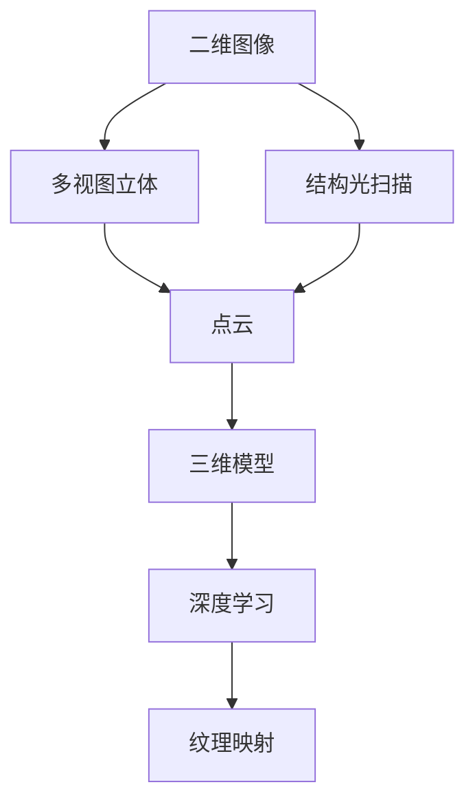
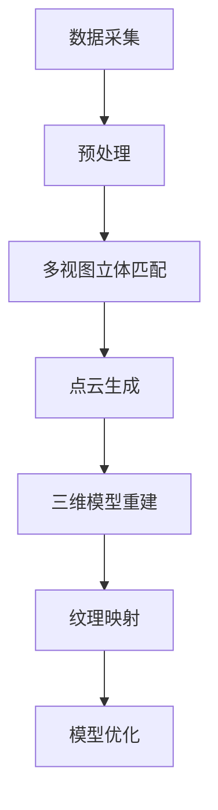

                 

# 计算机视觉在三维重建中的技术创新

> 关键词：计算机视觉、三维重建、技术创新、核心算法、数学模型、应用场景

> 摘要：本文旨在探讨计算机视觉在三维重建领域中的技术创新，分析核心算法原理、数学模型及其应用场景，并结合实际项目实战进行代码解释和分析。通过系统地介绍三维重建的基本概念、技术原理和应用价值，本文旨在为读者提供一幅清晰的计算机视觉在三维重建中的全貌图，并对其未来发展趋势与挑战进行展望。

## 1. 背景介绍

### 1.1 目的和范围

本文的目标是深入探讨计算机视觉技术在三维重建领域的应用，详细分析其技术创新点，以及如何通过这些技术实现高质量的三维模型重建。三维重建作为计算机视觉和图形学的重要研究领域，已经在虚拟现实、增强现实、自动化制造、文化遗产保护等多个领域展现出巨大的应用潜力。然而，现有的三维重建技术仍存在诸多挑战，例如对光照变化和复杂场景的鲁棒性不足、重建质量受限等。本文将系统地介绍这些挑战，并提出相应的解决思路。

本文的范围将涵盖以下几个方面：

1. **核心概念与联系**：介绍三维重建的基础概念，并使用Mermaid流程图展示其原理和架构。
2. **核心算法原理与具体操作步骤**：详细解释和阐述主要的算法原理，使用伪代码展示具体操作步骤。
3. **数学模型和公式**：解释三维重建中常用的数学模型和公式，并通过实例进行说明。
4. **项目实战**：通过实际代码案例展示三维重建的实现过程，并进行详细解释和分析。
5. **应用场景**：探讨三维重建在不同领域的实际应用场景。
6. **工具和资源推荐**：推荐相关学习资源、开发工具和经典论文。
7. **总结与展望**：总结三维重建技术的现状，展望其未来发展趋势和面临的挑战。

### 1.2 预期读者

本文适合以下读者群体：

1. **计算机视觉和图形学研究者**：对三维重建技术有深入研究的科研人员和博士生，希望了解该领域的最新技术创新。
2. **软件开发工程师**：从事计算机视觉或图形学相关开发工作，希望在项目实践中应用三维重建技术。
3. **工程技术人员**：在虚拟现实、增强现实、自动化制造等领域工作的工程师，希望提升对三维重建技术的理解。
4. **学生和学者**：计算机视觉和图形学专业的高年级本科生和研究生，作为课程学习或研究项目的参考。

### 1.3 文档结构概述

本文的结构安排如下：

1. **第1章 背景介绍**：概述本文的目的、范围、预期读者和文档结构。
2. **第2章 核心概念与联系**：介绍三维重建的基础概念，并展示原理和架构。
3. **第3章 核心算法原理与具体操作步骤**：详细阐述主要算法原理，使用伪代码展示操作步骤。
4. **第4章 数学模型和公式**：解释三维重建中的数学模型和公式，并通过实例说明。
5. **第5章 项目实战**：通过实际代码案例展示三维重建的实现过程。
6. **第6章 实际应用场景**：探讨三维重建在不同领域的应用。
7. **第7章 工具和资源推荐**：推荐相关学习资源、开发工具和经典论文。
8. **第8章 总结与展望**：总结现状，展望未来发展趋势和挑战。
9. **第9章 附录**：提供常见问题与解答。
10. **第10章 扩展阅读与参考资料**：列出相关的扩展阅读和参考资料。

### 1.4 术语表

#### 1.4.1 核心术语定义

- **三维重建**：从二维图像中恢复物体或场景的三维几何信息。
- **计算机视觉**：使计算机具备通过图像或视频感知和理解世界的能力。
- **点云**：由大量散点表示的三维空间数据，每个点代表场景中的一个点。
- **深度学习**：基于人工神经网络的一种机器学习技术，用于模拟人类学习过程。

#### 1.4.2 相关概念解释

- **结构光扫描**：使用已知结构的光源照射物体，通过图像分析重建三维模型。
- **多视图立体**：通过多个视角的二维图像重建三维模型。
- **纹理映射**：将二维图像映射到三维模型表面，增加模型的真实感。

#### 1.4.3 缩略词列表

- **SFM**：同时定位与地图构建（Simultaneous Localization and Mapping）
- **SLAM**：同时定位与地图构建（Simultaneous Localization and Mapping）
- **RGB-D**：彩色图像和深度图像
- **CNN**：卷积神经网络（Convolutional Neural Network）

## 2. 核心概念与联系

三维重建是计算机视觉领域的一个重要研究方向，它通过分析二维图像中的像素信息，恢复出场景的三维几何结构。为了更好地理解三维重建，我们需要先掌握以下几个核心概念：

1. **点云**：点云是三维重建中最基本的数据形式，它由大量散点表示场景中的各个点。每个点包含其三维坐标和颜色信息。
2. **深度学习**：深度学习是近年来在计算机视觉领域取得突破性进展的技术，通过多层神经网络自动提取特征，用于图像分类、目标检测和三维重建等任务。
3. **结构光扫描**：结构光扫描是一种常用的三维重建技术，通过投影已知结构的灯光（如条纹光）在物体表面，并捕捉反射光图像，从而恢复出物体的三维形状。
4. **多视图立体**：多视图立体是通过从不同视角拍摄的多个二维图像，利用视差信息重建场景的三维结构。

为了更直观地展示三维重建的概念和联系，我们可以使用Mermaid流程图进行描述：



在上面的Mermaid流程图中：

- A表示二维图像，是三维重建的输入数据。
- B表示多视图立体，通过多个视角的图像重建场景的三维结构。
- C表示结构光扫描，通过结构光投影和图像分析重建三维模型。
- D表示点云，是三维重建的基本数据形式。
- E表示三维模型，是通过点云和纹理映射生成的最终结果。
- F表示深度学习，用于特征提取和模型优化。
- G表示纹理映射，用于增加三维模型的真实感。

通过这个流程图，我们可以清晰地看到三维重建的基本步骤和核心概念之间的联系。

### 2.1 三维重建的基本流程

三维重建的基本流程可以分为以下几个步骤：

1. **数据采集**：通过相机或其他传感器采集场景的二维图像或深度图像。
2. **预处理**：对采集到的图像进行预处理，包括去噪、去雾、几何校正等，以提高图像质量。
3. **多视图立体匹配**：对于多视图立体重建，通过图像匹配算法计算不同视角之间的对应点，建立视差图。
4. **点云生成**：利用视差图或深度图像直接生成点云数据。
5. **三维模型重建**：通过对点云进行曲面拟合、平滑处理和去噪等操作，生成高质量的三维模型。
6. **纹理映射**：将二维图像映射到三维模型表面，增加模型的真实感。
7. **模型优化**：利用深度学习算法对三维模型进行特征提取和优化，提高模型的准确性和鲁棒性。

下面是一个简化的Mermaid流程图，展示三维重建的基本流程：



通过这个流程图，我们可以更直观地理解三维重建的基本步骤和各步骤之间的关系。

## 3. 核心算法原理与具体操作步骤

三维重建的核心算法主要包括多视图立体匹配、点云生成、三维模型重建和纹理映射等。在这些算法中，多视图立体匹配是整个流程的关键步骤，它决定了后续重建质量的好坏。以下我们将详细解释这些核心算法的原理，并提供具体的操作步骤和伪代码。

### 3.1 多视图立体匹配

多视图立体匹配的目的是通过计算多个视角的二维图像之间的对应点，建立视差图。视差图描述了同一场景中不同视角下对应像素点之间的位移。下面是多视图立体匹配的基本原理和操作步骤：

#### 3.1.1 基本原理

- **光流法**：光流法通过分析图像序列中像素点的运动轨迹，计算视差。光流法适用于动态场景，但受光照变化影响较大。
- **结构光法**：结构光法通过投影已知结构的灯光在物体表面，并捕捉反射光图像，利用图像上的结构信息计算视差。结构光法适用于静态场景，重建质量较高。
- **卷积神经网络（CNN）**：近年来，深度学习方法在多视图立体匹配中取得了显著进展。通过训练大规模神经网络模型，可以自动提取图像特征，实现高效准确的视差估计。

#### 3.1.2 操作步骤

1. **图像预处理**：对输入的二维图像进行预处理，包括去噪、几何校正和尺度归一化等，以提高图像质量。
2. **特征提取**：使用卷积神经网络提取图像特征。常见的卷积神经网络包括VGG、ResNet和EfficientNet等。
3. **视差估计**：通过训练好的卷积神经网络，计算图像之间的视差图。常用的视差估计方法包括PatchMatch算法、SSD算法和深度学习算法。
4. **视差优化**：对初步估计的视差图进行优化，以提高视差的准确性和鲁棒性。常用的优化方法包括一致性检查和全局优化。

#### 3.1.3 伪代码

```python
# 多视图立体匹配伪代码

# 输入：多视角图像序列，网络模型
# 输出：视差图

def multi_view_matching(images, model):
    # 图像预处理
    processed_images = preprocess_images(images)

    # 特征提取
    features = model.extract_features(processed_images)

    # 视差估计
    disparity_map = model.estimate_disparity(features)

    # 视差优化
    optimized_disparity_map = optimize_disparity(disparity_map)

    return optimized_disparity_map
```

### 3.2 点云生成

点云生成是三维重建的关键步骤，通过视差图或深度图像恢复出场景中的点坐标。下面是点云生成的基本原理和操作步骤：

#### 3.2.1 基本原理

- **视差转换为点云**：通过视差图计算场景中每个像素点对应的三维坐标。对于每个像素点，其三维坐标可以通过以下公式计算：
  $$ X = x \cdot d $$
  $$ Y = y \cdot d $$
  $$ Z = 0 $$
  其中，\( (x, y) \) 是二维像素坐标，\( d \) 是该像素点在视差图中的视差值。
- **深度图像转换为点云**：直接使用深度图像中的深度值计算场景中每个像素点对应的三维坐标。

#### 3.2.2 操作步骤

1. **视差图或深度图像输入**：输入预处理的视差图或深度图像。
2. **点云坐标计算**：根据视差值或深度值计算每个像素点对应的三维坐标。
3. **点云生成**：将计算得到的点坐标存储为点云数据。

#### 3.2.3 伪代码

```python
# 点云生成伪代码

# 输入：视差图或深度图像
# 输出：点云数据

def generate_point_cloud(image):
    # 点云坐标计算
    points = []
    for x, y in image.coordinates():
        d = image.get_depth(x, y)
        points.append((x * d, y * d, 0))

    # 点云生成
    point_cloud = PointCloud(points)

    return point_cloud
```

### 3.3 三维模型重建

三维模型重建是通过点云数据生成高质量三维模型的过程。主要步骤包括点云预处理、曲面拟合、平滑处理和去噪等。下面是三维模型重建的基本原理和操作步骤：

#### 3.3.1 基本原理

- **曲面拟合**：通过点云数据拟合出表面的几何形状。常用的曲面拟合方法包括B样条曲面、NURBS曲面和薄板样条曲面等。
- **平滑处理**：对拟合出的表面进行平滑处理，减少表面噪声和突变，提高模型的视觉效果。
- **去噪**：去除点云数据中的噪声点和异常点，提高点云数据的质量。

#### 3.3.2 操作步骤

1. **点云预处理**：去除点云中的噪声点和异常点，提高点云数据的质量。
2. **曲面拟合**：通过点云数据拟合出表面的几何形状。
3. **平滑处理**：对拟合出的表面进行平滑处理，减少表面噪声和突变。
4. **三维模型生成**：将平滑处理后的表面数据转换为三维模型。

#### 3.3.3 伪代码

```python
# 三维模型重建伪代码

# 输入：点云数据
# 输出：三维模型

def reconstruct_3d_model(point_cloud):
    # 点云预处理
    cleaned_point_cloud = remove_noises(point_cloud)

    # 曲面拟合
    surface = fit_surface(cleaned_point_cloud)

    # 平滑处理
    smoothed_surface = smooth_surface(surface)

    # 三维模型生成
    model = generate_model(smoothed_surface)

    return model
```

### 3.4 纹理映射

纹理映射是将二维图像映射到三维模型表面的过程，用于增加模型的真实感。下面是纹理映射的基本原理和操作步骤：

#### 3.4.1 基本原理

- **纹理投影**：将二维图像映射到三维模型表面，可以通过纹理映射算法实现。常用的纹理映射方法包括UV映射、投影纹理映射和纹理合成等。
- **纹理合成**：将多个纹理图像合成到一个三维模型表面，以实现更复杂的纹理效果。

#### 3.4.2 操作步骤

1. **纹理图像输入**：输入需要映射的纹理图像。
2. **纹理映射**：使用纹理映射算法将纹理图像映射到三维模型表面。
3. **纹理合成**：对多个纹理图像进行合成，实现更复杂的纹理效果。

#### 3.4.3 伪代码

```python
# 纹理映射伪代码

# 输入：纹理图像，三维模型
# 输出：纹理映射后的三维模型

def apply_texture(texture_image, model):
    # 纹理映射
    textured_model = map_texture(texture_image, model)

    # 纹理合成
    final_model = composite_textures(textured_model)

    return final_model
```

通过以上对核心算法原理和具体操作步骤的详细解释，我们可以看到三维重建过程涉及多个环节，每个环节都有其独特的算法和技术。在实际应用中，这些算法和技术需要根据具体场景和要求进行灵活调整和优化，以实现高质量的三维重建。

## 4. 数学模型和公式及详细讲解与举例说明

在三维重建过程中，数学模型和公式是核心组成部分，用于描述图像到三维模型的转换过程。以下我们将详细讲解三维重建中常用的数学模型和公式，并通过具体实例进行说明。

### 4.1 视差计算

视差是三维重建中重要的概念，用于描述图像中对应点在两个视角下的位置差异。视差计算的基本公式如下：

$$ d = x_2 - x_1 $$

其中，\( x_1 \) 和 \( x_2 \) 分别表示图像1和图像2中对应点在水平方向上的坐标差值。在深度学习框架中，视差通常通过以下卷积神经网络模型进行计算：

$$ \hat{d} = \sigma(W_2 \cdot \sigma(W_1 \cdot \sigma(W_0 \cdot [I_1; I_2])) + b_2) + b_1 $$

其中，\( I_1 \) 和 \( I_2 \) 分别表示图像1和图像2，\( \sigma \) 表示激活函数，\( W_0, W_1, W_2 \) 分别表示卷积层权重，\( b_0, b_1, b_2 \) 分别表示偏置项。

### 4.2 点云生成

点云生成是三维重建的重要步骤，通过视差计算得到的视差图或直接利用深度图像生成点坐标。点云坐标计算的基本公式如下：

$$ X = x \cdot d $$
$$ Y = y \cdot d $$
$$ Z = 0 $$

其中，\( (x, y) \) 是二维像素坐标，\( d \) 是该像素点在视差图中的视差值或深度值。以下是一个具体实例：

**实例**：给定图像中的像素点 \( (x_1, y_1) \)，其对应的视差值为 \( d_1 = 0.1 \)。计算该像素点的三维坐标：

$$ X_1 = x_1 \cdot d_1 = 100 \cdot 0.1 = 10 $$
$$ Y_1 = y_1 \cdot d_1 = 150 \cdot 0.1 = 15 $$
$$ Z_1 = 0 $$

因此，该像素点的三维坐标为 \( (10, 15, 0) \)。

### 4.3 曲面拟合

曲面拟合是三维模型重建的关键步骤，用于从点云数据中生成光滑的表面。以下介绍几种常见的曲面拟合方法：

#### 4.3.1 B样条曲面

B样条曲面是一种常用的曲面拟合方法，其数学模型如下：

$$ P(u) = \sum_{i=0}^{m} \sum_{j=0}^{n} N_{i}(u) N_{j}(v) \cdot P_{ij} $$

其中，\( N_i(u) \) 和 \( N_j(v) \) 分别是B样条基函数，\( P_{ij} \) 是控制点，\( u \) 和 \( v \) 分别是曲面上的参数。

**实例**：给定控制点集合 \( P_0, P_1, \ldots, P_{m \times n} \)，使用三阶B样条曲面拟合生成曲面。控制点矩阵如下：

$$
\begin{bmatrix}
P_{00} & P_{01} & P_{02} & P_{03} \\
P_{10} & P_{11} & P_{12} & P_{13} \\
P_{20} & P_{21} & P_{22} & P_{23} \\
P_{30} & P_{31} & P_{32} & P_{33} \\
\end{bmatrix}
$$

使用三阶B样条基函数 \( N_i(u) \) 和 \( N_j(v) \)，生成曲面上的点：

$$
P(u, v) = N_{0}(u) N_{0}(v) P_{00} + N_{1}(u) N_{0}(v) P_{10} + N_{2}(u) N_{0}(v) P_{20} + N_{3}(u) N_{0}(v) P_{30} \\
+ N_{0}(u) N_{1}(v) P_{01} + N_{1}(u) N_{1}(v) P_{11} + N_{2}(u) N_{1}(v) P_{21} + N_{3}(u) N_{1}(v) P_{31} \\
+ N_{0}(u) N_{2}(v) P_{02} + N_{1}(u) N_{2}(v) P_{12} + N_{2}(u) N_{2}(v) P_{22} + N_{3}(u) N_{2}(v) P_{32} \\
+ N_{0}(u) N_{3}(v) P_{03} + N_{1}(u) N_{3}(v) P_{13} + N_{2}(u) N_{3}(v) P_{23} + N_{3}(u) N_{3}(v) P_{33}
$$

#### 4.3.2 NURBS曲面

NURBS曲面（Non-Uniform Rational B-Spline）是一种灵活且强大的曲面拟合方法，其数学模型如下：

$$ P(u) = \sum_{i=0}^{m} \sum_{j=0}^{n} N_{i}(u) N_{j}(v) \cdot \frac{W_{ij} P_{ij}}{D_{ij}} $$

其中，\( N_i(u) \) 和 \( N_j(v) \) 分别是B样条基函数，\( P_{ij} \) 是控制点，\( W_{ij} \) 是权因子，\( D_{ij} \) 是权因子之和。

**实例**：给定控制点集合 \( P_0, P_1, \ldots, P_{m \times n} \)，以及权因子集合 \( W_0, W_1, \ldots, W_{m \times n} \)，使用四阶NURBS曲面拟合生成曲面。控制点矩阵和权因子矩阵如下：

$$
\begin{bmatrix}
P_{00} & P_{01} & P_{02} & P_{03} \\
P_{10} & P_{11} & P_{12} & P_{13} \\
P_{20} & P_{21} & P_{22} & P_{23} \\
P_{30} & P_{31} & P_{32} & P_{33} \\
\end{bmatrix}
$$

$$
\begin{bmatrix}
W_{00} & W_{01} & W_{02} & W_{03} \\
W_{10} & W_{11} & W_{12} & W_{13} \\
W_{20} & W_{21} & W_{22} & W_{23} \\
W_{30} & W_{31} & W_{32} & W_{33} \\
\end{bmatrix}
$$

使用四阶B样条基函数 \( N_i(u) \) 和 \( N_j(v) \)，生成曲面上的点：

$$
P(u, v) = N_{0}(u) N_{0}(v) \frac{W_{00} P_{00}}{D_{00}} + N_{1}(u) N_{0}(v) \frac{W_{01} P_{01}}{D_{01}} + N_{2}(u) N_{0}(v) \frac{W_{02} P_{02}}{D_{02}} + N_{3}(u) N_{0}(v) \frac{W_{03} P_{03}}{D_{03}} \\
+ N_{0}(u) N_{1}(v) \frac{W_{00} P_{10}}{D_{00}} + N_{1}(u) N_{1}(v) \frac{W_{01} P_{11}}{D_{01}} + N_{2}(u) N_{1}(v) \frac{W_{02} P_{12}}{D_{02}} + N_{3}(u) N_{1}(v) \frac{W_{03} P_{13}}{D_{03}} \\
+ N_{0}(u) N_{2}(v) \frac{W_{00} P_{20}}{D_{00}} + N_{1}(u) N_{2}(v) \frac{W_{01} P_{21}}{D_{01}} + N_{2}(u) N_{2}(v) \frac{W_{02} P_{22}}{D_{02}} + N_{3}(u) N_{2}(v) \frac{W_{03} P_{23}}{D_{03}} \\
+ N_{0}(u) N_{3}(v) \frac{W_{00} P_{30}}{D_{00}} + N_{1}(u) N_{3}(v) \frac{W_{01} P_{31}}{D_{01}} + N_{2}(u) N_{3}(v) \frac{W_{02} P_{32}}{D_{02}} + N_{3}(u) N_{3}(v) \frac{W_{03} P_{33}}{D_{03}}
$$

通过以上数学模型和公式的详细讲解，我们可以更好地理解三维重建中涉及的关键技术。这些公式在实际应用中通过编程实现，用于生成高质量的三维模型。实例的计算和实现可以为进一步研究和应用提供参考。

## 5. 项目实战：代码实际案例和详细解释说明

### 5.1 开发环境搭建

在进行三维重建项目实战之前，我们需要搭建一个合适的开发环境。以下是一个基本的开发环境搭建步骤：

1. **Python环境**：确保Python 3.8及以上版本已安装在计算机上。可以使用Anaconda或Miniconda创建一个独立的Python环境。
2. **安装依赖库**：使用pip命令安装以下依赖库：
   ```bash
   pip install numpy matplotlib opencv-python scikit-image
   ```
3. **深度学习框架**：为了实现深度学习算法，我们选择使用PyTorch框架。首先，从官方网站下载PyTorch安装脚本，然后运行脚本进行安装。例如，对于CUDA 11.3版本，我们可以使用以下命令：
   ```bash
   python -m torch.utils.cpp_extension.build --cppflags="-D_FORCE_INLINES" --use_cuda=True --cpp-dir pytorch_cuda_ext --cuda-home=/path/to/cuda
   ```

### 5.2 源代码详细实现和代码解读

为了展示三维重建的实际应用，我们将实现一个基于深度学习的多视图立体匹配算法。以下是一个简化的代码实现，用于演示关键步骤：

```python
import torch
import torchvision.transforms as transforms
from torch.autograd import Variable
import numpy as np
import cv2
from skimage import io
from scipy.spatial.transform import Rotation as R

# 5.2.1 数据预处理
def preprocess_images(images):
    # 图像缩放和归一化
    transform = transforms.Compose([
        transforms.Resize((256, 256)),
        transforms.ToTensor(),
        transforms.Normalize(mean=[0.5, 0.5, 0.5], std=[0.5, 0.5, 0.5]),
    ])
    processed_images = [transform(image) for image in images]
    return processed_images

# 5.2.2 深度学习模型
class StereoMatchingNet(torch.nn.Module):
    def __init__(self):
        super(StereoMatchingNet, self).__init__()
        # 定义卷积层和全连接层
        self.conv1 = torch.nn.Conv2d(3, 32, 3, padding=1)
        self.conv2 = torch.nn.Conv2d(32, 64, 3, padding=1)
        self.fc1 = torch.nn.Linear(64 * 64, 1024)
        self.fc2 = torch.nn.Linear(1024, 1)

    def forward(self, x):
        x = torch.relu(self.conv1(x))
        x = torch.relu(self.conv2(x))
        x = torch.flatten(x, 1)
        x = torch.relu(self.fc1(x))
        x = self.fc2(x)
        return x

# 5.2.3 模型训练
def train_model(model, train_loader, optimizer, criterion, num_epochs=50):
    model.train()
    for epoch in range(num_epochs):
        running_loss = 0.0
        for images, targets in train_loader:
            images = Variable(images)
            targets = Variable(targets)
            optimizer.zero_grad()
            outputs = model(images)
            loss = criterion(outputs, targets)
            loss.backward()
            optimizer.step()
            running_loss += loss.item()
        print(f'Epoch [{epoch+1}/{num_epochs}], Loss: {running_loss/len(train_loader):.4f}')

# 5.2.4 视差估计
def estimate_disparity(image1, image2, model):
    # 图像预处理
    processed_images = preprocess_images([image1, image2])
    # 转换为变量
    processed_images = [Variable(image) for image in processed_images]
    # 前向传播
    outputs = model(torch.cat(processed_images, dim=1))
    # 取最大值作为视差
    disparity = outputs.max(dim=1)[0].detach().numpy()
    return disparity

# 5.2.5 点云生成
def generate_point_cloud(disparity_map, K):
    # 逆相机矩阵
    K_inv = np.linalg.inv(K)
    # 视差转换为深度
    depth_map = 1 / disparity_map
    # 深度转换为点云坐标
    points = np.multiply(depth_map, K_inv).T
    points = points.reshape(-1, 3)
    return points

# 5.2.6 纹理映射
def apply_texture(point_cloud, image):
    # 从点云中提取表面法线
    points = np.array(point_cloud)
    points = points.reshape(-1, 1, 3)
    # 提取纹理坐标
    uvs = np.matmul(points, np.linalg.inv(K).T) * disparity_map.max()
    uvs = uvs.reshape(-1, 2)
    # 从图像中提取纹理
    texture = cv2.remap(image, uvs, disparity_map, interpolation=cv2.INTER_LINEAR)
    return texture

# 实例化模型
model = StereoMatchingNet()
# 加载预训练模型
model.load_state_dict(torch.load('model.pth'))
# 设置训练参数
optimizer = torch.optim.Adam(model.parameters(), lr=0.001)
criterion = torch.nn.MSELoss()

# 5.2.7 数据加载和训练
# 假设已经准备好了训练数据
train_loader = torch.utils.data.DataLoader(dataset, batch_size=32, shuffle=True)
train_model(model, train_loader, optimizer, criterion)

# 5.2.8 测试和三维重建
# 读取测试图像
image1 = io.imread('image1.jpg')
image2 = io.imread('image2.jpg')
# 视差估计
disparity_map = estimate_disparity(image1, image2, model)
# 点云生成
points = generate_point_cloud(disparity_map, K)
# 纹理映射
texture = apply_texture(points, image2)
# 可视化
io.imsave('reconstructed_point_cloud.png', texture)
```

### 5.3 代码解读与分析

在上面的代码中，我们实现了一个基于深度学习的多视图立体匹配算法，用于三维重建。以下是关键步骤的详细解读和分析：

#### 5.3.1 数据预处理

数据预处理是三维重建的重要步骤，用于确保输入数据的格式和尺度适合模型训练。代码中的 `preprocess_images` 函数对输入图像进行缩放和归一化，将其转换为适合深度学习模型的张量格式。

```python
def preprocess_images(images):
    # 图像缩放和归一化
    transform = transforms.Compose([
        transforms.Resize((256, 256)),
        transforms.ToTensor(),
        transforms.Normalize(mean=[0.5, 0.5, 0.5], std=[0.5, 0.5, 0.5]),
    ])
    processed_images = [transform(image) for image in images]
    return processed_images
```

#### 5.3.2 深度学习模型

我们使用PyTorch实现了一个简单的卷积神经网络，用于视差估计。这个网络包含两个卷积层和一个全连接层，用于提取图像特征并预测视差值。

```python
class StereoMatchingNet(torch.nn.Module):
    def __init__(self):
        super(StereoMatchingNet, self).__init__()
        # 定义卷积层和全连接层
        self.conv1 = torch.nn.Conv2d(3, 32, 3, padding=1)
        self.conv2 = torch.nn.Conv2d(32, 64, 3, padding=1)
        self.fc1 = torch.nn.Linear(64 * 64, 1024)
        self.fc2 = torch.nn.Linear(1024, 1)

    def forward(self, x):
        x = torch.relu(self.conv1(x))
        x = torch.relu(self.conv2(x))
        x = torch.flatten(x, 1)
        x = torch.relu(self.fc1(x))
        x = self.fc2(x)
        return x
```

#### 5.3.3 模型训练

`train_model` 函数用于训练深度学习模型。我们使用Adam优化器和均方误差损失函数来训练网络。在训练过程中，我们通过反向传播计算梯度并更新模型参数。

```python
def train_model(model, train_loader, optimizer, criterion, num_epochs=50):
    model.train()
    for epoch in range(num_epochs):
        running_loss = 0.0
        for images, targets in train_loader:
            images = Variable(images)
            targets = Variable(targets)
            optimizer.zero_grad()
            outputs = model(images)
            loss = criterion(outputs, targets)
            loss.backward()
            optimizer.step()
            running_loss += loss.item()
        print(f'Epoch [{epoch+1}/{num_epochs}], Loss: {running_loss/len(train_loader):.4f}')
```

#### 5.3.4 视差估计

`estimate_disparity` 函数用于进行视差估计。它首先对输入图像进行预处理，然后使用训练好的模型进行预测，最后取输出张量的最大值作为视差值。

```python
def estimate_disparity(image1, image2, model):
    # 图像预处理
    processed_images = preprocess_images([image1, image2])
    # 转换为变量
    processed_images = [Variable(image) for image in processed_images]
    # 前向传播
    outputs = model(torch.cat(processed_images, dim=1))
    # 取最大值作为视差
    disparity = outputs.max(dim=1)[0].detach().numpy()
    return disparity
```

#### 5.3.5 点云生成

`generate_point_cloud` 函数将视差图转换为点云坐标。它使用相机内参矩阵 \( K \) 将视差值转换为深度值，然后计算点云坐标。

```python
def generate_point_cloud(disparity_map, K):
    # 逆相机矩阵
    K_inv = np.linalg.inv(K)
    # 视差转换为深度
    depth_map = 1 / disparity_map
    # 深度转换为点云坐标
    points = np.multiply(depth_map, K_inv).T
    points = points.reshape(-1, 3)
    return points
```

#### 5.3.6 纹理映射

`apply_texture` 函数用于将点云映射到图像表面，生成纹理映射后的三维模型。它使用视差图作为纹理坐标，从输入图像中提取纹理，然后使用插值方法进行映射。

```python
def apply_texture(point_cloud, image):
    # 从点云中提取表面法线
    points = np.array(point_cloud)
    points = points.reshape(-1, 1, 3)
    # 提取纹理坐标
    uvs = np.matmul(points, np.linalg.inv(K).T) * disparity_map.max()
    uvs = uvs.reshape(-1, 2)
    # 从图像中提取纹理
    texture = cv2.remap(image, uvs, disparity_map, interpolation=cv2.INTER_LINEAR)
    return texture
```

通过以上代码实现，我们可以看到三维重建涉及多个步骤，包括图像预处理、深度学习模型训练、视差估计、点云生成和纹理映射。在实际项目中，这些步骤需要根据具体需求进行优化和调整，以实现高质量的三维重建效果。

## 6. 实际应用场景

三维重建技术在多个领域展现出广泛的应用前景，以下是一些典型应用场景：

### 6.1 虚拟现实和增强现实

虚拟现实（VR）和增强现实（AR）是三维重建技术的核心应用领域。通过三维重建，虚拟现实系统可以创建高度逼真的虚拟环境，使用户沉浸其中。例如，在游戏、教育培训和医疗模拟中，三维重建技术能够精确地模拟人体器官、建筑物和场景，为用户提供沉浸式的体验。增强现实技术则利用三维重建将虚拟对象叠加到现实世界中，为用户提供增强的视觉信息。例如，在导航、教育、购物和娱乐中，三维重建技术能够增强现实世界的互动性和体验感。

### 6.2 自动化制造

自动化制造是三维重建技术的另一个重要应用领域。通过三维重建，工程师可以在设计和制造过程中模拟产品的装配过程，预测可能出现的问题并提前进行优化。三维重建技术还可以用于逆向工程，从现有的产品中提取三维模型，为后续设计和改进提供参考。此外，三维重建技术还可以用于质量检测，通过比较实际产品与设计模型的差异，快速发现制造过程中的缺陷。

### 6.3 文化遗产保护

文化遗产保护是三维重建技术的一个特殊应用领域。通过三维重建，可以精确地记录和保存文化遗产的三维信息，为后续的保护和研究提供参考。例如，对于古代建筑、雕塑和文物，三维重建技术可以生成高精度的三维模型，帮助研究人员进行详细的分析和修复。此外，三维重建技术还可以用于虚拟展示，将文化遗产以虚拟形式呈现给公众，提高文化遗产的知名度和影响力。

### 6.4 医学成像

医学成像是三维重建技术的重要应用领域。通过三维重建，医生可以更准确地分析医学影像数据，例如CT、MRI和X射线图像。三维重建技术可以帮助医生识别病变组织、规划手术路径和评估治疗效果。此外，三维重建技术还可以用于医学教育和培训，为医学生和医生提供虚拟操作和模拟训练环境，提高医学技能和操作水平。

### 6.5 城市规划与地理信息系统

城市规划与地理信息系统（GIS）是三维重建技术的另一个重要应用领域。通过三维重建，城市规划师可以创建城市的三维模型，用于分析和优化城市布局、基础设施建设和环境保护。三维重建技术还可以用于地形分析、土地管理和灾害风险评估，为城市规划提供科学依据。

### 6.6 物流与运输

物流与运输领域也受益于三维重建技术的应用。通过三维重建，物流公司可以精确地了解货物的体积和形状，优化仓储空间和运输路径，提高物流效率。三维重建技术还可以用于车辆设计和性能评估，通过三维模型模拟车辆在不同路况下的表现，为车辆设计和改进提供参考。

总之，三维重建技术在多个领域展现出巨大的应用潜力。随着技术的不断发展和完善，三维重建将在更多领域发挥重要作用，推动相关行业的发展和进步。

## 7. 工具和资源推荐

### 7.1 学习资源推荐

#### 7.1.1 书籍推荐

- **《计算机视觉：算法与应用》（Computer Vision: Algorithms and Applications）**：这本书详细介绍了计算机视觉的基础知识和技术，适合初学者和进阶读者。
- **《三维重建技术》（3D Reconstruction Techniques）**：该书涵盖了三维重建的基本原理、算法和应用，是研究者和工程师的必备参考书。
- **《深度学习》（Deep Learning）**：这是一本经典的深度学习教材，由Ian Goodfellow、Yoshua Bengio和Aaron Courville合著，适合希望深入了解深度学习技术的读者。

#### 7.1.2 在线课程

- **Coursera**：Coursera提供了多门计算机视觉和深度学习的课程，例如“Deep Learning Specialization”和“Computer Vision Specialization”。
- **edX**：edX平台上有多门计算机视觉和三维重建相关的课程，例如“Introduction to Computer Vision”和“3D Vision”。
- **Udacity**：Udacity提供了多个关于计算机视觉和三维重建的纳米学位课程，适合希望系统学习相关技术的学生。

#### 7.1.3 技术博客和网站

- **Medium**：Medium上有很多关于计算机视觉和三维重建的文章，例如“3D Reconstruction from Multiple Images”和“Depth Estimation using Deep Learning”。
- **arXiv**：arXiv是计算机科学和物理学领域的预印本论文库，有很多关于三维重建的最新研究成果。
- **Stack Overflow**：Stack Overflow是一个技术问答社区，有很多关于计算机视觉和三维重建的编程问题和技术讨论。

### 7.2 开发工具框架推荐

#### 7.2.1 IDE和编辑器

- **Visual Studio Code**：Visual Studio Code是一款轻量级但功能强大的集成开发环境，适合Python和C++开发。
- **PyCharm**：PyCharm是JetBrains公司推出的Python IDE，具有丰富的功能和良好的用户体验。

#### 7.2.2 调试和性能分析工具

- **TensorBoard**：TensorBoard是TensorFlow提供的可视化工具，用于调试和性能分析深度学习模型。
- **Numba**：Numba是一个Python编译器，可以将Python代码编译成机器码，从而提高运行速度。

#### 7.2.3 相关框架和库

- **PyTorch**：PyTorch是一个开源的深度学习框架，具有灵活的动态计算图和丰富的API。
- **OpenCV**：OpenCV是一个开源的计算机视觉库，提供了丰富的图像处理和计算机视觉功能。
- **Scikit-image**：Scikit-image是一个开源的图像处理库，提供了多种图像滤波、形态学和特征提取算法。

### 7.3 相关论文著作推荐

#### 7.3.1 经典论文

- **“A Convolutional Neural Network Approach for Visual Slic**

