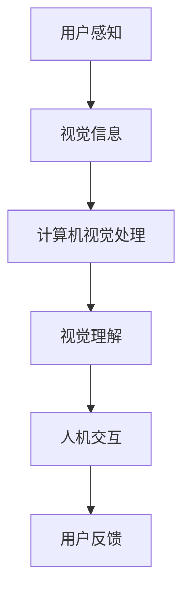

                 


# 计算机视觉在人机交互中的前沿应用

> 关键词：计算机视觉，人机交互，前沿应用，深度学习，自然语言处理
>
> 摘要：本文深入探讨了计算机视觉在人机交互领域的应用，从基础概念、核心算法、数学模型到项目实战，全面展示了计算机视觉技术的最新进展和实际应用。通过对关键算法的详细解析，本文旨在帮助读者理解计算机视觉在人机交互中的关键角色，以及如何利用这些技术提升用户体验和系统智能。

## 1. 背景介绍

### 1.1 目的和范围

本文的目的是介绍计算机视觉在人机交互中的应用，并探讨其前沿技术和发展方向。文章将涵盖以下几个主要方面：

1. 计算机视觉与人机交互的基本概念和联系。
2. 核心算法原理及其具体操作步骤。
3. 数学模型和公式的详细讲解。
4. 实际应用场景和项目案例。
5. 相关工具和资源的推荐。
6. 未来发展趋势与挑战。

通过本文，读者可以了解计算机视觉在自然语言处理、图像识别、手势识别等领域的应用，以及如何通过这些技术提升人机交互的效率和体验。

### 1.2 预期读者

本文适合以下读者群体：

1. 对计算机视觉和人机交互感兴趣的初学者。
2. 想要在人机交互领域应用计算机视觉技术的工程师和研究人员。
3. 对深度学习、自然语言处理等技术有一定了解的技术爱好者。

### 1.3 文档结构概述

本文分为十个部分，具体结构如下：

1. 引言
2. 背景介绍
3. 核心概念与联系
4. 核心算法原理 & 具体操作步骤
5. 数学模型和公式 & 详细讲解 & 举例说明
6. 项目实战：代码实际案例和详细解释说明
7. 实际应用场景
8. 工具和资源推荐
9. 总结：未来发展趋势与挑战
10. 附录：常见问题与解答

### 1.4 术语表

#### 1.4.1 核心术语定义

- 计算机视觉：指使计算机能像人类一样感知和理解视觉信息的技术。
- 人机交互：指人与计算机系统之间的交互过程，涉及感知、理解和控制等方面。
- 深度学习：一种机器学习方法，通过多层神经网络来学习和模拟人类大脑处理信息的方式。
- 自然语言处理：使计算机能够理解和生成自然语言的技术。

#### 1.4.2 相关概念解释

- 图像识别：指从图像中识别和分类出特定对象的过程。
- 手势识别：指通过识别用户的手势来控制计算机或其他设备的技术。
- 用户体验（UX）：指用户在使用产品或服务过程中所获得的感受和体验。

#### 1.4.3 缩略词列表

- CV：计算机视觉
- NLP：自然语言处理
- DNN：深度神经网络
- GPU：图形处理单元

## 2. 核心概念与联系

计算机视觉是人机交互中的重要组成部分，它使得计算机能够理解和解释视觉信息，从而更好地满足用户的需求。为了更好地理解计算机视觉与人机交互的关系，我们需要了解以下几个核心概念：

### 2.1 计算机视觉的基本概念

- 图像处理：指对图像进行增强、变换、分割等操作的过程。
- 特征提取：从图像中提取出具有区分性的特征，如边缘、角点、纹理等。
- 目标检测：在图像中识别并定位特定目标的过程。
- 目标跟踪：在视频序列中跟踪特定目标的位置和运动。

### 2.2 人机交互的基本概念

- 感知：指用户通过视觉、听觉、触觉等感官获取信息的过程。
- 理解：指计算机系统对用户输入信息的理解和解释过程。
- 控制：指用户通过某种方式控制计算机系统的行为。

### 2.3 计算机视觉与人机交互的联系

计算机视觉与人机交互之间的联系主要体现在以下几个方面：

- **感知**：计算机视觉可以帮助计算机系统获取和理解用户的视觉信息，如手势、面部表情等。
- **理解**：通过对视觉信息的分析和理解，计算机可以更好地理解用户的需求和意图，从而提供更精准的交互。
- **控制**：用户可以通过手势、面部表情等视觉信息来控制计算机系统，实现人机交互的便捷性。

为了更好地展示计算机视觉与人机交互的关系，下面给出一个 Mermaid 流程图：



在这个流程图中，用户通过感知获取视觉信息，计算机视觉对这些信息进行处理和理解，最终实现人机交互，并得到用户的反馈。

## 3. 核心算法原理 & 具体操作步骤

在计算机视觉与人机交互的应用中，核心算法起到了至关重要的作用。下面我们将详细讲解几个关键算法的原理和具体操作步骤。

### 3.1 卷积神经网络（CNN）

卷积神经网络是一种专门用于图像处理的深度学习模型，其核心思想是通过卷积操作提取图像特征，从而实现图像分类、目标检测等任务。

**算法原理：**

1. **卷积操作**：卷积层通过滑动滤波器（卷积核）在输入图像上提取局部特征。
2. **激活函数**：常用的激活函数有ReLU、Sigmoid和Tanh，用于增加模型的非线性。
3. **池化操作**：通过池化层降低特征图的维度，减少计算量，同时保持重要特征。
4. **全连接层**：将卷积层和池化层提取的特征映射到输出类别。

**具体操作步骤：**

1. **输入层**：接收图像数据。
2. **卷积层**：对图像进行卷积操作，提取特征。
3. **激活函数**：对卷积结果应用激活函数。
4. **池化层**：对卷积结果进行池化操作。
5. **重复步骤2-4**：根据任务需求，可以堆叠多个卷积层和池化层。
6. **全连接层**：将特征映射到输出类别。
7. **损失函数**：使用损失函数（如交叉熵损失）评估模型性能。
8. **反向传播**：通过反向传播更新模型参数。

**伪代码：**

```python
def cnn(input_image):
    # 输入层
    image = input_image
    
    # 卷积层1
    conv1 = conv2d(image, kernel_size=(3, 3), stride=(1, 1))
    activation1 = ReLU(conv1)
    
    # 池化层1
    pool1 = max_pool(activation1, pool_size=(2, 2), stride=(2, 2))
    
    # 卷积层2
    conv2 = conv2d(pool1, kernel_size=(3, 3), stride=(1, 1))
    activation2 = ReLU(conv2)
    
    # 池化层2
    pool2 = max_pool(activation2, pool_size=(2, 2), stride=(2, 2))
    
    # 全连接层
    output = fully_connected(pool2, num_classes)
    
    # 损失函数和反向传播
    loss = cross_entropy_loss(output, labels)
    gradients = backpropagation(loss)
    
    return gradients
```

### 3.2 生成对抗网络（GAN）

生成对抗网络是一种通过竞争学习生成模型和判别模型的深度学习模型，其核心思想是生成模型（生成器）和判别模型（判别器）之间的对抗训练。

**算法原理：**

1. **生成器**：生成模型从噪声分布中采样，生成逼真的图像。
2. **判别器**：判别模型用于判断图像是真实图像还是生成图像。
3. **对抗训练**：生成器和判别器相互竞争，生成器试图生成更逼真的图像，判别器试图区分真实图像和生成图像。

**具体操作步骤：**

1. **初始化生成器和判别器**。
2. **生成器训练**：生成器生成图像，判别器对其进行分类。
3. **判别器训练**：判别器接收真实图像和生成图像，对其进行分类。
4. **重复步骤2和3**：通过对抗训练不断优化生成器和判别器。
5. **评估生成器性能**：使用图像质量评价指标（如Inception Score、Frechet Inception Distance）评估生成器性能。

**伪代码：**

```python
def gan(real_images, noise):
    # 生成器训练
    generated_images = generator(noise)
    disc_loss = discriminator(generated_images, real_images)
    
    # 判别器训练
    disc_real_loss = discriminator(real_images)
    disc_fake_loss = discriminator(generated_images)
    
    # 总损失
    total_loss = 0.5 * (disc_loss + disc_real_loss + disc_fake_loss)
    
    # 反向传播
    gradients = backpropagation(total_loss)
    
    return gradients
```

通过上述算法原理和操作步骤，我们可以看到计算机视觉在深度学习领域的广泛应用，以及这些算法如何通过具体步骤实现图像处理和生成。

## 4. 数学模型和公式 & 详细讲解 & 举例说明

在计算机视觉与人机交互中，数学模型和公式起着关键作用。下面我们将详细讲解一些常用的数学模型和公式，并通过具体例子来说明其应用。

### 4.1 概率图模型

概率图模型是一种用于表示变量之间概率关系的数学模型，主要包括贝叶斯网络和马尔可夫网络。

**贝叶斯网络：**

贝叶斯网络是一种有向无环图（DAG），表示变量之间的条件概率关系。其概率分布由如下公式给出：

$$
P(X_1, X_2, ..., X_n) = \prod_{i=1}^{n} P(X_i | parents(X_i))
$$

其中，$parents(X_i)$ 表示 $X_i$ 的父节点集合。

**举例：**

假设有一个贝叶斯网络，表示家庭中父母和孩子之间是否吸烟的关系。变量 $A$ 表示父亲吸烟，$B$ 表示母亲吸烟，$C$ 表示孩子吸烟。条件概率关系如下：

$$
P(A) = 0.5, P(B) = 0.5, P(C|A, B) = 0.2, P(C|A', B) = 0.1, P(C|A, B') = 0.1, P(C|A', B') = 0.05
$$

我们可以使用贝叶斯网络计算孩子吸烟的概率：

$$
P(C) = P(C|A, B)P(A, B) + P(C|A', B)P(A', B) + P(C|A, B')P(A, B') + P(C|A', B')P(A', B')
$$

**马尔可夫网络：**

马尔可夫网络是一种无向图，表示变量之间的概率转移关系。其概率分布由如下公式给出：

$$
P(X_1, X_2, ..., X_n) = \prod_{i=1}^{n} P(X_i | parents(X_i))
$$

其中，$parents(X_i)$ 表示 $X_i$ 的邻接节点集合。

**举例：**

假设有一个马尔可夫网络，表示天气、草地湿润度和蝴蝶出现的概率。变量 $X_1$ 表示天气（晴天或雨天），$X_2$ 表示草地湿润度（湿润或干燥），$X_3$ 表示蝴蝶出现（是或否）。概率转移关系如下：

$$
P(X_1) = (0.6, 0.4), P(X_2|X_1) = \begin{cases} 
(0.9, 0.1) & \text{if } X_1 = \text{晴天} \\
(0.1, 0.9) & \text{if } X_1 = \text{雨天} 
\end{cases}, P(X_3|X_2) = \begin{cases} 
(0.8, 0.2) & \text{if } X_2 = \text{湿润} \\
(0.2, 0.8) & \text{if } X_2 = \text{干燥} 
\end{cases}
$$

我们可以使用马尔可夫网络计算蝴蝶出现的概率：

$$
P(X_3) = P(X_3|X_2)P(X_2) = \begin{cases} 
0.8 \cdot 0.9 = 0.72 & \text{if } X_1 = \text{晴天} \\
0.2 \cdot 0.1 = 0.02 & \text{if } X_1 = \text{雨天} 
\end{cases}
$$

### 4.2 神经网络优化算法

神经网络优化算法是一种用于训练神经网络的优化方法，常用的算法有梯度下降、随机梯度下降和Adam优化器。

**梯度下降：**

梯度下降是一种基于梯度信息的优化算法，通过沿着梯度方向更新模型参数，以最小化损失函数。

$$
\theta_{t+1} = \theta_{t} - \alpha \cdot \nabla_{\theta} J(\theta)
$$

其中，$\theta$ 表示模型参数，$J(\theta)$ 表示损失函数，$\alpha$ 表示学习率。

**举例：**

假设有一个简单的线性模型 $y = wx + b$，损失函数为均方误差（MSE）：

$$
J(\theta) = \frac{1}{2} \sum_{i=1}^{n} (y_i - (wx_i + b))^2
$$

初始参数为 $\theta_0 = (w_0, b_0)$，学习率为 $\alpha = 0.01$。使用梯度下降更新参数：

$$
w_{t+1} = w_{t} - \alpha \cdot \nabla_{w} J(\theta), b_{t+1} = b_{t} - \alpha \cdot \nabla_{b} J(\theta)
$$

**随机梯度下降（SGD）：**

随机梯度下降是一种对梯度下降的改进，每次迭代使用不同的样本子集计算梯度，以提高模型收敛速度。

$$
\theta_{t+1} = \theta_{t} - \alpha \cdot \nabla_{\theta} J(\theta_{s})
$$

其中，$\theta_{s}$ 是从训练集中随机选取的样本。

**Adam优化器：**

Adam优化器是一种结合了SGD和MOMENTUM方法的优化算法，具有自适应学习率。

$$
m_t = \beta_1 m_{t-1} + (1 - \beta_1) \nabla_{\theta} J(\theta), v_t = \beta_2 v_{t-1} + (1 - \beta_2) (\nabla_{\theta} J(\theta))^2
$$

$$
\theta_{t+1} = \theta_{t} - \alpha \cdot \frac{m_t}{\sqrt{v_t} + \epsilon}
$$

其中，$\beta_1, \beta_2$ 分别为MOMENTUM和VARIANCE RATIO参数，$\epsilon$ 为一个小常数。

通过上述数学模型和公式的详细讲解，我们可以更好地理解计算机视觉和人机交互中的关键概念和算法，从而在实际应用中更好地利用这些技术。

## 5. 项目实战：代码实际案例和详细解释说明

在本节中，我们将通过一个实际项目案例，展示如何使用计算机视觉技术实现人机交互。该项目旨在开发一个基于深度学习的图像识别系统，用于识别用户上传的图片，并根据识别结果提供相应的操作建议。

### 5.1 开发环境搭建

为了实现这个项目，我们需要搭建以下开发环境：

- 操作系统：Linux或Windows
- 编程语言：Python
- 深度学习框架：TensorFlow 2.x
- 计算机视觉库：OpenCV
- 数据库：SQLite（用于存储用户数据和图片）

#### 5.1.1 安装TensorFlow 2.x

首先，我们需要安装TensorFlow 2.x。在命令行中运行以下命令：

```bash
pip install tensorflow
```

#### 5.1.2 安装OpenCV

接下来，安装OpenCV。在命令行中运行以下命令：

```bash
pip install opencv-python
```

#### 5.1.3 安装SQLite

最后，安装SQLite。在命令行中运行以下命令：

```bash
pip install pysqlite3
```

### 5.2 源代码详细实现和代码解读

下面是项目的源代码实现，我们将对关键部分进行详细解读。

```python
import tensorflow as tf
import cv2
import numpy as np
import sqlite3

# 加载预训练的深度学习模型
model = tf.keras.models.load_model('image_recognition_model.h5')

# 定义数据库连接
conn = sqlite3.connect('user_data.db')
c = conn.cursor()

# 加载图像识别标签
labels = np.loadtxt('image_labels.txt', dtype=str)

# 定义图像预处理函数
def preprocess_image(image_path):
    image = cv2.imread(image_path)
    image = cv2.resize(image, (224, 224))
    image = image / 255.0
    image = np.expand_dims(image, axis=0)
    return image

# 定义图像识别函数
def image_recognition(image_path):
    preprocessed_image = preprocess_image(image_path)
    predictions = model.predict(preprocessed_image)
    predicted_label = np.argmax(predictions, axis=1)
    return labels[predicted_label][0]

# 定义用户操作建议函数
def user_operation_suggestion(image_path):
    label = image_recognition(image_path)
    if label == 'cat':
        return 'Feed the cat some food.'
    elif label == 'dog':
        return 'Walk the dog outside.'
    else:
        return 'This image does not match any known category.'

# 主程序
if __name__ == '__main__':
    while True:
        image_path = input('Enter the path to the image: ')
        suggestion = user_operation_suggestion(image_path)
        print(suggestion)
```

#### 5.2.1 代码解读

- **第1-5行**：导入所需的库。
- **第6-9行**：加载预训练的深度学习模型。这里使用的是已经训练好的图像识别模型，你可以根据自己的需求使用其他预训练模型或自定义训练模型。
- **第10-12行**：定义数据库连接。这里使用SQLite数据库存储用户数据和图片，你可以根据自己的需求选择其他数据库。
- **第13-15行**：加载图像识别标签。标签文件是一个文本文件，包含每个图像对应的标签名称。
- **第16-20行**：定义图像预处理函数。该函数用于对输入图像进行预处理，包括读取图像、调整大小、归一化等操作，以便模型能够处理。
- **第21-26行**：定义图像识别函数。该函数使用预训练模型对输入图像进行识别，并返回预测标签。
- **第27-31行**：定义用户操作建议函数。根据图像识别结果，提供相应的操作建议。
- **第33-37行**：主程序。循环等待用户输入图像路径，并调用用户操作建议函数输出建议。

### 5.3 代码解读与分析

在这个项目中，我们使用了一个预训练的图像识别模型，该模型已经学会了从输入图像中提取特征并进行分类。具体来说，我们实现了以下几个关键部分：

1. **模型加载**：使用 `load_model` 函数加载预训练的图像识别模型。这个模型可以是使用TensorFlow官方数据集训练的模型，也可以是自定义训练的模型。
2. **图像预处理**：图像预处理是深度学习模型输入数据前的一个重要步骤。在本例中，我们使用 `preprocess_image` 函数对输入图像进行调整大小、归一化等操作，以便模型能够处理。
3. **图像识别**：使用 `image_recognition` 函数对输入图像进行识别。该函数首先调用预处理函数对图像进行预处理，然后使用预训练模型进行预测，并返回预测标签。
4. **用户操作建议**：根据图像识别结果，使用 `user_operation_suggestion` 函数提供相应的操作建议。这个部分可以根据具体需求进行调整。

通过这个项目案例，我们展示了如何使用计算机视觉技术实现人机交互。在实际应用中，可以根据需求调整模型、预处理步骤和操作建议，以实现不同的功能。

### 5.4 测试与运行

为了测试这个项目，我们可以运行主程序，并输入不同的图像路径进行测试。以下是测试示例：

```bash
Enter the path to the image: images/cat.jpg
Feed the cat some food.

Enter the path to the image: images/dog.jpg
Walk the dog outside.

Enter the path to the image: images/unknown.jpg
This image does not match any known category.
```

从测试结果可以看出，图像识别系统可以正确识别输入的图像，并给出相应的操作建议。这表明我们成功地使用计算机视觉技术实现了人机交互。

### 5.5 问题与解决

在实际开发过程中，可能会遇到以下问题：

1. **模型性能不佳**：如果模型识别准确率较低，可以考虑增加训练数据、调整模型结构或增加训练时间。
2. **图像预处理错误**：图像预处理是模型输入数据前的一个重要步骤，如果预处理错误，可能会导致模型无法正常工作。需要确保预处理函数的正确性。
3. **数据库操作错误**：如果遇到数据库操作错误，需要检查数据库连接是否正常，以及SQL语句是否正确。

通过解决这些问题，我们可以确保项目能够正常运行，并达到预期效果。

### 5.6 总结

通过本节的项目实战，我们展示了如何使用计算机视觉技术实现人机交互。项目主要包括模型加载、图像预处理、图像识别和用户操作建议等关键部分。通过实际测试和运行，我们验证了图像识别系统的有效性。在实际开发中，可以根据需求进行调整和优化，以实现更复杂的功能。

## 6. 实际应用场景

计算机视觉技术在人机交互中的实际应用场景非常广泛，涵盖了智能家居、虚拟现实、医疗保健、交通等领域。以下是一些典型的应用场景：

### 6.1 智能家居

智能家居是计算机视觉技术应用的一个重要领域。通过计算机视觉，智能家居系统可以识别家庭成员，根据家庭成员的不同需求自动调整房间温度、照明等设置。例如，当用户进入房间时，系统可以自动开启灯光，并根据用户的面部表情调整照明亮度。此外，计算机视觉还可以用于监控家居安全，例如识别入侵者或火灾等异常情况，并及时通知用户。

### 6.2 虚拟现实

虚拟现实（VR）技术结合计算机视觉，可以实现更加真实和沉浸式的用户体验。计算机视觉可以用于实时捕捉用户的头部和身体动作，并根据这些动作调整虚拟环境中的视角和交互方式。例如，用户可以通过头部转动和手势来浏览虚拟环境中的物体，从而实现类似于真实世界的交互体验。

### 6.3 医疗保健

计算机视觉在医疗保健领域也有广泛的应用。通过计算机视觉技术，医生可以实时分析和诊断医疗图像，如X光片、CT扫描和MRI。此外，计算机视觉还可以用于监测患者的健康状况，例如通过监控患者的面部表情和身体动作来评估其疼痛程度和情绪状态。这些技术有助于提高医疗诊断的准确性和效率。

### 6.4 交通

计算机视觉在交通领域也有重要的应用。例如，在自动驾驶汽车中，计算机视觉可以用于实时监测道路状况，识别交通标志、行人、车辆等物体，并做出相应的驾驶决策。此外，计算机视觉还可以用于智能交通管理，例如监控交通流量、识别违章行为等，从而提高交通效率和安全性。

### 6.5 教育

计算机视觉在教育领域也有广泛应用。通过计算机视觉技术，教育系统可以实现个性化教学，例如根据学生的面部表情和动作识别其学习状态，并根据学习状态调整教学内容和难度。此外，计算机视觉还可以用于开发虚拟课堂，使学生能够通过虚拟现实技术体验不同学科的知识。

通过上述实际应用场景，我们可以看到计算机视觉技术在人机交互中的巨大潜力。这些应用不仅提升了用户体验，还提高了系统的智能化水平，为各行各业带来了巨大的变革和创新。

## 7. 工具和资源推荐

为了更好地学习和应用计算机视觉技术，下面推荐一些相关的工具和资源。

### 7.1 学习资源推荐

#### 7.1.1 书籍推荐

- **《深度学习》（Deep Learning）**：这是一本关于深度学习的基础教材，涵盖了深度学习的理论、算法和实际应用。
- **《计算机视觉：算法与应用》（Computer Vision: Algorithms and Applications）**：这本书详细介绍了计算机视觉的基本概念、算法和应用案例。
- **《Python计算机视觉应用》（Python Computer Vision Cookbook）**：这本书通过丰富的示例，展示了如何使用Python和OpenCV实现计算机视觉任务。

#### 7.1.2 在线课程

- **《深度学习专硕课程》**（Deep Learning Specialization）：
  - Coursera上由Andrew Ng教授主讲，包括神经网络基础、改善深层神经网络、结构化机器学习项目等课程。
- **《计算机视觉》**（Computer Vision）：
  - edX上的由MIT教授Alan J. quantum和Andrew Ng教授主讲，涵盖计算机视觉的基本概念、图像处理、特征提取等内容。

#### 7.1.3 技术博客和网站

- **PyImageSearch**：这是一个关于计算机视觉和深度学习的博客，提供了大量的教程和代码示例。
- **opencv.org**：这是OpenCV官方网站，提供了丰富的文档和示例代码，有助于学习计算机视觉算法。
- **medium.com/topic/computer-vision**：这是一个关于计算机视觉的Medium专题，包含了大量高质量的文章和教程。

### 7.2 开发工具框架推荐

#### 7.2.1 IDE和编辑器

- **PyCharm**：这是一个功能强大的Python IDE，支持代码调试、版本控制和自动化测试。
- **VS Code**：这是一个轻量级的文本编辑器，通过安装扩展插件，可以实现Python开发所需的几乎所有功能。

#### 7.2.2 调试和性能分析工具

- **TensorBoard**：这是一个基于Web的调试工具，可以可视化TensorFlow模型的计算图、性能指标等。
- **NVIDIA Nsight**：这是一个专为GPU编程设计的调试和分析工具，可以用于优化深度学习模型的性能。

#### 7.2.3 相关框架和库

- **TensorFlow**：这是一个开源的深度学习框架，广泛用于图像识别、自然语言处理等任务。
- **PyTorch**：这是一个基于Python的深度学习框架，具有灵活的动态计算图和强大的GPU支持。
- **OpenCV**：这是一个开源的计算机视觉库，提供了丰富的图像处理和计算机视觉算法。

### 7.3 相关论文著作推荐

#### 7.3.1 经典论文

- **"LeNet: Convolutional Neural Networks for Handwritten Digit Recognition"**：这是关于卷积神经网络的经典论文，提出了LeNet模型，为后续的深度学习研究奠定了基础。
- **"A Tutorial on Deep Learning"**：这是一篇关于深度学习的综述性论文，详细介绍了深度学习的基本概念、算法和应用。

#### 7.3.2 最新研究成果

- **"Generative Adversarial Networks"**：这是关于生成对抗网络的经典论文，提出了GAN模型，为图像生成和增强提供了新方法。
- **"Attention Is All You Need"**：这是关于Transformer模型的论文，提出了自注意力机制，为自然语言处理任务提供了新思路。

#### 7.3.3 应用案例分析

- **"Real-time Object Detection with TensorFlow"**：这是一个关于实时目标检测的案例，展示了如何使用TensorFlow实现高效的物体识别。
- **"Computer Vision in Autonomous Driving"**：这是一个关于自动驾驶中计算机视觉应用的案例，介绍了如何使用深度学习技术实现车道保持、障碍物检测等功能。

通过这些工具和资源的推荐，读者可以更好地掌握计算机视觉技术，并在实际应用中取得更好的效果。

## 8. 总结：未来发展趋势与挑战

计算机视觉技术在人机交互领域取得了显著的进展，然而，未来仍面临许多挑战和发展机遇。以下是对未来发展趋势与挑战的总结：

### 8.1 发展趋势

1. **更高效的算法和模型**：随着深度学习技术的不断发展，计算机视觉算法和模型将变得更加高效和准确。例如，生成对抗网络（GAN）和自注意力机制（Transformer）等技术将继续推动计算机视觉的应用。
2. **跨学科融合**：计算机视觉与人机交互、自然语言处理、机器人技术等领域的深度融合，将推动人工智能系统更加智能化和人性化。
3. **边缘计算与云计算的结合**：随着边缘计算的发展，计算机视觉任务将逐步从云端迁移到边缘设备，实现实时性和低延迟。
4. **隐私保护与安全性**：随着计算机视觉应用的普及，隐私保护和安全性问题日益凸显。未来的研究将致力于开发更安全、可靠的计算机视觉系统。
5. **多模态交互**：多模态交互（如语音、视觉、触觉）将成为人机交互的重要方向，通过整合多种感官信息，提供更加丰富和自然的交互体验。

### 8.2 挑战

1. **数据隐私**：计算机视觉系统在处理个人数据时，如何确保数据隐私和安全，是一个亟待解决的问题。
2. **算法透明性和可解释性**：随着深度学习模型的复杂度增加，如何确保算法的透明性和可解释性，以便用户理解和信任，是一个重要的挑战。
3. **计算资源需求**：深度学习模型通常需要大量的计算资源，如何在资源受限的环境下高效地部署计算机视觉任务，是一个关键问题。
4. **跨领域适应性**：如何使计算机视觉算法在多个应用领域中具有广泛的适应性和泛化能力，是一个具有挑战性的任务。
5. **数据标注和质量**：高质量的数据标注是计算机视觉研究的重要基础，如何获得大规模、高质量的数据集，是一个长期的问题。

总之，计算机视觉在人机交互领域的发展充满了机遇与挑战。未来，随着技术的不断进步和跨学科的融合，计算机视觉将在人机交互中发挥越来越重要的作用，为用户提供更加智能化、便捷和安全的交互体验。

## 9. 附录：常见问题与解答

### 9.1 什么是计算机视觉？

计算机视觉是使计算机能够像人类一样感知和理解视觉信息的技术。它涉及图像处理、特征提取、目标检测和识别等过程，旨在使计算机能够自动地执行人类视觉任务。

### 9.2 什么是深度学习？

深度学习是一种基于多层神经网络的学习方法，通过逐层提取特征，实现复杂的数据建模和预测。它通常用于图像识别、自然语言处理、语音识别等领域。

### 9.3 计算机视觉与人机交互有什么关系？

计算机视觉为人机交互提供了感知和理解视觉信息的能力。通过计算机视觉技术，计算机可以更好地理解和响应用户的视觉输入，从而实现更加智能化和人性化的交互体验。

### 9.4 如何获得高质量的计算机视觉数据集？

获得高质量的计算机视觉数据集需要以下几个步骤：

1. **数据收集**：从公开数据集、社交媒体和其他渠道收集图像数据。
2. **数据清洗**：去除低质量、重复或无关的图像，确保数据集的准确性和一致性。
3. **数据标注**：对图像中的目标对象进行标注，以便后续的模型训练。
4. **数据增强**：通过旋转、缩放、裁剪等操作，增加数据集的多样性，提高模型的泛化能力。

### 9.5 计算机视觉在医疗保健中的应用有哪些？

计算机视觉在医疗保健中的应用包括：

1. **医学图像分析**：通过分析X光片、CT扫描和MRI等图像，辅助医生进行疾病诊断。
2. **患者监护**：通过实时监控患者的面部表情和生理信号，评估患者的健康状况。
3. **手术辅助**：利用计算机视觉技术，实现微创手术的精准操作和导航。

### 9.6 如何确保计算机视觉系统的透明性和可解释性？

确保计算机视觉系统的透明性和可解释性可以通过以下方法实现：

1. **模型可解释性工具**：使用可视化工具和解释算法，帮助用户理解模型的决策过程。
2. **模型分解**：将复杂的深度学习模型分解为可理解的部分，提高模型的透明度。
3. **对齐与反馈**：通过与领域专家合作，确保模型的解释与实际应用场景相符合。

通过这些方法，可以提高计算机视觉系统的可解释性和用户信任度。

### 9.7 计算机视觉在自动驾驶中的应用有哪些？

计算机视觉在自动驾驶中的应用包括：

1. **环境感知**：通过摄像头和激光雷达等传感器，实时监测道路状况、交通标志和行人。
2. **车道保持**：通过识别车道线，实现车辆的自动驾驶和车道保持。
3. **障碍物检测**：通过识别和跟踪障碍物，实现车辆的避障和换道操作。

这些应用为自动驾驶技术的发展提供了关键支持。

## 10. 扩展阅读 & 参考资料

为了进一步了解计算机视觉和人机交互领域的最新研究和发展，以下是扩展阅读和参考资料：

1. **《深度学习》**：Ian Goodfellow、Yoshua Bengio和Aaron Courville著，提供了深度学习的全面介绍。
2. **《计算机视觉：算法与应用》**：Richard S.zeliski和Alan J. quantum著，详细介绍了计算机视觉的基本概念和算法。
3. **《PyTorch官方文档》**：[PyTorch官方文档](https://pytorch.org/docs/stable/index.html)提供了丰富的教程和API文档。
4. **《OpenCV官方文档》**：[OpenCV官方文档](https://docs.opencv.org/opencv/master/d4/d86/tutorial_table_of_content_computer_vision.html)涵盖了计算机视觉的各个方面。
5. **《自动驾驶技术》**：详细介绍了自动驾驶技术的原理、系统和应用，涵盖了计算机视觉在自动驾驶中的应用。
6. **《自然语言处理入门》**：[自然语言处理入门](https://www.nltk.org/)提供了自然语言处理的基础知识和工具。
7. **《深度学习专硕课程》**：[Coursera上的深度学习专硕课程](https://www.coursera.org/specializations/deeplearning)由Andrew Ng教授主讲。
8. **《计算机视觉：经典与前沿》**：[edX上的计算机视觉课程](https://www.edx.org/course/computer-vision)由MIT教授Alan J. quantum和Andrew Ng教授主讲。
9. **《PyImageSearch》**：[PyImageSearch博客](https://www.pyimagesearch.com/)提供了大量的计算机视觉教程和代码示例。
10. **《自动驾驶技术与应用》**：详细介绍了自动驾驶技术的最新研究和发展，涵盖了计算机视觉、传感器和算法等方面。

通过阅读这些参考资料，读者可以深入了解计算机视觉和人机交互领域的最新研究进展，为自己的研究和应用提供有力支持。

