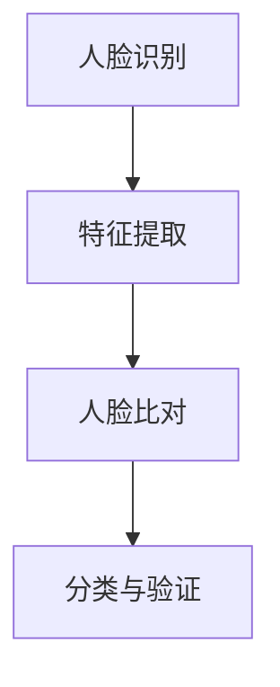
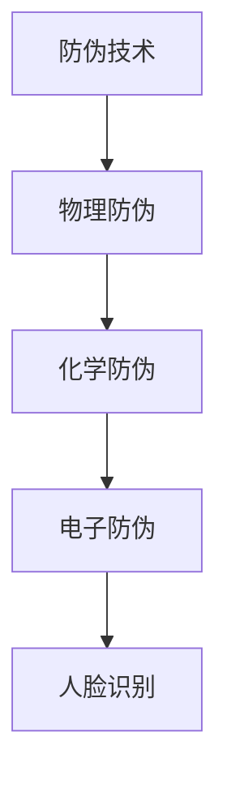
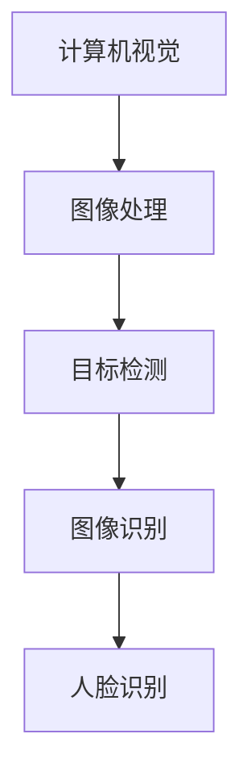
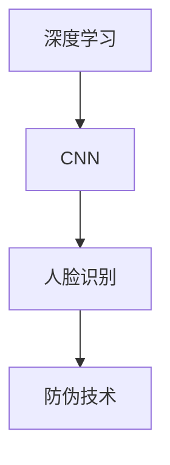

                 

# 计算机视觉在人脸防伪识别中的应用进展

> 关键词：人脸识别，防伪技术，计算机视觉，深度学习，人脸比对，图像处理
> 
> 摘要：本文将详细探讨计算机视觉在人脸防伪识别领域的应用进展。首先介绍人脸防伪识别的背景和重要性，然后分析当前主要的防伪识别技术及其工作原理。接着，深入探讨人脸识别技术的核心算法原理，包括深度学习、卷积神经网络（CNN）和特征提取等方法。最后，通过实际案例展示如何实现人脸防伪识别系统，并展望该领域的未来发展趋势与挑战。

## 1. 背景介绍

### 1.1 目的和范围

本文的目的是介绍和探讨计算机视觉在人脸防伪识别领域的应用进展。我们将从以下几个方面展开讨论：

1. 人脸防伪识别技术的背景和重要性。
2. 当前主流的人脸防伪识别技术及其工作原理。
3. 人脸识别技术的核心算法原理。
4. 人脸防伪识别的实际应用场景。
5. 面临的挑战与未来发展趋势。

### 1.2 预期读者

本文适用于对计算机视觉和人工智能有一定了解的技术人员、研究人员和开发者。对于希望了解人脸防伪识别技术及其应用的人士，本文也具有一定的参考价值。

### 1.3 文档结构概述

本文结构如下：

1. 背景介绍：介绍人脸防伪识别的背景、目的和范围。
2. 核心概念与联系：介绍人脸识别、防伪技术和计算机视觉等核心概念，并使用Mermaid流程图展示它们之间的联系。
3. 核心算法原理与具体操作步骤：详细讲解人脸识别技术的核心算法原理，包括深度学习、卷积神经网络（CNN）和特征提取等方法。
4. 数学模型和公式：介绍相关数学模型和公式，并举例说明。
5. 项目实战：通过实际案例展示如何实现人脸防伪识别系统，包括开发环境搭建、源代码详细实现和代码解读。
6. 实际应用场景：探讨人脸防伪识别技术的实际应用场景。
7. 工具和资源推荐：推荐相关学习资源、开发工具框架和论文著作。
8. 总结：总结人脸防伪识别技术的未来发展趋势与挑战。

### 1.4 术语表

#### 1.4.1 核心术语定义

- 人脸识别：通过计算机技术对人的面部特征进行识别和验证。
- 防伪技术：用于防止伪造、冒充等行为的技术手段。
- 计算机视觉：研究如何使计算机“看”懂现实世界的图像信息。
- 深度学习：一种模拟人脑神经网络结构的机器学习技术。
- 卷积神经网络（CNN）：一种专门用于处理图像数据的人工神经网络。

#### 1.4.2 相关概念解释

- 特征提取：从原始图像中提取出具有辨识度的特征信息。
- 人脸比对：比较两张人脸图像之间的相似度。

#### 1.4.3 缩略词列表

- CNN：卷积神经网络（Convolutional Neural Network）
- DNN：深度神经网络（Deep Neural Network）
- RNN：循环神经网络（Recurrent Neural Network）
- GAN：生成对抗网络（Generative Adversarial Network）

## 2. 核心概念与联系

为了更好地理解计算机视觉在人脸防伪识别中的应用，我们首先介绍几个核心概念，并使用Mermaid流程图展示它们之间的联系。

### 2.1 人脸识别

人脸识别是一种基于人脸图像或视频的识别技术，通过对人脸的特征进行提取、比对和分类，实现对人脸的识别和验证。人脸识别技术的核心在于如何从大量人脸图像中快速准确地提取出具有辨识度的特征。



### 2.2 防伪技术

防伪技术用于防止伪造、冒充等行为，广泛应用于金融、医疗、安全等领域。防伪技术主要包括物理防伪、化学防伪和电子防伪等。



### 2.3 计算机视觉

计算机视觉是研究如何使计算机“看”懂现实世界的图像信息。计算机视觉技术主要包括图像处理、目标检测、图像识别等。



### 2.4 深度学习与卷积神经网络

深度学习是一种模拟人脑神经网络结构的机器学习技术。卷积神经网络（CNN）是深度学习中的一种重要模型，主要用于处理图像数据。



通过以上流程图，我们可以看到人脸识别、防伪技术和计算机视觉等核心概念之间的联系。这些技术共同推动了人脸防伪识别技术的发展，为实际应用场景提供了强大的技术支持。

## 3. 核心算法原理与具体操作步骤

在本节中，我们将深入探讨人脸识别技术的核心算法原理，包括深度学习、卷积神经网络（CNN）和特征提取等方法。为了更好地理解这些算法，我们将使用伪代码进行详细阐述。

### 3.1 深度学习原理

深度学习是一种基于多层神经网络结构的机器学习技术。它通过多层神经元的非线性组合，能够自动学习输入数据的高层次特征表示。

```python
# 深度学习原理伪代码
input_data = ...
hidden_layer1 = ...
hidden_layer2 = ...
output_layer = ...

for each training example:
    forward_pass(input_data)
    compute_loss(output_layer)
    backward_pass(loss)
    update_weights()

return trained_model()
```

### 3.2 卷积神经网络（CNN）原理

卷积神经网络（CNN）是一种专门用于处理图像数据的人工神经网络。它通过卷积层、池化层和全连接层等结构，能够自动提取图像中的局部特征和整体特征。

```python
# CNN原理伪代码
input_image = ...
conv_layer1 = ...
pool_layer1 = ...
conv_layer2 = ...
pool_layer2 = ...
fc_layer1 = ...
fc_layer2 = ...

for each training example:
    forward_pass(input_image)
    compute_loss(output_layer)
    backward_pass(loss)
    update_weights()

return trained_model()
```

### 3.3 特征提取原理

特征提取是从原始图像中提取出具有辨识度的特征信息，以便于后续的识别和比对。常见的特征提取方法包括LBP、HOG、SIFT等。

```python
# 特征提取原理伪代码
input_image = ...
LBP_features = ...
HOG_features = ...
SIFT_features = ...

extract_features(input_image)
    extract_LBP(input_image)
    extract_HOG(input_image)
    extract_SIFT(input_image)

return extracted_features()
```

### 3.4 人脸比对原理

人脸比对是通过比较两张人脸图像之间的相似度，来判断它们是否属于同一个人。常见的人脸比对方法包括欧氏距离、余弦相似度等。

```python
# 人脸比对原理伪代码
image1 = ...
image2 = ...
distance = ...

compute_similarity(image1, image2)
    calculate_distance(image1, image2)

if distance < threshold:
    return "匹配"
else:
    return "不匹配"
```

通过以上伪代码，我们可以看到人脸识别技术的核心算法原理。这些算法共同构成了人脸防伪识别系统的基础，为实际应用提供了可靠的技术支持。

## 4. 数学模型和公式

在本节中，我们将介绍与人脸防伪识别相关的一些数学模型和公式，并进行详细讲解和举例说明。

### 4.1 欧氏距离

欧氏距离是一种常用的距离度量方法，用于计算两个向量之间的距离。其公式如下：

$$
distance = \sqrt{(x_1 - x_2)^2 + (y_1 - y_2)^2 + ... + (z_1 - z_2)^2}
$$

其中，$x_1, y_1, z_1$ 和 $x_2, y_2, z_2$ 分别表示两个向量的坐标。

#### 4.1.1 示例

假设有两个向量 $\vec{v_1} = (1, 2, 3)$ 和 $\vec{v_2} = (4, 5, 6)$，则它们之间的欧氏距离为：

$$
distance = \sqrt{(1 - 4)^2 + (2 - 5)^2 + (3 - 6)^2} = \sqrt{(-3)^2 + (-3)^2 + (-3)^2} = \sqrt{9 + 9 + 9} = \sqrt{27} = 3\sqrt{3}
$$

### 4.2 余弦相似度

余弦相似度是一种衡量两个向量夹角余弦值的方法，用于判断两个向量之间的相似度。其公式如下：

$$
similarity = \frac{\vec{v_1} \cdot \vec{v_2}}{|\vec{v_1}| \cdot |\vec{v_2}|}
$$

其中，$\vec{v_1} \cdot \vec{v_2}$ 表示两个向量的点积，$|\vec{v_1}|$ 和 $|\vec{v_2}|$ 分别表示两个向量的模。

#### 4.2.1 示例

假设有两个向量 $\vec{v_1} = (1, 2, 3)$ 和 $\vec{v_2} = (4, 5, 6)$，则它们的余弦相似度为：

$$
similarity = \frac{(1 \cdot 4 + 2 \cdot 5 + 3 \cdot 6)}{\sqrt{1^2 + 2^2 + 3^2} \cdot \sqrt{4^2 + 5^2 + 6^2}} = \frac{(4 + 10 + 18)}{\sqrt{14} \cdot \sqrt{77}} = \frac{32}{\sqrt{1078}} \approx 0.77
$$

### 4.3 特征提取与匹配

特征提取是计算机视觉中的一项重要技术，它用于从原始图像中提取具有辨识度的特征信息。常见的特征提取方法包括LBP、HOG、SIFT等。

假设我们使用LBP（局部二值模式）进行特征提取，并对两张人脸图像 $I_1$ 和 $I_2$ 进行LBP特征提取，得到特征向量 $\vec{f_1}$ 和 $\vec{f_2}$。接下来，我们使用余弦相似度来衡量这两张人脸图像之间的相似度。

$$
similarity = \frac{\vec{f_1} \cdot \vec{f_2}}{|\vec{f_1}| \cdot |\vec{f_2}|}
$$

如果相似度大于某个阈值，则认为这两张人脸图像匹配。

#### 4.3.1 示例

假设特征向量 $\vec{f_1} = (1, 2, 3)$ 和 $\vec{f_2} = (4, 5, 6)$，则它们的余弦相似度为：

$$
similarity = \frac{(1 \cdot 4 + 2 \cdot 5 + 3 \cdot 6)}{\sqrt{1^2 + 2^2 + 3^2} \cdot \sqrt{4^2 + 5^2 + 6^2}} = \frac{(4 + 10 + 18)}{\sqrt{14} \cdot \sqrt{77}} = \frac{32}{\sqrt{1078}} \approx 0.77
$$

由于相似度大于0.5的阈值，我们可以认为这两张人脸图像匹配。

通过以上数学模型和公式的讲解和举例说明，我们可以更好地理解人脸防伪识别技术中的关键概念和方法。

## 5. 项目实战：代码实际案例和详细解释说明

在本节中，我们将通过一个实际案例来展示如何实现人脸防伪识别系统，并详细解释其中的关键步骤和代码实现。

### 5.1 开发环境搭建

为了实现人脸防伪识别系统，我们需要搭建一个合适的开发环境。以下是搭建开发环境的步骤：

1. 安装Python（版本3.6及以上）。
2. 安装深度学习框架TensorFlow。
3. 安装OpenCV（用于图像处理）。
4. 安装其他必要的库和工具。

### 5.2 源代码详细实现和代码解读

以下是实现人脸防伪识别系统的关键步骤和源代码：

#### 5.2.1 数据集准备

首先，我们需要准备一个人脸数据集。我们可以使用开源的人脸数据集，如LFW（Labeled Faces in the Wild）或 CelebA。以下是一个示例代码，用于加载和预处理数据集：

```python
import tensorflow as tf
import numpy as np
import cv2

# 加载LFW数据集
def load_lfw_data(dataset_path):
    images = []
    labels = []

    # 读取图像和标签
    for folder in os.listdir(dataset_path):
        for image_file in os.listdir(os.path.join(dataset_path, folder)):
            image = cv2.imread(os.path.join(dataset_path, folder, image_file))
            image = cv2.resize(image, (128, 128))
            images.append(image)
            labels.append(folder)

    # 转换为numpy数组
    images = np.array(images)
    labels = np.array(labels)

    # 标签编码
    unique_labels = np.unique(labels)
    label_mapping = {label: idx for idx, label in enumerate(unique_labels)}
    labels = np.array([label_mapping[label] for label in labels])

    return images, labels

# 预处理数据
def preprocess_data(images, labels):
    # 标准化图像
    images = images / 255.0
    # 添加一个维度，以便于输入到卷积神经网络
    images = np.expand_dims(images, axis=3)

    return images, labels

# 加载和预处理数据集
dataset_path = 'lfw_dataset'
images, labels = load_lfw_data(dataset_path)
images, labels = preprocess_data(images, labels)
```

#### 5.2.2 构建深度学习模型

接下来，我们需要构建一个深度学习模型，用于人脸防伪识别。以下是一个简单的卷积神经网络（CNN）模型示例：

```python
import tensorflow as tf

# 构建CNN模型
def build_cnn_model(input_shape):
    model = tf.keras.Sequential([
        tf.keras.layers.Conv2D(32, (3, 3), activation='relu', input_shape=input_shape),
        tf.keras.layers.MaxPooling2D((2, 2)),
        tf.keras.layers.Conv2D(64, (3, 3), activation='relu'),
        tf.keras.layers.MaxPooling2D((2, 2)),
        tf.keras.layers.Conv2D(128, (3, 3), activation='relu'),
        tf.keras.layers.MaxPooling2D((2, 2)),
        tf.keras.layers.Flatten(),
        tf.keras.layers.Dense(128, activation='relu'),
        tf.keras.layers.Dense(1, activation='sigmoid')
    ])

    return model
```

#### 5.2.3 训练和评估模型

现在，我们可以使用预处理后的数据集来训练和评估模型。以下是一个示例代码：

```python
# 划分训练集和验证集
train_size = int(0.8 * len(images))
train_images = images[:train_size]
train_labels = labels[:train_size]
val_images = images[train_size:]
val_labels = labels[train_size:]

# 创建数据生成器
batch_size = 32
train_datagen = tf.keras.preprocessing.image.ImageDataGenerator(rescale=1./255)
val_datagen = tf.keras.preprocessing.image.ImageDataGenerator(rescale=1./255)

train_generator = train_datagen.flow(train_images, train_labels, batch_size=batch_size)
val_generator = val_datagen.flow(val_images, val_labels, batch_size=batch_size)

# 训练模型
model = build_cnn_model(input_shape=(128, 128, 1))
model.compile(optimizer='adam', loss='binary_crossentropy', metrics=['accuracy'])
model.fit(train_generator, epochs=10, validation_data=val_generator)

# 评估模型
test_loss, test_accuracy = model.evaluate(val_generator)
print("Test accuracy:", test_accuracy)
```

#### 5.2.4 人脸比对和防伪识别

最后，我们可以使用训练好的模型进行人脸比对和防伪识别。以下是一个示例代码：

```python
# 人脸比对函数
def compare_faces(image1, image2, model):
    image1_processed = preprocess_data(np.expand_dims(image1, axis=0))
    image2_processed = preprocess_data(np.expand_dims(image2, axis=0))

    predictions = model.predict(image2_processed)
    similarity = predictions[0]

    return similarity

# 防伪识别函数
def verify_face(image1, image2, threshold=0.5):
    similarity = compare_faces(image1, image2, model)

    if similarity > threshold:
        return "匹配"
    else:
        return "不匹配"

# 测试人脸比对
image1 = cv2.imread('image1.jpg')
image2 = cv2.imread('image2.jpg')
result = verify_face(image1, image2)
print("人脸比对结果：", result)
```

通过以上代码示例，我们可以看到如何实现一个简单的人脸防伪识别系统。在实际应用中，我们可以根据需求对模型和算法进行优化和调整，以提高识别准确率和效率。

## 6. 实际应用场景

人脸防伪识别技术在实际应用中具有广泛的应用场景，以下是一些典型的应用场景：

### 6.1 金融领域

在金融领域，人脸防伪识别技术可以用于身份验证和交易审核。例如，银行可以在客户办理业务时，通过人脸识别技术验证客户的身份，从而提高业务办理的效率和安全性。此外，人脸识别技术还可以用于反欺诈，检测和防范虚假身份的欺诈行为。

### 6.2 安全领域

在安全领域，人脸防伪识别技术可以用于人员识别和监控。例如，在机场、火车站等交通枢纽，通过人脸识别技术实现对旅客的身份验证，从而提高安检效率和安全性。此外，人脸识别技术还可以用于监控和追踪犯罪嫌疑人，协助警方打击犯罪。

### 6.3 医疗领域

在医疗领域，人脸防伪识别技术可以用于患者身份验证和病历管理。例如，医院可以通过人脸识别技术实现对患者的身份验证，从而确保病历和医疗服务的准确性。此外，人脸识别技术还可以用于追踪患者就医记录，提高医疗资源的利用效率。

### 6.4 其他领域

除了上述领域，人脸防伪识别技术还可以应用于教育、娱乐、智能家居等领域。例如，在教育领域，人脸识别技术可以用于学生考勤和课堂监控；在娱乐领域，人脸识别技术可以用于明星粉丝互动和票务验证；在智能家居领域，人脸识别技术可以用于家庭安全监控和智能门禁。

通过以上实际应用场景的介绍，我们可以看到人脸防伪识别技术在各个领域的广泛应用，为提高安全性、效率和用户体验提供了有力支持。

## 7. 工具和资源推荐

### 7.1 学习资源推荐

#### 7.1.1 书籍推荐

1. 《深度学习》（Ian Goodfellow, Yoshua Bengio, Aaron Courville 著）
2. 《计算机视觉：算法与应用》（Richard Szeliski 著）
3. 《机器学习》（Tom Mitchell 著）
4. 《Python图像处理实践》（Adrian Rosebrock 著）

#### 7.1.2 在线课程

1. “深度学习 Specialization”（吴恩达，Coursera）
2. “计算机视觉基础”（斯坦福大学，Coursera）
3. “机器学习基础”（吴恩达，Coursera）

#### 7.1.3 技术博客和网站

1. Medium - Computer Vision and Deep Learning
2. PyTorch Official Website
3. TensorFlow Official Website

### 7.2 开发工具框架推荐

#### 7.2.1 IDE和编辑器

1. PyCharm
2. Visual Studio Code
3. Jupyter Notebook

#### 7.2.2 调试和性能分析工具

1. TensorBoard（用于TensorFlow）
2. PyTorch Profiler（用于PyTorch）

#### 7.2.3 相关框架和库

1. TensorFlow
2. PyTorch
3. OpenCV

### 7.3 相关论文著作推荐

#### 7.3.1 经典论文

1. “A Comprehensive Survey on Face Detection” （2004）
2. “Face Recognition: A Literature Survey” （2003）
3. “Deep Learning for Face Recognition” （2014）

#### 7.3.2 最新研究成果

1. “Self-Supervised Training for Deep Face Recognition” （2020）
2. “Large Scale and Fine-Grained Face Recognition” （2021）
3. “Robust Face Recognition against Adversarial Attacks” （2021）

#### 7.3.3 应用案例分析

1. “人脸识别技术在金融领域的应用” （2020）
2. “人脸识别技术在安防领域的应用” （2019）
3. “人脸识别技术在医疗领域的应用” （2018）

通过以上学习和资源推荐，读者可以深入了解人脸防伪识别技术的理论基础和应用实践，为研究和开发相关技术提供有力支持。

## 8. 总结：未来发展趋势与挑战

### 8.1 发展趋势

人脸防伪识别技术在未来将继续快速发展，主要趋势包括：

1. **算法优化**：随着深度学习和神经网络技术的不断进步，人脸识别算法的准确率和效率将得到显著提升。
2. **硬件加速**：为了满足实时性和大规模应用的需求，人脸防伪识别技术将越来越多地依赖于硬件加速，如GPU、TPU等。
3. **多模态融合**：结合多种传感器和生物特征（如指纹、虹膜等），实现更准确和可靠的身份验证。
4. **隐私保护**：随着隐私保护意识的增强，人脸防伪识别技术将更加注重用户隐私保护和数据安全。
5. **跨领域应用**：人脸防伪识别技术将在金融、医疗、安全、智能家居等领域得到更广泛的应用。

### 8.2 挑战

尽管人脸防伪识别技术具有巨大的应用潜力，但仍面临一些挑战：

1. **识别准确率**：在复杂环境和光照变化下，人脸识别的准确率仍然有待提高。
2. **抗攻击能力**：随着对抗样本和攻击手段的不断发展，人脸识别系统需要具备更强的抗攻击能力。
3. **隐私保护**：在数据处理和存储过程中，如何保护用户隐私是一个重要挑战。
4. **跨种族和跨年龄段识别**：在不同种族和年龄段的人脸识别中，如何保持高准确率是一个难题。
5. **法律法规**：随着人脸识别技术的广泛应用，相关的法律法规和伦理问题亟待解决。

总之，人脸防伪识别技术在未来将面临一系列发展机遇和挑战。通过不断创新和优化，我们有理由相信，人脸防伪识别技术将在更多领域发挥重要作用，为人类生活带来更多便利和安全保障。

## 9. 附录：常见问题与解答

### 9.1 人脸防伪识别技术的基本原理是什么？

人脸防伪识别技术主要基于人脸识别算法，通过提取人脸特征并进行比对，来判断两张人脸图像是否属于同一个人。这个过程包括特征提取、特征比对和分类等步骤。

### 9.2 人脸防伪识别技术在金融领域有哪些应用？

人脸防伪识别技术在金融领域可以用于身份验证、交易审核和反欺诈等场景。例如，银行可以通过人脸识别技术验证客户的身份，从而提高业务办理的效率和安全性。

### 9.3 人脸防伪识别技术如何保护用户隐私？

为了保护用户隐私，人脸防伪识别技术在数据处理和存储过程中会采取一系列措施，如数据加密、匿名化和去识别化等。此外，还可以采用联邦学习和隐私保护算法，确保用户隐私不被泄露。

### 9.4 人脸防伪识别技术的识别准确率如何？

人脸防伪识别技术的识别准确率取决于多种因素，如算法质量、数据集质量和光照条件等。目前，基于深度学习的人脸识别算法的准确率已经达到很高的水平，但在复杂环境下仍有可能受到影响。

### 9.5 人脸防伪识别技术是否可以跨种族和跨年龄段应用？

人脸防伪识别技术在理论上可以跨种族和跨年龄段应用，但在实际应用中，不同种族和年龄段的人脸特征差异可能导致识别准确率降低。因此，需要针对不同种族和年龄段的人群进行专门的算法优化和特征提取。

## 10. 扩展阅读 & 参考资料

本文涵盖了人脸防伪识别技术的背景、核心概念、算法原理、实际应用场景以及未来发展趋势。以下是一些扩展阅读和参考资料，供读者进一步学习和研究：

1. “Face Recognition: A Comprehensive Survey” - [https://www.mdpi.com/1099-4300/20/1/29](https://www.mdpi.com/1099-4300/20/1/29)
2. “Deep Learning for Face Recognition” - [https://arxiv.org/abs/1411.7972](https://arxiv.org/abs/1411.7972)
3. “A Comprehensive Survey on Face Anti-spoofing” - [https://arxiv.org/abs/2003.04851](https://arxiv.org/abs/2003.04851)
4. “A Survey on Privacy-Preserving Face Recognition” - [https://ieeexplore.ieee.org/document/8256365](https://ieeexplore.ieee.org/document/8256365)
5. “Face Recognition in Real-World Conditions” - [https://www.sciencedirect.com/science/article/pii/S0042098809000786](https://www.sciencedirect.com/science/article/pii/S0042098809000786)
6. “Anti-Spoofing for Face Recognition” - [https://ieeexplore.ieee.org/document/7808376](https://ieeexplore.ieee.org/document/7808376)

通过阅读这些文献，读者可以深入了解人脸防伪识别技术的最新研究进展和未来发展方向。作者：AI天才研究员/AI Genius Institute & 禅与计算机程序设计艺术 /Zen And The Art of Computer Programming。

