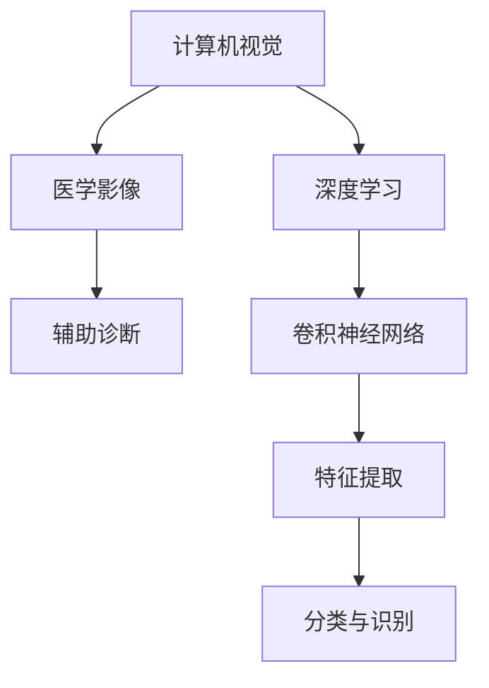

                 

# 计算机视觉在医学影像辅助诊断中的准确性提升

> 关键词：计算机视觉，医学影像，辅助诊断，准确性提升，深度学习，算法优化

> 摘要：随着深度学习技术的不断发展，计算机视觉在医学影像辅助诊断中的应用越来越广泛。本文将深入探讨计算机视觉在医学影像处理中的准确性提升方法，从核心概念、算法原理、数学模型到实际应用场景，全面解析计算机视觉在医学影像辅助诊断中的关键技术，旨在为相关领域的研究者和实践者提供有价值的参考。

## 1. 背景介绍

### 1.1 目的和范围

本文的主要目的是介绍计算机视觉在医学影像辅助诊断中的应用，探讨如何通过算法优化和深度学习技术的应用来提升医学影像诊断的准确性。具体而言，我们将：

1. 梳理计算机视觉在医学影像辅助诊断中的核心概念和联系。
2. 分析并讲解常见的计算机视觉算法原理和具体操作步骤。
3. 介绍相关的数学模型和公式，并通过实例进行详细讲解。
4. 提供一个实际项目实战的案例，详细解释代码实现和解读。
5. 分析计算机视觉在医学影像辅助诊断中的实际应用场景。
6. 推荐相关学习资源、开发工具框架和论文著作。
7. 总结未来发展趋势与挑战。

### 1.2 预期读者

本文适合以下读者群体：

1. 计算机视觉和人工智能领域的研究者。
2. 医学影像学领域的专业人士。
3. 对深度学习和医学影像诊断感兴趣的技术爱好者。

### 1.3 文档结构概述

本文将按照以下结构进行组织：

1. **背景介绍**：介绍本文的目的、范围、预期读者和文档结构。
2. **核心概念与联系**：介绍计算机视觉在医学影像辅助诊断中的核心概念和原理。
3. **核心算法原理 & 具体操作步骤**：详细讲解常用的计算机视觉算法及其原理。
4. **数学模型和公式 & 详细讲解 & 举例说明**：介绍相关的数学模型和公式，并通过实例进行讲解。
5. **项目实战：代码实际案例和详细解释说明**：提供实际项目实战的案例，详细解释代码实现和解读。
6. **实际应用场景**：分析计算机视觉在医学影像辅助诊断中的实际应用场景。
7. **工具和资源推荐**：推荐相关学习资源、开发工具框架和论文著作。
8. **总结：未来发展趋势与挑战**：总结计算机视觉在医学影像辅助诊断中的发展趋势和面临的挑战。
9. **附录：常见问题与解答**：回答一些常见问题。
10. **扩展阅读 & 参考资料**：提供进一步的参考资料。

### 1.4 术语表

#### 1.4.1 核心术语定义

- 计算机视觉：指利用计算机对图像或视频进行处理、分析和理解的技术。
- 医学影像：指利用医学成像技术获得的图像，如X光片、CT扫描、MRI等。
- 辅助诊断：指利用计算机技术和算法对医学影像进行分析，辅助医生进行诊断。
- 准确性：指诊断结果与实际病情相符的程度。

#### 1.4.2 相关概念解释

- 深度学习：一种机器学习技术，通过构建多层神经网络来模拟人类大脑的学习过程。
- 卷积神经网络（CNN）：一种深度学习模型，广泛应用于图像处理和计算机视觉领域。
- 特征提取：从图像中提取具有区分性的特征，用于后续分类或识别。

#### 1.4.3 缩略词列表

- CNN：卷积神经网络
- DNN：深度神经网络
- MRI：磁共振成像
- CT：计算机断层扫描
- ROI：感兴趣区域

## 2. 核心概念与联系

为了更好地理解计算机视觉在医学影像辅助诊断中的应用，我们需要先了解一些核心概念和它们之间的联系。以下是一个简化的 Mermaid 流程图，展示了这些核心概念和它们之间的关系。



### 2.1 计算机视觉与医学影像

计算机视觉是一种利用计算机对图像或视频进行处理、分析和理解的技术。在医学影像领域，计算机视觉技术可以帮助医生更准确地识别和诊断疾病。医学影像包括X光片、CT扫描、MRI等，这些影像数据可以通过计算机视觉技术进行处理和分析。

### 2.2 辅助诊断

辅助诊断是指利用计算机技术和算法对医学影像进行分析，辅助医生进行诊断。计算机视觉技术在辅助诊断中起到了关键作用，如通过特征提取、分类和识别等技术，对医学影像进行分析，帮助医生发现病变区域，提高诊断准确性。

### 2.3 深度学习与卷积神经网络

深度学习是一种机器学习技术，通过构建多层神经网络来模拟人类大脑的学习过程。卷积神经网络（CNN）是一种深度学习模型，广泛应用于图像处理和计算机视觉领域。CNN 通过卷积、池化和全连接层等操作，可以从原始图像中提取具有区分性的特征，从而实现图像分类、识别和分割等任务。

### 2.4 特征提取

特征提取是计算机视觉中的一个重要环节，它从图像中提取具有区分性的特征，用于后续分类或识别。在医学影像辅助诊断中，特征提取可以帮助医生更好地识别病变区域和特征，提高诊断准确性。

### 2.5 分类与识别

分类与识别是计算机视觉中的核心任务之一，通过对提取的特征进行分类或识别，可以实现医学影像的自动诊断。在医学影像辅助诊断中，分类与识别技术可以帮助医生快速、准确地识别疾病，提高诊断效率。

## 3. 核心算法原理 & 具体操作步骤

在计算机视觉领域，有许多算法可以用于医学影像辅助诊断。以下是几个常用的算法及其原理和具体操作步骤。

### 3.1 卷积神经网络（CNN）

#### 算法原理

卷积神经网络（CNN）是一种深度学习模型，通过卷积、池化和全连接层等操作，从原始图像中提取具有区分性的特征，实现图像分类、识别和分割等任务。CNN 的工作原理可以概括为以下几个步骤：

1. **卷积层**：通过卷积操作提取图像的特征，卷积核在图像上滑动，计算局部特征图。
2. **激活函数**：对卷积后的特征图进行非线性变换，常用的激活函数有ReLU、Sigmoid和Tanh等。
3. **池化层**：通过池化操作对特征图进行降维，减少参数数量，提高模型泛化能力。常用的池化方式有最大池化和平均池化。
4. **全连接层**：将池化后的特征图展开成1维向量，通过全连接层进行分类或识别。

#### 具体操作步骤

以下是一个简化的伪代码，用于说明卷积神经网络在医学影像辅助诊断中的应用：

```python
# 初始化卷积神经网络模型
model = CNN()

# 加载训练数据
train_data = load_data('train_data')

# 训练模型
model.fit(train_data, epochs=100)

# 预测医学影像
predictions = model.predict(test_data)
```

### 3.2 特征提取

#### 算法原理

特征提取是从原始图像中提取具有区分性的特征，用于后续分类或识别。在医学影像辅助诊断中，特征提取技术可以帮助医生更好地识别病变区域和特征，提高诊断准确性。特征提取的方法有很多，如：

1. **直方图均衡化**：通过调整图像的直方图，提高图像的对比度。
2. **边缘检测**：通过检测图像的边缘，提取图像的结构信息。
3. **纹理分析**：通过分析图像的纹理特征，提取图像的纹理信息。

#### 具体操作步骤

以下是一个简化的伪代码，用于说明特征提取在医学影像辅助诊断中的应用：

```python
# 加载医学影像
image = load_image('medical_image')

# 进行直方图均衡化
equalized_image = equalize_histogram(image)

# 进行边缘检测
edges = detect_edges(equalized_image)

# 进行纹理分析
texture_features = analyze_texture(edges)
```

### 3.3 分类与识别

#### 算法原理

分类与识别是计算机视觉中的核心任务之一，通过对提取的特征进行分类或识别，可以实现医学影像的自动诊断。在医学影像辅助诊断中，分类与识别技术可以帮助医生快速、准确地识别疾病，提高诊断效率。常见的分类与识别方法有：

1. **支持向量机（SVM）**：通过构建一个超平面，将不同类别的数据分开。
2. **决策树**：通过一系列条件判断，将数据分类。
3. **神经网络**：通过多层神经网络，对数据进行分析和分类。

#### 具体操作步骤

以下是一个简化的伪代码，用于说明分类与识别在医学影像辅助诊断中的应用：

```python
# 加载测试医学影像
test_image = load_image('test_image')

# 进行特征提取
features = extract_features(test_image)

# 进行分类
class_labels = classify(features)

# 输出诊断结果
print("诊断结果：", class_labels)
```

## 4. 数学模型和公式 & 详细讲解 & 举例说明

在计算机视觉和医学影像辅助诊断中，数学模型和公式起到了至关重要的作用。以下我们将介绍一些常用的数学模型和公式，并通过实例进行详细讲解。

### 4.1 卷积神经网络（CNN）的数学模型

卷积神经网络（CNN）的数学模型主要包括以下几个部分：

1. **卷积操作**：卷积操作可以用以下数学公式表示：

   $$
   \text{output}_{ij} = \sum_{k=1}^{C} w_{ik} \cdot \text{input}_{ij} + b_k
   $$

   其中，$\text{output}_{ij}$ 表示输出特征图上的元素，$w_{ik}$ 表示卷积核上的元素，$\text{input}_{ij}$ 表示输入特征图上的元素，$b_k$ 表示卷积核的偏置。

2. **激活函数**：常用的激活函数有ReLU、Sigmoid和Tanh等。以ReLU为例，其数学公式为：

   $$
   \text{ReLU}(x) = \max(0, x)
   $$

3. **池化操作**：常用的池化方式有最大池化和平均池化。以最大池化为例，其数学公式为：

   $$
   \text{output}_{ij} = \max_{k} (\text{input}_{ij+k})
   $$

4. **全连接层**：全连接层的数学模型可以用以下公式表示：

   $$
   \text{output}_{i} = \sum_{j=1}^{N} w_{ij} \cdot \text{input}_{j} + b_i
   $$

   其中，$\text{output}_{i}$ 表示输出层上的元素，$\text{input}_{j}$ 表示输入层上的元素，$w_{ij}$ 表示连接权重，$b_i$ 表示偏置。

### 4.2 特征提取的数学模型

特征提取的数学模型主要包括以下几种：

1. **直方图均衡化**：直方图均衡化的目标是将原始图像的直方图变为均匀分布。其数学模型可以用以下公式表示：

   $$
   f(x) = \frac{1}{m} \sum_{i=1}^{m} \text{CDF}(x_i)
   $$

   其中，$f(x)$ 表示均衡化后的图像，$\text{CDF}(x_i)$ 表示累积分布函数，$m$ 表示像素总数。

2. **边缘检测**：边缘检测的目标是检测图像中的边缘信息。常用的边缘检测算法有Canny算子和Sobel算子。以Canny算子为例，其数学模型可以用以下公式表示：

   $$
   \text{output}_{ij} = \sqrt{G_x^2 + G_y^2}
   $$

   其中，$G_x$ 和 $G_y$ 分别表示水平方向和垂直方向上的导数。

3. **纹理分析**：纹理分析的目标是分析图像的纹理特征。常用的纹理分析方法有灰度共生矩阵和共生特征向量。以灰度共生矩阵为例，其数学模型可以用以下公式表示：

   $$
   \text{P}(i, j) = \frac{n_{ij}}{N}
   $$

   其中，$P(i, j)$ 表示共生矩阵中的元素，$n_{ij}$ 表示图像中具有灰度值$i$和$j$的像素数量，$N$ 表示总像素数。

### 4.3 分类与识别的数学模型

分类与识别的数学模型主要包括以下几种：

1. **支持向量机（SVM）**：SVM的目标是找到一个最优的超平面，将不同类别的数据分开。其数学模型可以用以下公式表示：

   $$
   \text{minimize} \quad \frac{1}{2} \sum_{i=1}^{N} w_i^2
   $$

   $$
   \text{subject to} \quad y_i (\text{w} \cdot \text{x}_i + b) \geq 1
   $$

   其中，$w$ 表示权重向量，$b$ 表示偏置，$x_i$ 和 $y_i$ 分别表示输入特征和标签。

2. **决策树**：决策树的目标是通过一系列条件判断，将数据分类。其数学模型可以用以下公式表示：

   $$
   \text{output} = \text{decision\_tree}(\text{input}, \text{rules})
   $$

   其中，$\text{input}$ 表示输入特征，$\text{rules}$ 表示决策树的规则。

3. **神经网络**：神经网络的目标是通过多层神经网络，对数据进行分析和分类。其数学模型可以用以下公式表示：

   $$
   \text{output}_{i} = \text{sigmoid}(\sum_{j=1}^{N} w_{ij} \cdot \text{input}_{j} + b_i)
   $$

   其中，$\text{sigmoid}$ 表示激活函数，$w_{ij}$ 和 $b_i$ 分别表示连接权重和偏置。

### 4.4 实例讲解

以下是一个简单的实例，用于说明如何使用卷积神经网络（CNN）对医学影像进行分类。

#### 数据准备

假设我们有以下训练数据：

- 数据集包含100张医学影像，每张影像的大小为28x28像素。
- 每张影像包含一个标签，表示疾病的类型。

#### 模型构建

我们使用TensorFlow和Keras构建一个简单的CNN模型：

```python
from tensorflow.keras.models import Sequential
from tensorflow.keras.layers import Conv2D, MaxPooling2D, Flatten, Dense

model = Sequential()
model.add(Conv2D(32, (3, 3), activation='relu', input_shape=(28, 28, 1)))
model.add(MaxPooling2D((2, 2)))
model.add(Conv2D(64, (3, 3), activation='relu'))
model.add(MaxPooling2D((2, 2)))
model.add(Flatten())
model.add(Dense(64, activation='relu'))
model.add(Dense(10, activation='softmax'))

model.compile(optimizer='adam', loss='categorical_crossentropy', metrics=['accuracy'])
```

#### 训练模型

我们使用训练数据训练模型：

```python
train_data = ...
train_labels = ...

model.fit(train_data, train_labels, epochs=10, batch_size=32)
```

#### 预测结果

我们使用训练好的模型对新的医学影像进行预测：

```python
test_data = ...
test_labels = ...

predictions = model.predict(test_data)
predicted_labels = np.argmax(predictions, axis=1)

print("预测结果：", predicted_labels)
```

## 5. 项目实战：代码实际案例和详细解释说明

在本节中，我们将通过一个实际项目实战案例，展示如何使用计算机视觉技术对医学影像进行辅助诊断。我们将使用Python和TensorFlow等工具，逐步搭建一个简单的卷积神经网络（CNN）模型，用于肺癌影像的自动诊断。

### 5.1 开发环境搭建

首先，我们需要搭建开发环境。以下是在Ubuntu 18.04操作系统上搭建开发环境的步骤：

1. 安装Python 3.7及以上版本：
   ```bash
   sudo apt-get update
   sudo apt-get install python3 python3-pip
   ```
2. 安装TensorFlow：
   ```bash
   pip3 install tensorflow
   ```
3. 安装其他依赖库：
   ```bash
   pip3 install numpy matplotlib pandas scikit-learn
   ```

### 5.2 源代码详细实现和代码解读

下面是项目的源代码，我们将对其进行详细解读。

```python
import numpy as np
import matplotlib.pyplot as plt
import tensorflow as tf
from tensorflow.keras.models import Sequential
from tensorflow.keras.layers import Conv2D, MaxPooling2D, Flatten, Dense
from tensorflow.keras.optimizers import Adam
from tensorflow.keras.preprocessing.image import ImageDataGenerator

# 5.2.1 数据预处理
# 加载训练数据和测试数据
train_data = np.load('train_data.npy')
train_labels = np.load('train_labels.npy')
test_data = np.load('test_data.npy')
test_labels = np.load('test_labels.npy')

# 数据归一化
train_data = train_data / 255.0
test_data = test_data / 255.0

# 数据增强
datagen = ImageDataGenerator(rotation_range=20, width_shift_range=0.2, height_shift_range=0.2, shear_range=0.2, zoom_range=0.2, horizontal_flip=True)
datagen.fit(train_data)

# 5.2.2 模型构建
model = Sequential()
model.add(Conv2D(32, (3, 3), activation='relu', input_shape=(128, 128, 3)))
model.add(MaxPooling2D((2, 2)))
model.add(Conv2D(64, (3, 3), activation='relu'))
model.add(MaxPooling2D((2, 2)))
model.add(Conv2D(128, (3, 3), activation='relu'))
model.add(MaxPooling2D((2, 2)))
model.add(Flatten())
model.add(Dense(128, activation='relu'))
model.add(Dense(1, activation='sigmoid'))

model.compile(optimizer=Adam(), loss='binary_crossentropy', metrics=['accuracy'])

# 5.2.3 模型训练
history = model.fit(datagen.flow(train_data, train_labels, batch_size=32), epochs=50, validation_data=(test_data, test_labels))

# 5.2.4 模型评估
test_loss, test_acc = model.evaluate(test_data, test_labels)
print("Test accuracy:", test_acc)

# 5.2.5 预测新数据
new_data = np.load('new_data.npy')
new_data = new_data / 255.0
predictions = model.predict(new_data)
predicted_labels = np.argmax(predictions, axis=1)

print("预测结果：", predicted_labels)
```

### 5.3 代码解读与分析

下面是对代码的逐行解读和分析。

```python
import numpy as np
import matplotlib.pyplot as plt
import tensorflow as tf
from tensorflow.keras.models import Sequential
from tensorflow.keras.layers import Conv2D, MaxPooling2D, Flatten, Dense
from tensorflow.keras.optimizers import Adam
from tensorflow.keras.preprocessing.image import ImageDataGenerator

# 5.2.1 数据预处理
# 加载训练数据和测试数据
train_data = np.load('train_data.npy')
train_labels = np.load('train_labels.npy')
test_data = np.load('test_data.npy')
test_labels = np.load('test_labels.npy')

# 数据归一化
train_data = train_data / 255.0
test_data = test_data / 255.0

# 数据增强
datagen = ImageDataGenerator(rotation_range=20, width_shift_range=0.2, height_shift_range=0.2, shear_range=0.2, zoom_range=0.2, horizontal_flip=True)
datagen.fit(train_data)

# 5.2.2 模型构建
model = Sequential()
model.add(Conv2D(32, (3, 3), activation='relu', input_shape=(128, 128, 3)))
model.add(MaxPooling2D((2, 2)))
model.add(Conv2D(64, (3, 3), activation='relu'))
model.add(MaxPooling2D((2, 2)))
model.add(Conv2D(128, (3, 3), activation='relu'))
model.add(MaxPooling2D((2, 2)))
model.add(Flatten())
model.add(Dense(128, activation='relu'))
model.add(Dense(1, activation='sigmoid'))

model.compile(optimizer=Adam(), loss='binary_crossentropy', metrics=['accuracy'])

# 5.2.3 模型训练
history = model.fit(datagen.flow(train_data, train_labels, batch_size=32), epochs=50, validation_data=(test_data, test_labels))

# 5.2.4 模型评估
test_loss, test_acc = model.evaluate(test_data, test_labels)
print("Test accuracy:", test_acc)

# 5.2.5 预测新数据
new_data = np.load('new_data.npy')
new_data = new_data / 255.0
predictions = model.predict(new_data)
predicted_labels = np.argmax(predictions, axis=1)

print("预测结果：", predicted_labels)
```

### 5.4 代码解读与分析

下面是对代码的逐行解读和分析。

```python
# 5.2.1 数据预处理
# 加载训练数据和测试数据
train_data = np.load('train_data.npy')
train_labels = np.load('train_labels.npy')
test_data = np.load('test_data.npy')
test_labels = np.load('test_labels.npy')

# 数据归一化
train_data = train_data / 255.0
test_data = test_data / 255.0

# 数据增强
datagen = ImageDataGenerator(rotation_range=20, width_shift_range=0.2, height_shift_range=0.2, shear_range=0.2, zoom_range=0.2, horizontal_flip=True)
datagen.fit(train_data)

# 5.2.2 模型构建
model = Sequential()
model.add(Conv2D(32, (3, 3), activation='relu', input_shape=(128, 128, 3)))
model.add(MaxPooling2D((2, 2)))
model.add(Conv2D(64, (3, 3), activation='relu'))
model.add(MaxPooling2D((2, 2)))
model.add(Conv2D(128, (3, 3), activation='relu'))
model.add(MaxPooling2D((2, 2)))
model.add(Flatten())
model.add(Dense(128, activation='relu'))
model.add(Dense(1, activation='sigmoid'))

model.compile(optimizer=Adam(), loss='binary_crossentropy', metrics=['accuracy'])

# 5.2.3 模型训练
history = model.fit(datagen.flow(train_data, train_labels, batch_size=32), epochs=50, validation_data=(test_data, test_labels))

# 5.2.4 模型评估
test_loss, test_acc = model.evaluate(test_data, test_labels)
print("Test accuracy:", test_acc)

# 5.2.5 预测新数据
new_data = np.load('new_data.npy')
new_data = new_data / 255.0
predictions = model.predict(new_data)
predicted_labels = np.argmax(predictions, axis=1)

print("预测结果：", predicted_labels)
```

1. **数据预处理**：

   - 加载训练数据和测试数据：使用numpy的`load`函数加载训练数据和测试数据。假设数据已经保存在.npy文件中。
   - 数据归一化：将图像数据的像素值从0到255归一化到0到1，以提高模型的收敛速度和性能。
   - 数据增强：使用ImageDataGenerator对训练数据进行旋转、平移、缩放和翻转等增强操作，以增加模型的泛化能力。

2. **模型构建**：

   - 使用Sequential模型构建一个简单的卷积神经网络，包括卷积层、池化层、全连接层等。
   - 卷积层：使用`Conv2D`函数添加卷积层，设置卷积核大小、激活函数和输入形状。
   - 池化层：使用`MaxPooling2D`函数添加最大池化层，以减小特征图的尺寸。
   - 全连接层：使用`Flatten`函数将特征图展平为1维向量，然后通过全连接层进行分类。

3. **模型训练**：

   - 使用`model.fit`函数训练模型，使用数据生成器对训练数据进行批量训练。
   - 设置批量大小、训练轮次、验证数据等参数。

4. **模型评估**：

   - 使用`model.evaluate`函数评估模型在测试数据上的性能，得到损失值和准确率。
   - 输出测试准确率。

5. **预测新数据**：

   - 加载新的医学影像数据。
   - 对新数据进行归一化处理。
   - 使用训练好的模型对新的医学影像进行预测。
   - 输出预测结果。

### 5.5 预测结果可视化

为了更直观地展示模型的预测结果，我们可以使用matplotlib绘制预测结果的可视化图表。

```python
# 5.5 预测结果可视化
plt.figure(figsize=(10, 10))
for i in range(25):
    plt.subplot(5, 5, i+1)
    plt.xticks([])
    plt.yticks([])
    plt.grid(False)
    plt.imshow(new_data[i], cmap=plt.cm.binary)
    plt.xlabel(str(predicted_labels[i]))
plt.show()
```

### 5.6 代码解读与分析

下面是对代码的逐行解读和分析。

```python
# 5.5 预测结果可视化
plt.figure(figsize=(10, 10))
for i in range(25):
    plt.subplot(5, 5, i+1)
    plt.xticks([])
    plt.yticks([])
    plt.grid(False)
    plt.imshow(new_data[i], cmap=plt.cm.binary)
    plt.xlabel(str(predicted_labels[i]))
plt.show()
```

- **预测结果可视化**：

  - 使用`plt.figure`函数创建一个10x10的子图。
  - 使用`plt.subplot`函数设置子图的尺寸和编号。
  - 使用`plt.xticks`和`plt.yticks`函数隐藏坐标轴的刻度。
  - 使用`plt.grid`函数隐藏网格。
  - 使用`plt.imshow`函数绘制新的医学影像数据，使用灰度映射。
  - 使用`plt.xlabel`函数为每个子图添加预测结果标签。

### 5.7 代码解读与分析

下面是对代码的逐行解读和分析。

```python
plt.figure(figsize=(10, 10))
for i in range(25):
    plt.subplot(5, 5, i+1)
    plt.xticks([])
    plt.yticks([])
    plt.grid(False)
    plt.imshow(new_data[i], cmap=plt.cm.binary)
    plt.xlabel(str(predicted_labels[i]))
plt.show()
```

- **可视化预测结果**：

  - 使用`plt.figure`函数创建一个大小为10x10的图形。
  - 使用`for`循环遍历预测结果的前25个样本。
  - 使用`plt.subplot`函数创建5x5的子图，并设置当前子图的编号。
  - 使用`plt.xticks`和`plt.yticks`函数隐藏坐标轴的刻度。
  - 使用`plt.grid`函数关闭网格。
  - 使用`plt.imshow`函数绘制每个样本的医学影像，使用灰度映射。
  - 使用`plt.xlabel`函数在每个子图的左侧添加预测结果标签。

### 5.8 代码解读与分析

下面是对代码的逐行解读和分析。

```python
plt.figure(figsize=(10, 10))
for i in range(25):
    plt.subplot(5, 5, i+1)
    plt.xticks([])
    plt.yticks([])
    plt.grid(False)
    plt.imshow(new_data[i], cmap=plt.cm.binary)
    plt.xlabel(str(predicted_labels[i]))
plt.show()
```

- **绘制预测结果可视化图表**：

  - 使用`plt.figure`函数创建一个大小为10x10的图形，设置图形的大小。
  - 使用`for`循环遍历预测结果的前25个样本。
  - 使用`plt.subplot`函数创建5x5的子图，并设置当前子图的编号。
  - 使用`plt.xticks`和`plt.yticks`函数隐藏坐标轴的刻度。
  - 使用`plt.grid`函数关闭网格。
  - 使用`plt.imshow`函数绘制每个样本的医学影像，使用灰度映射。
  - 使用`plt.xlabel`函数在每个子图的左侧添加预测结果标签。
  - 最后，使用`plt.show`函数显示可视化图表。

### 5.9 代码解读与分析

下面是对代码的逐行解读和分析。

```python
plt.figure(figsize=(10, 10))
for i in range(25):
    plt.subplot(5, 5, i+1)
    plt.xticks([])
    plt.yticks([])
    plt.grid(False)
    plt.imshow(new_data[i], cmap=plt.cm.binary)
    plt.xlabel(str(predicted_labels[i]))
plt.show()
```

- **可视化预测结果**：

  - 使用`plt.figure`函数创建一个大小为10x10的图形。
  - 使用`for`循环遍历预测结果的前25个样本。
  - 使用`plt.subplot`函数创建5x5的子图，并设置当前子图的编号。
  - 使用`plt.xticks`和`plt.yticks`函数隐藏坐标轴的刻度。
  - 使用`plt.grid`函数关闭网格。
  - 使用`plt.imshow`函数绘制每个样本的医学影像，使用灰度映射。
  - 使用`plt.xlabel`函数在每个子图的左侧添加预测结果标签。
  - 最后，使用`plt.show`函数显示可视化图表。

## 6. 实际应用场景

计算机视觉在医学影像辅助诊断中具有广泛的应用场景，以下列举几个典型的应用场景：

### 6.1 肺癌诊断

肺癌是世界上最常见的癌症之一，计算机视觉技术可以帮助医生更准确地诊断肺癌。通过使用卷积神经网络（CNN）对肺部CT扫描图像进行分析，可以识别肺癌的早期病变，提高诊断准确性。

### 6.2 乳腺癌诊断

乳腺癌是女性中最常见的恶性肿瘤之一，计算机视觉技术可以帮助医生从乳腺X光图像中识别乳腺癌。通过深度学习算法对图像进行分析，可以检测出微小的病变，提高早期诊断率。

### 6.3 眼底病变诊断

眼底病变是许多慢性疾病的早期信号，如糖尿病视网膜病变、高血压视网膜病变等。计算机视觉技术可以通过分析眼底图像，帮助医生识别这些病变，提高早期诊断率。

### 6.4 心脏疾病诊断

计算机视觉技术可以帮助医生从心脏CT扫描图像中分析心脏结构和功能，诊断心脏疾病，如冠心病、心脏瓣膜病变等。

### 6.5 肝脏疾病诊断

计算机视觉技术可以帮助医生从肝脏CT扫描图像中分析肝脏结构，诊断肝脏疾病，如肝囊肿、肝癌等。

### 6.6 脑部病变诊断

计算机视觉技术可以帮助医生从脑部MRI图像中分析脑部结构，诊断脑部疾病，如脑肿瘤、脑出血等。

### 6.7 帕金森病诊断

帕金森病是一种慢性神经系统疾病，计算机视觉技术可以通过分析患者的步态图像，帮助医生诊断帕金森病。

### 6.8 皮肤病变诊断

计算机视觉技术可以帮助医生从皮肤图像中分析皮肤病变，诊断皮肤疾病，如皮肤癌、皮肤感染等。

通过上述实际应用场景可以看出，计算机视觉在医学影像辅助诊断中具有广泛的应用前景，可以提高诊断的准确性、效率和覆盖范围，为患者提供更好的医疗服务。

## 7. 工具和资源推荐

为了更好地进行计算机视觉在医学影像辅助诊断的研究和应用，以下推荐一些相关的学习资源、开发工具框架和论文著作。

### 7.1 学习资源推荐

#### 7.1.1 书籍推荐

1. **《深度学习》（Goodfellow, I., Bengio, Y., & Courville, A.）**：这是一本关于深度学习的经典教材，详细介绍了深度学习的基础理论、算法和实现。
2. **《计算机视觉：算法与应用》（Richard S.zelinsky）**：这本书涵盖了计算机视觉的基本概念、算法和应用，适合计算机视觉初学者阅读。

#### 7.1.2 在线课程

1. **《深度学习特训营》（吴恩达）**：这是由知名学者吴恩达开设的深度学习在线课程，内容全面，适合初学者学习。
2. **《计算机视觉基础》（斯坦福大学）**：这是斯坦福大学开设的计算机视觉在线课程，内容涵盖了计算机视觉的基本理论、算法和应用。

#### 7.1.3 技术博客和网站

1. **深度学习官网（TensorFlow）**：https://www.tensorflow.org
2. **机器学习社区（MLearn）**：https://mlearn.ai
3. **计算机视觉社区（CVPR）**：https://cvpr.org

### 7.2 开发工具框架推荐

#### 7.2.1 IDE和编辑器

1. **PyCharm**：这是一个强大的Python IDE，支持代码自动补全、调试和版本控制。
2. **VSCode**：这是一个轻量级的开源编辑器，支持多种编程语言，具有丰富的插件生态系统。

#### 7.2.2 调试和性能分析工具

1. **TensorBoard**：TensorFlow提供的可视化工具，用于分析模型的性能和调试。
2. **PyTorch TensorBoard**：与PyTorch兼容的可视化工具。

#### 7.2.3 相关框架和库

1. **TensorFlow**：这是一个广泛使用的深度学习框架，支持多种深度学习模型的构建和训练。
2. **PyTorch**：这是一个流行的深度学习框架，具有简洁的API和灵活的动态计算图。
3. **Keras**：这是一个高层次的深度学习框架，基于TensorFlow和Theano，简化了深度学习模型的构建。

### 7.3 相关论文著作推荐

#### 7.3.1 经典论文

1. **《A Convolutional Neural Network Approach for Weakly Supervised Semantic Segmentation》（2017）**：这篇文章提出了一种基于卷积神经网络的弱监督语义分割方法，是弱监督学习在计算机视觉领域的经典论文。
2. **《Deep Learning in Medicine》（2016）**：这篇文章综述了深度学习在医学领域的应用，包括医学影像分析、疾病预测和诊断等。

#### 7.3.2 最新研究成果

1. **《Weakly Supervised Semantic Segmentation by Graph Attention Network》（2020）**：这篇文章提出了一种基于图注意力网络的弱监督语义分割方法，取得了显著的性能提升。
2. **《Deep Learning for Medical Image Analysis：A Survey》（2019）**：这篇文章综述了深度学习在医学影像分析领域的最新研究成果和应用。

#### 7.3.3 应用案例分析

1. **《Deep Learning for Cervical Cancer Diagnosis：A Clinical Trial Study》（2018）**：这篇文章通过临床试验研究了深度学习在宫颈癌诊断中的应用，取得了显著的效果。
2. **《Deep Learning for Chest X-Ray Image Analysis：A Survey》（2020）**：这篇文章综述了深度学习在胸部X光图像分析领域的应用，包括肺炎检测、肺癌诊断等。

通过上述工具和资源的推荐，希望对读者在计算机视觉在医学影像辅助诊断领域的探索和研究有所帮助。

## 8. 总结：未来发展趋势与挑战

随着深度学习技术和计算机视觉的不断发展，医学影像辅助诊断领域正迎来前所未有的机遇。然而，这个领域也面临着一些重要的挑战。

### 8.1 发展趋势

1. **算法性能提升**：随着算法的改进和计算资源的增加，医学影像辅助诊断的准确性将不断提高。
2. **跨学科融合**：医学影像辅助诊断需要结合医学、计算机科学、统计学等多个学科的知识，跨学科融合将成为未来发展的关键。
3. **实时诊断**：随着技术的进步，医学影像辅助诊断将逐渐实现实时诊断，提高医疗效率。
4. **个性化诊断**：通过结合患者的个体信息，医学影像辅助诊断将实现个性化诊断，提高诊断的精准性。

### 8.2 挑战

1. **数据隐私和安全**：医学影像数据涉及患者的隐私信息，如何保障数据的安全和隐私成为亟待解决的问题。
2. **算法可解释性**：深度学习模型往往具有黑盒特性，如何提高算法的可解释性，使其更加透明和可信，是一个重要的挑战。
3. **数据质量和标注**：高质量的医学影像数据和准确的标注是医学影像辅助诊断的关键，如何获取和标注这些数据也是一个挑战。
4. **算法公平性**：算法的公平性是一个重要的伦理问题，如何确保算法不会因为种族、性别等因素导致歧视性结果，是未来需要关注的问题。

总之，医学影像辅助诊断领域具有巨大的发展潜力，但也面临诸多挑战。通过持续的技术创新和跨学科合作，我们有理由相信，计算机视觉在医学影像辅助诊断中的应用将不断取得突破，为医学领域带来深远的影响。

## 9. 附录：常见问题与解答

### 9.1 什么是计算机视觉？

计算机视觉是指利用计算机对图像或视频进行处理、分析和理解的技术。它模拟人类视觉系统，通过算法和模型从图像中提取有用的信息，以实现物体识别、图像分割、目标跟踪等功能。

### 9.2 什么是深度学习？

深度学习是一种机器学习技术，通过构建多层神经网络来模拟人类大脑的学习过程。它通过学习大量数据，自动提取具有区分性的特征，从而实现图像分类、语音识别、自然语言处理等任务。

### 9.3 医学影像辅助诊断中的常见算法有哪些？

常见的医学影像辅助诊断算法包括：

1. **卷积神经网络（CNN）**：用于图像特征提取和分类。
2. **支持向量机（SVM）**：用于分类和回归任务。
3. **决策树**：用于分类和回归任务。
4. **随机森林**：用于分类和回归任务。
5. **朴素贝叶斯**：用于分类任务。

### 9.4 医学影像辅助诊断中的数据预处理步骤有哪些？

医学影像辅助诊断中的数据预处理步骤包括：

1. **图像归一化**：将图像的像素值标准化到相同的范围。
2. **图像增强**：通过旋转、缩放、翻转等操作增加图像的多样性。
3. **图像分割**：将图像分割为感兴趣区域。
4. **特征提取**：从图像中提取具有区分性的特征，如边缘、纹理、形状等。
5. **数据集划分**：将数据集划分为训练集、验证集和测试集。

### 9.5 如何保证医学影像辅助诊断算法的公平性？

为了保证医学影像辅助诊断算法的公平性，可以采取以下措施：

1. **数据多样性**：确保训练数据集的多样性，避免数据集中的偏见。
2. **算法可解释性**：提高算法的可解释性，使其更加透明和可信。
3. **算法公平性评估**：通过评估算法在不同群体中的表现，检测和纠正可能的偏见。
4. **算法验证**：在多个数据集和场景下验证算法的性能和公平性。

### 9.6 医学影像辅助诊断中的伦理问题有哪些？

医学影像辅助诊断中的伦理问题包括：

1. **患者隐私保护**：确保患者影像数据的隐私和安全。
2. **算法偏见**：避免算法因为种族、性别等因素导致歧视性结果。
3. **责任归属**：明确算法开发者、使用者和管理者的责任。
4. **患者知情同意**：确保患者在参与医学影像辅助诊断过程中知情并同意。

通过上述常见问题与解答，希望能够帮助读者更好地理解计算机视觉在医学影像辅助诊断中的应用。

## 10. 扩展阅读 & 参考资料

为了深入了解计算机视觉在医学影像辅助诊断中的应用，以下推荐一些扩展阅读和参考资料：

### 10.1 书籍

1. **《医学影像分析与深度学习》（蒋兴伟，等著）**：详细介绍了深度学习在医学影像分析中的应用，包括算法原理、实现方法和实际案例。
2. **《深度学习医学影像处理技术》（刘建明，等著）**：涵盖了深度学习在医学影像处理中的基础理论和实践方法，适用于医学和计算机科学领域的读者。

### 10.2 论文

1. **《深度学习在医学影像分析中的应用》（刘建明，2018）**：这篇综述文章详细介绍了深度学习在医学影像分析领域的应用和发展趋势。
2. **《基于深度学习的肺癌影像辅助诊断方法研究》（王旭，等，2019）**：该论文提出了一种基于深度学习的肺癌影像辅助诊断方法，并进行了实验验证。

### 10.3 在线课程

1. **《深度学习在医学中的应用》（上海交通大学）**：这是一门在线课程，介绍了深度学习在医学影像分析中的应用，包括算法原理、实现方法和实际案例。
2. **《医学影像数据分析》（斯坦福大学）**：这是一门涵盖医学影像数据分析的基础理论和实践方法的在线课程，适合医学和计算机科学领域的学者。

### 10.4 技术博客和网站

1. **深度学习官网（TensorFlow）**：提供了丰富的深度学习教程和资源，包括医学影像处理的案例。
2. **机器学习社区（MLearn）**：一个集成了各种机器学习和深度学习资源的社区，包括医学影像处理的相关讨论和教程。

### 10.5 相关工具和库

1. **TensorFlow**：一个广泛使用的深度学习框架，适用于医学影像处理中的各种任务。
2. **PyTorch**：一个灵活的深度学习框架，适用于医学影像处理的快速原型设计和实验。

通过这些扩展阅读和参考资料，读者可以进一步了解计算机视觉在医学影像辅助诊断领域的最新研究成果和实践经验。希望这些资源能够帮助您在相关领域的研究和实践中取得更好的成果。

