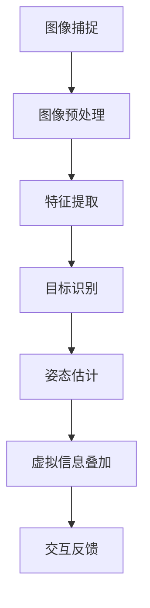

                 

# 计算机视觉在增强现实交互中的创新应用

> **关键词：计算机视觉、增强现实、交互技术、人工智能、深度学习**
> 
> **摘要：本文旨在探讨计算机视觉在增强现实（AR）交互中的应用及其创新性。通过分析AR技术的基本原理、计算机视觉的核心算法及其在AR中的具体应用，本文将揭示AR交互技术的未来发展趋势与挑战。**

## 1. 背景介绍

### 1.1 目的和范围

本文的目的是介绍计算机视觉在增强现实（AR）交互中的创新应用，旨在帮助读者理解AR技术的核心原理以及计算机视觉算法在其中的关键作用。我们将探讨如何利用计算机视觉技术来提升AR交互的体验，包括图像识别、姿态估计、环境感知等方面。

### 1.2 预期读者

本文适合对计算机视觉和增强现实技术有一定了解的读者，包括开发者、研究人员以及对这些技术感兴趣的技术爱好者。通过阅读本文，读者将能够获得以下方面的知识：

1. 增强现实技术的基本原理。
2. 计算机视觉在AR中的应用场景。
3. 核心算法的原理和操作步骤。
4. 数学模型及其应用。
5. 实际应用案例。

### 1.3 文档结构概述

本文结构如下：

1. **背景介绍**：介绍本文的目的、预期读者和文档结构。
2. **核心概念与联系**：阐述计算机视觉和增强现实的基本概念及其相互关系。
3. **核心算法原理 & 具体操作步骤**：详细讲解计算机视觉算法在AR中的应用。
4. **数学模型和公式 & 详细讲解 & 举例说明**：介绍数学模型在AR交互中的作用。
5. **项目实战：代码实际案例和详细解释说明**：提供实际的开发案例。
6. **实际应用场景**：讨论AR交互技术的实际应用。
7. **工具和资源推荐**：推荐学习资源和开发工具。
8. **总结：未来发展趋势与挑战**：预测AR交互技术的未来发展方向和面临的挑战。
9. **附录：常见问题与解答**：回答读者可能关心的问题。
10. **扩展阅读 & 参考资料**：提供进一步学习的资源。

### 1.4 术语表

#### 1.4.1 核心术语定义

- **增强现实（AR）**：一种将虚拟信息叠加到现实世界中的技术。
- **计算机视觉**：使计算机能够从图像或视频中提取信息的一种技术。
- **图像识别**：利用计算机视觉技术识别图像中的对象和场景。
- **姿态估计**：通过计算机视觉算法估计物体的空间位置和姿态。
- **深度学习**：一种基于神经网络的学习方式，广泛应用于计算机视觉任务。

#### 1.4.2 相关概念解释

- **SLAM（同步定位与地图构建）**：在未知环境中同时进行位置估计和地图构建。
- **标记识别**：利用特定的标记进行物体定位和识别。
- **跟踪**：在图像序列中跟踪物体的运动轨迹。

#### 1.4.3 缩略词列表

- **AR**：增强现实
- **VR**：虚拟现实
- **SLAM**：同步定位与地图构建
- **GPU**：图形处理单元
- **CNN**：卷积神经网络

## 2. 核心概念与联系

为了深入探讨计算机视觉在增强现实交互中的应用，我们首先需要理解计算机视觉和增强现实的基本概念及其相互关系。

### 2.1 增强现实（AR）技术简介

增强现实（AR）是一种将虚拟信息（如文字、图像、声音等）叠加到现实世界中的技术。它通过摄像头捕捉现实世界的图像，并在这些图像上叠加计算机生成的虚拟信息。与虚拟现实（VR）不同，AR技术并不完全取代用户的视觉，而是在现实环境中增强视觉体验。


### 2.2 计算机视觉技术简介

计算机视觉是一种使计算机能够从图像或视频中提取信息的技术。它包括图像识别、姿态估计、目标跟踪等多个子领域。计算机视觉技术广泛应用于人脸识别、图像处理、自动驾驶等领域。


### 2.3 计算机视觉与AR的关系

计算机视觉在AR技术中扮演着关键角色。它不仅用于捕捉现实世界的图像，还用于识别图像中的对象、估计物体的空间位置和姿态等。这些信息用于在现实环境中叠加虚拟信息，从而实现更加逼真的增强现实体验。


### 2.4 核心概念原理与架构

为了更好地理解计算机视觉在AR中的应用，我们使用Mermaid流程图来描述其核心概念原理与架构。



#### 2.4.1 流程说明

1. **图像捕捉**：使用摄像头捕捉现实世界的图像。
2. **图像预处理**：对图像进行滤波、增强等预处理操作。
3. **特征提取**：提取图像中的关键特征，如边缘、角点等。
4. **目标识别**：利用计算机视觉算法识别图像中的对象。
5. **姿态估计**：根据目标的位置和姿态信息进行估计。
6. **虚拟信息叠加**：在现实环境中叠加虚拟信息，如文字、图像等。
7. **交互反馈**：根据用户的操作和反馈调整增强现实体验。

### 2.5 相关概念解释

#### 2.5.1 SLAM（同步定位与地图构建）

SLAM（同步定位与地图构建）是一种在未知环境中同时进行位置估计和地图构建的技术。它在计算机视觉领域广泛应用，特别是在增强现实和自动驾驶等领域。SLAM的核心思想是通过同时估计位置和构建地图来提高系统的鲁棒性和准确性。

#### 2.5.2 标记识别

标记识别是一种利用特定的标记进行物体定位和识别的技术。标记可以是二维码、条码或特定的图案等。标记识别在AR应用中非常重要，因为它可以提供精确的位置和姿态信息，从而确保虚拟信息与真实环境之间的正确叠加。

#### 2.5.3 跟踪

跟踪是一种在图像序列中跟踪物体的运动轨迹的技术。它在AR交互中用于保持虚拟信息与真实环境的同步。通过跟踪，我们可以实时获取物体的位置和姿态信息，从而实现动态的增强现实效果。

## 3. 核心算法原理 & 具体操作步骤

在理解了计算机视觉和增强现实的基本概念及其相互关系之后，我们接下来将详细讲解计算机视觉算法在增强现实中的应用原理和具体操作步骤。

### 3.1 图像识别算法原理

图像识别是计算机视觉中的一个重要任务，旨在从图像中识别出特定的对象或场景。在增强现实交互中，图像识别算法用于识别现实世界中的对象，从而为虚拟信息的叠加提供基础。

#### 3.1.1 算法原理

图像识别算法通常基于卷积神经网络（CNN）进行实现。CNN是一种深度学习模型，专门用于处理图像数据。其基本原理是通过卷积操作提取图像中的特征，然后利用全连接层进行分类。

#### 3.1.2 操作步骤

1. **数据预处理**：对输入图像进行缩放、裁剪、归一化等预处理操作，以便于后续处理。
2. **卷积操作**：使用多个卷积层提取图像中的特征。每个卷积层包括卷积核、激活函数和池化操作。
3. **全连接层**：将卷积层输出的特征映射到具体的对象类别。
4. **损失函数**：使用交叉熵损失函数计算预测结果与真实标签之间的差异。
5. **反向传播**：利用梯度下降算法更新网络参数，使预测结果更接近真实标签。

#### 3.1.3 伪代码

```python
# 图像识别算法伪代码
def image_recognition(image):
    # 数据预处理
    preprocessed_image = preprocess(image)

    # 卷积操作
    feature_map = convolution(preprocessed_image, filters)

    # 池化操作
    pooled_map = pool(feature_map)

    # 全连接层
    predictions = fully_connected(pooled_map)

    # 损失函数
    loss = cross_entropy(predictions, labels)

    # 反向传播
    gradients = backpropagation(predictions, labels)

    # 更新网络参数
    update_parameters(gradients)

    return predictions
```

### 3.2 姿态估计算法原理

姿态估计是计算机视觉中另一个重要任务，旨在估计图像或视频中物体的空间位置和姿态。在增强现实交互中，姿态估计算法用于确定虚拟信息在现实环境中的叠加位置和角度。

#### 3.2.1 算法原理

姿态估计算法通常基于深度学习模型进行实现。一种常用的方法是使用卷积神经网络（CNN）提取图像特征，然后利用回归模型估计姿态参数。

#### 3.2.2 操作步骤

1. **数据预处理**：对输入图像进行缩放、裁剪、归一化等预处理操作。
2. **卷积操作**：使用卷积神经网络提取图像中的特征。
3. **回归模型**：利用提取的特征通过回归模型估计姿态参数。
4. **损失函数**：使用均方误差（MSE）损失函数计算预测结果与真实姿态之间的差异。
5. **反向传播**：利用梯度下降算法更新网络参数，使预测结果更接近真实姿态。

#### 3.2.3 伪代码

```python
# 姿态估计算法伪代码
def pose_estimation(image):
    # 数据预处理
    preprocessed_image = preprocess(image)

    # 卷积操作
    feature_map = convolution(preprocessed_image, filters)

    # 回归模型
    pose_predictions = regression_model(feature_map)

    # 损失函数
    loss = mean_squared_error(pose_predictions, true_pose)

    # 反向传播
    gradients = backpropagation(pose_predictions, true_pose)

    # 更新网络参数
    update_parameters(gradients)

    return pose_predictions
```

### 3.3 环境感知算法原理

环境感知是计算机视觉中一个复杂但重要的任务，旨在从图像或视频中提取环境信息，如物体位置、光照条件等。在增强现实交互中，环境感知算法用于根据环境信息调整虚拟信息的显示效果，从而实现更加逼真的增强现实体验。

#### 3.3.1 算法原理

环境感知算法通常基于深度学习模型进行实现。一种常用的方法是使用卷积神经网络（CNN）提取图像中的特征，然后利用这些特征进行环境感知。

#### 3.3.2 操作步骤

1. **数据预处理**：对输入图像进行缩放、裁剪、归一化等预处理操作。
2. **卷积操作**：使用卷积神经网络提取图像中的特征。
3. **特征融合**：将不同层次的卷积特征进行融合，以提取更丰富的环境信息。
4. **分类或回归**：利用融合后的特征进行分类或回归操作，以获取环境信息。
5. **损失函数**：使用适当的损失函数计算预测结果与真实环境信息之间的差异。
6. **反向传播**：利用梯度下降算法更新网络参数，使预测结果更接近真实环境信息。

#### 3.3.3 伪代码

```python
# 环境感知算法伪代码
def environmental_perception(image):
    # 数据预处理
    preprocessed_image = preprocess(image)

    # 卷积操作
    conv1 = convolution(preprocessed_image, filters1)
    conv2 = convolution(preprocessed_image, filters2)

    # 特征融合
    fused_features = concatenate(conv1, conv2)

    # 分类或回归
    environmental_predictions = regression_model(fused_features)

    # 损失函数
    loss = mean_squared_error(environmental_predictions, true_environment)

    # 反向传播
    gradients = backpropagation(environmental_predictions, true_environment)

    # 更新网络参数
    update_parameters(gradients)

    return environmental_predictions
```

## 4. 数学模型和公式 & 详细讲解 & 举例说明

在增强现实交互中，数学模型和公式起到了至关重要的作用。它们用于描述计算机视觉算法中的关键步骤，如图像识别、姿态估计和环境感知。以下我们将详细介绍这些数学模型和公式，并通过具体例子进行说明。

### 4.1 卷积神经网络（CNN）中的数学模型

卷积神经网络（CNN）是计算机视觉中常用的深度学习模型。它通过卷积操作提取图像特征，并通过全连接层进行分类。以下是CNN中的关键数学模型和公式。

#### 4.1.1 卷积操作

卷积操作是CNN中的核心步骤。它通过滑动卷积核在图像上提取特征。

$$
f_{ij} = \sum_{k=1}^{n} w_{ik} \cdot x_{kj}
$$

其中，$f_{ij}$ 表示卷积后的特征值，$w_{ik}$ 表示卷积核的权重，$x_{kj}$ 表示输入图像的像素值。

#### 4.1.2 池化操作

池化操作用于降低特征图的大小，同时保留重要特征。

$$
p_{i} = \max_{j} (f_{ij})
$$

其中，$p_{i}$ 表示池化后的特征值，$f_{ij}$ 表示卷积后的特征值。

#### 4.1.3 全连接层

全连接层将卷积特征映射到具体的类别。

$$
z_{j} = \sum_{i=1}^{n} w_{ij} \cdot a_{i}
$$

$$
y = \sigma(z)
$$

其中，$z_{j}$ 表示全连接层的输出值，$a_{i}$ 表示卷积层的特征值，$w_{ij}$ 表示全连接层的权重，$y$ 表示预测结果，$\sigma$ 表示激活函数。

#### 4.1.4 损失函数

损失函数用于计算预测结果与真实标签之间的差异。交叉熵损失函数是常用的损失函数之一。

$$
Loss = -\sum_{i=1}^{n} y_{i} \cdot \log(p_{i})
$$

其中，$y_{i}$ 表示真实标签，$p_{i}$ 表示预测概率。

### 4.2 姿态估计中的数学模型

姿态估计是计算机视觉中的一个重要任务。它通过估计物体的空间位置和姿态参数来实现虚拟信息的叠加。

#### 4.2.1 姿态参数

姿态参数包括旋转矩阵和位移向量。它们描述了物体在三维空间中的位置和姿态。

$$
R = \begin{bmatrix}
r_{11} & r_{12} & r_{13} \\
r_{21} & r_{22} & r_{23} \\
r_{31} & r_{32} & r_{33}
\end{bmatrix}
$$

$$
t = \begin{bmatrix}
x \\
y \\
z
\end{bmatrix}
$$

其中，$R$ 表示旋转矩阵，$t$ 表示位移向量。

#### 4.2.2 损失函数

姿态估计中的损失函数用于计算预测姿态参数与真实姿态参数之间的差异。均方误差（MSE）是常用的损失函数之一。

$$
Loss = \frac{1}{2} \sum_{i=1}^{n} (r_{i} - \hat{r}_{i})^2 + (t_{i} - \hat{t}_{i})^2
$$

其中，$r_{i}$ 和 $\hat{r}_{i}$ 分别表示真实旋转矩阵和预测旋转矩阵，$t_{i}$ 和 $\hat{t}_{i}$ 分别表示真实位移向量和预测位移向量。

### 4.3 环境感知中的数学模型

环境感知是计算机视觉中的一个复杂任务，旨在从图像中提取环境信息。以下是一个简单但常见的环境感知模型。

#### 4.3.1 环境特征提取

环境特征提取通过卷积神经网络从图像中提取特征。

$$
f_{ij} = \sum_{k=1}^{n} w_{ik} \cdot x_{kj}
$$

#### 4.3.2 特征融合

特征融合用于将不同层次的卷积特征进行整合，以提取更丰富的环境信息。

$$
h = \frac{1}{c} \sum_{i=1}^{c} f_{i}
$$

#### 4.3.3 环境分类

环境分类通过全连接层和softmax函数进行实现。

$$
z_{j} = \sum_{i=1}^{n} w_{ij} \cdot h
$$

$$
p_{j} = \frac{e^{z_{j}}}{\sum_{k=1}^{n} e^{z_{k}}}
$$

其中，$h$ 表示融合后的特征，$z_{j}$ 表示全连接层的输出值，$p_{j}$ 表示预测概率。

### 4.4 举例说明

以下是一个简单的例子，说明如何使用卷积神经网络进行图像识别。

#### 4.4.1 数据集

假设我们有一个包含1000张图像的数据集，每张图像都对应一个标签。

#### 4.4.2 网络结构

我们使用一个简单的卷积神经网络，包括两个卷积层、一个池化层和一个全连接层。

#### 4.4.3 训练过程

1. **数据预处理**：对输入图像进行缩放、裁剪、归一化等预处理操作。
2. **卷积操作**：第一个卷积层使用32个3x3的卷积核，第二个卷积层使用64个3x3的卷积核。
3. **池化操作**：使用2x2的最大池化。
4. **全连接层**：使用512个神经元，输出层使用softmax函数进行分类。
5. **损失函数**：使用交叉熵损失函数。
6. **反向传播**：使用梯度下降算法更新网络参数。

#### 4.4.4 预测过程

1. **输入图像**：将预处理后的图像输入到网络中。
2. **卷积操作**：提取图像特征。
3. **池化操作**：降低特征图的大小。
4. **全连接层**：将特征映射到具体的类别。
5. **预测结果**：输出预测概率。

通过以上步骤，我们可以实现一个简单的图像识别系统。实际应用中，网络结构、超参数和训练过程会更加复杂。

## 5. 项目实战：代码实际案例和详细解释说明

为了更好地理解计算机视觉在增强现实交互中的应用，我们将通过一个实际项目来展示代码的实现过程和详细解释。这个项目将使用Python编程语言和TensorFlow深度学习框架来实现。

### 5.1 开发环境搭建

在开始项目之前，我们需要搭建开发环境。以下是搭建环境所需的步骤：

1. **安装Python**：确保已经安装了Python 3.6或更高版本。
2. **安装TensorFlow**：使用以下命令安装TensorFlow：
    ```bash
    pip install tensorflow
    ```
3. **安装其他依赖**：根据项目需求，安装其他必要的依赖库，例如OpenCV、NumPy等。

### 5.2 源代码详细实现和代码解读

#### 5.2.1 项目结构

以下是项目的目录结构：

```
ar-interactive-project/
|-- data/
|   |-- train/
|   |-- test/
|-- models/
|   |-- cnn_model.h5
|-- src/
|   |-- __init__.py
|   |-- data_loader.py
|   |-- models.py
|   |-- main.py
|-- config.py
|-- requirements.txt
```

#### 5.2.2 数据加载器（data_loader.py）

数据加载器用于加载和预处理数据。以下是数据加载器的实现代码：

```python
import cv2
import numpy as np

def load_data(data_dir, batch_size):
    images = []
    labels = []

    for image_path in os.listdir(data_dir):
        image = cv2.imread(os.path.join(data_dir, image_path))
        image = cv2.resize(image, (224, 224))
        image = image / 255.0

        images.append(image)

        # 这里假设标签是图像文件名的数字部分
        label = int(image_path.split('.')[0])
        labels.append(label)

        if len(images) == batch_size:
            yield np.array(images), np.array(labels)
            images = []
            labels = []

    if len(images) > 0:
        yield np.array(images), np.array(labels)
```

#### 5.2.3 模型定义（models.py）

在这个项目中，我们使用一个简单的卷积神经网络（CNN）进行图像识别。以下是模型定义的实现代码：

```python
import tensorflow as tf

def create_cnn_model(input_shape, num_classes):
    model = tf.keras.Sequential([
        tf.keras.layers.Conv2D(32, (3, 3), activation='relu', input_shape=input_shape),
        tf.keras.layers.MaxPooling2D(pool_size=(2, 2)),
        tf.keras.layers.Conv2D(64, (3, 3), activation='relu'),
        tf.keras.layers.MaxPooling2D(pool_size=(2, 2)),
        tf.keras.layers.Flatten(),
        tf.keras.layers.Dense(512, activation='relu'),
        tf.keras.layers.Dense(num_classes, activation='softmax')
    ])

    model.compile(optimizer='adam',
                  loss='categorical_crossentropy',
                  metrics=['accuracy'])

    return model
```

#### 5.2.4 主程序（main.py）

主程序用于加载数据、训练模型和进行预测。以下是主程序的实现代码：

```python
import tensorflow as tf
from src.data_loader import load_data
from src.models import create_cnn_model

def main():
    data_dir = 'data/train'
    batch_size = 32
    num_classes = 10
    input_shape = (224, 224, 3)

    train_loader = load_data(data_dir, batch_size)
    test_loader = load_data('data/test', batch_size)

    model = create_cnn_model(input_shape, num_classes)

    model.fit(train_loader, epochs=10, validation_data=test_loader)

    # 进行预测
    for images, labels in test_loader:
        predictions = model.predict(images)
        print(predictions.argmax(axis=1), labels)

if __name__ == '__main__':
    main()
```

#### 5.2.5 代码解读与分析

- **数据加载器（data_loader.py）**：数据加载器负责加载和预处理数据。它使用OpenCV库读取图像，并对图像进行缩放、归一化等操作。数据加载器使用yield关键字生成批次数据，以便在训练过程中进行批处理。
- **模型定义（models.py）**：在这个项目中，我们使用一个简单的卷积神经网络（CNN）进行图像识别。模型包括两个卷积层、一个池化层和一个全连接层。我们使用ReLU激活函数和softmax输出层，并使用交叉熵损失函数进行训练。
- **主程序（main.py）**：主程序负责加载数据、训练模型和进行预测。它首先创建数据加载器，然后创建并编译模型。接下来，使用fit方法训练模型，并在验证数据上评估模型性能。最后，使用predict方法进行预测，并输出预测结果。

通过以上代码，我们可以实现一个简单的增强现实交互项目。实际应用中，可以扩展模型结构和功能，以适应不同的应用场景。

### 5.3 代码解读与分析

在了解了项目结构和代码实现之后，我们将对关键部分进行解读和分析，以便更深入地理解计算机视觉在增强现实交互中的应用。

#### 5.3.1 数据加载器

数据加载器（data_loader.py）是项目中的核心部分，它负责加载和预处理图像数据。以下是数据加载器的关键步骤：

1. **读取图像**：使用OpenCV库读取图像文件，并将其转换为NumPy数组。
2. **缩放和归一化**：将图像缩放到指定大小（例如224x224），并归一化到0-1范围，以便于模型训练。
3. **生成批次数据**：将图像和标签分组为批次数据，以便在训练过程中进行批处理。

```python
def load_data(data_dir, batch_size):
    images = []
    labels = []

    for image_path in os.listdir(data_dir):
        image = cv2.imread(os.path.join(data_dir, image_path))
        image = cv2.resize(image, (224, 224))
        image = image / 255.0

        images.append(image)

        # 假设标签是图像文件名的数字部分
        label = int(image_path.split('.')[0])
        labels.append(label)

        if len(images) == batch_size:
            yield np.array(images), np.array(labels)
            images = []
            labels = []

    if len(images) > 0:
        yield np.array(images), np.array(labels)
```

#### 5.3.2 模型定义

模型定义（models.py）是项目中的关键部分，它定义了用于图像识别的卷积神经网络（CNN）。以下是模型的关键步骤：

1. **卷积层**：使用两个卷积层提取图像特征。第一个卷积层使用32个3x3的卷积核，第二个卷积层使用64个3x3的卷积核。每个卷积层后都跟随一个ReLU激活函数。
2. **池化层**：使用2x2的最大池化层降低特征图的大小。
3. **全连接层**：使用一个全连接层将特征映射到具体的类别。输出层使用softmax函数进行分类。

```python
def create_cnn_model(input_shape, num_classes):
    model = tf.keras.Sequential([
        tf.keras.layers.Conv2D(32, (3, 3), activation='relu', input_shape=input_shape),
        tf.keras.layers.MaxPooling2D(pool_size=(2, 2)),
        tf.keras.layers.Conv2D(64, (3, 3), activation='relu'),
        tf.keras.layers.MaxPooling2D(pool_size=(2, 2)),
        tf.keras.layers.Flatten(),
        tf.keras.layers.Dense(512, activation='relu'),
        tf.keras.layers.Dense(num_classes, activation='softmax')
    ])

    model.compile(optimizer='adam',
                  loss='categorical_crossentropy',
                  metrics=['accuracy'])

    return model
```

#### 5.3.3 主程序

主程序（main.py）负责加载数据、训练模型和进行预测。以下是主程序的关键步骤：

1. **加载数据**：创建训练数据和测试数据的数据加载器。
2. **训练模型**：使用fit方法训练模型，并在验证数据上评估模型性能。
3. **预测**：使用predict方法进行预测，并输出预测结果。

```python
def main():
    data_dir = 'data/train'
    batch_size = 32
    num_classes = 10
    input_shape = (224, 224, 3)

    train_loader = load_data(data_dir, batch_size)
    test_loader = load_data('data/test', batch_size)

    model = create_cnn_model(input_shape, num_classes)

    model.fit(train_loader, epochs=10, validation_data=test_loader)

    # 进行预测
    for images, labels in test_loader:
        predictions = model.predict(images)
        print(predictions.argmax(axis=1), labels)

if __name__ == '__main__':
    main()
```

#### 5.3.4 分析与总结

通过以上代码，我们可以看到如何使用计算机视觉技术实现增强现实交互。以下是项目的关键点：

1. **数据预处理**：图像数据需要进行缩放和归一化，以便模型能够处理。
2. **模型设计**：卷积神经网络（CNN）是一个强大的工具，可用于图像识别任务。模型设计包括卷积层、池化层和全连接层。
3. **训练与预测**：使用fit方法训练模型，并使用predict方法进行预测。模型性能可以通过验证数据集进行评估。

通过以上步骤，我们可以实现一个简单的增强现实交互项目。实际应用中，可以扩展模型结构和功能，以适应不同的应用场景。

## 6. 实际应用场景

计算机视觉在增强现实交互中有着广泛的应用场景，包括但不限于以下几个方面：

### 6.1 教育和培训

在教育和培训领域，增强现实（AR）技术可以通过叠加虚拟信息到现实世界中，为学生提供更加生动和直观的学习体验。例如，学生在学习生物学时，可以通过AR技术观察到三维的细胞结构，或者在学习地理时，通过AR技术探索地球的各个角落，增强学习效果。

### 6.2 娱乐和游戏

在娱乐和游戏领域，AR技术为用户带来了全新的交互体验。例如，AR游戏《Pokemon Go》允许玩家在现实世界中捕捉虚拟的宝可梦，极大地提高了用户的参与感和乐趣。此外，AR技术还可以用于虚拟音乐会、主题公园等娱乐项目，为用户提供身临其境的感受。

### 6.3 医疗

在医疗领域，AR技术可以帮助医生进行更加精确的诊断和手术。通过将患者的CT、MRI等图像叠加到现实世界中，医生可以更直观地观察病情，提高手术的成功率和安全性。此外，AR技术还可以用于患者康复训练，通过虚拟辅助帮助患者进行肢体康复。

### 6.4 制造和维修

在制造业和维修领域，AR技术可以帮助技术人员更快速、更准确地完成工作任务。例如，通过AR眼镜，技术人员可以看到叠加在现实环境中的设备说明、操作步骤和维修指南，从而提高工作效率和减少错误率。

### 6.5 虚拟零售

虚拟零售是一种结合了线上和线下购物体验的新模式。通过AR技术，消费者可以在家中尝试衣服、配饰等商品的真实效果，从而提高购买决策的准确性。这种技术可以应用于电商平台、线下商店等，为消费者提供更加个性化的购物体验。

### 6.6 建筑设计

在建筑设计领域，AR技术可以帮助设计师和建筑师更直观地展示设计方案。通过AR眼镜，设计人员和客户可以在现实环境中看到三维的建筑模型，从而更好地沟通和协作。这有助于提高设计方案的可行性和客户的满意度。

### 6.7 公共安全

在公共安全领域，AR技术可以用于监控和防范恐怖袭击、自然灾害等紧急情况。通过将监控视频和实时数据叠加到现实环境中，安全人员可以更快地识别潜在威胁，并采取相应的措施。

### 6.8 其他应用

除了上述领域，计算机视觉在增强现实交互中还有许多其他应用，如教育游戏、广告营销、房地产展示、历史文化遗产保护等。随着技术的不断发展，AR交互技术将在更多领域得到应用，为人们的生活和工作带来更多便利。

## 7. 工具和资源推荐

为了更好地学习和开发计算机视觉和增强现实（AR）技术，以下是几种推荐的工具和资源：

### 7.1 学习资源推荐

#### 7.1.1 书籍推荐

- **《计算机视觉：算法与应用》（Computer Vision: Algorithms and Applications）**：作者Richard Szeliski，这是一本全面介绍计算机视觉算法和应用的专业书籍，适合初学者和专业人士。
- **《深度学习》（Deep Learning）**：作者Ian Goodfellow、Yoshua Bengio和Aaron Courville，这本书详细介绍了深度学习的基础知识和应用，包括计算机视觉。
- **《增强现实技术：原理、应用与实现》（Augmented Reality: Principles and Practice）**：作者Daniel Thalmann和Michael bosse，这本书涵盖了AR技术的各个方面，从基础原理到实际应用。

#### 7.1.2 在线课程

- **《深度学习与计算机视觉》（Deep Learning and Computer Vision）**：这是一门由吴恩达（Andrew Ng）教授开设的在线课程，涵盖了深度学习和计算机视觉的基础知识。
- **《增强现实开发基础》（Introduction to Augmented Reality Development）**：这是一门由Coursera提供的在线课程，适合初学者了解AR技术的基本原理和开发实践。
- **《计算机视觉与机器学习》（Computer Vision and Machine Learning）**：这是一门由耶鲁大学开设的在线课程，涵盖了计算机视觉和机器学习的多个方面。

#### 7.1.3 技术博客和网站

- **GitHub**：GitHub是一个代码托管平台，许多开源项目和示例代码都可以在这里找到，有助于学习计算机视觉和AR技术。
- **Medium**：Medium上有许多关于计算机视觉和AR技术的文章和教程，适合阅读和学习。
- **ARKit Documentation**：这是Apple官方提供的ARKit文档，包含了AR开发的相关信息和最佳实践。

### 7.2 开发工具框架推荐

#### 7.2.1 IDE和编辑器

- **Visual Studio Code**：一个开源的跨平台代码编辑器，适用于Python和深度学习开发。
- **PyCharm**：一个强大的Python IDE，提供了丰富的功能和插件，适合深度学习和计算机视觉项目。

#### 7.2.2 调试和性能分析工具

- **TensorBoard**：TensorFlow的官方可视化工具，可以用于监控和调试深度学习模型。
- **NVIDIA Nsight**：用于NVIDIA GPU的开发工具，可以监控GPU的性能和资源使用情况。

#### 7.2.3 相关框架和库

- **TensorFlow**：一个广泛使用的深度学习框架，适用于计算机视觉和增强现实项目。
- **PyTorch**：一个灵活且易于使用的深度学习框架，适用于各种应用场景。
- **OpenCV**：一个开源的计算机视觉库，提供了丰富的图像处理和计算机视觉功能。

#### 7.2.4 增强现实开发框架

- **ARKit**：Apple官方提供的增强现实开发框架，适用于iOS设备。
- **ARCore**：Google官方提供的增强现实开发框架，适用于Android和iOS设备。
- **Unity**：一个强大的游戏引擎，支持AR开发，广泛应用于各类AR项目。

### 7.3 相关论文著作推荐

#### 7.3.1 经典论文

- **“Fast R-CNN: Towards Real-Time Object Detection with Region Proposal Networks”**：这篇论文提出了Fast R-CNN算法，是一种流行的目标检测算法。
- **“Faster R-CNN: Towards Real-Time Object Detection with Region Proposal Networks”**：这篇论文进一步改进了R-CNN算法，提高了目标检测的速度。
- **“Object Detection with Faster R-CNN”**：这篇论文详细介绍了Faster R-CNN算法的原理和应用。

#### 7.3.2 最新研究成果

- **“Instance Segmentation with Multi-scale Deep Neural Networks”**：这篇论文提出了一种新的实例分割算法，实现了更高的精度和速度。
- **“DensePose: Dense Prediction of 3D Human Pose and Shape from a Single Image”**：这篇论文介绍了一种从单张图像中预测3D人体姿态和形状的方法，为AR交互提供了新的可能性。
- **“AR-Free Augmented Reality”**：这篇论文提出了一种无需特殊设备的AR技术，通过在现实环境中布置标记，实现了逼真的增强现实体验。

#### 7.3.3 应用案例分析

- **“Smart Glasses for Industrial Inspection”**：这篇案例分析介绍了如何使用AR技术为工业检测提供智能眼镜解决方案，提高了检测效率和准确性。
- **“AR in Education: Enhancing Learning with Virtual Reality”**：这篇案例分析探讨了AR技术在教育领域的应用，通过虚拟现实增强学习体验。
- **“AR in Retail: Transforming Shopping Experiences”**：这篇案例分析展示了AR技术在零售行业的应用，通过虚拟试穿和三维商品展示，为消费者提供了更加个性化的购物体验。

通过这些工具、资源和论文的推荐，读者可以更好地掌握计算机视觉和增强现实技术，并在实际项目中运用这些知识。

## 8. 总结：未来发展趋势与挑战

随着技术的不断进步，计算机视觉在增强现实（AR）交互中的应用前景广阔。然而，要实现AR交互技术的广泛应用，我们还需克服一系列挑战。

### 8.1 发展趋势

1. **更准确的识别和定位**：未来，计算机视觉算法将进一步提高识别和定位的准确性，尤其是在复杂环境和动态场景中。例如，多模态传感器融合、SLAM技术的进步等都将有助于提高AR系统的鲁棒性。

2. **更自然的人机交互**：随着自然语言处理、手势识别等技术的发展，AR交互将更加自然、直观。用户可以通过语音、手势等多种方式与虚拟信息进行互动，提升用户体验。

3. **更广泛的硬件支持**：随着5G、物联网等技术的发展，AR设备将更加普及，价格更加亲民。未来，我们将看到更多类型的AR设备，如智能眼镜、头盔、智能手机等，覆盖更多的应用场景。

4. **更丰富的应用场景**：随着AR技术的成熟，其在教育、医疗、娱乐、工业等领域的应用将越来越广泛。AR技术将为这些领域带来革命性的变革，提升生产效率、改善生活质量。

### 8.2 挑战

1. **性能瓶颈**：尽管计算机性能不断提升，但现有的计算资源仍难以满足复杂AR交互的需求。特别是在实时处理和响应速度方面，仍有很大提升空间。

2. **数据隐私和安全**：AR技术涉及大量个人数据收集和处理，如位置信息、面部识别等。如何保障用户数据的安全和隐私，防止数据泄露，是一个亟待解决的问题。

3. **用户接受度**：尽管AR技术具有巨大的潜力，但用户接受度仍是一个挑战。如何提高用户对AR技术的认可和使用习惯，是推广AR技术的重要一环。

4. **跨平台兼容性**：不同平台（如iOS、Android）的AR开发框架和标准尚未统一，导致开发过程复杂且耗时。未来，需要建立统一的AR开发标准，提高开发效率和兼容性。

5. **算法优化**：现有的一些计算机视觉算法在精度和速度上仍有待提高，特别是在处理复杂场景时。未来，需要不断优化算法，提高其鲁棒性和适应性。

综上所述，计算机视觉在增强现实交互中的应用具有广阔的发展前景，但同时也面临一系列挑战。通过技术创新、政策支持和社会共同努力，我们有理由相信，未来AR交互技术将取得更大的突破，为人们的生活带来更多便利。

## 9. 附录：常见问题与解答

### 9.1 增强现实与虚拟现实的区别

增强现实（AR）和虚拟现实（VR）是两种不同的技术。主要区别如下：

- **增强现实（AR）**：在现实世界中叠加虚拟信息，用户仍然能够看到真实环境。例如，通过智能手机或AR眼镜看到的虚拟对象。
- **虚拟现实（VR）**：完全取代用户的视觉，用户进入一个完全虚拟的环境，无法看到真实环境。例如，通过VR头盔体验的游戏或模拟场景。

### 9.2 计算机视觉中的常见算法

计算机视觉中常见的算法包括：

- **卷积神经网络（CNN）**：用于图像识别、目标检测等任务。
- **深度学习**：一种基于神经网络的学习方式，广泛应用于计算机视觉任务。
- **目标检测算法**：如R-CNN、Fast R-CNN、Faster R-CNN等，用于识别图像中的目标对象。
- **姿态估计算法**：用于估计图像或视频中物体的空间位置和姿态。

### 9.3 增强现实交互技术的优势

增强现实交互技术的优势包括：

- **增强用户体验**：通过叠加虚拟信息到现实世界，提供更加直观和互动的体验。
- **提高生产效率**：在工业、医疗等领域，AR技术可以提供实时指导，提高工作效率。
- **个性化服务**：在零售、娱乐等领域，AR技术可以根据用户需求提供定制化的体验。
- **降低成本**：通过虚拟模拟和远程协作，减少实际操作的成本。

### 9.4 增强现实交互技术的未来发展方向

增强现实交互技术的未来发展方向包括：

- **更准确的识别和定位**：通过多模态传感器融合、SLAM技术等，提高AR系统的鲁棒性。
- **更自然的人机交互**：通过自然语言处理、手势识别等，提升用户体验。
- **更广泛的硬件支持**：随着5G、物联网等技术的发展，AR设备将更加普及。
- **更丰富的应用场景**：AR技术将在教育、医疗、娱乐、工业等领域得到更广泛的应用。

## 10. 扩展阅读 & 参考资料

为了更深入地了解计算机视觉和增强现实（AR）交互技术，以下是几篇相关论文、书籍和在线课程，供读者参考：

### 10.1 论文

- **“Instance Segmentation with Multi-scale Deep Neural Networks”**：这篇文章提出了一种新的实例分割算法，实现了更高的精度和速度。
- **“DensePose: Dense Prediction of 3D Human Pose and Shape from a Single Image”**：这篇文章介绍了一种从单张图像中预测3D人体姿态和形状的方法，为AR交互提供了新的可能性。
- **“AR-Free Augmented Reality”**：这篇文章提出了一种无需特殊设备的AR技术，通过在现实环境中布置标记，实现了逼真的增强现实体验。

### 10.2 书籍

- **《增强现实技术：原理、应用与实现》（Augmented Reality: Principles and Practice）**：作者Daniel Thalmann和Michael bosse，这本书涵盖了AR技术的各个方面，从基础原理到实际应用。
- **《计算机视觉：算法与应用》（Computer Vision: Algorithms and Applications）**：作者Richard Szeliski，这是一本全面介绍计算机视觉算法和应用的专业书籍。
- **《深度学习》（Deep Learning）**：作者Ian Goodfellow、Yoshua Bengio和Aaron Courville，这本书详细介绍了深度学习的基础知识和应用。

### 10.3 在线课程

- **《深度学习与计算机视觉》（Deep Learning and Computer Vision）**：这是一门由吴恩达（Andrew Ng）教授开设的在线课程，涵盖了深度学习和计算机视觉的基础知识。
- **《增强现实开发基础》（Introduction to Augmented Reality Development）**：这是一门由Coursera提供的在线课程，适合初学者了解AR技术的基本原理和开发实践。
- **《计算机视觉与机器学习》（Computer Vision and Machine Learning）**：这是一门由耶鲁大学开设的在线课程，涵盖了计算机视觉和机器学习的多个方面。

### 10.4 技术博客和网站

- **GitHub**：GitHub是一个代码托管平台，许多开源项目和示例代码都可以在这里找到。
- **Medium**：Medium上有许多关于计算机视觉和AR技术的文章和教程。
- **ARKit Documentation**：这是Apple官方提供的ARKit文档，包含了AR开发的相关信息和最佳实践。

通过阅读这些论文、书籍和在线课程，读者可以更深入地了解计算机视觉和增强现实（AR）交互技术的原理和应用。希望这些资源对您的学习有所帮助。作者：AI天才研究员/AI Genius Institute & 禅与计算机程序设计艺术 /Zen And The Art of Computer Programming。

