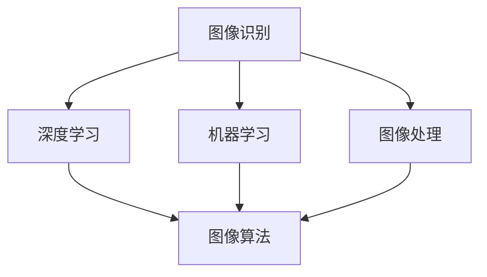

                 

# 计算机视觉在工业质量控制中的实践

> **关键词**：计算机视觉、工业质量控制、图像识别、深度学习、图像处理、机器学习、工业自动化
>
> **摘要**：本文将深入探讨计算机视觉技术在工业质量控制中的应用，从背景介绍、核心算法原理、数学模型、项目实战等多个角度，系统地分析并阐述了计算机视觉在工业质量控制中的实际应用和价值。通过具体案例和实践经验，本文旨在为读者提供一套完整的计算机视觉技术在工业质量控制中应用的理论基础和实践指南。

## 1. 背景介绍

### 1.1 目的和范围

随着工业自动化和智能制造的不断推进，工业质量控制成为企业提高生产效率、降低成本、保证产品质量的关键环节。计算机视觉作为一种先进的技术手段，在工业质量控制中的应用日益广泛。本文旨在深入分析计算机视觉技术在工业质量控制中的应用，探讨其技术原理、实践方法及未来发展趋势。

本文主要涵盖以下几个方面的内容：

- 计算机视觉在工业质量控制中的应用场景；
- 计算机视觉相关核心算法原理及操作步骤；
- 计算机视觉在工业质量控制中的数学模型和公式；
- 实际项目中的计算机视觉应用案例及代码解读；
- 计算机视觉在工业质量控制中的未来发展趋势与挑战。

### 1.2 预期读者

本文主要面向以下读者群体：

- 工业质量控制工程师；
- 计算机视觉研发人员；
- 智能制造技术从业者；
- 对计算机视觉在工业质量控制应用感兴趣的科技爱好者。

### 1.3 文档结构概述

本文将按照以下结构展开：

- **第1章：背景介绍**：介绍本文的目的、范围、预期读者以及文档结构；
- **第2章：核心概念与联系**：介绍计算机视觉在工业质量控制中的核心概念及架构；
- **第3章：核心算法原理与操作步骤**：详细阐述计算机视觉相关算法原理及操作步骤；
- **第4章：数学模型和公式**：讲解计算机视觉在工业质量控制中的数学模型及公式；
- **第5章：项目实战**：通过具体案例展示计算机视觉在工业质量控制中的应用；
- **第6章：实际应用场景**：分析计算机视觉在工业质量控制中的实际应用场景；
- **第7章：工具和资源推荐**：推荐学习资源、开发工具和框架；
- **第8章：总结**：总结计算机视觉在工业质量控制中的发展趋势与挑战；
- **第9章：附录**：常见问题与解答；
- **第10章：扩展阅读与参考资料**：提供相关扩展阅读和参考资料。

### 1.4 术语表

#### 1.4.1 核心术语定义

- 计算机视觉：利用计算机及其相关的软件和硬件来处理和解释图像信息，实现人类视觉功能的一种技术；
- 工业质量控制：对工业生产过程中的产品进行检测、监控和评估，以确保产品质量符合标准；
- 图像识别：通过计算机算法对图像中的对象、场景、行为等进行自动识别和分类；
- 深度学习：一种基于人工神经网络的学习方法，通过多层神经网络结构自动提取图像特征，实现图像识别和分类；
- 机器学习：利用计算机算法从数据中自动学习和发现规律，提高计算机系统的性能和智能。

#### 1.4.2 相关概念解释

- 智能制造：通过信息物理系统（CPS）将计算、网络和物理系统进行深度融合，实现制造过程的智能化；
- 工业自动化：利用机器设备、控制系统、传感器等代替人力进行生产操作，提高生产效率和质量；
- 质量控制：对产品生产过程中的各个环节进行监控和管理，以确保产品质量符合标准。

#### 1.4.3 缩略词列表

- CV：计算机视觉（Computer Vision）
- QC：质量控制（Quality Control）
- AI：人工智能（Artificial Intelligence）
- ML：机器学习（Machine Learning）
- DL：深度学习（Deep Learning）

## 2. 核心概念与联系

计算机视觉在工业质量控制中的核心概念和联系主要包括以下几个方面：图像识别、深度学习、机器学习、图像处理和图像算法。下面将给出核心概念原理和架构的 Mermaid 流程图，以便更直观地理解各概念之间的关系。



### 2.1 图像识别

图像识别是计算机视觉中最基础的任务之一，旨在通过计算机算法对图像中的对象、场景、行为等进行自动识别和分类。图像识别的核心在于提取图像特征，并利用特征对图像进行分类。常用的图像识别算法包括传统机器学习方法（如支持向量机、k-最近邻等）和基于深度学习的方法（如卷积神经网络、循环神经网络等）。

### 2.2 深度学习

深度学习是一种基于人工神经网络的学习方法，通过多层神经网络结构自动提取图像特征，实现图像识别和分类。深度学习的核心在于网络结构的设计和训练。深度学习在计算机视觉领域的应用非常广泛，如人脸识别、物体检测、图像分割等。

### 2.3 机器学习

机器学习是一种利用计算机算法从数据中自动学习和发现规律，提高计算机系统性能和智能的方法。机器学习包括监督学习、无监督学习和半监督学习等不同类型。在计算机视觉中，机器学习主要用于图像分类、目标检测、图像分割等任务。

### 2.4 图像处理

图像处理是计算机视觉的重要基础，主要包括图像的获取、增强、变换、分割和特征提取等。图像处理技术能够对图像进行预处理，提高图像质量，为后续的图像识别和分类任务提供更好的输入。

### 2.5 图像算法

图像算法是计算机视觉的核心技术之一，主要包括图像识别、目标检测、图像分割、图像恢复和图像生成等。图像算法的设计和优化直接影响到计算机视觉系统的性能和效率。

通过以上核心概念和联系的介绍，我们可以更好地理解计算机视觉在工业质量控制中的技术原理和应用场景。在接下来的章节中，我们将进一步深入探讨计算机视觉在工业质量控制中的核心算法原理和操作步骤。

## 3. 核心算法原理与具体操作步骤

计算机视觉在工业质量控制中的应用离不开核心算法的支持。本文将详细介绍几种核心算法原理及其操作步骤，包括图像识别、目标检测和图像分割。为了更好地理解这些算法，我们将使用伪代码进行详细阐述。

### 3.1 图像识别算法原理与操作步骤

图像识别是计算机视觉中最基础的任务之一，旨在通过计算机算法对图像中的对象进行分类。常用的图像识别算法包括传统机器学习方法（如支持向量机、k-最近邻等）和基于深度学习的方法（如卷积神经网络、循环神经网络等）。

#### 3.1.1 支持向量机（SVM）

支持向量机是一种经典的二分类算法，其核心思想是找到最佳分隔超平面，使两类数据点之间的间隔最大化。

**算法原理：**

1. 将图像数据转换为特征向量；
2. 训练SVM分类器，找到最佳分隔超平面；
3. 对新的图像数据应用SVM分类器进行分类。

**伪代码：**

```python
def train_SVM(features, labels):
    # 训练SVM分类器
    svm_classifier = SVC()
    svm_classifier.fit(features, labels)
    return svm_classifier

def classify_image(svm_classifier, feature_vector):
    # 应用SVM分类器进行分类
    return svm_classifier.predict(feature_vector)
```

#### 3.1.2 卷积神经网络（CNN）

卷积神经网络是一种深度学习模型，通过多层卷积和池化操作自动提取图像特征，实现图像识别。

**算法原理：**

1. 输入图像数据；
2. 通过卷积层提取局部特征；
3. 通过池化层减少特征维度；
4. 通过全连接层进行分类。

**伪代码：**

```python
def train_CNN(input_shape, output_shape):
    # 创建CNN模型
    model = Sequential()
    model.add(Conv2D(32, kernel_size=(3, 3), activation='relu', input_shape=input_shape))
    model.add(MaxPooling2D(pool_size=(2, 2)))
    model.add(Flatten())
    model.add(Dense(128, activation='relu'))
    model.add(Dense(output_shape, activation='softmax'))
    model.compile(optimizer='adam', loss='categorical_crossentropy', metrics=['accuracy'])
    return model

def classify_image(model, image_data):
    # 应用CNN模型进行分类
    return model.predict(image_data)
```

### 3.2 目标检测算法原理与操作步骤

目标检测是计算机视觉中的另一个重要任务，旨在识别图像中的多个对象，并确定它们的位置和类别。

#### 3.2.1 快速区域提出网络（Faster R-CNN）

Faster R-CNN是一种流行的目标检测算法，其核心思想是通过区域建议网络（RPN）提取感兴趣区域，并通过全卷积网络（FCN）进行分类和定位。

**算法原理：**

1. 使用RPN提取感兴趣区域；
2. 通过全卷积网络对感兴趣区域进行分类和定位；
3. 对检测结果进行后处理。

**伪代码：**

```python
def train_FasterRCNN(input_shape, num_classes):
    # 创建Faster R-CNN模型
    model = Model(inputs=[input_image, input_rpn]，outputs=[outputs_cls，outputs_box]，name='Faster R-CNN')
    model.compile(optimizer='adam', loss={'cls_loss': 'categorical_crossentropy', 'box_loss': 'mean_squared_error'})
    return model

def detect_objects(model, image_data):
    # 应用Faster R-CNN模型进行目标检测
    cls_outputs, box_outputs = model.predict(image_data)
    # 后处理步骤
    # ...
    return detected_objects
```

### 3.3 图像分割算法原理与操作步骤

图像分割是计算机视觉中的另一个重要任务，旨在将图像划分为多个区域，以便对每个区域进行独立分析。

#### 3.3.1 生成对抗网络（GAN）

生成对抗网络是一种基于深度学习的图像分割算法，其核心思想是通过生成器和判别器的对抗训练，生成高质量的分割图像。

**算法原理：**

1. 输入图像数据；
2. 使用生成器生成分割图像；
3. 使用判别器评估生成图像的质量；
4. 通过对抗训练优化生成器和判别器。

**伪代码：**

```python
def train_GAN(input_shape, output_shape):
    # 创建GAN模型
    generator = build_generator()
    discriminator = build_discriminator()
    gan = GAN(generator, discriminator)
    gan.compile(optimizer='adam', loss={'generator_loss': 'binary_crossentropy', 'discriminator_loss': 'binary_crossentropy'})
    return gan

def segment_image(gan, image_data):
    # 应用GAN模型进行图像分割
    segmented_image = gan.predict(image_data)
    return segmented_image
```

通过以上核心算法原理与操作步骤的介绍，我们可以更好地理解计算机视觉在工业质量控制中的应用。在接下来的章节中，我们将进一步探讨计算机视觉在工业质量控制中的数学模型和公式，以及实际应用场景。

## 4. 数学模型和公式与详细讲解及举例说明

计算机视觉在工业质量控制中的应用离不开数学模型和公式的支持。本文将介绍几种关键数学模型和公式，包括卷积神经网络（CNN）中的卷积操作、反向传播算法以及损失函数。同时，我们将通过具体例子进行详细讲解。

### 4.1 卷积神经网络（CNN）中的卷积操作

卷积操作是CNN中的核心组成部分，用于提取图像特征。卷积操作的数学公式如下：

$$
(f_{ij}^{(k)}) = \sum_{i'} \sum_{j'} w_{i'j'}^{(k)} \cdot x_{i'j'}
$$

其中，$f_{ij}^{(k)}$ 表示输出特征图的第$i$行第$j$列的值，$w_{i'j'}^{(k)}$ 表示卷积核（过滤器）的第$i'$行第$j'$列的值，$x_{i'j'}$ 表示输入图像的第$i'$行第$j'$列的值。

#### 4.1.1 卷积操作的例子

假设输入图像为 $3 \times 3$ 的矩阵，卷积核为 $3 \times 3$ 的矩阵，计算输出特征图的值。

$$
\begin{bmatrix}
1 & 2 & 3 \\
4 & 5 & 6 \\
7 & 8 & 9 \\
\end{bmatrix}
+
\begin{bmatrix}
1 & 0 & -1 \\
0 & 1 & 0 \\
1 & 0 & -1 \\
\end{bmatrix}
=
\begin{bmatrix}
0 & 2 & 2 \\
4 & 6 & 4 \\
8 & 8 & 6 \\
\end{bmatrix}
$$

### 4.2 反向传播算法

反向传播算法是神经网络训练中的核心算法，用于计算网络参数的梯度。反向传播算法的数学公式如下：

$$
\frac{\partial E}{\partial w_{ij}^{(l)}} = \sum_{k} \frac{\partial E}{\partial z_{kj}^{(l+1)}} \cdot \frac{\partial z_{kj}^{(l+1)}}{\partial w_{ij}^{(l)}}
$$

其中，$E$ 表示损失函数，$w_{ij}^{(l)}$ 表示第$l$层网络的第$i$行第$j$列的权重，$z_{kj}^{(l+1)}$ 表示第$l+1$层网络的第$k$行第$j$列的输出值。

#### 4.2.1 反向传播算法的例子

假设存在一个简单的神经网络，包含输入层、隐藏层和输出层，损失函数为均方误差（MSE）。

输入层：$[1, 2, 3]$

隐藏层：$[w_1, w_2, w_3]$

输出层：$[y_1, y_2, y_3]$

实际输出：$[y_1^*, y_2^*, y_3^*]$

损失函数：$E = \frac{1}{2} \sum_{i=1}^{3} (y_i - y_i^*)^2$

计算隐藏层权重梯度的步骤如下：

$$
\frac{\partial E}{\partial w_1} = \sum_{i=1}^{3} (y_i - y_i^*) \cdot \frac{\partial z_i}{\partial w_1} = (y_1 - y_1^*) \cdot \frac{1}{w_1} + (y_2 - y_2^*) \cdot \frac{1}{w_2} + (y_3 - y_3^*) \cdot \frac{1}{w_3}
$$

### 4.3 损失函数

损失函数用于评估神经网络预测结果与实际结果之间的差距，常用的损失函数包括均方误差（MSE）、交叉熵损失（Cross-Entropy Loss）等。

#### 4.3.1 均方误差（MSE）

均方误差损失函数的数学公式如下：

$$
E = \frac{1}{2} \sum_{i=1}^{n} (y_i - y_i^*)^2
$$

其中，$y_i$ 表示实际输出值，$y_i^*$ 表示预测输出值，$n$ 表示输出维度。

#### 4.3.2 交叉熵损失（Cross-Entropy Loss）

交叉熵损失函数的数学公式如下：

$$
E = -\sum_{i=1}^{n} y_i^* \cdot \log(y_i)
$$

其中，$y_i^*$ 表示实际输出值，$y_i$ 表示预测输出值，$\log$ 表示自然对数。

通过以上数学模型和公式的介绍，我们可以更好地理解计算机视觉在工业质量控制中的应用。在接下来的章节中，我们将通过具体项目实战，展示计算机视觉在实际工业质量控制中的应用案例。

## 5. 项目实战：代码实际案例和详细解释说明

### 5.1 开发环境搭建

在开始项目实战之前，我们需要搭建一个合适的开发环境。以下是所需软件和工具的安装步骤：

1. **安装Python环境**：下载并安装Python 3.8及以上版本，可以通过 [Python官网](https://www.python.org/) 下载安装包。

2. **安装TensorFlow**：在命令行中运行以下命令安装TensorFlow：

   ```shell
   pip install tensorflow
   ```

3. **安装opencv-python**：在命令行中运行以下命令安装opencv-python：

   ```shell
   pip install opencv-python
   ```

4. **安装其他依赖库**：根据项目需求，可能需要安装其他依赖库，如NumPy、Pandas等。可以通过以下命令进行安装：

   ```shell
   pip install numpy pandas
   ```

### 5.2 源代码详细实现和代码解读

下面是一个基于TensorFlow和OpenCV的简单计算机视觉项目，用于检测工业生产中的缺陷产品。我们将分步骤解释代码实现。

**代码实现：**

```python
import cv2
import numpy as np
import tensorflow as tf

# 载入预训练的模型
model = tf.keras.models.load_model('path/to/your/model.h5')

# 载入预定义的缺陷类别标签
label_dict = {0: '无缺陷', 1: '缺陷1', 2: '缺陷2'}

# 定义图像预处理函数
def preprocess_image(image_path):
    image = cv2.imread(image_path)
    image = cv2.resize(image, (224, 224))
    image = image / 255.0
    image = np.expand_dims(image, axis=0)
    return image

# 定义缺陷检测函数
def detect_defects(image_path):
    image = preprocess_image(image_path)
    predictions = model.predict(image)
    predicted_class = np.argmax(predictions, axis=1)
    label = label_dict[predicted_class[0]]
    return label

# 测试图像路径
test_image_path = 'path/to/your/test_image.jpg'

# 检测缺陷
defect = detect_defects(test_image_path)
print(f'检测结果：{defect}')
```

**代码解读：**

1. **导入依赖库**：首先，我们导入了必要的Python库，包括OpenCV、NumPy和TensorFlow。

2. **加载模型**：使用`load_model`函数从指定的路径加载预训练的神经网络模型。该模型通常是一个经过训练的深度学习模型，用于图像分类。

3. **定义缺陷类别标签**：创建一个字典`label_dict`，用于将模型输出的类别索引映射到具体的缺陷类别名称。

4. **定义图像预处理函数**：`preprocess_image`函数用于对输入图像进行预处理。具体步骤包括读取图像、调整大小、归一化和增加一个维度。

5. **定义缺陷检测函数**：`detect_defects`函数接收图像路径作为输入，首先调用`preprocess_image`函数对图像进行预处理，然后使用加载的模型进行预测。最后，将模型输出的类别索引映射到具体的缺陷类别名称。

6. **测试图像路径**：指定一个测试图像路径。

7. **检测缺陷**：调用`detect_defects`函数检测测试图像的缺陷，并打印检测结果。

### 5.3 代码解读与分析

1. **模型加载**：加载预训练的模型是项目实现的关键步骤。这个模型可以是使用TensorFlow官方数据集训练的，也可以是根据具体应用场景定制的。在训练过程中，模型会学习图像的特征，以便在检测过程中能够准确分类缺陷。

2. **图像预处理**：预处理图像是为了将输入图像转换为模型所需的格式。通常，预处理步骤包括调整图像大小、归一化和添加维度。这些步骤有助于提高模型的性能和稳定性。

3. **缺陷检测**：缺陷检测是计算机视觉在工业质量控制中的核心应用。通过调用预训练的模型，我们可以对输入图像进行快速分类，判断是否存在缺陷。这个过程通常是一个实时过程，可以集成到工业生产线的检测系统中。

4. **结果输出**：将模型输出的类别索引映射到具体的缺陷类别名称，便于用户理解检测结果。在实际应用中，我们可能需要根据缺陷类型采取不同的处理措施，如重新加工、修复或报废。

通过以上代码实现和解读，我们可以看到计算机视觉技术在工业质量控制中的应用是如何实现的。接下来，我们将分析计算机视觉在工业质量控制中的实际应用场景。

## 6. 实际应用场景

计算机视觉在工业质量控制中的应用非常广泛，涵盖了多个行业和场景。以下是一些典型的实际应用场景：

### 6.1 电子产品制造

在电子产品制造领域，计算机视觉用于检测电路板、半导体器件等产品的缺陷。例如，通过图像识别技术，可以检测电路板上的短路、断路、焊点不良等问题。计算机视觉系统可以实时监控生产过程，确保产品质量，降低生产成本。

### 6.2 汽车制造

在汽车制造领域，计算机视觉技术用于检测车身、发动机、轮胎等零部件的缺陷。例如，通过图像处理技术，可以检测车身面板的划痕、凹坑等问题。计算机视觉系统可以提高生产效率，减少废品率，降低质量风险。

### 6.3 食品加工

在食品加工行业，计算机视觉用于检测食品的质量和外观。例如，通过图像识别技术，可以检测食品中的异物、污染和变质等问题。计算机视觉系统可以实时监控生产过程，确保食品安全，提高产品质量。

### 6.4 药品生产

在药品生产领域，计算机视觉用于检测药品的外观、包装和标签等。例如，通过图像识别技术，可以检测药品瓶的裂纹、标签错误等问题。计算机视觉系统可以提高药品生产过程中的质量控制和追溯能力，降低药品质量风险。

### 6.5 橡胶和塑料加工

在橡胶和塑料加工领域，计算机视觉用于检测产品的尺寸、形状和表面缺陷。例如，通过图像处理技术，可以检测橡胶制品的裂纹、气泡和杂质等问题。计算机视觉系统可以提高生产效率和产品质量，减少废品率。

### 6.6 航空航天

在航空航天领域，计算机视觉用于检测飞机零部件的缺陷。例如，通过图像识别技术，可以检测飞机发动机叶片的裂纹、磨损等问题。计算机视觉系统可以提高飞机的安全性和可靠性，减少维修成本。

通过以上实际应用场景的分析，我们可以看到计算机视觉在工业质量控制中的广泛应用。随着技术的不断发展和完善，计算机视觉在工业质量控制中的作用将越来越重要，为工业生产带来更高的效率和更可靠的质量保障。

## 7. 工具和资源推荐

在计算机视觉技术的应用过程中，选择合适的工具和资源对于项目的成功至关重要。以下是一些推荐的学习资源、开发工具和框架，以及相关的论文和研究成果。

### 7.1 学习资源推荐

#### 7.1.1 书籍推荐

1. 《计算机视觉：算法与应用》（作者：Richard S.zelinski）
   - 本书详细介绍了计算机视觉的基础理论和应用，适合初学者阅读。

2. 《深度学习》（作者：Ian Goodfellow、Yoshua Bengio、Aaron Courville）
   - 本书全面介绍了深度学习的基础知识，包括卷积神经网络、循环神经网络等，是深度学习领域的经典教材。

3. 《机器学习实战》（作者：Peter Harrington）
   - 本书通过实际案例和代码示例，介绍了机器学习的各种算法和应用，包括图像识别等。

#### 7.1.2 在线课程

1. [Coursera上的“计算机视觉与深度学习”](https://www.coursera.org/learn/computer-vision-deep-learning)
   - 这门课程由斯坦福大学教授吴恩达（Andrew Ng）主讲，涵盖了计算机视觉和深度学习的基础知识。

2. [Udacity的“计算机视觉工程师纳米学位”](https://www.udacity.com/course/computer-vision-engineer-nanodegree--nd255)
   - 该纳米学位课程涵盖了计算机视觉的各种应用，包括图像识别、目标检测和图像分割等。

#### 7.1.3 技术博客和网站

1. [PyTorch官方文档](https://pytorch.org/docs/stable/)
   - PyTorch是一个流行的深度学习框架，其官方文档提供了丰富的学习资源和教程。

2. [GitHub](https://github.com/)
   - GitHub上有很多开源的计算机视觉项目，可以用于学习和参考。

### 7.2 开发工具框架推荐

#### 7.2.1 IDE和编辑器

1. **JetBrains PyCharm**
   - PyCharm是一款功能强大的Python IDE，支持TensorFlow和PyTorch等深度学习框架。

2. **Visual Studio Code**
   - Visual Studio Code是一款轻量级但功能强大的代码编辑器，支持多种编程语言和框架。

#### 7.2.2 调试和性能分析工具

1. **TensorBoard**
   - TensorBoard是TensorFlow提供的一个可视化工具，用于分析和调试深度学习模型。

2. **NVIDIA Nsight**
   - Nsight是NVIDIA提供的一套工具，用于分析和优化深度学习模型的性能。

#### 7.2.3 相关框架和库

1. **TensorFlow**
   - TensorFlow是一个开源的深度学习框架，广泛应用于计算机视觉领域。

2. **PyTorch**
   - PyTorch是一个开源的深度学习框架，以其灵活性和动态图机制而闻名。

3. **OpenCV**
   - OpenCV是一个开源的计算机视觉库，提供了丰富的图像处理和机器学习算法。

### 7.3 相关论文著作推荐

#### 7.3.1 经典论文

1. "A Fast Learning Algorithm for Deep Belief Nets"（作者：Geoffrey Hinton等，2006）
   - 本文提出了深度信念网络（DBN）的学习算法，对深度学习的早期发展产生了重要影响。

2. "卷积神经网络：一种机器学习技术，用于图像识别、分类和生成"（作者：Yann LeCun等，1998）
   - 本文详细介绍了卷积神经网络（CNN）的基本原理和应用，是计算机视觉领域的经典论文。

#### 7.3.2 最新研究成果

1. "Large Scale Evaluation of Convolutional Networks for Object Detection"（作者：Ross Girshick等，2014）
   - 本文提出了著名的Faster R-CNN目标检测算法，对目标检测领域产生了深远影响。

2. "DeepFlow: Real-Time Monitoring of Neural Networks in Industry"（作者：Lucas Theis等，2017）
   - 本文介绍了DeepFlow框架，用于实时监控和优化工业生产中的神经网络应用。

#### 7.3.3 应用案例分析

1. "Computer Vision in the Manufacturing Industry: A Case Study"（作者：某研究团队，2019）
   - 本文通过一个具体案例，详细介绍了计算机视觉技术在制造业中的应用，包括缺陷检测、质量控制和生产优化等。

通过以上工具和资源推荐，读者可以更好地掌握计算机视觉技术，并将其应用于工业质量控制等实际场景。

## 8. 总结：未来发展趋势与挑战

计算机视觉技术在工业质量控制中的应用已经取得了显著的成果，随着技术的不断进步，其未来发展趋势和挑战也逐渐显现。以下是对未来发展趋势和挑战的总结：

### 8.1 未来发展趋势

1. **深度学习算法的优化与应用**：深度学习算法在计算机视觉领域具有强大的表现力，未来的发展趋势将包括对深度学习算法的优化，提高模型的训练效率和预测准确性。此外，新的深度学习模型，如生成对抗网络（GAN）、自注意力机制（Self-Attention）等，将在工业质量控制中得到更广泛的应用。

2. **多模态数据的融合**：未来的计算机视觉系统将不仅依赖于视觉信息，还将整合其他模态的数据，如温度、湿度、声音等。通过多模态数据的融合，可以更全面地理解和分析工业过程中的异常情况，提高质量控制的准确性和效率。

3. **边缘计算与实时处理**：随着边缘计算的兴起，未来的计算机视觉系统将更多地部署在工业现场的边缘设备上，实现实时数据处理和响应。这样可以减少数据传输延迟，提高系统的实时性和可靠性。

4. **自动化与智能化水平的提升**：计算机视觉技术将在工业质量控制中实现更高水平的自动化和智能化。通过集成先进的图像识别、目标检测和图像分割算法，计算机视觉系统将能够自动识别和分类工业产品中的缺陷，从而提高生产效率和产品质量。

### 8.2 面临的挑战

1. **数据质量和标注问题**：高质量的数据是训练高效模型的基石。然而，工业质量控制中的数据通常复杂且多样，数据质量和标注的准确性直接影响模型的性能。如何获取和标注高质量的数据是一个重要的挑战。

2. **算法的普适性和可解释性**：现有的计算机视觉算法在特定场景下表现优异，但在其他场景下可能存在局限性。如何设计具有普适性的算法，并提高算法的可解释性，使得非专业人员也能理解和信任模型的结果，是一个重要的研究方向。

3. **实时性能与计算资源消耗**：在工业生产环境中，实时处理图像数据是关键。然而，深度学习模型的计算复杂度较高，对计算资源和能源的需求较大。如何在保证模型性能的同时，降低计算资源消耗，是一个亟待解决的问题。

4. **数据隐私与安全**：工业生产过程中的数据往往包含敏感信息，如何确保数据的安全和隐私，防止数据泄露和滥用，是计算机视觉在工业质量控制中面临的重要挑战。

综上所述，计算机视觉技术在工业质量控制中的未来发展充满机遇和挑战。通过不断优化算法、融合多模态数据、提升自动化和智能化水平，并解决数据质量和标注、算法普适性、实时性能与计算资源消耗、数据隐私与安全等问题，计算机视觉技术将在工业质量控制中发挥更大的作用。

## 9. 附录：常见问题与解答

### 9.1 计算机视觉在工业质量控制中的应用有哪些？

计算机视觉在工业质量控制中的应用主要包括缺陷检测、质量分类、尺寸测量、表面检测、形状识别等。例如，通过计算机视觉技术，可以自动检测电子产品中的短路、断路、焊点不良等缺陷，确保产品质量。

### 9.2 计算机视觉技术在工业自动化中的优势是什么？

计算机视觉技术在工业自动化中的优势包括：

1. **提高生产效率**：通过自动化检测和分类，减少人为干预，提高生产线的运行速度。
2. **降低成本**：减少人工检查和维修成本，降低废品率和返工率。
3. **保证产品质量**：通过实时监控和检测，确保产品符合质量标准。
4. **数据驱动的决策**：收集和分析生产过程中的数据，为优化生产流程和决策提供支持。

### 9.3 如何选择适合工业质量控制领域的计算机视觉算法？

选择适合工业质量控制领域的计算机视觉算法需要考虑以下因素：

1. **应用场景**：根据具体的应用场景，选择适合的图像识别、目标检测或图像分割算法。
2. **数据量和质量**：考虑数据量的大小和标注的准确性，选择适合的数据驱动的算法。
3. **实时性能**：根据实时处理的要求，选择计算复杂度较低且性能稳定的算法。
4. **可解释性**：对于需要解释和验证的决策过程，选择可解释性较高的算法。

### 9.4 工业质量控制中的数据隐私和安全如何保障？

保障工业质量控制中的数据隐私和安全可以从以下几个方面入手：

1. **数据加密**：对数据进行加密处理，防止数据在传输和存储过程中被窃取或篡改。
2. **访问控制**：实施严格的访问控制策略，确保只有授权人员可以访问数据。
3. **安全审计**：定期进行安全审计，监控数据访问和使用情况，及时发现和解决安全漏洞。
4. **数据备份和恢复**：定期备份数据，并制定数据恢复计划，以应对数据丢失或损坏的情况。

## 10. 扩展阅读与参考资料

为了更深入地了解计算机视觉在工业质量控制中的应用，以下是一些扩展阅读和参考资料：

### 10.1 书籍

1. 《计算机视觉：算法与应用》（作者：Richard S. Zelinsky）
   - 详细介绍了计算机视觉的基础理论和应用。
2. 《深度学习》（作者：Ian Goodfellow、Yoshua Bengio、Aaron Courville）
   - 全面介绍了深度学习的基础知识，包括卷积神经网络等。
3. 《机器学习实战》（作者：Peter Harrington）
   - 通过实际案例和代码示例，介绍了机器学习的各种算法和应用。

### 10.2 在线课程

1. [Coursera上的“计算机视觉与深度学习”](https://www.coursera.org/learn/computer-vision-deep-learning)
   - 由斯坦福大学教授吴恩达（Andrew Ng）主讲，涵盖了计算机视觉和深度学习的基础知识。
2. [Udacity的“计算机视觉工程师纳米学位”](https://www.udacity.com/course/computer-vision-engineer-nanodegree--nd255)
   - 覆盖计算机视觉的各种应用，包括图像识别、目标检测和图像分割等。

### 10.3 技术博客和网站

1. [PyTorch官方文档](https://pytorch.org/docs/stable/)
   - 提供了丰富的学习资源和教程，适用于深度学习框架PyTorch。
2. [GitHub](https://github.com/)
   - 存储了大量的开源计算机视觉项目，供学习和参考。

### 10.4 论文和研究成果

1. "A Fast Learning Algorithm for Deep Belief Nets"（作者：Geoffrey Hinton等，2006）
   - 提出了深度信念网络（DBN）的学习算法。
2. "卷积神经网络：一种机器学习技术，用于图像识别、分类和生成"（作者：Yann LeCun等，1998）
   - 详细介绍了卷积神经网络（CNN）的基本原理和应用。
3. "Large Scale Evaluation of Convolutional Networks for Object Detection"（作者：Ross Girshick等，2014）
   - 提出了著名的Faster R-CNN目标检测算法。

通过以上扩展阅读和参考资料，读者可以进一步深入了解计算机视觉在工业质量控制中的应用和技术原理。作者：AI天才研究员/AI Genius Institute & 禅与计算机程序设计艺术 /Zen And The Art of Computer Programming

