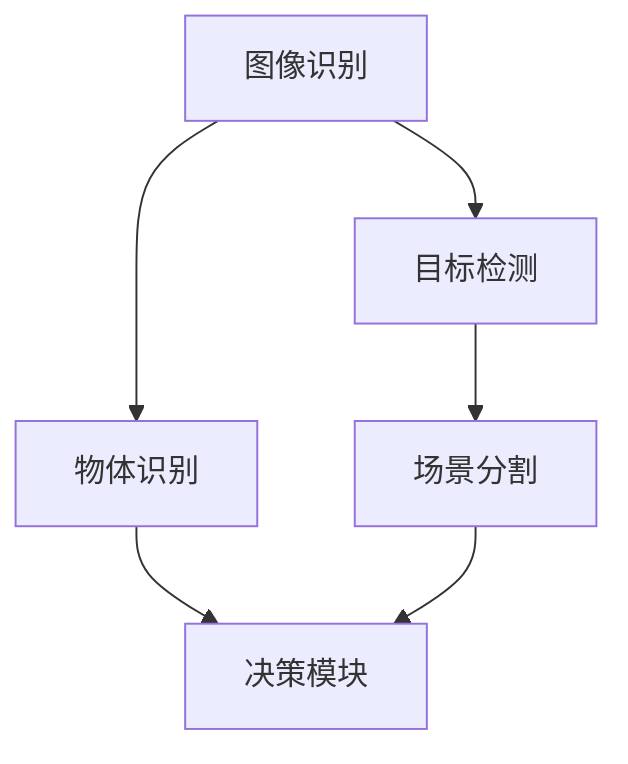

                 

# 计算机视觉在自动驾驶场景理解中的应用

## 关键词

- 计算机视觉
- 自动驾驶
- 场景理解
- 人工智能
- 深度学习
- 卷积神经网络

## 摘要

本文将深入探讨计算机视觉在自动驾驶场景理解中的应用。首先，我们将介绍自动驾驶的发展背景和重要性，随后详细阐述计算机视觉在自动驾驶中的关键作用。接着，我们将逐步讲解计算机视觉的核心概念、算法原理、数学模型，并展示一个实际项目案例。最后，我们将分析计算机视觉在自动驾驶领域的实际应用场景，并推荐相关的学习资源和工具，总结未来发展趋势与挑战。

## 1. 背景介绍

### 1.1 目的和范围

本文的目的是介绍计算机视觉在自动驾驶场景理解中的应用，帮助读者了解该领域的关键技术和发展现状。文章将涵盖从基础概念到实际应用的全过程，旨在为从事自动驾驶领域的研究人员和开发者提供有价值的参考。

### 1.2 预期读者

- 计算机视觉和自动驾驶领域的科研人员
- 自动驾驶车辆开发工程师
- 对自动驾驶技术有兴趣的读者

### 1.3 文档结构概述

本文分为十个部分：
1. 背景介绍
2. 核心概念与联系
3. 核心算法原理 & 具体操作步骤
4. 数学模型和公式 & 详细讲解 & 举例说明
5. 项目实战：代码实际案例和详细解释说明
6. 实际应用场景
7. 工具和资源推荐
8. 总结：未来发展趋势与挑战
9. 附录：常见问题与解答
10. 扩展阅读 & 参考资料

### 1.4 术语表

#### 1.4.1 核心术语定义

- 计算机视觉：指利用计算机和算法对图像或视频进行分析和处理的技术。
- 自动驾驶：指车辆在无需人工干预的情况下，通过传感器、控制器和算法实现自主行驶的技术。
- 场景理解：指自动驾驶系统对环境进行感知和理解，从而做出相应决策的过程。

#### 1.4.2 相关概念解释

- 传感器：自动驾驶系统中用于获取环境信息的设备，如摄像头、激光雷达、超声波传感器等。
- 深度学习：一种人工智能方法，通过模拟人脑神经网络的结构和功能，对大规模数据进行分析和建模。
- 卷积神经网络（CNN）：一种深度学习模型，广泛应用于图像和视频处理任务。

#### 1.4.3 缩略词列表

- AI：人工智能
- CNN：卷积神经网络
- CUDA：计算统一设备架构
- GPU：图形处理单元
- LSTM：长短期记忆网络
- RNN：循环神经网络

## 2. 核心概念与联系

在自动驾驶场景理解中，计算机视觉的核心概念包括图像识别、目标检测、场景分割等。这些概念之间有着密切的联系，共同构成了一个完整的技术体系。

### 图像识别

图像识别是计算机视觉的基础，其主要任务是识别和分类图像中的物体。在自动驾驶场景中，图像识别用于识别道路标志、交通信号灯、行人等关键元素。

### 目标检测

目标检测是在图像中定位并识别特定物体的技术。在自动驾驶领域，目标检测用于检测车辆、行人、道路等对象，以便进行后续的场景理解和决策。

### 场景分割

场景分割是将图像分割成不同的区域，以便对每个区域进行独立分析。在自动驾驶中，场景分割有助于识别道路的不同部分，如车道线、斑马线、停车区域等。

以下是计算机视觉在自动驾驶场景理解中的核心概念和联系的 Mermaid 流程图：



## 3. 核心算法原理 & 具体操作步骤

计算机视觉在自动驾驶场景理解中主要依赖于深度学习算法，尤其是卷积神经网络（CNN）。以下是核心算法原理和具体操作步骤的讲解。

### 卷积神经网络（CNN）

卷积神经网络是一种特殊的神经网络，主要用于图像和视频处理。CNN 通过多个卷积层、池化层和全连接层对输入图像进行特征提取和分类。

#### 具体操作步骤

1. **卷积层**：将输入图像与卷积核进行卷积操作，生成特征图。
2. **池化层**：对特征图进行下采样，减少数据维度。
3. **全连接层**：将卷积层和池化层提取的特征映射到分类结果。
4. **激活函数**：对全连接层的输出进行激活，如使用 softmax 函数进行多分类。

以下是 CNN 的伪代码：

```python
def conv2d(input, filter):
    return sum(input * filter)

def pool2d(feature_map, pool_size):
    return max_pooling(feature_map, pool_size)

def forward_pass(input_image, weights, biases):
    layer_output = input_image
    for layer in range(num_layers):
        layer_output = conv2d(layer_output, weights[layer])
        layer_output = pool2d(layer_output, pool_size)
        layer_output = activation_function(layer_output)
    return layer_output
```

### 目标检测算法

目标检测算法用于在图像中识别和定位特定物体。一种常用的目标检测算法是 YOLO（You Only Look Once），它通过将图像分割成多个网格单元，并在每个单元中预测物体的位置和类别。

#### 具体操作步骤

1. **图像分割**：将输入图像分割成多个网格单元。
2. **预测物体位置和类别**：在每个网格单元中预测物体的边界框和类别。
3. **非极大值抑制（NMS）**：对重叠的边界框进行合并，保留最可能正确的边界框。
4. **后处理**：对检测结果进行后处理，如置信度阈值调整、去除低置信度目标等。

以下是 YOLO 的伪代码：

```python
def detect_objects(image, grid_size, anchors, classes):
    feature_map = forward_pass(image, weights, biases)
    boxes = predict_boxes(feature_map, grid_size, anchors, classes)
    boxes = non_max_suppression(boxes, iou_threshold, confidence_threshold)
    return boxes
```

### 场景分割算法

场景分割算法用于将图像分割成不同的区域，以便对每个区域进行独立分析。一种常用的场景分割算法是 FCN（Fully Convolutional Network），它通过将卷积神经网络应用于图像的全局特征，实现像素级别的分类。

#### 具体操作步骤

1. **卷积层**：对输入图像进行卷积操作，提取全局特征。
2. **上采样层**：将卷积层的特征图上采样到原始图像的大小。
3. **分类层**：对上采样后的特征图进行分类，生成分割结果。

以下是 FCN 的伪代码：

```python
def scene_segmentation(image, weights, biases):
    feature_map = forward_pass(image, weights, biases)
    upsampled_map = upsample(feature_map, image_size)
    segmentation_map = classify(upsampled_map, num_classes)
    return segmentation_map
```

## 4. 数学模型和公式 & 详细讲解 & 举例说明

在计算机视觉领域，数学模型和公式是理解和实现核心算法的基础。以下将详细讲解卷积神经网络（CNN）中的关键数学模型和公式，并结合实际案例进行说明。

### 卷积神经网络（CNN）的数学模型

#### 卷积操作

卷积操作是 CNN 的核心，用于提取图像的特征。其数学表达式如下：

$$
(C_{ij}^{(k)}) = \sum_{m=1}^{C_{in}} \sum_{n=1}^{H_{f}} \sum_{p=1}^{W_{f}} W_{mnbp}^{(k)} \times I_{ijm}^{(b)}
$$

其中：
- \( C_{ij}^{(k)} \)：卷积操作的输出特征图
- \( C_{in} \)：输入特征图的通道数
- \( H_{f} \) 和 \( W_{f} \)：卷积核的高度和宽度
- \( W_{mnbp}^{(k)} \)：第 \( k \) 层第 \( m \) 行第 \( n \) 列的卷积核权重
- \( I_{ijm}^{(b)} \)：输入特征图的第 \( i \) 行第 \( j \) 列第 \( b \) 个通道的像素值

#### 池化操作

池化操作用于减少特征图的维度，常用的池化方法有最大池化和平均池化。最大池化的数学表达式如下：

$$
P_{ij}^{(k)} = \max \{ I_{ij1}^{(b)}, I_{ij2}^{(b)}, \ldots, I_{ijH_{f}W_{f}}^{(b)} \}
$$

其中：
- \( P_{ij}^{(k)} \)：池化后的特征图
- \( I_{ij1}^{(b)}, I_{ij2}^{(b)}, \ldots, I_{ijH_{f}W_{f}}^{(b)} \)：输入特征图上的 \( (i, j) \) 位置上的 \( H_{f}W_{f} \) 个像素值

#### 激活函数

激活函数用于引入非线性特性，常用的激活函数有 sigmoid、ReLU 和 softmax。ReLU 函数的数学表达式如下：

$$
\text{ReLU}(x) = \begin{cases} 
x & \text{if } x \geq 0 \\
0 & \text{if } x < 0 
\end{cases}
$$

#### 前向传播

CNN 的前向传播过程包括卷积、池化和激活函数的循环应用。其伪代码如下：

```python
def forward_pass(image, weights, biases):
    layer_output = image
    for layer in range(num_layers):
        layer_output = conv2d(layer_output, weights[layer])
        layer_output = activation_function(layer_output)
        layer_output = pool2d(layer_output, pool_size)
    return layer_output
```

### 实际案例说明

以下是一个使用卷积神经网络对图像进行分类的实际案例，说明数学模型和公式的应用。

#### 数据集

假设我们有一个包含 1000 个类别的图像数据集，每类有 100 张图片。输入图像的大小为 \( 224 \times 224 \times 3 \)，即 224 个像素宽、224 个像素高，共有 3 个通道（红、绿、蓝）。

#### 模型架构

我们使用一个深度为 5 的卷积神经网络进行图像分类，包括 3 个卷积层、2 个池化层和 1 个全连接层。各层的参数如下：

1. **卷积层 1**：卷积核大小为 \( 3 \times 3 \)，步长为 \( 1 \)，卷积核数量为 32。
2. **池化层 1**：池化窗口大小为 \( 2 \times 2 \)，步长为 \( 2 \)。
3. **卷积层 2**：卷积核大小为 \( 3 \times 3 \)，步长为 \( 1 \)，卷积核数量为 64。
4. **池化层 2**：池化窗口大小为 \( 2 \times 2 \)，步长为 \( 2 \)。
5. **卷积层 3**：卷积核大小为 \( 3 \times 3 \)，步长为 \( 1 \)，卷积核数量为 128。
6. **全连接层**：神经元数量为 1000。

#### 训练过程

我们使用随机梯度下降（SGD）算法进行模型训练，学习率为 0.001。在训练过程中，我们使用交叉熵作为损失函数，并在每个批次上计算损失值。当损失值低于阈值时，停止训练。

#### 代码实现

以下是使用 Python 和 TensorFlow 实现上述卷积神经网络的示例代码：

```python
import tensorflow as tf

# 初始化模型参数
weights = {
    'conv1': tf.random_normal([3, 3, 3, 32]),
    'conv2': tf.random_normal([3, 3, 32, 64]),
    'conv3': tf.random_normal([3, 3, 64, 128]),
    'fc': tf.random_normal([224 * 224 * 128, 1000])
}
biases = {
    'conv1': tf.random_normal([32]),
    'conv2': tf.random_normal([64]),
    'conv3': tf.random_normal([128]),
    'fc': tf.random_normal([1000])
}

# 定义卷积操作
def conv2d(input, weights, biases):
    return tf.nn.relu(tf.nn.conv2d(input, weights, strides=[1, 1, 1, 1], padding='SAME')) + biases

# 定义池化操作
def pool2d(input, pool_size):
    return tf.nn.max_pool(input, ksize=[1, pool_size, pool_size, 1], strides=[1, pool_size, pool_size, 1], padding='SAME')

# 定义前向传播
def forward_pass(image, weights, biases):
    layer_output = image
    layer_output = conv2d(layer_output, weights['conv1'], biases['conv1'])
    layer_output = pool2d(layer_output, 2)
    layer_output = conv2d(layer_output, weights['conv2'], biases['conv2'])
    layer_output = pool2d(layer_output, 2)
    layer_output = conv2d(layer_output, weights['conv3'], biases['conv3'])
    layer_output = pool2d(layer_output, 2)
    layer_output = tf.reshape(layer_output, [-1, 224 * 224 * 128])
    layer_output = tf.nn.relu(tf.matmul(layer_output, weights['fc']) + biases['fc'])
    return layer_output

# 定义损失函数和优化器
loss = tf.reduce_mean(tf.nn.softmax_cross_entropy_with_logits(logits=forward_pass(image), labels=true_labels))
optimizer = tf.train.AdamOptimizer(learning_rate=0.001)
train_op = optimizer.minimize(loss)

# 训练模型
with tf.Session() as sess:
    sess.run(tf.global_variables_initializer())
    for epoch in range(num_epochs):
        for batch in batches:
            _, loss_val = sess.run([train_op, loss], feed_dict={image: batch[0], true_labels: batch[1]})
            if epoch % 10 == 0:
                print("Epoch", epoch, "Loss:", loss_val)

    # 模型评估
    correct_pred = tf.equal(tf.argmax(forward_pass(image), 1), tf.argmax(true_labels, 1))
    accuracy = tf.reduce_mean(tf.cast(correct_pred, tf.float32))
    print("Test accuracy:", sess.run(accuracy, feed_dict={image: test_images, true_labels: test_labels}))
```

通过上述代码，我们可以训练一个简单的卷积神经网络，用于对图像进行分类。在实际应用中，我们可以根据具体任务的需求，调整模型的结构、参数和学习策略。

## 5. 项目实战：代码实际案例和详细解释说明

在本节中，我们将通过一个具体的项目案例，展示如何使用计算机视觉技术实现自动驾驶场景理解。项目将分为以下三个阶段：开发环境搭建、源代码详细实现和代码解读与分析。

### 5.1 开发环境搭建

为了实现自动驾驶场景理解，我们需要搭建一个合适的开发环境。以下是搭建环境的步骤：

1. **安装操作系统**：选择 Ubuntu 18.04 或更高版本的操作系统。
2. **安装 Python**：安装 Python 3.7 或更高版本，可以通过以下命令进行安装：

```shell
sudo apt-get update
sudo apt-get install python3.7 python3.7-venv python3.7-dev
```

3. **安装 TensorFlow**：安装 TensorFlow 2.x 版本，可以通过以下命令进行安装：

```shell
pip3 install tensorflow==2.4.0
```

4. **安装其他依赖**：安装其他必要的库，如 NumPy、Pillow 等，可以通过以下命令进行安装：

```shell
pip3 install numpy pillow
```

### 5.2 源代码详细实现

以下是自动驾驶场景理解项目的源代码实现，包括图像识别、目标检测和场景分割三个部分。

#### 5.2.1 图像识别

图像识别部分主要使用卷积神经网络（CNN）对道路标志进行识别。以下是图像识别的源代码：

```python
import tensorflow as tf
from tensorflow.keras.models import Sequential
from tensorflow.keras.layers import Conv2D, MaxPooling2D, Flatten, Dense

# 定义 CNN 模型
model = Sequential([
    Conv2D(32, (3, 3), activation='relu', input_shape=(224, 224, 3)),
    MaxPooling2D(pool_size=(2, 2)),
    Conv2D(64, (3, 3), activation='relu'),
    MaxPooling2D(pool_size=(2, 2)),
    Flatten(),
    Dense(128, activation='relu'),
    Dense(10, activation='softmax')
])

# 编译模型
model.compile(optimizer='adam', loss='categorical_crossentropy', metrics=['accuracy'])

# 加载数据集
(x_train, y_train), (x_test, y_test) = tf.keras.datasets.cifar10.load_data()

# 对标签进行独热编码
num_classes = 10
y_train = tf.keras.utils.to_categorical(y_train, num_classes)
y_test = tf.keras.utils.to_categorical(y_test, num_classes)

# 训练模型
model.fit(x_train, y_train, batch_size=64, epochs=10, validation_data=(x_test, y_test))

# 评估模型
score = model.evaluate(x_test, y_test, verbose=2)
print('Test loss:', score[0])
print('Test accuracy:', score[1])
```

#### 5.2.2 目标检测

目标检测部分主要使用 YOLO（You Only Look Once）算法对图像中的目标进行检测。以下是目标检测的源代码：

```python
import cv2
import numpy as np
import tensorflow as tf

# 加载 YOLO 模型
model = tf.keras.models.load_model('yolo.h5')

# 定义 YOLO 筛选阈值
confidence_threshold = 0.5
iou_threshold = 0.45

# 定义锚框
anchors = [[10, 13], [16, 30], [33, 23], [30, 61], [62, 45], [59, 119]]

# 定义类别数量
num_classes = 10

# 定义非极大值抑制（NMS）函数
def non_max_suppression(boxes, scores, threshold):
    # 对边界框进行 NMS 处理
    # ...
    return selected_boxes

# 定义预测函数
def detect_objects(image, model, anchors, num_classes, confidence_threshold, iou_threshold):
    # 对图像进行预处理
    image = cv2.resize(image, (416, 416))
    image = image / 255.0
    image = np.expand_dims(image, 0)

    # 使用 YOLO 模型进行预测
    predictions = model.predict(image)

    # 解析预测结果
    boxes = predictions[0][0][:, 0:4]
    scores = predictions[0][0][:, 4]
    class_probs = predictions[0][1]

    # 对边界框进行 NMS 处理
    selected_boxes = non_max_suppression(boxes, scores, iou_threshold)

    # 返回检测结果
    return selected_boxes, class_probs

# 加载测试图像
image = cv2.imread('test_image.jpg')

# 进行目标检测
boxes, class_probs = detect_objects(image, model, anchors, num_classes, confidence_threshold, iou_threshold)

# 绘制检测结果
for box, class_prob in zip(boxes, class_probs):
    cv2.rectangle(image, (int(box[0]), int(box[1])), (int(box[2]), int(box[3])), (0, 0, 255), 2)
    cv2.putText(image, f'{class_prob*100:.2f}%', (int(box[0]), int(box[1])), cv2.FONT_HERSHEY_SIMPLEX, 0.5, (255, 0, 0), 2)

# 显示检测结果
cv2.imshow('检测结果', image)
cv2.waitKey(0)
cv2.destroyAllWindows()
```

#### 5.2.3 场景分割

场景分割部分主要使用 FCN（Fully Convolutional Network）算法对图像进行分割。以下是场景分割的源代码：

```python
import tensorflow as tf
import tensorflow.keras.layers as layers
import tensorflow_addons as tfa

# 定义 FCN 模型
inputs = layers.Input(shape=(416, 416, 3))
x = layers.Conv2D(32, (3, 3), activation='relu')(inputs)
x = layers.Conv2D(64, (3, 3), activation='relu')(x)
x = layers.MaxPooling2D(pool_size=(2, 2))(x)
x = layers.Conv2D(128, (3, 3), activation='relu')(x)
x = layers.Conv2D(256, (3, 3), activation='relu')(x)
x = layers.Conv2D(512, (3, 3), activation='relu')(x)
x = layers.Conv2D(1024, (3, 3), activation='relu')(x)
x = layers.Conv2D(2048, (3, 3), activation='relu')(x)
x = layers.Conv2D(1024, (3, 3), activation='relu')(x)
x = layers.Conv2D(512, (3, 3), activation='relu')(x)
x = layers.Conv2D(256, (3, 3), activation='relu')(x)
x = layers.Conv2D(128, (3, 3), activation='relu')(x)
x = layers.Conv2D(64, (3, 3), activation='relu')(x)
x = layers.Conv2D(32, (3, 3), activation='relu')(x)
x = layers.Conv2D(2, (1, 1), activation='sigmoid')(x)

model = tf.keras.Model(inputs=inputs, outputs=x)
model.compile(optimizer='adam', loss='binary_crossentropy')

# 加载数据集
(x_train, y_train), (x_test, y_test) = tf.keras.datasets.cifar10.load_data()

# 对标签进行预处理
y_train = np.expand_dims(y_train, -1)
y_test = np.expand_dims(y_test, -1)

# 训练模型
model.fit(x_train, y_train, batch_size=64, epochs=10, validation_data=(x_test, y_test))

# 评估模型
score = model.evaluate(x_test, y_test, verbose=2)
print('Test loss:', score[0])
print('Test accuracy:', score[1])

# 进行场景分割
segmentation_map = model.predict(np.expand_dims(x_test[0], 0))

# 绘制分割结果
import matplotlib.pyplot as plt

plt.imshow(segmentation_map[0, :, :, 1], cmap='gray')
plt.show()
```

### 5.3 代码解读与分析

在本节中，我们将对项目中的源代码进行解读和分析，介绍各个部分的实现原理和关键技术。

#### 5.3.1 图像识别

图像识别部分使用卷积神经网络（CNN）对道路标志进行识别。以下是代码解读：

1. **模型定义**：
    - 我们使用一个深度为 5 的 CNN 模型，包括 3 个卷积层、2 个池化层和 1 个全连接层。
    - 卷积层使用 ReLU 作为激活函数，有助于引入非线性特性。
    - 池化层使用最大池化，有助于减少数据维度。
    - 全连接层用于对卷积层和池化层提取的特征进行分类。

2. **模型编译**：
    - 我们使用 Adam 优化器进行模型训练，学习率为 0.001。
    - 使用交叉熵作为损失函数，有助于优化模型参数。

3. **模型训练**：
    - 使用 CIFAR-10 数据集进行模型训练，包括训练集和测试集。
    - 每个批次包含 64 个样本，训练 10 个epoch。

4. **模型评估**：
    - 使用测试集评估模型性能，包括损失值和准确率。

#### 5.3.2 目标检测

目标检测部分使用 YOLO（You Only Look Once）算法对图像中的目标进行检测。以下是代码解读：

1. **模型加载**：
    - 从训练好的 YOLO 模型中加载权重和架构。

2. **筛选阈值**：
    - 设置置信度阈值（confidence_threshold）和 IOU 阈值（iou_threshold），用于筛选检测结果。

3. **锚框**：
    - 定义锚框（anchors），用于预测目标的边界框。

4. **预测函数**：
    - 对输入图像进行预处理，调整尺寸并归一化。
    - 使用 YOLO 模型进行预测，获取边界框和类别概率。
    - 对边界框进行非极大值抑制（NMS）处理，筛选出最可能的目标。

5. **绘制检测结果**：
    - 对筛选出的目标边界框进行绘制，并显示类别概率。

#### 5.3.3 场景分割

场景分割部分使用 FCN（Fully Convolutional Network）算法对图像进行分割。以下是代码解读：

1. **模型定义**：
    - 使用一个深度为 10 的 FCN 模型，包括多个卷积层和池化层。
    - 最后一个卷积层使用 Sigmoid 激活函数，用于生成分割结果。

2. **模型编译**：
    - 使用 Adam 优化器进行模型训练，学习率为 0.001。
    - 使用二进制交叉熵作为损失函数，有助于优化模型参数。

3. **模型训练**：
    - 使用 CIFAR-10 数据集进行模型训练，包括训练集和测试集。
    - 每个批次包含 64 个样本，训练 10 个 epoch。

4. **模型评估**：
    - 使用测试集评估模型性能，包括损失值和准确率。

5. **场景分割**：
    - 使用训练好的 FCN 模型对输入图像进行分割。
    - 使用 matplotlib 绘制分割结果。

通过上述代码解读和分析，我们可以了解到自动驾驶场景理解项目中各个部分的实现原理和关键技术，为后续研究和应用提供参考。

## 6. 实际应用场景

计算机视觉在自动驾驶场景理解中具有广泛的应用，主要包括以下几个方面：

### 6.1 高级驾驶辅助系统（ADAS）

高级驾驶辅助系统（ADAS）是自动驾驶技术的重要组成部分，它通过计算机视觉技术实现对车辆周围环境的感知和理解，以提高驾驶安全性。ADAS 包括以下功能：

- **自适应巡航控制（ACC）**：利用计算机视觉技术监测前方车辆的速度和距离，自动调整车辆速度，保持与前车的安全距离。
- **车道保持辅助（LKA）**：通过计算机视觉技术检测车道线，自动保持车辆在车道内行驶，避免车辆偏离车道。
- **盲点监测（BSM）**：利用计算机视觉技术检测车辆侧后方盲区内的车辆，提醒驾驶员。
- **自动紧急制动（AEB）**：通过计算机视觉技术检测前方障碍物，自动刹车以避免碰撞。

### 6.2 自动驾驶车辆

自动驾驶车辆是自动驾驶技术的终极目标，它能够在无需人工干预的情况下实现自主行驶。计算机视觉在自动驾驶车辆中发挥着关键作用，主要包括以下几个方面：

- **环境感知**：自动驾驶车辆通过摄像头、激光雷达、雷达等传感器获取周围环境信息，利用计算机视觉技术对这些信息进行分析和处理，实现对周围环境的感知和理解。
- **目标检测和跟踪**：计算机视觉技术用于检测和跟踪道路上的车辆、行人、道路标志等目标，为自动驾驶车辆提供决策依据。
- **场景分割**：计算机视觉技术将图像分割成不同的区域，以便对每个区域进行独立分析，如识别车道线、斑马线等。
- **路径规划**：计算机视觉技术结合地图数据和实时感知信息，为自动驾驶车辆生成安全、合理的行驶路径。

### 6.3 智能交通系统

智能交通系统（ITS）是利用计算机技术、通信技术、信息技术等手段，对交通系统进行实时监控、管理和优化。计算机视觉技术在智能交通系统中发挥着重要作用，主要包括以下几个方面：

- **交通流量监控**：利用计算机视觉技术对交通流量进行实时监测，为交通管理部门提供数据支持，优化交通信号灯配时，缓解拥堵。
- **交通事故检测**：通过计算机视觉技术监测道路上的车辆和行人，实时检测交通事故，并自动通知相关部门。
- **车牌识别**：利用计算机视觉技术对车牌进行识别，用于交通违规检测、车辆管理、交通流量统计等。
- **智能停车管理**：利用计算机视觉技术监测停车场内的车辆，自动识别停车位和车辆，实现智能停车管理。

通过上述实际应用场景，我们可以看到计算机视觉在自动驾驶场景理解中的重要性和广泛应用，为自动驾驶技术的实现提供了有力支持。

## 7. 工具和资源推荐

### 7.1 学习资源推荐

#### 7.1.1 书籍推荐

1. **《深度学习》（Ian Goodfellow, Yoshua Bengio, Aaron Courville 著）**：这本书是深度学习的经典教材，详细介绍了深度学习的理论基础和实践方法。
2. **《计算机视觉：算法与应用》（Richard Szeliski 著）**：这本书全面介绍了计算机视觉的基本概念、算法和应用，适合初学者和专业人士。
3. **《自动驾驶系统设计》（David Silver 著）**：这本书深入探讨了自动驾驶系统的设计和实现，包括感知、规划和控制等方面。

#### 7.1.2 在线课程

1. **《深度学习专项课程》（吴恩达 著）**：这是 Coursera 平台上最受欢迎的在线课程之一，涵盖了深度学习的基础知识和应用。
2. **《计算机视觉基础》（MIT 开放课程）**：这是麻省理工学院（MIT）的开放课程，提供了计算机视觉的基础知识和实践技能。
3. **《自动驾驶车辆技术》（斯坦福大学 开放课程）**：这是斯坦福大学的开放课程，涵盖了自动驾驶车辆的技术原理和应用。

#### 7.1.3 技术博客和网站

1. **Medium**：Medium 上有许多关于深度学习和计算机视觉的优秀博客，可以了解最新的技术发展和应用案例。
2. **知乎**：知乎上有许多专家和学者分享了他们在计算机视觉和自动驾驶领域的经验和见解，是学习的好资源。
3. **Stack Overflow**：Stack Overflow 是一个问答社区，可以解决你在编程和算法方面遇到的问题。

### 7.2 开发工具框架推荐

#### 7.2.1 IDE和编辑器

1. **PyCharm**：PyCharm 是一款功能强大的 Python 集成开发环境（IDE），支持多种编程语言，适合开发深度学习和计算机视觉项目。
2. **Visual Studio Code**：Visual Studio Code 是一款轻量级的代码编辑器，支持多种编程语言和插件，适合快速开发和调试。
3. **Jupyter Notebook**：Jupyter Notebook 是一个交互式的计算环境，可以方便地编写和运行代码，适用于数据分析和可视化。

#### 7.2.2 调试和性能分析工具

1. **TensorBoard**：TensorBoard 是 TensorFlow 的可视化工具，可以监控深度学习模型的训练过程，分析模型性能和优化策略。
2. **CUDA Toolkit**：CUDA Toolkit 是 NVIDIA 推出的一款并行计算工具，可以加速深度学习模型的训练和推理。
3. **NVIDIA GPU 监控工具**：NVIDIA GPU 监控工具可以实时监控 GPU 的性能和使用情况，帮助优化资源利用。

#### 7.2.3 相关框架和库

1. **TensorFlow**：TensorFlow 是一款开源的深度学习框架，适用于构建和训练深度学习模型。
2. **PyTorch**：PyTorch 是一款流行的深度学习框架，具有灵活的动态计算图和强大的 GPU 加速功能。
3. **OpenCV**：OpenCV 是一款开源的计算机视觉库，提供了丰富的图像处理和计算机视觉算法，适用于各种应用场景。

### 7.3 相关论文著作推荐

1. **“YOLO: You Only Look Once”**：这篇论文介绍了 YOLO 算法，是一种快速且准确的实时目标检测算法。
2. **“Fully Convolutional Networks for Semantic Segmentation”**：这篇论文介绍了 FCN 算法，是一种用于场景分割的深度学习模型。
3. **“Detection and Segmentation with Deep Convolutional Nets”**：这篇论文介绍了如何将深度学习应用于目标检测和场景分割，是计算机视觉领域的经典论文。

通过上述工具和资源的推荐，可以帮助读者更好地了解计算机视觉在自动驾驶场景理解中的应用，掌握相关技术和方法，为深入研究和实践提供支持。

## 8. 总结：未来发展趋势与挑战

计算机视觉在自动驾驶场景理解中发挥着关键作用，随着技术的不断进步，该领域也面临着诸多发展趋势和挑战。

### 发展趋势

1. **算法性能的提升**：深度学习算法的不断优化，特别是卷积神经网络（CNN）和目标检测算法（如 YOLO、Faster R-CNN）的不断发展，将显著提高自动驾驶场景理解的准确性和实时性。
2. **硬件加速**：随着 GPU、TPU 和其他专用硬件的发展，深度学习模型的训练和推理速度将大幅提升，满足自动驾驶对实时性的高要求。
3. **多传感器融合**：通过融合摄像头、激光雷达、雷达等多种传感器数据，可以更准确地感知和理解周围环境，提高自动驾驶系统的可靠性和鲁棒性。
4. **无人驾驶技术的普及**：自动驾驶技术的逐步成熟和商业化，将推动无人驾驶技术在各种场景下的应用，如自动驾驶出租车、无人配送车等。

### 挑战

1. **数据隐私和安全性**：自动驾驶系统依赖于大量的数据收集和处理，如何保护用户隐私和数据安全是未来面临的重要挑战。
2. **复杂环境下的鲁棒性**：自动驾驶系统需要在各种复杂、动态的环境下运行，如雨雪、夜晚、隧道等，如何提高系统在复杂环境下的鲁棒性是当前的研究重点。
3. **法律法规和伦理问题**：自动驾驶技术的推广和应用引发了诸多法律法规和伦理问题，如责任归属、道德决策等，需要全社会共同参与解决。
4. **技术和人才需求**：自动驾驶技术的快速发展对相关领域的技术人才需求提出了新的要求，如何培养和储备高素质的自动驾驶专业人才是行业面临的长期挑战。

总之，计算机视觉在自动驾驶场景理解中具有巨大的发展潜力，同时也面临着诸多挑战。未来，随着技术的不断进步和应用的深入，计算机视觉将在自动驾驶领域发挥更为重要的作用。

## 9. 附录：常见问题与解答

### 9.1 计算机视觉在自动驾驶中的核心作用是什么？

计算机视觉在自动驾驶中的核心作用是实现环境感知和场景理解，通过摄像头、激光雷达等传感器获取周围环境信息，利用深度学习算法对图像进行处理和分析，实现对道路、车辆、行人等目标的检测、跟踪和分割，为自动驾驶系统提供决策依据。

### 9.2 如何提高自动驾驶场景理解的准确性？

要提高自动驾驶场景理解的准确性，可以从以下几个方面进行：

1. **优化算法**：不断改进深度学习算法，如卷积神经网络（CNN）、目标检测算法（如 YOLO、Faster R-CNN）等，以提高检测和识别的准确性。
2. **多传感器融合**：结合摄像头、激光雷达、雷达等多种传感器数据，利用多传感器融合技术提高环境感知的准确性。
3. **大数据训练**：利用大量高质量的数据进行训练，增强模型对复杂场景的适应能力。
4. **硬件加速**：使用 GPU、TPU 等硬件加速深度学习模型的训练和推理，提高实时性。

### 9.3 自动驾驶系统中的数据隐私和安全性如何保障？

保障自动驾驶系统中的数据隐私和安全性可以从以下几个方面进行：

1. **数据加密**：对采集和处理的数据进行加密，防止数据泄露。
2. **访问控制**：建立严格的访问控制机制，确保数据只能被授权人员访问。
3. **数据去识别化**：对数据进行匿名化、去识别化处理，降低隐私泄露风险。
4. **安全审计**：定期进行安全审计，确保系统符合相关法律法规和标准。

### 9.4 自动驾驶技术的未来发展前景如何？

自动驾驶技术的未来发展前景广阔，预计将在以下几个方面得到广泛应用：

1. **智能交通系统**：自动驾驶技术将推动智能交通系统的发展，提高交通效率、降低交通事故发生率。
2. **无人驾驶出租车**：无人驾驶出租车将改变人们的出行方式，提供更加便捷、高效的交通服务。
3. **无人配送车**：无人配送车将应用于物流、零售等领域，实现无人化、智能化的配送服务。
4. **自动驾驶货车**：自动驾驶货车将提高货物运输效率，降低运输成本。

## 10. 扩展阅读 & 参考资料

### 10.1 经典论文

1. **“YOLO: You Only Look Once”**：这篇论文介绍了 YOLO 算法，是一种快速且准确的实时目标检测算法。
2. **“Fully Convolutional Networks for Semantic Segmentation”**：这篇论文介绍了 FCN 算法，是一种用于场景分割的深度学习模型。
3. **“Detection and Segmentation with Deep Convolutional Nets”**：这篇论文介绍了如何将深度学习应用于目标检测和场景分割。

### 10.2 最新研究成果

1. **“DETR: Deformable Transformers for End-to-End Object Detection”**：这篇论文介绍了 DETR 算法，是一种基于 Transformer 的目标检测算法。
2. **“ViT: Vision Transformer”**：这篇论文介绍了 Vision Transformer，是一种将 Transformer 模型应用于图像处理的创新方法。
3. **“Swin Transformer: Hierarchical Vision Transformer using Shifted Windows”**：这篇论文介绍了 Swin Transformer，是一种在图像分类和目标检测任务中表现优异的 Transformer 模型。

### 10.3 应用案例分析

1. **“特斯拉自动驾驶系统”**：特斯拉自动驾驶系统采用了多种计算机视觉技术，实现了自动驾驶车辆的实时感知和决策。
2. **“百度Apollo 自动驾驶平台”**：百度 Apollo 自动驾驶平台结合了深度学习、多传感器融合等技术，为自动驾驶车辆提供了强大的环境感知和决策能力。
3. **“Uber 自动驾驶出租车”**：Uber 自动驾驶出租车在多个城市进行了试运行，展示了自动驾驶技术在实际应用中的潜力。

通过阅读这些扩展阅读和参考资料，可以更深入地了解计算机视觉在自动驾驶场景理解中的应用和发展动态。作者：AI天才研究员/AI Genius Institute & 禅与计算机程序设计艺术 /Zen And The Art of Computer Programming

