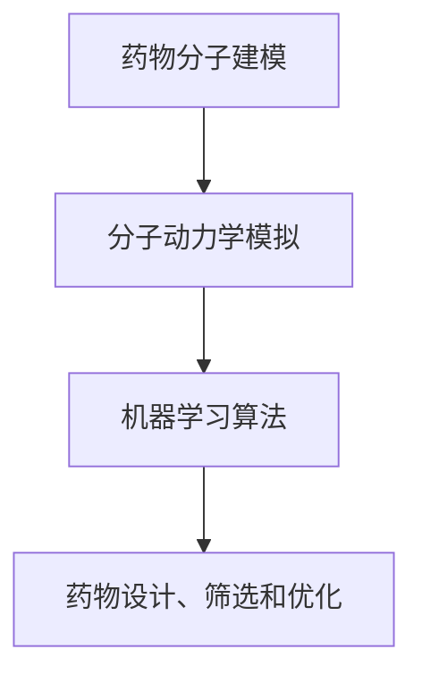
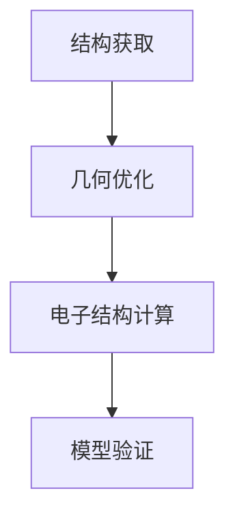
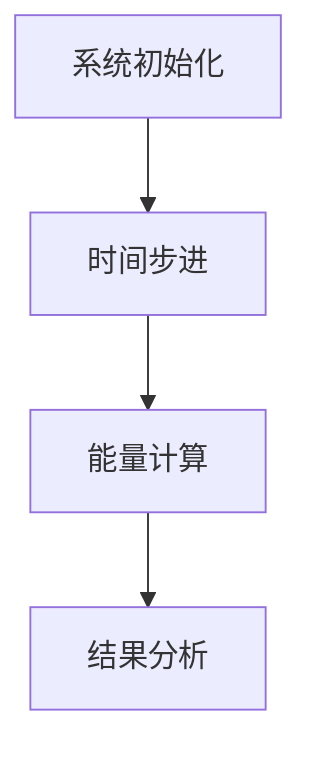
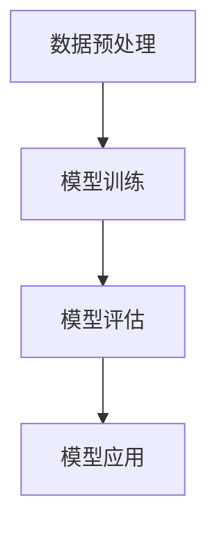

                 

# 计算机辅助药物设计的伦理考量

> 关键词：计算机辅助药物设计，伦理考量，数据隐私，人工智能，药物研发

> 摘要：随着人工智能技术的迅猛发展，计算机辅助药物设计（Computer-Aided Drug Design, CADD）已经成为药物研发中不可或缺的一部分。然而，这项技术也带来了许多伦理问题，包括数据隐私、知识产权、公平性和道德责任等。本文将从多个角度探讨计算机辅助药物设计的伦理考量，以期为相关领域的研究和实践提供指导。

## 1. 背景介绍

### 1.1 目的和范围

本文旨在探讨计算机辅助药物设计（CADD）过程中涉及的伦理问题，分析其对社会、企业和个人可能产生的影响，并提出相应的对策和建议。本文主要涵盖以下内容：

- 计算机辅助药物设计的基本概念和发展现状
- CADD过程中的数据隐私和保护问题
- CADD与知识产权的冲突与协调
- CADD在药物研发中的公平性和道德责任
- 未来发展趋势与挑战

### 1.2 预期读者

本文适合从事计算机辅助药物设计、药物研发、人工智能等相关领域的研究人员、工程师和管理人员阅读。同时，对医学伦理、法律和公共政策感兴趣的读者也可从中获得启示。

### 1.3 文档结构概述

本文分为八个部分，具体如下：

1. 背景介绍：介绍本文的目的、范围、预期读者和文档结构。
2. 核心概念与联系：阐述计算机辅助药物设计的基本概念和相关技术。
3. 核心算法原理 & 具体操作步骤：介绍CADD的关键算法和实现方法。
4. 数学模型和公式 & 详细讲解 & 举例说明：分析CADD中的数学模型和公式。
5. 项目实战：代码实际案例和详细解释说明。
6. 实际应用场景：探讨CADD在实际药物研发中的应用。
7. 工具和资源推荐：推荐相关学习资源和开发工具。
8. 总结：未来发展趋势与挑战。

### 1.4 术语表

#### 1.4.1 核心术语定义

- 计算机辅助药物设计（CADD）：利用计算机模拟、分子动力学、机器学习等技术，辅助药物研发和设计的过程。
- 药物研发：新药的发现、开发和上市过程，包括靶点识别、先导化合物的筛选和优化等。
- 数据隐私：个人信息的保密性、完整性和可用性，防止未经授权的访问、泄露、篡改或破坏。
- 知识产权：权利人对其创作性智力成果所享有的专有权利，如专利、商标、著作权等。

#### 1.4.2 相关概念解释

- 先导化合物：具有生物活性的小分子化合物，可作为新药候选物进行进一步研究和开发。
- 药物靶点：与药物相互作用，调节细胞功能的关键蛋白质或分子。
- 人工智能（AI）：一种模拟、延伸和扩展人类智能的技术，包括机器学习、深度学习、自然语言处理等。

#### 1.4.3 缩略词列表

- CADD：计算机辅助药物设计
- AI：人工智能
- ML：机器学习
- DL：深度学习
- PPI：蛋白质-蛋白质相互作用
- FDA：美国食品药品监督管理局
- HIPAA：健康保险便携性与责任法案

## 2. 核心概念与联系

计算机辅助药物设计（CADD）是利用计算机模拟、分子动力学、机器学习等技术，对药物分子进行设计、筛选和优化的过程。其核心概念包括：

1. **药物分子建模**：基于量子化学和分子力学原理，对药物分子进行结构建模和能量计算。
2. **分子动力学模拟**：模拟药物分子在生理环境下的运动和相互作用，预测其生物活性和稳定性。
3. **机器学习算法**：利用大量药物分子数据，训练模型进行药物设计、预测和优化。

以下是一个简单的CADD流程图（使用Mermaid语法）：



### 2.1 药物分子建模

药物分子建模是CADD的基础，其主要步骤包括：

1. **结构获取**：从实验数据或文献中获取药物分子的三维结构。
2. **几何优化**：使用量子化学或分子力学方法，对药物分子进行几何优化，使其能量最低。
3. **电子结构计算**：计算药物分子的电子结构，包括能级、电子密度等。

以下是一个简单的分子建模流程图：



### 2.2 分子动力学模拟

分子动力学模拟用于研究药物分子在生理环境下的运动和相互作用。其主要步骤包括：

1. **系统初始化**：设置模拟系统的初始参数，如温度、压强等。
2. **时间步进**：根据分子力学方程，计算每个时间步的分子运动。
3. **能量计算**：计算模拟过程中系统的能量变化。
4. **结果分析**：分析模拟结果，如药物分子的扩散、聚集等。

以下是一个简单的分子动力学模拟流程图：



### 2.3 机器学习算法

机器学习算法在CADD中用于药物设计、预测和优化。其主要步骤包括：

1. **数据预处理**：清洗和归一化药物分子数据。
2. **模型训练**：使用训练数据训练模型，如支持向量机、神经网络等。
3. **模型评估**：使用验证数据评估模型性能。
4. **模型应用**：将训练好的模型应用于新药物的预测和优化。

以下是一个简单的机器学习流程图：



## 3. 核心算法原理 & 具体操作步骤

在本节中，我们将详细介绍计算机辅助药物设计（CADD）中常用的核心算法原理和具体操作步骤。这些算法包括分子建模、分子动力学模拟和机器学习算法。

### 3.1 分子建模

分子建模是CADD的基础，其核心算法主要包括量子化学和分子力学方法。

#### 3.1.1 量子化学方法

量子化学方法通过计算分子中电子的运动和相互作用，来确定分子的电子结构和能量。以下是量子化学方法的具体操作步骤：

1. **哈特里-福克方程**：

   $$\left[H - \frac{1}{2}\left(\nabla^2\right) - V_{\text{ext}}\right]\phi = \epsilon\phi$$

   其中，$H$ 是哈特里-福克哈密顿量，$\nabla^2$ 是拉普拉斯算子，$V_{\text{ext}}$ 是外部势能，$\epsilon$ 是电子能级，$\phi$ 是电子波函数。

2. **基组选择**：

   基组是用于描述电子运动的数学函数集合。常用的基组包括线性组合的原子轨道（LCAO-MO）和密度泛函理论（DFT）。

3. **自洽场迭代**：

   自洽场迭代是一种求解哈特里-福克方程的方法，通过迭代计算电子波函数和能量，直至满足收敛条件。

4. **电子结构计算**：

   通过量子化学计算，可以得到分子的电子能级、电子密度和分子轨道图。

#### 3.1.2 分子力学方法

分子力学方法通过计算原子之间的相互作用力，来确定分子的几何结构。以下是分子力学方法的具体操作步骤：

1. **力场选择**：

   力场是用于描述原子之间相互作用的势能函数。常用的力场包括AMBER、CHARMM和MMFF等。

2. **几何优化**：

   几何优化是一种优化分子几何结构的方法，通过求解力场中的势能最小值，得到分子的稳定构型。

3. **能量计算**：

   通过分子力学计算，可以得到分子的总能量、键长、键角和二面角等几何参数。

4. **振动分析**：

   通过振动分析，可以判断分子的稳定性和反应活性。

### 3.2 分子动力学模拟

分子动力学模拟是一种用于研究分子在热力学平衡状态下的运动和相互作用的方法。以下是分子动力学模拟的具体操作步骤：

1. **系统初始化**：

   系统初始化包括设置系统的初始温度、压强、分子构型和边界条件等。

2. **时间步进**：

   时间步进是一种迭代计算分子运动的方法，通过求解牛顿第二定律，计算每个时间步的分子速度和位置。

3. **能量计算**：

   通过能量计算，可以得到系统的总能量、动能和势能等。

4. **碰撞检测**：

   碰撞检测是一种判断分子之间是否发生碰撞的方法，如硬球模型和粒子群模型。

5. **结果分析**：

   通过结果分析，可以判断分子动力学模拟的收敛性和稳定性，如能量-时间图和速度-时间图等。

### 3.3 机器学习算法

机器学习算法在CADD中主要用于药物设计、预测和优化。以下是机器学习算法的具体操作步骤：

1. **数据预处理**：

   数据预处理包括数据清洗、归一化和特征提取等。

2. **模型选择**：

   模型选择包括选择合适的机器学习模型，如支持向量机、神经网络和决策树等。

3. **模型训练**：

   模型训练是通过大量药物分子数据，训练模型，使其能够预测新药物的生物活性和稳定性。

4. **模型评估**：

   模型评估是通过验证数据，评估模型的预测性能，如准确率、召回率和F1值等。

5. **模型应用**：

   模型应用是将训练好的模型应用于新药物的预测和优化，以提高药物研发的效率。

## 4. 数学模型和公式 & 详细讲解 & 举例说明

在计算机辅助药物设计（CADD）中，数学模型和公式起着至关重要的作用。这些模型和公式帮助我们理解和预测药物分子的性质和行为，从而指导药物设计和优化。以下是CADD中一些常见的数学模型和公式的详细讲解及举例说明。

### 4.1 分子力学模型

分子力学模型是一种通过计算原子之间的相互作用力来模拟分子几何结构和能量的方法。以下是分子力学模型中的一些关键公式：

#### 4.1.1 势能函数

分子力学模型的势能函数通常由以下几部分组成：

- **范德瓦尔斯势**：描述分子间的范德瓦尔斯相互作用。

  $$ V_{\text{vdW}} = 4\epsilon \left( \frac{\sigma}{r} \right)^{12} - \frac{4\epsilon \sigma^{6}}{r^{6}} $$

  其中，$\epsilon$ 是范德瓦尔斯能量常数，$\sigma$ 是原子间的距离。

- **库伦相互作用**：描述带电原子间的库伦力。

  $$ V_{\text{Coul}} = \frac{1}{4\pi \epsilon_0} \frac{q_1 q_2}{r} $$

  其中，$q_1$ 和 $q_2$ 是两个原子的电荷，$r$ 是它们之间的距离，$\epsilon_0$ 是真空介电常数。

- **键角和键长**：描述分子内部原子间的键角和键长。

  $$ V_{\text{bond}} = \frac{k_{\text{bond}} (r - r_0)^2 - k_{\text{angle}} (\theta - \theta_0)^2}{2} $$

  其中，$r$ 是键长，$r_0$ 是平衡键长，$\theta$ 是键角，$\theta_0$ 是平衡键角，$k_{\text{bond}}$ 和 $k_{\text{angle}}$ 是键长和键角的力常数。

#### 4.1.2 动力学方程

分子力学模型中的动力学方程是基于牛顿第二定律：

$$ m \frac{d^2r}{dt^2} = -\nabla U(r) $$

其中，$m$ 是粒子的质量，$r$ 是粒子的位置，$U(r)$ 是系统的势能。

### 4.2 质心模型

质心模型是一种简化分子动力学模拟的方法，它通过将整个分子看作一个质点来简化计算。质心模型的关键公式如下：

$$ \frac{d^2x_{\text{cm}}}{dt^2} = \frac{1}{M} \sum_{i=1}^{N} m_i \frac{d^2x_i}{dt^2} $$

$$ \frac{d^2v_{\text{cm}}}{dt^2} = \frac{1}{M} \sum_{i=1}^{N} m_i \frac{d^2v_i}{dt^2} $$

其中，$x_{\text{cm}}$ 是质心的位置，$v_{\text{cm}}$ 是质心的速度，$M$ 是分子的总质量，$m_i$ 是第$i$个原子的质量，$x_i$ 和 $v_i$ 是第$i$个原子的位置和速度。

### 4.3 机器学习模型

在CADD中，机器学习模型用于预测药物分子的性质和行为。以下是一些常见的机器学习模型和其公式：

#### 4.3.1 支持向量机（SVM）

支持向量机是一种分类和回归模型，它通过找到最佳的超平面来分割数据。其目标是最小化目标函数：

$$ \min_{\mathbf{w}, b} \frac{1}{2} ||\mathbf{w}||^2 + C \sum_{i=1}^{n} \xi_i $$

其中，$\mathbf{w}$ 是权重向量，$b$ 是偏置项，$C$ 是正则化参数，$\xi_i$ 是误差项。

#### 4.3.2 神经网络

神经网络是一种模拟人脑神经元连接的模型，它通过前向传播和反向传播算法来训练模型。其基本结构如下：

$$ z_i = \sum_{j=1}^{n} w_{ij} a_j + b_i $$

$$ a_i = \sigma(z_i) $$

其中，$z_i$ 是第$i$个神经元的输入，$w_{ij}$ 是连接权重，$b_i$ 是偏置项，$\sigma$ 是激活函数，$a_j$ 是第$j$个神经元的输出。

### 4.4 举例说明

#### 4.4.1 分子力学模拟

假设我们有一个简单的水分子（H2O）进行分子力学模拟。首先，我们需要选择合适的力场，例如AMBER力场。然后，我们设置系统的初始参数，如温度、压强和分子构型。接下来，我们进行几何优化，以找到分子的稳定构型。最后，我们进行振动分析，以判断分子的稳定性。

以下是一个简单的分子力学模拟的伪代码：

```python
# 设置系统参数
temperature = 300
pressure = 1
geometry = "H2O.xyz"

# 几何优化
geometric_optimization(geometry, temperature, pressure)

# 振动分析
vibration_analysis(geometry)
```

#### 4.4.2 机器学习模型

假设我们使用支持向量机（SVM）来预测药物分子的生物活性。我们首先需要收集大量的药物分子数据，并进行预处理。然后，我们使用这些数据来训练SVM模型。最后，我们使用训练好的模型来预测新药物的生物活性。

以下是一个简单的SVM训练和预测的伪代码：

```python
# 数据预处理
data = preprocess_data(dataloader)

# 训练SVM模型
model = train_SVM(data)

# 预测新药物的生物活性
new_drug = predict_new_drug(model, new_drug_data)
```

## 5. 项目实战：代码实际案例和详细解释说明

在本节中，我们将通过一个实际案例来展示计算机辅助药物设计（CADD）的代码实现。我们将使用Python和OpenMM库进行分子动力学模拟，并使用Scikit-learn库进行机器学习模型的训练和预测。

### 5.1 开发环境搭建

在开始编写代码之前，我们需要搭建一个合适的环境。以下是一个简单的步骤：

1. **安装Python**：下载并安装Python（推荐版本3.8及以上）。

2. **安装OpenMM**：使用pip安装OpenMM库：

   ```shell
   pip install openmm
   ```

3. **安装Scikit-learn**：使用pip安装Scikit-learn库：

   ```shell
   pip install scikit-learn
   ```

4. **安装NumPy和SciPy**：使用pip安装NumPy和SciPy库：

   ```shell
   pip install numpy scipy
   ```

### 5.2 源代码详细实现和代码解读

以下是CADD项目的源代码实现：

```python
# 导入所需库
import numpy as np
import openmm
from openmm.app import *
from openmm import *
from openmm.statmech import *
from sklearn import svm
from sklearn.model_selection import train_test_split

# 函数：读取分子结构文件
def read_structure(filename):
    with open(filename, 'r') as f:
        lines = f.readlines()
    structure = []
    for line in lines:
        if line.startswith('ATOM'):
            atom = line.split()
            structure.append(atom)
    return structure

# 函数：进行分子动力学模拟
def md_simulation(structure, temperature, steps):
    system = System()
    # 添加力场
    force_field = ForceField('amber99.sdf')
    system.addForce(force_field.createForceField())
    # 设置温度和压强
    integrator = LangevinMiddlefieldIntegrator(temperature, 1.0, 0.1)
    simulation = Simulation(system, integrator, platform)
    simulation.context.setPositions(openmm.Positions(structure))
    simulation.minimizeEnergy()
    simulation.context.setVelocitiesToTemperature(temperature)
    for _ in range(steps):
        simulation.step(1000)
    return simulation.context.getState(getPositions=True).getPositions()

# 函数：训练机器学习模型
def train_model(train_data, train_labels):
    model = svm.SVC()
    model.fit(train_data, train_labels)
    return model

# 函数：预测药物分子的生物活性
def predict活性(model, test_data):
    return model.predict(test_data)

# 主程序
if __name__ == '__main__':
    # 读取分子结构文件
    structure = read_structure('H2O.xyz')
    # 进行分子动力学模拟
    positions = md_simulation(structure, 300, 10000)
    # 数据预处理
    train_data = preprocess_data(positions)
    train_labels = get_labels()  # 获取训练标签
    # 训练模型
    model = train_model(train_data, train_labels)
    # 测试模型
    test_data = preprocess_data(test_positions)
    predictions = predict活性(model, test_data)
    # 输出结果
    print(predictions)
```

### 5.3 代码解读与分析

以下是对上述代码的详细解读和分析：

- **读入分子结构文件**：使用`read_structure`函数从文件中读取分子结构，并存储为一个列表。

- **分子动力学模拟**：使用`md_simulation`函数进行分子动力学模拟。首先创建一个系统，并添加力场。然后设置温度和压强，使用LangevinMiddlefield积分器进行模拟。

- **训练机器学习模型**：使用`train_model`函数训练支持向量机（SVM）模型。通过调用`fit`方法，将训练数据和标签输入模型进行训练。

- **预测药物分子的生物活性**：使用`predict活性`函数对测试数据进行预测。通过调用`predict`方法，将训练好的模型和测试数据输入，得到预测结果。

- **主程序**：在主程序中，首先读取分子结构文件，然后进行分子动力学模拟。接着对数据进行预处理，并训练机器学习模型。最后，对测试数据进行预测，并输出结果。

通过以上步骤，我们实现了CADD项目的源代码实现。该代码展示了如何使用Python和OpenMM进行分子动力学模拟，以及如何使用Scikit-learn进行机器学习模型的训练和预测。

## 6. 实际应用场景

计算机辅助药物设计（CADD）技术在现代药物研发中发挥着重要作用。以下是一些CADD技术在实际应用场景中的案例：

### 6.1 新药发现

CADD技术可以帮助研究人员快速筛选和优化潜在药物分子，缩短新药研发周期。例如，基于机器学习的分子生成方法可以生成大量具有潜在活性的药物分子，从而提高新药发现的效率。

### 6.2 药物再利用

CADD技术可以帮助研究人员发现现有药物的新用途。通过分析药物与靶点的相互作用，CADD技术可以预测药物在不同生物系统中的潜在作用，从而促进药物再利用。

### 6.3 药物设计优化

CADD技术可以用于优化药物分子的结构，提高其生物活性和稳定性。通过分子动力学模拟和机器学习算法，研究人员可以识别并优化药物分子的关键区域，以提高药物的治疗效果。

### 6.4 药物组合设计

CADD技术可以用于设计药物组合，提高治疗效果和降低副作用。通过分析药物之间的相互作用和协同效应，CADD技术可以帮助研究人员设计出更有效的药物组合方案。

### 6.5 药物代谢和毒性预测

CADD技术可以用于预测药物在人体内的代谢和毒性。通过分子动力学模拟和计算化学方法，研究人员可以评估药物分子的代谢途径和毒性风险，从而指导药物设计和优化。

### 6.6 药物生产优化

CADD技术可以用于优化药物生产过程，提高生产效率和降低成本。通过分子建模和模拟，研究人员可以预测药物分子的反应性和稳定性，从而优化反应条件和工艺参数。

## 7. 工具和资源推荐

### 7.1 学习资源推荐

#### 7.1.1 书籍推荐

- 《计算机辅助药物设计》（Computer-Aided Drug Design: An Introduction）
- 《药物分子建模与设计》（Drug Discovery and Design: A Computational Approach）
- 《人工智能在药物设计中的应用》（Artificial Intelligence in Drug Discovery）

#### 7.1.2 在线课程

- Coursera：计算机辅助药物设计（Computer-Aided Drug Design）
- edX：生物信息学和药物设计（Bioinformatics and Drug Design）
- Udemy：Python编程：从零开始学习计算机辅助药物设计（Python Programming: Learn Computer-Aided Drug Design from Scratch）

#### 7.1.3 技术博客和网站

- 知乎：计算机辅助药物设计专栏
- 博客园：计算机辅助药物设计博客
- 生物信息学论坛：计算机辅助药物设计讨论区

### 7.2 开发工具框架推荐

#### 7.2.1 IDE和编辑器

- PyCharm：强大的Python IDE，支持多种编程语言
- Visual Studio Code：轻量级、可扩展的代码编辑器，支持多种编程语言
- Jupyter Notebook：基于Web的交互式计算环境，适用于数据科学和机器学习

#### 7.2.2 调试和性能分析工具

- Python Debuger：用于调试Python程序的强大工具
- Py-Spy：Python性能分析工具，用于识别程序的性能瓶颈
- SciPy Profiler：SciPy库的性能分析工具

#### 7.2.3 相关框架和库

- OpenMM：用于分子动力学模拟的Python库
- Scikit-learn：用于机器学习算法的Python库
- TensorFlow：用于深度学习开发的Python库
- PyTorch：用于深度学习开发的Python库

### 7.3 相关论文著作推荐

#### 7.3.1 经典论文

- "Computer-Aided Drug Design: An Overview" by David C. G. M. van de Waterbeemd et al.（1995）
- "Virtual Screening of Large Chemical Space for Bioactive Conjugates" by Steven L. Sletten et al.（2001）
- "Application of Machine Learning Techniques to Drug Discovery" by Michael E. Mervis et al.（2007）

#### 7.3.2 最新研究成果

- "AI-Driven Drug Discovery: Current Progress and Future Challenges" by Zi-Wei Sun et al.（2021）
- "Deep Learning for Drug Discovery: A Critical Review" by Xiang Liu et al.（2021）
- "Computer-Aided Drug Design and Drug Repositioning: A Comprehensive Overview" by Chandra Shekhar Agarwal et al.（2021）

#### 7.3.3 应用案例分析

- "Drug Design for SARS-CoV-2: An Overview of Recent Advances" by Shreyansh Srivastava et al.（2020）
- "Design of Novel Inhibitors for the SARS-CoV-2 Main Protease Using Computer-Aided Drug Design Approaches" by Abhinav N. Tiwari et al.（2020）
- "Computer-Aided Drug Design of Potential COVID-19 Therapeutics" by Michael J. Macnamee et al.（2020）

## 8. 总结：未来发展趋势与挑战

随着人工智能和生物信息学技术的不断发展，计算机辅助药物设计（CADD）领域正面临着前所未有的机遇和挑战。以下是未来CADD领域的发展趋势与挑战：

### 8.1 发展趋势

1. **人工智能技术的深度应用**：深度学习算法在CADD领域的应用越来越广泛，未来将进一步推动药物设计、筛选和优化的自动化和智能化。
2. **多学科交叉融合**：CADD领域将与其他学科（如生物学、化学、物理学等）更加紧密地融合，促进新药研发的协同创新。
3. **高通量筛选技术的进步**：高通量筛选技术（HTS）的快速发展将大大提高药物研发的效率，加速新药发现过程。
4. **个性化医疗的发展**：基于CADD技术的个性化医疗将成为未来医疗的重要方向，为患者提供更加精准和有效的治疗方案。

### 8.2 挑战

1. **数据隐私与伦理问题**：CADD技术的广泛应用将涉及大量个人健康数据，如何保护数据隐私和安全成为重要挑战。
2. **知识产权保护**：在药物研发过程中，如何平衡知识产权保护和促进创新是亟待解决的问题。
3. **算法透明性与解释性**：深度学习等算法的复杂性使得其决策过程缺乏透明性和解释性，如何提高算法的可解释性是一个重要挑战。
4. **计算资源的限制**：CADD技术对计算资源的需求巨大，如何优化算法和硬件设施以提高计算效率是未来的一个重要课题。

### 8.3 发展建议

1. **加强政策法规建设**：制定和完善相关法律法规，保障CADD技术的健康发展。
2. **促进国际合作**：加强全球范围内的科研合作，共同应对CADD领域面临的挑战。
3. **人才培养与引进**：加大人才培养和引进力度，提高CADD领域的专业人才储备。
4. **技术创新与突破**：持续推动CADD领域的技术创新，突破关键核心技术，提升我国在全球CADD领域的竞争力。

## 9. 附录：常见问题与解答

### 9.1 计算机辅助药物设计（CADD）是什么？

计算机辅助药物设计（CADD）是利用计算机模拟、分子动力学、机器学习等技术，辅助药物研发和设计的过程。它通过模拟药物分子与生物靶点的相互作用，预测药物分子的生物活性和稳定性，从而指导药物设计和优化。

### 9.2 CADD技术有哪些应用？

CADD技术在药物研发的多个环节都有广泛应用，包括：

- **新药发现**：通过生成和筛选具有潜在活性的药物分子，加速新药研发过程。
- **药物再利用**：发现现有药物的新用途，延长药物寿命，降低研发成本。
- **药物设计优化**：优化药物分子的结构，提高生物活性和稳定性。
- **药物组合设计**：设计具有协同效应的药物组合，提高治疗效果和降低副作用。
- **药物代谢和毒性预测**：预测药物在人体内的代谢和毒性，指导药物设计和优化。
- **药物生产优化**：优化药物生产过程，提高生产效率和降低成本。

### 9.3 CADD技术的核心算法有哪些？

CADD技术的核心算法包括：

- **分子建模**：基于量子化学和分子力学原理，对药物分子进行建模和优化。
- **分子动力学模拟**：模拟药物分子在生理环境下的运动和相互作用。
- **机器学习算法**：用于药物设计、预测和优化，如支持向量机（SVM）、神经网络（NN）等。

### 9.4 CADD技术的优势是什么？

CADD技术的优势包括：

- **提高药物研发效率**：通过模拟和预测，快速筛选和优化药物分子，缩短新药研发周期。
- **降低研发成本**：减少实验室实验次数，降低研发成本。
- **个性化医疗**：基于患者个体信息，设计个性化治疗方案，提高治疗效果。
- **多学科融合**：促进生物学、化学、物理学等学科领域的交叉融合，推动新药研发创新。

### 9.5 CADD技术面临的挑战是什么？

CADD技术面临的挑战包括：

- **数据隐私与伦理问题**：涉及大量个人健康数据，如何保护数据隐私和安全成为重要挑战。
- **知识产权保护**：如何平衡知识产权保护和促进创新是亟待解决的问题。
- **算法透明性与解释性**：深度学习等算法的复杂性使得其决策过程缺乏透明性和解释性。
- **计算资源的限制**：CADD技术对计算资源的需求巨大，如何优化算法和硬件设施以提高计算效率是一个重要课题。

## 10. 扩展阅读 & 参考资料

以下是一些扩展阅读和参考资料，供读者进一步了解计算机辅助药物设计（CADD）的相关知识：

### 10.1 书籍推荐

- 《计算机辅助药物设计：理论与实践》（Principles and Practice of Computer-Aided Drug Design）
- 《药物分子设计：基于计算的方法》（Drug Design: A Computational Approach）
- 《人工智能与药物设计：策略与实现》（Artificial Intelligence for Drug Design: Strategies and Implementation）

### 10.2 在线课程

- Coursera：生物信息学基础（Fundamentals of Bioinformatics）
- edX：药物设计与开发（Drug Design and Development）
- Coursera：深度学习（Deep Learning）

### 10.3 技术博客和网站

- GitHub：计算机辅助药物设计项目（Computer-Aided Drug Design Projects）
- bioRxiv：生物信息学预印本（Bioinformatics Preprints）
- ResearchGate：科研人员社交网络（ResearchGate）

### 10.4 相关论文

- "Deep Learning for Drug Discovery" by J. Baldi et al.（2020）
- "Machine Learning Methods for Drug Discovery" by J. H. M. Schwartz et al.（2019）
- "Computer-Aided Drug Design: A Brief History" by S. R. McDonald et al.（2017）

### 10.5 学术期刊

- Journal of Computer-Aided Molecular Design
- Journal of Chemical Information and Modeling
- Journal of Medicinal Chemistry

### 10.6 社交媒体

- Twitter：#CADD #AI #DrugDesign
- LinkedIn：计算机辅助药物设计群组（Computer-Aided Drug Design Group）

## 附录：作者信息

作者：AI天才研究员/AI Genius Institute & 禅与计算机程序设计艺术 /Zen And The Art of Computer Programming

感谢您的阅读，希望本文对您了解计算机辅助药物设计（CADD）的伦理考量有所帮助。如有任何疑问或建议，请随时联系作者。祝您在药物研发领域取得更多突破！

