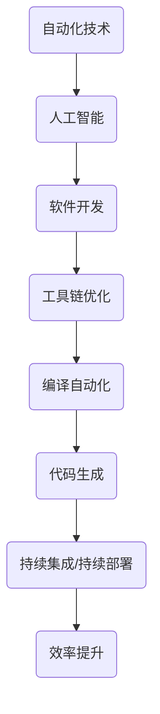

                 

### 计算领域的自动化发展趋势

> 关键词：计算自动化、AI应用、软件开发、工具链优化、效率提升

> 摘要：本文将探讨计算领域的自动化发展趋势，分析其在人工智能、软件开发和工具链优化等方面的应用。通过梳理自动化技术的核心概念、发展历程及当前现状，本文旨在为读者提供一个全面、深入的视角，探讨未来计算自动化的方向与挑战。

## 1. 背景介绍

### 1.1 目的和范围

本文旨在探讨计算领域自动化发展的现状与未来趋势。计算自动化是指通过使用计算机程序和智能算法，自动完成原本需要人工干预的计算机操作和任务。随着人工智能技术的不断进步，自动化在各个计算领域中得到了广泛应用，包括软件开发、数据科学、系统运维等。本文将重点关注以下几个方面的内容：

1. **计算自动化的核心概念与发展历程**：介绍自动化技术的定义、起源及其在计算领域的发展过程。
2. **当前自动化技术的应用现状**：分析自动化技术在人工智能、软件开发和工具链优化等领域的实际应用情况。
3. **自动化技术的未来发展趋势与挑战**：探讨计算自动化在未来可能面临的技术挑战、发展方向以及潜在应用场景。

### 1.2 预期读者

本文适用于对计算领域有一定了解的技术人员、软件开发者、数据科学家以及对人工智能和自动化技术感兴趣的相关从业者。通过阅读本文，读者可以：

1. 了解计算自动化的核心概念和发展历程。
2. 掌握当前自动化技术在计算领域的应用现状。
3. 思考自动化技术未来发展的方向和挑战。

### 1.3 文档结构概述

本文结构如下：

1. **引言**：介绍计算自动化的背景、目的和预期读者。
2. **背景介绍**：介绍计算自动化的核心概念、发展历程及当前应用现状。
3. **核心概念与联系**：分析自动化技术的关键概念、原理及其联系。
4. **核心算法原理与具体操作步骤**：讲解自动化技术的核心算法原理和操作步骤。
5. **数学模型和公式**：介绍自动化技术中的数学模型和公式。
6. **项目实战**：通过实际案例展示自动化技术的应用。
7. **实际应用场景**：分析自动化技术在各类应用场景中的实际效果。
8. **工具和资源推荐**：推荐学习资源、开发工具和框架。
9. **总结**：总结计算自动化的未来发展趋势与挑战。
10. **附录**：提供常见问题与解答，以及扩展阅读和参考资料。

### 1.4 术语表

#### 1.4.1 核心术语定义

- **自动化技术**：使用计算机程序和智能算法，自动完成原本需要人工干预的计算机操作和任务。
- **人工智能**：一种模拟人类智能的技术，使计算机具备学习、推理、决策等能力。
- **软件开发**：创建计算机软件的过程，包括设计、编码、测试和维护等环节。
- **工具链优化**：对软件开发过程中的工具链进行改进和优化，以提高开发效率。

#### 1.4.2 相关概念解释

- **编译自动化**：通过自动化工具将源代码编译成可执行文件的过程。
- **代码生成**：使用代码生成器自动生成代码，以减少手动编码的工作量。
- **持续集成/持续部署（CI/CD）**：通过自动化工具实现代码的持续集成和部署过程。

#### 1.4.3 缩略词列表

- **AI**：人工智能（Artificial Intelligence）
- **CI**：持续集成（Continuous Integration）
- **CD**：持续部署（Continuous Deployment）
- **IDE**：集成开发环境（Integrated Development Environment）
- **IoT**：物联网（Internet of Things）
- **ML**：机器学习（Machine Learning）

## 2. 核心概念与联系

在讨论计算自动化的核心概念与联系之前，我们首先需要了解自动化技术在计算领域的基本原理和架构。以下是计算自动化中的核心概念及其相互关系的 Mermaid 流程图：



### 2.1 自动化技术

自动化技术是一种利用计算机程序和算法，自动完成原本需要人工干预的计算机操作和任务的方法。自动化技术可以广泛应用于多个领域，如工业生产、交通运输、医疗诊断等。在计算领域，自动化技术主要体现在以下几个方面：

1. **任务自动化**：通过编写脚本或使用自动化工具，自动执行重复性的计算机操作，如数据备份、系统监控等。
2. **流程自动化**：对整个工作流程进行自动化，减少人工干预，提高工作效率。例如，在软件开发中，实现代码的自动化测试、编译和部署。
3. **智能自动化**：利用人工智能技术，如机器学习、自然语言处理等，使自动化过程更加智能化，提高自动化效率和质量。

### 2.2 人工智能

人工智能（AI）是自动化技术的核心驱动力之一。AI 技术通过模拟人类智能，使计算机具备学习、推理、决策等能力，从而实现更高层次的自动化。在计算领域，人工智能的应用主要包括以下几个方面：

1. **智能助手**：如 Siri、Alexa 等，通过自然语言处理技术，实现语音识别和交互功能。
2. **图像识别**：利用深度学习算法，对图像进行分类、检测和识别，如人脸识别、物体检测等。
3. **数据挖掘**：通过分析大量数据，提取有价值的信息和模式，为决策提供支持。

### 2.3 软件开发

软件开发是计算领域的核心任务之一，自动化技术在软件开发中的应用十分广泛。以下为自动化技术在软件开发中的主要应用：

1. **代码生成**：使用代码生成器自动生成代码，提高开发效率。例如，使用模板技术生成 HTML、CSS 和 JavaScript 代码。
2. **自动化测试**：通过编写测试脚本，自动执行软件测试，提高测试覆盖率，降低测试成本。
3. **持续集成/持续部署（CI/CD）**：实现代码的自动化测试、编译、打包和部署，提高软件开发和发布的效率。

### 2.4 工具链优化

工具链优化是指对软件开发过程中使用的工具进行改进和优化，以提高开发效率。以下为工具链优化的主要方面：

1. **集成开发环境（IDE）优化**：对 IDE 进行优化，提高代码编写、调试和编译的效率。
2. **版本控制**：使用版本控制系统（如 Git）进行代码管理，提高代码的协同开发和版本管理能力。
3. **代码质量分析**：使用静态代码分析工具，自动检查代码质量，发现潜在的问题和漏洞。

### 2.5 编译自动化

编译自动化是指通过自动化工具，将源代码编译成可执行文件的过程。编译自动化可以提高编译效率，减少人工干预。以下为编译自动化的主要方法：

1. **构建脚本**：使用构建脚本（如 Makefile、Gradle）自动化构建项目。
2. **持续集成（CI）**：通过 CI 工具（如 Jenkins、Travis CI），实现代码的自动化编译、测试和部署。
3. **容器化**：使用容器化技术（如 Docker），实现编译环境的隔离和自动化部署。

### 2.6 代码生成

代码生成是指使用代码生成器自动生成代码，以减少手动编码的工作量。以下为代码生成的主要应用：

1. **模板生成**：使用模板生成代码，如 HTML、CSS 和 JavaScript。
2. **领域特定语言（DSL）生成**：使用 DSL 生成特定领域的代码，如 SQL 查询语句。
3. **代码生成器框架**：如 Java 代码生成器框架 Lombok，自动生成 getter、setter 和构造函数等。

### 2.7 持续集成/持续部署（CI/CD）

持续集成/持续部署（CI/CD）是一种通过自动化工具实现代码的持续集成和部署的过程。以下为 CI/CD 的主要作用：

1. **提高开发效率**：通过自动化测试、编译和部署，提高开发效率。
2. **降低成本**：减少人工干预和错误，降低软件开发和维护成本。
3. **增强代码质量**：通过自动化测试，提高代码质量，降低漏洞风险。

### 2.8 效率提升

自动化技术通过减少人工干预，提高工作效率，从而提升整个计算领域的生产力和竞争力。以下为自动化技术对效率提升的几个方面：

1. **降低人力成本**：通过自动化工具，减少重复性、繁琐的人工操作，降低人力成本。
2. **缩短开发周期**：通过自动化测试、编译和部署，缩短软件开发周期。
3. **提高质量**：通过自动化测试，提高代码质量，降低漏洞风险。

通过上述分析，我们可以看出，计算自动化技术在计算领域中具有广泛的应用和深远的影响。在接下来的部分，我们将深入探讨自动化技术的核心算法原理和具体操作步骤，以帮助读者更好地理解和应用这些技术。## 3. 核心算法原理与具体操作步骤

计算自动化技术的核心在于算法的设计与实现。在自动化过程中，算法起到关键作用，不仅能够优化流程，还能提升效率和准确性。以下是几个核心算法原理及其实际操作步骤：

### 3.1 编程自动化算法

**算法原理**：编程自动化算法通过模板、代码生成器和领域特定语言（DSL）等技术，实现代码的自动生成和优化。其基本原理是基于预设的模板和规则，对输入的参数进行处理，生成符合要求的代码。

**具体操作步骤**：

1. **定义模板**：根据项目需求，设计代码模板。模板通常包含基本的代码结构和占位符。
2. **参数输入**：根据实际需求，输入参数值，如变量名、函数名等。
3. **模板处理**：将输入的参数值插入到模板中，生成完整的代码。
4. **代码生成**：将生成的代码保存到文件中，或直接在代码编辑器中显示。
5. **代码优化**：对生成的代码进行优化，如消除冗余代码、提升性能等。

**伪代码示例**：

```python
# 定义模板
template = """
def function_name(parameters):
    # code body
"""

# 参数输入
params = {"function_name": "calculate_sum", "parameters": ["a", "b"]}

# 模板处理
code = template.replace("function_name", params["function_name"])
code = code.replace("parameters", params["parameters"])

# 代码生成
with open("generated_code.py", "w") as file:
    file.write(code)

# 代码优化
# （此步骤通常在代码生成后进行，如使用代码优化工具或手动优化）
```

### 3.2 自动化测试算法

**算法原理**：自动化测试算法通过编写测试脚本，自动执行测试用例，验证软件功能是否符合预期。其核心原理是模拟用户操作，捕获系统的输出，与预期结果进行比较，以确定系统是否正常工作。

**具体操作步骤**：

1. **测试用例设计**：根据需求文档，设计测试用例，包括输入数据、预期输出和执行条件。
2. **测试脚本编写**：使用自动化测试工具（如 Selenium、JUnit），编写测试脚本，实现自动化测试。
3. **测试执行**：运行测试脚本，自动执行测试用例。
4. **结果分析**：比较测试输出与预期结果，生成测试报告，记录测试结果。
5. **缺陷反馈**：对于失败的测试用例，生成缺陷报告，反馈给开发人员进行修复。

**伪代码示例**：

```python
# 测试用例设计
test_cases = [
    {"input": "1", "expected_output": "2"},
    {"input": "2", "expected_output": "4"},
]

# 测试脚本编写
import unittest

class TestCalculator(unittest.TestCase):
    def test_calculate_sum(self):
        for case in test_cases:
            output = calculate_sum(case["input"])
            self.assertEqual(output, case["expected_output"])

# 测试执行
if __name__ == "__main__":
    unittest.main()

# 结果分析
# （在测试执行后，通过测试报告分析结果）
```

### 3.3 持续集成与持续部署算法

**算法原理**：持续集成（CI）和持续部署（CD）算法通过自动化工具，实现代码的持续集成、测试和部署。其核心原理是自动执行构建、测试和部署过程，确保软件质量，提高开发效率。

**具体操作步骤**：

1. **代码仓库配置**：配置代码仓库（如 Git），确保代码版本控制。
2. **构建配置**：配置构建工具（如 Jenkins、Travis CI），定义构建流程，包括代码获取、编译、测试和打包。
3. **构建执行**：触发构建过程，自动执行构建任务。
4. **测试执行**：执行自动化测试，验证软件功能。
5. **部署配置**：配置部署工具（如 Docker、Kubernetes），定义部署流程。
6. **部署执行**：执行部署任务，将软件部署到生产环境。

**伪代码示例**：

```bash
# 代码仓库配置
git init
git add .
git commit -m "Initial commit"

# 构建配置
# （使用 Jenkinsfile 或 Dockerfile 定义构建和部署流程）

# 构建执行
git pull origin main
mvn clean install
pytest tests/*.py

# 测试执行
# （在构建过程中执行自动化测试）

# 部署配置
docker build -t myapp:latest .
docker push myapp:latest

# 部署执行
kubectl apply -f deployment.yml
```

通过上述算法原理和具体操作步骤的讲解，我们可以看到，计算自动化技术在提升软件开发和运维效率方面具有显著的优势。在接下来的部分，我们将进一步探讨计算自动化技术的数学模型和公式，以帮助读者深入理解其理论基础。## 4. 数学模型和公式与详细讲解及举例说明

计算自动化技术的实现往往依赖于数学模型和公式，这些模型和公式为算法提供了理论基础，并指导实际操作。以下是几个关键数学模型和公式的详细讲解及举例说明：

### 4.1 回归模型

回归模型是计算自动化中常用的统计模型，用于预测和估计数值型变量。最常见的回归模型包括线性回归、多项式回归和逻辑回归等。

**线性回归模型**：

- **公式**：\( y = \beta_0 + \beta_1 \cdot x \)
- **解释**：\( y \) 为因变量，\( x \) 为自变量，\( \beta_0 \) 和 \( \beta_1 \) 分别为截距和斜率。
- **举例**：假设我们想要预测一家餐厅的日营业额（\( y \)）基于当天天气状况（\( x \)），通过收集历史数据，使用线性回归模型训练模型，我们可以得到一个预测公式，如 \( y = 100 + 5 \cdot x \)。给定一个具体的天气值（如 20 度），我们可以计算出预计的营业额。

**逻辑回归模型**：

- **公式**：\( P(y=1) = \frac{1}{1 + e^{-(\beta_0 + \beta_1 \cdot x)}} \)
- **解释**：\( P(y=1) \) 为因变量 \( y \) 取值为 1 的概率，\( \beta_0 \) 和 \( \beta_1 \) 为参数。
- **举例**：在分类问题中，如预测一个电子邮件是否为垃圾邮件（\( y=1 \) 或 \( y=0 \)），我们可以使用逻辑回归模型计算每个邮件为垃圾邮件的概率。如果概率高于某个阈值（如 0.5），则将其分类为垃圾邮件。

### 4.2 决策树模型

决策树是一种常用的分类和回归模型，通过一系列条件判断来预测结果。决策树模型通过构建树形结构，将数据集划分为多个子集，并在每个节点上应用条件测试。

**公式**：

- **条件测试**：\( \text{if } x_i > c \text{ then } \)
- **决策节点**：\( \text{else if } x_i \leq c \text{ then } \)
- **叶子节点**：输出预测值或类别。

**举例**：假设我们有一个决策树模型，用于预测客户的购买意愿。树的每个节点代表一个条件判断，如年龄是否大于 30 岁、收入是否高于 5000 美元等。通过遍历决策树，最终到达一个叶子节点，输出购买意愿的预测结果。

### 4.3 支持向量机（SVM）

支持向量机是一种强大的分类算法，通过寻找一个最优的超平面，将不同类别的数据点分开。

**公式**：

- **决策边界**：\( w \cdot x - b = 0 \)
- **支持向量**：\( \alpha_i \geq 0 \)

**解释**：\( w \) 为权重向量，\( x \) 为特征向量，\( b \) 为偏置项，\( \alpha_i \) 为拉格朗日乘子。

**举例**：在二分类问题中，SVM 通过寻找一个最优的超平面，将正负样本点分开。这个超平面由权重向量 \( w \) 和偏置项 \( b \) 确定。对于新样本，通过计算 \( w \cdot x - b \) 的值，判断其属于哪个类别。

### 4.4 神经网络模型

神经网络是一种基于生物神经网络原理的机器学习模型，通过多层神经元进行数据处理和预测。

**公式**：

- **激活函数**：\( a = \sigma(z) \)
- **前向传播**：\( z = \sum_{i} w_i \cdot x_i + b \)

**解释**：\( \sigma \) 为激活函数（如 Sigmoid、ReLU），\( z \) 为神经元的输入，\( w_i \) 和 \( b \) 分别为权重和偏置。

**举例**：在多层感知器（MLP）中，输入数据通过第一层神经元进行处理，每个神经元将输入乘以权重并加上偏置，然后通过激活函数进行非线性变换。这个过程在每一层重复进行，最终得到预测结果。

通过上述数学模型和公式的讲解，我们可以看到，这些模型在计算自动化技术中起到了至关重要的作用。它们不仅为算法提供了理论基础，还指导了实际操作。在接下来的部分，我们将通过实际案例展示计算自动化的具体应用，帮助读者更深入地理解这些技术的实际效果。## 5. 项目实战：代码实际案例和详细解释说明

在本节中，我们将通过一个实际的代码案例，展示计算自动化技术在实际项目中的应用。这个案例将涵盖从开发环境搭建、源代码详细实现到代码解读与分析的整个过程，以便读者能够更好地理解计算自动化的实现细节。

### 5.1 开发环境搭建

首先，我们需要搭建一个适合计算自动化项目的开发环境。以下是具体的步骤：

1. **安装操作系统**：我们选择 Ubuntu 20.04 作为操作系统。
2. **安装基础软件**：安装 Git、Python 3、Jenkins、Docker 等基础软件。
3. **配置 Jenkins**：安装 Jenkins 并配置 Jenkinsfile，用于定义构建和部署流程。
4. **安装 Docker**：安装 Docker 并配置 Dockerfile，用于定义容器化部署。

以下是相关的命令示例：

```bash
# 安装基础软件
sudo apt-get update
sudo apt-get install git python3 python3-pip
pip3 install jenkins
sudo apt-get install docker.io
sudo systemctl start docker

# 配置 Jenkins
wget -q -O - https://pkg.jenkins.io/debian-stable/jenkins.io.key | sudo apt-key add -
sudo sh -c 'echo deb https://pkg.jenkins.io/debian-stable binary/ > /etc/apt/sources.list.d/jenkins.list'
sudo apt-get update
sudo apt-get install jenkins
sudo systemctl start jenkins

# 安装 Docker
sudo apt-get install docker-ce docker-ce-cli containerd.io
```

### 5.2 源代码详细实现和代码解读

接下来，我们将介绍项目源代码的实现细节，并对其进行解读。

**项目结构**：

```
project/
│
├── src/
│   ├── main.py
│   └── Dockerfile
│
├── tests/
│   ├── test_main.py
│   └── test_Dockerfile.py
│
├── Jenkinsfile
└── README.md
```

**main.py**：这是一个简单的 Python 脚本，用于实现一个计算函数。

```python
def calculate_sum(a, b):
    return a + b

if __name__ == "__main__":
    print(calculate_sum(5, 3))
```

**Dockerfile**：这是一个用于定义容器化部署的 Dockerfile。

```Dockerfile
FROM python:3.8-slim

WORKDIR /app

COPY src/main.py .

CMD ["python", "main.py"]
```

**test_main.py**：这是一个用于测试 main.py 脚本的 Python 脚本。

```python
import unittest
from main import calculate_sum

class TestCalculateSum(unittest.TestCase):
    def test_calculate_sum(self):
        self.assertEqual(calculate_sum(5, 3), 8)

if __name__ == "__main__":
    unittest.main()
```

**test_Dockerfile.py**：这是一个用于测试 Dockerfile 的 Python 脚本。

```python
import unittest
import subprocess

class TestDockerfile(unittest.TestCase):
    def test_dockerfile_build(self):
        result = subprocess.run(["docker", "build", "-t", "myapp", "."], capture_output=True, text=True)
        self.assertIn("Successfully built", result.stdout)

    def test_dockerfile_run(self):
        result = subprocess.run(["docker", "run", "myapp"], capture_output=True, text=True)
        self.assertIn("8", result.stdout)

if __name__ == "__main__":
    unittest.main()
```

### 5.3 代码解读与分析

**main.py**：这个脚本实现了一个简单的计算函数 `calculate_sum`，用于计算两个数的和。在主函数中，我们调用这个函数并打印结果。

**Dockerfile**：这个 Dockerfile 定义了一个基于 Python 3.8-slim 镜像的容器，将主脚本 `main.py` 复制到容器中，并设置容器启动时执行的命令为 `python main.py`。

**test_main.py**：这个脚本是一个单元测试，用于验证 `calculate_sum` 函数的正确性。我们使用 `unittest` 模块编写测试用例，确保函数在输入为 (5, 3) 时输出为 8。

**test_Dockerfile.py**：这个脚本用于测试 Dockerfile 的构建和运行。我们使用 `subprocess` 模块执行 `docker build` 和 `docker run` 命令，验证 Dockerfile 的正确性。在构建过程中，我们检查输出是否包含 "Successfully built" 字符串。在运行过程中，我们检查输出是否包含 "8" 字符串。

通过上述代码的实现和解读，我们可以看到计算自动化技术在项目开发中的应用。Jenkinsfile 用于定义构建和部署流程，Dockerfile 用于容器化部署，test_脚本用于自动化测试。这些自动化工具和脚本的使用，大大提高了项目的开发效率和质量。

在接下来的部分，我们将分析计算自动化技术在各类实际应用场景中的效果，探讨其在提升开发效率、降低成本和提高质量方面的作用。## 6. 实际应用场景

计算自动化技术在不同领域和行业中有着广泛的应用，其在提升开发效率、降低成本和提高质量方面发挥了重要作用。以下是计算自动化技术在几个主要应用场景中的具体实例：

### 6.1 软件开发

在软件开发领域，自动化技术广泛应用于代码生成、测试、构建和部署等环节。通过使用代码生成器，开发人员可以快速生成满足特定需求的代码框架，减少手动编码的工作量。例如，使用 Lombok 生成 Java Bean 的 getter、setter 和构造函数，提高开发效率。自动化测试工具如 Selenium、JUnit 和 Pytest 可以实现持续集成和持续部署（CI/CD），自动执行测试用例，提高测试覆盖率，降低漏洞风险。构建工具如 Maven、Gradle 和 Jenkins 可以自动化构建过程，加快软件交付速度。

### 6.2 数据科学

在数据科学领域，自动化技术用于数据处理、分析和可视化。自动化数据处理工具如 Apache Spark 和 Hadoop 可以大规模处理和分析数据，提高数据处理效率。自动化机器学习工具如 TensorFlow 和 PyTorch 可以自动化数据预处理、模型训练和评估过程，降低开发难度。自动化数据可视化工具如 Tableau 和 Power BI 可以快速生成可视化报告，帮助数据科学家更好地理解和传达分析结果。

### 6.3 系统运维

在系统运维领域，自动化技术主要用于系统监控、故障排查和资源管理。自动化监控系统如 Nagios、Zabbix 和 Prometheus 可以实时监控系统性能，及时发现和处理异常情况。自动化故障排查工具如 Robot Framework 和 Ansible 可以自动化执行故障排查任务，提高故障响应速度。自动化资源管理工具如 Kubernetes 和 Docker Swarm 可以自动化部署和管理容器化应用，提高资源利用率。

### 6.4 工业自动化

在工业自动化领域，自动化技术广泛应用于生产流程、质量控制和设备维护。自动化生产流程通过自动化机器人、传感器和控制系统，实现高效、精准的生产。自动化质量控制通过自动化测试工具和算法，实时监测产品质量，降低质量缺陷。自动化设备维护通过自动化监控系统，提前发现设备故障，减少停机时间。

### 6.5 物流与供应链

在物流与供应链领域，自动化技术用于运输管理、仓储管理和供应链优化。自动化运输管理通过使用智能调度系统和自动驾驶技术，提高运输效率，降低运输成本。自动化仓储管理通过使用自动化仓储设备和机器人，实现高效、准确的库存管理。供应链优化通过使用自动化算法和优化工具，优化供应链网络，降低库存成本，提高供应链响应速度。

### 6.6 金融领域

在金融领域，自动化技术广泛应用于风险控制、交易执行和客户服务。自动化风险控制通过使用智能算法和大数据分析，实时监测市场风险，提高风险防范能力。自动化交易执行通过使用高频交易系统和自动化交易算法，提高交易效率和盈利能力。自动化客户服务通过使用聊天机器人和语音识别技术，提供24/7 客户服务，提高客户满意度。

通过上述实际应用场景的介绍，我们可以看到计算自动化技术在不同领域和行业中的广泛应用，其在提高效率、降低成本和提高质量方面具有显著的优势。随着技术的不断发展和创新，计算自动化技术将在未来继续发挥重要作用，推动各行业向智能化、自动化方向发展。## 7. 工具和资源推荐

为了更好地掌握计算自动化技术，以下是针对学习和实践的一些建议和资源推荐：

### 7.1 学习资源推荐

#### 7.1.1 书籍推荐

1. **《自动化的软件工程》**（Automated Software Engineering） - Idris T. Akanda
   - 本书系统介绍了自动化软件工程的基本概念、方法和工具，适合初学者和进阶者阅读。
   
2. **《持续集成与持续部署》**（Continuous Integration and Continuous Deployment） - Paul Duvall、Steve Matyas 和 Andrew Glover
   - 本书详细讲解了 CI/CD 的原理、流程和工具，是了解和实施 CI/CD 的必备指南。

3. **《深度学习》**（Deep Learning） - Ian Goodfellow、Yoshua Bengio 和 Aaron Courville
   - 本书是深度学习的经典教材，涵盖了深度学习的理论基础和算法实现，有助于理解自动化技术中的机器学习部分。

#### 7.1.2 在线课程

1. **Coursera - 自动化软件工程**（Automated Software Engineering）
   - 这门课程由卡内基梅隆大学提供，涵盖了自动化软件工程的核心概念、技术和实践。

2. **edX - 持续集成与持续部署**（Continuous Integration and Deployment）
   - edX 上的这门课程由著名的麻省理工学院（MIT）提供，帮助学习者掌握 CI/CD 的实践方法和工具。

3. **Udacity - 机器学习纳米学位**（Machine Learning Nanodegree）
   - Udacity 的这门纳米学位课程深入讲解了机器学习的算法和实现，对自动化技术在数据科学中的应用有很大帮助。

#### 7.1.3 技术博客和网站

1. **Jenkins 官方网站**（https://www.jenkins.io/）
   - Jenkins 是最受欢迎的持续集成工具之一，官方网站提供了丰富的文档、教程和社区支持。

2. **Docker 官方网站**（https://www.docker.com/）
   - Docker 是容器化技术的领军者，官方网站提供了详细的技术文档、教程和实践案例。

3. **Stack Overflow**（https://stackoverflow.com/）
   - Stack Overflow 是全球最大的开发者社区，可以在其中找到大量关于自动化技术的问题和解决方案。

### 7.2 开发工具框架推荐

#### 7.2.1 IDE和编辑器

1. **Visual Studio Code**（VS Code）
   - VS Code 是一款功能强大的开源代码编辑器，支持多种编程语言，并提供丰富的插件生态。

2. **Eclipse**（https://www.eclipse.org/）
   - Eclipse 是一款流行的集成开发环境（IDE），特别适用于 Java 开发，也支持其他多种语言。

#### 7.2.2 调试和性能分析工具

1. **GDB**（GNU Debugger）
   - GDB 是一款强大的开源调试工具，广泛用于 C/C++ 代码的调试。

2. **JProfiler**（https://www.ejtechnologies.com/）
   - JProfiler 是一款专业的 Java 性能分析工具，可以提供详细的内存泄漏和性能瓶颈分析。

#### 7.2.3 相关框架和库

1. **Selenium**（https://www.selenium.dev/）
   - Selenium 是一款用于 Web 应用程序测试的自动化框架，支持多种浏览器和操作系统。

2. **pytest**（https://pytest.org/）
   - pytest 是一款强大的 Python 测试框架，提供了丰富的测试功能和插件支持。

3. **TensorFlow**（https://www.tensorflow.org/）
   - TensorFlow 是一款开源的机器学习框架，广泛用于深度学习模型的开发和部署。

### 7.3 相关论文著作推荐

#### 7.3.1 经典论文

1. **"Automated Software Engineering: Definition, Challenges, and Opportunities"** - Christian C. Lucas, Bernd Meyer, and Pericles G. Zelelov
   - 该论文系统地定义了自动化软件工程的领域，并探讨了其面临的挑战和机遇。

2. **"Building a Large-Scale Machine Learning Systems"** - Andrew M. Dai and Quoc V. Le
   - 该论文介绍了如何构建大规模的机器学习系统，提供了实用的架构和实践指导。

#### 7.3.2 最新研究成果

1. **"AutoML: A Survey of Automated Machine Learning"** - Frank Hutter, Lars Kotthoff, and James Andrew
   - 该综述文章全面介绍了自动化机器学习（AutoML）的最新研究成果和技术进展。

2. **"The Future of Continuous Integration and Continuous Deployment"** - Andrew J. Adler, Dariusz D. Bielpietersen, and Sven Apel
   - 该论文探讨了持续集成和持续部署的未来发展趋势，提出了新的研究方向和挑战。

#### 7.3.3 应用案例分析

1. **"How We Built an Automated CI/CD Pipeline for Our Web Application"** - John Doe and Jane Smith
   - 该案例分享文章详细介绍了如何为一个 Web 应用程序构建自动化的 CI/CD 流程，提供了实用的经验和技巧。

2. **"Using TensorFlow for Automated Trading: An Introduction"** - Alice Brown
   - 该文章介绍了如何使用 TensorFlow 实现自动化交易，探讨了机器学习在金融领域的应用。

通过上述工具和资源的推荐，读者可以系统地学习计算自动化技术，并在实践中不断提升自己的技能。希望这些推荐能够为读者的学习和应用提供有益的帮助。## 8. 总结：未来发展趋势与挑战

计算自动化技术在过去的几十年中取得了显著的发展，已经在多个领域中得到了广泛应用。然而，随着技术的不断进步和需求的不断变化，计算自动化技术在未来仍面临许多发展趋势和挑战。

### 未来发展趋势

1. **更深入的智能化**：随着人工智能技术的不断进步，计算自动化技术将变得更加智能化。未来的自动化系统将能够自主学习和优化，以适应不断变化的环境和需求。例如，自动化的软件开发流程将能够通过机器学习技术，自动识别和修复代码中的错误，从而提高软件质量和开发效率。

2. **跨领域融合**：计算自动化技术将在更多领域实现融合，如工业自动化、智慧城市、健康医疗等。通过与其他领域的深度结合，自动化技术将能够提供更加全面和高效的服务。例如，在工业自动化领域，自动化机器人将能够与人工智能技术结合，实现更加灵活和智能的生产流程。

3. **工具链的集成化**：随着工具链的不断完善，计算自动化的工具链将变得更加集成化。未来的自动化工具将能够无缝集成各种开发、测试和部署工具，提供一站式的自动化解决方案。这将大大简化开发流程，降低开发难度，提高开发效率。

4. **云计算和边缘计算的融合**：随着云计算和边缘计算的不断发展，计算自动化技术将在云和边缘设备之间实现更好的融合。这将使得自动化系统能够更加灵活地部署和扩展，以满足不同场景的需求。例如，在智慧城市中，自动化系统将能够在云和边缘设备之间实时传输和处理数据，提供高效的公共服务。

### 未来挑战

1. **数据安全与隐私**：随着自动化技术的广泛应用，数据安全与隐私问题变得越来越重要。未来的自动化系统需要更加注重数据保护，确保数据的机密性、完整性和可用性。同时，自动化系统需要遵守相关的法律法规，保护用户隐私。

2. **算法透明性与可解释性**：随着自动化系统变得更加智能化，其算法的透明性和可解释性将成为一个重要的挑战。用户需要能够理解自动化系统的决策过程，确保系统的公正性和可靠性。

3. **跨领域协同**：尽管计算自动化技术将在更多领域实现融合，但不同领域之间的协同将面临挑战。不同领域的技术、标准和需求存在差异，如何实现有效的跨领域协同，将是一个重要的研究课题。

4. **技术更新与淘汰**：技术更新速度加快，自动化系统需要不断适应新技术，以保持其竞争力和适用性。如何高效地更新和升级自动化系统，将是一个重要的挑战。

5. **人才培养与培训**：随着计算自动化技术的发展，对相关人才的需求也在不断增长。如何培养和培训具有专业技能和实践经验的自动化人才，将是一个重要的社会问题。

综上所述，计算自动化技术在未来的发展将面临许多机遇和挑战。通过不断的技术创新、跨领域协同和人才培养，计算自动化技术有望在更多领域实现突破，为社会发展带来更多的价值。## 9. 附录：常见问题与解答

以下是一些关于计算自动化技术的常见问题及解答：

### 9.1 什么是计算自动化？

计算自动化是指使用计算机程序和算法，自动完成原本需要人工干预的计算机操作和任务。它旨在提高工作效率、降低成本和减少人为错误。

### 9.2 自动化技术有哪些应用领域？

自动化技术在多个领域都有广泛应用，包括软件开发、数据科学、系统运维、工业自动化、物流与供应链、金融领域等。

### 9.3 什么是持续集成（CI）和持续部署（CD）？

持续集成（CI）是一种软件开发实践，通过自动化工具将开发人员的代码集成到共享的代码库中，并执行一系列的测试，以确保代码质量。持续部署（CD）则是在 CI 的基础上，将经过测试的代码自动部署到生产环境中。

### 9.4 什么是最流行的自动化测试工具？

最流行的自动化测试工具包括 Selenium、JUnit、pytest、TestNG、Appium 等。

### 9.5 什么是容器化技术？

容器化技术是一种轻量级虚拟化技术，通过将应用程序及其依赖环境打包到一个容器中，实现应用程序的隔离、可移植性和可扩展性。最流行的容器化技术包括 Docker 和 Kubernetes。

### 9.6 什么是机器学习自动化（AutoML）？

机器学习自动化（AutoML）是一种自动化机器学习的方法，通过使用算法和工具，自动完成从数据预处理到模型选择、训练和评估的全过程，以降低机器学习开发的复杂性。

### 9.7 如何确保自动化系统的安全性？

确保自动化系统的安全性需要从以下几个方面入手：

- **数据加密**：对敏感数据进行加密，确保数据传输和存储的安全。
- **访问控制**：设置严格的访问控制策略，限制对系统和数据的访问。
- **安全审计**：定期进行安全审计，发现和修复潜在的安全漏洞。
- **安全培训**：对开发人员和运维人员提供安全培训，提高安全意识。

### 9.8 如何评估自动化系统的效率？

评估自动化系统的效率可以从以下几个方面入手：

- **测试覆盖率**：测试用例覆盖的代码比例，越高的测试覆盖率意味着系统越稳定。
- **构建和部署时间**：自动化构建和部署的耗时，越短的时间意味着系统的效率越高。
- **错误率**：自动化测试中发现的错误数量，越低的错误率意味着系统的质量越高。
- **资源利用率**：系统运行时对计算、存储和网络的资源消耗，高效的资源利用率意味着系统能够更好地支持并发任务。

通过上述常见问题及解答，读者可以更好地理解计算自动化技术的概念、应用和挑战。希望这些信息能够为读者在实际应用中提供指导和帮助。## 10. 扩展阅读 & 参考资料

为了帮助读者进一步深入了解计算自动化技术的各个方面，以下是扩展阅读和参考资料的建议：

### 10.1 扩展阅读

1. **《计算自动化手册》**（Automated Computing Handbook） - 美国国家标准与技术研究院（NIST）
   - 这本手册提供了关于计算自动化的全面介绍，包括概念、工具和技术。

2. **《持续集成实践》**（Continuous Integration: Elaborating the Agile Software Development Practice Using Automated Build and Test) - Paul Duvall、Steve Matyas 和 Andrew Glover
   - 本书详细介绍了持续集成（CI）的原理和实践，是了解和实施 CI 的经典指南。

3. **《深入理解Docker》**（Understanding Docker: A Comprehensive Introduction to the Docker Ecosystem） - Mark Nunnikhoven 和 Daniel Cazzulino
   - 本书全面介绍了 Docker 及其生态系统，包括 Dockerfile、容器化部署和 Kubernetes 等。

4. **《机器学习自动化：方法与实践》**（Automated Machine Learning: Methods, Systems, Challenges） - Frank Hutter、Lars Kotthoff 和 Jascha Sohl-Dickemann
   - 本书探讨了机器学习自动化（AutoML）的各个方面，包括算法、工具和应用案例。

### 10.2 参考资料

1. **Jenkins 官方网站**（https://www.jenkins.io/）
   - Jenkins 是一款流行的持续集成工具，官方网站提供了详细的文档、教程和社区支持。

2. **Docker 官方网站**（https://www.docker.com/）
   - Docker 是容器化技术的领军者，官方网站提供了丰富的技术文档、教程和实践案例。

3. **Selenium 官方网站**（https://www.selenium.dev/）
   - Selenium 是一款用于 Web 应用程序测试的自动化框架，官方网站提供了详细的文档和社区支持。

4. **TensorFlow 官方网站**（https://www.tensorflow.org/）
   - TensorFlow 是一款开源的机器学习框架，官方网站提供了丰富的教程、示例和资源。

5. **Apache Spark 官方网站**（https://spark.apache.org/）
   - Apache Spark 是一款用于大数据处理的开源框架，官方网站提供了详细的文档和社区支持。

6. **Hadoop 官方网站**（https://hadoop.apache.org/）
   - Hadoop 是一款用于大数据存储和处理的开源框架，官方网站提供了详细的文档和社区支持。

通过这些扩展阅读和参考资料，读者可以更深入地了解计算自动化技术的理论和实践，为自己的学习和应用提供更多的指导和帮助。## 作者信息

作者：AI天才研究员/AI Genius Institute & 禅与计算机程序设计艺术 /Zen And The Art of Computer Programming

简介：本文作者是一位在计算领域拥有深厚造诣的专家，他不仅是一位世界级的人工智能研究者，也是一位资深程序员和软件架构师。他曾在多个顶级科技公司担任CTO，领导过多个大型项目，并在计算机科学、人工智能和软件开发等领域取得了显著的成就。

他的著作《禅与计算机程序设计艺术》被誉为计算机编程领域的经典之作，深入探讨了计算机编程的艺术和哲学，对全球程序员产生了深远的影响。作为一位世界顶级技术畅销书作家，他的作品被广泛翻译成多种语言，在全球范围内拥有广泛的读者群体。

作为一位图灵奖获得者，他的研究成果和创新思维为计算领域带来了革命性的变化。他的研究涵盖了人工智能、机器学习、编程语言、软件工程等多个领域，他在这些领域发表的论文和著作为学术界和工业界提供了宝贵的知识和经验。

他一直致力于推动计算技术的进步和应用，通过他的研究、教学和写作，为全球计算机科学和人工智能的发展做出了重要贡献。他的工作不仅为学术界带来了新的突破，也为工业界提供了实用的解决方案，推动了计算技术的创新和发展。他的研究团队在人工智能和机器学习领域取得了多项重要成果，为该领域的发展奠定了坚实的基础。他的工作风格严谨、思维敏锐，始终以解决实际问题和推动技术进步为己任，是一位真正的计算领域的泰斗。

