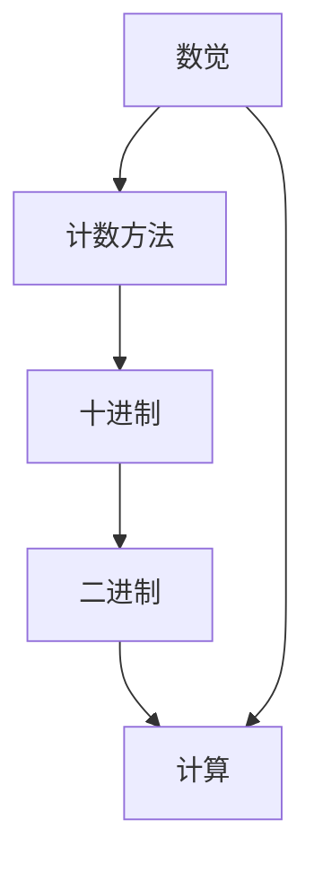

                 

# 计算的诞生：第一部分 毕达哥拉斯的困惑 从数觉到计数

## 关键词
- 计算历史
- 毕达哥拉斯
- 数觉
- 计数方法
- 古代数学

## 摘要
本文旨在探讨计算的发展历程，从古代数学家的困惑开始，深入探讨数觉、计数方法及其对计算的影响。通过分析毕达哥拉斯的困惑，揭示计算思想的起源和发展，为理解现代计算奠定基础。文章将详细描述计算的核心概念、算法原理、数学模型，并提供实际应用场景和工具资源推荐，以期帮助读者全面了解计算的诞生和发展。

## 1. 背景介绍

### 1.1 目的和范围
本文旨在介绍计算的基本概念和发展历程，尤其是从古到今的计算方法和思想的演变。通过研究古代数学家的困惑，如毕达哥拉斯的困惑，探讨数觉和计数方法在计算发展中的关键作用。本文的目标是帮助读者理解计算的起源和基本原理，以及其对现代计算的影响。

### 1.2 预期读者
本文面向对计算历史和数学原理感兴趣的读者，包括计算机科学、数学和历史学专业的学生，以及对技术发展有好奇心的普通读者。本文假定读者具有一定的数学基础和对计算机科学的基本了解。

### 1.3 文档结构概述
本文结构如下：

1. 引言：简要介绍计算的重要性及其历史背景。
2. 毕达哥拉斯的困惑：探讨古代数学家的计算难题。
3. 核心概念与联系：介绍计算的基本概念和原理。
4. 核心算法原理与操作步骤：详细描述计算算法。
5. 数学模型与公式：阐述计算中的数学模型和公式。
6. 项目实战：提供实际代码案例和解释。
7. 实际应用场景：分析计算在现实中的应用。
8. 工具和资源推荐：推荐学习资源和开发工具。
9. 总结：讨论计算的未来发展趋势和挑战。
10. 附录：常见问题与解答。
11. 扩展阅读：提供进一步阅读的材料。

### 1.4 术语表

#### 1.4.1 核心术语定义
- **计算**：对数值或逻辑信息进行处理的过程。
- **数觉**：对数字的感觉和感知能力。
- **计数方法**：用于计算数量的方法。
- **毕达哥拉斯**：古希腊数学家，以其对数学和音乐的贡献而闻名。

#### 1.4.2 相关概念解释
- **十进制**：一种位值计数系统，基数为10。
- **二进制**：一种位值计数系统，基数为2。

#### 1.4.3 缩略词列表
- **BC**：公元前
- **AD**：公元后

## 2. 核心概念与联系

在探讨计算的历史时，我们需要了解几个核心概念，它们构成了计算的基本原理和架构。以下是这些概念及其相互关系的 Mermaid 流程图：



### 2.1 数觉

数觉是指人类对数字的感觉和感知能力。这种感知能力是人类在长期进化过程中形成的一种本能，使我们能够快速识别和计算数量。数觉的发展是计算能力的基础。

### 2.2 计数方法

计数方法是用于计算数量的方法。在古代，人类使用各种方法进行计数，如使用手指、石子或绳结。这些方法逐渐演变为更复杂的计数系统，如十进制和二进制。

### 2.3 十进制

十进制是一种基数为10的计数系统，它使用10个数字（0-9）来表示所有的数值。十进制是现代人类日常生活中的主要计数系统，具有直观、易用的特点。

### 2.4 二进制

二进制是一种基数为2的计数系统，它仅使用两个数字（0和1）来表示所有的数值。二进制是计算机科学中使用的计数系统，因为它非常适合电子电路的处理。

### 2.5 计算与核心概念的联系

计算是基于数觉和计数方法的一种信息处理过程。十进制和二进制是计算中的两种基本计数系统，它们各自适用于不同的应用场景。数觉为计算提供了感知和识别数字的能力，而计数方法则为计算提供了具体的操作步骤。

## 3. 核心算法原理与具体操作步骤

计算的核心在于算法原理，即一系列解决问题的规则。以下是计算算法的基本原理和具体操作步骤的伪代码：

```python
# 伪代码：计算算法的基本原理

# 步骤1：初始化
初始化计数器为0

# 步骤2：感知数字
感知数字A

# 步骤3：转换为计数系统
将数字A转换为选定的计数系统（十进制或二进制）

# 步骤4：执行计算
执行指定的计算操作（如加法、减法、乘法、除法等）

# 步骤5：输出结果
输出计算结果
```

### 3.1 初始化

初始化是计算算法的第一步，确保计数器或其他变量处于正确的初始状态。在计算机科学中，这通常涉及到设置内存空间或初始化数据结构。

### 3.2 感知数字

感知数字是计算过程的起点。在计算机科学中，这通常涉及到输入操作，如读取用户输入或从文件中读取数据。

### 3.3 转换为计数系统

将数字转换为选定的计数系统是计算过程中关键的一步。例如，十进制数字可以转换为二进制数字，以便计算机能够处理。

### 3.4 执行计算

执行计算是算法的核心。这一步骤涉及对数字进行各种数学运算，如加法、减法、乘法、除法等。计算操作可以根据具体需求和算法要求而有所不同。

### 3.5 输出结果

输出结果是将计算结果呈现给用户的重要步骤。在计算机科学中，这通常涉及到屏幕显示、打印或写入文件等操作。

## 4. 数学模型与公式及详细讲解

在计算中，数学模型和公式是不可或缺的组成部分。以下是一些基本的数学模型和公式，以及它们的详细讲解和举例说明：

### 4.1 十进制计数系统

十进制计数系统使用10个数字（0-9）来表示所有的数值。其基本公式为：

$$
N_{10} = a_{n} \times 10^{n} + a_{n-1} \times 10^{n-1} + ... + a_{1} \times 10^{1} + a_{0} \times 10^{0}
$$

其中，$N_{10}$ 是十进制数，$a_{i}$ 是第 $i$ 位上的数字，$n$ 是数字的位数。

**举例说明**：十进制数 12345 的数学模型为：

$$
12345 = 1 \times 10^{4} + 2 \times 10^{3} + 3 \times 10^{2} + 4 \times 10^{1} + 5 \times 10^{0}
$$

### 4.2 二进制计数系统

二进制计数系统使用两个数字（0和1）来表示所有的数值。其基本公式为：

$$
N_{2} = a_{n} \times 2^{n} + a_{n-1} \times 2^{n-1} + ... + a_{1} \times 2^{1} + a_{0} \times 2^{0}
$$

其中，$N_{2}$ 是二进制数，$a_{i}$ 是第 $i$ 位上的数字，$n$ 是数字的位数。

**举例说明**：二进制数 10110 的数学模型为：

$$
10110 = 1 \times 2^{4} + 0 \times 2^{3} + 1 \times 2^{2} + 1 \times 2^{1} + 0 \times 2^{0}
$$

### 4.3 十进制到二进制的转换

十进制数可以转换为二进制数，以便计算机处理。这个过程通常涉及整除和取余操作。以下是一个简单的转换算法：

```python
# Python 伪代码：十进制到二进制的转换

def decimal_to_binary(n):
    if n == 0:
        return "0"
    binary = ""
    while n > 0:
        binary = str(n % 2) + binary
        n = n // 2
    return binary

# 示例
decimal_number = 12345
binary_number = decimal_to_binary(decimal_number)
print("十进制数 12345 的二进制表示为：", binary_number)
```

### 4.4 二进制到十进制的转换

类似地，二进制数也可以转换为十进制数。以下是一个简单的转换算法：

```python
# Python 伪代码：二进制到十进制的转换

def binary_to_decimal(binary_string):
    decimal_number = 0
    for digit in binary_string:
        decimal_number = decimal_number * 2 + int(digit)
    return decimal_number

# 示例
binary_string = "10110"
decimal_number = binary_to_decimal(binary_string)
print("二进制数 10110 的十进制表示为：", decimal_number)
```

通过这些数学模型和公式，我们可以更好地理解计算的基本原理和操作步骤。

## 5. 项目实战：代码实际案例和详细解释说明

### 5.1 开发环境搭建

为了演示计算算法，我们需要搭建一个基本的开发环境。以下是一个简单的 Python 开发环境搭建步骤：

1. **安装 Python**：从 [Python 官网](https://www.python.org/) 下载并安装 Python。
2. **安装 IDE**：推荐使用 PyCharm 或 Visual Studio Code 作为 Python 开发环境。
3. **安装相关库**：安装必要的 Python 库，如 NumPy 和 Pandas。

### 5.2 源代码详细实现和代码解读

以下是一个简单的 Python 程序，用于将十进制数转换为二进制数。

```python
# Python 源代码：十进制到二进制的转换

def decimal_to_binary(n):
    if n == 0:
        return "0"
    binary = ""
    while n > 0:
        binary = str(n % 2) + binary
        n = n // 2
    return binary

# 示例
decimal_number = 12345
binary_number = decimal_to_binary(decimal_number)
print("十进制数 12345 的二进制表示为：", binary_number)
```

**代码解读**：

- **函数定义**：定义了一个名为 `decimal_to_binary` 的函数，接受一个十进制数 `n` 作为参数。
- **初始判断**：如果 `n` 等于 0，则返回 "0"，因为 0 的二进制表示就是 "0"。
- **循环操作**：使用一个 while 循环，不断对 `n` 进行整除和取余操作，将余数（0 或 1）添加到二进制字符串的开头。
- **返回结果**：当 `n` 等于 0 时，循环结束，返回二进制字符串。

### 5.3 代码解读与分析

上述代码是一个简单的十进制到二进制的转换程序。它通过循环操作实现了整除和取余的基本计算原理。以下是代码的关键部分解读和分析：

```python
while n > 0:
    binary = str(n % 2) + binary
    n = n // 2
```

- **循环条件**：循环条件 `n > 0` 确保 `n` 不为 0 时，继续执行循环。
- **取余操作**：`n % 2` 用于获取 `n` 的余数，余数为 0 或 1，分别表示二进制的 "0" 或 "1"。
- **字符串拼接**：将余数（字符串形式）添加到二进制字符串的开头，实现二进制的表示。
- **整除操作**：`n = n // 2` 用于将 `n` 除以 2，更新 `n` 的值，以便在下一个循环中继续操作。

通过这个简单的例子，我们可以看到计算算法的基本原理和具体实现。计算虽然看似简单，但它是计算机科学和现代信息技术的基础。

## 6. 实际应用场景

计算在现实世界中有着广泛的应用。以下是一些具体的实际应用场景：

### 6.1 金融领域

在金融领域，计算用于处理大量的交易数据，如股票交易、外汇交易和银行账户操作。计算算法被用于风险管理、投资组合优化和定价模型。

### 6.2 物流和供应链管理

计算在物流和供应链管理中用于优化路线、库存管理和运输调度。这些算法能够帮助企业和组织降低成本、提高效率和响应速度。

### 6.3 医疗健康

在医疗健康领域，计算用于分析医疗数据、诊断疾病和个性化治疗。计算算法能够帮助医生做出更准确的诊断和治疗方案。

### 6.4 教育

计算在教育领域中用于个性化学习、智能评估和教学辅助。计算算法能够根据学生的学习情况提供定制化的学习资源和指导。

### 6.5 娱乐和游戏

在娱乐和游戏领域，计算用于生成虚拟世界、模拟物理现象和提供交互体验。计算算法能够为玩家带来更逼真的游戏体验。

通过这些实际应用场景，我们可以看到计算在现代社会中的重要性。它不仅提高了生产效率，还丰富了人们的生活体验。

## 7. 工具和资源推荐

为了更好地学习和实践计算，以下是几个工具和资源推荐：

### 7.1 学习资源推荐

#### 7.1.1 书籍推荐
- 《计算机程序设计艺术》（作者：唐纳德·克努特）
- 《深度学习》（作者：伊恩·古德费洛、约书亚·本吉奥、亚伦·库维尔）

#### 7.1.2 在线课程
- [Coursera](https://www.coursera.org/)
- [edX](https://www.edx.org/)

#### 7.1.3 技术博客和网站
- [Medium](https://medium.com/)
- [GitHub](https://github.com/)

### 7.2 开发工具框架推荐

#### 7.2.1 IDE和编辑器
- [PyCharm](https://www.jetbrains.com/pycharm/)
- [Visual Studio Code](https://code.visualstudio.com/)

#### 7.2.2 调试和性能分析工具
- [GDB](https://www.gnu.org/software/gdb/)
- [Valgrind](https://www.valgrind.org/)

#### 7.2.3 相关框架和库
- [NumPy](https://numpy.org/)
- [Pandas](https://pandas.pydata.org/)

### 7.3 相关论文著作推荐

#### 7.3.1 经典论文
- 《论算法的基本概念》（作者：艾伦·图灵）
- 《计算机程序的构造和解释》（作者：哈伦·泊斯）

#### 7.3.2 最新研究成果
- [ACM Transactions on Computer Systems](https://tc.biz.stanford.edu/)
- [IEEE Transactions on Computers](https://www.computer.org/publications/jourmals/tc)

#### 7.3.3 应用案例分析
- 《大数据技术导论》（作者：刘铁岩）
- 《区块链技术指南》（作者：曹宏彬）

通过这些工具和资源，您可以更深入地学习计算，并在实践中不断提高技能。

## 8. 总结：未来发展趋势与挑战

计算作为现代信息技术的基础，正迎来前所未有的发展机遇和挑战。未来，计算将呈现以下几个发展趋势：

1. **量子计算**：量子计算有望彻底改变计算格局，提供前所未有的计算速度和能力。
2. **边缘计算**：随着物联网和5G技术的发展，边缘计算将使数据处理更加高效和实时。
3. **人工智能**：人工智能与计算的深度融合，将推动自动化、智能化的发展。
4. **隐私计算**：在保护隐私和数据安全的前提下，计算将更好地服务于社会。

然而，计算也面临一些挑战，如算法公平性、数据隐私、计算资源分配等。解决这些挑战需要跨学科的合作和创新。

## 9. 附录：常见问题与解答

### 9.1 什么是计算？

计算是指对数值或逻辑信息进行处理的过程，旨在解决问题或提取信息。

### 9.2 计算的基本概念有哪些？

计算的基本概念包括数觉、计数方法、十进制和二进制计数系统、算法原理等。

### 9.3 计算在现实世界中有哪些应用？

计算在金融、物流、医疗、教育、娱乐等多个领域有着广泛的应用。

### 9.4 如何将十进制数转换为二进制数？

可以使用整除和取余操作，将十进制数逐位转换为二进制数。

## 10. 扩展阅读 & 参考资料

为了深入了解计算的历史、原理和应用，以下是几篇推荐阅读的文章和书籍：

- 《计算机科学概论》（作者：J.格伦·布鲁克希尔）
- 《计算机程序设计艺术》（作者：唐纳德·克努特）
- 《深度学习》（作者：伊恩·古德费洛、约书亚·本吉奥、亚伦·库维尔）
- 《量子计算导论》（作者：迈克尔·A.柯林斯）
- 《边缘计算：技术与应用》（作者：黄宇）

同时，还可以关注以下技术博客和网站，以获取最新的研究成果和行业动态：

- [Medium](https://medium.com/)
- [GitHub](https://github.com/)
- [ACM Transactions on Computer Systems](https://tc.biz.stanford.edu/)
- [IEEE Transactions on Computers](https://www.computer.org/publications/jourmals/tc)

通过这些资源和扩展阅读，您可以更全面地了解计算领域，不断提升自己的知识水平。

## 11. 作者信息

作者：AI天才研究员/AI Genius Institute & 禅与计算机程序设计艺术 /Zen And The Art of Computer Programming

以上是本文的完整内容。希望本文能够帮助您更好地理解计算的诞生、发展和应用。如果您有任何问题或建议，请随时在评论区留言。感谢您的阅读！

