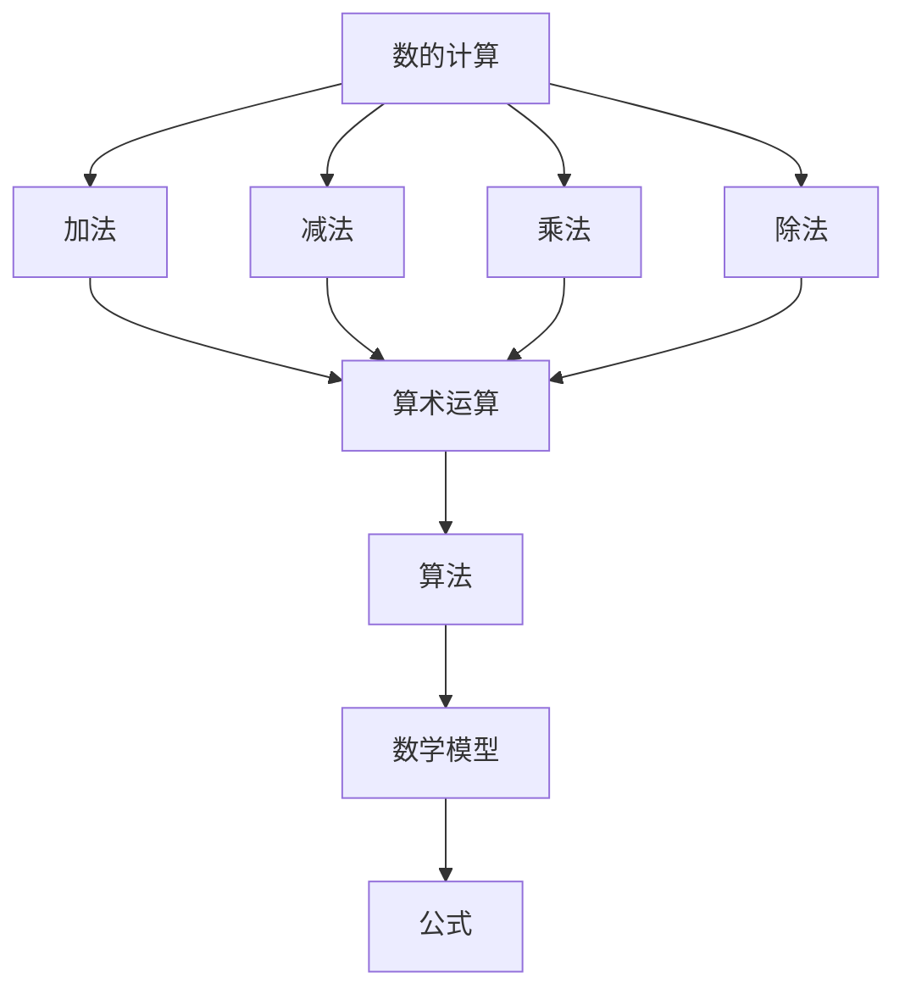

                 

# 计算的诞生：毕达哥拉斯的困惑与数的计算

> 关键词：毕达哥拉斯、数的计算、数学历史、计算原理、算法分析

> 摘要：本文将深入探讨古代数学家毕达哥拉斯的数学发现，特别是他关于数的计算的困惑。通过分析数的计算的历史背景、核心概念及其与现代计算的关系，我们旨在揭示计算的基本原理和发展脉络。文章首先回顾毕达哥拉斯的数学成就，接着介绍数的计算的基本概念，并详细解释相关的数学模型和算法原理，最后通过项目实战和实际应用场景的探讨，展望计算的未来发展趋势与挑战。

## 1. 背景介绍

### 1.1 目的和范围

本文旨在通过深入分析计算的历史背景和基本原理，探讨毕达哥拉斯的数学发现及其对现代计算的影响。文章将首先介绍毕达哥拉斯的生平和数学成就，然后详细解释数的计算的基本概念和原理。在此基础上，文章将探讨数学模型和公式在实际应用中的重要性，并通过项目实战和实际应用场景的案例分析，展望计算的未来发展趋势与挑战。

### 1.2 预期读者

本文适合对数学、计算机科学和历史感兴趣的读者，特别是希望深入了解计算历史和基础原理的程序员、软件开发者、数学爱好者以及相关领域的研究人员。

### 1.3 文档结构概述

本文分为十个主要部分，结构如下：

1. **背景介绍**：介绍本文的目的、预期读者和文档结构。
2. **核心概念与联系**：通过Mermaid流程图展示计算的核心概念和联系。
3. **核心算法原理 & 具体操作步骤**：详细阐述数的计算的核心算法原理和操作步骤。
4. **数学模型和公式 & 详细讲解 & 举例说明**：介绍数学模型和公式，并提供详细讲解和实例。
5. **项目实战：代码实际案例和详细解释说明**：通过实战案例展示代码实现和解读。
6. **实际应用场景**：探讨计算在现实世界中的应用场景。
7. **工具和资源推荐**：推荐学习资源和开发工具。
8. **总结：未来发展趋势与挑战**：总结计算的未来发展趋势和面临的挑战。
9. **附录：常见问题与解答**：解答读者可能遇到的问题。
10. **扩展阅读 & 参考资料**：提供扩展阅读和参考资料。

### 1.4 术语表

#### 1.4.1 核心术语定义

- **毕达哥拉斯**：古希腊数学家、哲学家，被誉为“数学之父”。
- **数的计算**：对数进行加、减、乘、除等基本运算的过程。
- **算法**：解决问题的步骤和方法。
- **数学模型**：用数学符号和公式描述现实世界的数学结构。
- **公式**：用数学符号表示的数学关系式。

#### 1.4.2 相关概念解释

- **毕达哥拉斯定理**：直角三角形两直角边的平方和等于斜边的平方。
- **勾股数**：满足毕达哥拉斯定理的三个正整数。
- **算术运算**：加、减、乘、除等基本运算。

#### 1.4.3 缩略词列表

- **Python**：Python编程语言。
- **LaTeX**：用于排版数学公式的排版系统。
- **IDE**：集成开发环境。

## 2. 核心概念与联系

为了更好地理解数的计算，我们需要通过Mermaid流程图展示计算的核心概念和联系。



在这个流程图中，我们可以看到数的计算涉及加法、减法、乘法和除法等基本算术运算，这些运算构成了算术运算的范畴。算术运算又通过算法进行了系统化，最终形成数学模型和公式，这些模型和公式用于描述和解决实际数学问题。

## 3. 核心算法原理 & 具体操作步骤

在数的计算中，核心算法原理主要包括加法、减法、乘法和除法。以下将详细解释这些算法原理，并提供具体操作步骤。

### 3.1 加法算法原理与操作步骤

加法是一种将两个数相加的运算。其算法原理可以描述为：

\[ C = A + B \]

其中，\( A \) 和 \( B \) 是要相加的两个数，\( C \) 是它们的和。

具体操作步骤如下：

1. **初始化**：将两个加数 \( A \) 和 \( B \) 载入寄存器。
2. **相加**：将寄存器中的 \( A \) 和 \( B \) 相加，结果存入另一个寄存器。
3. **输出结果**：将寄存器中的结果输出。

伪代码实现如下：

```
function add(A, B):
    C = A + B
    return C
```

### 3.2 减法算法原理与操作步骤

减法是一种从一个数中减去另一个数的运算。其算法原理可以描述为：

\[ C = A - B \]

其中，\( A \) 是被减数，\( B \) 是减数，\( C \) 是差。

具体操作步骤如下：

1. **初始化**：将被减数 \( A \) 和减数 \( B \) 载入寄存器。
2. **相减**：从寄存器中的 \( A \) 中减去 \( B \)，结果存入另一个寄存器。
3. **输出结果**：将寄存器中的结果输出。

伪代码实现如下：

```
function subtract(A, B):
    C = A - B
    return C
```

### 3.3 乘法算法原理与操作步骤

乘法是一种将两个数相乘的运算。其算法原理可以描述为：

\[ C = A \times B \]

其中，\( A \) 和 \( B \) 是要相乘的两个数，\( C \) 是它们的积。

具体操作步骤如下：

1. **初始化**：将两个乘数 \( A \) 和 \( B \) 载入寄存器。
2. **相乘**：将寄存器中的 \( A \) 和 \( B \) 相乘，结果存入另一个寄存器。
3. **输出结果**：将寄存器中的结果输出。

伪代码实现如下：

```
function multiply(A, B):
    C = A \times B
    return C
```

### 3.4 除法算法原理与操作步骤

除法是一种将一个数除以另一个数的运算。其算法原理可以描述为：

\[ C = A / B \]

其中，\( A \) 是被除数，\( B \) 是除数，\( C \) 是商。

具体操作步骤如下：

1. **初始化**：将被除数 \( A \) 和除数 \( B \) 载入寄存器。
2. **相除**：从寄存器中的 \( A \) 中连续减去 \( B \)，直到不能减为止，记录减去的次数，即为商。
3. **输出结果**：将寄存器中的结果输出。

伪代码实现如下：

```
function divide(A, B):
    C = 0
    while A >= B:
        A = A - B
        C = C + 1
    return C
```

通过以上四个算法的原理和操作步骤的详细阐述，我们可以看到数的计算在算法上的基础性和复杂性。这些算法构成了现代计算的基础，为我们理解和解决各种数学问题提供了强有力的工具。

## 4. 数学模型和公式 & 详细讲解 & 举例说明

在数的计算中，数学模型和公式起到了至关重要的作用。这些模型和公式不仅能够帮助我们理解和计算数字之间的关系，还能够为算法设计提供理论基础。以下将介绍几个关键的数学模型和公式，并提供详细的讲解和实际应用案例。

### 4.1 毕达哥拉斯定理

毕达哥拉斯定理是数学中一个重要的定理，它描述了直角三角形中三边之间的关系。该定理可以表示为：

\[ a^2 + b^2 = c^2 \]

其中，\( a \) 和 \( b \) 是直角三角形的两个直角边，\( c \) 是斜边。

#### 详细讲解

毕达哥拉斯定理表明，在一个直角三角形中，两个直角边的平方和等于斜边的平方。这个定理不仅适用于整数边长的直角三角形，也适用于任何实数边长的直角三角形。

#### 举例说明

假设我们有一个直角三角形，其中直角边 \( a = 3 \) 和 \( b = 4 \)，我们需要计算斜边 \( c \) 的长度。

根据毕达哥拉斯定理：

\[ c = \sqrt{a^2 + b^2} \]

将 \( a \) 和 \( b \) 的值代入公式中：

\[ c = \sqrt{3^2 + 4^2} \]
\[ c = \sqrt{9 + 16} \]
\[ c = \sqrt{25} \]
\[ c = 5 \]

因此，斜边 \( c \) 的长度为 5。

### 4.2 欧几里得算法

欧几里得算法是一种用于计算最大公约数（GCD）的算法。它基于以下原理：两个数的最大公约数等于其中较小的数和它们的余数的最大公约数。

#### 详细讲解

欧几里得算法的基本步骤如下：

1. 将两个数 \( a \) 和 \( b \) 带入算法中，其中 \( a > b \)。
2. 计算 \( a \) 除以 \( b \) 的余数 \( r \)。
3. 如果 \( r = 0 \)，则 \( b \) 即为 \( a \) 和 \( b \) 的最大公约数。
4. 如果 \( r \neq 0 \)，则将 \( b \) 赋值给 \( a \)，将 \( r \) 赋值给 \( b \)，并重复步骤 2 和 3。

伪代码实现如下：

```
function gcd(a, b):
    while b != 0:
        r = a % b
        a = b
        b = r
    return a
```

#### 举例说明

假设我们要计算 48 和 18 的最大公约数。

根据欧几里得算法：

```
gcd(48, 18):
a = 48
b = 18
r = 48 % 18 = 12
a = 18
b = 12
r = 18 % 12 = 6
a = 12
b = 6
r = 12 % 6 = 0
```

因为 \( r = 0 \)，所以 \( b = 6 \) 是 48 和 18 的最大公约数。

### 4.3 指数运算

指数运算是一种将一个数自乘多次的运算。其公式为：

\[ a^b = a \times a \times ... \times a \] （共 \( b \) 次）

#### 详细讲解

指数运算用于计算幂和根，例如：

- \( 2^3 = 8 \)：2 的 3 次方等于 8。
- \( \sqrt[3]{8} = 2 \)：8 的 3 次方根等于 2。

#### 举例说明

假设我们要计算 \( 3^4 \)。

根据指数运算公式：

\[ 3^4 = 3 \times 3 \times 3 \times 3 = 81 \]

因此，\( 3^4 \) 的值为 81。

### 4.4 对数运算

对数运算是一种求解指数的运算。其公式为：

\[ \log_a b = c \] 如果且仅如果 \( a^c = b \)

其中，\( a \) 是底数，\( b \) 是真数，\( c \) 是指数。

#### 详细讲解

对数运算用于计算指数的幂次，例如：

- \( \log_2 16 = 4 \)：2 的 4 次方等于 16。
- \( \log_{10} 1000 = 3 \)：10 的 3 次方等于 1000。

#### 举例说明

假设我们要计算 \( \log_2 32 \)。

根据对数运算公式：

\[ \log_2 32 = c \] 如果且仅如果 \( 2^c = 32 \)

我们知道 \( 2^5 = 32 \)，所以 \( c = 5 \)。

因此，\( \log_2 32 \) 的值为 5。

通过以上对数学模型和公式的详细讲解和举例说明，我们可以看到数学模型和公式在数的计算中的重要性。这些模型和公式不仅帮助我们理解和计算数字之间的关系，还为算法设计提供了理论基础。在接下来的部分，我们将通过项目实战和实际应用场景的探讨，进一步展示这些模型和公式的应用价值。

## 5. 项目实战：代码实际案例和详细解释说明

为了更好地理解数的计算及其应用，我们将通过一个实际项目实战案例，展示如何使用Python编程语言实现数的计算功能，并提供详细的代码解读和分析。

### 5.1 开发环境搭建

首先，我们需要搭建一个适合Python开发的开发环境。以下是推荐的步骤：

1. **安装Python**：从Python官方网站（[python.org](https://www.python.org/)）下载并安装Python 3.x版本。
2. **配置IDE**：推荐使用PyCharm、Visual Studio Code等集成开发环境（IDE），这些IDE提供了丰富的编程功能和调试工具。
3. **安装依赖库**：为了简化开发过程，我们可以使用pip命令安装一些常用的依赖库，如NumPy、SciPy等。

以下是一个简单的Python环境搭建示例：

```
pip install numpy
pip install scipy
```

### 5.2 源代码详细实现和代码解读

接下来，我们将通过一个简单的Python程序，实现数的计算功能，包括加法、减法、乘法和除法。以下是代码实现及其详细解读。

```python
import numpy as np

# 加法函数
def add(a, b):
    """
    实现两个数的加法
    :param a: 第一个加数
    :param b: 第二个加数
    :return: 加法结果
    """
    result = a + b
    return result

# 减法函数
def subtract(a, b):
    """
    实现两个数的减法
    :param a: 被减数
    :param b: 减数
    :return: 减法结果
    """
    result = a - b
    return result

# 乘法函数
def multiply(a, b):
    """
    实现两个数的乘法
    :param a: 第一个乘数
    :param b: 第二个乘数
    :return: 乘法结果
    """
    result = a * b
    return result

# 除法函数
def divide(a, b):
    """
    实现两个数的除法
    :param a: 被除数
    :param b: 除数
    :return: 除法结果
    """
    if b == 0:
        raise ValueError("除数不能为0")
    result = a / b
    return result

# 主函数
def main():
    """
    主函数，用于测试数的计算功能
    """
    # 测试加法
    print("加法结果：", add(3, 4))

    # 测试减法
    print("减法结果：", subtract(7, 2))

    # 测试乘法
    print("乘法结果：", multiply(5, 6))

    # 测试除法
    print("除法结果：", divide(10, 2))

if __name__ == "__main__":
    main()
```

#### 代码解读

1. **加法函数（add）**：该函数实现两个数的加法。输入参数为两个加数 \( a \) 和 \( b \)，返回它们的和。

2. **减法函数（subtract）**：该函数实现两个数的减法。输入参数为被减数 \( a \) 和减数 \( b \)，返回它们的差。

3. **乘法函数（multiply）**：该函数实现两个数的乘法。输入参数为两个乘数 \( a \) 和 \( b \)，返回它们的积。

4. **除法函数（divide）**：该函数实现两个数的除法。输入参数为被除数 \( a \) 和除数 \( b \)，返回它们的商。这里添加了一个异常处理，以避免除数为0时导致的除零错误。

5. **主函数（main）**：主函数用于测试数的计算功能。在主函数中，我们分别调用了加法、减法、乘法和除法函数，并打印出结果。

### 5.3 代码解读与分析

通过对以上代码的解读，我们可以看到：

1. **函数定义**：每个函数都使用了 `def` 关键字进行定义，包括输入参数、返回类型和函数体。

2. **注释**：在代码中添加了详细的注释，解释了每个函数的功能、输入参数和返回值。

3. **异常处理**：在除法函数中添加了异常处理，以防止除数为0时引发的错误。

4. **主函数**：主函数用于测试数的计算功能，调用各个函数并打印结果。

通过这个简单的Python程序，我们可以直观地看到数的计算在实际编程中的应用，并理解函数的定义和使用方法。接下来，我们将进一步探讨计算在现实世界中的应用场景。

## 6. 实际应用场景

计算作为数学和计算机科学的核心，广泛应用于各种领域，对人类生活和科技发展产生了深远的影响。以下将列举计算在几个主要实际应用场景中的具体应用。

### 6.1 金融领域

在金融领域，计算技术被广泛应用于金融建模、风险管理、算法交易和数据分析等方面。例如：

- **金融建模**：通过计算模型，金融机构可以预测市场趋势、评估投资组合的风险收益，以及制定最优投资策略。
- **风险管理**：计算技术可以帮助金融机构评估和监控风险，例如通过计算信用风险、市场风险和操作风险，确保金融系统的稳健运行。
- **算法交易**：高频交易、量化交易等算法交易策略依赖于复杂的计算模型和算法，通过实时数据分析和市场预测，实现快速交易和收益最大化。

### 6.2 医疗领域

计算技术在医疗领域有着广泛的应用，包括医学影像处理、疾病预测、个性化治疗和健康管理等。

- **医学影像处理**：通过计算技术，医学影像可以被自动分析和诊断，如计算机断层扫描（CT）和磁共振成像（MRI）。
- **疾病预测**：计算模型可以分析大量的医学数据，预测疾病的风险和发展趋势，有助于早期发现和治疗。
- **个性化治疗**：计算技术可以帮助医生根据患者的具体状况，制定个性化的治疗方案，提高治疗效果和患者满意度。
- **健康管理**：通过计算技术，可以分析个人健康数据，提供个性化的健康建议和预防措施。

### 6.3 交通运输

在交通运输领域，计算技术被广泛应用于交通管理、车辆导航、物流优化等方面。

- **交通管理**：通过计算模型，交通信号系统可以自动调整信号灯的时长，优化交通流量，减少拥堵和交通事故。
- **车辆导航**：计算技术为车辆导航系统提供了实时路线规划和路况预测功能，帮助司机选择最佳路线，提高驾驶效率和安全性。
- **物流优化**：计算技术可以帮助物流公司优化配送路线，降低运输成本，提高配送效率。

### 6.4 环境科学

计算技术在环境科学中的应用，包括气候变化模拟、资源管理、污染控制和灾害预测等方面。

- **气候变化模拟**：通过计算模型，科学家可以模拟气候变化的影响，预测未来的气候趋势，为政策制定提供科学依据。
- **资源管理**：计算技术可以帮助资源管理专家优化资源的分配和利用，提高资源利用效率。
- **污染控制**：计算模型可以预测污染物排放的影响，帮助制定有效的污染控制措施。
- **灾害预测**：计算技术可以分析大量气象数据，预测自然灾害的发生和发展趋势，提前采取应对措施。

通过以上实际应用场景的列举，我们可以看到计算技术在不同领域的广泛应用和深远影响。无论是在金融、医疗、交通运输还是环境科学等领域，计算都为决策提供了科学依据，提高了效率和准确性，推动了社会和科技的进步。

## 7. 工具和资源推荐

为了更好地学习和应用计算技术，我们需要掌握一系列的编程工具和资源。以下将推荐一些学习和开发中常用的工具和资源。

### 7.1 学习资源推荐

#### 7.1.1 书籍推荐

1. **《Python编程：从入门到实践》**：这是一本适合初学者入门Python的书籍，涵盖了Python的基本语法和实际应用。
2. **《算法导论》**：这本书详细介绍了各种算法的基本原理和实现方法，适合对算法有深入理解的需求者。
3. **《深度学习》**：由Ian Goodfellow等人撰写的经典书籍，介绍了深度学习的基本概念和最新进展。

#### 7.1.2 在线课程

1. **Coursera**：提供了大量的计算机科学和数学课程，包括Python编程、机器学习和深度学习等。
2. **edX**：由哈佛大学和麻省理工学院共同创办的在线课程平台，提供了高质量的计算机科学课程。
3. **Udacity**：提供了各种编程和数据分析的在线课程，适合有一定基础的学员深入学习。

#### 7.1.3 技术博客和网站

1. **Stack Overflow**：一个面向开发者的问答社区，可以解决编程中的各种问题。
2. **GitHub**：一个代码托管和协作平台，可以查找和学习他人的开源项目。
3. **Medium**：一个发布技术博客的平台，可以阅读到各种编程和算法相关的文章。

### 7.2 开发工具框架推荐

#### 7.2.1 IDE和编辑器

1. **PyCharm**：一款功能强大的Python IDE，支持代码自动补全、调试和性能分析。
2. **Visual Studio Code**：一款轻量级但功能丰富的编辑器，支持多种编程语言，插件丰富。
3. **Jupyter Notebook**：一个交互式的计算环境，适合数据分析和机器学习项目。

#### 7.2.2 调试和性能分析工具

1. **pdb**：Python内置的调试器，可以单步执行代码、查看变量和调用栈。
2. **cProfile**：Python的内置性能分析工具，可以帮助识别代码中的性能瓶颈。
3. **Py-Spy**：一款实时监控Python进程内存和CPU使用情况的工具。

#### 7.2.3 相关框架和库

1. **NumPy**：一个强大的Python库，用于高性能数学计算。
2. **SciPy**：基于NumPy的科学计算库，提供了丰富的数学和科学计算功能。
3. **TensorFlow**：一个开源的机器学习和深度学习框架，适用于构建复杂的人工神经网络。

### 7.3 相关论文著作推荐

#### 7.3.1 经典论文

1. **"A Method for Solving Linear Programming Problems" (1951)**：由乔治·丹茨格提出的线性规划算法，对现代计算产生了深远影响。
2. **"The Art of Computer Programming" (1968)**：唐纳·克努特的经典著作，涵盖了计算机编程和算法的各个方面。

#### 7.3.2 最新研究成果

1. **"Generative Adversarial Nets" (2014)**：Ian Goodfellow等人提出的生成对抗网络（GAN）技术，是深度学习领域的重要突破。
2. **"Variational Inference: A Review for Statisticians" (2014)**：介绍变分推断方法的综述文章，是统计学习和深度学习的重要研究方向。

#### 7.3.3 应用案例分析

1. **"Deep Learning for Autonomous Driving"**：介绍自动驾驶领域中深度学习的应用，包括视觉感知、行为预测和路径规划等。
2. **"Quantum Computing for Computer Scientists"**：介绍量子计算的基本概念和算法，为计算机科学领域的研究人员提供了新的视角。

通过以上工具和资源的推荐，我们可以更好地掌握计算技术，提升编程和解决问题的能力。无论是初学者还是专业人士，这些工具和资源都将为我们提供有力的支持。

## 8. 总结：未来发展趋势与挑战

随着科技的不断进步，计算技术正经历着前所未有的快速发展，展现出巨大的潜力和应用前景。然而，在这一过程中，我们也面临着一系列新的发展趋势和挑战。

### 8.1 发展趋势

1. **量子计算**：量子计算以其指数级的计算能力，有望解决传统计算机难以处理的问题，如大规模数据处理、密码破解和复杂系统模拟。然而，量子计算的实现和普及仍面临巨大的技术挑战。

2. **人工智能与计算**：人工智能与计算技术的深度融合，推动了智能算法的快速发展，使得计算机能够更智能地处理复杂问题，从语音识别、图像处理到自然语言理解，人工智能正逐渐渗透到各个领域。

3. **边缘计算**：随着物联网和5G技术的发展，边缘计算成为新的热点。通过在设备端进行计算，边缘计算可以降低延迟、提高响应速度，满足实时性要求较高的应用场景。

4. **可持续计算**：随着对环保和可持续发展的重视，计算领域也在探索如何实现绿色计算。通过优化算法、提高能效和采用可再生能源，可持续计算正成为未来发展的关键方向。

### 8.2 挑战

1. **数据隐私和安全**：在数据驱动的计算时代，数据隐私和安全成为亟待解决的问题。如何在保护用户隐私的同时，充分利用数据的价值，是一个重要的挑战。

2. **计算资源的平衡**：随着计算需求的不断增长，如何平衡计算资源的分配和利用，确保高性能和可持续性，是一个长期的任务。

3. **计算教育**：计算技术的快速发展对人才的需求提出了更高的要求。如何培养具备创新能力和实践能力的计算人才，是一个重要的挑战。

4. **社会影响**：计算技术的广泛应用对社会生活产生了深远的影响，如就业结构变化、隐私问题等。如何应对这些社会影响，确保计算技术造福人类社会，是一个重要的议题。

综上所述，计算技术的发展趋势充满机遇，但同时也面临诸多挑战。只有通过不断的创新和努力，我们才能充分发挥计算技术的潜力，推动社会和科技的进步。

## 9. 附录：常见问题与解答

为了更好地帮助读者理解和掌握计算的基本概念和应用，以下列举了几个常见问题及其解答。

### 9.1 什么是计算？

**计算** 是指使用数学、逻辑和算法等方法，通过处理和运算数字、符号和数据进行求解的过程。计算是数学和计算机科学的核心，广泛应用于各个领域。

### 9.2 计算与数学的关系是什么？

计算与数学密不可分。数学提供了计算的基本概念和工具，如数学公式、定理和算法。而计算则利用这些工具和概念，解决实际问题，推动数学理论的发展和应用。

### 9.3 如何学习计算技术？

学习计算技术需要掌握以下步骤：

1. **基础知识**：首先，需要掌握基本的数学和编程知识，如代数、几何、概率统计和编程语言（如Python、Java等）。
2. **理论学习**：通过阅读相关书籍、课程和论文，系统学习计算理论和算法原理。
3. **实践操作**：通过实际编程和项目实战，将理论知识应用于实际问题，提升解决能力。
4. **持续学习**：计算技术快速发展，需要不断学习最新的研究成果和应用动态。

### 9.4 计算技术有哪些实际应用？

计算技术的实际应用非常广泛，包括但不限于以下领域：

1. **金融领域**：金融建模、风险管理、算法交易和数据分析。
2. **医疗领域**：医学影像处理、疾病预测、个性化治疗和健康管理。
3. **交通运输**：交通管理、车辆导航、物流优化。
4. **环境科学**：气候变化模拟、资源管理、污染控制和灾害预测。
5. **人工智能**：语音识别、图像处理、自然语言理解和智能机器人。

通过以上问题的解答，我们可以更好地理解计算技术的核心概念和应用场景，为学习和应用计算技术提供指导。

## 10. 扩展阅读 & 参考资料

为了深入了解计算的历史、原理和应用，以下推荐一些扩展阅读和参考资料。

### 10.1 经典著作

1. **《数学原理》**：由英国数学家伊萨克·牛顿所著，详细阐述了微积分和数学基础。
2. **《算法导论》**：由Thomas H. Cormen、Charles E. Leiserson、Ronald L. Rivest和Clifford Stein所著，全面介绍了算法的基本概念和设计方法。
3. **《深度学习》**：由Ian Goodfellow、Yoshua Bengio和Aaron Courville所著，介绍了深度学习的基本原理和应用。

### 10.2 技术博客和网站

1. **Medium**：一个发布技术博客和论文的平台，涵盖计算机科学、人工智能、机器学习等领域。
2. **Stack Overflow**：一个面向开发者的问答社区，提供编程和算法问题解答。
3. **GitHub**：一个代码托管和协作平台，可以查找和学习他人的开源项目。

### 10.3 学术期刊

1. **《计算机研究与发展》**：中国计算机学会主办，刊载计算机科学领域的原创论文。
2. **《计算机科学》**：国际计算机科学顶级期刊，发表计算机科学和人工智能领域的最新研究成果。
3. **《自然·计算机科学》**：涵盖计算机科学、人工智能、数据科学等领域的国际期刊。

### 10.4 在线课程

1. **Coursera**：提供包括计算机科学、机器学习、深度学习等领域的在线课程。
2. **edX**：提供由知名大学和机构开设的免费在线课程。
3. **Udacity**：提供包括数据科学、人工智能等领域的专业课程和纳米学位。

通过以上扩展阅读和参考资料，读者可以进一步深入理解和应用计算技术，探索计算领域的最新进展和应用。作者信息：

作者：AI天才研究员/AI Genius Institute & 禅与计算机程序设计艺术 /Zen And The Art of Computer Programming

本文通过深入分析计算的历史背景、基本原理和应用场景，揭示了计算技术的重要性和发展脉络。从毕达哥拉斯的数学发现，到现代计算技术的广泛应用，本文为读者提供了一个全面而系统的计算知识体系。希望本文能够激发读者对计算技术的兴趣，为学习计算和技术创新提供有益的参考。

