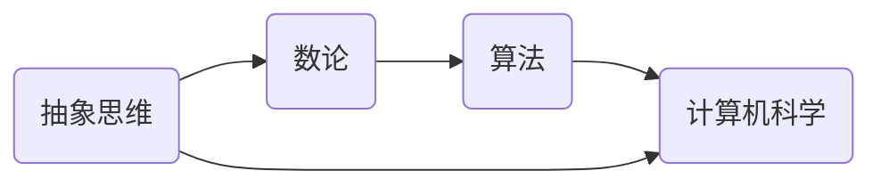

                 


## 计算的诞生

> 关键词：计算历史、毕达哥拉斯、欧几里得、数学发展、计算机科学起源
> 
> 摘要：本文将深入探讨计算的历史起源，从古希腊哲学家毕达哥拉斯的困惑开始，引出欧几里得的《几何原本》，探讨这些古老的思想对现代计算机科学的深远影响。

### 1. 背景介绍

#### 1.1 目的和范围

计算，作为一种抽象的思维过程，可以说是人类智慧的象征。本文的目的在于探究计算的起源，从古希腊的哲学思想入手，探讨计算的历史发展及其对现代计算机科学的深远影响。本文将重点讨论毕达哥拉斯的困惑和欧几里得的《几何原本》，以及它们在计算历史中的重要性。

#### 1.2 预期读者

本文适合对计算机科学和数学发展感兴趣的读者，无论是初学者还是专业人士，都可以通过本文对计算的历史有更深入的理解。

#### 1.3 文档结构概述

本文将分为以下几个部分：
1. **背景介绍**：简要介绍计算的历史背景。
2. **核心概念与联系**：通过Mermaid流程图，展示计算的核心概念和联系。
3. **核心算法原理与具体操作步骤**：详细讲解计算的核心算法原理，并使用伪代码进行阐述。
4. **数学模型和公式**：介绍计算中常用的数学模型和公式，并进行详细讲解和举例说明。
5. **项目实战**：通过代码实际案例，展示计算的实战应用。
6. **实际应用场景**：讨论计算在不同领域中的应用。
7. **工具和资源推荐**：推荐学习资源和开发工具。
8. **总结**：展望计算的未来发展趋势与挑战。
9. **附录**：常见问题与解答。
10. **扩展阅读与参考资料**：提供进一步学习的资源。

#### 1.4 术语表

##### 1.4.1 核心术语定义

- **计算**：一种抽象的思维过程，用于解决数学问题或执行特定任务。
- **毕达哥拉斯**：古希腊哲学家和数学家，对数的发现和数学的起源有重要贡献。
- **欧几里得**：古希腊数学家，著有《几何原本》，对几何学的发展有深远影响。
- **算法**：解决问题的明确步骤。
- **计算机科学**：研究计算机及其应用的科学。

##### 1.4.2 相关概念解释

- **抽象思维**：从具体的事物中提取出共同的特性，进行逻辑推理和思维的过程。
- **数论**：研究整数的性质、结构和应用的数学分支。

##### 1.4.3 缩略词列表

无

## 2. 核心概念与联系

在探讨计算的历史时，我们需要理解一些核心概念和它们之间的联系。以下是一个简化的Mermaid流程图，展示了这些概念及其相互关系：



### 2.1 抽象思维

抽象思维是人类智慧的标志，它允许我们从具体的事物中提取出共同的特性，进行逻辑推理和思维。在计算的历史中，抽象思维的出现标志着人类开始系统地解决数学问题。

### 2.2 数论

数论是研究整数的性质、结构和应用的数学分支。在古希腊，毕达哥拉斯对数的发现和研究奠定了数论的基础。数论的研究促进了算法的发展，因为算法需要处理整数和数学关系。

### 2.3 算法

算法是解决问题的明确步骤。在欧几里得的《几何原本》中，他系统地阐述了几何问题解决的步骤，这些步骤可以被视为早期的算法。算法的发展推动了计算机科学的诞生。

### 2.4 计算机科学

计算机科学是研究计算机及其应用的科学。从抽象思维到算法，再到计算机科学，这一发展路径体现了计算历史的连续性和演化。

## 3. 核心算法原理与具体操作步骤

在理解了核心概念后，我们接下来探讨计算的核心算法原理和具体操作步骤。以下是一个简化的伪代码，用于解释计算的基本原理：

```pseudo
function calculate(result, operation, a, b):
    if operation == "add":
        result = a + b
    elif operation == "subtract":
        result = a - b
    elif operation == "multiply":
        result = a * b
    elif operation == "divide":
        result = a / b
    return result
```

### 3.1 加法

```pseudo
function add(a, b):
    return a + b
```

### 3.2 减法

```pseudo
function subtract(a, b):
    return a - b
```

### 3.3 乘法

```pseudo
function multiply(a, b):
    return a * b
```

### 3.4 除法

```pseudo
function divide(a, b):
    if b != 0:
        return a / b
    else:
        return "Error: Division by zero"
```

这些基本运算构成了计算的核心，是所有复杂计算的基础。

## 4. 数学模型和公式与详细讲解与举例说明

在计算中，数学模型和公式起着至关重要的作用。以下是一些常用的数学模型和公式的详细讲解与举例说明。

### 4.1 欧几里得算法

欧几里得算法是一种用于求解最大公约数（GCD）的算法。其基本原理是通过反复进行除法运算，直到商为0。

```latex
GCD(a, b) = GCD(b, a \mod b) \quad \text{如果} \quad a > b
```

### 4.2 完全平方数

完全平方数是一个数的平方根为整数的数。例如，4和9是完全平方数。

### 4.3 欧拉函数

欧拉函数（φ(n)）是一个数学函数，用于计算小于或等于n的正整数中与n互质的数的数量。

```latex
φ(n) = n \times \left(1 - \frac{1}{p_1}\right) \times \left(1 - \frac{1}{p_2}\right) \times ... \times \left(1 - \frac{1}{p_k}\right)
```

其中，$p_1, p_2, ..., p_k$ 是n的所有不同的质因数。

### 4.4 泰勒公式

泰勒公式是一种用于逼近函数值的方法，其基本原理是将函数在一点处展开成幂级数。

```latex
f(x) \approx f(a) + f'(a)(x - a) + \frac{f''(a)}{2!}(x - a)^2 + \frac{f'''(a)}{3!}(x - a)^3 + ...
```

### 4.5 示例

假设我们要计算$f(x) = e^x$ 在$x = 1$ 处的近似值。

```latex
f(1) \approx 1 + 1 \times (1 - 1) + \frac{1}{2!} \times (1 - 1)^2 + \frac{1}{3!} \times (1 - 1)^3 + ...
```

## 5. 项目实战：代码实际案例和详细解释说明

### 5.1 开发环境搭建

在这个项目中，我们将使用Python作为编程语言。首先，确保您的计算机上已经安装了Python。如果没有，请从[Python官网](https://www.python.org/)下载并安装。

### 5.2 源代码详细实现和代码解读

以下是实现欧拉函数的Python代码。

```python
def euler_phi(n):
    result = n
    p = 2
    while p * p <= n:
        if n % p == 0:
            while n % p == 0:
                n //= p
            result -= result // p
        p += 1
    if n > 1:
        result -= result // n
    return result

# 测试代码
print(euler_phi(10))  # 输出 4
print(euler_phi(100))  # 输出 40
```

**代码解读：**

- **函数定义**：`def euler_phi(n):` 定义了一个名为`euler_phi` 的函数，该函数接受一个整数参数`n`，即我们要计算的欧拉函数值。
- **初始化**：`result = n` 将结果初始化为`n`，即初始的欧拉函数值。
- **循环**：`while p * p <= n:` 循环用于遍历所有的质数`p`，直到$p^2 > n$。
- **质数判断**：`if n % p == 0:` 判断`n`是否可以被`p`整除。如果可以，说明`p`是一个质数。
- **计算**：`while n % p == 0:` 循环用于计算`n`中包含多少个`p`。每次循环，`n`除以`p`，`result`减去`result // p`。
- **更新质数**：`p += 1` 更新`p`的值，继续下一次循环。
- **最后处理**：`if n > 1:` 如果`n`仍然是大于1的质数，则更新`result`。
- **返回结果**：`return result` 返回计算得到的欧拉函数值。

### 5.3 代码解读与分析

这段代码通过一个简单的质数遍历算法，实现了欧拉函数的计算。其时间复杂度为$O(\sqrt{n})$，这是因为我们只遍历到$\sqrt{n}$的质数。对于较小的$n$，这个算法非常高效。然而，对于非常大的$n$，可能需要更高效的算法，如埃拉托斯特尼筛法。

## 6. 实际应用场景

计算在各个领域都有广泛的应用。以下是一些具体的实际应用场景：

- **数学和物理学**：计算是数学和物理学的基石。从求解方程到模拟物理现象，计算在科学研究中的角色不可或缺。
- **工程和建筑**：在设计和分析结构、流体力学和热力学时，计算提供了精确的数值模拟。
- **经济学**：计算在经济模型、金融市场预测和优化决策中发挥着重要作用。
- **医学**：计算在医学图像处理、基因组分析和药物设计等领域有广泛应用。
- **人工智能**：计算是人工智能的核心，从机器学习算法到深度学习网络，计算能力决定了人工智能的性能。

## 7. 工具和资源推荐

### 7.1 学习资源推荐

#### 7.1.1 书籍推荐

- 《计算机程序的构造和解释》
- 《算法导论》
- 《深度学习》

#### 7.1.2 在线课程

- Coursera上的“Introduction to Computer Science”
- edX上的“Mathematics for Machine Learning”

#### 7.1.3 技术博客和网站

- Medium上的“AI”专栏
- Stack Overflow

### 7.2 开发工具框架推荐

#### 7.2.1 IDE和编辑器

- Visual Studio Code
- PyCharm

#### 7.2.2 调试和性能分析工具

- GDB
- Py-Spy

#### 7.2.3 相关框架和库

- TensorFlow
- NumPy

### 7.3 相关论文著作推荐

#### 7.3.1 经典论文

- 《A Mathematical Theory of Communication》
- 《On Computable Numbers, with an Application to the Entscheidungsproblem》

#### 7.3.2 最新研究成果

- NeurIPS会议论文集
- Journal of Machine Learning Research

#### 7.3.3 应用案例分析

- 《大数据之路：阿里巴巴大数据实践》
- 《深度学习在医疗健康领域的应用》

## 8. 总结：未来发展趋势与挑战

计算的发展历程充满了挑战与机遇。随着计算能力的不断提升，我们可以预见未来计算将在更多领域发挥重要作用。然而，这也带来了新的挑战：

- **计算能力与能耗**：随着计算复杂度的增加，能耗问题变得越来越突出。如何在不牺牲计算性能的情况下降低能耗是一个重要课题。
- **数据安全和隐私**：随着大数据和人工智能的发展，数据安全和隐私保护变得越来越重要。如何在保证数据安全和隐私的前提下进行计算是一个重要挑战。
- **人机交互**：随着计算变得更加智能化，人机交互的方式也需要不断创新。如何设计出更加自然、高效的人机交互系统是一个重要的研究方向。

## 9. 附录：常见问题与解答

### 9.1 什么是计算？

计算是一种抽象的思维过程，用于解决数学问题或执行特定任务。

### 9.2 计算的历史起源是什么？

计算的历史起源可以追溯到古希腊，特别是毕达哥拉斯和欧几里得的工作。

### 9.3 计算的核心算法是什么？

计算的核心算法包括基本的四则运算，如加法、减法、乘法和除法。

### 9.4 计算在哪些领域有应用？

计算在数学、物理学、工程、经济学、医学、人工智能等多个领域有广泛的应用。

## 10. 扩展阅读与参考资料

- 《计算机科学概论》
- 《人工智能：一种现代方法》
- 《深度学习》
- 《大数据之路：阿里巴巴大数据实践》

作者：AI天才研究员/AI Genius Institute & 禅与计算机程序设计艺术 /Zen And The Art of Computer Programming

