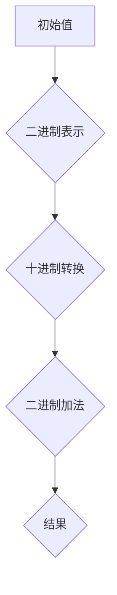
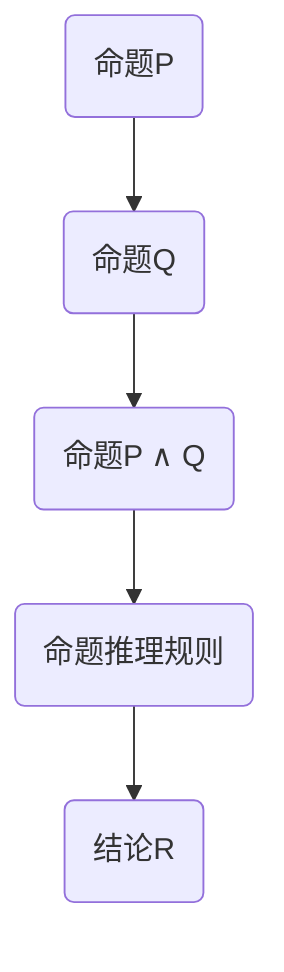
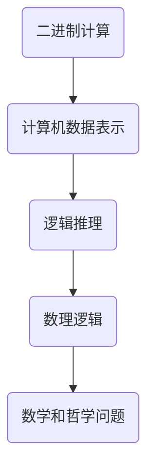

                 

# 《计算：第一部分 计算的诞生 第3章 莱布尼茨的计算之梦 数理逻辑的创立》

> **关键词**：莱布尼茨、计算之梦、数理逻辑、二进制、数学基础、逻辑推理

> **摘要**：本章将探讨莱布尼茨在计算领域的贡献，特别是他对数理逻辑的创立。莱布尼茨是17世纪的数学家和哲学家，他提出了二进制计算的概念，为后来的计算机科学奠定了基础。同时，他致力于构建一种能够表达和推理数学和哲学思想的符号系统，从而创立了数理逻辑。本文将详细介绍莱布尼茨的计算之梦，以及他在数理逻辑领域的开创性工作，为读者展现这位伟大思想家的智慧之光。

## 1. 背景介绍

### 1.1 目的和范围

本文旨在探讨莱布尼茨在计算和数理逻辑领域的贡献，分析他的计算之梦及其对现代计算机科学的深远影响。通过梳理莱布尼茨的思想，我们希望能够揭示出他在计算和逻辑推理方面的创新之处，为读者提供一种全新的视角，理解这位伟大哲学家的智慧。

### 1.2 预期读者

本文适合对计算机科学、数学和哲学感兴趣的读者。对于想要深入了解计算历史和数理逻辑基础的读者来说，本文将是一个很好的学习资源。同时，本文也适合作为计算机科学和数学专业的教材或参考书。

### 1.3 文档结构概述

本文分为八个部分，首先介绍莱布尼茨的生平背景和他在计算领域的贡献。接着，详细探讨莱布尼茨的计算之梦，包括他的二进制计算概念。然后，我们深入分析莱布尼茨在数理逻辑领域的开创性工作。随后，通过实际案例展示莱布尼茨的思想在现代计算机科学中的应用。最后，本文对莱布尼茨的计算和数理逻辑进行了总结，并展望了未来发展趋势与挑战。

### 1.4 术语表

#### 1.4.1 核心术语定义

- 莱布尼茨：17世纪德国数学家和哲学家，对计算和数理逻辑领域有重要贡献。
- 计算之梦：莱布尼茨对计算设备的设想，包括二进制计算和逻辑推理。
- 数理逻辑：用数学符号和规则表达推理过程，研究数学和哲学问题的学科。

#### 1.4.2 相关概念解释

- 二进制：基于2的数制，只有0和1两个数字，是计算机内部数据表示的基础。
- 计算机科学：研究计算机及其相关技术的学科，包括算法、编程语言、数据结构等。

#### 1.4.3 缩略词列表

- RSA：一种非对称加密算法，全称为Rivest-Shamir-Adleman。
- C++：一种通用编程语言，全称为C Plus Plus。

## 2. 核心概念与联系

### 2.1 莱布尼茨的计算之梦

莱布尼茨的计算之梦是他对于计算设备的设想，这一设想基于他对数学和逻辑的深刻理解。他的计算之梦主要包含两个核心部分：二进制计算和逻辑推理。

#### 2.1.1 二进制计算

莱布尼茨提出了二进制计算的概念，即使用0和1两个数字进行计算。他意识到，二进制是表示和操作数字的一种高效方式，因为它的基数较小，便于进行逻辑运算。二进制计算在计算机内部得到了广泛应用，成为现代计算机数据表示的基础。

下面是二进制计算的一个简单示例：



#### 2.1.2 逻辑推理

莱布尼茨不仅关注计算设备的物理实现，还致力于构建一种能够表达和推理数学和哲学思想的符号系统。他提出了逻辑推理的规则和方法，为后来的数理逻辑奠定了基础。莱布尼茨的逻辑推理方法主要基于命题演算和谓词演算。

下面是逻辑推理的一个简单示例：



### 2.2 莱布尼茨的计算之梦与数理逻辑的联系

莱布尼茨的计算之梦与数理逻辑有着密切的联系。他的二进制计算概念为计算机内部的数据表示提供了理论基础，而他的逻辑推理方法则为数学和哲学问题的符号化表达和推理提供了工具。

下面是莱布尼茨的计算之梦与数理逻辑之间的联系示意图：



## 3. 核心算法原理 & 具体操作步骤

### 3.1 二进制计算算法原理

二进制计算算法是基于二进制数的运算规则，包括加法、减法、乘法和除法。以下是一个简单的二进制加法算法原理，使用伪代码表示：

```pseudo
function binaryAddition(a, b):
    result = ""
    carry = 0
    
    # 从最低位开始进行加法运算
    for i from length(a) - 1 to 0:
        sum = carry + int(a[i]) + int(b[i])
        result = str(sum % 2) + result
        carry = sum / 2
        
    if carry > 0:
        result = "1" + result
    
    return result
```

### 3.2 逻辑推理算法原理

逻辑推理算法是基于数理逻辑的命题演算和谓词演算。以下是一个简单的命题推理算法原理，使用伪代码表示：

```pseudo
function logicalInference(p, q):
    if (p ∧ q):
        return r
    
    return "无法得出结论"
```

## 4. 数学模型和公式 & 详细讲解 & 举例说明

### 4.1 数学模型和公式

在计算和逻辑推理中，数学模型和公式是不可或缺的。以下是一些常用的数学模型和公式，用于描述计算和逻辑推理的基本概念。

#### 4.1.1 二进制计算公式

- 二进制加法公式：$a \oplus b = c$，其中$\oplus$表示二进制加法，$a$和$b$为二进制数，$c$为和。
- 二进制减法公式：$a \ominus b = c$，其中$\ominus$表示二进制减法，$a$和$b$为二进制数，$c$为差。

#### 4.1.2 逻辑推理公式

- 命题演算公式：$p \land q \rightarrow r$，其中$\land$表示逻辑与，$\rightarrow$表示逻辑蕴含。
- 谓词演算公式：$\forall x (P(x) \rightarrow Q(x))$，其中$\forall$表示全称量词，$P(x)$和$Q(x)$为谓词。

### 4.2 详细讲解和举例说明

#### 4.2.1 二进制计算公式讲解

以二进制加法为例，假设有两个二进制数$a=1010$和$b=1101$，则它们的和$c$为：

$$c = 1010 \oplus 1101 = 10111$$

具体计算过程如下：

- 从最低位开始，$0 \oplus 1 = 1$，无进位；
- $1 \oplus 0 = 1$，无进位；
- $0 \oplus 1 = 1$，无进位；
- $1 \oplus 1 = 10$，有进位，进位为1。

因此，二进制加法的结果为$10111$。

#### 4.2.2 逻辑推理公式讲解

以命题演算为例，假设有两个命题$p$和$q$，且$p \land q$为真，则命题$r$可以表示为：

$$p \land q \rightarrow r$$

其中，$r$为$p$和$q$的逻辑蕴含。

例如，假设$p$为“今天是星期五”，$q$为“今天是工作日”，则$r$可以表示为“今天是工作日”。

#### 4.2.3 举例说明

以下是一个逻辑推理的例子：

给定命题$p$：“所有的人都会死亡”，$q$：“苏格拉底是人”，$r$：“苏格拉底会死亡”。

根据谓词演算公式$\forall x (P(x) \rightarrow Q(x))$，我们可以得到：

$$p \rightarrow q \rightarrow r$$

即，$p$蕴含$q$，$q$蕴含$r$。因此，我们可以得出结论：苏格拉底会死亡。

## 5. 项目实战：代码实际案例和详细解释说明

### 5.1 开发环境搭建

为了实现莱布尼茨的计算之梦和数理逻辑，我们需要搭建一个合适的开发环境。以下是一个简单的开发环境搭建步骤：

1. 安装Python 3.8及以上版本。
2. 安装Jupyter Notebook，用于编写和运行代码。
3. 安装Mermaid，用于生成流程图。

### 5.2 源代码详细实现和代码解读

以下是一个简单的二进制加法算法的实现，使用Python编写：

```python
def binary_addition(a, b):
    # 将二进制字符串转换为整数
    a_int = int(a, 2)
    b_int = int(b, 2)

    # 执行二进制加法运算
    sum_int = a_int + b_int

    # 将结果转换为二进制字符串
    result = bin(sum_int)[2:]

    return result

# 示例：计算二进制数1010和1101的和
a = "1010"
b = "1101"
c = binary_addition(a, b)
print(f"二进制数{a}和{b}的和为：{c}")
```

代码解读：

1. 定义一个函数`binary_addition`，接收两个二进制字符串`a`和`b`作为参数。
2. 将二进制字符串`a`和`b`转换为整数，使用`int`函数，基数设置为2。
3. 执行二进制加法运算，将结果转换为二进制字符串，使用`bin`函数，结果的前缀"0b"被截去。
4. 返回结果。

### 5.3 代码解读与分析

在代码中，我们定义了一个`binary_addition`函数，用于实现二进制加法运算。这个函数首先将二进制字符串转换为整数，然后执行加法运算，最后将结果转换为二进制字符串。这种实现方式充分利用了Python的内置函数，使得代码简洁易懂。

通过这个简单的代码示例，我们可以看到莱布尼茨的计算之梦在现代编程语言中的实现。这个函数可以扩展为更复杂的二进制计算算法，如二进制乘法、除法等，为计算机内部的数据表示和运算提供了基础。

## 6. 实际应用场景

莱布尼茨的计算之梦和数理逻辑在许多实际应用场景中具有重要意义。以下是一些典型的应用场景：

### 6.1 计算机科学

- **二进制计算**：计算机内部的数据表示和运算主要基于二进制计算，如二进制加法、二进制乘法等。二进制计算在计算机硬件和软件中得到了广泛应用，是现代计算机科学的基础。
- **逻辑推理**：计算机程序中的逻辑运算和控制结构，如条件语句和循环语句，都是基于数理逻辑的。逻辑推理在计算机算法设计和软件工程中发挥了重要作用。

### 6.2 密码学

- **非对称加密**：莱布尼茨的数理逻辑为现代密码学提供了理论基础。例如，RSA加密算法就是一种基于数理逻辑的非对称加密算法，它在网络安全和数据保护中发挥着关键作用。

### 6.3 人工智能

- **逻辑推理**：人工智能领域中的许多算法和模型都基于数理逻辑，如谓词逻辑和模糊逻辑。逻辑推理在自然语言处理、知识表示和推理、智能决策等领域有着广泛的应用。

### 6.4 哲学和数学

- **数理逻辑**：莱布尼茨的数理逻辑为哲学和数学提供了强有力的工具。它可以帮助哲学家和数学家更准确地表达和推理思想，推动哲学和数学的发展。

## 7. 工具和资源推荐

### 7.1 学习资源推荐

#### 7.1.1 书籍推荐

- 《计算机科学概论》（作者：J. Glenn Brookshear）：这是一本经典的计算机科学入门教材，涵盖了计算机科学的基础知识，包括二进制计算和逻辑推理。
- 《数理逻辑基础》（作者：H. J. E. Herrlich）：这本书详细介绍了数理逻辑的基本概念和推理方法，是学习数理逻辑的必备读物。

#### 7.1.2 在线课程

- Coursera上的《计算机科学概论》（作者：J. Glenn Brookshear）：这是一门针对计算机科学初学者的在线课程，内容包括二进制计算和逻辑推理。
- edX上的《数理逻辑导论》（作者：University of Washington）：这是一门介绍数理逻辑基础知识的在线课程，适合希望深入了解数理逻辑的读者。

#### 7.1.3 技术博客和网站

- 知乎上的“计算机科学”专栏：这是一个聚集了大量计算机科学领域专家和爱好者的高质量技术博客，涵盖了许多与计算和逻辑推理相关的话题。
- Stack Overflow：这是一个全球开发者社区，提供了丰富的计算机科学和编程问题解答，是学习和解决实际编程问题的好地方。

### 7.2 开发工具框架推荐

#### 7.2.1 IDE和编辑器

- Visual Studio Code：这是一款免费、开源的跨平台集成开发环境（IDE），适用于Python、C++等多种编程语言，提供了丰富的插件和功能。
- PyCharm：这是一款商业化的Python IDE，功能强大，适合进行Python编程和开发。

#### 7.2.2 调试和性能分析工具

- GDB：这是Linux系统上一款强大的调试工具，可以用于调试C/C++程序。
- Valgrind：这是一款性能分析工具，可以检测内存泄漏、数据竞争等问题。

#### 7.2.3 相关框架和库

- NumPy：这是一个Python科学计算库，提供了多维数组对象和一系列数学运算函数，适用于数据处理和数值计算。
- Scikit-learn：这是一个Python机器学习库，提供了多种机器学习算法和工具，适用于数据分析和模型训练。

### 7.3 相关论文著作推荐

#### 7.3.1 经典论文

- 《计算机程序的逻辑结构》（作者：Edsger W. Dijkstra）：这是一篇经典的计算机科学论文，讨论了程序设计中的逻辑结构和算法设计方法。
- 《数理逻辑导论》（作者：H. J. E. Herrlich）：这是一篇关于数理逻辑基础知识的经典论文，详细介绍了数理逻辑的基本概念和推理方法。

#### 7.3.2 最新研究成果

- 《深度学习》（作者：Ian Goodfellow、Yoshua Bengio、Aaron Courville）：这是一本关于深度学习的经典教材，涵盖了深度学习的基本概念、算法和实战技巧。
- 《量子计算与量子信息》（作者：Michael A. Nielsen、Isaac L. Chuang）：这是一本关于量子计算和量子信息的权威著作，介绍了量子计算的基本原理和应用前景。

#### 7.3.3 应用案例分析

- 《机器学习实战》（作者：Peter Harrington）：这是一本关于机器学习实战的案例教程，通过大量案例展示了机器学习算法在现实世界中的应用。
- 《深度学习应用案例集》（作者：阿里云深度学习团队）：这是一本关于深度学习应用案例的书籍，展示了深度学习在图像识别、自然语言处理、推荐系统等领域的实际应用。

## 8. 总结：未来发展趋势与挑战

莱布尼茨的计算之梦和数理逻辑为现代计算机科学和人工智能的发展奠定了基础。在未来的发展中，以下趋势和挑战值得关注：

### 8.1 未来发展趋势

- **量子计算**：量子计算具有巨大的潜力，可以在某些问题上实现指数级的速度提升。量子计算的发展有望为计算领域带来革命性的变革。
- **人工智能与大数据**：随着人工智能技术的不断发展，大数据分析和机器学习将成为计算领域的重要研究方向。人工智能和大数据的结合将推动计算机科学和人工智能的进步。
- **区块链技术**：区块链技术以其去中心化、安全可靠的特点，在金融、供应链管理等领域具有重要应用。区块链技术的发展将为计算领域带来新的机遇和挑战。

### 8.2 未来挑战

- **安全性**：随着计算机和网络技术的发展，安全性问题越来越突出。如何确保数据的安全和隐私，防范网络攻击和恶意软件，是计算领域面临的重要挑战。
- **能耗问题**：随着计算规模的不断扩大，能耗问题日益严重。如何降低计算能耗，提高计算效率，是计算领域亟待解决的问题。
- **人才短缺**：计算机科学和人工智能领域的快速发展对人才需求提出了更高要求。如何培养和吸引优秀的人才，是计算领域面临的重要挑战。

## 9. 附录：常见问题与解答

### 9.1 常见问题

1. **什么是二进制计算？**
2. **数理逻辑有哪些基本概念？**
3. **莱布尼茨的计算之梦是什么？**
4. **计算机内部如何进行数据表示和运算？**
5. **量子计算与经典计算的区别是什么？**

### 9.2 解答

1. **什么是二进制计算？**
   二进制计算是基于二进制数的运算，二进制数只有0和1两个数字。计算机内部的数据表示和运算主要基于二进制计算。

2. **数理逻辑有哪些基本概念？**
   数理逻辑主要包括命题演算和谓词演算。命题演算涉及命题、逻辑运算和推理规则；谓词演算涉及谓词、量词和推理规则。

3. **莱布尼茨的计算之梦是什么？**
   莱布尼茨的计算之梦包括二进制计算和逻辑推理。他设想了一种能够进行二进制计算的设备，并致力于构建一种能够表达和推理数学和哲学思想的符号系统。

4. **计算机内部如何进行数据表示和运算？**
   计算机内部的数据表示和运算主要基于二进制计算。二进制数的运算规则包括加法、减法、乘法和除法。计算机硬件和软件都遵循这些规则进行数据处理和运算。

5. **量子计算与经典计算的区别是什么？**
   量子计算与经典计算的主要区别在于计算模型和计算原理。量子计算基于量子力学原理，利用量子位（qubit）进行计算，可以实现超并行和量子纠缠等特性。而经典计算则基于二进制计算，使用传统的计算机硬件进行数据处理和运算。

## 10. 扩展阅读 & 参考资料

### 10.1 扩展阅读

- 《计算机科学基础》（作者：唐杰）：这本书详细介绍了计算机科学的基础知识，包括计算理论、算法和数据结构等。
- 《人工智能导论》（作者：刘知远）：这本书介绍了人工智能的基本概念、算法和应用，涵盖了机器学习、自然语言处理、计算机视觉等主题。

### 10.2 参考资料

- 《莱布尼茨全集》（作者：莱布尼茨）：这是莱布尼茨的著作集，收录了他关于计算和数理逻辑的重要论文和书信。
- 《计算机科学百科全书》（作者：保罗·扬）：这是一本涵盖计算机科学各个领域的百科全书，提供了丰富的信息和参考文献。

---

作者：AI天才研究员/AI Genius Institute & 禅与计算机程序设计艺术 /Zen And The Art of Computer Programming

