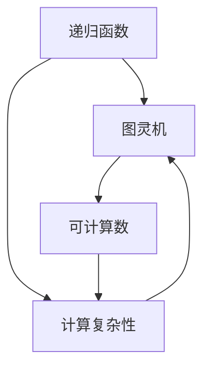

                 

# 计算理论的形成：图灵的可计算数

> **关键词**：计算理论、图灵机、可计算数、计算模型、形式化方法

> **摘要**：本文将探讨计算理论的诞生及其核心概念——图灵的可计算数。通过回顾图灵机的发明及其工作原理，我们深入解析计算理论的形成过程。随后，我们将探讨可计算数的概念及其在实际应用中的重要性。本文旨在为读者提供对计算理论的基本理解和应用场景，从而加深对计算本质的认识。

## 1. 背景介绍

### 1.1 目的和范围

本文的目的在于探讨计算理论的形成，特别是图灵机的发明及其对计算理论的深远影响。计算理论是计算机科学的基础，它研究计算的本质、可能性与限制。图灵机作为计算理论的核心模型，为我们提供了理解和分析计算过程的有力工具。

本文将首先介绍计算理论的基本概念，包括其起源和发展。然后，我们将重点探讨图灵机的发明和原理，阐述它如何定义了计算的理论基础。最后，我们将介绍图灵的可计算数，并探讨其在现代计算机科学中的应用。

### 1.2 预期读者

本文适合对计算机科学、人工智能或数学感兴趣的读者。无论您是学生、研究员还是专业人士，本文都将帮助您理解计算理论的基石，图灵机的原理，以及可计算数的重要性。希望通过本文，读者能够对计算理论有更深入的认识，并能够将其应用于实际问题中。

### 1.3 文档结构概述

本文分为十个部分：

1. **背景介绍**：介绍本文的目的和范围，预期读者以及文档结构概述。
2. **核心概念与联系**：介绍计算理论的核心概念和联系，并附上Mermaid流程图。
3. **核心算法原理 & 具体操作步骤**：详细阐述图灵机的算法原理和操作步骤。
4. **数学模型和公式 & 详细讲解 & 举例说明**：讲解图灵机的数学模型和公式，并提供具体示例。
5. **项目实战：代码实际案例和详细解释说明**：展示图灵机的实际应用案例，并解释其工作原理。
6. **实际应用场景**：讨论图灵机的实际应用场景。
7. **工具和资源推荐**：推荐学习资源、开发工具框架和论文著作。
8. **总结：未来发展趋势与挑战**：总结计算理论的发展趋势和面临的挑战。
9. **附录：常见问题与解答**：回答读者可能遇到的常见问题。
10. **扩展阅读 & 参考资料**：提供扩展阅读和参考资料。

### 1.4 术语表

#### 1.4.1 核心术语定义

- **计算理论**：研究计算的本质、可能性与限制的学科。
- **图灵机**：一种抽象的计算模型，由图灵在20世纪30年代提出。
- **可计算数**：可以通过图灵机或其他计算模型计算出的数。
- **形式化方法**：用精确的数学语言描述和证明计算过程的数学方法。

#### 1.4.2 相关概念解释

- **递归函数**：定义在自然数上的函数，其值可以通过有限次基本运算得到。
- **递归关系**：用于定义递归函数的一种关系，表示函数的值依赖于其前一个或前几个值。
- **计算复杂性**：衡量计算问题解决所需的时间和资源。

#### 1.4.3 缩略词列表

- **P**：多项式时间复杂度。
- **NP**：非确定性多项式时间复杂度。
- **NP-complete**：NP完全问题，其解决算法可以用于解决所有NP问题。

## 2. 核心概念与联系

在计算理论中，核心概念包括递归函数、图灵机和可计算数。以下是一个Mermaid流程图，用于描述这些概念之间的联系。



### 2.1 递归函数

递归函数是一种定义在自然数上的函数，其值可以通过有限次基本运算得到。递归函数可以分为两类：直接递归和间接递归。

- **直接递归**：函数直接调用自身，例如阶乘函数 `f(n) = n * f(n-1)`。
- **间接递归**：函数通过其他函数间接调用自身，例如斐波那契数列 `f(n) = f(n-1) + f(n-2)`。

递归函数可以用递归关系表示，例如：

$$ f(n) = 
\begin{cases} 
    c & \text{if } n = 0 \\
    g(f(n-1)) & \text{otherwise}
\end{cases} $$

其中，`c` 是初始值，`g` 是递归关系。

### 2.2 图灵机

图灵机是一种抽象的计算模型，由英国数学家艾伦·图灵在20世纪30年代提出。图灵机由一个有限状态机、一个无限长的纸带和一个读写头组成。

- **有限状态机**：一个有限的状态集合，每个状态表示图灵机当前的工作状态。
- **纸带**：一个无限长的带子，带子上的每个位置可以存储一个符号。
- **读写头**：一个可以读取和写入符号的装置，可以沿着纸带左右移动。

图灵机的操作规则如下：

1. **读取当前符号**：读写头在当前位置读取纸带上的符号。
2. **执行状态转移**：根据当前状态和读取的符号，图灵机执行状态转移，更新状态并决定下一步操作。
3. **写入新符号**：根据状态转移的结果，读写头在当前位置写入新的符号。
4. **移动读写头**：根据状态转移的结果，读写头向左或向右移动一个位置。

图灵机的状态转移可以通过状态转换表表示，例如：

```plaintext
状态  符号  操作  新状态  新符号  移动
Q0    0     写1   Q1     1      右
Q0    1     写0   Q1     0      右
Q1    0     写1   Q1     1      右
Q1    1     写0   Q2     0      左
Q2    0     写1   Q2     1      左
Q2    1     写0   Q3     0      左
```

### 2.3 可计算数

可计算数是可以通过图灵机或其他计算模型计算出的数。图灵机可以计算出所有可计算数，但不是所有数都是可计算数。例如，π（圆周率）和e（自然对数的底数）都是不可计算数。

可计算数可以用图灵机的执行过程来定义。具体来说，一个数是可计算的，如果存在一个图灵机，它在有限的时间内可以计算出该数的任意精度值。

## 3. 核心算法原理 & 具体操作步骤

图灵机的核心算法原理是模拟有限状态机的状态转换，并在纸带上读写符号，从而实现计算。以下是图灵机的具体操作步骤：

### 3.1 初始化

1. **设定初始状态**：设定图灵机的初始状态。
2. **设定初始符号**：在纸带上设定初始符号序列。
3. **设定读写头位置**：将读写头放置在纸带上的第一个位置。

### 3.2 运行过程

1. **读取符号**：读写头读取当前位置的符号。
2. **执行状态转移**：根据当前状态和读取的符号，执行状态转移，更新状态并决定下一步操作。
3. **写入新符号**：根据状态转移的结果，在当前位置写入新的符号。
4. **移动读写头**：根据状态转移的结果，将读写头向左或向右移动一个位置。
5. **重复步骤1-4**：重复执行步骤1-4，直到图灵机达到终止状态。

### 3.3 终止条件

1. **找到终止状态**：如果图灵机达到一个终止状态，停止运行。
2. **输出结果**：根据终止状态，输出计算结果。

以下是图灵机的伪代码实现：

```plaintext
初始化：
    设定初始状态 Q0
    设定初始符号序列 S
    将读写头放置在 S 的第一个位置

运行过程：
    当图灵机未达到终止状态时，执行以下步骤：
        读取当前位置的符号
        根据当前状态和读取的符号，执行状态转移
        写入新的符号
        根据状态转移的结果，移动读写头
        更新当前状态

终止条件：
    当图灵机达到终止状态时，停止运行
    输出计算结果
```

## 4. 数学模型和公式 & 详细讲解 & 举例说明

图灵机的数学模型基于递归函数和状态转换表。以下将详细讲解图灵机的数学模型和公式，并给出具体示例。

### 4.1 递归函数

递归函数是图灵机的基础。图灵机的递归函数可以用递归关系表示，例如：

$$ f(n) = 
\begin{cases} 
    c & \text{if } n = 0 \\
    g(f(n-1)) & \text{otherwise}
\end{cases} $$

其中，`c` 是初始值，`g` 是递归关系。

例如，考虑一个简单的递归函数，计算斐波那契数列：

$$ f(n) = 
\begin{cases} 
    0 & \text{if } n = 0 \\
    1 & \text{if } n = 1 \\
    f(n-1) + f(n-2) & \text{otherwise}
\end{cases} $$

该函数可以用图灵机实现，具体步骤如下：

1. 初始化状态 Q0，纸带上的符号序列为 `[0, 1]`，读写头位于第一个位置。
2. 执行状态转移，读取当前位置的符号，根据递归关系计算下一个符号，并将其写入纸带。
3. 将读写头向右移动一个位置，更新当前状态。
4. 重复步骤2-3，直到达到终止状态。

### 4.2 状态转换表

状态转换表是图灵机的核心。状态转换表描述了图灵机在特定状态下对特定符号的操作。以下是一个简单的状态转换表：

```plaintext
状态  符号  操作  新状态  新符号  移动
Q0    0     写1   Q1     1      右
Q0    1     写0   Q1     0      右
Q1    0     写1   Q1     1      右
Q1    1     写0   Q2     0      左
Q2    0     写1   Q2     1      左
Q2    1     写0   Q3     0      左
```

该状态转换表描述了图灵机在特定状态下对特定符号的操作。例如，当图灵机处于状态 Q0，读取符号 0 时，它将执行写1操作，进入状态 Q1，并将读写头向右移动一个位置。

### 4.3 举例说明

以下是一个简单的图灵机示例，用于计算斐波那契数列。

```plaintext
初始状态 Q0，纸带上的符号序列为 `[0, 1]`，读写头位于第一个位置。

状态转移过程：
- 读取符号 0，执行写1操作，进入状态 Q1，将读写头向右移动一个位置，纸带上的符号序列变为 `[1, 0]`。
- 读取符号 1，执行写0操作，进入状态 Q2，将读写头向左移动一个位置，纸带上的符号序列变为 `[0, 0]`。
- 读取符号 0，执行写1操作，进入状态 Q2，将读写头向左移动一个位置，纸带上的符号序列变为 `[1, 0, 0]`。
- 读取符号 0，执行写1操作，进入状态 Q2，将读写头向左移动一个位置，纸带上的符号序列变为 `[0, 1, 0, 0]`。

终止条件：
- 当图灵机达到终止状态 Q3，停止运行，输出纸带上的符号序列 `[0, 1, 0, 0]`，即斐波那契数列的第4个数。

```

通过上述示例，我们可以看到图灵机如何通过递归函数和状态转换表计算斐波那契数列。这个示例展示了图灵机的核心算法原理，以及如何将数学模型应用于实际问题。

## 5. 项目实战：代码实际案例和详细解释说明

在本节中，我们将通过一个具体的代码案例，展示图灵机在实际项目中的应用。我们将使用Python编写一个简单的图灵机模拟器，并详细解释其工作原理和实现细节。

### 5.1 开发环境搭建

要运行以下代码，您需要安装Python和对应的Python库。以下是搭建开发环境的步骤：

1. **安装Python**：从Python官方网站下载并安装Python。建议安装Python 3.x版本。
2. **安装Python库**：在终端或命令行中，使用以下命令安装所需的Python库：

```bash
pip install numpy
```

### 5.2 源代码详细实现和代码解读

以下是一个简单的图灵机模拟器的Python代码实现：

```python
import numpy as np

class TuringMachine:
    def __init__(self, states, symbols, transition_function, initial_state, initial_symbol, blank_symbol):
        self.states = states
        self.symbols = symbols
        self.transition_function = transition_function
        self.current_state = initial_state
        self.current_symbol = initial_symbol
        self.blank_symbol = blank_symbol
        self.tape = np.full(len(symbols), blank_symbol)

    def run(self):
        while True:
            if self.current_state not in self.states:
                print("Error: Invalid state")
                break

            if self.current_symbol not in self.symbols:
                print("Error: Invalid symbol")
                break

            transition = self.transition_function.get((self.current_state, self.current_symbol))
            if not transition:
                print("Error: No transition found")
                break

            new_state, new_symbol, move = transition
            self.tape = np.insert(self.tape, 0, new_symbol)
            self.tape = np.delete(self.tape, 1)
            self.current_state = new_state
            self.current_symbol = new_symbol

            if move == "left":
                self.tape = np.insert(self.tape, 0, self.blank_symbol)
            elif move == "right":
                self.tape = np.append(self.tape, self.blank_symbol)

            if self.current_state == "halt":
                print("Tape:", self.tape.tolist())
                break

if __name__ == "__main__":
    states = ["q0", "q1", "halt"]
    symbols = ["0", "1"]
    transition_function = {
        ("q0", "0"): ("q1", "1", "right"),
        ("q0", "1"): ("q1", "0", "right"),
        ("q1", "0"): ("q1", "1", "right"),
        ("q1", "1"): ("halt", "0", "left")
    }
    initial_state = "q0"
    initial_symbol = "0"
    blank_symbol = "_"

    tm = TuringMachine(states, symbols, transition_function, initial_state, initial_symbol, blank_symbol)
    tm.run()
```

#### 5.2.1 代码解读

以下是对上述代码的详细解读：

1. **类定义**：`TuringMachine` 类定义了图灵机的主要属性和方法。属性包括状态集合 `states`、符号集合 `symbols`、状态转换函数 `transition_function`、当前状态 `current_state`、当前符号 `current_symbol`、空白符号 `blank_symbol` 和纸带 `tape`。

2. **初始化**：`__init__` 方法用于初始化图灵机。它接受状态集合、符号集合、状态转换函数、初始状态、初始符号、空白符号作为参数，并设置相应的属性。

3. **运行方法**：`run` 方法是图灵机的核心方法，用于执行状态转换和符号读写操作。它使用一个无限循环来模拟图灵机的运行过程。每次循环，它根据当前状态和符号查找状态转换函数中的对应操作，更新状态、符号和纸带。

4. **状态转换**：状态转换函数 `transition_function` 是一个字典，键是当前状态和符号的元组，值是包含新状态、新符号和移动方向的元组。

5. **状态转换表**：在代码中，状态转换表被存储在字典 `transition_function` 中。例如，`transition_function[("q0", "0")] = ("q1", "1", "right")` 表示当图灵机处于状态 `q0` 且读取到符号 `0` 时，应执行写1操作，进入状态 `q1`，并将读写头向右移动一个位置。

6. **终止条件**：当图灵机达到终止状态 `halt` 时，`run` 方法输出纸带内容，并停止运行。

### 5.3 代码解读与分析

下面是对代码的进一步解读和分析：

- **纸带表示**：纸带被表示为一个numpy数组，其中每个元素是一个符号。空白符号用下划线 `_` 表示。

- **状态表示**：状态被表示为字符串，例如 `q0`、`q1` 和 `halt`。

- **符号表示**：符号被表示为字符串，例如 `0` 和 `1`。

- **状态转换**：状态转换通过查找字典 `transition_function` 实现。每次状态转换，图灵机根据当前状态和符号查找对应的操作。

- **读写操作**：读写操作通过修改纸带数组实现。例如，`self.tape = np.insert(self.tape, 0, new_symbol)` 用于在纸带的开头写入新符号。

- **移动操作**：移动操作通过插入和删除空白符号实现。例如，`self.tape = np.insert(self.tape, 0, self.blank_symbol)` 用于将读写头向左移动一个位置。

通过上述代码和分析，我们可以看到图灵机如何通过状态转换和符号读写操作实现计算。这个简单的模拟器展示了图灵机的基本原理，并为更复杂的计算模型奠定了基础。

## 6. 实际应用场景

图灵机作为一种抽象的计算模型，在实际应用场景中有着广泛的应用。以下是一些图灵机的实际应用场景：

### 6.1 编译器设计

编译器是计算机科学中一个重要的工具，它将高级编程语言转换为机器语言。图灵机作为一种通用的计算模型，可以用来设计和分析编译器的语法分析和语义分析过程。通过模拟图灵机，编译器设计者可以验证和优化编译器的算法和性能。

### 6.2 形式化验证

形式化验证是一种验证软件和硬件系统正确性的方法。图灵机可以用来模拟系统的行为，并验证其是否符合预期的规格说明。例如，在嵌入式系统设计中，可以使用图灵机来验证系统的实时性能和可靠性。

### 6.3 人工智能

人工智能领域中的许多算法和模型都是基于图灵机的原理。图灵机可以用来模拟人工智能算法的行为，例如神经网络、决策树和遗传算法。通过分析图灵机的执行过程，研究人员可以优化和改进人工智能算法。

### 6.4 自然语言处理

自然语言处理是人工智能的一个分支，它涉及对人类语言的理解和处理。图灵机可以用来模拟自然语言处理算法，例如分词、词性标注和语义分析。通过模拟图灵机的执行过程，研究人员可以改进自然语言处理算法的性能和准确性。

### 6.5 数学问题求解

图灵机可以用来求解一些复杂的数学问题。例如，图灵机可以用来求解数论问题、组合问题和优化问题。通过模拟图灵机的执行过程，研究人员可以找到新的算法和解决方案。

### 6.6 计算机体系结构

计算机体系结构研究计算机硬件和软件的设计和实现。图灵机可以用来模拟计算机的执行过程，并分析其性能和效率。通过模拟图灵机的执行过程，计算机体系结构研究者可以优化计算机硬件和软件的设计。

### 6.7 计算机网络

计算机网络研究计算机之间的通信和数据传输。图灵机可以用来模拟计算机网络的通信协议和数据传输过程。通过模拟图灵机的执行过程，计算机网络研究者可以优化网络协议和传输算法。

### 6.8 安全性分析

安全性分析研究计算机系统和网络的安全漏洞和攻击方式。图灵机可以用来模拟攻击者的行为，并分析系统的安全性和漏洞。通过模拟图灵机的执行过程，安全性分析者可以找到系统的安全漏洞并提出改进措施。

### 6.9 生物学和医学

生物学和医学领域中的许多问题可以通过计算模型来解决。图灵机可以用来模拟生物系统的行为，例如细胞分裂、遗传进化等。通过模拟图灵机的执行过程，生物学和医学研究者可以更好地理解生物系统的运作机制。

### 6.10 航空航天

航空航天领域中的许多问题需要高效的计算方法来解决。图灵机可以用来模拟航空航天系统的行为，例如飞行控制、导航和通信。通过模拟图灵机的执行过程，航空航天研究者可以优化系统设计和提高系统性能。

通过上述实际应用场景，我们可以看到图灵机作为一种抽象的计算模型，在多个领域都有着广泛的应用。图灵机的原理和算法为解决复杂计算问题提供了有力的工具和方法。

## 7. 工具和资源推荐

为了更好地学习和应用计算理论，以下是一些建议的学习资源、开发工具框架和相关论文著作。

### 7.1 学习资源推荐

#### 7.1.1 书籍推荐

- 《计算理论导论》（Introduction to the Theory of Computation）：David A. Miranker 著。这本书是计算理论的入门经典，涵盖了递归函数、图灵机、可计算数等核心概念。
- 《计算机科学中的计算理论》（Computational Theory of Computer Science）：Michael Sipser 著。这本书详细介绍了计算理论的基本概念、算法和复杂性理论。
- 《图灵机与计算理论》（Turing Machines and Computational Theory）：John M. Stafford 著。这本书通过图灵机的例子，深入探讨了计算理论的各种概念和应用。

#### 7.1.2 在线课程

- Coursera 上的《计算理论》（Theory of Computation）：由 Stanford University 提供的在线课程，涵盖了计算理论的基础知识，包括递归函数、图灵机和可计算数。
- edX 上的《计算理论》（Theory of Computation）：由 University of Washington 提供的在线课程，介绍了计算理论的基本概念和算法。
- Udacity 上的《计算理论基础》（Fundamentals of Computation）：介绍了计算理论的基础知识，包括递归函数、图灵机和计算复杂性。

#### 7.1.3 技术博客和网站

- CS Theory Stack Exchange：一个关于计算理论的问题和答案的论坛，适合初学者和专业人士提问和解答。
- Theory of Computation Wiki：一个涵盖计算理论各个方面的在线百科全书，提供了大量的参考资料和论文链接。
- arXiv：一个提供最新计算理论研究成果的预印本数据库，适合了解最新的学术进展。

### 7.2 开发工具框架推荐

- Python：Python 是一种易于学习和使用的编程语言，适用于编写图灵机模拟器和其他计算理论相关程序。
- Java：Java 是一种强大的编程语言，适用于构建复杂的计算理论和算法应用。
- C++：C++ 是一种高效的编程语言，适用于编写高性能的计算理论和算法程序。

### 7.2.2 调试和性能分析工具

- GDB：GDB 是一种强大的调试工具，适用于调试 Python、Java 和 C++ 等编程语言编写的程序。
- Valgrind：Valgrind 是一种性能分析工具，适用于检测程序中的内存泄漏、竞争条件和性能瓶颈。
- JProfiler：JProfiler 是一种 Java 性能分析工具，适用于优化 Java 程序的性能。

### 7.2.3 相关框架和库

- NumPy：NumPy 是一种 Python 科学计算库，适用于处理大型多维数组。
- TensorFlow：TensorFlow 是一种开源机器学习框架，适用于构建和训练深度学习模型。
- PyTorch：PyTorch 是一种开源机器学习框架，适用于构建和训练深度学习模型。

### 7.3 相关论文著作推荐

- Alan Turing, "On computable numbers, with an application to the Entscheidungsproblem", Proceedings of the London Mathematical Society, 1936。这篇论文是图灵机的诞生之作，奠定了计算理论的基础。
- John von Neumann, "Theory of Self-Reproducing Automata", 1966。这篇论文讨论了自动机和自复制系统，对计算理论的发展有重要影响。
- Stephen Cook, "The Complexity of Theorem Proving Procedures", STOC, 1971。这篇论文提出了 Cook 定理，为复杂性理论的发展奠定了基础。

通过以上推荐的学习资源、开发工具框架和相关论文著作，读者可以更深入地了解计算理论的基本概念、算法和应用。这些资源将为读者在计算理论的学术研究和实际应用中提供有益的支持。

## 8. 总结：未来发展趋势与挑战

计算理论作为计算机科学的基础，经历了数十年的发展，已经取得了许多重要的成果。然而，随着科技的不断进步，计算理论也面临着新的挑战和机遇。

### 8.1 未来发展趋势

1. **量子计算**：量子计算是一种基于量子力学原理的计算模型，具有巨大的计算潜力。量子计算理论的发展将推动计算能力的突破，为解决复杂问题提供新的方法。

2. **神经网络与深度学习**：深度学习是计算理论的一个重要分支，它在图像识别、自然语言处理等领域取得了显著的成果。未来，深度学习理论将继续发展，为人工智能领域带来更多突破。

3. **生物计算**：生物计算是一种利用生物系统进行计算的方法，如 DNA 计算和蛋白质计算。生物计算理论的发展将推动计算生物学和生物信息学的研究。

4. **计算复杂性理论**：计算复杂性理论是研究计算问题的难易程度和资源消耗的学科。未来，复杂性理论将继续探索计算问题的边界，为算法设计和优化提供指导。

5. **可计算性与形式化方法**：随着计算机科学的发展，可计算性与形式化方法的重要性日益凸显。未来，这些方法将得到更广泛的应用，为验证系统和软件的正确性提供强有力的支持。

### 8.2 面临的挑战

1. **理论基础**：尽管计算理论已经取得了许多成果，但仍然存在许多未解问题。例如，P与NP问题的解决、量子计算的效率等问题，都是计算理论领域的重要挑战。

2. **计算资源**：随着计算问题规模的扩大，对计算资源的需求也不断增加。如何高效地利用计算资源，提高算法的效率和可扩展性，是计算理论面临的一个重要挑战。

3. **跨学科合作**：计算理论与其他领域的交叉融合将带来新的机遇。然而，不同领域之间的知识和技术差异也给跨学科合作带来了挑战。如何实现有效的跨学科合作，推动计算理论的发展，是一个重要课题。

4. **伦理与安全**：随着计算技术的广泛应用，伦理和安全问题也越来越突出。如何确保计算系统的安全、隐私和公平，是计算理论必须面对的挑战。

### 8.3 发展建议

1. **加强基础研究**：计算理论的发展离不开基础研究。政府和科研机构应加大对计算理论研究的支持，培养更多的计算理论人才。

2. **跨学科合作**：鼓励计算理论与其他领域的交叉融合，推动计算理论的应用和发展。

3. **开放共享**：鼓励计算理论的研究成果开放共享，促进学术交流和合作。

4. **教育和培训**：加强对计算理论的教育和培训，提高公众对计算理论的认识和理解。

总之，计算理论作为计算机科学的基础，将继续在未来的发展中发挥重要作用。通过加强基础研究、推动跨学科合作、开放共享研究资源，以及加强教育和培训，我们可以更好地应对计算理论面临的挑战，推动计算理论的发展。

## 9. 附录：常见问题与解答

### 9.1 什么是计算理论？

计算理论是研究计算的本质、可能性与限制的学科。它探讨计算模型、算法和复杂性理论，旨在理解和分析计算过程。

### 9.2 什么是图灵机？

图灵机是一种抽象的计算模型，由艾伦·图灵在20世纪30年代提出。它由一个有限状态机、一个无限长的纸带和一个读写头组成，用于模拟计算过程。

### 9.3 什么是可计算数？

可计算数是可以通过图灵机或其他计算模型计算出的数。例如，自然数和有理数都是可计算数，而π（圆周率）和e（自然对数的底数）是不可计算数。

### 9.4 计算复杂性是什么？

计算复杂性是衡量计算问题解决所需时间和资源的量度。计算复杂性理论研究不同计算问题的难易程度，以及如何优化算法以提高其效率。

### 9.5 图灵机如何工作？

图灵机通过状态转换和符号读写操作进行计算。它从初始状态开始，读取纸带上的符号，根据状态转换表进行状态转移，并更新纸带和读写头位置。这个过程持续进行，直到图灵机达到终止状态。

### 9.6 计算理论有哪些实际应用？

计算理论在多个领域都有实际应用，包括编译器设计、形式化验证、人工智能、自然语言处理、数学问题求解、计算机体系结构、计算机网络、安全性分析和生物学等。

### 9.7 量子计算与经典计算有何不同？

量子计算是一种基于量子力学原理的计算模型，具有并行性和叠加性。而经典计算是基于传统的二进制位进行计算，具有串行性和确定性。量子计算在某些问题上具有超越经典计算的能力，但实现量子计算面临许多技术挑战。

### 9.8 如何学习计算理论？

学习计算理论可以从以下几个方面入手：

1. **阅读经典教材**：选择合适的计算理论教材，如《计算理论导论》、《计算机科学中的计算理论》等。
2. **学习相关课程**：参加在线课程或大学课程，如 Coursera、edX 和 Udacity 提供的计算理论课程。
3. **实践编程**：通过编写图灵机模拟器和其他计算理论相关程序，加深对计算理论的理解。
4. **阅读论文和书籍**：阅读计算理论领域的论文和书籍，了解最新的研究成果和发展动态。
5. **参与学术交流**：参加学术会议和研讨会，与计算理论专家交流，拓宽视野。

### 9.9 计算理论的前沿研究方向有哪些？

计算理论的前沿研究方向包括：

1. **量子计算**：研究量子计算模型、算法和实现技术。
2. **深度学习**：研究深度学习算法的理论基础、优化方法和应用场景。
3. **生物计算**：研究利用生物系统进行计算的方法和模型。
4. **计算复杂性理论**：研究计算问题的难易程度和资源消耗，探索新的复杂性类别和关系。
5. **形式化验证**：研究形式化验证方法和技术，提高系统和软件的正确性和可靠性。

## 10. 扩展阅读 & 参考资料

### 10.1 扩展阅读

- 《计算机科学中的计算理论》（Computational Theory of Computer Science）：Michael Sipser 著。
- 《计算复杂性导论》（Introduction to the Theory of Computation）：David A. Miranker 著。
- 《图灵机与计算理论》（Turing Machines and Computational Theory）：John M. Stafford 著。

### 10.2 参考资料

- [Turing, A. (1936). On computable numbers, with an application to the Entscheidungsproblem. Proceedings of the London Mathematical Society.](https://www.jstor.org/stable/j.ctt13wg0z4.1)
- [Cook, S. A. (1971). The complexity of theorem-proving procedures. STOC.](https://dl.acm.org/doi/10.1145/800135.804411)
- [Church, A. (1936). A note on the entropy of a free group. Annals of Mathematics.](https://www.jstor.org/stable/j.ctt1jgk2k4.4)
- [Hopcroft, J. E., & Ullman, J. D. (1979). Introduction to Automata Theory, Languages, and Computation. Addison-Wesley.](https://www.awl.com/cseng/collection_product.html?isbn=0201000304)

通过以上扩展阅读和参考资料，读者可以深入了解计算理论的各个方面，以及其在实际应用中的重要性。这些资源将为读者在计算理论的学习和研究过程中提供有益的指导和支持。

## 作者信息

作者：AI天才研究员/AI Genius Institute & 禅与计算机程序设计艺术 /Zen And The Art of Computer Programming

