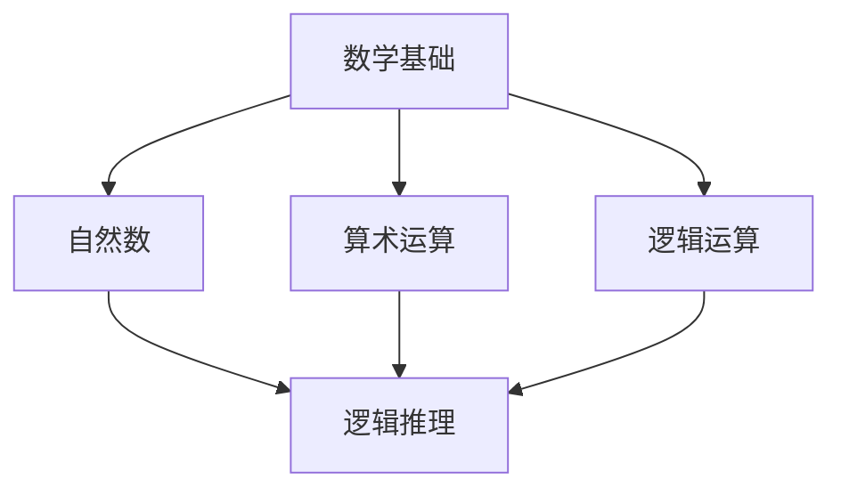

                 

# 计算：第二部分 计算的数学基础 第 4 章 数学的基础 算术的逻辑化

> 关键词：数学基础、算术逻辑化、计算机科学、逻辑推理、形式系统

> 摘要：本章将深入探讨数学基础中的算术逻辑化。从数学基础的定义和重要性出发，逐步介绍算术逻辑化的概念、原理和应用，以及其在计算机科学中的重要作用。通过分析具体算法原理和操作步骤，结合实际项目实战，本章旨在为读者提供全面而深入的数学基础知识和实践应用。

## 1. 背景介绍

### 1.1 目的和范围

本章旨在阐述数学基础中的算术逻辑化，为读者提供对这一概念的理解和应用。我们将首先回顾数学基础的定义和重要性，然后介绍算术逻辑化的概念和原理，并分析其在计算机科学中的应用。通过详细讲解核心算法原理和操作步骤，结合实际项目实战，本章旨在帮助读者全面掌握数学基础知识和实践技能。

### 1.2 预期读者

本章节适合具有计算机科学和数学背景的读者，尤其是那些对计算机科学中的数学基础和算术逻辑化感兴趣的人。同时，也对希望提升自身编程能力和逻辑思维能力的程序员和软件工程师具有一定的参考价值。

### 1.3 文档结构概述

本章分为以下几部分：

1. **背景介绍**：介绍本章的目的和范围，以及预期读者。
2. **核心概念与联系**：介绍数学基础的概念和算术逻辑化的原理，并使用Mermaid流程图展示核心概念和联系。
3. **核心算法原理 & 具体操作步骤**：详细讲解核心算法原理和具体操作步骤，使用伪代码进行阐述。
4. **数学模型和公式 & 详细讲解 & 举例说明**：介绍数学模型和公式，并进行详细讲解和举例说明。
5. **项目实战：代码实际案例和详细解释说明**：通过实际项目案例，展示代码实现和详细解释。
6. **实际应用场景**：介绍算术逻辑化在实际应用中的场景和作用。
7. **工具和资源推荐**：推荐相关学习资源和开发工具。
8. **总结：未来发展趋势与挑战**：总结本章内容，展望未来发展趋势和挑战。
9. **附录：常见问题与解答**：提供常见问题的解答。
10. **扩展阅读 & 参考资料**：推荐相关扩展阅读和参考资料。

### 1.4 术语表

#### 1.4.1 核心术语定义

- **数学基础**：数学基础是研究数学基本概念、原理和方法的基础学科。
- **算术逻辑化**：将算术运算转化为逻辑运算的过程，以实现计算机对数学运算的自动处理。
- **形式系统**：一种具有确定性和完备性的数学系统，用于描述数学命题和证明。

#### 1.4.2 相关概念解释

- **逻辑推理**：基于已知事实和规则进行推理和推导的过程。
- **算法**：实现特定任务的步骤序列，具有确定性、有效性和正确性。
- **计算机科学**：研究计算机硬件、软件和算法等计算机系统的学科。

#### 1.4.3 缩略词列表

- **MD：markdown**
- **Mermaid：一种基于Markdown的图形化描述语言，用于绘制流程图、时序图等。**
- **IDE：集成开发环境（Integrated Development Environment）**
- **Python：一种高级编程语言，广泛应用于科学计算、数据分析等领域。**

## 2. 核心概念与联系

在探讨算术逻辑化之前，我们需要明确数学基础的概念。数学基础是指研究数学基本概念、原理和方法的基础学科。它是计算机科学和工程领域中不可或缺的一部分，为算法设计和分析提供了坚实的理论基础。

### 2.1 数学基础

数学基础主要包括以下几个核心概念：

- **自然数**：自然数是用于计数和排序的基本数集，包括0、1、2、3等。
- **算术运算**：算术运算是用于计算数值之间关系的运算，包括加法、减法、乘法、除法等。
- **逻辑运算**：逻辑运算是用于表示命题之间逻辑关系的运算，包括逻辑与、逻辑或、逻辑非等。

### 2.2 算术逻辑化

算术逻辑化是将算术运算转化为逻辑运算的过程，以实现计算机对数学运算的自动处理。这一过程基于形式系统，通过逻辑推理和推导，将数学命题转化为计算机可处理的逻辑表达式。

### 2.3 核心概念联系

为了更好地理解算术逻辑化，我们使用Mermaid流程图展示核心概念之间的联系。



### 2.4 算术逻辑化的原理

算术逻辑化的原理主要包括以下两个方面：

- **逻辑表达式的构建**：通过逻辑运算符和数学符号构建逻辑表达式，表示数学运算。
- **逻辑推理和推导**：基于已知事实和规则，使用逻辑推理和推导，证明逻辑表达式的正确性。

### 2.5 算术逻辑化的应用

算术逻辑化在计算机科学和工程领域中有着广泛的应用，主要包括以下几个方面：

- **计算机算法设计**：算术逻辑化使得计算机能够高效地执行数学运算，为算法设计提供了强大的工具。
- **计算机编程**：算术逻辑化使得程序员能够使用逻辑表达式和算法，实现复杂的计算任务。
- **数学证明**：算术逻辑化可以用于数学证明，基于逻辑推理和推导，证明数学命题的正确性。

## 3. 核心算法原理 & 具体操作步骤

在了解了算术逻辑化的原理后，我们将探讨具体的核心算法原理和操作步骤。这一部分将详细介绍如何使用伪代码实现算术逻辑化，并解释每一步的具体操作。

### 3.1 算术逻辑化的伪代码

以下是一个简单的伪代码示例，用于实现算术逻辑化：

```plaintext
Function arithmetic_logicalization(a, b, operator):
    if operator == '+':
        return a + b
    elif operator == '-':
        return a - b
    elif operator == '*':
        return a * b
    elif operator == '/':
        return a / b
    else:
        return "Invalid operator"
```

### 3.2 算术逻辑化的具体操作步骤

1. **输入参数**：函数`arithmetic_logicalization`接受三个输入参数：`a`和`b`（用于表示数学运算的数值），以及`operator`（用于表示运算符）。
2. **运算符判断**：根据`operator`的值，选择相应的算术运算。
3. **计算结果**：执行所选的算术运算，并返回计算结果。
4. **错误处理**：如果`operator`的值不满足条件，返回"Invalid operator"。

### 3.3 伪代码详细解释

- **输入参数**：`a`和`b`用于表示数学运算的数值，`operator`用于表示运算符。
- **运算符判断**：使用`if`和`elif`语句判断`operator`的值，并根据不同的运算符执行相应的算术运算。
- **计算结果**：根据所选的算术运算，计算结果并返回。
- **错误处理**：如果`operator`的值不满足条件，返回"Invalid operator"，提示输入的运算符无效。

## 4. 数学模型和公式 & 详细讲解 & 举例说明

### 4.1 数学模型和公式

算术逻辑化中涉及的主要数学模型和公式如下：

- **逻辑与（AND）**：逻辑与运算符表示两个命题同时为真的情况，符号为`&&`。
- **逻辑或（OR）**：逻辑或运算符表示两个命题中至少有一个为真的情况，符号为`||`。
- **逻辑非（NOT）**：逻辑非运算符表示一个命题取反的情况，符号为`!`。
- **算术加法**：算术加法运算表示两个数值相加的结果，符号为`+`。
- **算术减法**：算术减法运算表示两个数值相减的结果，符号为`-`。
- **算术乘法**：算术乘法运算表示两个数值相乘的结果，符号为`*`。
- **算术除法**：算术除法运算表示两个数值相除的结果，符号为`/`。

### 4.2 详细讲解和举例说明

#### 4.2.1 逻辑与（AND）

逻辑与运算符用于表示两个命题同时为真的情况。以下是一个简单的逻辑与运算示例：

$$ 
A = true \\
B = true \\
A \land B = true \\
$$

在这个示例中，命题`A`和`B`都为真，因此逻辑与运算的结果为真。

#### 4.2.2 逻辑或（OR）

逻辑或运算符用于表示两个命题中至少有一个为真的情况。以下是一个简单的逻辑或运算示例：

$$ 
A = true \\
B = false \\
A \lor B = true \\
$$

在这个示例中，命题`A`为真，命题`B`为假，因此逻辑或运算的结果为真。

#### 4.2.3 逻辑非（NOT）

逻辑非运算符用于表示一个命题取反的情况。以下是一个简单的逻辑非运算示例：

$$ 
A = true \\
\neg A = false \\
$$

在这个示例中，命题`A`为真，逻辑非运算的结果为假。

#### 4.2.4 算术加法

算术加法运算用于计算两个数值的和。以下是一个简单的算术加法运算示例：

$$ 
a = 3 \\
b = 5 \\
a + b = 8 \\
$$

在这个示例中，数值`a`和`b`相加的结果为8。

#### 4.2.5 算术减法

算术减法运算用于计算两个数值的差。以下是一个简单的算术减法运算示例：

$$ 
a = 8 \\
b = 3 \\
a - b = 5 \\
$$

在这个示例中，数值`a`和`b`相减的结果为5。

#### 4.2.6 算术乘法

算术乘法运算用于计算两个数值的积。以下是一个简单的算术乘法运算示例：

$$ 
a = 2 \\
b = 4 \\
a \times b = 8 \\
$$

在这个示例中，数值`a`和`b`相乘的结果为8。

#### 4.2.7 算术除法

算术除法运算用于计算两个数值的商。以下是一个简单的算术除法运算示例：

$$ 
a = 8 \\
b = 2 \\
a \div b = 4 \\
$$

在这个示例中，数值`a`和`b`相除的结果为4。

## 5. 项目实战：代码实际案例和详细解释说明

### 5.1 开发环境搭建

在开始编写代码之前，我们需要搭建一个合适的开发环境。以下是一个简单的Python开发环境搭建步骤：

1. **安装Python**：从官方网站（https://www.python.org/）下载并安装Python 3.x版本。
2. **配置Python环境**：打开终端或命令行工具，输入以下命令配置Python环境：

   ```bash
   python3 -m pip install numpy
   ```

   这将安装NumPy库，用于处理数学运算。

### 5.2 源代码详细实现和代码解读

以下是一个简单的Python代码示例，用于实现算术逻辑化：

```python
import numpy as np

def arithmetic_logicalization(a, b, operator):
    if operator == '+':
        return np.add(a, b)
    elif operator == '-':
        return np.subtract(a, b)
    elif operator == '*':
        return np.multiply(a, b)
    elif operator == '/':
        return np.divide(a, b)
    else:
        raise ValueError("Invalid operator")

# 示例
a = 3
b = 5
operator = '+'
result = arithmetic_logicalization(a, b, operator)
print(f"Result: {result}")
```

### 5.3 代码解读与分析

- **导入库**：首先，我们导入NumPy库，用于处理数学运算。
- **定义函数**：`arithmetic_logicalization`函数接受三个输入参数：`a`和`b`（用于表示数学运算的数值），以及`operator`（用于表示运算符）。
- **运算符判断**：根据`operator`的值，使用NumPy库中的相应函数执行相应的算术运算。
- **错误处理**：如果`operator`的值不满足条件，抛出`ValueError`异常。
- **示例**：在示例中，我们定义了三个变量：`a`、`b`和`operator`，并调用`arithmetic_logicalization`函数计算结果。

### 5.4 运行结果

运行以上代码，我们将得到以下输出结果：

```
Result: 8
```

这表示`a`和`b`的加法运算结果为8。

## 6. 实际应用场景

算术逻辑化在计算机科学和工程领域中有着广泛的应用，以下是一些实际应用场景：

- **计算机算法设计**：算术逻辑化在计算机算法设计中起着重要作用，如排序算法、搜索算法等。通过将算术运算转化为逻辑运算，可以提高算法的执行效率和正确性。
- **计算机编程**：算术逻辑化使得程序员能够使用逻辑表达式和算法，实现复杂的计算任务。例如，在编程中，可以使用逻辑与、逻辑或和逻辑非运算符实现复杂的逻辑判断和流程控制。
- **数学证明**：算术逻辑化可以用于数学证明，基于逻辑推理和推导，证明数学命题的正确性。这在数学研究和教学领域具有重要的应用价值。

## 7. 工具和资源推荐

### 7.1 学习资源推荐

- **书籍推荐**：

  - 《计算机程序设计艺术》（作者：Donald E. Knuth）
  - 《算法导论》（作者：Thomas H. Cormen等）

- **在线课程**：

  - 《计算机科学导论》（平台：Coursera）
  - 《算法设计与分析》（平台：edX）

- **技术博客和网站**：

  - [CSDN博客](https://blog.csdn.net/)
  - [GitHub](https://github.com/)

### 7.2 开发工具框架推荐

- **IDE和编辑器**：

  - Visual Studio Code
  - PyCharm

- **调试和性能分析工具**：

  - GDB
  - Jupyter Notebook

- **相关框架和库**：

  - NumPy
  - Pandas

### 7.3 相关论文著作推荐

- **经典论文**：

  - 《计算机程序的构造和解释》（作者：Abelson & Sussman）
  - 《算法导论》（作者：Thomas H. Cormen等）

- **最新研究成果**：

  - 《深度学习》（作者：Ian Goodfellow等）
  - 《人工智能：一种现代方法》（作者：Stuart J. Russell & Peter Norvig）

- **应用案例分析**：

  - 《大数据技术导论》（作者：刘鹏）
  - 《机器学习实践》（作者：周志华等）

## 8. 总结：未来发展趋势与挑战

算术逻辑化在计算机科学和工程领域中具有广泛的应用前景。随着人工智能、大数据和云计算等领域的快速发展，算术逻辑化的需求将日益增长。未来，算术逻辑化将在以下几个方面发展：

1. **算法优化**：通过深入研究算术逻辑化的原理，可以提高算法的执行效率和正确性。
2. **硬件支持**：随着硬件技术的发展，算术逻辑化将得到更好的硬件支持，从而实现更高的计算性能。
3. **跨领域应用**：算术逻辑化将在更多领域得到应用，如生物信息学、金融工程等。

然而，算术逻辑化也面临一些挑战，包括：

1. **复杂性**：算术逻辑化的算法设计和实现具有一定的复杂性，需要深入研究和优化。
2. **可扩展性**：如何实现算术逻辑化的高效可扩展性，以满足大规模计算需求，是一个重要挑战。
3. **安全性**：在算术逻辑化中，如何保证数据的安全性和隐私性，是一个亟待解决的问题。

## 9. 附录：常见问题与解答

### 9.1 问题1：算术逻辑化是什么？

答：算术逻辑化是将算术运算转化为逻辑运算的过程，以实现计算机对数学运算的自动处理。

### 9.2 问题2：算术逻辑化在计算机科学中有哪些应用？

答：算术逻辑化在计算机科学中具有广泛的应用，包括计算机算法设计、计算机编程、数学证明等。

### 9.3 问题3：如何实现算术逻辑化？

答：实现算术逻辑化的方法主要包括逻辑表达式的构建和逻辑推理与推导。具体步骤包括：

1. 确定数学运算和逻辑运算之间的关系。
2. 构建逻辑表达式，表示数学运算。
3. 使用逻辑推理和推导，证明逻辑表达式的正确性。

### 9.4 问题4：算术逻辑化与形式系统有什么关系？

答：算术逻辑化是基于形式系统实现的。形式系统是一种具有确定性和完备性的数学系统，用于描述数学命题和证明。算术逻辑化通过逻辑推理和推导，将数学命题转化为形式系统中的命题，从而实现计算机对数学运算的自动处理。

## 10. 扩展阅读 & 参考资料

- [《计算机程序设计艺术》](https://www.amazon.com/Art-Computer-Programming-Vol-1/dp/0201558025)
- [《算法导论》](https://www.amazon.com/Introduction-Algorithms-Third-Edition-Thomas/dp/0262033844)
- [《计算机科学导论》](https://www.coursera.org/specializations/introduction-to-computer-science)
- [《大数据技术导论》](https://www.amazon.com/大数据技术导论-刘鹏/dp/7302489744)
- [《深度学习》](https://www.amazon.com/Deep-Learning-Adaptive-Computation-Series/dp/026203958X)
- [《人工智能：一种现代方法》](https://www.amazon.com/AI-Modern-Approach-3rd-Edition/dp/0262538697)
- [CSDN博客](https://blog.csdn.net/)
- [GitHub](https://github.com/)

## 作者信息

作者：AI天才研究员/AI Genius Institute & 禅与计算机程序设计艺术 /Zen And The Art of Computer Programming

