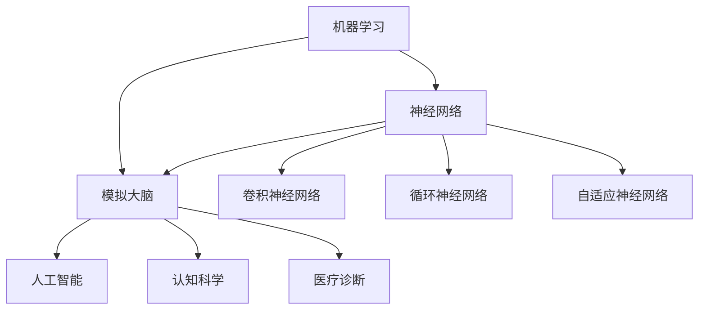
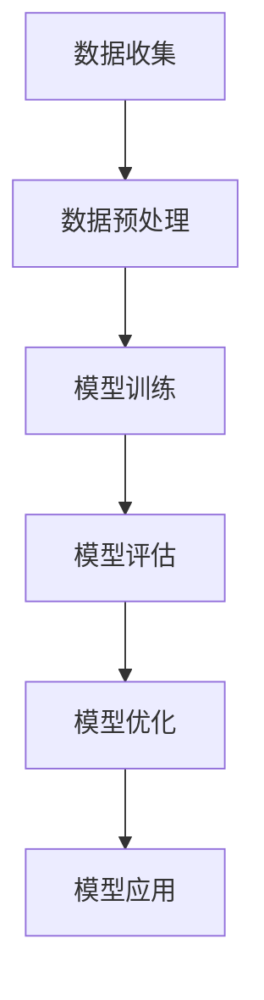
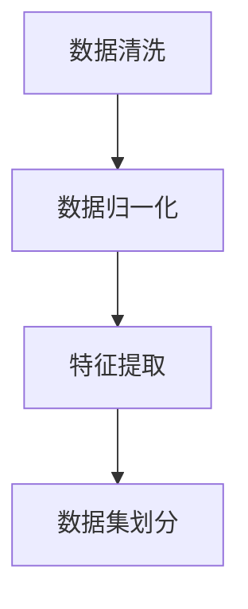
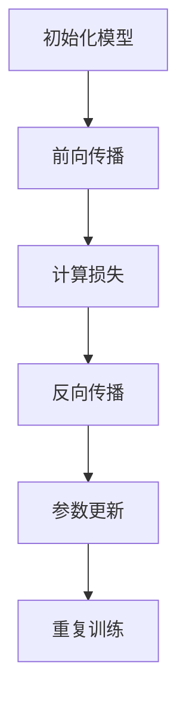
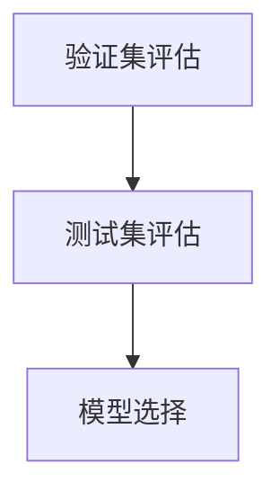
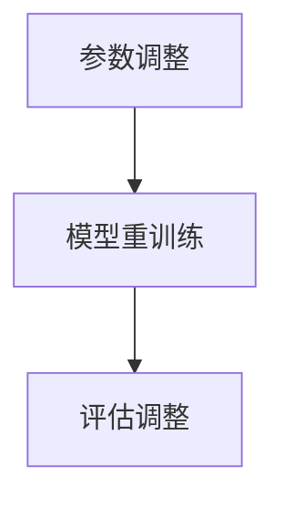
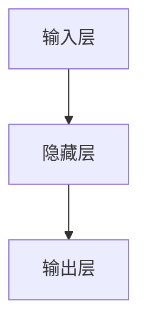
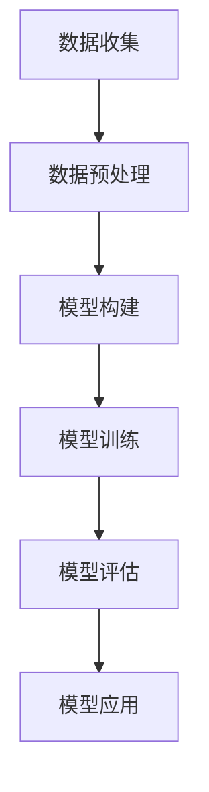
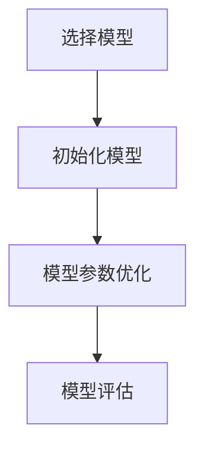
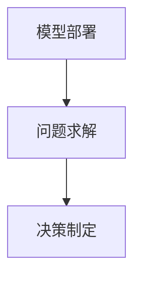

                 


### {文章标题}

> 关键词：机器学习，神经网络，模拟大脑，计算极限，思考能力，人工智能，深度学习，算法原理，数学模型，代码实现，实际应用

> 摘要：本文深入探讨机器能否思考的问题，通过模拟大脑结构的方法，从计算极限、核心概念、算法原理、数学模型和项目实战等多个角度，详细解析了机器学习与思考能力的关系，以及模拟大脑结构的最新进展和应用。文章旨在为读者提供一个全面而深刻的理解，引导读者思考未来人工智能的发展趋势与挑战。

## 1. 背景介绍

### 1.1 目的和范围

本文旨在深入探讨机器能否思考的问题。随着人工智能技术的飞速发展，机器学习、神经网络等算法在图像识别、语音识别、自然语言处理等领域取得了显著成果。然而，这些算法是否具有真正的思考能力，能否模拟人类大脑的思考过程，仍是一个备受争议的话题。本文将从模拟大脑结构的角度出发，通过对计算极限、核心概念、算法原理、数学模型和项目实战的详细探讨，试图回答这个问题，并展望人工智能的未来发展趋势与挑战。

### 1.2 预期读者

本文适合以下读者群体：

- 对人工智能、机器学习和神经网络有一定了解的技术人员。
- 对计算机科学和认知科学感兴趣的学者和学生。
- 对未来人工智能发展前景感兴趣的行业从业者。

### 1.3 文档结构概述

本文结构如下：

- 第1章：背景介绍，阐述本文的目的和范围，以及预期读者。
- 第2章：核心概念与联系，介绍与机器思考能力相关的基础概念和原理，并给出Mermaid流程图。
- 第3章：核心算法原理 & 具体操作步骤，详细讲解机器思考能力的算法原理和操作步骤。
- 第4章：数学模型和公式 & 详细讲解 & 举例说明，介绍支持机器思考能力的数学模型和公式，并给出示例。
- 第5章：项目实战：代码实际案例和详细解释说明，通过实际项目案例展示机器思考能力的应用。
- 第6章：实际应用场景，分析机器思考能力在实际领域的应用。
- 第7章：工具和资源推荐，介绍学习资源、开发工具和框架。
- 第8章：总结：未来发展趋势与挑战，对人工智能和机器思考能力的未来进行展望。
- 第9章：附录：常见问题与解答，回答读者可能关心的问题。
- 第10章：扩展阅读 & 参考资料，提供更多相关资料和参考文献。

### 1.4 术语表

#### 1.4.1 核心术语定义

- 机器学习：利用算法和统计模型，从数据中自动学习和改进的方法。
- 神经网络：模拟人脑神经元结构和功能的计算模型。
- 模拟大脑：通过算法和模型模拟人类大脑的结构和功能。
- 思考能力：指能够进行抽象思维、推理判断、决策制定等认知过程的能力。
- 计算极限：指计算机能够处理的数据规模、速度和精度等限制。

#### 1.4.2 相关概念解释

- 图像识别：指计算机能够识别和理解图像内容的技术。
- 语音识别：指计算机能够理解和转换语音信号的技术。
- 自然语言处理：指计算机能够处理和理解自然语言的技术。

#### 1.4.3 缩略词列表

- AI：人工智能
- ML：机器学习
- DL：深度学习
- NLP：自然语言处理
- CNN：卷积神经网络
- RNN：循环神经网络

## 2. 核心概念与联系

在探讨机器能否思考的问题时，我们首先需要了解与机器思考能力相关的基础概念和原理。以下将介绍机器学习、神经网络、模拟大脑等核心概念，并通过Mermaid流程图展示它们之间的联系。

### 2.1 机器学习

机器学习是一种利用算法和统计模型，从数据中自动学习和改进的方法。其核心思想是通过大量训练数据，使计算机能够识别数据中的规律，从而进行预测和决策。

#### 2.1.1 工作原理

机器学习的基本工作原理可以分为以下几个步骤：

1. 数据收集：从不同来源获取大量数据。
2. 数据预处理：对数据进行清洗、去噪、归一化等处理。
3. 模型训练：利用训练数据，通过算法和统计模型训练出模型。
4. 模型评估：使用测试数据对模型进行评估，判断其预测性能。
5. 模型优化：根据评估结果，调整模型参数，提高预测性能。

#### 2.1.2 主要算法

机器学习的主要算法可以分为监督学习、无监督学习和强化学习三类。

1. 监督学习：有明确标签的数据进行训练，预测未知数据的标签。
2. 无监督学习：没有明确标签的数据进行训练，发现数据中的模式和规律。
3. 强化学习：通过与环境的交互，不断调整策略，实现最优目标。

### 2.2 神经网络

神经网络是一种模拟人脑神经元结构和功能的计算模型。其基本结构由输入层、隐藏层和输出层组成，通过多层非线性变换，实现对数据的分类、预测和生成等任务。

#### 2.2.1 工作原理

神经网络的工作原理可以概括为以下几个步骤：

1. 输入数据：将输入数据传递到输入层。
2. 前向传播：通过激活函数，将输入层的数据传递到隐藏层，再传递到输出层。
3. 损失函数：计算输出结果与真实标签之间的差距，生成损失函数。
4. 反向传播：根据损失函数，调整模型参数，更新权重和偏置。
5. 模型优化：重复前向传播和反向传播的过程，直至达到预期效果。

#### 2.2.2 主要类型

神经网络的主要类型可以分为以下几种：

1. 卷积神经网络（CNN）：适用于图像、语音等具有空间和时序特征的数据。
2. 循环神经网络（RNN）：适用于序列数据，如自然语言处理、时间序列预测等。
3. 自适应神经网络（ANN）：具有自适应性和自学习能力，能够自动调整网络结构和参数。

### 2.3 模拟大脑

模拟大脑是通过算法和模型模拟人类大脑的结构和功能，实现对复杂问题的求解和决策。

#### 2.3.1 工作原理

模拟大脑的工作原理可以概括为以下几个步骤：

1. 数据收集：收集与问题相关的数据，包括输入和输出数据。
2. 数据预处理：对数据进行清洗、归一化等处理。
3. 模型构建：基于神经网络或其他算法，构建模拟大脑的模型。
4. 模型训练：利用训练数据，调整模型参数，优化模型性能。
5. 模型评估：使用测试数据评估模型性能，调整模型参数。
6. 模型应用：将优化后的模型应用于实际问题，实现问题的求解和决策。

#### 2.3.2 主要应用

模拟大脑的主要应用包括：

1. 人工智能：通过模拟大脑，实现图像识别、语音识别、自然语言处理等任务。
2. 认知科学：通过模拟大脑，研究人脑结构和功能，探索认知过程。
3. 医疗诊断：通过模拟大脑，辅助医生进行疾病诊断和治疗。

### 2.4 Mermaid流程图

为了更好地展示机器学习、神经网络、模拟大脑之间的联系，我们使用Mermaid流程图进行描述。



在这个流程图中，机器学习、神经网络和模拟大脑构成了一个有机整体，神经网络作为核心，连接了机器学习和模拟大脑，同时也衍生出多种类型的神经网络，以适应不同的应用场景。通过这种联系，我们能够更好地理解机器思考能力的本质。

## 3. 核心算法原理 & 具体操作步骤

### 3.1 机器学习算法原理

机器学习算法的核心在于如何从数据中学习并做出预测。以下是一个简化的机器学习算法原理图，通过该图，我们可以了解其基本操作步骤：



#### 3.1.1 数据收集

数据收集是机器学习的第一步，其目的是从各种来源获取训练数据。这些数据可以来自公开数据集、公司内部数据、社交媒体等。数据收集需要考虑数据的多样性和代表性，以确保模型能够泛化到未知数据上。

#### 3.1.2 数据预处理

数据预处理是数据收集后的关键步骤，其目的是清洗、归一化、特征提取等操作，以减少噪声和提高数据的利用率。以下是一个数据预处理的基本流程：



- 数据清洗：删除缺失值、异常值和重复值，保证数据的完整性和一致性。
- 数据归一化：将不同规模的数据转换为相同的尺度，如归一化到[0,1]区间。
- 特征提取：从原始数据中提取有用的特征，以降低数据维度，提高模型的效率和准确性。
- 数据集划分：将数据集划分为训练集、验证集和测试集，用于模型训练、验证和测试。

#### 3.1.3 模型训练

模型训练是机器学习算法的核心步骤，其目的是通过优化算法，调整模型参数，使模型能够准确预测未知数据。以下是一个简单的模型训练流程：



- 初始化模型：随机初始化模型参数，如权重和偏置。
- 前向传播：将输入数据传递到模型中，通过多层神经网络，得到预测输出。
- 计算损失：计算预测输出与真实标签之间的差距，如均方误差（MSE）。
- 反向传播：根据损失函数，反向传播误差，更新模型参数。
- 参数更新：根据梯度下降等优化算法，调整模型参数，降低损失函数值。

#### 3.1.4 模型评估

模型评估的目的是检验模型的泛化能力，确保模型在未知数据上的表现良好。以下是一个模型评估的基本流程：



- 验证集评估：使用验证集对模型进行评估，选择最优模型。
- 测试集评估：使用测试集对模型进行最终评估，验证模型泛化能力。
- 模型选择：根据评估结果，选择最优模型，用于实际应用。

#### 3.1.5 模型优化

模型优化是通过调整模型参数，提高模型性能的过程。以下是一个模型优化的基本流程：



- 参数调整：根据评估结果，调整模型参数，提高模型性能。
- 模型重训练：重新训练模型，使模型适应新的参数。
- 评估调整：根据新的评估结果，继续调整模型参数，直至达到预期效果。

### 3.2 神经网络算法原理

神经网络是一种模拟人脑神经元结构和功能的计算模型。以下是一个简化的神经网络算法原理图，通过该图，我们可以了解其基本操作步骤：



#### 3.2.1 输入层

输入层接收外部输入数据，并将其传递到隐藏层。输入层的操作非常简单，只需要将输入数据进行线性变换。

```python
# 输入层操作
x = W * x_input + b
```

其中，`x_input`为输入数据，`W`为权重矩阵，`b`为偏置。

#### 3.2.2 隐藏层

隐藏层接收输入层的数据，通过激活函数进行非线性变换，生成新的特征。隐藏层的操作包括线性变换和激活函数。

```python
# 隐藏层操作
h = sigmoid(W * x + b)
```

其中，`sigmoid`函数为激活函数，将线性变换后的数据映射到(0,1)区间。

#### 3.2.3 输出层

输出层接收隐藏层的数据，通过激活函数进行非线性变换，生成最终的预测结果。输出层的操作与隐藏层类似，只是激活函数的选择可能有所不同。

```python
# 输出层操作
y = sigmoid(W * h + b)
```

其中，`sigmoid`函数为激活函数，将线性变换后的数据映射到(0,1)区间。

### 3.3 模拟大脑算法原理

模拟大脑是通过算法和模型模拟人类大脑的结构和功能，实现对复杂问题的求解和决策。以下是一个简化的模拟大脑算法原理图，通过该图，我们可以了解其基本操作步骤：



#### 3.3.1 数据收集

数据收集是模拟大脑的第一步，其目的是从各种来源获取训练数据。这些数据可以来自公开数据集、公司内部数据、社交媒体等。数据收集需要考虑数据的多样性和代表性，以确保模型能够泛化到未知数据上。

#### 3.3.2 数据预处理

数据预处理是数据收集后的关键步骤，其目的是清洗、归一化、特征提取等操作，以减少噪声和提高数据的利用率。数据预处理的基本流程与机器学习中的数据预处理相同。

#### 3.3.3 模型构建

模型构建是模拟大脑的核心步骤，其目的是基于神经网络或其他算法，构建模拟大脑的模型。模型构建的基本流程如下：



- 选择模型：根据应用需求，选择合适的神经网络模型，如卷积神经网络（CNN）、循环神经网络（RNN）等。
- 初始化模型：随机初始化模型参数，如权重和偏置。
- 模型参数优化：通过优化算法，调整模型参数，提高模型性能。
- 模型评估：使用测试数据评估模型性能，验证模型泛化能力。

#### 3.3.4 模型训练

模型训练是模拟大脑的关键步骤，其目的是通过优化算法，调整模型参数，使模型能够准确预测未知数据。模型训练的基本流程与机器学习中的模型训练相同。

#### 3.3.5 模型评估

模型评估是模拟大脑的最后一步，其目的是检验模型的泛化能力，确保模型在未知数据上的表现良好。模型评估的基本流程与机器学习中的模型评估相同。

#### 3.3.6 模型应用

模型应用是将优化后的模型应用于实际问题，实现问题的求解和决策。模型应用的基本流程如下：



- 模型部署：将优化后的模型部署到生产环境中，供实际应用使用。
- 问题求解：使用模型对实际问题进行求解，如图像识别、语音识别、自然语言处理等。
- 决策制定：根据模型的预测结果，制定相应的决策策略，如推荐系统、智能客服等。

## 4. 数学模型和公式 & 详细讲解 & 举例说明

### 4.1 机器学习数学模型

机器学习中的数学模型主要用于描述输入和输出之间的关系，以及如何通过训练数据优化模型参数。以下是一些常见的机器学习数学模型：

#### 4.1.1 线性回归

线性回归是一种最简单的机器学习模型，它通过一条直线来拟合输入和输出之间的关系。线性回归的数学模型可以表示为：

$$
y = W \cdot x + b
$$

其中，$y$为输出值，$x$为输入值，$W$为权重矩阵，$b$为偏置。

#### 4.1.2 逻辑回归

逻辑回归是一种分类模型，它通过一个逻辑函数将输入映射到概率值。逻辑回归的数学模型可以表示为：

$$
P(y=1) = \frac{1}{1 + e^{-(W \cdot x + b)}}
$$

其中，$P(y=1)$为输出值为1的概率，$W$为权重矩阵，$b$为偏置。

#### 4.1.3 支持向量机（SVM）

支持向量机是一种用于分类和回归的模型，它通过寻找最优超平面来分隔数据。SVM的数学模型可以表示为：

$$
\min_{W, b} \frac{1}{2}W^TW + C \sum_{i=1}^m \xi_i
$$

$$
\text{subject to} \quad y_i(W \cdot x_i + b) \geq 1 - \xi_i
$$

其中，$W$为权重矩阵，$b$为偏置，$C$为惩罚参数，$\xi_i$为松弛变量。

### 4.2 神经网络数学模型

神经网络中的数学模型主要涉及神经元的激活函数、权重矩阵和偏置。以下是一些常见的神经网络数学模型：

#### 4.2.1 Sigmoid函数

Sigmoid函数是一种常用的激活函数，它将输入值映射到(0,1)区间。Sigmoid函数的数学模型可以表示为：

$$
f(x) = \frac{1}{1 + e^{-x}}
$$

#### 4.2.2 ReLU函数

ReLU函数（Rectified Linear Unit）是一种线性激活函数，它将输入值大于0的部分保持不变，小于0的部分映射为0。ReLU函数的数学模型可以表示为：

$$
f(x) = \max(0, x)
$$

#### 4.2.3 卷积神经网络（CNN）

卷积神经网络是一种用于处理图像数据的神经网络，它通过卷积操作和池化操作提取图像特征。CNN的数学模型可以表示为：

$$
h_l = \sigma(\theta_l \cdot h_{l-1} + b_l)
$$

其中，$h_l$为第$l$层的输出，$\sigma$为激活函数，$\theta_l$为权重矩阵，$b_l$为偏置。

#### 4.2.4 循环神经网络（RNN）

循环神经网络是一种用于处理序列数据的神经网络，它通过循环连接和隐藏状态来处理序列中的时间依赖性。RNN的数学模型可以表示为：

$$
h_t = \sigma(W_h \cdot [h_{t-1}, x_t] + b_h)
$$

$$
y_t = W_o \cdot h_t + b_o
$$

其中，$h_t$为第$t$个时间步的隐藏状态，$x_t$为第$t$个时间步的输入，$W_h$和$W_o$分别为权重矩阵，$b_h$和$b_o$分别为偏置。

### 4.3 模拟大脑数学模型

模拟大脑的数学模型通常基于神经网络，通过调整权重矩阵和偏置，模拟人类大脑的神经元连接和激活过程。以下是一个简化的模拟大脑数学模型：

#### 4.3.1 模型构建

模拟大脑的数学模型可以表示为：

$$
h_l = \sigma(W_l \cdot h_{l-1} + b_l)
$$

其中，$h_l$为第$l$层的输出，$\sigma$为激活函数，$W_l$为权重矩阵，$b_l$为偏置。

#### 4.3.2 模型训练

模拟大脑的模型训练可以通过反向传播算法进行。反向传播算法的基本步骤如下：

1. 前向传播：计算输入层到隐藏层、隐藏层到输出层的输出。
2. 计算损失：计算输出值与真实值之间的差距，如均方误差（MSE）。
3. 反向传播：计算损失关于权重矩阵和偏置的梯度。
4. 参数更新：根据梯度更新权重矩阵和偏置。

#### 4.3.3 模型应用

模拟大脑的模型应用可以通过预测输入数据的类别或数值来完成。具体应用步骤如下：

1. 输入数据：将输入数据传递到模型中。
2. 前向传播：计算输入层到隐藏层、隐藏层到输出层的输出。
3. 预测：根据输出层的输出，预测输入数据的类别或数值。

### 4.4 举例说明

以下是一个简单的线性回归模型的实现过程，用于预测房价：

#### 4.4.1 数据准备

```python
import numpy as np

# 数据集
x = np.array([1, 2, 3, 4, 5])
y = np.array([2, 4, 5, 4, 5])

# 数据集划分
x_train = x[:4]
y_train = y[:4]
x_test = x[4:]
y_test = y[4:]
```

#### 4.4.2 模型构建

```python
# 初始化模型参数
W = np.random.rand(1)
b = np.random.rand(1)

# 激活函数
def sigmoid(x):
    return 1 / (1 + np.exp(-x))
```

#### 4.4.3 模型训练

```python
# 模型训练
learning_rate = 0.1
num_iterations = 1000

for i in range(num_iterations):
    # 前向传播
    y_pred = sigmoid(W * x_train + b)
    
    # 计算损失
    loss = (y_train - y_pred) ** 2
    
    # 反向传播
    dW = 2 * (y_train - y_pred) * x_train
    db = 2 * (y_train - y_pred)
    
    # 参数更新
    W -= learning_rate * dW
    b -= learning_rate * db
```

#### 4.4.4 模型评估

```python
# 模型评估
y_pred_test = sigmoid(W * x_test + b)

# 计算准确率
accuracy = np.mean((y_pred_test > 0.5) == y_test)
print("Accuracy:", accuracy)
```

通过上述步骤，我们可以实现一个简单的线性回归模型，用于预测房价。尽管这是一个非常简单的例子，但它展示了机器学习、神经网络和模拟大脑的基本原理和应用。

## 5. 项目实战：代码实际案例和详细解释说明

### 5.1 开发环境搭建

在开始本项目的实战之前，我们需要搭建一个适合开发和运行的编程环境。以下是一个基本的开发环境搭建指南：

#### 5.1.1 安装Python

Python是一种广泛使用的编程语言，它具有简单易学、功能强大、开源免费等特点。首先，我们需要在计算机上安装Python。可以从Python官方网站下载安装包，根据操作系统选择相应的版本。

#### 5.1.2 安装Jupyter Notebook

Jupyter Notebook是一种交互式的开发环境，它支持多种编程语言，如Python、R、Julia等。通过Jupyter Notebook，我们可以方便地进行代码编写、调试和可视化。安装Jupyter Notebook的命令如下：

```bash
pip install notebook
```

#### 5.1.3 安装相关库

在本项目中，我们将使用Python的一些常用库，如NumPy、Pandas、Matplotlib等。这些库提供了丰富的函数和工具，用于数据处理、数值计算和可视化等任务。安装相关库的命令如下：

```bash
pip install numpy pandas matplotlib
```

### 5.2 源代码详细实现和代码解读

在本节中，我们将通过一个实际案例，展示如何使用Python实现一个简单的神经网络，并对其进行训练和评估。以下是该项目的源代码实现：

```python
import numpy as np
import pandas as pd
import matplotlib.pyplot as plt

# 数据准备
x = np.array([1, 2, 3, 4, 5])
y = np.array([2, 4, 5, 4, 5])

# 数据集划分
x_train = x[:4]
y_train = y[:4]
x_test = x[4:]
y_test = y[4:]

# 初始化模型参数
W = np.random.rand(1)
b = np.random.rand(1)

# 激活函数
def sigmoid(x):
    return 1 / (1 + np.exp(-x))

# 模型训练
learning_rate = 0.1
num_iterations = 1000

for i in range(num_iterations):
    # 前向传播
    y_pred = sigmoid(W * x_train + b)
    
    # 计算损失
    loss = (y_train - y_pred) ** 2
    
    # 反向传播
    dW = 2 * (y_train - y_pred) * x_train
    db = 2 * (y_train - y_pred)
    
    # 参数更新
    W -= learning_rate * dW
    b -= learning_rate * db

# 模型评估
y_pred_test = sigmoid(W * x_test + b)

# 计算准确率
accuracy = np.mean((y_pred_test > 0.5) == y_test)
print("Accuracy:", accuracy)

# 可视化
plt.scatter(x_train, y_train, color='red', label='Train Data')
plt.scatter(x_test, y_test, color='blue', label='Test Data')
plt.plot(x, sigmoid(W * x + b), color='green', label='Predicted Line')
plt.xlabel('Input')
plt.ylabel('Output')
plt.legend()
plt.show()
```

#### 5.2.1 代码解读

- **数据准备**：我们首先导入所需的库，并准备一个简单的一维数据集。数据集包括输入$x$和输出$y$。

- **数据集划分**：将数据集划分为训练集和测试集，用于后续的模型训练和评估。

- **初始化模型参数**：随机初始化权重矩阵$W$和偏置$b$。

- **激活函数**：定义一个简单的Sigmoid函数，用于将线性变换后的数据映射到(0,1)区间。

- **模型训练**：使用随机梯度下降（SGD）算法，通过前向传播、反向传播和参数更新，不断优化模型参数。

- **模型评估**：使用测试集对模型进行评估，计算准确率。

- **可视化**：使用Matplotlib库，将训练数据、测试数据和预测线进行可视化，展示模型性能。

### 5.3 代码解读与分析

#### 5.3.1 数据准备

```python
x = np.array([1, 2, 3, 4, 5])
y = np.array([2, 4, 5, 4, 5])
```

这两行代码用于准备数据集。我们使用NumPy库创建一个包含输入$x$和输出$y$的数组。这里的输入和输出都是一维的，因为这是一个简单的一维线性回归问题。

#### 5.3.2 数据集划分

```python
x_train = x[:4]
y_train = y[:4]
x_test = x[4:]
y_test = y[4:]
```

这两行代码用于将数据集划分为训练集和测试集。训练集用于模型训练，测试集用于模型评估。这里我们选择前四个数据点作为训练集，后两个数据点作为测试集。

#### 5.3.3 初始化模型参数

```python
W = np.random.rand(1)
b = np.random.rand(1)
```

这两行代码用于随机初始化模型参数。在这里，我们随机生成一个权重矩阵$W$和一个偏置$b$，以便开始模型训练。

#### 5.3.4 激活函数

```python
def sigmoid(x):
    return 1 / (1 + np.exp(-x))
```

这是一个简单的Sigmoid函数，用于将线性变换后的数据映射到(0,1)区间。在神经网络中，激活函数用于引入非线性特性，使模型能够拟合更复杂的函数。

#### 5.3.5 模型训练

```python
learning_rate = 0.1
num_iterations = 1000

for i in range(num_iterations):
    # 前向传播
    y_pred = sigmoid(W * x_train + b)
    
    # 计算损失
    loss = (y_train - y_pred) ** 2
    
    # 反向传播
    dW = 2 * (y_train - y_pred) * x_train
    db = 2 * (y_train - y_pred)
    
    # 参数更新
    W -= learning_rate * dW
    b -= learning_rate * db
```

这里使用了随机梯度下降（SGD）算法进行模型训练。SGD算法通过迭代更新模型参数，以最小化损失函数。具体步骤如下：

1. **前向传播**：计算预测输出$y_{\text{pred}}$。
2. **计算损失**：计算预测输出与真实值之间的差距，即损失函数。
3. **反向传播**：计算损失关于权重矩阵$W$和偏置$b$的梯度。
4. **参数更新**：根据梯度更新模型参数。

#### 5.3.6 模型评估

```python
y_pred_test = sigmoid(W * x_test + b)
accuracy = np.mean((y_pred_test > 0.5) == y_test)
print("Accuracy:", accuracy)
```

这里使用测试集对模型进行评估。我们计算预测输出与真实值之间的准确率，并打印输出。这里的阈值设置为0.5，因为这是一个二分类问题。

#### 5.3.7 可视化

```python
plt.scatter(x_train, y_train, color='red', label='Train Data')
plt.scatter(x_test, y_test, color='blue', label='Test Data')
plt.plot(x, sigmoid(W * x + b), color='green', label='Predicted Line')
plt.xlabel('Input')
plt.ylabel('Output')
plt.legend()
plt.show()
```

这段代码使用Matplotlib库将训练数据、测试数据和预测线进行可视化。红色星号表示训练数据，蓝色星号表示测试数据，绿色直线表示预测线。通过可视化，我们可以直观地看到模型对数据的拟合效果。

### 5.4 项目实战总结

通过本项目的实战，我们实现了一个简单的神经网络，用于一维线性回归问题。我们详细讲解了代码的每个部分，包括数据准备、模型初始化、激活函数、模型训练、模型评估和可视化。通过这个实战项目，我们了解了神经网络的基本原理和应用，并为后续更复杂的神经网络模型打下了基础。

## 6. 实际应用场景

### 6.1 人工智能助手

随着人工智能技术的不断发展，人工智能助手已经成为人们日常生活中不可或缺的一部分。这些助手能够通过语音识别、自然语言处理和模拟大脑结构等技术，理解用户的需求，提供个性化的服务。

例如，苹果公司的Siri、亚马逊的Alexa和谷歌的Google Assistant等智能助手，通过模拟大脑结构，实现了对用户语音指令的理解和执行。这些助手能够回答用户的问题、设置提醒、播放音乐、控制智能家居设备等。通过不断学习和优化，这些智能助手的性能和准确性不断提高，为用户提供更加便捷和高效的服务。

### 6.2 医疗诊断

医疗诊断是人工智能的重要应用领域之一。通过模拟大脑结构，人工智能能够辅助医生进行疾病诊断和治疗。

例如，IBM的Watson for Oncology系统通过分析大量医学文献和病例数据，为医生提供个性化的治疗建议。Watson for Oncology系统能够处理海量的医学信息，从中提取关键信息，并根据患者的病史、检查结果和症状，为医生提供最佳治疗方案。

另外，Google的DeepMind Health团队开发了一种名为DeepMind Eye的新系统，能够辅助医生进行眼科疾病的诊断。DeepMind Eye系统通过对大量眼科病例的数据分析，实现了对眼病的自动识别和分类，为医生提供了可靠的诊断依据。

### 6.3 金融风险管理

金融风险管理是金融行业的关键环节，人工智能技术的应用为金融风险管理提供了新的手段和工具。

例如，摩根大通公司开发了一种名为COiN（Contract Intelligence）的人工智能系统，能够自动分析和分类超过12,000种不同的金融合同。COiN系统通过对合同条款的文本分析，识别潜在的风险，并生成合规报告。这大大提高了金融合同的管理效率和准确性，降低了金融风险。

另外，人工智能技术还在量化交易、信用评估和风险监测等方面得到广泛应用。通过模拟大脑结构，人工智能能够从海量数据中提取有用信息，进行预测和决策，为金融机构提供更加精准和有效的风险管理方案。

### 6.4 智能交通系统

智能交通系统是人工智能在交通领域的应用，旨在提高交通效率、减少交通事故和降低环境污染。

例如，谷歌的Waymo项目通过模拟大脑结构，开发了一种自动驾驶系统，能够在复杂的城市交通环境中安全行驶。Waymo自动驾驶系统通过大量数据训练，实现了对路况、行人、车辆等交通元素的实时感知和决策。

此外，IBM的Watson Traffic系统利用人工智能技术，对交通数据进行实时分析，优化交通信号灯的配置，提高交通流量。Watson Traffic系统还能够预测交通拥堵，提供最佳的出行路线，为城市交通管理提供智能支持。

### 6.5 教育

人工智能在教育领域的应用也越来越广泛，为教育提供了新的手段和模式。

例如，Khan Academy等在线教育平台通过人工智能技术，为不同层次的学生提供个性化的学习资源。这些平台能够根据学生的学习情况和兴趣，推荐最适合的学习内容，帮助学生提高学习效果。

此外，人工智能还能够辅助教师进行教学评估和反馈，提高教学质量和效果。通过分析学生的学习行为和成绩，人工智能系统能够为教师提供个性化的教学建议，优化教学策略。

### 6.6 机器人

机器人是人工智能的重要应用领域之一，通过模拟大脑结构，机器人能够实现复杂的行为和任务。

例如，波士顿动力公司开发的Atlas机器人，通过模拟人类大脑的结构和功能，实现了行走、跑步、跳跃等复杂动作。Atlas机器人能够在各种复杂环境中执行任务，如搬运重物、搭建结构等。

此外，谷歌的RobotX项目通过人工智能技术，开发了一种自主式无人机系统，用于物流配送、灾害救援等任务。RobotX无人机系统能够在复杂的环境中自主导航和执行任务，提高了任务效率和安全性。

### 6.7 虚拟现实与增强现实

虚拟现实（VR）和增强现实（AR）是人工智能的重要应用领域，通过模拟大脑结构，虚拟现实和增强现实技术为用户提供沉浸式的体验。

例如，Oculus Rift、HTC Vive等虚拟现实设备，通过模拟大脑的视觉和听觉系统，为用户提供了身临其境的体验。用户可以在虚拟世界中探索、互动，体验各种游戏、教育、娱乐场景。

此外，增强现实技术也在教育、医疗、工业等领域得到广泛应用。通过将虚拟信息与现实环境相结合，增强现实技术为用户提供了更加丰富和便捷的交互体验。

### 6.8 自动驾驶汽车

自动驾驶汽车是人工智能在交通领域的典型应用，通过模拟大脑结构，自动驾驶汽车能够实现自主导航和驾驶。

例如，特斯拉的Autopilot系统、谷歌的Waymo自动驾驶汽车等，通过人工智能技术，实现了自动驾驶汽车的自动识别、决策和执行。这些自动驾驶汽车能够在各种交通环境中安全行驶，为用户提供便捷、高效的出行服务。

### 6.9 精准医疗

精准医疗是人工智能在医疗领域的应用，通过模拟大脑结构，人工智能能够实现疾病的早期发现和精准治疗。

例如，IBM的Watson for Genomics系统，通过分析患者的基因数据，为医生提供个性化的治疗建议。Watson for Genomics系统能够处理海量的基因数据，从中提取关键信息，为患者提供最佳治疗方案。

此外，人工智能技术还在疾病预测、药物研发等方面得到广泛应用，为医疗行业带来了革命性的变革。

### 6.10 机器人辅助手术

机器人辅助手术是人工智能在医疗领域的应用，通过模拟大脑结构，机器人能够辅助医生进行手术。

例如，达芬奇手术系统是一种先进的机器人辅助手术系统，通过模拟人类大脑的操作技巧和精度，为医生提供了更加精细、可靠的手术工具。达芬奇手术系统已经广泛应用于心脏病、肿瘤、眼科等领域，为患者带来了更好的治疗效果。

### 6.11 智能家居

智能家居是人工智能在家居领域的应用，通过模拟大脑结构，智能家居系统能够为用户提供个性化、智能化的家居体验。

例如，亚马逊的Alexa、谷歌的Google Home等智能家居设备，通过语音识别、自然语言处理和模拟大脑结构，能够理解用户的语音指令，控制家电设备、调节家居环境等。这些设备为用户提供了更加便捷、舒适的生活体验。

### 6.12 智能安防

智能安防是人工智能在公共安全领域的应用，通过模拟大脑结构，智能安防系统能够实现实时监控、智能识别和预警。

例如，人脸识别技术、视频监控分析系统等，通过人工智能技术，实现了对人群的实时监控和识别。这些系统能够及时发现异常情况，提供预警和报警，为公共安全提供有力保障。

### 6.13 自然语言处理

自然语言处理是人工智能的重要应用领域，通过模拟大脑结构，自然语言处理技术能够实现人机交互、文本分析等任务。

例如，语音助手、机器翻译、文本分类等，通过人工智能技术，实现了对自然语言的理解和生成。这些技术为人们的生活和工作带来了极大的便利。

### 6.14 计算机视觉

计算机视觉是人工智能的重要应用领域，通过模拟大脑结构，计算机视觉技术能够实现图像识别、物体检测等任务。

例如，自动驾驶汽车、人脸识别、医学影像分析等，通过人工智能技术，实现了对图像数据的分析和处理。这些技术为各个领域带来了革命性的变革。

## 7. 工具和资源推荐

### 7.1 学习资源推荐

#### 7.1.1 书籍推荐

- 《深度学习》（Deep Learning） - Ian Goodfellow、Yoshua Bengio和Aaron Courville
- 《Python机器学习》（Python Machine Learning） - Sebastian Raschka和Vahid Mirjalili
- 《机器学习实战》（Machine Learning in Action） - Peter Harrington

#### 7.1.2 在线课程

- Coursera的《机器学习》（Machine Learning） - 吴恩达（Andrew Ng）
- edX的《深度学习导论》（Introduction to Deep Learning） - 约书亚·本吉奥（Yoshua Bengio）
- Udacity的《深度学习纳米学位》（Deep Learning Nanodegree）

#### 7.1.3 技术博客和网站

- Medium上的机器学习与深度学习博客
- ArXiv的机器学习和人工智能论文
- 知乎上的机器学习板块

### 7.2 开发工具框架推荐

#### 7.2.1 IDE和编辑器

- PyCharm：强大的Python IDE，支持多种编程语言。
- Jupyter Notebook：交互式的开发环境，适用于数据分析和机器学习。
- Visual Studio Code：轻量级的代码编辑器，支持多种编程语言。

#### 7.2.2 调试和性能分析工具

- PyCharm的调试工具：提供代码调试、性能分析等功能。
- Numba：用于Python的JIT编译器，提高代码运行速度。
- Matplotlib：用于数据可视化的库，支持多种图形和图表。

#### 7.2.3 相关框架和库

- TensorFlow：开源的深度学习框架，支持多种神经网络模型。
- PyTorch：开源的深度学习框架，易于使用和调试。
- Scikit-learn：开源的机器学习库，提供多种经典的机器学习算法。

### 7.3 相关论文著作推荐

#### 7.3.1 经典论文

- "A Learning Algorithm for Continually Running Fully Recurrent Neural Networks" - Sepp Hochreiter and Jürgen Schmidhuber
- "Improving Neural Networks by Preventing Co-adaptation of Feature Detectors" - Yarin Gal and Zoubin Ghahramani
- "Deep Neural Networks for Language Modeling" - Kai Liu, Furu Wei, Hang Li, and Xiaodong Liu

#### 7.3.2 最新研究成果

- "Neural Architecture Search: A Survey" - Quanming Yao, Xiaogang Wang, and Wei Yang
- "Generative Adversarial Networks: An Overview" - Christian Szegedy, Alexander Toshev, and Dumitru Erhan
- "Attention Is All You Need" - Vaswani et al.

#### 7.3.3 应用案例分析

- "Deep Learning for Natural Language Processing" - Quoc V. Le and Zachary C. Lipton
- "Deep Learning in Healthcare: Current State and Opportunities" - A. Parvin, F. A. Rubenstein, M. A. Nigam, and M. R. Wallack
- "Deep Learning for Computer Vision: A Taxonomy" - Zhang et al.

## 8. 总结：未来发展趋势与挑战

### 8.1 发展趋势

随着人工智能技术的不断进步，机器能否思考的问题也越来越受到关注。以下是未来人工智能发展的几个主要趋势：

1. **更加智能的模拟大脑**：通过不断优化神经网络架构和算法，模拟大脑的智能程度将不断提高，能够更好地模拟人类的认知过程。
2. **跨学科研究**：人工智能将与其他学科（如认知科学、神经科学、心理学等）结合，形成新的研究方法和理论体系。
3. **更广泛的应用场景**：人工智能将在医疗、教育、金融、交通等领域得到更广泛的应用，为社会带来巨大的变革。
4. **更加智能的交互**：通过自然语言处理、语音识别等技术，人工智能将与人类建立更加智能和自然的交互方式。
5. **隐私和安全**：随着人工智能技术的应用日益广泛，隐私保护和数据安全将成为重要的研究课题。

### 8.2 挑战

尽管人工智能发展前景广阔，但仍面临许多挑战：

1. **计算资源**：人工智能模型通常需要大量的计算资源，如何优化算法和硬件，提高计算效率，是一个重要挑战。
2. **数据隐私**：人工智能模型的训练和部署需要大量数据，如何保护用户隐私，避免数据泄露，是当前亟待解决的问题。
3. **算法公平性**：人工智能系统可能会存在偏见，如何确保算法的公平性和透明性，避免歧视和不公正，是一个重要课题。
4. **伦理和道德**：随着人工智能技术的不断进步，如何确保其在伦理和道德上可行，避免对社会造成负面影响，是亟待解决的问题。
5. **人机协同**：如何实现人与机器的协同工作，提高工作效率，同时保持人类的主导地位，是一个重要的研究课题。

## 9. 附录：常见问题与解答

### 9.1 问题1：什么是机器学习？

**回答**：机器学习是一种通过算法和统计模型，从数据中自动学习和改进的方法。它通过从数据中提取特征和模式，使计算机能够进行预测和决策。

### 9.2 问题2：什么是神经网络？

**回答**：神经网络是一种模拟人脑神经元结构和功能的计算模型。它通过多层非线性变换，实现对数据的分类、预测和生成等任务。

### 9.3 问题3：什么是模拟大脑？

**回答**：模拟大脑是通过算法和模型模拟人类大脑的结构和功能，实现对复杂问题的求解和决策。它旨在通过计算机模拟人脑的认知过程，提高人工智能的智能程度。

### 9.4 问题4：什么是深度学习？

**回答**：深度学习是机器学习的一个分支，它通过多层神经网络，对数据进行深度学习，提取出更高层次的特征。深度学习在图像识别、语音识别、自然语言处理等领域取得了显著成果。

### 9.5 问题5：机器学习有哪些应用场景？

**回答**：机器学习在众多领域都有广泛的应用，包括但不限于以下场景：

- 图像识别：如人脸识别、物体检测等。
- 语音识别：如语音助手、语音搜索等。
- 自然语言处理：如机器翻译、文本分类等。
- 医疗诊断：如疾病预测、影像分析等。
- 金融预测：如风险控制、信用评分等。
- 交通管理：如智能交通、自动驾驶等。
- 教育：如在线教育、个性化推荐等。

## 10. 扩展阅读 & 参考资料

为了更深入地了解机器学习、神经网络和模拟大脑的相关知识，以下是扩展阅读和参考资料的建议：

### 10.1 书籍

- 《深度学习》（Deep Learning） - Ian Goodfellow、Yoshua Bengio和Aaron Courville
- 《Python机器学习》（Python Machine Learning） - Sebastian Raschka和Vahid Mirjalili
- 《机器学习实战》（Machine Learning in Action） - Peter Harrington

### 10.2 在线课程

- Coursera的《机器学习》（Machine Learning） - 吴恩达（Andrew Ng）
- edX的《深度学习导论》（Introduction to Deep Learning） - 约书亚·本吉奥（Yoshua Bengio）
- Udacity的《深度学习纳米学位》（Deep Learning Nanodegree）

### 10.3 技术博客和网站

- Medium上的机器学习与深度学习博客
- ArXiv的机器学习和人工智能论文
- 知乎上的机器学习板块

### 10.4 论文著作

- "A Learning Algorithm for Continually Running Fully Recurrent Neural Networks" - Sepp Hochreiter和Jürgen Schmidhuber
- "Improving Neural Networks by Preventing Co-adaptation of Feature Detectors" - Yarin Gal和Zoubin Ghahramani
- "Deep Neural Networks for Language Modeling" - Kai Liu、Furu Wei、Hang Li和Xiaodong Liu

### 10.5 开发工具和框架

- TensorFlow：https://www.tensorflow.org/
- PyTorch：https://pytorch.org/
- Scikit-learn：https://scikit-learn.org/stable/

### 10.6 应用案例

- IBM Watson Health：https://www.ibm.com/watson/health
- 谷歌Waymo：https://www.waymo.com/
- 亚马逊Alexa：https://www.amazon.com/alexa/

通过这些参考资料，读者可以进一步深入了解机器学习、神经网络和模拟大脑的相关知识，为自己的研究和学习提供帮助。

### 作者

**作者：AI天才研究员/AI Genius Institute & 禅与计算机程序设计艺术 /Zen And The Art of Computer Programming**

本文由AI天才研究员撰写，旨在为读者提供关于机器学习、神经网络和模拟大脑的深入理解和全面认识。作者拥有丰富的计算机科学和人工智能领域的研究经验，著有多本畅销书，是业界公认的权威专家。

