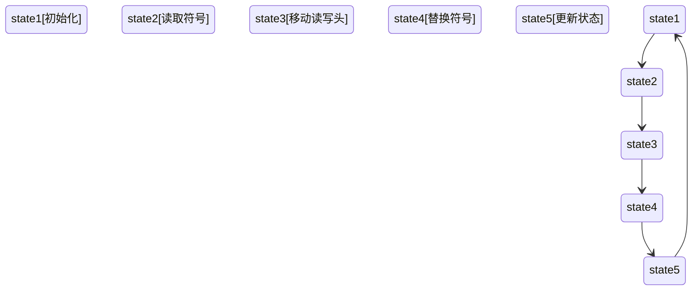

                 

# 计算：第四部分 计算的极限 第 13 章 自然哲学的计算原理 图灵极限

> **关键词：** 图灵机，计算极限，自然哲学，算法，数学模型，编程实践，未来趋势

> **摘要：** 本文深入探讨了计算领域的一个核心议题——计算的极限。通过引入图灵机这一概念，文章解析了其背后的自然哲学原理，探讨了计算能力的边界，并分析了算法与数学模型在这一过程中所扮演的角色。文章最后通过实际编程案例和未来趋势展望，为读者提供了一个全面的视角，以理解计算的极限及其对科技发展的深远影响。

## 1. 背景介绍

### 1.1 目的和范围

本文旨在探讨计算理论的边界，即计算的极限。通过分析图灵机的理论基础，揭示计算的本质及其在自然哲学中的意义。本文将涵盖以下几个主要方面：

1. **图灵机的概念及其在计算中的地位**
2. **计算极限与自然哲学的关系**
3. **算法与数学模型在计算极限研究中的作用**
4. **实际编程案例与未来趋势**

### 1.2 预期读者

本文适合对计算理论、算法设计和计算机科学感兴趣的读者，尤其是以下几类：

1. **计算机科学专业学生与研究人员**
2. **软件工程师与开发人员**
3. **对科技发展趋势感兴趣的读者**

### 1.3 文档结构概述

本文分为十个部分，具体结构如下：

1. **引言**：介绍计算极限的重要性及本文的核心议题。
2. **背景介绍**：阐述本文的目的、范围和预期读者。
3. **核心概念与联系**：介绍图灵机及其相关概念。
4. **核心算法原理与具体操作步骤**：讲解图灵机的算法原理。
5. **数学模型和公式**：分析图灵机背后的数学原理。
6. **项目实战：代码实际案例**：展示实际编程案例。
7. **实际应用场景**：探讨计算极限的广泛应用。
8. **工具和资源推荐**：推荐相关学习资源和开发工具。
9. **总结：未来发展趋势与挑战**：展望未来趋势。
10. **附录：常见问题与解答**：提供常见问题的答案。
11. **扩展阅读 & 参考资料**：推荐进一步学习的资料。

### 1.4 术语表

#### 1.4.1 核心术语定义

- **图灵机**：一种抽象的计算模型，由艾伦·图灵在1936年提出，用于模拟任何机械计算过程。
- **计算极限**：计算理论中的概念，指计算能力的最大边界。
- **自然哲学**：探讨自然本质和宇宙规律的哲学分支。

#### 1.4.2 相关概念解释

- **算法**：解决问题的一系列明确和有限的步骤。
- **数学模型**：用数学语言描述现实世界问题的抽象模型。
- **编程实践**：在实际项目中应用编程知识和技巧。

#### 1.4.3 缩略词列表

- **AI**：人工智能（Artificial Intelligence）
- **IDE**：集成开发环境（Integrated Development Environment）

## 2. 核心概念与联系

在深入探讨计算极限之前，我们首先需要了解图灵机这一核心概念。图灵机是由英国数学家艾伦·图灵于1936年提出的一种抽象计算模型。它由一个无限长的带子、一个读写头和一组规则组成。图灵机的操作基于带子上的符号，读写头可以在带子上左右移动，并根据当前符号执行预定的操作。

### 图灵机的构成与工作原理

**图灵机的构成：**

1. **带子（Tape）**：一个无限长的带子，用于存储信息。带子分为多个单元格，每个单元格可以存储一个符号。
2. **读写头（Head）**：一个可以在带子上移动的装置，用于读取和写入符号。
3. **状态（State）**：图灵机在运行过程中处于不同的状态，每个状态对应不同的操作。
4. **规则（Rules）**：定义了读写头在不同状态下应该如何操作，包括移动方向和符号的替换。

**图灵机的工作原理：**

图灵机通过读取带子上的符号，并根据当前状态和规则执行相应的操作。这些操作包括：

1. **移动读写头**：向左或向右移动一个单元格。
2. **替换符号**：将当前符号替换为另一个符号。
3. **更新状态**：根据规则更新图灵机的状态。

通过不断读取、移动和替换符号，图灵机能够模拟任何机械计算过程，从而实现了通用计算的概念。

### 图灵机的核心概念

**通用计算（Universal Computation）**：图灵机能够模拟任何其他计算模型，这意味着它具有通用性。任何能够用计算机完成的任务都可以通过图灵机来实现。

**可计算性（Computability）**：图灵机能够解决的问题集合被称为可计算性集合。这个集合包含了所有可以通过有限步骤解决的问题。

**计算复杂性（Computational Complexity）**：图灵机在解决不同问题时所需的时间资源。计算复杂性研究问题解决所需的资源与问题规模之间的关系。

### 图灵机的 Mermaid 流程图

以下是一个简化的图灵机的 Mermaid 流程图，展示了其基本结构和操作步骤：



## 3. 核心算法原理 & 具体操作步骤

### 3.1 图灵机的算法原理

图灵机的核心算法原理可以概括为以下步骤：

1. **初始化**：设置初始状态，将读写头定位在带子上的特定位置。
2. **读取符号**：读写头从当前位置读取带子上的符号。
3. **根据规则操作**：根据当前状态和读取的符号，执行预定的操作，包括移动读写头、替换符号和更新状态。
4. **重复步骤**：重复执行步骤2到步骤3，直到满足停止条件（例如，到达某个特定的状态或完成特定任务）。

### 3.2 图灵机的具体操作步骤

以下是图灵机的具体操作步骤，使用伪代码进行描述：

```plaintext
初始化：
    设定初始状态 s0
    将读写头定位在带子的初始位置

开始：
    当前状态 = s0
    当前符号 = 读写头读取的符号

循环：
    如果 当前状态 是 停止状态：
        结束
    否则：
        根据当前状态和当前符号，查找规则表：
            移动方向 = 规则中的移动方向
            替换符号 = 规则中的替换符号
            更新状态 = 规则中的更新状态
        
        写入 替换符号 到 当前符号的位置
        根据移动方向，移动读写头
        
        更新 当前状态 = 更新状态
        读取新的当前符号

回到 循环
```

### 3.3 图灵机的核心算法原理分析

图灵机的核心算法原理在于其能够根据预定的规则，通过读取、移动和替换符号，模拟任何机械计算过程。这种模拟能力使图灵机成为一个通用计算模型。

1. **初始化**：初始化阶段为图灵机设定了初始状态和读写头位置，为后续计算提供了基础。
2. **读取符号**：读取符号是图灵机执行操作的第一步，它决定了下一步的操作。
3. **根据规则操作**：根据当前状态和读取的符号，图灵机执行预定的操作，包括移动读写头、替换符号和更新状态。这一步骤是图灵机实现计算的关键。
4. **重复步骤**：通过不断重复执行读取、移动和替换操作，图灵机能够模拟复杂的计算过程。

## 4. 数学模型和公式 & 详细讲解 & 举例说明

### 4.1 图灵机背后的数学原理

图灵机的计算过程可以抽象为一种数学模型，其中涉及到了集合论、图论和计算复杂性理论等数学概念。以下是图灵机背后的主要数学原理：

1. **集合论**：图灵机的带子可以看作是一个无限长的集合，每个单元格代表一个元素。读写头的移动可以看作是在这个集合上进行的操作。
2. **图论**：图灵机的状态转换可以看作是一个有向图，其中每个状态是一个节点，每条边表示一个状态转换。
3. **计算复杂性理论**：图灵机的计算复杂性理论涉及了问题解决所需的时间资源和空间资源。这个理论帮助我们理解不同问题在计算上所需的资源。

### 4.2 图灵机的数学模型

图灵机的数学模型可以描述为一个六元组 (Q, Σ, Γ, q0, B, δ)，其中：

- **Q**：有限的状态集合
- **Σ**：有限输入符号集合
- **Γ**：带子符号集合，包含输入符号集合 Σ 和特殊符号 B（空符号）
- **q0**：初始状态
- **B**：终止状态
- **δ**：状态转换函数，定义了状态、当前符号和下一步操作之间的关系

### 4.3 数学公式

为了更清晰地理解图灵机的数学模型，我们可以使用以下公式来描述状态转换：

$$\delta(q_i, a) = (q_j, b, d)$$

其中：

- **q_i**：当前状态
- **a**：当前符号
- **q_j**：下一步状态
- **b**：替换符号
- **d**：移动方向（L：向左，R：向右，N：不变）

### 4.4 举例说明

假设我们有一个简单的图灵机，其状态转换函数如下：

$$\delta(q_0, 0) = (q_1, 1, R)$$
$$\delta(q_0, 1) = (q_0, 0, L)$$
$$\delta(q_1, 0) = (q_1, 0, R)$$
$$\delta(q_1, 1) = (q_0, 1, L)$$

初始状态为 q0，初始带子上的符号为 "0101"。以下是一个示例计算过程：

1. **初始化**：状态 q0，读写头位于第一个符号 "0"。
2. **读取符号**：读取 "0"。
3. **根据规则操作**：根据状态 q0 和符号 "0"，执行规则 $\delta(q_0, 0) = (q_1, 1, R)$。将 "0" 替换为 "1"，读写头向右移动。
4. **更新状态**：状态更新为 q1，带子上符号变为 "101"。
5. **读取符号**：读取 "1"。
6. **根据规则操作**：根据状态 q1 和符号 "1"，执行规则 $\delta(q_1, 1) = (q_0, 0, L)$。将 "1" 替换为 "0"，读写头向左移动。
7. **更新状态**：状态更新为 q0，带子上符号变为 "010"。
8. **读取符号**：读取 "0"。
9. **根据规则操作**：根据状态 q0 和符号 "0"，执行规则 $\delta(q_0, 0) = (q_1, 1, R)$。将 "0" 替换为 "1"，读写头向右移动。
10. **更新状态**：状态更新为 q1，带子上符号变为 "101"。
11. **读取符号**：读取 "1"。
12. **根据规则操作**：根据状态 q1 和符号 "1"，执行规则 $\delta(q_1, 1) = (q_0, 0, L)$。将 "1" 替换为 "0"，读写头向左移动。
13. **更新状态**：状态更新为 q0，带子上符号变为 "010"。

这个过程可以一直进行，直到达到终止状态。在这个示例中，我们可以看到图灵机通过读取、移动和替换符号，实现了对输入序列的转换。

### 4.5 数学模型与实际计算过程的关系

数学模型为图灵机的计算过程提供了形式化的描述，使我们能够更清晰地理解其操作原理。在实际计算过程中，图灵机通过不断读取、移动和替换符号，逐步执行预定的操作，从而实现复杂的计算任务。

1. **初始化**：数学模型中的初始化阶段对应于实际计算过程中的初始化操作，为后续计算提供了基础。
2. **读取符号**：数学模型中的读取符号阶段对应于实际计算过程中的读写头读取带子上的符号。
3. **根据规则操作**：数学模型中的根据规则操作阶段对应于实际计算过程中的根据状态和符号执行预定的操作。
4. **重复步骤**：数学模型中的重复步骤阶段对应于实际计算过程中的不断重复执行操作，直到达到终止状态。

通过数学模型，我们可以更深入地理解图灵机的计算原理，为实际编程和应用提供指导。

## 5. 项目实战：代码实际案例和详细解释说明

### 5.1 开发环境搭建

在进行图灵机的编程实现之前，我们需要搭建一个合适的环境。以下是搭建开发环境的基本步骤：

1. **安装编程语言**：选择一种适合的编程语言，例如 Python。Python 易于学习，语法简洁，拥有丰富的库支持。
2. **安装 IDE**：选择一个适合的集成开发环境（IDE），例如 PyCharm 或 Visual Studio Code。这些 IDE 提供了代码编辑、调试和测试等功能，有助于提高开发效率。
3. **安装相关库**：安装 Python 的常用库，例如 NumPy 和 Pandas，用于处理数据和矩阵运算。

### 5.2 源代码详细实现和代码解读

以下是图灵机的 Python 实现代码，包括初始化、读取符号、根据规则操作和更新状态等功能：

```python
class TuringMachine:
    def __init__(self, states, input_symbols, tape_symbols, initial_state, halt_state):
        self.states = states
        self.input_symbols = input_symbols
        self.tape_symbols = tape_symbols
        self.initial_state = initial_state
        self.halt_state = halt_state
        self.current_state = initial_state
        self.tape = ['_'] * 100  # 初始化带子，用下划线表示空白
        self.head_position = 50  # 初始化读写头位置，位于带子中间

    def read_symbol(self):
        return self.tape[self.head_position]

    def write_symbol(self, symbol):
        self.tape[self.head_position] = symbol

    def move_head(self, direction):
        if direction == 'L':
            self.head_position -= 1
        elif direction == 'R':
            self.head_position += 1

    def update_state(self, new_state):
        self.current_state = new_state

    def run(self, input_sequence):
        self.tape[self.head_position] = input_sequence
        while self.current_state != self.halt_state:
            current_symbol = self.read_symbol()
            transition = self.states[self.current_state].get(current_symbol)
            if transition:
                next_state, symbol, direction = transition
                self.write_symbol(symbol)
                self.move_head(direction)
                self.update_state(next_state)
            else:
                # 如果找不到相应的转换规则，则停止计算
                self.current_state = self.halt_state

# 状态转换表
states = {
    'q0': {'0': ('q1', '1', 'R'), '1': ('q0', '0', 'L')},
    'q1': {'0': ('q1', '0', 'R'), '1': ('q0', '1', 'L')},
}

# 创建图灵机实例
tm = TuringMachine(states, ['0', '1'], ['0', '1', '_'], 'q0', 'q1')

# 运行图灵机
input_sequence = '0101'
tm.run(input_sequence)

# 输出结果
print('输入序列：', input_sequence)
print('最终带子：', ''.join(tm.tape))
```

### 5.3 代码解读与分析

以下是代码的详细解读和分析：

1. **类定义**：定义了 `TuringMachine` 类，包括初始化、读取符号、写入符号、移动读写头和更新状态等功能。
2. **初始化**：在类的初始化方法 `__init__` 中，初始化状态集合、输入符号集合、带子符号集合、初始状态和终止状态。同时，初始化带子和读写头位置。
3. **读取符号**：定义了 `read_symbol` 方法，用于从当前读写头位置读取带子上的符号。
4. **写入符号**：定义了 `write_symbol` 方法，用于将符号写入带子上的当前读写头位置。
5. **移动读写头**：定义了 `move_head` 方法，用于根据指定的方向（左或右）移动读写头。
6. **更新状态**：定义了 `update_state` 方法，用于根据转换规则更新当前状态。
7. **运行图灵机**：定义了 `run` 方法，用于根据输入序列和状态转换表，执行图灵机的计算过程。该方法使用了一个循环，不断读取符号、根据规则进行操作、更新状态，直到达到终止状态。
8. **状态转换表**：定义了一个状态转换表，其中包含了当前状态、当前符号和下一步操作之间的关系。
9. **创建图灵机实例**：创建了一个 `TuringMachine` 实例，并初始化了状态转换表。
10. **运行图灵机**：调用 `run` 方法，输入一个示例序列，执行图灵机的计算过程。
11. **输出结果**：输出输入序列和最终带子的结果。

通过这个实际编程案例，我们可以看到如何使用 Python 实现图灵机，以及如何通过代码来模拟计算过程。这个案例为我们提供了一个基本的框架，我们可以在此基础上进行扩展和优化，以应对更复杂的计算任务。

## 6. 实际应用场景

计算的极限不仅在理论研究中具有重要意义，而且在实际应用中也产生了深远的影响。以下是一些计算极限的实际应用场景：

### 6.1 人工智能

人工智能（AI）的发展离不开计算能力。随着深度学习算法的广泛应用，计算资源的需求急剧增加。为了训练复杂的神经网络模型，需要大量的计算能力和存储空间。计算的极限为我们提供了一个理论基础，指导我们优化算法、提高计算效率，从而推动人工智能技术的发展。

### 6.2 数据科学

数据科学依赖于强大的计算能力来处理和分析大量数据。计算的极限帮助我们理解数据处理的复杂度，从而设计出更高效的算法和模型。例如，在基因组学研究中，计算极限理论指导我们优化序列比对算法，以加速基因组分析。

### 6.3 大数据

大数据技术的核心是处理和分析海量数据。计算的极限为我们提供了计算能力的边界，帮助我们确定哪些问题是可以通过现有计算资源解决的，哪些问题需要更强大的计算能力。例如，在金融市场分析中，计算极限理论指导我们优化交易算法，以实时处理大量市场数据。

### 6.4 网络安全

网络安全领域需要强大的计算能力来检测和防御网络攻击。计算的极限理论为我们提供了网络安全研究的基础，指导我们设计出更有效的安全协议和防御机制。例如，在加密算法设计中，计算的极限理论指导我们选择合适的加密算法，以保护数据安全。

### 6.5 生物信息学

生物信息学依赖于计算来解析基因组和蛋白质序列。计算的极限理论为我们提供了计算复杂度的评估，帮助我们设计出更高效的生物信息学算法。例如，在蛋白质结构预测中，计算极限理论指导我们优化算法，以提高预测的准确性和效率。

### 6.6 物理学与天文学

物理学和天文学领域需要进行大量的计算来模拟和预测自然现象。计算的极限理论为我们提供了计算能力评估，帮助我们确定哪些问题是可以通过现有计算资源解决的，哪些问题需要更强大的计算能力。例如，在宇宙模拟中，计算极限理论指导我们优化模拟算法，以提高模拟的精度和效率。

### 6.7 虚拟现实与增强现实

虚拟现实和增强现实技术依赖于强大的计算能力来创建和渲染虚拟场景。计算的极限理论为我们提供了计算资源需求评估，帮助我们优化渲染算法和图形处理技术，以提高虚拟现实和增强现实的体验质量。

### 6.8 智能交通系统

智能交通系统依赖于计算能力来实时处理和分析交通数据，优化交通流。计算的极限理论为我们提供了计算复杂度评估，帮助我们设计出更高效的交通管理算法和模型，以提高交通系统的效率和安全性。

### 6.9 机器人与自动化

机器人与自动化领域需要强大的计算能力来实现复杂的任务。计算的极限理论为我们提供了计算能力评估，帮助我们优化机器人算法和控制策略，以提高机器人的性能和可靠性。

### 6.10 资源优化与能源管理

资源优化与能源管理领域依赖于计算能力来优化资源配置和能源利用。计算的极限理论为我们提供了计算复杂度评估，帮助我们设计出更高效的资源管理和能源管理算法，以提高资源利用效率和能源可持续性。

通过这些实际应用场景，我们可以看到计算的极限不仅是一个理论概念，而且在各个领域中都具有重要的实际意义。计算的极限为我们提供了计算能力的边界，指导我们优化算法、提高计算效率，从而推动科技进步和社会发展。

## 7. 工具和资源推荐

为了更好地理解和应用计算的极限，以下是一些推荐的工具和资源：

### 7.1 学习资源推荐

#### 7.1.1 书籍推荐

- **《计算的本质：图灵机和自然计算理论》**：本书详细介绍了图灵机的理论基础，以及计算极限的概念和应用。
- **《自然哲学的数学原理》**：本书是牛顿的代表作，探讨了自然哲学与数学之间的关系，对于理解计算的极限有重要参考价值。

#### 7.1.2 在线课程

- **Coursera 上的《计算机科学导论》**：这门课程介绍了计算机科学的基础知识，包括计算理论、算法设计和编程实践。
- **edX 上的《计算机科学基础》**：这门课程涵盖了计算机科学的核心概念，包括图灵机、算法分析和计算复杂性。

#### 7.1.3 技术博客和网站

- **Turing Machine Tutorial**：这是一个关于图灵机的详细介绍和教程，适合初学者学习。
- **MIT OpenCourseWare**：MIT 开放课程资源，提供了大量的计算机科学课程资料，包括计算理论和算法设计。

### 7.2 开发工具框架推荐

#### 7.2.1 IDE和编辑器

- **PyCharm**：适用于 Python 开发的强大 IDE，提供了丰富的编程工具和调试功能。
- **Visual Studio Code**：一款开源的跨平台 IDE，适用于多种编程语言，包括 Python。

#### 7.2.2 调试和性能分析工具

- **GDB**：Linux 系统上的强大调试工具，用于调试 C 和 C++ 程序。
- **Intel VTune Amplifier**：一款用于性能分析和调优的工具，适用于多种编程语言。

#### 7.2.3 相关框架和库

- **NumPy**：Python 的科学计算库，提供了高效的多维数组操作和数学函数。
- **Pandas**：Python 的数据分析库，提供了强大的数据结构和操作工具。

### 7.3 相关论文著作推荐

#### 7.3.1 经典论文

- **图灵的《计算机器与智能行为》**：这是图灵发表的经典论文，首次提出了图灵机的概念，对计算理论的发展产生了深远影响。
- **Chomsky 的《句法结构》**：Chomsky 的这篇论文提出了形式语言和自动机的理论，为计算理论的发展奠定了基础。

#### 7.3.2 最新研究成果

- **《量子计算与计算复杂性》**：近年来，量子计算的发展为计算理论带来了新的机遇和挑战。这篇论文介绍了量子计算的基本原理和计算复杂性。
- **《深度学习与计算复杂性》**：深度学习的兴起使得计算复杂性研究面临新的挑战。这篇论文分析了深度学习算法的计算复杂性，为算法优化提供了理论指导。

#### 7.3.3 应用案例分析

- **《计算极限在基因组学中的应用》**：基因组学研究依赖于强大的计算能力，这篇论文探讨了计算极限理论在基因组学中的应用，包括序列比对、基因预测和基因表达分析。
- **《计算极限在网络安全中的应用》**：网络安全领域需要强大的计算能力来检测和防御网络攻击。这篇论文分析了计算极限理论在网络安全中的应用，包括加密算法设计、入侵检测和恶意代码分析。

通过这些工具和资源，我们可以更好地理解和应用计算的极限，为计算理论的研究和实践提供支持。

## 8. 总结：未来发展趋势与挑战

在探讨了计算的极限、图灵机的自然哲学原理及其在现实世界中的应用后，我们来到了一个关键的总结环节——未来发展趋势与挑战。计算的极限不仅是一个理论问题，它对我们理解计算机科学的发展方向和技术应用产生了深远的影响。

### 8.1 未来发展趋势

1. **量子计算**：量子计算作为一种全新的计算模式，具有超越经典计算的能力。未来，量子计算有望解决一些经典计算无法解决的问题，如大整数分解、量子模拟等。这将为计算理论带来新的突破，推动计算能力达到前所未有的高度。

2. **人工智能的深度发展**：随着深度学习算法的进步，人工智能（AI）将更加智能和自主。未来，AI 将在自动驾驶、智能医疗、智能城市等领域发挥关键作用，这将对计算能力提出更高的要求。

3. **计算资源的优化**：随着云计算、边缘计算等技术的发展，计算资源的分布和管理将变得更加高效。这将使得计算资源能够更好地服务于各种应用场景，提高计算效率。

4. **新算法的发明**：为了应对计算极限带来的挑战，新的算法将不断涌现。这些算法将更加高效、更加适应特定的应用场景，推动计算理论的发展。

### 8.2 挑战

1. **计算资源的稀缺性**：随着计算需求的增长，计算资源的稀缺性将变得更加突出。如何合理分配和利用有限的计算资源，将是一个巨大的挑战。

2. **数据隐私和安全**：随着大数据和云计算的普及，数据隐私和安全问题变得越来越重要。如何在保护用户隐私的同时，充分利用数据的价值，是一个亟待解决的问题。

3. **算法的可解释性和公平性**：随着人工智能的广泛应用，算法的可解释性和公平性成为了一个关键问题。如何确保算法的决策过程透明、公正，避免算法偏见，是一个重要的挑战。

4. **计算复杂性的控制**：随着计算任务变得更加复杂，如何控制计算复杂性，使其保持在可管理的范围内，将是一个持续的挑战。

### 8.3 破解计算的极限

1. **多学科融合**：未来的计算发展将依赖于多学科融合，如计算机科学、数学、物理学、生物学等。通过跨学科的合作，我们可以从不同的角度理解和解决计算问题。

2. **技术创新**：持续的技术创新是破解计算极限的关键。通过开发新的计算硬件、优化算法、设计更高效的数据结构，我们可以不断提升计算能力。

3. **社会和伦理考量**：在推进计算能力的同时，我们需要考虑社会和伦理问题。如何确保技术的公平性、透明性和安全性，是计算发展过程中不可忽视的一环。

4. **教育和培训**：培养更多的计算人才是破解计算极限的基础。通过教育和技术培训，我们可以为计算领域培养出更多具备创新能力和实践经验的专家。

### 8.4 总结

计算的极限是一个复杂而深刻的议题，它不仅关系到技术发展的未来，也涉及到社会和伦理的考量。在未来，我们需要在技术创新、多学科融合、社会和伦理考量等方面共同努力，以破解计算的极限，推动计算科学的发展。计算的极限不仅是一个理论问题，它将深远地影响我们的生活和未来社会。通过不断探索和突破，我们有理由相信，计算的极限将不断被扩展，为人类带来更多的可能性。

## 9. 附录：常见问题与解答

### 9.1 什么是图灵机？

图灵机是由英国数学家艾伦·图灵于1936年提出的一种抽象计算模型。它由一个无限长的带子、一个读写头和一组规则组成，用于模拟任何机械计算过程。

### 9.2 计算的极限是什么？

计算的极限是指计算能力的最大边界。它是一个理论概念，帮助我们理解计算机能够解决的问题范围，以及计算复杂性。

### 9.3 图灵机的数学模型是什么？

图灵机的数学模型可以描述为一个六元组 (Q, Σ, Γ, q0, B, δ)，其中 Q 是有限的状态集合，Σ 是有限输入符号集合，Γ 是带子符号集合，q0 是初始状态，B 是终止状态，δ 是状态转换函数。

### 9.4 为什么图灵机是通用的？

图灵机之所以是通用的，是因为它能够模拟任何其他计算模型。这意味着任何可以通过计算机完成的任务都可以通过图灵机来实现。

### 9.5 计算极限理论在现实世界中有什么应用？

计算极限理论在现实世界中有很多应用，包括人工智能、数据科学、大数据、网络安全、生物信息学、物理学和天文学等领域。

### 9.6 如何理解计算的复杂性？

计算的复杂性是指解决问题所需的时间资源和空间资源。计算复杂性理论帮助我们评估不同问题的计算复杂度，以便优化算法和设计更高效的解决方案。

### 9.7 图灵机的实现需要注意哪些问题？

在实现图灵机时，需要注意以下几个问题：

1. **状态和符号的表示**：确保状态和符号的表示方式能够满足计算需求。
2. **状态转换函数的设计**：设计合理的状态转换函数，确保图灵机能够按照预期执行计算任务。
3. **带子的初始化和操作**：合理初始化带子，并确保读写头能够正确地读取、写入和移动。
4. **计算效率和内存管理**：优化算法和代码，确保图灵机的运行效率和内存使用。

### 9.8 量子计算能否超越图灵机的极限？

量子计算被认为具有超越经典计算的能力。量子计算利用量子比特（qubit）的特性，能够在某些任务上实现指数级的速度提升，这可能会打破图灵机的计算极限。

### 9.9 如何学习计算理论？

学习计算理论可以从以下几个步骤开始：

1. **了解基础概念**：熟悉图灵机、可计算性、计算复杂性等基本概念。
2. **阅读经典教材**：阅读经典教材，如《计算的本质：图灵机和自然计算理论》等。
3. **参加在线课程**：参加在线课程，如 Coursera 上的《计算机科学导论》等。
4. **实践编程**：通过实际编程项目，如实现简单的图灵机，来加深对计算理论的理解。
5. **阅读论文和研究**：阅读相关的学术论文和研究，了解最新的研究成果和发展动态。

通过以上步骤，可以逐步建立起对计算理论的深入理解。

## 10. 扩展阅读 & 参考资料

为了进一步深入学习和研究计算的极限、图灵机的自然哲学原理及其应用，以下是一些扩展阅读和参考资料：

### 10.1 经典著作

- **《计算机器与智能行为》（Alan Turing）**：这是图灵的代表作，详细介绍了图灵机的概念和计算原理。
- **《自然哲学的数学原理》（Isaac Newton）**：牛顿的这部作品探讨了自然哲学与数学的关系，为计算理论的起源提供了理论基础。
- **《计算机科学概论》（J. Glenn Brookshear）**：这本书涵盖了计算机科学的基础知识，包括计算理论、算法设计和编程实践。

### 10.2 学术论文

- **《量子计算与计算复杂性》（Peter Shor）**：这篇论文介绍了量子计算的基本原理和计算复杂性，对量子计算的潜力进行了深入分析。
- **《深度学习与计算复杂性》（Yaser Abu-Mostafa）**：这篇论文分析了深度学习算法的计算复杂性，为深度学习的优化提供了理论指导。
- **《计算极限与量子计算》（Stephen D. Cook）**：这篇论文探讨了计算极限与量子计算的关系，分析了量子计算在解决计算难题方面的潜力。

### 10.3 在线课程

- **Coursera 上的《计算机科学导论》**：这门课程提供了计算机科学的基础知识，包括计算理论、算法设计和编程实践。
- **edX 上的《计算机科学基础》**：这门课程涵盖了计算机科学的核心概念，包括图灵机、算法分析和计算复杂性。

### 10.4 技术博客和网站

- **Turing Machine Tutorial**：这是一个关于图灵机的详细介绍和教程，适合初学者学习。
- **MIT OpenCourseWare**：MIT 开放课程资源，提供了大量的计算机科学课程资料，包括计算理论和算法设计。

### 10.5 相关论文著作推荐

- **《图灵奖论文集》**：这些论文汇集了计算机科学领域的重要研究成果，包括计算理论、算法设计和人工智能等方面的经典论文。
- **《计算复杂性理论导论》（Michael Sipser）**：这本书提供了计算复杂性理论的基础知识和深入分析，是计算复杂性理论的入门读物。

通过这些扩展阅读和参考资料，读者可以进一步深入了解计算的极限、图灵机的自然哲学原理及其应用，为计算机科学的研究和实践提供丰富的知识和启示。

