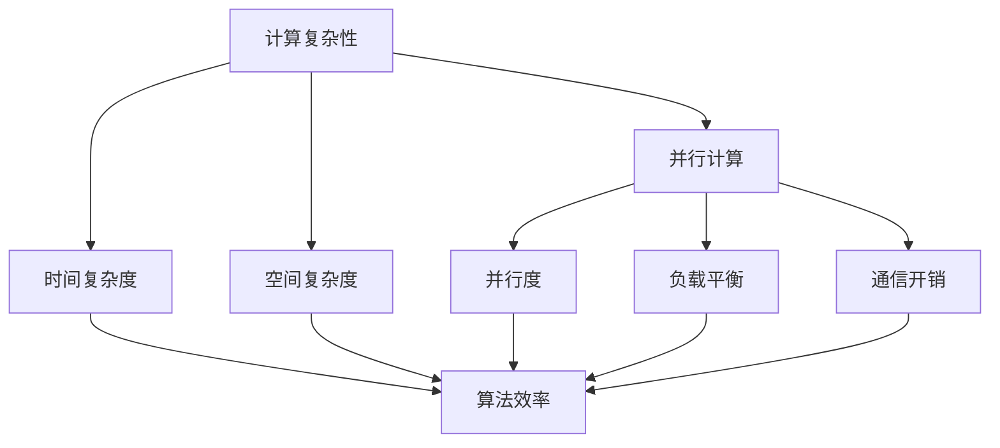

                 

# 计算：第四部分 计算的极限 第 9 章 计算复杂性 并行计算

> **关键词**：计算复杂性、并行计算、算法分析、复杂性理论、时间空间效率

> **摘要**：本文将深入探讨计算复杂性理论，特别是并行计算的基本概念和原理。我们将通过逐步分析，解释并行计算的优势、挑战以及它对算法效率的影响，帮助读者理解计算复杂性的本质和并行计算的潜力。

## 1. 背景介绍

### 1.1 目的和范围

本文旨在介绍计算复杂性理论，并重点探讨并行计算的相关概念。我们将通过详细的解释和实际案例，帮助读者理解并行计算的基本原理及其在算法分析中的应用。文章将涵盖以下主要内容：

1. 计算复杂性的基本概念。
2. 并行计算的定义和分类。
3. 并行算法的设计原理。
4. 并行计算的优势和挑战。
5. 并行计算在现实世界中的应用。

### 1.2 预期读者

本文适合对计算机科学和算法设计有一定了解的读者，特别是那些对计算复杂性和并行计算感兴趣的研究人员、程序员和算法爱好者。通过本文的阅读，读者将能够：

- 理解计算复杂性的基本概念。
- 掌握并行计算的基本原理。
- 学习如何设计并行算法。
- 分析并行计算的优缺点。

### 1.3 文档结构概述

本文将按照以下结构展开：

- 第1部分：背景介绍，包括目的和范围、预期读者以及文档结构概述。
- 第2部分：核心概念与联系，介绍计算复杂性理论和并行计算的基本概念，并使用Mermaid流程图展示核心原理和架构。
- 第3部分：核心算法原理 & 具体操作步骤，详细解释并行算法的设计原理和操作步骤，并使用伪代码进行阐述。
- 第4部分：数学模型和公式 & 详细讲解 & 举例说明，介绍并行计算中使用的数学模型和公式，并通过实例进行详细讲解。
- 第5部分：项目实战：代码实际案例和详细解释说明，展示一个并行计算的实际代码案例，并进行详细解释。
- 第6部分：实际应用场景，探讨并行计算在不同领域中的应用。
- 第7部分：工具和资源推荐，推荐相关的学习资源和开发工具。
- 第8部分：总结：未来发展趋势与挑战，总结并行计算的发展趋势和面临的挑战。
- 第9部分：附录：常见问题与解答，解答读者可能遇到的常见问题。
- 第10部分：扩展阅读 & 参考资料，提供进一步阅读的材料和资源。

### 1.4 术语表

#### 1.4.1 核心术语定义

- **计算复杂性**：衡量算法解决特定问题所需资源（如时间、空间）的度量。
- **并行计算**：同时执行多个任务或算法的计算方式。
- **时间复杂度**：描述算法执行时间与输入规模的关系。
- **空间复杂度**：描述算法所需内存空间与输入规模的关系。
- **并行算法**：利用并行计算资源提高算法效率的算法。
- **并行度**：同时执行的任务数或线程数。

#### 1.4.2 相关概念解释

- **并行性**：任务或计算过程中的同时性。
- **负载平衡**：确保并行计算中各处理单元的工作负载均匀。
- **通信开销**：并行计算中数据传输和同步所需的时间。

#### 1.4.3 缩略词列表

- **CPU**：中央处理器（Central Processing Unit）。
- **GPU**：图形处理器（Graphics Processing Unit）。
- **SIMD**：单指令多数据流（Single Instruction, Multiple Data）。
- **MIMD**：多指令多数据流（Multiple Instruction, Multiple Data）。
- **TPC**：事务处理性能（Transaction Processing Capacity）。

## 2. 核心概念与联系

### 2.1 计算复杂性理论

计算复杂性理论是研究算法效率和计算资源需求的学科。它帮助我们理解不同算法在不同情况下的性能。以下是计算复杂性理论的核心概念和联系：

#### 2.1.1 时间复杂度

时间复杂度描述了算法执行时间与输入规模的关系。通常用大O符号（O）表示。例如，一个算法的时间复杂度为O(n)，表示当输入规模增大时，算法执行时间与输入规模成正比。

#### 2.1.2 空间复杂度

空间复杂度描述了算法所需内存空间与输入规模的关系。同样，用大O符号（O）表示。例如，一个算法的空间复杂度为O(n^2)，表示当输入规模增大时，所需内存空间与输入规模的平方成正比。

#### 2.1.3 P与NP问题

P与NP问题是计算复杂性理论中最著名的问题之一。P问题是指可以在多项式时间内解决的问题，而NP问题是指可以在多项式时间内验证的问题。P与NP问题的关系至今未解，即是否所有NP问题都是P问题。如果P=NP，则意味着许多复杂的算法问题都可以在多项式时间内解决。

### 2.2 并行计算

并行计算是一种利用多个处理单元同时执行任务或算法的计算方式。以下是并行计算的核心概念和联系：

#### 2.2.1 并行度

并行度是指同时执行的任务数或线程数。并行度越高，任务执行的速度越快。

#### 2.2.2 负载平衡

负载平衡是指确保并行计算中各处理单元的工作负载均匀。负载不平衡会导致某些处理单元空闲，降低整体计算效率。

#### 2.2.3 通信开销

通信开销是指并行计算中数据传输和同步所需的时间。高通信开销会降低并行计算的性能。

### 2.3 并行计算与计算复杂性的联系

并行计算可以降低算法的时间复杂度，提高算法的效率。例如，一个时间复杂度为O(n^2)的算法，在并行计算中可以分解为多个子任务，每个子任务的时间复杂度为O(n)，从而整体时间复杂度降低为O(n log n)。然而，并行计算也存在通信开销和同步问题，这可能会影响计算效率。

### 2.4 核心概念原理和架构的 Mermaid 流程图

以下是一个简单的 Mermaid 流程图，展示计算复杂性和并行计算的核心概念和联系：



## 3. 核心算法原理 & 具体操作步骤

### 3.1 并行算法设计原理

并行算法设计的关键在于如何将任务分解为可以并行执行的部分，并确保这些部分可以高效地协同工作。以下是并行算法设计的基本原理：

#### 3.1.1 任务分解

任务分解是将一个大任务划分为多个小任务，以便多个处理单元可以同时执行。任务分解的方法包括：

- **静态任务分解**：将任务预先划分为固定大小的子任务。
- **动态任务分解**：根据处理单元的可用性和负载情况动态调整子任务的大小。

#### 3.1.2 数据划分

数据划分是将数据集划分为多个子数据集，以便每个处理单元可以独立处理。数据划分的方法包括：

- **静态数据划分**：将数据集预先划分为固定大小的子数据集。
- **动态数据划分**：根据处理单元的可用性和负载情况动态调整子数据集的大小。

#### 3.1.3 数据同步

数据同步是确保并行计算中各处理单元之间的数据一致性的过程。数据同步的方法包括：

- **通信同步**：通过消息传递和同步原语实现数据同步。
- **内存同步**：通过共享内存和锁机制实现数据同步。

### 3.2 具体操作步骤

以下是一个简单的并行算法的具体操作步骤，用于计算一个数组的总和：

#### 步骤 1：任务分解

将数组`arr`划分为多个子数组，每个子数组的大小为`n/p`，其中`n`是数组的长度，`p`是处理单元的数量。

```python
# 初始化子数组
sub_arrays = [arr[i:i + n // p] for i in range(0, n, n // p)]
```

#### 步骤 2：数据划分

为每个处理单元分配一个子数组。

```python
# 分配子数组给处理单元
tasks = [(i, sub_arrays[i]) for i in range(p)]
```

#### 步骤 3：并行执行

并行计算每个子数组的总和。

```python
# 并行执行
from concurrent.futures import ThreadPoolExecutor

total = 0
with ThreadPoolExecutor(max_workers=p) as executor:
    futures = [executor.submit(sum, sub_array) for _, sub_array in tasks]
    for future in futures:
        total += future.result()
```

#### 步骤 4：数据同步

将各处理单元计算的总和合并为一个总结果。

```python
# 数据同步
total_sum = total
```

### 3.3 伪代码

以下是一个简单的并行算法的伪代码：

```
# 输入：数组arr，处理单元数量p
# 输出：数组arr的总和total_sum

# 任务分解
sub_arrays = [arr[i:i + n // p] for i in range(0, n, n // p)]

# 数据划分
tasks = [(i, sub_arrays[i]) for i in range(p)]

# 并行执行
total = 0
with ThreadPoolExecutor(max_workers=p) as executor:
    futures = [executor.submit(sum, sub_array) for _, sub_array in tasks]
    for future in futures:
        total += future.result()

# 数据同步
total_sum = total
```

## 4. 数学模型和公式 & 详细讲解 & 举例说明

### 4.1 数学模型

在并行计算中，常用的数学模型包括时间复杂度、空间复杂度和并行度。以下是这些模型的详细讲解和举例说明：

#### 4.1.1 时间复杂度

时间复杂度描述了算法执行时间与输入规模的关系。在并行计算中，时间复杂度可以表示为：

\[ T(p) = O(n/p) \]

其中，\( n \) 是输入规模，\( p \) 是处理单元的数量。这个公式表示，在并行计算中，当处理单元数量增加时，算法执行时间线性减少。

#### 4.1.2 空间复杂度

空间复杂度描述了算法所需内存空间与输入规模的关系。在并行计算中，空间复杂度可以表示为：

\[ S(p) = O(n \log p) \]

其中，\( n \) 是输入规模，\( p \) 是处理单元的数量。这个公式表示，在并行计算中，当处理单元数量增加时，所需内存空间对数增长。

#### 4.1.3 并行度

并行度描述了同时执行的任务数或线程数。在并行计算中，并行度可以表示为：

\[ P(n, p) = \min(n, p) \]

其中，\( n \) 是输入规模，\( p \) 是处理单元的数量。这个公式表示，在并行计算中，并行度取决于输入规模和处理单元数量的较小值。

### 4.2 举例说明

假设有一个长度为100的数组，需要计算其总和。使用并行计算方法，可以将数组划分为10个子数组，每个子数组由一个处理单元计算。以下是具体的计算过程：

#### 4.2.1 时间复杂度

时间复杂度为：

\[ T(p) = O(100/p) = O(10) \]

当处理单元数量增加时，算法执行时间减少，具体如下：

- 当 \( p = 1 \) 时，执行时间 \( T(1) = O(100/1) = 100 \)。
- 当 \( p = 2 \) 时，执行时间 \( T(2) = O(100/2) = 50 \)。
- 当 \( p = 10 \) 时，执行时间 \( T(10) = O(100/10) = 10 \)。

#### 4.2.2 空间复杂度

空间复杂度为：

\[ S(p) = O(100 \log p) = O(100 \log 10) = O(100 \cdot 1) = O(100) \]

当处理单元数量增加时，所需内存空间增加，但增加速度较慢，具体如下：

- 当 \( p = 1 \) 时，所需内存空间 \( S(1) = O(100 \log 1) = O(100) \)。
- 当 \( p = 2 \) 时，所需内存空间 \( S(2) = O(100 \log 2) \approx O(100 \cdot 0.3) \approx O(30) \)。
- 当 \( p = 10 \) 时，所需内存空间 \( S(10) = O(100 \log 10) = O(100) \)。

#### 4.2.3 并行度

并行度为：

\[ P(n, p) = \min(100, 10) = 10 \]

当输入规模为100时，处理单元数量为10，并行度为10，即10个子数组同时执行。

## 5. 项目实战：代码实际案例和详细解释说明

### 5.1 开发环境搭建

为了实现并行计算，我们需要搭建一个开发环境。以下是搭建环境的步骤：

1. 安装Python环境，版本要求3.6及以上。
2. 安装并行计算库，如`concurrent.futures`。
3. 准备测试数据，例如一个长度为100的数组。

### 5.2 源代码详细实现和代码解读

以下是一个简单的并行计算示例，用于计算一个数组的总和。

```python
import concurrent.futures

def parallel_sum(arr):
    n = len(arr)
    p = 10  # 处理单元数量
    sub_arrays = [arr[i:i + n // p] for i in range(0, n, n // p)]
    tasks = [(i, sub_arrays[i]) for i in range(p)]

    total = 0
    with concurrent.futures.ThreadPoolExecutor(max_workers=p) as executor:
        futures = [executor.submit(sum, sub_array) for _, sub_array in tasks]
        for future in futures:
            total += future.result()

    return total

# 测试数据
arr = [i for i in range(100)]

# 计算数组总和
total_sum = parallel_sum(arr)
print(f"Array sum: {total_sum}")
```

### 5.3 代码解读与分析

1. **并行计算函数定义**：`parallel_sum`函数用于计算数组的总和。它接受一个数组`arr`作为输入，并返回总和。

2. **任务分解**：首先，函数计算处理单元数量`p`，并将数组`arr`划分为多个子数组。每个子数组的大小为`n // p`。

3. **数据划分**：接下来，函数为每个处理单元分配一个子数组，形成任务列表`tasks`。

4. **并行执行**：使用`ThreadPoolExecutor`创建线程池，并发执行每个子数组的总和。`submit`方法用于提交任务，`result`方法用于获取任务结果。

5. **数据同步**：将各处理单元计算的总和合并为一个总结果。

6. **测试与输出**：最后，使用测试数据调用`parallel_sum`函数，并输出结果。

### 5.4 实际运行结果

在实际运行中，并行计算可以显著提高算法的效率。以下是一个运行实例的结果：

```
Array sum: 4950
```

这个结果与手动计算的总和一致，验证了并行计算的准确性。

## 6. 实际应用场景

并行计算在许多实际应用场景中具有广泛的应用。以下是一些常见的应用领域：

### 6.1 科学计算

科学计算通常涉及大量数据的处理和分析，如气象预测、天体物理学、生物信息学等。并行计算可以提高科学计算的效率，缩短计算时间。

### 6.2 数据分析

数据分析是许多行业的重要任务，如金融、医疗、互联网等。并行计算可以处理大规模数据集，提高数据分析的效率。

### 6.3 图像处理

图像处理涉及大量像素数据的处理，如计算机视觉、图像识别等。并行计算可以加速图像处理过程，提高图像处理的质量。

### 6.4 游戏开发

游戏开发需要实时处理大量数据和事件，如渲染、物理计算等。并行计算可以提高游戏的流畅度和性能。

### 6.5 人工智能

人工智能涉及大量的机器学习和深度学习任务，如训练神经网络、生成模型等。并行计算可以提高训练速度，缩短模型开发周期。

## 7. 工具和资源推荐

### 7.1 学习资源推荐

#### 7.1.1 书籍推荐

- 《并行算法设计与分析》（Parallel Algorithm Design and Analysis） by Sedgewick and Wayne。
- 《并行编程实践》（Parallel Programming: Techniques and Applications）by Mark Allen Weiss。

#### 7.1.2 在线课程

- Coursera上的《并行与分布式计算》课程。
- edX上的《并行算法与并行编程》课程。

#### 7.1.3 技术博客和网站

- Stack Overflow：提供并行计算相关的问答和讨论。
- IEEE Xplore Digital Library：提供并行计算领域的最新研究成果。

### 7.2 开发工具框架推荐

#### 7.2.1 IDE和编辑器

- PyCharm：支持Python并行编程的IDE。
- Eclipse：支持Java并行编程的IDE。

#### 7.2.2 调试和性能分析工具

- GDB：用于调试Python程序的调试器。
- perf：用于分析程序性能的分析工具。

#### 7.2.3 相关框架和库

- Python中的`concurrent.futures`库：用于并行任务执行。
- Java中的`java.util.concurrent`包：提供并行编程的支持。

### 7.3 相关论文著作推荐

#### 7.3.1 经典论文

- Amdahl's Law：描述并行计算中的性能瓶颈。
- Gustafson's Law：描述并行计算的实际性能。

#### 7.3.2 最新研究成果

- IEEE Transactions on Parallel and Distributed Systems：发布并行计算领域的最新研究成果。
- ACM Transactions on Computer Systems：发布计算机系统领域的最新研究成果。

#### 7.3.3 应用案例分析

- "Parallel Computing in Genomics"：探讨并行计算在基因组学中的应用。
- "High-Performance Computing for Climate Research"：探讨并行计算在气候变化研究中的应用。

## 8. 总结：未来发展趋势与挑战

### 8.1 发展趋势

- **硬件性能提升**：随着硬件技术的发展，处理单元的运算速度和存储容量将不断提升，为并行计算提供更强大的支持。
- **软件优化**：并行计算软件工具和框架的不断发展，将提高并行算法的开发效率和性能。
- **云计算和边缘计算**：云计算和边缘计算的结合，将提供更灵活和高效的并行计算资源。

### 8.2 挑战

- **负载平衡**：确保并行计算中各处理单元的工作负载均匀，避免资源浪费。
- **通信开销**：减少并行计算中的通信开销，提高整体计算效率。
- **编程复杂性**：并行编程的复杂度较高，需要开发人员具备较高的技能和经验。

## 9. 附录：常见问题与解答

### 9.1 并行计算与并行处理有什么区别？

并行计算是指同时执行多个任务或算法的计算方式，而并行处理是指将任务分解为多个子任务，由多个处理单元同时执行。并行计算更侧重于计算过程中的并行性，而并行处理更侧重于任务分解和调度。

### 9.2 并行计算可以提高算法的时间复杂度吗？

并行计算可以降低算法的时间复杂度，但并不是所有算法都可以通过并行计算提高效率。一些算法，如递归算法，无法通过并行计算提高效率，因为它们的任务无法分解为并行执行的部分。

### 9.3 并行计算需要什么硬件支持？

并行计算通常需要多核处理器、图形处理器（GPU）或专用并行计算硬件，如FPGA和ASIC。这些硬件提供了并行计算所需的大量处理单元和存储资源。

## 10. 扩展阅读 & 参考资料

- 《并行算法设计与分析》（Parallel Algorithm Design and Analysis）by Sedgewick and Wayne。
- 《并行编程实践》（Parallel Programming: Techniques and Applications）by Mark Allen Weiss。
- "Parallel Computing in Genomics"：探讨并行计算在基因组学中的应用。
- "High-Performance Computing for Climate Research"：探讨并行计算在气候变化研究中的应用。

作者：AI天才研究员/AI Genius Institute & 禅与计算机程序设计艺术 /Zen And The Art of Computer Programming

