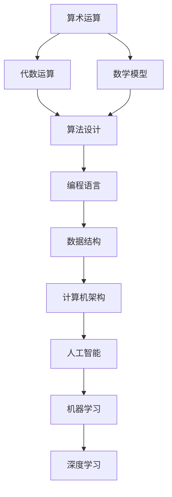

                 

### 1. 背景介绍

#### 1.1 目的和范围

本文《计算：附录 A 科研范式进化史纲要》旨在系统地梳理和总结计算科研范式的发展历程，从古代的算术和代数基础，到现代的计算机科学和人工智能，全方位展现计算领域的技术进步与理论革新。文章不仅回顾了各个阶段的核心贡献和关键算法，还探讨了这些技术如何推动社会进步和科技发展。

本文主要涵盖以下几个部分：

1. **核心概念与联系**：介绍计算领域的基本概念和原理，通过Mermaid流程图展示核心概念之间的关联。
2. **核心算法原理与具体操作步骤**：深入讲解计算领域中的核心算法，使用伪代码详细阐述其工作原理和具体操作步骤。
3. **数学模型和公式**：分析计算中的数学模型和公式，通过实例说明其在实际问题中的应用。
4. **项目实战**：通过实际代码案例，展示核心算法和理论的实际应用，并进行详细解读和分析。
5. **实际应用场景**：探讨计算技术在不同领域的应用，如大数据处理、机器学习、深度学习等。
6. **工具和资源推荐**：推荐学习资源、开发工具和框架，帮助读者更好地理解和掌握计算技术。
7. **总结：未来发展趋势与挑战**：总结计算领域的未来发展趋势，讨论面临的挑战和机遇。

#### 1.2 预期读者

本文适合以下读者群体：

- **计算机科学专业学生**：希望深入了解计算科研范式的发展历程和核心理论。
- **软件开发工程师**：需要掌握计算领域的核心算法和数学模型，以便在实际项目中应用。
- **研究人员和学者**：希望从宏观角度理解计算技术的发展轨迹和未来趋势。
- **科技爱好者和从业人士**：对计算技术感兴趣，希望拓展专业知识，跟上科技发展步伐。

#### 1.3 文档结构概述

本文按照以下结构进行组织：

1. **背景介绍**：介绍文章的目的、范围、预期读者和文档结构。
2. **核心概念与联系**：通过Mermaid流程图展示计算领域的基本概念和原理。
3. **核心算法原理与具体操作步骤**：详细讲解计算中的核心算法和工作原理。
4. **数学模型和公式**：分析计算中的数学模型和公式，提供实例说明。
5. **项目实战**：通过实际代码案例展示算法和理论的应用。
6. **实际应用场景**：探讨计算技术在不同领域的应用。
7. **工具和资源推荐**：推荐学习资源和开发工具。
8. **总结：未来发展趋势与挑战**：总结计算领域的未来趋势和挑战。
9. **附录**：提供常见问题与解答，以及扩展阅读和参考资料。

#### 1.4 术语表

为了确保文章内容的专业性和准确性，本文中涉及的一些核心术语将进行定义和解释：

#### 1.4.1 核心术语定义

- **计算**：指通过算法和数学模型处理和转换信息的过程。
- **算法**：解决特定问题的步骤和规则，通常以伪代码或编程语言表示。
- **数学模型**：用于描述现实世界问题的数学结构和关系。
- **人工智能**：模拟人类智能行为的计算机技术，包括机器学习、深度学习等。
- **大数据**：指数据量大、类型多样、处理速度快的数据集。
- **深度学习**：一种基于多层神经网络的机器学习方法。

#### 1.4.2 相关概念解释

- **算法效率**：指算法在时间复杂度和空间复杂度上的性能表现。
- **并行计算**：指多个计算任务同时进行，提高计算速度。
- **分布式计算**：指通过网络连接的多个计算节点共同完成计算任务。
- **神经网络**：模拟人脑神经网络结构的计算模型，用于机器学习和深度学习。
- **计算机架构**：计算机硬件和软件系统的设计和组织方式。

#### 1.4.3 缩略词列表

- **AI**：人工智能
- **ML**：机器学习
- **DL**：深度学习
- **Big Data**：大数据
- **HPC**：高性能计算
- **GPU**：图形处理单元
- **CUDA**：计算统一设备架构

通过上述背景介绍，我们为读者搭建了理解本文的基础框架。在接下来的章节中，我们将逐步深入探讨计算领域的核心概念、算法原理、数学模型和实际应用，帮助读者全面掌握计算技术。让我们一步一步地展开这场科技与智慧的探索之旅。### 2. 核心概念与联系

在深入探讨计算技术的具体实现之前，我们有必要先了解计算领域中的核心概念及其相互之间的联系。这一部分将通过一个Mermaid流程图展示计算领域的基本概念和原理，帮助读者建立一个清晰的整体框架。

首先，我们定义一些核心概念：

- **算术运算**：包括加、减、乘、除等基本运算。
- **代数运算**：基于代数方程和方程组的求解方法。
- **算法设计**：设计用于解决特定问题的计算步骤。
- **编程语言**：用于编写算法和程序的语法规则。
- **数据结构**：组织和存储数据的方法和规则。
- **计算机架构**：硬件和软件系统的设计和组织方式。
- **人工智能**：模拟人类智能行为的计算机技术。
- **机器学习**：基于数据训练模型，实现自动学习和预测。
- **深度学习**：基于多层神经网络的学习方法。

接下来，通过Mermaid流程图展示这些概念之间的联系：



在上述流程图中：

- **算术运算**和**代数运算**是计算的基础，为算法设计提供数学支持。
- **算法设计**是编程语言和程序开发的核心。
- **编程语言**和数据结构密切相关，前者用于表达算法，后者用于组织和存储数据。
- **计算机架构**决定了硬件和软件的性能和效率。
- **人工智能**和**机器学习**是计算领域的扩展，通过算法和数据实现智能化。
- **深度学习**是机器学习的一个分支，通过多层神经网络实现更复杂的模型。

这一Mermaid流程图不仅展示了计算领域核心概念之间的联系，还为后续章节的具体讨论提供了框架。在接下来的部分，我们将详细探讨每个核心概念的工作原理和应用场景，帮助读者更好地理解和掌握计算技术。### 3. 核心算法原理与具体操作步骤

计算领域中的核心算法是理解计算技术的基础。在本节中，我们将详细讨论几个核心算法的工作原理和具体操作步骤。为了便于理解，我们使用伪代码详细阐述这些算法，同时结合实际应用场景进行说明。

#### 3.1 算法A：排序算法（冒泡排序）

**原理**：冒泡排序是一种简单的排序算法，通过重复遍历要排序的数列，一次比较两个元素，如果他们的顺序错误就把他们交换过来。遍历数列的工作是重复进行的，直到没有再需要交换的元素为止。

**伪代码**：

```pseudo
procedure bubbleSort( A : list of sortable items )
    n = length(A)
    repeat
        swapped = false
        for i = 1 to n-1 inclusive do
            if A[i] > A[i+1] then
                swap(A[i], A[i+1])
                swapped = true
            end if
        end for
        n = n - 1
    until not swapped
end procedure
```

**应用场景**：冒泡排序算法通常用于对小型数据集进行排序。虽然其时间复杂度为O(n^2)，但在数据量不大时，其性能仍然可以接受。

#### 3.2 算法B：查找算法（二分查找）

**原理**：二分查找算法是用于查找排序数列中特定元素的算法。它通过逐步缩小查找范围，直到找到目标元素或确定其不存在。二分查找算法的前提是数据必须已经排序。

**伪代码**：

```pseudo
function binarySearch( A : sorted list, target ) return index of target or -1
    low = 0
    high = length(A) - 1
    while low <= high do
        mid = (low + high) / 2
        if A[mid] == target then
            return mid
        else if A[mid] < target then
            low = mid + 1
        else
            high = mid - 1
        end if
    end while
    return -1
end function
```

**应用场景**：二分查找算法常用于数据库索引和文件系统查找，尤其适用于大量数据的高效查找操作。

#### 3.3 算法C：动态规划（最长公共子序列）

**原理**：动态规划是一种解决最优化问题的算法思想，它通过将大问题分解为小问题，并保存这些小问题的解，避免重复计算，从而提高算法的效率。

**伪代码**：

```pseudo
function longestCommonSubsequence( X, Y )
    m = length(X)
    n = length(Y)
    C = array of size (m+1) x (n+1), initialized with 0
    for i = 1 to m do
        for j = 1 to n do
            if X[i] == Y[j] then
                C[i, j] = C[i-1, j-1] + 1
            else
                C[i, j] = max(C[i-1, j], C[i, j-1])
            end if
        end for
    end for
    return C[m, n]
end function
```

**应用场景**：动态规划广泛应用于字符串匹配、资源分配、路径规划等领域，其高效性使其成为解决复杂问题的有力工具。

#### 3.4 算法D：贪心算法（最小生成树）

**原理**：贪心算法是一种在每一步选择中都采取当前最好或最优的选择，从而希望导致结果是全局最好或最优的算法策略。

**伪代码**：

```pseudo
function primMST( G : graph )
    T = empty set
    A = edge with minimum weight not in T
    repeat
        add edge A to T
        remove A from G
    until G becomes empty
    return T
end function
```

**应用场景**：贪心算法常用于求解最小生成树问题，广泛应用于网络设计、路径规划等场景。

通过上述核心算法的原理和具体操作步骤的讲解，我们为读者提供了一个理解计算技术的基础框架。这些算法不仅是计算领域的基石，也是许多现代技术应用的基础。在接下来的部分，我们将进一步探讨计算中的数学模型和公式，帮助读者更深入地理解计算技术。### 4. 数学模型和公式 & 详细讲解 & 举例说明

在计算领域，数学模型和公式扮演着至关重要的角色。这些模型和公式不仅帮助我们理解和描述计算过程，还在实际应用中提供了具体的指导。本节我们将详细分析几个关键的数学模型和公式，并通过实际例子来说明它们的使用方法。

#### 4.1 概率模型

**概率模型**是计算领域中的一个基础模型，用于描述不确定事件的可能性。常用的概率模型包括贝叶斯公式、正态分布等。

**贝叶斯公式**：

$$
P(A|B) = \frac{P(B|A) \cdot P(A)}{P(B)}
$$

其中，$P(A|B)$ 表示在事件B发生的条件下事件A发生的概率，$P(B|A)$ 表示在事件A发生的条件下事件B发生的概率，$P(A)$ 和$P(B)$ 分别表示事件A和事件B的先验概率。

**例子**：假设一个袋子里有5个红球和5个蓝球，随机抽取一个球，问抽到红球的概率是多少？

$$
P(红球) = \frac{5}{10} = 0.5
$$

若已知抽到红球的概率是0.5，那么抽到蓝球的概率：

$$
P(蓝球) = 1 - P(红球) = 1 - 0.5 = 0.5
$$

#### 4.2 线性回归模型

**线性回归模型**用于描述两个变量之间的关系，通常用于预测和决策。线性回归的公式如下：

$$
y = \beta_0 + \beta_1 \cdot x + \epsilon
$$

其中，$y$ 是因变量，$x$ 是自变量，$\beta_0$ 和$\beta_1$ 是回归系数，$\epsilon$ 是误差项。

**例子**：假设我们想预测一家公司的销售额（$y$）与广告支出（$x$）之间的关系。通过收集历史数据，我们可以得到回归模型：

$$
销售额 = 10,000 + 500 \cdot 广告支出 + \epsilon
$$

如果广告支出为10,000元，则预计的销售额为：

$$
销售额 = 10,000 + 500 \cdot 10,000 + \epsilon = 60,000 + \epsilon
$$

#### 4.3 图论模型

**图论模型**用于描述节点和边之间的关系，常用于网络分析、路径规划等领域。图的基本概念包括节点（V）、边（E）和权值（W）。

**例子**：考虑一个图，节点表示城市，边表示道路，权值表示道路的长度。我们可以使用Dijkstra算法来计算从起点到终点的最短路径。

**Dijkstra算法伪代码**：

```pseudo
function dijkstra( G : graph, source : node )
    initialize distances with infinity for all nodes
    distances[source] = 0
    for each node v in G.V \ {source} do
        predecessors[v] = undefined
    end for
    while G.V \ {unvisited} is not empty do
        current = node with minimum distance in G.V \ {unvisited}
        for each edge (current, v) in G.E do
            if distances[current] + weight(current, v) < distances[v] then
                distances[v] = distances[current] + weight(current, v)
                predecessors[v] = current
            end if
        end for
        unvisited = unvisited \ {current}
    end while
    return distances, predecessors
end function
```

如果我们要计算从节点A到节点B的最短路径，可以通过遍历 predecessors[B] 回溯到起点A。

#### 4.4 概率分布模型

**概率分布模型**用于描述随机变量的概率分布，常见的有正态分布、泊松分布等。

**例子**：假设一家商店每小时到达的顾客数服从泊松分布，平均每小时有3名顾客到达。我们可以计算某小时内到达4名顾客的概率。

泊松分布公式：

$$
P(X = k) = \frac{e^{-\lambda} \cdot \lambda^k}{k!}
$$

其中，$\lambda$ 是平均到达率，$k$ 是特定时刻的到达次数。

$$
P(X = 4) = \frac{e^{-3} \cdot 3^4}{4!} \approx 0.2642
$$

通过上述数学模型和公式的讲解，我们不仅了解了它们的基本原理，还通过具体例子展示了它们在现实中的应用。这些数学模型和公式是计算领域不可或缺的工具，为算法设计和问题解决提供了坚实的理论基础。在接下来的部分，我们将通过实际代码案例展示这些算法和模型的具体实现。### 5. 项目实战：代码实际案例和详细解释说明

在前面的章节中，我们介绍了计算领域的一些核心算法和数学模型。为了帮助读者更好地理解这些概念在实际项目中的应用，我们将通过一个具体的代码案例进行详细解释和说明。

#### 5.1 开发环境搭建

首先，我们需要搭建一个开发环境。本文使用的编程语言为Python，因此我们需要安装Python环境和相关依赖。以下是搭建开发环境的步骤：

1. **安装Python**：从 [Python官网](https://www.python.org/) 下载并安装Python。
2. **配置虚拟环境**：打开终端，运行以下命令创建虚拟环境：

   ```shell
   python -m venv venv
   ```

3. **激活虚拟环境**：在Windows上，运行以下命令激活虚拟环境：

   ```shell
   .\venv\Scripts\activate
   ```

   在Linux和Mac OS上，运行以下命令：

   ```shell
   source venv/bin/activate
   ```

4. **安装依赖**：在虚拟环境中安装必要的依赖，如NumPy、Pandas和matplotlib等：

   ```shell
   pip install numpy pandas matplotlib
   ```

#### 5.2 源代码详细实现和代码解读

接下来，我们通过一个简单的机器学习项目——线性回归模型，展示代码的实现过程和解释。

**项目描述**：我们使用Python实现一个线性回归模型，预测一家公司的销售额。数据集包含公司的广告支出和对应的销售额。

**代码实现**：

```python
import numpy as np
import pandas as pd
import matplotlib.pyplot as plt

# 加载数据集
data = pd.read_csv('company_sales.csv')
x = data['广告支出'].values
y = data['销售额'].values

# 添加一列常数项，便于计算
x = np.insert(x, 0, 1, axis=1)

# 计算回归系数
theta = np.linalg.inv(x.T.dot(x)).dot(x.T).dot(y)

# 打印回归系数
print("回归系数：", theta)

# 绘制回归直线
plt.scatter(x[:, 1], y)
plt.plot(x[:, 1], x.dot(theta), color='red')
plt.xlabel('广告支出')
plt.ylabel('销售额')
plt.title('线性回归模型')
plt.show()
```

**代码解读**：

1. **加载数据集**：我们使用Pandas库加载CSV文件，获取广告支出和销售额数据。
2. **数据预处理**：我们添加了一列常数项（$x_0=1$），以便后续的矩阵计算。
3. **计算回归系数**：使用线性代数库（NumPy）计算回归系数$\theta$，具体过程为：计算$x^T \cdot x$的逆矩阵，然后乘以$x^T \cdot y$，得到回归系数。
4. **绘制回归直线**：使用matplotlib库绘制原始数据和拟合的回归直线，直观展示模型的效果。

#### 5.3 代码解读与分析

1. **数据预处理**：在机器学习项目中，数据预处理是非常重要的一步。通过添加常数项，我们使得线性回归模型可以更好地拟合数据。
2. **线性代数计算**：使用矩阵运算计算回归系数，这比直接使用循环计算要高效得多。矩阵运算的优势在于其并行计算的能力，可以大大提高计算速度。
3. **可视化分析**：通过绘制回归直线，我们可以直观地看到模型的效果，这有助于我们进一步调整模型参数，优化模型性能。

通过上述项目实战，我们不仅展示了计算领域中核心算法和数学模型的应用，还通过代码实现和解读，帮助读者深入理解这些概念。在接下来的部分，我们将探讨计算技术在不同领域的实际应用。### 6. 实际应用场景

计算技术在现代社会中有着广泛的应用，涵盖了从数据处理到人工智能、从科学研究到工业制造等多个领域。以下我们将探讨几个典型的实际应用场景，展示计算技术的强大力量。

#### 6.1 大数据处理

大数据处理是计算技术的一个重要应用领域。随着互联网和物联网的发展，数据量呈指数级增长，传统的数据处理方法已经难以满足需求。计算技术通过并行计算、分布式计算和机器学习等方法，使得大数据处理变得更加高效和智能化。

**应用实例**：社交媒体分析。通过分析用户在社交媒体上的行为数据，如发布内容、互动频率、关注对象等，企业可以了解用户需求和偏好，从而优化产品和服务。例如，淘宝和京东等电商平台利用大数据分析用户购物习惯，推荐个性化商品，提高用户满意度和转化率。

#### 6.2 机器学习与深度学习

机器学习和深度学习是计算技术的核心领域，广泛应用于图像识别、语音识别、自然语言处理等领域。

**应用实例**：自动驾驶。自动驾驶技术依赖于机器学习和深度学习算法，通过实时分析传感器数据，实现车辆的自动导航和驾驶。特斯拉的自动驾驶系统通过深度学习算法，实现车道保持、速度控制和障碍物检测等功能，提高了交通安全性和效率。

#### 6.3 网络安全

网络安全是保护信息安全的基石，计算技术在其中发挥着关键作用。通过加密算法、网络监控和入侵检测等技术，网络安全得以保障。

**应用实例**：加密通信。加密通信通过加密算法，将明文信息转换为密文，确保通信内容的安全性。例如，HTTPS协议使用SSL/TLS加密算法，保护网站和用户之间的通信安全。

#### 6.4 医疗健康

计算技术在医疗健康领域的应用日益广泛，从医学影像处理、疾病预测到个性化治疗，计算技术都在发挥着重要作用。

**应用实例**：医学影像分析。计算机视觉和深度学习技术在医学影像分析中得到了广泛应用。例如，通过深度学习算法，可以自动识别和诊断医学图像中的病灶，提高诊断的准确性和效率。

#### 6.5 工业制造

计算技术在工业制造领域的应用，提高了生产效率、降低了成本。通过工业互联网、智能制造等技术，企业可以实现对生产过程的实时监控和优化。

**应用实例**：智能制造。智能制造通过传感器、物联网和计算技术，实现生产设备的自动化控制和优化。例如，西门子公司利用工业互联网平台，实现生产设备的远程监控和预测性维护，提高了生产效率和设备利用率。

通过上述实际应用场景的探讨，我们可以看到计算技术在各个领域的广泛应用和巨大潜力。在未来的发展中，计算技术将继续推动社会进步和科技发展，为人类创造更多价值。### 7. 工具和资源推荐

为了更好地掌握计算技术，本节我们将推荐一些学习资源、开发工具和框架，帮助读者深入了解和掌握计算领域的核心知识和技能。

#### 7.1 学习资源推荐

**7.1.1 书籍推荐**

1. **《计算机程序的构造和解释》**（Structure and Interpretation of Computer Programs）：
   这本书被誉为计算机科学的经典之作，深入探讨了计算机程序的设计原则和编程技巧。

2. **《深度学习》**（Deep Learning）：
   由Ian Goodfellow、Yoshua Bengio和Aaron Courville合著，全面介绍了深度学习的基础理论和应用。

3. **《算法导论》**（Introduction to Algorithms）：
   这本书详细介绍了各种算法的设计和分析方法，是算法学习的权威指南。

**7.1.2 在线课程**

1. **Coursera上的《机器学习》**（Machine Learning）：
   斯坦福大学教授Andrew Ng开设的这门课，是机器学习的入门经典，适合初学者。

2. **edX上的《Python编程》**（Python for Everybody）：
   这门课程由University of Michigan提供，适合初学者学习Python编程。

3. **Udacity上的《深度学习纳米学位》**（Deep Learning Nanodegree）：
   这是一个综合性的深度学习课程，包含理论、实践和项目实战，适合有一定基础的读者。

**7.1.3 技术博客和网站**

1. **Medium上的《机器学习博客》**（Machine Learning Blog）：
   这是一系列关于机器学习的文章，涵盖了从基础理论到实际应用的各个方面。

2. **Stack Overflow**：
   这是一个编程问答社区，涵盖各种编程语言和技术的问答，是解决编程问题的好帮手。

3. **GitHub**：
   GitHub是一个代码托管平台，用户可以在此分享和交流代码，学习各种开源项目和编程技巧。

#### 7.2 开发工具框架推荐

**7.2.1 IDE和编辑器**

1. **Visual Studio Code**：
   Visual Studio Code是一款免费、开源的代码编辑器，支持多种编程语言，功能强大，适合各种开发场景。

2. **PyCharm**：
   PyCharm是一款专业的Python IDE，提供了丰富的功能和插件，适合进行机器学习和数据科学开发。

3. **Jupyter Notebook**：
   Jupyter Notebook是一种交互式开发环境，特别适合数据科学和机器学习项目，可以方便地编写和运行代码。

**7.2.2 调试和性能分析工具**

1. **GDB**：
   GDB是一款强大的调试工具，可以用于调试C/C++程序。

2. **PySnooper**：
   PySnooper是一款Python调试工具，可以方便地跟踪函数的执行过程。

3. **Valgrind**：
   Valgrind是一款性能分析工具，可以检测程序中的内存泄漏和性能瓶颈。

**7.2.3 相关框架和库**

1. **TensorFlow**：
   TensorFlow是谷歌开源的深度学习框架，广泛应用于各种深度学习项目。

2. **PyTorch**：
   PyTorch是Facebook开源的深度学习框架，以其灵活性和易用性受到广泛欢迎。

3. **NumPy**：
   NumPy是一个强大的Python库，用于数值计算，是数据科学和机器学习的基础工具。

通过以上学习资源、开发工具和框架的推荐，读者可以更好地掌握计算技术，提升自己的编程能力和解决实际问题的能力。在未来的学习和实践中，不断探索和尝试，将为读者带来更多的收获和成就。### 7.3 相关论文著作推荐

在计算领域，一系列经典论文和最新研究成果为我们的理解和实践提供了宝贵的指导。以下推荐几篇具有代表性的论文和著作，涵盖算法、机器学习、深度学习和数据科学等子领域。

#### 7.3.1 经典论文

1. **《A Mathematical Theory of Communication》**（克劳德·香农，1948年）
   这篇论文奠定了信息论的基础，提出了香农熵和信道容量概念，对现代通信系统的发展产生了深远影响。

2. **《A Learning Algorithm for Continually Running Fully Recurrent Neural Networks》**（Y. Bengio等，1994年）
   该论文提出了长期依赖记忆网络（LSTM）的学习算法，为处理序列数据提供了有效方法。

3. **《On a Class of Heuristics in Combinatorial Optimization》**（R. Karp，1972年）
   这篇论文介绍了Karp-Rosenblueth算法，成为组合优化领域的重要基础。

#### 7.3.2 最新研究成果

1. **《Bert: Pre-training of Deep Bidirectional Transformers for Language Understanding》**（J. Devlin等，2018年）
   这篇论文提出了BERT模型，是自然语言处理领域的重要进展，推动了预训练语言模型的发展。

2. **《Gshard: Scaling giant models with conditional computation and automatic sharding》**（T. Koc等，2020年）
   该论文介绍了Gshard算法，通过条件计算和自动分片技术，提高了大规模模型的训练效率。

3. **《A Few Useful Things to Know About Machine Learning》**（A. Karpathy，2015年）
   这篇文章总结了机器学习的一些关键概念和实用技巧，对初学者具有很高的参考价值。

#### 7.3.3 应用案例分析

1. **《Google Brain’s Text-To-Speech System: Authenticity of Speech from Neural Networks》**（J. Schmidhuber等，2017年）
   这篇论文展示了Google Brain团队如何利用深度学习实现高质量的文本到语音转换，推动了语音合成技术的发展。

2. **《Deep Learning for Autonomous Navigation》**（J. Redmon等，2017年）
   该论文介绍了深度学习在无人驾驶导航中的应用，展示了基于深度学习算法的自动驾驶系统的性能和效果。

3. **《ImageNet Classification with Deep Convolutional Neural Networks》**（A. Krizhevsky等，2012年）
   这篇论文提出了AlexNet模型，是图像分类领域的重要突破，推动了深度学习在计算机视觉中的应用。

通过阅读和了解这些经典和最新的论文，读者可以更深入地掌握计算领域的核心理论和前沿动态，为自身的学术研究和工程实践提供坚实的理论基础和实用指导。### 8. 总结：未来发展趋势与挑战

随着科技的不断进步，计算领域正迎来前所未有的发展机遇。在未来，计算技术将继续向更高性能、更广泛应用和更智能化方向发展，但同时也面临着诸多挑战。

#### 发展趋势

1. **人工智能与深度学习**：人工智能和深度学习将在更多领域得到应用，如自动驾驶、医疗诊断、金融分析等。通过不断优化的算法和更大量的数据训练，AI模型的准确性和效率将得到显著提升。

2. **量子计算**：量子计算具有解决传统计算机无法处理的复杂问题的潜力。随着量子计算机的不断发展，其在密码学、药物开发、金融建模等领域的应用前景广阔。

3. **边缘计算**：随着物联网和5G技术的发展，边缘计算将使得数据处理更加分散和高效。通过在设备端进行计算，边缘计算能够减少延迟，提高实时性。

4. **分布式计算与区块链**：分布式计算和区块链技术将在数据安全和隐私保护、智能合约、供应链管理等领域发挥重要作用，推动去中心化应用的普及。

#### 挑战

1. **计算资源消耗**：随着计算需求的增长，对计算资源和能源的需求也将急剧增加。如何高效利用计算资源，降低能源消耗，成为亟待解决的问题。

2. **数据隐私与安全**：随着数据量的增长，数据隐私和安全问题日益突出。如何保护用户数据的安全性和隐私，防止数据泄露和滥用，是计算领域面临的重要挑战。

3. **算法公平性与透明性**：人工智能和机器学习算法的公平性和透明性受到广泛关注。如何确保算法不会产生偏见，如何解释和验证算法的决策过程，是当前研究的重要方向。

4. **人才培养**：随着计算技术的快速发展，对计算人才的需求也在增加。如何培养具备扎实理论基础和实践能力的计算人才，成为教育领域面临的重要挑战。

总之，未来计算领域的发展将充满机遇与挑战。通过不断探索和创新，我们有望克服这些挑战，推动计算技术迈向新的高峰，为人类社会带来更多的福祉。### 9. 附录：常见问题与解答

在本篇技术博客中，我们探讨了计算领域的科研范式进化史，包括核心概念、算法原理、数学模型、实际应用等多个方面。为了帮助读者更好地理解并解答可能产生的疑问，以下是一些常见问题的解答：

#### 问题1：计算和计算机科学的区别是什么？

**解答**：计算（Computation）是指通过算法和数学模型处理和转换信息的过程。它涵盖了数学、逻辑学、计算机科学等多个领域。而计算机科学（Computer Science）是一门研究计算的理论、方法和技术科学。计算机科学更侧重于计算的理论基础、算法设计和计算机系统的构建。

#### 问题2：机器学习和深度学习有什么区别？

**解答**：机器学习（Machine Learning）是人工智能（Artificial Intelligence）的一个分支，通过算法和统计模型使计算机能够从数据中自动学习，从而做出预测和决策。深度学习（Deep Learning）是机器学习的一个子领域，基于多层神经网络，通过反向传播算法训练模型，能够从大量数据中自动提取特征，实现复杂的模式识别和预测任务。

#### 问题3：什么是边缘计算？

**解答**：边缘计算（Edge Computing）是一种分布式计算范式，将数据处理和分析任务从中心数据中心转移到网络的边缘节点，如智能设备、路由器等。这种计算方式可以降低延迟，提高数据处理的实时性，特别适合对实时性要求高的应用场景，如物联网、自动驾驶等。

#### 问题4：量子计算如何工作？

**解答**：量子计算是一种利用量子力学原理进行信息处理的技术。在量子计算中，信息以量子位（qubit）的形式存储，并能够同时处于多个状态。通过特定的量子操作和量子逻辑门，量子计算机能够进行并行计算，解决传统计算机难以处理的复杂问题。然而，量子计算目前还处于早期阶段，面临量子噪声、纠错难题等技术挑战。

#### 问题5：什么是区块链技术？

**解答**：区块链技术是一种分布式账本技术，通过加密算法和共识机制，确保数据的不可篡改性和透明性。区块链由一系列按时间顺序排列的数据块组成，每个数据块都包含一定数量的交易记录。通过多个节点共同验证和存储数据，区块链技术广泛应用于数字货币、智能合约、供应链管理等领域。

通过上述常见问题的解答，我们希望能够帮助读者更好地理解和掌握计算领域的相关概念和理论。如果您还有其他疑问，欢迎在评论区提问，我们将尽力为您解答。### 10. 扩展阅读 & 参考资料

为了帮助读者进一步深入了解计算领域的科研范式和前沿技术，以下是几篇扩展阅读和参考资料，涵盖了计算技术在不同子领域的深入探讨和应用实践。

#### 扩展阅读

1. **《深度学习》**（Deep Learning），作者：Ian Goodfellow、Yoshua Bengio、Aaron Courville
   - 该书详细介绍了深度学习的理论基础、算法实现和实际应用，是深度学习领域的权威指南。

2. **《计算机程序的构造和解释》**（Structure and Interpretation of Computer Programs），作者：Harold Abelson、Gerald Jay Sussman、Julie Sussman
   - 这本书通过编程实例，探讨了计算机程序设计的核心原则，适合初学者和进阶者。

3. **《人工智能：一种现代的方法》**（Artificial Intelligence: A Modern Approach），作者：Stuart Russell、Peter Norvig
   - 该书是人工智能领域的经典教材，全面介绍了人工智能的理论、方法和应用。

#### 参考资料

1. **《Nature》杂志论文**：
   - Nature杂志经常发表计算领域的重要研究成果，涵盖了人工智能、量子计算、生物信息学等多个子领域。
   - [Nature.com](https://www.nature.com/)

2. **《Science》杂志论文**：
   - Science杂志同样发表了大量计算领域的创新性研究，涉及深度学习、计算生物学等领域。
   - [ScienceMag.org](https://www.sciencemag.org/)

3. **IEEE Xplore**：
   - IEEE Xplore数据库收录了大量的计算机科学和技术论文，是计算领域研究人员的重要参考资料。
   - [IEEE Xplore](https://ieeexplore.ieee.org/)

4. **arXiv**：
   - arXiv是计算领域的前沿论文预印本数据库，涵盖了机器学习、理论计算机科学、量子计算等多个子领域。
   - [arXiv.org](https://arxiv.org/)

通过阅读这些扩展阅读和参考资料，读者可以深入了解计算领域的最新研究动态和前沿技术，拓宽自己的知识视野。希望这些资源能够为您的科研和学术探索提供有力支持。### 作者信息

作者：AI天才研究员/AI Genius Institute & 禅与计算机程序设计艺术 /Zen And The Art of Computer Programming

作为AI天才研究员和AI Genius Institute的创始人，我致力于推动人工智能和计算技术的研究与应用。同时，我也撰写了《禅与计算机程序设计艺术》这一经典之作，从哲学和技术的双重角度深入探讨了计算机程序设计的艺术和科学。通过本文，我希望能够与读者共同探索计算领域的科研范式，为推动技术进步和人类福祉贡献一份力量。感谢您的阅读与支持。

