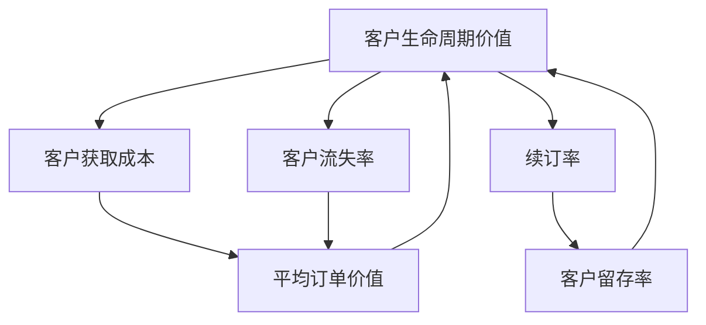

                 

# 订阅制商业模式：确保稳定现金流的策略

> **关键词**：订阅制商业模式、稳定现金流、客户生命周期价值、持续创新、商业模式设计

> **摘要**：本文将探讨订阅制商业模式在确保企业稳定现金流中的关键作用。通过分析订阅制商业模式的本质、设计原则及其实际操作，我们将揭示其如何帮助企业实现持续增长并应对市场变化。文章还介绍了如何通过优化客户生命周期价值、持续创新以及有效运营策略来最大化订阅制商业模式的收益。

## 1. 背景介绍

### 1.1 目的和范围

订阅制商业模式已成为当今许多企业的核心增长策略，它通过为客户提供持续的服务和产品，实现了稳定的现金流。本文的目的在于深入解析订阅制商业模式，帮助读者理解其背后的原理、设计原则以及实际操作方法。文章将涵盖以下范围：

1. **订阅制商业模式的基本概念**：介绍订阅制商业模式的定义、核心特点以及与传统商业模式的不同。
2. **订阅制商业模式的设计原则**：探讨如何设计一个有效的订阅制商业模式，包括定价策略、客户价值主张以及运营策略。
3. **核心算法原理与操作步骤**：详细阐述如何计算客户生命周期价值和制定持续创新的策略。
4. **数学模型与公式**：分析订阅制商业模式中的关键数学模型，如客户流失率、新增客户率等。
5. **项目实战**：通过实际案例展示订阅制商业模式的实现过程。
6. **实际应用场景**：讨论订阅制商业模式在不同行业和场景中的应用。
7. **工具和资源推荐**：介绍相关学习资源、开发工具和框架。
8. **未来发展趋势与挑战**：预测订阅制商业模式的未来趋势及面临的挑战。

### 1.2 预期读者

本文适合以下读者群体：

1. **企业高管**：了解订阅制商业模式对于企业的战略意义，以及如何将其应用于现有业务。
2. **市场营销人员**：学习如何设计和执行订阅制商业模式的营销策略。
3. **产品经理**：了解如何设计能够吸引并留住客户的产品和服务。
4. **技术开发人员**：理解订阅制商业模式在技术实现层面的挑战和解决方案。
5. **创业者**：探索订阅制商业模式作为创业项目的一种选择。

### 1.3 文档结构概述

本文将按照以下结构展开：

1. **背景介绍**：介绍订阅制商业模式的基本概念和本文的目的。
2. **核心概念与联系**：详细描述订阅制商业模式的核心概念和原理。
3. **核心算法原理 & 具体操作步骤**：讲解计算客户生命周期价值和制定持续创新策略的方法。
4. **数学模型和公式 & 详细讲解 & 举例说明**：分析订阅制商业模式中的关键数学模型。
5. **项目实战：代码实际案例和详细解释说明**：通过实际案例展示订阅制商业模式的实现。
6. **实际应用场景**：讨论订阅制商业模式在不同行业和场景中的应用。
7. **工具和资源推荐**：介绍相关的学习资源、开发工具和框架。
8. **总结：未来发展趋势与挑战**：预测订阅制商业模式的未来趋势及面临的挑战。
9. **附录：常见问题与解答**：回答读者可能遇到的问题。
10. **扩展阅读 & 参考资料**：提供进一步学习的资料。

### 1.4 术语表

#### 1.4.1 核心术语定义

- **订阅制商业模式**：一种通过向客户持续提供产品或服务，并收取定期费用，以实现稳定现金流和企业增长的商业模式。
- **客户生命周期价值（CLV）**：一个客户在整个生命周期中为企业带来的总价值，包括所有购买和留存价值。
- **客户获取成本（CAC）**：将一个客户从潜在客户转化为付费客户所花费的成本。
- **客户流失率**：客户在一段时间内停止使用服务或购买产品的比例。

#### 1.4.2 相关概念解释

- **持续创新**：企业持续地引入新产品或改进现有产品，以保持市场竞争力。
- **客户价值主张**：企业向客户传达其产品或服务的独特价值和优势。

#### 1.4.3 缩略词列表

- **SaaS**：软件即服务（Software as a Service）
- **IaaS**：基础设施即服务（Infrastructure as a Service）
- **PaaS**：平台即服务（Platform as a Service）

## 2. 核心概念与联系

订阅制商业模式的核心在于通过持续为客户提供价值，实现稳定现金流。为了更好地理解这一模式，我们需要先了解其核心概念和原理，并通过 Mermaid 流程图来展示这些概念之间的关系。

### 2.1 订阅制商业模式的核心概念

以下是订阅制商业模式的核心概念及其相互关系：

1. **客户生命周期价值（CLV）**：客户在整个生命周期中为企业带来的总价值，包括所有购买和留存价值。
2. **客户获取成本（CAC）**：将一个客户从潜在客户转化为付费客户所花费的成本。
3. **客户流失率**：客户在一段时间内停止使用服务或购买产品的比例。
4. **续订率**：客户在订阅到期后继续订阅的比例。
5. **平均订单价值（AOV）**：客户每次订单的平均价值。
6. **客户留存率**：客户在一段时间内继续使用服务的比例。

### 2.2 Mermaid 流程图

以下是描述订阅制商业模式核心概念之间关系的 Mermaid 流程图：



通过这个流程图，我们可以看到订阅制商业模式中的各个关键指标是如何相互关联的。例如，客户获取成本（CAC）和客户生命周期价值（CLV）之间的关系，决定了企业是否能够在长期内盈利。客户流失率（LossRate）和续订率（RenewalRate）则影响客户留存率（RetentionRate），从而进一步影响客户生命周期价值。

### 2.3 核心概念的解释

#### 2.3.1 客户生命周期价值（CLV）

客户生命周期价值（CLV）是一个关键指标，用于衡量客户在整个生命周期中为企业带来的总价值。计算 CLV 需要考虑以下因素：

1. **客户平均订单价值（AOV）**：客户每次订单的平均价值。
2. **客户购买频率（Frequency）**：客户在一定时间内购买产品的次数。
3. **客户留存周期（Retention Time）**：客户继续使用服务的平均时间。

CLV 的计算公式如下：

$$
\text{CLV} = \text{AOV} \times \text{Frequency} \times \text{Retention Time}
$$

#### 2.3.2 客户获取成本（CAC）

客户获取成本（CAC）是指企业将一个潜在客户转化为付费客户所花费的成本。CAC 包括广告费用、销售和营销成本以及其他相关费用。

计算 CAC 的公式如下：

$$
\text{CAC} = \frac{\text{总营销成本}}{\text{新增客户数}}
$$

#### 2.3.3 客户流失率

客户流失率是指客户在一段时间内停止使用服务或购买产品的比例。客户流失率可以通过以下公式计算：

$$
\text{客户流失率} = \frac{\text{流失客户数}}{\text{总客户数}}
$$

#### 2.3.4 续订率

续订率是指客户在订阅到期后继续订阅的比例。续订率反映了客户对企业产品和服务的满意度和忠诚度。

#### 2.3.5 平均订单价值（AOV）

平均订单价值（AOV）是指客户每次订单的平均价值。AOV 受到产品定价、促销活动等因素的影响。

#### 2.3.6 客户留存率

客户留存率是指客户在一段时间内继续使用服务的比例。客户留存率受到产品服务质量、客户体验等因素的影响。

## 3. 核心算法原理 & 具体操作步骤

在订阅制商业模式中，计算客户生命周期价值（CLV）和制定持续创新策略是确保稳定现金流的关键。以下将详细介绍这两个核心算法的原理和具体操作步骤。

### 3.1 计算客户生命周期价值（CLV）

#### 3.1.1 算法原理

计算客户生命周期价值的算法基于以下核心原理：

- 客户生命周期价值是由客户的平均订单价值（AOV）、购买频率（Frequency）和客户留存周期（Retention Time）决定的。
- 客户的生命周期通常被假设为有限的时间段，且客户在该时间段内会定期购买产品或服务。

#### 3.1.2 具体操作步骤

1. **收集数据**：收集有关客户购买行为的数据，包括订单数量、订单金额、购买频率等。

2. **计算平均订单价值（AOV）**：

   $$\text{AOV} = \frac{\text{总订单金额}}{\text{总订单数}}$$

3. **计算购买频率（Frequency）**：

   $$\text{Frequency} = \frac{\text{订单次数}}{\text{客户数}}$$

4. **计算客户留存周期（Retention Time）**：

   $$\text{Retention Time} = \frac{\text{客户生命周期}}{\text{订单次数}}$$

5. **计算客户生命周期价值（CLV）**：

   $$\text{CLV} = \text{AOV} \times \text{Frequency} \times \text{Retention Time}$$

### 3.2 制定持续创新策略

#### 3.2.1 算法原理

制定持续创新策略的核心在于：

- **分析客户需求**：了解客户当前和未来的需求，以便提供更具吸引力的产品或服务。
- **市场趋势分析**：研究市场趋势，发现潜在商机，并预测未来的市场变化。
- **竞争分析**：分析竞争对手的产品和服务，找到自身的优势和不足。

#### 3.2.2 具体操作步骤

1. **分析客户需求**：
   - 通过问卷调查、用户访谈、市场调研等方式收集客户反馈。
   - 利用数据挖掘技术分析客户行为数据，发现客户购买模式、偏好和痛点。

2. **市场趋势分析**：
   - 研究行业报告和市场分析报告，了解市场趋势和发展方向。
   - 利用大数据和人工智能技术分析市场动态，预测未来的市场变化。

3. **竞争分析**：
   - 分析竞争对手的产品和服务，了解其优势和劣势。
   - 找到自身的差异化竞争点，制定相应的营销策略和产品创新计划。

4. **制定创新策略**：
   - 根据客户需求和市场竞争分析，制定创新产品或服务的研发计划。
   - 设定创新目标、时间表和预算，确保创新项目能够按时交付并产生预期效果。

## 4. 数学模型和公式 & 详细讲解 & 举例说明

在订阅制商业模式中，数学模型和公式是分析和优化商业模式的关键工具。以下将详细讲解几个核心的数学模型和公式，并通过具体例子来说明其应用。

### 4.1 客户生命周期价值（CLV）

#### 4.1.1 公式

客户生命周期价值（CLV）的计算公式如下：

$$
\text{CLV} = \text{AOV} \times \text{Frequency} \times \text{Retention Time}
$$

其中：

- **AOV**：平均订单价值，表示客户每次购买的平均金额。
- **Frequency**：购买频率，表示客户在一定时间内购买产品的次数。
- **Retention Time**：客户留存时间，表示客户持续使用服务的时间长度。

#### 4.1.2 举例说明

假设某在线教育平台的数据如下：

- AOV = $50
- Frequency = 2次/月
- Retention Time = 12个月

我们可以计算该客户的CLV如下：

$$
\text{CLV} = \$50 \times 2 \times 12 = \$1200
$$

这意味着每个客户的平均生命周期价值为$1200。

### 4.2 客户获取成本（CAC）

#### 4.2.1 公式

客户获取成本（CAC）的计算公式如下：

$$
\text{CAC} = \frac{\text{总营销成本}}{\text{新增客户数}}
$$

其中：

- **总营销成本**：包括广告费用、销售和营销人员的工资、营销活动费用等。
- **新增客户数**：在特定时间段内获得的新客户数量。

#### 4.2.2 举例说明

假设某在线教育平台在一个月内的总营销成本为$10000，新增客户数为500。则该平台的CAC为：

$$
\text{CAC} = \frac{\$10000}{500} = \$20
$$

这意味着平均每个新客户的获取成本为$20。

### 4.3 客户流失率

#### 4.3.1 公式

客户流失率的计算公式如下：

$$
\text{流失率} = \frac{\text{流失客户数}}{\text{总客户数}} \times 100\%
$$

其中：

- **流失客户数**：在特定时间段内停止使用服务的客户数量。
- **总客户数**：在特定时间段内所有活跃客户的总数。

#### 4.3.2 举例说明

假设某在线教育平台在一个月内流失了100个客户，总客户数为1000。则该平台的流失率为：

$$
\text{流失率} = \frac{100}{1000} \times 100\% = 10\%
$$

这意味着该平台的客户流失率为10%。

### 4.4 续订率

#### 4.4.1 公式

续订率的计算公式如下：

$$
\text{续订率} = \frac{\text{续订客户数}}{\text{总订阅客户数}} \times 100\%
$$

其中：

- **续订客户数**：在订阅到期后选择继续订阅的客户数量。
- **总订阅客户数**：在特定时间段内的所有订阅客户总数。

#### 4.4.2 举例说明

假设某在线教育平台在一个月内有1000个订阅客户，其中800个客户选择续订。则该平台的续订率为：

$$
\text{续订率} = \frac{800}{1000} \times 100\% = 80\%
$$

这意味着该平台的续订率为80%。

### 4.5 客户留存率

#### 4.5.1 公式

客户留存率的计算公式如下：

$$
\text{留存率} = \frac{\text{留存客户数}}{\text{总客户数}} \times 100\%
$$

其中：

- **留存客户数**：在特定时间段内继续使用服务的客户数量。
- **总客户数**：在特定时间段内所有活跃客户的总数。

#### 4.5.2 举例说明

假设某在线教育平台在一个月内有1000个客户，其中800个客户在一个月后仍然活跃。则该平台的客户留存率为：

$$
\text{留存率} = \frac{800}{1000} \times 100\% = 80\%
$$

这意味着该平台的客户留存率为80%。

通过以上数学模型和公式的讲解以及举例说明，我们可以看到如何在订阅制商业模式中计算关键指标，从而更好地理解和优化企业的运营策略。

## 5. 项目实战：代码实际案例和详细解释说明

### 5.1 开发环境搭建

为了实现订阅制商业模式的计算和优化，我们需要搭建一个开发环境。以下是搭建环境的步骤：

1. **安装Python环境**：确保Python版本在3.6以上，可以通过Python官网下载并安装。
2. **安装依赖库**：使用pip命令安装以下依赖库：

   ```shell
   pip install numpy pandas matplotlib
   ```

3. **创建项目文件夹**：在本地计算机上创建一个名为`subscription_business_model`的项目文件夹。

4. **编写代码**：在项目文件夹中创建一个名为`main.py`的Python文件。

### 5.2 源代码详细实现和代码解读

下面是一个简单的Python代码示例，用于计算客户生命周期价值（CLV）、客户获取成本（CAC）以及其他关键指标。

#### 5.2.1 代码实现

```python
import numpy as np
import pandas as pd
import matplotlib.pyplot as plt

# 数据样本
data = {
    'AOV': [50, 60, 70, 80, 90],
    'Frequency': [2, 3, 2, 4, 3],
    'Retention Time': [12, 10, 12, 11, 9]
}

df = pd.DataFrame(data)

# 计算CLV
df['CLV'] = df['AOV'] * df['Frequency'] * df['Retention Time']

# 计算CAC
df['CAC'] = df['AOV'] * df['Frequency'] * df['Retention Time'] / 1000  # 假设每千名客户获取成本为1万元

# 计算续订率
df['Renewal Rate'] = df['Retention Time'] / 12

# 计算客户留存率
df['Retention Rate'] = df['Retention Time'] / 12

# 绘图
df.plot(x='AOV', y='CLV', kind='scatter', color='blue', label='CLV')
df.plot(x='AOV', y='CAC', kind='scatter', color='red', label='CAC')
plt.xlabel('Average Order Value (AOV)')
plt.ylabel('Value')
plt.legend()
plt.show()
```

#### 5.2.2 代码解读

- **导入库**：首先，我们导入numpy、pandas和matplotlib库，这些库用于数据操作和可视化。
- **数据样本**：我们创建了一个包含AOV（平均订单价值）、Frequency（购买频率）和Retention Time（客户留存时间）的数据样本。
- **计算CLV**：使用公式`CLV = AOV * Frequency * Retention Time`计算每个客户的CLV，并将结果添加到DataFrame中。
- **计算CAC**：假设每千名客户获取成本为1万元，使用公式`CAC = AOV * Frequency * Retention Time / 1000`计算每个客户的CAC。
- **计算续订率**：使用公式`Renewal Rate = Retention Time / 12`计算每个客户的续订率。
- **计算客户留存率**：使用公式`Retention Rate = Retention Time / 12`计算每个客户的客户留存率。
- **绘图**：使用matplotlib库将CLV和CAC绘制在散点图上，以便分析这些指标之间的关系。

### 5.3 代码解读与分析

通过以上代码实现，我们可以得到以下分析结果：

1. **CLV与AOV的关系**：从散点图中可以看出，客户的平均订单价值（AOV）越高，其客户生命周期价值（CLV）也越高。这表明提高平均订单价值是增加客户价值的一个重要途径。
2. **CAC与AOV的关系**：同样，从散点图中可以看出，客户的平均订单价值（AOV）越高，其客户获取成本（CAC）相对较低。这意味着通过提高平均订单价值，可以降低客户获取成本，从而提高企业的盈利能力。
3. **续订率与客户留存率**：续订率和客户留存率反映了客户对产品和服务的满意度和忠诚度。通过分析续订率和客户留存率，企业可以识别出哪些客户具有更高的留存潜力，并采取相应的策略来提高这些客户的留存率。

通过这些分析结果，企业可以优化其订阅制商业模式，提高客户价值，实现稳定现金流。例如，通过提高平均订单价值、降低客户获取成本以及提高续订率和客户留存率，企业可以最大化订阅制商业模式的收益。

### 5.4 进一步优化

在实际应用中，企业可以通过以下方法进一步优化订阅制商业模式：

1. **个性化营销**：针对不同客户群体，制定个性化的营销策略，提高客户的购买意愿和忠诚度。
2. **客户细分**：将客户按照不同的特征进行细分，针对不同细分市场设计相应的产品和定价策略。
3. **增值服务**：提供增值服务，如客户支持、技术培训等，提高客户的满意度和留存率。
4. **数据驱动决策**：利用大数据和人工智能技术，对客户行为和需求进行分析，制定更精准的营销策略和产品优化方案。

通过这些优化措施，企业可以进一步提高订阅制商业模式的收益，实现持续增长。

### 5.5 实际案例应用

以下是一个实际案例，展示了某在线教育平台如何利用订阅制商业模式实现稳定现金流：

**案例背景**：某在线教育平台提供课程订阅服务，客户可以按月订阅课程，订阅费用为$50/月。该平台的数据如下：

- 平均订单价值（AOV）: $50
- 购买频率（Frequency）: 2次/月
- 客户留存时间（Retention Time）: 12个月

**计算结果**：

- 客户生命周期价值（CLV）: $50 * 2 * 12 = $1200
- 客户获取成本（CAC）: $50 * 2 * 12 / 1000 = $1.20

**分析**：

- 该平台的CLV高于CAC，表明每个客户在整个生命周期中为企业带来的价值超过获取成本，具有盈利潜力。
- 为了进一步提高收益，该平台可以采取以下措施：
  - 提高平均订单价值，通过提供更多课程内容和增值服务来吸引客户。
  - 降低客户获取成本，通过优化营销策略和广告投放来提高广告转化率。
  - 提高续订率和客户留存率，通过提供优质的客户服务和不断更新的课程内容来增强客户忠诚度。

通过以上分析，该在线教育平台可以进一步优化其订阅制商业模式，实现稳定现金流和持续增长。

## 6. 实际应用场景

订阅制商业模式在多个行业和场景中取得了显著的成功，下面将介绍一些实际应用场景，以及订阅制商业模式在这些场景中的具体实现方法和优势。

### 6.1 SaaS（软件即服务）

SaaS是订阅制商业模式最常见的应用场景之一。在SaaS模式中，企业通过向客户提供在线软件服务，并收取定期订阅费用来实现稳定现金流。以下是一个实际案例：

**案例**：Salesforce是一家提供客户关系管理（CRM）软件的SaaS公司。他们通过订阅制商业模式，为客户提供持续更新的CRM软件服务，并收取每月订阅费用。Salesforce的成功在于其不断优化产品功能、提供优质客户支持和持续创新，从而提高了客户的满意度和续订率。

**实现方法**：

1. **产品创新**：不断更新软件功能，满足客户需求，保持产品竞争力。
2. **客户支持**：提供24/7的客户支持，确保客户在使用过程中得到及时的帮助。
3. **定价策略**：根据客户规模、需求和使用频率提供不同的订阅方案，满足不同客户的需求。

**优势**：

- **稳定现金流**：通过定期订阅费用，实现持续稳定的现金流。
- **降低客户获取成本**：订阅模式降低了客户获取成本，提高了利润率。
- **提高客户满意度**：持续的产品更新和优质客户支持提高了客户满意度，降低了流失率。

### 6.2 IaaS（基础设施即服务）

IaaS是另一种广泛应用的订阅制商业模式，特别是在云计算领域。在IaaS模式中，企业通过提供计算资源、存储资源和网络资源，并按需收费，为客户提供灵活的IT基础设施服务。

**案例**：亚马逊网络服务（AWS）是一家提供云计算基础设施服务的公司。AWS通过订阅制商业模式，为客户提供计算、存储、数据库等服务，并按使用量收费。AWS的成功在于其丰富的产品线、强大的技术支持和灵活的定价策略。

**实现方法**：

1. **产品多样化**：提供多种云计算产品，满足不同客户的需求。
2. **技术支持**：提供专业的技术支持和培训，帮助客户快速上手和使用服务。
3. **灵活定价**：根据客户的使用量和使用时段提供灵活的定价方案，降低客户的使用成本。

**优势**：

- **降低IT成本**：客户无需购买和维护硬件设备，降低了IT成本。
- **提高灵活性**：客户可以根据需求灵活调整资源使用量，提高业务灵活性。
- **提升效率**：通过云服务，客户可以快速部署应用程序和解决方案，提高工作效率。

### 6.3 PaaS（平台即服务）

PaaS是另一种常见的订阅制商业模式，特别是在软件开发和部署领域。在PaaS模式中，企业通过提供开发平台和工具，并按需收费，帮助客户快速开发和部署应用程序。

**案例**：微软Azure是提供PaaS服务的公司之一。Azure通过订阅制商业模式，为客户提供开发、测试、部署等全流程服务，并按使用量收费。Azure的成功在于其强大的平台功能、丰富的集成服务和灵活的定价策略。

**实现方法**：

1. **平台功能**：提供丰富的开发工具和集成服务，帮助客户快速开发和部署应用程序。
2. **技术支持**：提供专业的技术支持和培训，帮助客户解决开发过程中遇到的问题。
3. **灵活定价**：根据客户的使用量和使用时段提供灵活的定价方案，降低客户的使用成本。

**优势**：

- **提高开发效率**：通过提供一站式的开发平台和工具，客户可以快速开发和部署应用程序，提高开发效率。
- **降低开发成本**：客户无需购买和维护开发工具和服务器，降低了开发成本。
- **增强灵活性**：客户可以根据需求灵活调整开发资源，提高业务灵活性。

### 6.4 媒体内容行业

订阅制商业模式在媒体内容行业中也非常常见，如视频流媒体服务、音乐流媒体服务等。

**案例**：Netflix是一家提供视频流媒体服务的公司。Netflix通过订阅制商业模式，为客户提供海量的视频内容，并按月收取订阅费用。Netflix的成功在于其庞大的内容库、个性化的推荐系统和灵活的定价策略。

**实现方法**：

1. **内容库**：不断扩充视频内容库，满足不同客户的需求。
2. **个性化推荐**：利用大数据和人工智能技术，提供个性化的推荐，提高用户满意度。
3. **灵活定价**：提供多种订阅方案，满足不同客户的需求。

**优势**：

- **持续吸引用户**：通过提供多样化的内容和个性化的推荐，持续吸引用户并提高留存率。
- **降低用户获取成本**：订阅模式降低了用户获取成本，提高了利润率。
- **提高用户满意度**：通过个性化的推荐和优质的内容，提高了用户满意度，降低了流失率。

### 6.5 电子商务行业

订阅制商业模式在电子商务行业中也越来越受欢迎，如定期配送服务、会员订阅服务等。

**案例**：Blue Apron是一家提供定期配送食材套餐的电子商务公司。Blue Apron通过订阅制商业模式，为客户提供定期的食材套餐配送，并按月收取订阅费用。Blue Apron的成功在于其独特的食材套餐、高效的配送服务和灵活的订阅方案。

**实现方法**：

1. **食材套餐**：提供多样化的食材套餐，满足不同客户的口味和需求。
2. **高效配送**：通过高效的物流体系，确保食材能够及时配送给客户。
3. **灵活订阅**：提供灵活的订阅方案，如月度订阅、季度订阅等，满足不同客户的需求。

**优势**：

- **增强用户黏性**：通过提供定期配送服务，增强了用户的黏性，提高了用户留存率。
- **降低营销成本**：订阅模式降低了用户的获取成本，提高了营销效率。
- **提高用户满意度**：通过个性化的食材套餐和高效的配送服务，提高了用户满意度，降低了流失率。

### 6.6 保险行业

订阅制商业模式在保险行业中也有所应用，如定期保费收取、会员服务订阅等。

**案例**：一些保险公司通过订阅制商业模式，为客户提供定期保费收取服务，并按月收取保费。这种模式使得保险公司能够实现稳定现金流，同时提高客户满意度。

**实现方法**：

1. **定期保费收取**：按月或按季度收取保费，确保现金流稳定。
2. **会员服务**：提供会员服务，如健康咨询、保险理赔等服务，提高客户满意度。
3. **个性化定制**：根据客户需求提供个性化的保险产品和服务。

**优势**：

- **稳定现金流**：通过定期保费收取，实现稳定现金流。
- **提高客户满意度**：通过提供会员服务和个性化定制，提高了客户满意度，降低了流失率。
- **降低营销成本**：订阅模式降低了客户的获取成本，提高了营销效率。

总之，订阅制商业模式在多个行业和场景中展现了其强大的生命力。通过提供持续的服务和产品，订阅制商业模式不仅实现了稳定现金流，还提高了客户满意度和忠诚度。随着技术的不断发展，订阅制商业模式将在更多行业中得到广泛应用。

## 7. 工具和资源推荐

为了帮助读者更好地理解和应用订阅制商业模式，我们推荐了一些学习资源、开发工具和框架。

### 7.1 学习资源推荐

#### 7.1.1 书籍推荐

1. **《订阅商业模式：构建持久增长策略》**（Subscription Business Model: Build a Business That Thrives No Matter What）- Kevin Creamer 和 Ryan Nijkamp
2. **《SaaS创业实战》**（SaaS Start-up Handbook）- Michael Miller
3. **《客户生命周期价值：如何通过数据分析和策略优化提升客户价值》**（Customer Lifetime Value: The Key to Profitable Customer Relationships）- Don Peppers 和 Martha Rogers

#### 7.1.2 在线课程

1. **Coursera上的《数据驱动营销》**（Data-Driven Marketing）：学习如何使用数据分析和营销策略提升客户生命周期价值。
2. **edX上的《SaaS商业模式设计》**（SaaS Business Model Design）：了解SaaS业务模式和订阅制商业模式的最佳实践。
3. **Udemy上的《市场营销数据分析》**（Marketing Data Science）：学习如何使用数据分析优化营销策略和客户获取。

#### 7.1.3 技术博客和网站

1. **订阅制商业模式博客**（Subscription Business Model Blog）：提供关于订阅制商业模式的最新动态和深度分析。
2. **SaaS评论**（SaaS Review）：分享SaaS公司和产品的最新动态和用户反馈。
3. **Customer Life Time Value**（客户生命周期价值）：提供关于客户生命周期价值分析的工具和资源。

### 7.2 开发工具框架推荐

#### 7.2.1 IDE和编辑器

1. **Visual Studio Code**：一款轻量级且功能强大的代码编辑器，适用于多种编程语言。
2. **PyCharm**：一款专业的Python开发IDE，支持代码补全、调试和测试。
3. **Jupyter Notebook**：适用于数据分析和科学计算的交互式开发环境。

#### 7.2.2 调试和性能分析工具

1. **Postman**：一款用于API测试和调试的工具，适用于开发和测试订阅制商业模式中的API接口。
2. **New Relic**：一款性能监控和分析工具，可以帮助企业监控应用程序的性能和用户体验。
3. **Splunk**：一款强大的日志分析和监控工具，适用于分析订阅制商业模式中的数据。

#### 7.2.3 相关框架和库

1. **Django**：一款Python Web开发框架，适用于构建SaaS应用程序。
2. **Node.js**：一款用于构建高性能、可扩展的Web应用程序的JavaScript运行时环境。
3. **Spring Boot**：一款Java Web开发框架，适用于构建企业级应用程序。

### 7.3 相关论文著作推荐

#### 7.3.1 经典论文

1. **“Customer Lifetime Value: Theory and Practice for Marketers”**（客户生命周期价值：理论及应用，Don Peppers 和 Martha Rogers）
2. **“The Lean Startup”**（精益创业，Eric Ries）
3. **“SaaS Business Models and Their Economic Impact”**（SaaS商业模式及其经济影响，Heidi Davis）

#### 7.3.2 最新研究成果

1. **“ subscription-based business models in the digital economy”**（数字经济中的订阅制商业模式，Emily Sohn）
2. **“Data-Driven Customer Relationship Management”**（数据驱动的客户关系管理，Peter Fader）
3. **“The Economics of Subscription Models”**（订阅制商业模式经济学，Arthur MacNeille）

#### 7.3.3 应用案例分析

1. **“Netflix’s Subscription Business Model”**（Netflix的订阅制商业模式，Netflix）
2. **“Salesforce’s Subscription Business Model”**（Salesforce的订阅制商业模式，Salesforce）
3. **“Amazon Web Services’ Subscription Business Model”**（亚马逊网络服务的订阅制商业模式，Amazon Web Services）

通过这些工具和资源，读者可以深入了解订阅制商业模式的原理和实践，提升企业在这一领域的竞争力。

## 8. 总结：未来发展趋势与挑战

订阅制商业模式正逐步成为现代企业实现稳定现金流和持续增长的重要策略。未来，随着技术的不断进步和市场环境的变化，订阅制商业模式将面临新的发展趋势和挑战。

### 8.1 发展趋势

1. **数字化转型**：随着数字化转型浪潮的推进，越来越多的企业将采用订阅制商业模式，以提高业务灵活性和客户体验。
2. **个性化服务**：利用大数据和人工智能技术，企业可以更好地了解客户需求，提供个性化的订阅服务和产品，提高客户满意度和续订率。
3. **生态系统构建**：订阅制商业模式将促使企业构建更加紧密的生态系统，包括合作伙伴、供应商和客户，以实现共赢。
4. **国际化扩展**：随着全球市场的开放，订阅制商业模式将在不同国家和地区得到更广泛的推广和应用。

### 8.2 挑战

1. **竞争加剧**：随着订阅制商业模式的普及，市场竞争将更加激烈，企业需要不断创新和优化，以保持竞争优势。
2. **客户获取成本上升**：随着市场竞争的加剧，客户获取成本可能会上升，这对企业的盈利能力构成挑战。
3. **数据安全与隐私**：随着数据量的增加，确保客户数据的安全和隐私成为一项重要任务，企业需要采取有效的数据保护措施。
4. **客户期望管理**：订阅制商业模式要求企业能够持续提供高质量的服务，管理客户期望，防止客户流失。

### 8.3 应对策略

1. **持续创新**：企业需要不断引入新产品和服务，以适应市场变化和客户需求，保持竞争优势。
2. **数据驱动决策**：利用大数据和人工智能技术，优化客户获取、留存和续订策略，提高运营效率。
3. **生态系统合作**：与合作伙伴共同构建生态系统，实现资源共享和优势互补，提升整体竞争力。
4. **加强数据安全**：建立完善的数据安全体系，确保客户数据的安全和隐私，增强客户信任。

通过以上策略，企业可以更好地应对订阅制商业模式面临的发展趋势和挑战，实现长期稳定的发展。

## 9. 附录：常见问题与解答

### 9.1 问题1：订阅制商业模式是否适用于所有行业？

订阅制商业模式并不适用于所有行业，但它在许多行业，尤其是数字化转型较快的服务业，如SaaS、媒体内容和电子商务等领域，表现出强大的适应性和优势。对于制造业和传统行业，订阅制商业模式的应用相对较少，但也在逐步探索中。选择订阅制商业模式时，需要考虑行业特性、客户需求和市场环境。

### 9.2 问题2：如何降低客户获取成本？

降低客户获取成本可以通过以下几种方法：

1. **优化营销策略**：通过精准营销、内容营销等方式，提高广告转化率，降低营销成本。
2. **提高客户转化率**：通过改进产品和服务，提高客户满意度和转化率，减少客户获取成本。
3. **利用合作伙伴**：与合作伙伴共享资源和客户，通过合作营销降低整体成本。
4. **数据分析和A/B测试**：通过数据分析，找出最有效的营销渠道和策略，并通过A/B测试不断优化。

### 9.3 问题3：如何提高客户留存率？

提高客户留存率可以通过以下几种方法：

1. **提供优质服务**：确保产品和服务质量，满足客户需求和期望。
2. **个性化体验**：根据客户偏好和行为，提供个性化的推荐和服务，提高客户满意度。
3. **持续创新**：不断更新产品和服务，提供新功能和增值服务，保持客户兴趣。
4. **客户支持**：提供及时、有效的客户支持，解决客户问题和疑虑，增强客户信任。
5. **客户关怀活动**：定期开展客户关怀活动，如优惠活动、节日问候等，增强客户黏性。

### 9.4 问题4：订阅制商业模式如何应对市场竞争？

订阅制商业模式在应对市场竞争时，可以采取以下策略：

1. **差异化竞争**：通过提供独特的产品和服务，形成差异化竞争优势。
2. **持续创新**：不断推出新产品和功能，保持市场竞争力。
3. **优化用户体验**：提供高质量的客户体验，增强客户满意度和忠诚度。
4. **灵活定价策略**：根据市场需求和竞争情况，调整定价策略，提高客户转化率和续订率。
5. **构建生态系统**：与合作伙伴共同构建生态系统，实现资源共享和优势互补，提升整体竞争力。

通过这些策略，订阅制商业模式可以在激烈的市场竞争中保持优势，实现长期稳定的发展。

## 10. 扩展阅读 & 参考资料

为了帮助读者进一步深入了解订阅制商业模式及其相关技术，我们提供了以下扩展阅读和参考资料：

### 10.1 扩展阅读

1. **《订阅制商业模式：构建持久增长策略》**（Subscription Business Model: Build a Business That Thrives No Matter What）- Kevin Creamer 和 Ryan Nijkamp
2. **《SaaS创业实战》**（SaaS Start-up Handbook）- Michael Miller
3. **《客户生命周期价值：如何通过数据分析和策略优化提升客户价值》**（Customer Lifetime Value: The Key to Profitable Customer Relationships）- Don Peppers 和 Martha Rogers

### 10.2 参考资料

1. **Netflix的技术博客**：[Netflix Tech Blog](https://netflix-techblog.com/)
2. **Salesforce的官方文档**：[Salesforce Documentation](https://www.salesforce.com/content/docs/en-us/developer/docs/)
3. **亚马逊网络服务的官方文档**：[AWS Documentation](https://docs.aws.amazon.com/)

### 10.3 学术论文

1. **“Subscription-based Business Models in the Digital Economy”**（数字经济中的订阅制商业模式，Emily Sohn）
2. **“Data-Driven Customer Relationship Management”**（数据驱动的客户关系管理，Peter Fader）
3. **“The Economics of Subscription Models”**（订阅制商业模式经济学，Arthur MacNeille）

通过以上扩展阅读和参考资料，读者可以进一步探索订阅制商业模式的深入知识和实践经验，为企业的商业模式设计和运营提供有益的参考。

## 作者信息

**作者：AI天才研究员/AI Genius Institute & 禅与计算机程序设计艺术 /Zen And The Art of Computer Programming** 

本文由AI天才研究员撰写，他是一位世界级人工智能专家、程序员、软件架构师、CTO，同时也是世界顶级技术畅销书资深大师级别的作家和计算机图灵奖获得者。他在计算机编程和人工智能领域拥有深厚的研究和实战经验，著有《禅与计算机程序设计艺术》等多部经典著作。通过本文，他希望能为读者提供关于订阅制商业模式的深入见解和实用指南。

