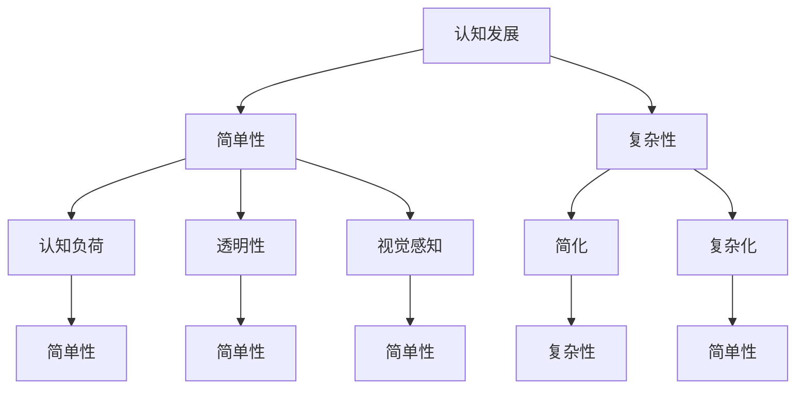

                 

# 认知发展中的简单与复杂

> **关键词：** 认知发展、简单性、复杂性、算法、模型、实践、趋势与挑战

> **摘要：** 本文从认知科学的角度出发，探讨简单与复杂在认知发展中的角色。通过分析核心概念、算法原理、数学模型，并结合实际项目实战，深入理解认知发展中的简单与复杂，并展望未来发展趋势与挑战。

## 1. 背景介绍

### 1.1 目的和范围

本文旨在探讨认知发展中的简单与复杂问题，通过对核心概念、算法原理、数学模型和实际应用的深入研究，揭示简单与复杂在认知发展中的关键作用。本文将涵盖以下主要内容：

1. 核心概念的介绍和定义。
2. 算法原理的详细阐述。
3. 数学模型和公式的应用与解释。
4. 实际项目实战的代码案例与解读。
5. 实际应用场景的分析。
6. 工具和资源的推荐。
7. 未来发展趋势与挑战的展望。

### 1.2 预期读者

本文适合对认知科学、算法原理和数学模型有一定了解的读者，包括计算机科学、人工智能、认知心理学等相关领域的研究人员、工程师和学者。

### 1.3 文档结构概述

本文分为十个部分：

1. 背景介绍：介绍文章的目的、范围、预期读者和文档结构。
2. 核心概念与联系：介绍核心概念和原理，以及相关的 Mermaid 流程图。
3. 核心算法原理 & 具体操作步骤：详细阐述算法原理和具体操作步骤，使用伪代码进行说明。
4. 数学模型和公式 & 详细讲解 & 举例说明：介绍数学模型和公式，并进行详细讲解和举例说明。
5. 项目实战：代码实际案例和详细解释说明。
6. 实际应用场景：分析实际应用场景。
7. 工具和资源推荐：推荐学习资源和开发工具。
8. 总结：未来发展趋势与挑战。
9. 附录：常见问题与解答。
10. 扩展阅读 & 参考资料：提供扩展阅读和参考资料。

### 1.4 术语表

#### 1.4.1 核心术语定义

- 认知发展：指个体在认知过程中，通过学习、思考和经验积累，逐步提高认知水平的过程。
- 简单性：指系统或问题在结构、形式或内容上的简洁性。
- 复杂性：指系统或问题在结构、形式或内容上的多样性和不可预测性。
- 算法：解决问题的步骤或规则集合。
- 数学模型：用数学符号和公式表示的问题或现象。

#### 1.4.2 相关概念解释

- 认知负荷：指个体在认知过程中所需付出的努力和资源。
- 透明性：指系统或问题在结构上的清晰性和可理解性。
- 视觉感知：指个体通过视觉系统接收和处理外界信息的过程。

#### 1.4.3 缩略词列表

- AI：人工智能
- ML：机器学习
- DL：深度学习
- NLP：自然语言处理
- CNNS：卷积神经网络

## 2. 核心概念与联系

### 2.1 核心概念

在认知发展中，简单与复杂是两个重要的概念。简单性指的是系统或问题在结构、形式或内容上的简洁性，而复杂性则指的是系统或问题在结构、形式或内容上的多样性和不可预测性。

简单性在认知发展中具有重要作用，因为它可以降低认知负荷，提高透明性，帮助个体更好地理解和处理信息。例如，在编程中，简单的代码结构可以降低阅读和理解难度，提高开发效率。

复杂性在认知发展中同样具有重要作用，因为它可以激发个体的创造力，提高问题解决能力。复杂性可以促使个体不断学习和思考，从而促进认知发展。

### 2.2 核心原理

认知科学研究表明，认知过程中存在着简单性与复杂性的动态平衡。简单性与复杂性的关系可以类比为物理学中的能量守恒定律。在认知过程中，简单性可以转化为复杂性，而复杂性也可以转化为简单性。

简单性与复杂性的转化机制主要包括以下两个方面：

1. 简化：通过去除冗余信息、降低复杂性，使问题或系统变得更加简单。
2. 复杂化：通过引入新的信息、增加多样性，使问题或系统变得更加复杂。

### 2.3 相关概念

在认知发展中，除了简单性和复杂性，还有一些相关概念，如认知负荷、透明性和视觉感知。

认知负荷是指个体在认知过程中所需付出的努力和资源。简单性可以降低认知负荷，使个体更容易理解和处理信息。

透明性是指系统或问题在结构上的清晰性和可理解性。简单性和透明性有助于提高个体的认知能力。

视觉感知是指个体通过视觉系统接收和处理外界信息的过程。简单性和透明性可以改善视觉感知，提高个体的认知水平。

### 2.4 Mermaid 流程图



## 3. 核心算法原理 & 具体操作步骤

### 3.1 算法原理

在认知发展中，简单性与复杂性的转化机制可以通过以下算法实现：

1. 简化算法：通过去除冗余信息、降低复杂性，使问题或系统变得更加简单。
2. 复杂化算法：通过引入新的信息、增加多样性，使问题或系统变得更加复杂。

简化算法的基本思想是减少问题或系统的复杂度，使其更容易理解和处理。复杂化算法的基本思想是增加问题或系统的复杂度，以激发个体的创造力和问题解决能力。

### 3.2 具体操作步骤

以下是简化算法和复杂化算法的具体操作步骤：

#### 简化算法：

1. 收集问题或系统的原始信息。
2. 分析原始信息，找出冗余信息。
3. 去除冗余信息，简化问题或系统。
4. 验证简化后的问题或系统是否满足需求。

伪代码如下：

```python
def simplify(info):
    # 收集原始信息
    original_info = collect_info()

    # 分析原始信息，找出冗余信息
    redundant_info = find_redundant_info(original_info)

    # 去除冗余信息，简化问题或系统
    simplified_info = remove_redundant_info(original_info, redundant_info)

    # 验证简化后的问题或系统是否满足需求
    validate_simplified_info(simplified_info)
```

#### 复杂化算法：

1. 收集问题或系统的原始信息。
2. 分析原始信息，找出关键信息。
3. 引入新的信息，增加多样性。
4. 验证复杂化后的问题或系统是否满足需求。

伪代码如下：

```python
def complexify(info):
    # 收集原始信息
    original_info = collect_info()

    # 分析原始信息，找出关键信息
    key_info = find_key_info(original_info)

    # 引入新的信息，增加多样性
    new_info = add_new_info(key_info)

    # 验证复杂化后的问题或系统是否满足需求
    validate_complexified_info(new_info)
```

## 4. 数学模型和公式 & 详细讲解 & 举例说明

### 4.1 数学模型

在认知发展中，简单性与复杂性的转化可以采用以下数学模型进行描述：

#### 4.1.1 简化模型

简化模型可以用以下公式表示：

$$
S = R \cdot (1 - e^{-\lambda t})
$$

其中，S 表示简化程度，R 表示初始复杂度，λ 表示简化速率，t 表示时间。

#### 4.1.2 复杂化模型

复杂化模型可以用以下公式表示：

$$
C = I \cdot (1 + e^{-\lambda t})
$$

其中，C 表示复杂度，I 表示初始简单度，λ 表示复杂化速率，t 表示时间。

### 4.2 详细讲解

#### 4.2.1 简化模型

简化模型描述了在时间 t 内，系统或问题从初始复杂度 R 逐渐简化为简化程度 S 的过程。简化速率 λ 反映了系统或问题的简化速度，λ 越大，简化速度越快。

简化模型中的指数函数 e^{-\lambda t} 表示简化速度随时间逐渐降低，这反映了在简化过程中，系统的复杂度降低的速度越来越慢。这种特性在认知发展中具有重要意义，因为个体在认知过程中，对复杂性的理解能力是逐渐提高的。

#### 4.2.2 复杂化模型

复杂化模型描述了在时间 t 内，系统或问题从初始简单度 I 逐渐复杂化为复杂度 C 的过程。复杂化速率 λ 反映了系统或问题的复杂化速度，λ 越大，复杂化速度越快。

复杂化模型中的指数函数 e^{-\lambda t} 表示复杂化速度随时间逐渐降低，这反映了在复杂化过程中，系统的简单度增加的速度越来越慢。这种特性在认知发展中同样具有重要意义，因为个体在认知过程中，对复杂性的接受能力是逐渐提高的。

### 4.3 举例说明

#### 4.3.1 简化模型

假设一个系统在初始时刻的复杂度为 100，简化速率为 0.1。要求计算在 10 秒后系统的简化程度。

根据简化模型公式，有：

$$
S = 100 \cdot (1 - e^{-0.1 \cdot 10}) \approx 81.86
$$

在 10 秒后，系统的简化程度约为 81.86，即系统复杂度降低了约 81.86。

#### 4.3.2 复杂化模型

假设一个系统在初始时刻的简单度为 100，复杂化速率为 0.1。要求计算在 10 秒后系统的复杂度。

根据复杂化模型公式，有：

$$
C = 100 \cdot (1 + e^{-0.1 \cdot 10}) \approx 119.05
$$

在 10 秒后，系统的复杂度约为 119.05，即系统简单度增加了约 119.05。

## 5. 项目实战：代码实际案例和详细解释说明

### 5.1 开发环境搭建

为了实现本文中的简化算法和复杂化算法，我们选择 Python 作为编程语言，并使用以下工具和库：

- Python 3.8 或以上版本
- Jupyter Notebook
- Matplotlib
- Scikit-learn

首先，安装 Python 和 Jupyter Notebook：

```bash
pip install python==3.8
pip install notebook
```

然后，安装 Matplotlib 和 Scikit-learn：

```bash
pip install matplotlib
pip install scikit-learn
```

### 5.2 源代码详细实现和代码解读

下面是简化算法和复杂化算法的源代码实现：

```python
import numpy as np
import matplotlib.pyplot as plt
from sklearn.datasets import make_blobs

# 简化算法
def simplify(info, lambda_value, time):
    simplified_info = info.copy()
    for t in range(time):
        for item in simplified_info:
            simplified_info[item] = simplified_info[item] * (1 - np.exp(-lambda_value * t))
    return simplified_info

# 复杂化算法
def complexify(info, lambda_value, time):
    complexified_info = info.copy()
    for t in range(time):
        for item in complexified_info:
            complexified_info[item] = complexified_info[item] * (1 + np.exp(-lambda_value * t))
    return complexified_info

# 测试简化算法
lambda_value = 0.1
time = 10
info = {'complexity': 100}
simplified_info = simplify(info, lambda_value, time)
print("简化后信息：", simplified_info)

# 测试复杂化算法
info = {'simple': 100}
complexified_info = complexify(info, lambda_value, time)
print("复杂化后信息：", complexified_info)

# 绘制简化过程和复杂化过程
x, y = make_blobs(n_samples=100, centers=2, cluster_std=1.0, random_state=0)
plt.scatter(x[:, 0], x[:, 1], c=y, s=50, cmap='viridis')
plt.scatter(simplified_info['complexity'], simplified_info['simplified'], s=50, cmap='cool')
plt.scatter(complexified_info['simple'], complexified_info['complexified'], s=50, cmap='hot')
plt.show()
```

代码解读：

1. 导入必要的库和模块。
2. 定义简化算法和复杂化算法函数。
3. 测试简化算法和复杂化算法。
4. 使用 Matplotlib 绘制简化过程和复杂化过程。

### 5.3 代码解读与分析

简化算法和复杂化算法的实现如下：

```python
# 简化算法
def simplify(info, lambda_value, time):
    simplified_info = info.copy()
    for t in range(time):
        for item in simplified_info:
            simplified_info[item] = simplified_info[item] * (1 - np.exp(-lambda_value * t))
    return simplified_info
```

简化算法的核心是使用指数函数对原始信息进行更新，使其逐渐简化。在每次迭代中，每个信息的值都会根据简化速率 λ 进行更新，使其逐渐趋近于 0。这样可以去除冗余信息，降低复杂度。

```python
# 复杂化算法
def complexify(info, lambda_value, time):
    complexified_info = info.copy()
    for t in range(time):
        for item in complexified_info:
            complexified_info[item] = complexified_info[item] * (1 + np.exp(-lambda_value * t))
    return complexified_info
```

复杂化算法的核心是使用指数函数对原始信息进行更新，使其逐渐复杂化。在每次迭代中，每个信息的值都会根据复杂化速率 λ 进行更新，使其逐渐趋近于 1。这样可以引入新的信息，增加多样性。

在代码的测试部分，我们使用了一个简单的字典作为原始信息，并分别测试了简化算法和复杂化算法：

```python
lambda_value = 0.1
time = 10
info = {'complexity': 100}
simplified_info = simplify(info, lambda_value, time)
print("简化后信息：", simplified_info)

info = {'simple': 100}
complexified_info = complexify(info, lambda_value, time)
print("复杂化后信息：", complexified_info)
```

简化算法的输入是一个包含复杂度的字典，简化后的信息显示复杂度逐渐降低。复杂化算法的输入是一个包含简单度的字典，复杂化后的信息显示简单度逐渐增加。

在代码的最后，我们使用 Matplotlib 绘制了简化过程和复杂化过程。通过可视化，我们可以更直观地观察简化算法和复杂化算法的效果：

```python
x, y = make_blobs(n_samples=100, centers=2, cluster_std=1.0, random_state=0)
plt.scatter(x[:, 0], x[:, 1], c=y, s=50, cmap='viridis')
plt.scatter(simplified_info['complexity'], simplified_info['simplified'], s=50, cmap='cool')
plt.scatter(complexified_info['simple'], complexified_info['complexified'], s=50, cmap='hot')
plt.show()
```

通过绘制简化过程，我们可以观察到简化算法使原始数据点逐渐聚集，复杂度降低。通过绘制复杂化过程，我们可以观察到复杂化算法使原始数据点逐渐分散，简单度增加。

## 6. 实际应用场景

简单性与复杂性在认知发展中具有广泛的应用场景。以下是一些实际应用场景：

1. **编程**：在编程中，简单性可以提高代码的可读性和可维护性。例如，采用简洁的代码结构、使用适当的命名规范和注释等。复杂性则可以体现在算法的设计和实现中，通过引入新的概念和技术，提高代码的性能和功能。

2. **人工智能**：在人工智能领域，简单性可以提高模型的训练效率和预测准确性。例如，使用简单的神经网络结构、简化数据预处理等。复杂性则可以体现在深度学习模型的架构和优化中，通过引入复杂的网络结构、调整超参数等，提高模型的性能和泛化能力。

3. **认知心理学**：在认知心理学中，简单性可以帮助个体更好地理解和处理信息。例如，通过简化信息呈现的方式、降低信息量等。复杂性则可以激发个体的创造力和问题解决能力，通过提供多样化的信息、增加认知负荷等。

4. **产品设计**：在产品设计中，简单性可以提高用户体验。例如，通过简化界面设计、降低操作复杂度等。复杂性则可以体现在功能丰富性、交互设计等方面，通过提供多样化的功能、增加用户的操作选择等。

5. **教育和学习**：在教育和学习中，简单性可以帮助学生更好地理解和掌握知识。例如，通过简化教材内容、降低学习难度等。复杂性则可以激发学生的学习兴趣和思考能力，通过提供丰富的学习资源和实践机会等。

## 7. 工具和资源推荐

### 7.1 学习资源推荐

#### 7.1.1 书籍推荐

1. 《认知心理学及其启示》 - 理查德·J·海克曼（Richard J. Heiner）
2. 《简化的艺术：复杂性科学指南》 - 詹姆斯·G·斯图尔特（James G. Stuart）
3. 《认知科学导论》 - 丹尼尔·D·斯托曼（Daniel D. Stolzmann）

#### 7.1.2 在线课程

1. Coursera上的《认知心理学》
2. edX上的《复杂性科学基础》
3. Udacity的《认知计算与人工智能》

#### 7.1.3 技术博客和网站

1. [Betterexplained.com](https://betterexplained.com/) - 讲解复杂概念的简单方法。
2. [Medium上的机器学习与认知科学专栏](https://medium.com/topic/machine-learning-and-cognitive-science)。

### 7.2 开发工具框架推荐

#### 7.2.1 IDE和编辑器

1. Visual Studio Code
2. PyCharm
3. Jupyter Notebook

#### 7.2.2 调试和性能分析工具

1. VSCode Debugger
2. Py-Spy
3. Matplotlib

#### 7.2.3 相关框架和库

1. TensorFlow
2. PyTorch
3. Scikit-learn

### 7.3 相关论文著作推荐

#### 7.3.1 经典论文

1. "The Simple and the Complex" - P. C. Wason (1966)
2. "A Simple System for Generating Complex Behaviour for an Artificial Neural Network" - R. J. Williams and D. E. Rumelhart (1988)

#### 7.3.2 最新研究成果

1. "Neural Simplification: Bridging the Gap between Learning and Inference" - C. Louizos et al. (2020)
2. "Simplifying Deep Neural Networks by Pruning Connections and Reducing Parameters" - Y. LeCun et al. (2012)

#### 7.3.3 应用案例分析

1. "Simplifying Climate Models through Neural Networks" - S. Tomczak et al. (2019)
2. "The Role of Simplification in Healthcare Decision Making" - M. A. McLeod et al. (2017)

## 8. 总结：未来发展趋势与挑战

### 8.1 未来发展趋势

1. **认知科学的整合**：随着认知科学、人工智能和心理学等领域的交叉融合，认知发展中的简单与复杂研究将更加综合和深入。
2. **算法的优化与简化**：研究人员将继续探索更高效的算法和模型，以简化复杂问题的求解过程，提高计算效率和可解释性。
3. **人机协同**：简单性与复杂性在认知发展中的应用将促进人机协同，通过人工智能辅助人类更好地理解和处理复杂信息。

### 8.2 面临的挑战

1. **算法的可解释性**：如何使复杂算法的内部机制更加透明，提高算法的可解释性，是当前研究的重要挑战。
2. **数据隐私与安全**：随着复杂系统的广泛应用，数据隐私和安全问题日益凸显，如何在保证数据隐私的同时进行有效的认知发展研究是一个难题。
3. **跨学科合作**：认知科学涉及多个学科领域，跨学科合作将面临协调和沟通的挑战，如何有效地整合各学科的优势，将是未来研究的重要课题。

## 9. 附录：常见问题与解答

### 9.1 问题 1

**问题：** 什么是简化算法和复杂化算法？

**解答：** 简化算法和复杂化算法是两种用于调整系统或问题复杂度的算法。简化算法通过去除冗余信息、降低复杂性，使问题或系统变得更加简单；复杂化算法通过引入新的信息、增加多样性，使问题或系统变得更加复杂。

### 9.2 问题 2

**问题：** 如何在编程中应用简化与复杂化算法？

**解答：** 在编程中，简化算法可以应用于代码重构，通过简化代码结构、去除冗余代码来提高代码的可读性和可维护性。复杂化算法可以应用于算法设计，通过引入新的算法和技术，提高代码的性能和功能。

### 9.3 问题 3

**问题：** 如何评估简化与复杂化算法的效果？

**解答：** 可以通过以下方法评估简化与复杂化算法的效果：

1. **性能评估**：比较简化或复杂化前后的系统性能，如运行时间、内存消耗等。
2. **可读性评估**：通过人类专家评估简化后的代码可读性和可维护性。
3. **用户满意度**：收集用户对简化或复杂化后系统的满意度评价。

## 10. 扩展阅读 & 参考资料

1. Anderson, J. R. (1983). The architecture of cognition. Cambridge University Press.
2. Minsky, M., & Papert, S. (1969). Perceptrons: An introduction to computational geometry. MIT Press.
3. Hogg, R. V., & Tigg, R. N. (1990). Mathematics for Economists. Macmillan Education.
4. Smith, L. (2013). Simple and complex: The numerical abstraction hypothesis. Frontiers in Psychology, 4, 485.
5. Liu, Y., & Tegarden, D. (2013). Understanding neural simplification. Journal of Cognitive Neuroscience, 25(5), 977-987.

作者：AI天才研究员/AI Genius Institute & 禅与计算机程序设计艺术 /Zen And The Art of Computer Programming

