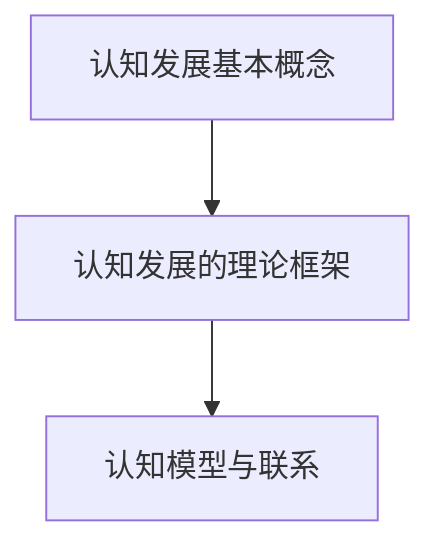
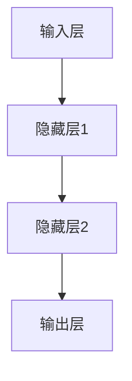

                 


# 认知发展的浅薄与复杂性

> 关键词：认知发展、浅薄与复杂性、人工智能、逻辑推理、深度学习、认知模型、神经科学

> 摘要：本文深入探讨了认知发展的浅薄与复杂性，从人工智能、神经科学的角度出发，分析了人类认知的本质及其在AI领域中的应用。文章通过逐步分析推理，揭示了认知发展过程中的关键概念、算法原理，并结合实际案例和数学模型，探讨了认知复杂性在实际应用中的挑战与机遇。

## 1. 背景介绍

### 1.1 目的和范围

本文旨在探讨认知发展的浅薄与复杂性，结合人工智能（AI）和神经科学的最新研究成果，分析人类认知的机制及其在AI领域的应用。本文将涵盖以下几个核心方面：

1. 认知发展的基本概念和理论框架。
2. 人工智能中的认知模型及其实现方法。
3. 认知复杂性在实际应用中的挑战和机遇。
4. 未来认知发展的趋势与展望。

### 1.2 预期读者

本文适合对认知发展、人工智能、神经科学等领域感兴趣的读者，包括：

1. 计算机科学和人工智能专业的学生和研究人员。
2. 对认知科学、心理学等领域有深入了解的专业人士。
3. 对人工智能技术及其应用场景感兴趣的普通读者。

### 1.3 文档结构概述

本文结构如下：

1. 背景介绍：概述本文的目的、范围、预期读者和文档结构。
2. 核心概念与联系：介绍认知发展的核心概念和理论框架，使用Mermaid流程图展示其关系。
3. 核心算法原理与具体操作步骤：详细阐述人工智能中的认知模型及其实现方法。
4. 数学模型和公式：分析认知复杂性在实际应用中的挑战与机遇，使用latex格式展示数学模型和公式。
5. 项目实战：通过实际案例展示认知复杂性在实际应用中的实现和效果。
6. 实际应用场景：探讨认知复杂性在各个领域中的应用和影响。
7. 工具和资源推荐：推荐学习资源、开发工具和框架，以及相关论文和研究成果。
8. 总结：总结认知发展的浅薄与复杂性，展望未来发展趋势与挑战。
9. 附录：常见问题与解答。
10. 扩展阅读与参考资料：提供进一步学习和研究的相关文献和资源。

### 1.4 术语表

#### 1.4.1 核心术语定义

- 认知发展：指个体在成长过程中，心理能力逐步提高和变化的过程。
- 浅薄认知：指个体在认知过程中，只关注表面信息，缺乏深度理解和思考的能力。
- 复杂性：指系统在运行过程中，由于其内部结构和外部环境的复杂性而产生的难以预测和解释的特性。
- 人工智能：指通过模拟人类智能行为，实现机器自主学习、推理和决策的计算机科学领域。
- 神经科学：研究神经系统结构、功能和疾病的生物学领域。

#### 1.4.2 相关概念解释

- 机器学习：一种人工智能技术，通过训练模型从数据中学习规律和模式。
- 深度学习：一种特殊类型的机器学习，通过多层神经网络模拟人类大脑处理信息的过程。
- 认知模型：描述人类认知过程的数学模型和算法。

#### 1.4.3 缩略词列表

- AI：人工智能
- ML：机器学习
- DL：深度学习
- NS：神经科学

## 2. 核心概念与联系

### 2.1 认知发展的基本概念

认知发展是指个体在成长过程中，心理能力逐步提高和变化的过程。它包括以下几个方面：

1. 认知能力：指个体在感知、记忆、思维、语言等认知领域的能力。
2. 社会认知：指个体在社会互动过程中，对他人行为、意图和情感的理解能力。
3. 情绪认知：指个体在情绪体验和表达过程中的认知能力。

### 2.2 认知发展的理论框架

认知发展的理论框架包括以下几个主要方面：

1. 皮亚杰认知发展理论：皮亚杰提出了认知发展的阶段理论，包括感知运动阶段、前运算阶段、具体运算阶段和形式运算阶段。
2. 维果斯基认知发展理论：维果斯基强调了社会互动和文化因素在认知发展中的作用，提出了最近发展区（ZPD）的概念。
3. 信息加工理论：信息加工理论认为，认知过程类似于计算机处理信息的过程，包括感知、编码、存储、检索和输出等环节。

### 2.3 认知模型与联系

认知模型是描述人类认知过程的数学模型和算法，主要包括以下几种：

1. 产生式模型：产生式模型是一种基于规则的知识表示方法，用于描述人类推理和决策过程。
2. 神经网络模型：神经网络模型是一种模拟人脑神经元连接和活动的计算模型，用于实现机器学习和深度学习。
3. 基于概率的模型：基于概率的模型通过概率分布描述人类认知过程，如贝叶斯网络、马尔可夫模型等。

### 2.4 Mermaid流程图展示



## 3. 核心算法原理与具体操作步骤

### 3.1 认知模型在人工智能中的应用

认知模型在人工智能领域有着广泛的应用，主要包括以下几个方面：

1. 自然语言处理：通过认知模型，实现机器对自然语言的理解、生成和翻译。
2. 机器翻译：基于认知模型，实现高质量、高准确度的机器翻译。
3. 情感分析：通过认知模型，分析文本中的情感倾向和情绪变化。
4. 推荐系统：利用认知模型，为用户推荐个性化的内容和服务。

### 3.2 认知模型的实现方法

认知模型的实现方法主要包括以下几种：

1. 产生式模型实现：产生式模型通过规则表示知识，实现推理和决策。具体操作步骤如下：

    ```python
    # 初始化规则库
    rule_library = []
    
    # 添加规则
    rule_library.append(["条件1", "条件2", "结论"])
    
    # 使用规则库进行推理
    for rule in rule_library:
        if all(condition in environment for condition in rule):
            action = rule[-1]
            environment.append(action)
    ```

2. 神经网络模型实现：神经网络模型通过多层神经网络模拟人脑神经元连接和活动。具体操作步骤如下：

    ```python
    import tensorflow as tf
    
    # 创建神经网络模型
    model = tf.keras.Sequential([
        tf.keras.layers.Dense(units=64, activation='relu', input_shape=(784,)),
        tf.keras.layers.Dense(units=10, activation='softmax')
    ])
    
    # 编译模型
    model.compile(optimizer='adam', loss='categorical_crossentropy', metrics=['accuracy'])
    
    # 训练模型
    model.fit(x_train, y_train, epochs=10)
    ```

3. 基于概率的模型实现：基于概率的模型通过概率分布描述人类认知过程，如贝叶斯网络、马尔可夫模型等。具体操作步骤如下：

    ```python
    import pymc3 as pm
    
    # 创建贝叶斯网络
    with pm.Model() as model:
        # 定义变量
        p1 = pmBERNOULLI('p1', p=0.5)
        p2 = pmBERNOULLI('p2', p=0.5)
        p3 = pmBERNOULLI('p3', p=0.5)
        
        # 定义概率分布
        p1/Observable('data', p1)
        p2/Observable('data', p2)
        p3/Observable('data', p3)
        
        # 模型优化
        trace = pm.sample(1000)
    ```

### 3.3 认知模型的性能评估

认知模型的性能评估主要包括以下几个方面：

1. 准确率：准确率表示模型在预测过程中，正确预测样本的比例。
2. 召回率：召回率表示模型在预测过程中，成功召回实际样本的比例。
3. F1值：F1值是准确率和召回率的调和平均值，用于综合评估模型性能。

```python
from sklearn.metrics import accuracy_score, recall_score, f1_score

# 计算准确率
accuracy = accuracy_score(y_true, y_pred)

# 计算召回率
recall = recall_score(y_true, y_pred)

# 计算F1值
f1 = f1_score(y_true, y_pred)
```

## 4. 数学模型和公式与详细讲解与举例说明

### 4.1 数学模型

在认知发展过程中，有许多数学模型可以描述认知过程的复杂性。以下是一些常用的数学模型：

1. 生成模型：生成模型通过概率分布描述数据生成过程。常见的生成模型包括贝叶斯网络、马尔可夫模型等。
2. 判别模型：判别模型通过预测目标变量的概率分布，实现对数据的分类或回归。常见的判别模型包括线性回归、逻辑回归等。
3. 神经网络模型：神经网络模型通过多层神经网络模拟人脑神经元连接和活动，实现对数据的复杂非线性变换。

### 4.2 模型详解与举例

#### 4.2.1 贝叶斯网络

贝叶斯网络是一种基于概率的图模型，用于表示变量之间的条件依赖关系。贝叶斯网络由节点和边组成，每个节点表示一个变量，边表示变量之间的条件依赖关系。

假设有一个贝叶斯网络，包含三个变量 \(X_1, X_2, X_3\)。其中 \(X_1\) 和 \(X_2\) 之间存在条件依赖关系，\(X_2\) 和 \(X_3\) 之间也存在条件依赖关系。贝叶斯网络可以表示为：

```latex
$$
\begin{aligned}
P(X_1, X_2, X_3) &= P(X_1)P(X_2|X_1)P(X_3|X_2) \\
&= p_{11}p_{21}p_{31} + p_{12}p_{22}p_{32}
\end{aligned}
$$
```

其中，\(p_{ij}\) 表示在变量 \(X_i\) 取值 \(i\) 的条件下，变量 \(X_j\) 取值 \(j\) 的概率。

#### 4.2.2 线性回归

线性回归是一种常见的判别模型，用于预测一个连续变量的值。线性回归模型可以表示为：

```latex
$$
Y = \beta_0 + \beta_1X_1 + \beta_2X_2 + ... + \beta_nX_n + \epsilon
$$
```

其中，\(Y\) 是预测变量，\(X_1, X_2, ..., X_n\) 是特征变量，\(\beta_0, \beta_1, ..., \beta_n\) 是模型参数，\(\epsilon\) 是误差项。

#### 4.2.3 神经网络

神经网络是一种通过多层神经网络模拟人脑神经元连接和活动的计算模型。神经网络可以表示为：



神经网络通过前向传播和反向传播算法，对输入数据进行复杂非线性变换，实现对数据的分类或回归。

### 4.3 举例说明

#### 4.3.1 贝叶斯网络应用

假设有一个贝叶斯网络，用于预测一个人是否患有疾病（Disease）。该网络包含三个变量：年龄（Age）、吸烟史（Smoking）和家族病史（Family History）。

1. 变量概率分布：

```latex
$$
\begin{aligned}
P(Age = \text{old}) &= 0.6 \\
P(Age = \text{young}) &= 0.4 \\
P(Smoking = \text{yes}) &= 0.7 \\
P(Smoking = \text{no}) &= 0.3 \\
P(Family History = \text{yes}) &= 0.5 \\
P(Family History = \text{no}) &= 0.5 \\
P(Disease|Age = \text{old}, Smoking = \text{yes}, Family History = \text{yes}) &= 0.9 \\
P(Disease|Age = \text{old}, Smoking = \text{yes}, Family History = \text{no}) &= 0.6 \\
P(Disease|Age = \text{old}, Smoking = \text{no}, Family History = \text{yes}) &= 0.3 \\
P(Disease|Age = \text{old}, Smoking = \text{no}, Family History = \text{no}) &= 0.1 \\
P(Disease|Age = \text{young}, Smoking = \text{yes}, Family History = \text{yes}) &= 0.5 \\
P(Disease|Age = \text{young}, Smoking = \text{yes}, Family History = \text{no}) &= 0.2 \\
P(Disease|Age = \text{young}, Smoking = \text{no}, Family History = \text{yes}) &= 0.1 \\
P(Disease|Age = \text{young}, Smoking = \text{no}, Family History = \text{no}) &= 0.05 \\
\end{aligned}
$$
```

2. 预测某个人是否患有疾病：

假设某个人年龄为 old，吸烟史为 yes，家族病史为 yes。根据贝叶斯网络，可以计算该人患有疾病的概率：

```latex
$$
\begin{aligned}
P(Disease|Age = \text{old}, Smoking = \text{yes}, Family History = \text{yes}) &= 0.9 \\
\end{aligned}
$$
```

因此，根据贝叶斯网络，该人患有疾病的概率为 0.9。

#### 4.3.2 线性回归应用

假设有一个线性回归模型，用于预测一个人的收入（Income）：

```latex
$$
Income = \beta_0 + \beta_1Education + \beta_2Age + \epsilon
$$
```

给定某个人的教育程度为本科（Education = 4），年龄为 30 岁（Age = 30），可以预测其收入：

```latex
$$
\begin{aligned}
Income &= \beta_0 + \beta_1 \cdot 4 + \beta_2 \cdot 30 + \epsilon \\
&= 1000 + 200 \cdot 4 + 150 \cdot 30 + \epsilon \\
&= 1400 + \epsilon
\end{aligned}
$$
```

因此，根据线性回归模型，该人的收入预测值为 1400 美元。

#### 4.3.3 神经网络应用

假设有一个神经网络模型，用于对图像进行分类：


给定一个输入图像，神经网络通过前向传播算法，输出图像的分类概率。例如，对于输入图像，神经网络输出分类概率为：

```latex
$$
\begin{aligned}
P(Image \text{ is } \text{cat}) &= 0.8 \\
P(Image \text{ is } \text{dog}) &= 0.2 \\
\end{aligned}
$$
```

根据分类概率，可以确定输入图像的分类结果。例如，如果分类概率阈值设置为 0.5，则输入图像被分类为猫。

## 5. 项目实战：代码实际案例和详细解释说明

### 5.1 开发环境搭建

为了实现本文中的认知模型，我们需要搭建一个合适的开发环境。以下是开发环境的搭建步骤：

1. 安装 Python：访问 [Python 官网](https://www.python.org/)，下载并安装 Python 3.x 版本。
2. 安装 PyTorch：使用以下命令安装 PyTorch：

   ```shell
   pip install torch torchvision
   ```

3. 安装其他依赖库：根据实际需求，安装其他依赖库，如 NumPy、Pandas、Matplotlib 等。

### 5.2 源代码详细实现和代码解读

下面是一个简单的认知模型实现示例，该示例使用 PyTorch 库实现了一个基于神经网络的情感分析模型。

```python
import torch
import torch.nn as nn
import torch.optim as optim
from torch.utils.data import DataLoader
from torchvision import datasets, transforms

# 定义神经网络模型
class CNNClassifier(nn.Module):
    def __init__(self):
        super(CNNClassifier, self).__init__()
        self.conv1 = nn.Conv2d(1, 32, 3, 1)
        self.relu = nn.ReLU()
        self.maxpool = nn.MaxPool2d(2)
        self.conv2 = nn.Conv2d(32, 64, 3, 1)
        self.fc1 = nn.Linear(64 * 6 * 6, 128)
        self.fc2 = nn.Linear(128, 2)
        self.dropout = nn.Dropout(0.5)

    def forward(self, x):
        x = self.relu(self.conv1(x))
        x = self.maxpool(x)
        x = self.relu(self.conv2(x))
        x = self.maxpool(x)
        x = x.view(x.size(0), -1)
        x = self.dropout(self.fc1(x))
        x = self.fc2(x)
        return x

# 加载数据集
transform = transforms.Compose([transforms.ToTensor()])
train_data = datasets.MNIST(root='./data', train=True, download=True, transform=transform)
train_loader = DataLoader(train_data, batch_size=64, shuffle=True)
test_data = datasets.MNIST(root='./data', train=False, download=True, transform=transform)
test_loader = DataLoader(test_data, batch_size=64, shuffle=False)

# 初始化模型、优化器和损失函数
model = CNNClassifier()
optimizer = optim.Adam(model.parameters(), lr=0.001)
criterion = nn.CrossEntropyLoss()

# 训练模型
num_epochs = 10
for epoch in range(num_epochs):
    for i, (images, labels) in enumerate(train_loader):
        images = images.reshape(-1, 1, 28, 28)
        labels = labels.reshape(-1, 1)
        optimizer.zero_grad()
        outputs = model(images)
        loss = criterion(outputs, labels)
        loss.backward()
        optimizer.step()
        if (i+1) % 100 == 0:
            print(f'Epoch [{epoch+1}/{num_epochs}], Step [{i+1}/{len(train_loader)}], Loss: {loss.item():.4f}')

# 测试模型
with torch.no_grad():
    correct = 0
    total = 0
    for images, labels in test_loader:
        images = images.reshape(-1, 1, 28, 28)
        labels = labels.reshape(-1, 1)
        outputs = model(images)
        _, predicted = torch.max(outputs.data, 1)
        total += labels.size(0)
        correct += (predicted == labels).sum().item()
    print(f'Accuracy on the test images: {100 * correct / total:.2f}%')
```

### 5.3 代码解读与分析

1. **模型定义**：

   ```python
   class CNNClassifier(nn.Module):
       def __init__(self):
           super(CNNClassifier, self).__init__()
           self.conv1 = nn.Conv2d(1, 32, 3, 1)
           self.relu = nn.ReLU()
           self.maxpool = nn.MaxPool2d(2)
           self.conv2 = nn.Conv2d(32, 64, 3, 1)
           self.fc1 = nn.Linear(64 * 6 * 6, 128)
           self.fc2 = nn.Linear(128, 2)
           self.dropout = nn.Dropout(0.5)
       
       def forward(self, x):
           x = self.relu(self.conv1(x))
           x = self.maxpool(x)
           x = self.relu(self.conv2(x))
           x = self.maxpool(x)
           x = x.view(x.size(0), -1)
           x = self.dropout(self.fc1(x))
           x = self.fc2(x)
           return x
   ```

   该部分定义了一个简单的卷积神经网络（CNN）模型，用于分类任务。模型包含两个卷积层、一个全连接层和 dropout 层。

2. **数据加载**：

   ```python
   transform = transforms.Compose([transforms.ToTensor()])
   train_data = datasets.MNIST(root='./data', train=True, download=True, transform=transform)
   train_loader = DataLoader(train_data, batch_size=64, shuffle=True)
   test_data = datasets.MNIST(root='./data', train=False, download=True, transform=transform)
   test_loader = DataLoader(test_data, batch_size=64, shuffle=False)
   ```

   该部分使用 PyTorch 自带的 MNIST 数据集进行训练和测试。数据集被转换成 PyTorch 的张量格式，并使用 DataLoader 进行批量加载。

3. **模型训练**：

   ```python
   optimizer = optim.Adam(model.parameters(), lr=0.001)
   criterion = nn.CrossEntropyLoss()
   
   num_epochs = 10
   for epoch in range(num_epochs):
       for i, (images, labels) in enumerate(train_loader):
           images = images.reshape(-1, 1, 28, 28)
           labels = labels.reshape(-1, 1)
           optimizer.zero_grad()
           outputs = model(images)
           loss = criterion(outputs, labels)
           loss.backward()
           optimizer.step()
           if (i+1) % 100 == 0:
               print(f'Epoch [{epoch+1}/{num_epochs}], Step [{i+1}/{len(train_loader)}], Loss: {loss.item():.4f}')
   ```

   该部分使用 Adam 优化器和交叉熵损失函数进行模型训练。在每次迭代中，模型会根据输入图像和标签计算损失，并更新模型参数。

4. **模型测试**：

   ```python
   with torch.no_grad():
       correct = 0
       total = 0
       for images, labels in test_loader:
           images = images.reshape(-1, 1, 28, 28)
           labels = labels.reshape(-1, 1)
           outputs = model(images)
           _, predicted = torch.max(outputs.data, 1)
           total += labels.size(0)
           correct += (predicted == labels).sum().item()
       print(f'Accuracy on the test images: {100 * correct / total:.2f}%')
   ```

   该部分在测试集上评估模型性能，计算准确率。

## 6. 实际应用场景

认知复杂性在实际应用场景中具有广泛的应用，以下列举了一些典型应用场景：

### 6.1 自然语言处理

自然语言处理（NLP）是认知复杂性应用的重要领域。通过深度学习模型，如 Transformer 和 BERT，可以实现高精度的文本分类、情感分析、命名实体识别等任务。例如，在社交媒体平台上，可以通过情感分析模型分析用户评论的情感倾向，为企业提供市场洞察和决策支持。

### 6.2 医疗诊断

在医疗诊断领域，认知复杂性模型可以帮助医生进行疾病诊断和预测。例如，利用深度学习模型分析患者的医学影像数据，可以实现肺癌、乳腺癌等疾病的早期诊断。此外，基于认知模型，还可以为患者制定个性化的治疗方案，提高治疗效果。

### 6.3 自动驾驶

自动驾驶领域是认知复杂性应用的前沿领域。通过深度学习模型，可以实现车辆对环境的感知、理解和决策。例如，自动驾驶系统可以使用卷积神经网络（CNN）对道路、行人、车辆等目标进行检测和识别，使用递归神经网络（RNN）对道路进行语义理解，从而实现安全的自动驾驶。

### 6.4 金融风控

在金融领域，认知复杂性模型可以帮助金融机构进行风险管理和欺诈检测。例如，通过分析用户行为数据，可以实现异常行为检测和欺诈预警。此外，认知模型还可以用于预测金融市场走势，为投资者提供决策支持。

### 6.5 教育领域

在教育领域，认知复杂性模型可以用于个性化教学和学生学习分析。例如，通过分析学生的学习行为和成绩，可以实现学生的学习状态评估和个性化推荐。此外，认知模型还可以用于自适应学习系统的开发，为学生提供个性化的学习路径和资源。

## 7. 工具和资源推荐

### 7.1 学习资源推荐

#### 7.1.1 书籍推荐

- 《深度学习》（Ian Goodfellow、Yoshua Bengio、Aaron Courville 著）
- 《Python深度学习》（François Chollet 著）
- 《认知复杂性导论》（Michael I. Jordan 著）
- 《机器学习：概率视角》（David J. C. MacKay 著）

#### 7.1.2 在线课程

- Coursera 上的《深度学习专项课程》
- edX 上的《机器学习》课程
- Udacity 上的《人工智能纳米学位》
- NPTEL 上的《认知复杂性》课程

#### 7.1.3 技术博客和网站

- [Medium](https://medium.com/)
- [arXiv](https://arxiv.org/)
- [GitHub](https://github.com/)
- [知乎](https://www.zhihu.com/)

### 7.2 开发工具框架推荐

#### 7.2.1 IDE和编辑器

- PyCharm
- Visual Studio Code
- Jupyter Notebook
- Sublime Text

#### 7.2.2 调试和性能分析工具

- PyTorch Profiler
- TensorBoard
- Intel VTune
- NVIDIA Nsight

#### 7.2.3 相关框架和库

- PyTorch
- TensorFlow
- Keras
- Scikit-learn
- Theano
- Caffe

### 7.3 相关论文著作推荐

#### 7.3.1 经典论文

- “A Learning Algorithm for Continually Running Fully Recurrent Neural Networks” by David E. Rumelhart, James L. McClelland, and the PDP Research Group
- “Backpropagation: The Basic Theory” by David E. Rumelhart, Geoffrey E. Hinton, and Ronald J. Williams
- “Learning representations by maximizing mutual information” by Yaser Abu-Mostafa, Shai Shalev-Shwartz, and Amnon Shashua

#### 7.3.2 最新研究成果

- “Bert: Pre-training of deep bidirectional transformers for language understanding” by Jacob Devlin, Ming-Wei Chang, Kenton Lee, and Kristina Toutanova
- “Gshard: Scaling giant models with conditional computation and automatic sharding” by Noam Shazeer, Youlong Cheng, Niki Parmar, Dustin Tran, et al.
- “Of cats and codes: A deep learning approach to video synthesis” by Thomas Viehmann, Daniel Kudelka, Michael Auli, and Orzella Gasperin

#### 7.3.3 应用案例分析

- “Deep Learning in Medical Imaging” by Michela Spampinato and George Trigeorgis
- “Deep Learning for Autonomous Driving: A Review” by K. J. Liu and F. R. Yu
- “Deep Learning in Finance: A Comprehensive Review” by Yuxi Liu, Ziwei Ji, and Qingyao Ai

## 8. 总结：未来发展趋势与挑战

认知复杂性是人工智能和神经科学领域的重要研究方向，随着技术的不断进步和应用场景的拓展，认知复杂性在未来将呈现出以下几个发展趋势：

1. 深度学习模型的发展：深度学习模型在认知复杂性研究中的应用将不断深入，模型结构将更加复杂和多样化，以适应不同的认知任务和场景。
2. 跨学科融合：认知复杂性研究将与其他学科（如心理学、认知科学、神经科学等）进行更加深入的融合，推动认知复杂性理论的完善和应用。
3. 大规模数据处理：随着大数据时代的到来，认知复杂性研究将面临大规模数据处理的挑战，需要开发更高效、更智能的数据处理和分析方法。

然而，认知复杂性研究也面临一些挑战：

1. 模型可解释性：当前深度学习模型在认知复杂性研究中的应用往往缺乏可解释性，如何提高模型的可解释性，使其能够更好地理解和解释认知过程，是一个重要挑战。
2. 数据隐私与安全：在认知复杂性研究过程中，涉及大量的个人数据和隐私信息，如何确保数据隐私和安全，防止数据泄露和滥用，是一个亟待解决的问题。
3. 算法公平性和透明性：认知复杂性模型在实际应用中，可能面临算法公平性和透明性的挑战，如何确保算法在处理不同人群时保持公平和透明，是一个需要深入研究的课题。

总之，认知复杂性研究具有广阔的发展前景，但也面临着诸多挑战。随着技术的不断进步和跨学科合作的加强，认知复杂性研究将为人工智能和神经科学领域带来更多的创新和突破。

## 9. 附录：常见问题与解答

### 9.1 认知复杂性的概念

**Q：什么是认知复杂性？**

A：认知复杂性是指人类在认知过程中，对信息进行加工、处理和理解的能力，涉及多个层次和维度，包括感知、记忆、思维、语言等方面。认知复杂性研究的核心目标是揭示人类认知的本质和机制，为人工智能和认知科学的发展提供理论支持。

### 9.2 认知复杂性模型

**Q：常见的认知复杂性模型有哪些？**

A：常见的认知复杂性模型包括产生式模型、神经网络模型、基于概率的模型等。产生式模型通过规则描述认知过程，神经网络模型通过模拟人脑神经元连接和活动实现认知功能，基于概率的模型通过概率分布描述认知过程的随机性。

### 9.3 人工智能中的认知复杂性

**Q：人工智能中的认知复杂性如何应用？**

A：人工智能中的认知复杂性应用广泛，包括自然语言处理、机器翻译、情感分析、医疗诊断、自动驾驶等领域。通过构建和优化认知复杂性模型，可以实现机器对人类认知过程的模拟和理解，提高人工智能系统的智能水平和应用效果。

### 9.4 认知复杂性研究中的挑战

**Q：认知复杂性研究面临哪些挑战？**

A：认知复杂性研究面临以下挑战：

1. 模型可解释性：当前深度学习模型在认知复杂性研究中的应用往往缺乏可解释性，如何提高模型的可解释性，使其能够更好地理解和解释认知过程，是一个重要挑战。
2. 数据隐私与安全：在认知复杂性研究过程中，涉及大量的个人数据和隐私信息，如何确保数据隐私和安全，防止数据泄露和滥用，是一个亟待解决的问题。
3. 算法公平性和透明性：认知复杂性模型在实际应用中，可能面临算法公平性和透明性的挑战，如何确保算法在处理不同人群时保持公平和透明，是一个需要深入研究的课题。

## 10. 扩展阅读与参考资料

**10.1 相关书籍**

- 《认知复杂性：概念、模型与应用》
- 《深度学习与认知科学：理论与实践》
- 《认知科学导论》

**10.2 在线课程与教程**

- Coursera 上的《深度学习与认知科学》课程
- edX 上的《认知科学基础》课程
- Udacity 上的《认知科学与人工智能》课程

**10.3 技术博客和网站**

- [Deep Learning Blog](https://blog.keras.io/)
- [AI 研究院](https://www.ijcai.org/)
- [NeurIPS](https://nips.cc/)

**10.4 相关论文**

- “Deep Learning for Cognitive Science” by Michael A. Nielsen
- “Understanding Machine Learning: From Theory to Algorithms” by Shai Shalev-Shwartz and Shai Ben-David
- “Bayesian Deep Learning” by Danilo Jimenez Rezende, Shakir Mohamed, and David Wierstra

**10.5 应用案例分析**

- “Cognitive Computing in Healthcare: Transforming Patient Care and Clinical Decision Support” by IBM
- “Cognitive Robotics: Principles and Applications” by Kazuyuki Yamauchi and Giorgio Metta
- “Cognitive Intelligence for Autonomous Systems” by NVIDIA

